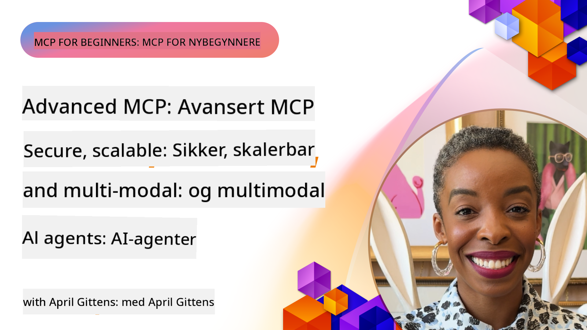

<!--
CO_OP_TRANSLATOR_METADATA:
{
  "original_hash": "d204bc94ea6027d06a703b21b711ca57",
  "translation_date": "2025-08-18T15:38:01+00:00",
  "source_file": "05-AdvancedTopics/README.md",
  "language_code": "no"
}
-->
# Avanserte emner i MCP

_(Klikk på bildet over for å se videoen til denne leksjonen)_

Dette kapittelet dekker en rekke avanserte emner innen implementering av Model Context Protocol (MCP), inkludert multimodal integrasjon, skalerbarhet, sikkerhetsprinsipper og integrasjon i bedriftsmiljøer. Disse temaene er avgjørende for å bygge robuste og produksjonsklare MCP-applikasjoner som oppfyller kravene til moderne AI-systemer.

## Oversikt

Denne leksjonen utforsker avanserte konsepter i implementeringen av Model Context Protocol, med fokus på multimodal integrasjon, skalerbarhet, sikkerhetsprinsipper og bedriftsintegrasjon. Disse temaene er essensielle for å bygge MCP-applikasjoner av produksjonskvalitet som kan håndtere komplekse krav i bedriftsmiljøer.

## Læringsmål

Etter denne leksjonen skal du kunne:

- Implementere multimodale funksjoner i MCP-rammeverk
- Designe skalerbare MCP-arkitekturer for høybelastningsscenarier
- Anvende sikkerhetsprinsipper i tråd med MCPs sikkerhetsretningslinjer
- Integrere MCP med bedrifts-AI-systemer og rammeverk
- Optimalisere ytelse og pålitelighet i produksjonsmiljøer

## Leksjoner og eksempler

| Lenke | Tittel | Beskrivelse |
|-------|--------|-------------|
| [5.1 Integrasjon med Azure](./mcp-integration/README.md) | Integrer med Azure | Lær hvordan du integrerer MCP-serveren din på Azure |
| [5.2 Multimodale eksempler](./mcp-multi-modality/README.md) | MCP Multimodale eksempler | Eksempler på lyd, bilde og multimodale svar |
| [5.3 MCP OAuth2-eksempel](../../../05-AdvancedTopics/mcp-oauth2-demo) | MCP OAuth2-demo | Minimal Spring Boot-app som viser OAuth2 med MCP, både som autorisasjons- og ressursserver. Demonstrerer sikker tokenutstedelse, beskyttede endepunkter, distribusjon i Azure Container Apps og integrasjon med API Management. |
| [5.4 Rotkontekster](./mcp-root-contexts/README.md) | Rotkontekster | Lær mer om rotkontekster og hvordan du implementerer dem |
| [5.5 Ruting](./mcp-routing/README.md) | Ruting | Lær om ulike typer ruting |
| [5.6 Sampling](./mcp-sampling/README.md) | Sampling | Lær hvordan du arbeider med sampling |
| [5.7 Skalering](./mcp-scaling/README.md) | Skalering | Lær om skalering |
| [5.8 Sikkerhet](./mcp-security/README.md) | Sikkerhet | Sikre MCP-serveren din |
| [5.9 Websøkeeksempel](./web-search-mcp/README.md) | Websøke-MCP | Python MCP-server og klient som integrerer med SerpAPI for sanntidssøk på nett, nyheter, produkter og Q&A. Demonstrerer multitool-orkestrering, ekstern API-integrasjon og robust feilhåndtering. |
| [5.10 Sanntidsstrømming](./mcp-realtimestreaming/README.md) | Strømming | Sanntidsdatabehandling har blitt essensielt i dagens datadrevne verden, hvor virksomheter og applikasjoner krever umiddelbar tilgang til informasjon for å ta raske beslutninger. |
| [5.11 Sanntidssøk på nett](./mcp-realtimesearch/README.md) | Websøking | Hvordan MCP transformerer sanntidssøk på nett ved å tilby en standardisert tilnærming til kontekststyring på tvers av AI-modeller, søkemotorer og applikasjoner. |
| [5.12 Entra ID-autentisering for MCP-servere](./mcp-security-entra/README.md) | Entra ID-autentisering | Microsoft Entra ID gir en robust skybasert løsning for identitets- og tilgangsstyring, som sikrer at kun autoriserte brukere og applikasjoner kan samhandle med MCP-serveren din. |
| [5.13 Azure AI Foundry-agentintegrasjon](./mcp-foundry-agent-integration/README.md) | Azure AI Foundry-integrasjon | Lær hvordan du integrerer MCP-servere med Azure AI Foundry-agenter, som muliggjør kraftig verktøyorkestrering og bedrifts-AI-funksjoner med standardiserte tilkoblinger til eksterne datakilder. |
| [5.14 Kontekstutvikling](./mcp-contextengineering/README.md) | Kontekstutvikling | Fremtidige muligheter innen kontekstutviklingsteknikker for MCP-servere, inkludert kontekstoptimalisering, dynamisk kontekststyring og strategier for effektiv prompt engineering i MCP-rammeverk. |

## Ytterligere referanser

For den mest oppdaterte informasjonen om avanserte MCP-emner, se:
- [MCP-dokumentasjon](https://modelcontextprotocol.io/)
- [MCP-spesifikasjon](https://spec.modelcontextprotocol.io/)
- [GitHub-repositorium](https://github.com/modelcontextprotocol)

## Viktige punkter

- Multimodale MCP-implementeringer utvider AI-funksjonalitet utover tekstbehandling
- Skalering er avgjørende for bedriftsdistribusjoner og kan oppnås gjennom horisontal og vertikal skalering
- Omfattende sikkerhetstiltak beskytter data og sikrer riktig tilgangskontroll
- Integrasjon med plattformer som Azure OpenAI og Microsoft AI Foundry forbedrer MCP-funksjonalitet
- Avanserte MCP-implementeringer drar nytte av optimaliserte arkitekturer og nøye ressursstyring

## Oppgave

Design en MCP-implementering av bedriftskvalitet for et spesifikt bruksområde:

1. Identifiser multimodale krav for ditt bruksområde
2. Skisser sikkerhetskontroller som trengs for å beskytte sensitiv data
3. Design en skalerbar arkitektur som kan håndtere varierende belastning
4. Planlegg integrasjonspunkter med bedrifts-AI-systemer
5. Dokumenter potensielle ytelsesflaskehalser og strategier for å håndtere dem

## Ytterligere ressurser

- [Azure OpenAI-dokumentasjon](https://learn.microsoft.com/en-us/azure/ai-services/openai/)
- [Microsoft AI Foundry-dokumentasjon](https://learn.microsoft.com/en-us/ai-services/)

---

## Hva kommer neste

- [5.1 MCP-integrasjon](./mcp-integration/README.md)

**Ansvarsfraskrivelse**:  
Dette dokumentet er oversatt ved hjelp av AI-oversettelsestjenesten [Co-op Translator](https://github.com/Azure/co-op-translator). Selv om vi streber etter nøyaktighet, vær oppmerksom på at automatiserte oversettelser kan inneholde feil eller unøyaktigheter. Det originale dokumentet på sitt opprinnelige språk bør anses som den autoritative kilden. For kritisk informasjon anbefales profesjonell menneskelig oversettelse. Vi er ikke ansvarlige for misforståelser eller feiltolkninger som oppstår ved bruk av denne oversettelsen.