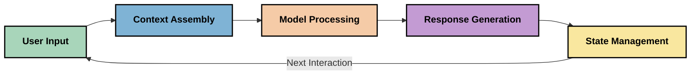
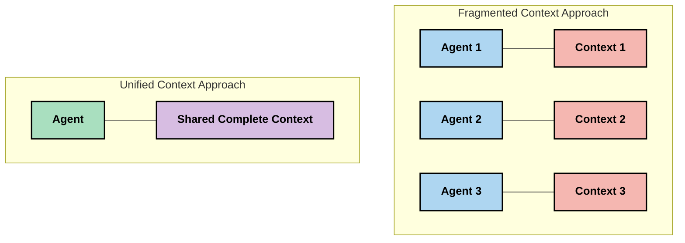
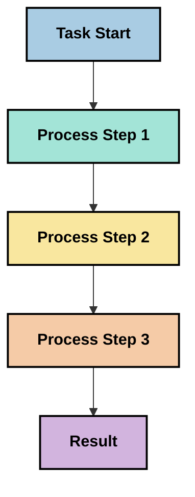
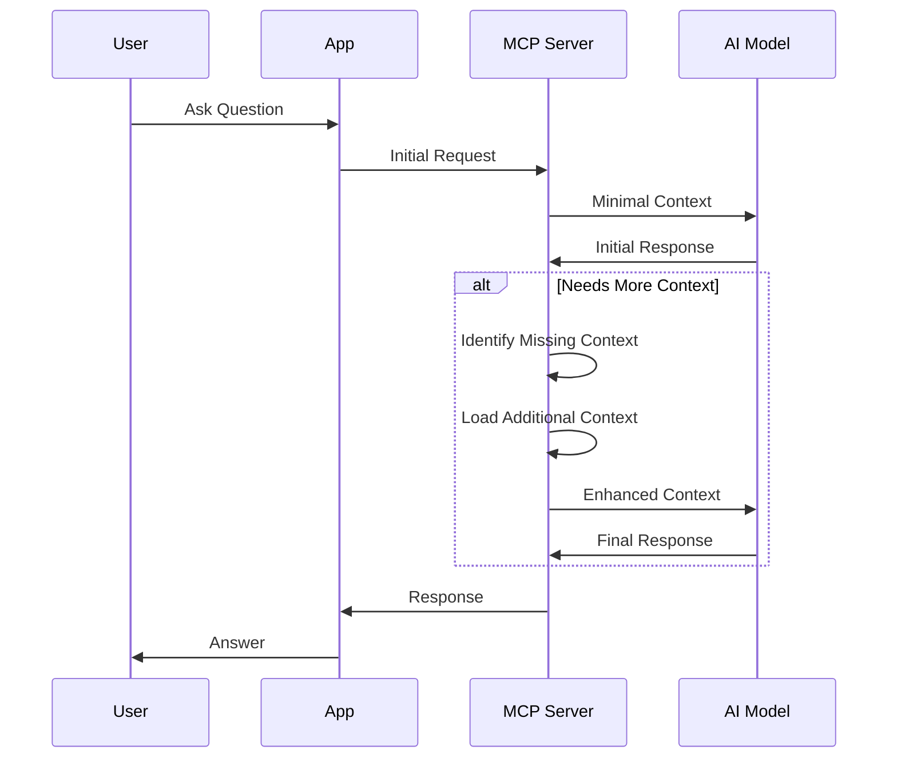
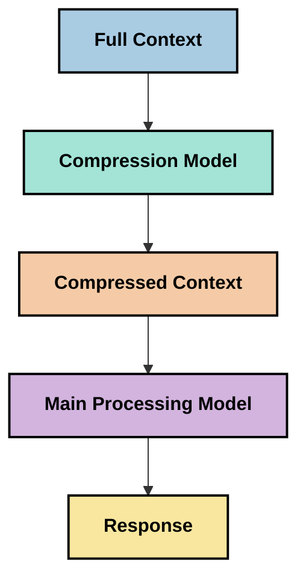

<!--
CO_OP_TRANSLATOR_METADATA:
{
  "original_hash": "fd169ca3071b81b5ee282e194bc823df",
  "translation_date": "2025-09-15T20:37:38+00:00",
  "source_file": "05-AdvancedTopics/mcp-contextengineering/README.md",
  "language_code": "no"
}
-->
# Kontekstteknikk: Et Fremvoksende Konsept i MCP-Økosystemet

## Oversikt

Kontekstteknikk er et fremvoksende konsept innen AI som utforsker hvordan informasjon struktureres, leveres og vedlikeholdes gjennom interaksjoner mellom klienter og AI-tjenester. Etter hvert som Model Context Protocol (MCP)-økosystemet utvikler seg, blir det stadig viktigere å forstå hvordan man effektivt kan håndtere kontekst. Denne modulen introduserer konseptet kontekstteknikk og utforsker potensielle anvendelser i MCP-implementeringer.

## Læringsmål

Ved slutten av denne modulen vil du kunne:

- Forstå det fremvoksende konseptet kontekstteknikk og dens potensielle rolle i MCP-applikasjoner
- Identifisere nøkkelutfordringer i konteksthåndtering som MCP-protokollens design adresserer
- Utforske teknikker for å forbedre modellens ytelse gjennom bedre konteksthåndtering
- Vurdere tilnærminger for å måle og evaluere konteksteffektivitet
- Anvende disse fremvoksende konseptene for å forbedre AI-opplevelser gjennom MCP-rammeverket

## Introduksjon til Kontekstteknikk

Kontekstteknikk er et fremvoksende konsept som fokuserer på bevisst design og håndtering av informasjonsflyt mellom brukere, applikasjoner og AI-modeller. I motsetning til etablerte felt som promptteknikk, er kontekstteknikk fortsatt under utvikling av fagfolk som jobber med å løse de unike utfordringene ved å gi AI-modeller riktig informasjon til riktig tid.

Etter hvert som store språkmodeller (LLMs) har utviklet seg, har viktigheten av kontekst blitt stadig tydeligere. Kvaliteten, relevansen og strukturen til konteksten vi gir, påvirker modellens resultater direkte. Kontekstteknikk utforsker dette forholdet og søker å utvikle prinsipper for effektiv konteksthåndtering.

> "I 2025 er modellene der ute ekstremt intelligente. Men selv den smarteste personen vil ikke kunne gjøre jobben sin effektivt uten konteksten for hva de blir bedt om å gjøre... 'Kontekstteknikk' er neste nivå av promptteknikk. Det handler om å gjøre dette automatisk i et dynamisk system." — Walden Yan, Cognition AI

Kontekstteknikk kan omfatte:

1. **Kontekstvalg**: Bestemme hvilken informasjon som er relevant for en gitt oppgave
2. **Kontekststrukturering**: Organisere informasjon for å maksimere modellens forståelse
3. **Kontekstlevering**: Optimalisere hvordan og når informasjon sendes til modeller
4. **Kontekstvedlikehold**: Håndtere tilstanden og utviklingen av kontekst over tid
5. **Kontekstevaluering**: Måle og forbedre effektiviteten av kontekst

Disse fokusområdene er spesielt relevante for MCP-økosystemet, som gir en standardisert måte for applikasjoner å gi kontekst til LLMs.

## Perspektivet om Kontekstreisen

En måte å visualisere kontekstteknikk på er å spore reisen informasjon tar gjennom et MCP-system:



### Nøkkelstadier i Kontekstreisen:

1. **Brukerinndata**: Råinformasjon fra brukeren (tekst, bilder, dokumenter)
2. **Kontekstsamling**: Kombinere brukerinndata med systemkontekst, samtalehistorikk og annen hentet informasjon
3. **Modellbehandling**: AI-modellen behandler den sammensatte konteksten
4. **Responsgenerering**: Modellen produserer resultater basert på den gitte konteksten
5. **Tilstandshåndtering**: Systemet oppdaterer sin interne tilstand basert på interaksjonen

Dette perspektivet fremhever den dynamiske naturen til kontekst i AI-systemer og reiser viktige spørsmål om hvordan man best kan håndtere informasjon på hvert stadium.

## Fremvoksende Prinsipper i Kontekstteknikk

Etter hvert som feltet kontekstteknikk tar form, begynner noen tidlige prinsipper å dukke opp fra fagfolk. Disse prinsippene kan bidra til å informere MCP-implementeringsvalg:

### Prinsipp 1: Del Kontekst Fullstendig

Kontekst bør deles fullstendig mellom alle komponenter i et system, i stedet for å være fragmentert på tvers av flere agenter eller prosesser. Når kontekst er distribuert, kan beslutninger tatt i én del av systemet komme i konflikt med beslutninger tatt andre steder.



I MCP-applikasjoner antyder dette å designe systemer der kontekst flyter sømløst gjennom hele rørledningen i stedet for å være oppdelt.

### Prinsipp 2: Anerkjenn at Handlinger Inneholder Implisitte Beslutninger

Hver handling en modell utfører, inneholder implisitte beslutninger om hvordan konteksten skal tolkes. Når flere komponenter handler på forskjellige kontekster, kan disse implisitte beslutningene komme i konflikt, noe som fører til inkonsekvente resultater.

Dette prinsippet har viktige implikasjoner for MCP-applikasjoner:
- Foretrekk lineær behandling av komplekse oppgaver fremfor parallell utførelse med fragmentert kontekst
- Sørg for at alle beslutningspunkter har tilgang til samme kontekstuelle informasjon
- Design systemer der senere trinn kan se hele konteksten til tidligere beslutninger

### Prinsipp 3: Balanser Kontekstdybde med Vindusbegrensninger

Etter hvert som samtaler og prosesser blir lengre, vil kontekstvinduer til slutt bli overfylt. Effektiv kontekstteknikk utforsker tilnærminger for å håndtere denne spenningen mellom omfattende kontekst og tekniske begrensninger.

Potensielle tilnærminger som utforskes inkluderer:
- Kontekstkomprimering som opprettholder essensiell informasjon samtidig som tokenbruk reduseres
- Progressiv innlasting av kontekst basert på relevans for nåværende behov
- Sammendrag av tidligere interaksjoner samtidig som viktige beslutninger og fakta bevares

## Kontekstutfordringer og MCP-Protokolldesign

Model Context Protocol (MCP) ble designet med en bevissthet om de unike utfordringene ved konteksthåndtering. Å forstå disse utfordringene hjelper med å forklare nøkkelaspekter ved MCP-protokolldesignet:

### Utfordring 1: Begrensninger i Kontekstvindu
De fleste AI-modeller har faste kontekstvindustørrelser, noe som begrenser hvor mye informasjon de kan behandle samtidig.

**MCP Designrespons:** 
- Protokollen støtter strukturert, ressursbasert kontekst som kan refereres effektivt
- Ressurser kan pagineres og lastes inn progressivt

### Utfordring 2: Relevansbestemmelse
Å bestemme hvilken informasjon som er mest relevant å inkludere i konteksten er vanskelig.

**MCP Designrespons:**
- Fleksible verktøy tillater dynamisk henting av informasjon basert på behov
- Strukturerte prompts muliggjør konsistent kontekstorganisering

### Utfordring 3: Kontekstpersistens
Å håndtere tilstand på tvers av interaksjoner krever nøye sporing av kontekst.

**MCP Designrespons:**
- Standardisert sesjonshåndtering
- Tydelig definerte interaksjonsmønstre for kontekstevolusjon

### Utfordring 4: Multimodal Kontekst
Ulike typer data (tekst, bilder, strukturert data) krever forskjellig håndtering.

**MCP Designrespons:**
- Protokolldesign tilpasser seg ulike innholdstyper
- Standardisert representasjon av multimodal informasjon

### Utfordring 5: Sikkerhet og Personvern
Kontekst inneholder ofte sensitiv informasjon som må beskyttes.

**MCP Designrespons:**
- Klare grenser mellom klient- og serveransvar
- Lokale behandlingsalternativer for å minimere dataeksponering

Å forstå disse utfordringene og hvordan MCP adresserer dem gir et grunnlag for å utforske mer avanserte kontekstteknikker.

## Fremvoksende Tilnærminger til Kontekstteknikk

Etter hvert som feltet kontekstteknikk utvikler seg, dukker flere lovende tilnærminger opp. Disse representerer nåværende tenkning snarere enn etablerte beste praksiser, og vil sannsynligvis utvikle seg etter hvert som vi får mer erfaring med MCP-implementeringer.

### 1. Enkelttrådet Lineær Behandling

I motsetning til multi-agent-arkitekturer som distribuerer kontekst, finner noen fagfolk at enkelttrådet lineær behandling gir mer konsistente resultater. Dette samsvarer med prinsippet om å opprettholde enhetlig kontekst.



Selv om denne tilnærmingen kan virke mindre effektiv enn parallell behandling, gir den ofte mer sammenhengende og pålitelige resultater fordi hvert trinn bygger på en fullstendig forståelse av tidligere beslutninger.

### 2. Kontekstdeling og Prioritering

Bryte store kontekster i håndterbare deler og prioritere det som er viktigst.

```python
# Conceptual Example: Context Chunking and Prioritization
def process_with_chunked_context(documents, query):
    # 1. Break documents into smaller chunks
    chunks = chunk_documents(documents)
    
    # 2. Calculate relevance scores for each chunk
    scored_chunks = [(chunk, calculate_relevance(chunk, query)) for chunk in chunks]
    
    # 3. Sort chunks by relevance score
    sorted_chunks = sorted(scored_chunks, key=lambda x: x[1], reverse=True)
    
    # 4. Use the most relevant chunks as context
    context = create_context_from_chunks([chunk for chunk, score in sorted_chunks[:5]])
    
    # 5. Process with the prioritized context
    return generate_response(context, query)
```

Konseptet ovenfor illustrerer hvordan vi kan dele store dokumenter i håndterbare deler og velge kun de mest relevante delene for kontekst. Denne tilnærmingen kan bidra til å arbeide innenfor kontekstvindubegrensninger samtidig som man utnytter store kunnskapsbaser.

### 3. Progressiv Kontekstinnlasting

Laste inn kontekst progressivt etter behov i stedet for alt på en gang.



Progressiv kontekstinnlasting starter med minimal kontekst og utvides kun når det er nødvendig. Dette kan betydelig redusere tokenbruk for enkle forespørsler samtidig som man opprettholder evnen til å håndtere komplekse spørsmål.

### 4. Kontekstkomprimering og Sammendrag

Redusere kontekststørrelse samtidig som essensiell informasjon bevares.



Kontekstkomprimering fokuserer på:
- Fjerne redundant informasjon
- Sammendrag av lang innhold
- Uthenting av nøkkelfakta og detaljer
- Bevaring av kritiske kontekstelementer
- Optimalisering for tokeneffektivitet

Denne tilnærmingen kan være spesielt verdifull for å opprettholde lange samtaler innenfor kontekstvinduer eller for effektiv behandling av store dokumenter. Noen fagfolk bruker spesialiserte modeller spesielt for kontekstkomprimering og sammendrag av samtalehistorikk.

## Utforskende Overveielser for Kontekstteknikk

Når vi utforsker det fremvoksende feltet kontekstteknikk, er det flere overveielser som er verdt å ha i tankene når man arbeider med MCP-implementeringer. Dette er ikke preskriptive beste praksiser, men snarere områder for utforskning som kan gi forbedringer i din spesifikke brukstilfelle.

### Vurder Dine Kontekstmål

Før du implementerer komplekse konteksthåndteringsløsninger, artikuler tydelig hva du prøver å oppnå:
- Hvilken spesifikk informasjon trenger modellen for å lykkes?
- Hvilken informasjon er essensiell versus supplerende?
- Hva er dine ytelsesbegrensninger (latens, tokenbegrensninger, kostnader)?

### Utforsk Lagdelte Konteksttilnærminger

Noen fagfolk opplever suksess med kontekst arrangert i konseptuelle lag:
- **Kjernelag**: Essensiell informasjon modellen alltid trenger
- **Situasjonslag**: Kontekst spesifikk for den nåværende interaksjonen
- **Støttelag**: Tilleggsinformasjon som kan være nyttig
- **Fallback-lag**: Informasjon som kun hentes når det er nødvendig

### Undersøk Hentingsstrategier

Effektiviteten av din kontekst avhenger ofte av hvordan du henter informasjon:
- Semantisk søk og embeddings for å finne konseptuelt relevant informasjon
- Søkeordbasert søk for spesifikke faktuelle detaljer
- Hybridtilnærminger som kombinerer flere hentingsmetoder
- Metadatafiltrering for å begrense omfang basert på kategorier, datoer eller kilder

### Eksperimenter med Kontekstsammenheng

Strukturen og flyten av din kontekst kan påvirke modellens forståelse:
- Gruppere relatert informasjon sammen
- Bruke konsistent formatering og organisering
- Opprettholde logisk eller kronologisk rekkefølge der det er hensiktsmessig
- Unngå motstridende informasjon

### Vurder Fordeler og Ulemper ved Multi-Agent Arkitekturer

Selv om multi-agent arkitekturer er populære i mange AI-rammeverk, kommer de med betydelige utfordringer for konteksthåndtering:
- Kontekstfragmentering kan føre til inkonsekvente beslutninger på tvers av agenter
- Parallell behandling kan introdusere konflikter som er vanskelige å løse
- Kommunikasjonskostnader mellom agenter kan oppveie ytelsesgevinster
- Kompleks tilstandshåndtering er nødvendig for å opprettholde sammenheng

I mange tilfeller kan en enkelt-agent tilnærming med omfattende konteksthåndtering gi mer pålitelige resultater enn flere spesialiserte agenter med fragmentert kontekst.

### Utvikle Evalueringsmetoder

For å forbedre kontekstteknikk over tid, vurder hvordan du vil måle suksess:
- A/B-testing av forskjellige kontekststrukturer
- Overvåking av tokenbruk og responstider
- Sporing av brukertilfredshet og oppgavefullføringsrater
- Analyse av når og hvorfor kontekststrategier feiler

Disse overveielsene representerer aktive områder for utforskning innen kontekstteknikk. Etter hvert som feltet modnes, vil mer definitive mønstre og praksiser sannsynligvis dukke opp.

## Måling av Konteksteffektivitet: Et Utviklende Rammeverk

Etter hvert som kontekstteknikk fremstår som et konsept, begynner fagfolk å utforske hvordan vi kan måle dens effektivitet. Det finnes ingen etablert rammeverk ennå, men ulike metrikker vurderes som kan bidra til å veilede fremtidig arbeid.

### Potensielle Målingsdimensjoner

#### 1. Effektivitet av Inndata

- **Kontekst-til-Respons Ratio**: Hvor mye kontekst er nødvendig i forhold til responsstørrelsen?
- **Tokenutnyttelse**: Hvilken prosentandel av de gitte konteksttokenene ser ut til å påvirke responsen?
- **Kontekstreduksjon**: Hvor effektivt kan vi komprimere råinformasjon?

#### 2. Ytelseshensyn

- **Latenspåvirkning**: Hvordan påvirker konteksthåndtering responstiden?
- **Tokenøkonomi**: Optimaliserer vi tokenbruk effektivt?
- **Hentingspresisjon**: Hvor relevant er den hentede informasjonen?
- **Ressursutnyttelse**: Hvilke beregningsressurser kreves?

#### 3. Kvalitetshensyn

- **Responsrelevans**: Hvor godt adresserer responsen forespørselen?
- **Faktisk Nøyaktighet**: Forbedrer konteksthåndtering faktakorrekthet?
- **Konsistens**: Er responsene konsistente på tvers av lignende forespørsler?
- **Hallusinasjonsrate**: Reduserer bedre kontekst modellens hallusinasjoner?

#### 4. Brukeropplevelseshensyn

- **Oppfølgingsrate**: Hvor ofte trenger brukere avklaring?
- **Oppgavefullføring**: Fullfører brukere sine mål?
- **Tilfredshetsindikatorer**: Hvordan vurderer brukere sin opplevelse?

### Utforskende Tilnærminger til Måling

Når du eksperimenterer med kontekstteknikk i MCP-implementeringer, vurder disse utforskende tilnærmingene:

1. **Baseline-sammenligninger**: Etabler en baseline med enkle konteksttilnærminger før du tester mer sofistikerte metoder

2. **Inkrementelle Endringer**: Endre én aspekt av konteksthåndtering om gangen for å isolere dens effekter

3. **Brukersentrert Evaluering**: Kombiner kvantitative metrikker med kvalitativ brukerfeedback

4. **Feilanalyse**: Undersøk tilfeller der kontekststrategier feiler for å forstå potensielle forbedringer

5. **Multidimensjonal Vurdering**: Vurder avveininger mellom effektivitet, kvalitet og brukeropplevelse

Denne eksperimentelle, flerfasetterte tilnærmingen til måling samsvarer med den fremvoksende naturen til kontekstteknikk.

## Avsluttende Tanker

Kontekstteknikk er et fremvoksende utforskningsområde som kan vise seg å være sentralt for effektive MCP-applikasjoner. Ved å nøye vurdere hvordan informasjon flyter gjennom systemet ditt, kan du potensielt skape AI-opplevelser som er mer effektive, nøyaktige og verdifulle for brukere.

Teknikkene og tilnærmingene som er skissert i denne modulen representerer tidlig tenkning innen dette feltet, ikke etablerte praksiser. Kontekstteknikk kan utvikle seg til en mer definert disiplin etter hvert som AI-kapasiteter utvikler seg og vår forståelse utdypes. For nå virker eksperimentering kombinert med nøye måling som den mest produktive tilnærmingen.

## Potensielle Fremtidige Retninger

Feltet kontekstteknikk er fortsatt i sine tid
- [Model Context Protocol Website](https://modelcontextprotocol.io/)
- [Model Context Protocol Specification](https://github.com/modelcontextprotocol/modelcontextprotocol)
- [MCP Dokumentasjon](https://modelcontextprotocol.io/docs)
- [MCP C# SDK](https://github.com/modelcontextprotocol/csharp-sdk)
- [MCP Python SDK](https://github.com/modelcontextprotocol/python-sdk)
- [MCP TypeScript SDK](https://github.com/modelcontextprotocol/typescript-sdk)
- [MCP Inspector](https://github.com/modelcontextprotocol/inspector) - Visuelt testverktøy for MCP-servere

### Artikler om kontekstteknikk
- [Ikke bygg multi-agenter: Prinsipper for kontekstteknikk](https://cognition.ai/blog/dont-build-multi-agents) - Walden Yans innsikt i prinsipper for kontekstteknikk
- [En praktisk guide til å bygge agenter](https://cdn.openai.com/business-guides-and-resources/a-practical-guide-to-building-agents.pdf) - OpenAIs guide til effektiv agentdesign
- [Bygge effektive agenter](https://www.anthropic.com/engineering/building-effective-agents) - Anthropics tilnærming til agentutvikling

### Relatert forskning
- [Dynamisk gjenfinningstillegg for store språkmodeller](https://arxiv.org/abs/2310.01487) - Forskning på dynamiske gjenfinningstilnærminger
- [Lost in the Middle: Hvordan språkmodeller bruker lange kontekster](https://arxiv.org/abs/2307.03172) - Viktig forskning på mønstre for kontekstbehandling
- [Hierarkisk tekstbetinget bildegenerering med CLIP Latents](https://arxiv.org/abs/2204.06125) - DALL-E 2-artikkel med innsikt i kontekststrukturering
- [Utforske rollen til kontekst i arkitekturer for store språkmodeller](https://aclanthology.org/2023.findings-emnlp.124/) - Ny forskning på konteksthåndtering
- [Multi-agent samarbeid: En oversikt](https://arxiv.org/abs/2304.03442) - Forskning på multi-agent systemer og deres utfordringer

### Ekstra ressurser
- [Optimaliseringsteknikker for kontekstvinduer](https://learn.microsoft.com/en-us/azure/ai-services/openai/concepts/context-window)
- [Avanserte RAG-teknikker](https://www.microsoft.com/en-us/research/blog/retrieval-augmented-generation-rag-and-frontier-models/)
- [Semantic Kernel Dokumentasjon](https://github.com/microsoft/semantic-kernel)
- [AI Toolkit for konteksthåndtering](https://github.com/microsoft/aitoolkit)

## Hva er neste 

- [5.15 MCP Custom Transport](../mcp-transport/README.md)

---

**Ansvarsfraskrivelse**:  
Dette dokumentet er oversatt ved hjelp av AI-oversettelsestjenesten [Co-op Translator](https://github.com/Azure/co-op-translator). Selv om vi streber etter nøyaktighet, vær oppmerksom på at automatiserte oversettelser kan inneholde feil eller unøyaktigheter. Det originale dokumentet på sitt opprinnelige språk bør anses som den autoritative kilden. For kritisk informasjon anbefales profesjonell menneskelig oversettelse. Vi er ikke ansvarlige for eventuelle misforståelser eller feiltolkninger som oppstår ved bruk av denne oversettelsen.