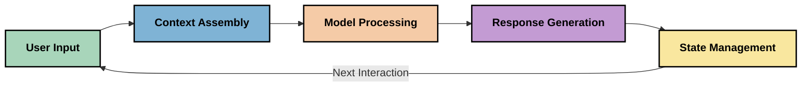
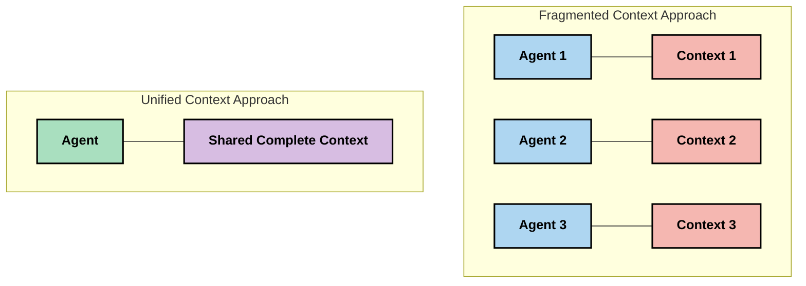
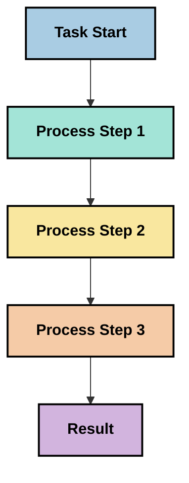
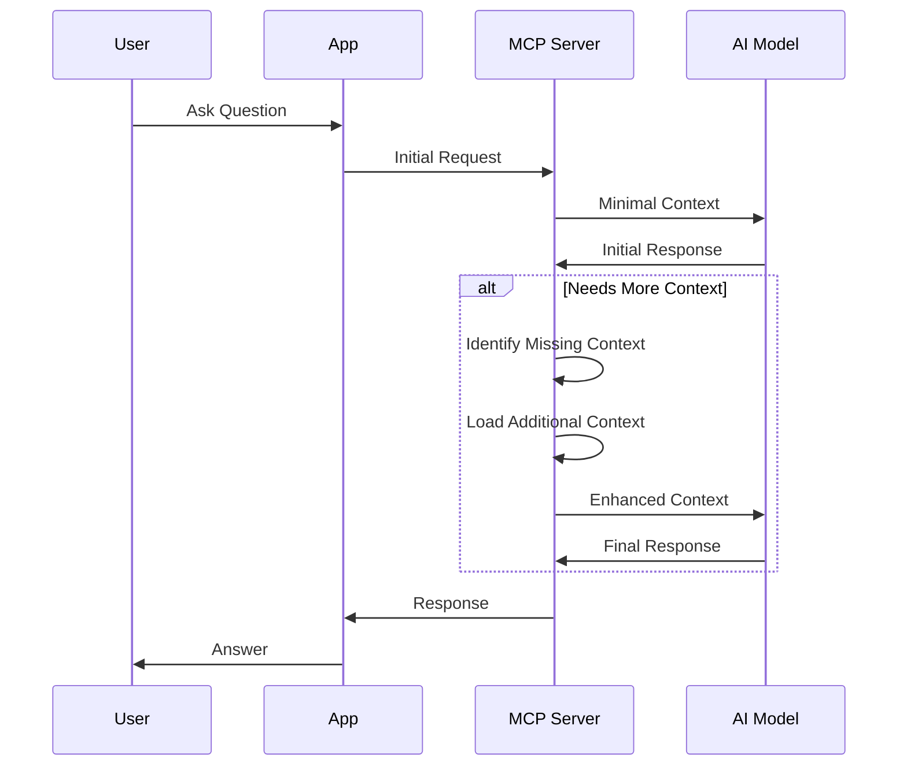
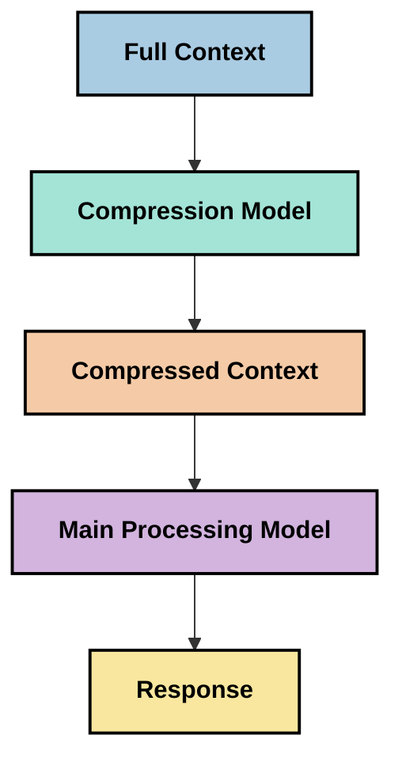

<!--
CO_OP_TRANSLATOR_METADATA:
{
  "original_hash": "5762e8e74dd99d8b7dbb31e69a82561e",
  "translation_date": "2025-07-17T08:34:39+00:00",
  "source_file": "05-AdvancedTopics/mcp-contextengineering/README.md",
  "language_code": "no"
}
-->
# Context Engineering: Et Fremvoksende Konsept i MCP-økosystemet

## Oversikt

Context engineering er et nytt konsept innen AI som utforsker hvordan informasjon struktureres, leveres og vedlikeholdes gjennom interaksjoner mellom klienter og AI-tjenester. Etter hvert som Model Context Protocol (MCP)-økosystemet utvikler seg, blir det stadig viktigere å forstå hvordan man effektivt kan håndtere kontekst. Denne modulen introduserer konseptet context engineering og undersøker potensielle bruksområder i MCP-implementasjoner.

## Læringsmål

Etter å ha fullført denne modulen vil du kunne:

- Forstå det fremvoksende konseptet context engineering og dets potensielle rolle i MCP-applikasjoner
- Identifisere sentrale utfordringer i kontekststyring som MCP-protokolldesignen adresserer
- Utforske teknikker for å forbedre modellens ytelse gjennom bedre kontekstbehandling
- Vurdere tilnærminger for å måle og evaluere kontekstens effektivitet
- Anvende disse nye konseptene for å forbedre AI-opplevelser gjennom MCP-rammeverket

## Introduksjon til Context Engineering

Context engineering er et nytt felt som fokuserer på bevisst design og styring av informasjonsflyt mellom brukere, applikasjoner og AI-modeller. I motsetning til etablerte områder som prompt engineering, er context engineering fortsatt under utvikling av praktikere som jobber med å løse de unike utfordringene ved å gi AI-modeller riktig informasjon til rett tid.

Etter hvert som store språkmodeller (LLMs) har utviklet seg, har viktigheten av kontekst blitt stadig tydeligere. Kvaliteten, relevansen og strukturen på konteksten vi gir, påvirker direkte modellens resultater. Context engineering utforsker dette forholdet og søker å utvikle prinsipper for effektiv kontekststyring.

> "I 2025 er modellene der ute ekstremt intelligente. Men selv den smarteste menneske vil ikke kunne gjøre jobben sin effektivt uten konteksten for hva de blir bedt om å gjøre... 'Context engineering' er neste nivå av prompt engineering. Det handler om å gjøre dette automatisk i et dynamisk system." — Walden Yan, Cognition AI

Context engineering kan omfatte:

1. **Context Selection**: Å avgjøre hvilken informasjon som er relevant for en gitt oppgave
2. **Context Structuring**: Å organisere informasjon for å maksimere modellens forståelse
3. **Context Delivery**: Å optimalisere hvordan og når informasjon sendes til modeller
4. **Context Maintenance**: Å håndtere tilstand og utvikling av kontekst over tid
5. **Context Evaluation**: Å måle og forbedre kontekstens effektivitet

Disse fokusområdene er spesielt relevante for MCP-økosystemet, som tilbyr en standardisert måte for applikasjoner å gi kontekst til LLM-er.

## Perspektivet: Kontekstreisen

En måte å visualisere context engineering på er å følge reisen informasjon tar gjennom et MCP-system:



### Viktige stadier i kontekstreisen:

1. **User Input**: Rå informasjon fra brukeren (tekst, bilder, dokumenter)
2. **Context Assembly**: Kombinere brukerinput med systemkontekst, samtalehistorikk og annen hentet informasjon
3. **Model Processing**: AI-modellen behandler den sammensatte konteksten
4. **Response Generation**: Modellen produserer svar basert på den gitte konteksten
5. **State Management**: Systemet oppdaterer sin interne tilstand basert på interaksjonen

Dette perspektivet fremhever den dynamiske naturen til kontekst i AI-systemer og reiser viktige spørsmål om hvordan man best kan håndtere informasjon i hvert trinn.

## Fremvoksende prinsipper innen Context Engineering

Etter hvert som feltet context engineering tar form, begynner noen tidlige prinsipper å dukke opp blant praktikere. Disse prinsippene kan bidra til å informere valg i MCP-implementasjoner:

### Prinsipp 1: Del konteksten fullstendig

Kontekst bør deles fullstendig mellom alle komponenter i et system, i stedet for å være fragmentert på tvers av flere agenter eller prosesser. Når konteksten er distribuert, kan beslutninger tatt i én del av systemet komme i konflikt med beslutninger andre steder.



I MCP-applikasjoner antyder dette at man bør designe systemer der konteksten flyter sømløst gjennom hele kjeden, i stedet for å være oppdelt.

### Prinsipp 2: Erkjenn at handlinger bærer implisitte beslutninger

Hver handling en modell utfører inneholder implisitte beslutninger om hvordan konteksten skal tolkes. Når flere komponenter handler på ulike kontekster, kan disse implisitte beslutningene komme i konflikt og føre til inkonsistente resultater.

Dette prinsippet har viktige implikasjoner for MCP-applikasjoner:
- Foretrekk lineær behandling av komplekse oppgaver fremfor parallell utførelse med fragmentert kontekst
- Sørg for at alle beslutningspunkter har tilgang til samme kontekstuelle informasjon
- Design systemer der senere trinn kan se hele konteksten fra tidligere beslutninger

### Prinsipp 3: Balanser kontekstdybde med vindusbegrensninger

Etter hvert som samtaler og prosesser blir lengre, vil kontekstvinduene til slutt fylles opp. Effektiv context engineering utforsker tilnærminger for å håndtere spenningen mellom omfattende kontekst og tekniske begrensninger.

Mulige tilnærminger som utforskes inkluderer:
- Kontekstkomprimering som bevarer essensiell informasjon samtidig som token-bruken reduseres
- Progressiv lasting av kontekst basert på relevans for nåværende behov
- Oppsummering av tidligere interaksjoner samtidig som viktige beslutninger og fakta bevares

## Kontekstutfordringer og MCP-protokolldesign

Model Context Protocol (MCP) ble designet med bevissthet om de unike utfordringene ved kontekststyring. Å forstå disse utfordringene hjelper med å forklare sentrale aspekter ved MCP-protokolldesignen:

### Utfordring 1: Begrensninger i kontekstvinduet
De fleste AI-modeller har faste størrelser på kontekstvinduet, noe som begrenser hvor mye informasjon de kan behandle samtidig.

**MCP-designsvar:**  
- Protokollen støtter strukturert, ressursbasert kontekst som kan refereres effektivt  
- Ressurser kan pagineres og lastes inn progressivt

### Utfordring 2: Bestemmelse av relevans
Det er vanskelig å avgjøre hvilken informasjon som er mest relevant å inkludere i konteksten.

**MCP-designsvar:**  
- Fleksible verktøy tillater dynamisk henting av informasjon basert på behov  
- Strukturerte prompts muliggjør konsistent organisering av kontekst

### Utfordring 3: Vedvarende kontekst
Å håndtere tilstand på tvers av interaksjoner krever nøye sporing av kontekst.

**MCP-designsvar:**  
- Standardisert sesjonshåndtering  
- Klart definerte interaksjonsmønstre for kontekstens utvikling

### Utfordring 4: Multi-modale kontekster
Ulike typer data (tekst, bilder, strukturert data) krever ulik behandling.

**MCP-designsvar:**  
- Protokolldesignen tilrettelegger for ulike innholdstyper  
- Standardisert representasjon av multi-modal informasjon

### Utfordring 5: Sikkerhet og personvern
Kontekst inneholder ofte sensitiv informasjon som må beskyttes.

**MCP-designsvar:**  
- Klare ansvarsgrenser mellom klient og server  
- Lokale behandlingsmuligheter for å minimere dataeksponering

Å forstå disse utfordringene og hvordan MCP adresserer dem gir et grunnlag for å utforske mer avanserte teknikker innen context engineering.

## Fremvoksende tilnærminger innen Context Engineering

Etter hvert som feltet utvikler seg, dukker flere lovende tilnærminger opp. Disse representerer dagens tenkning snarere enn etablerte beste praksiser, og vil sannsynligvis utvikle seg med økt erfaring med MCP-implementasjoner.

### 1. Enkelttrådet lineær behandling

I motsetning til multi-agent-arkitekturer som distribuerer kontekst, opplever noen praktikere at enkelttrådet lineær behandling gir mer konsistente resultater. Dette samsvarer med prinsippet om å opprettholde en samlet kontekst.



Selv om denne tilnærmingen kan virke mindre effektiv enn parallell behandling, gir den ofte mer sammenhengende og pålitelige resultater fordi hvert trinn bygger på en fullstendig forståelse av tidligere beslutninger.

### 2. Oppdeling og prioritering av kontekst

Å dele opp store kontekster i håndterbare biter og prioritere det viktigste.

```python
# Conceptual Example: Context Chunking and Prioritization
def process_with_chunked_context(documents, query):
    # 1. Break documents into smaller chunks
    chunks = chunk_documents(documents)
    
    # 2. Calculate relevance scores for each chunk
    scored_chunks = [(chunk, calculate_relevance(chunk, query)) for chunk in chunks]
    
    # 3. Sort chunks by relevance score
    sorted_chunks = sorted(scored_chunks, key=lambda x: x[1], reverse=True)
    
    # 4. Use the most relevant chunks as context
    context = create_context_from_chunks([chunk for chunk, score in sorted_chunks[:5]])
    
    # 5. Process with the prioritized context
    return generate_response(context, query)
```

Konseptet ovenfor illustrerer hvordan man kan dele store dokumenter i håndterbare deler og velge kun de mest relevante delene for kontekst. Denne tilnærmingen kan hjelpe med å arbeide innenfor begrensninger i kontekstvinduet samtidig som man utnytter store kunnskapsbaser.

### 3. Progressiv lasting av kontekst

Å laste kontekst gradvis etter behov i stedet for alt på en gang.



Progressiv lasting av kontekst starter med minimal kontekst og utvider kun når det er nødvendig. Dette kan redusere token-bruken betydelig for enkle spørsmål, samtidig som det opprettholder evnen til å håndtere komplekse forespørsler.

### 4. Kontekstkomprimering og oppsummering

Å redusere kontekststørrelsen samtidig som essensiell informasjon bevares.



Kontekstkomprimering fokuserer på:  
- Å fjerne overflødig informasjon  
- Å oppsummere langt innhold  
- Å trekke ut nøkkelfakta og detaljer  
- Å bevare kritiske kontekstelementer  
- Å optimalisere for token-effektivitet

Denne tilnærmingen kan være spesielt verdifull for å opprettholde lange samtaler innenfor kontekstvinduet eller for effektiv behandling av store dokumenter. Noen praktikere bruker spesialiserte modeller spesielt for kontekstkomprimering og oppsummering av samtalehistorikk.

## Utforskende betraktninger innen Context Engineering

Når vi utforsker det nye feltet context engineering, er det flere hensyn som er verdt å ha i bakhodet ved arbeid med MCP-implementasjoner. Dette er ikke forskrevne beste praksiser, men områder for utforskning som kan gi forbedringer i ditt spesifikke brukstilfelle.

### Vurder dine kontekstmål

Før du implementerer komplekse løsninger for kontekststyring, bør du tydelig formulere hva du ønsker å oppnå:  
- Hvilken spesifikk informasjon trenger modellen for å lykkes?  
- Hvilken informasjon er essensiell versus tilleggsinformasjon?  
- Hva er dine ytelsesbegrensninger (latens, token-grenser, kostnader)?

### Utforsk lagdelte konteksttilnærminger

Noen praktikere har suksess med kontekst arrangert i konseptuelle lag:  
- **Kjerne-lag**: Essensiell informasjon modellen alltid trenger  
- **Situasjonslag**: Kontekst spesifikk for den nåværende interaksjonen  
- **Støttelag**: Tilleggsinformasjon som kan være nyttig  
- **Fallback-lag**: Informasjon som kun hentes ved behov

### Undersøk hentingsstrategier

Effektiviteten av konteksten avhenger ofte av hvordan du henter informasjon:  
- Semantisk søk og embeddings for å finne konseptuelt relevant informasjon  
- Nøkkelordbasert søk for spesifikke faktiske detaljer  
- Hybride tilnærminger som kombinerer flere hentemetoder  
- Metadatafiltrering for å begrense omfang basert på kategorier, datoer eller kilder

### Eksperimenter med kontekstkoherens

Strukturen og flyten i konteksten kan påvirke modellens forståelse:  
- Gruppering av relatert informasjon  
- Bruk av konsekvent formatering og organisering  
- Opprettholde logisk eller kronologisk rekkefølge der det er hensiktsmessig  
- Unngå motstridende informasjon

### Vurder avveininger ved multi-agent-arkitekturer

Selv om multi-agent-arkitekturer er populære i mange AI-rammeverk, medfører de betydelige utfordringer for kontekststyring:  
- Kontekstfragmentering kan føre til inkonsistente beslutninger på tvers av agenter  
- Parallell behandling kan introdusere konflikter som er vanskelige å løse  
- Kommunikasjonskostnader mellom agenter kan oppveie ytelsesgevinster  
- Kompleks tilstandshåndtering kreves for å opprettholde koherens

I mange tilfeller kan en enkelt-agent-tilnærming med omfattende kontekststyring gi mer pålitelige resultater enn flere spesialiserte agenter med fragmentert kontekst.

### Utvikle evalueringsmetoder

For å forbedre context engineering over tid, bør du vurdere hvordan du måler suksess:  
- A/B-testing av ulike kontekststrukturer  
- Overvåking av token-bruk og responstider  
- Sporing av brukertilfredshet og fullføringsgrad for oppgaver  
- Analyse av når og hvorfor kontekststrategier feiler

Disse betraktningene representerer aktive utforskningsområder innen context engineering. Etter hvert som feltet modnes, vil mer definitive mønstre og praksiser sannsynligvis dukke opp.

## Måling av konteksteffektivitet: Et utviklende rammeverk

Etter hvert som context engineering vokser frem som konsept, begynner praktikere å utforske hvordan vi kan måle effektiviteten. Det finnes ennå ikke et etablert rammeverk, men ulike måleparametere vurderes som kan hjelpe med å styre fremtidig arbeid.

### Potensielle måledimensjoner

#### 1. Effektivitet ved input

- **Context-to-Response Ratio**: Hvor mye kontekst trengs i forhold til størrelsen på svaret?  
- **Token Utilization**: Hvilken prosentandel av de leverte kontekst-tokenene påvirker svaret?  
- **Context Reduction**: Hvor effektivt kan vi komprimere rå informasjon?

#### 2. Ytelsesbetraktninger

- **Latency Impact**: Hvordan påvirker kontekststyring responstiden?  
- **Token Economy**: Optimaliserer vi token-bruken effektivt?  
- **Retrieval Precision**: Hvor relevant er den hentede informasjonen?  
- **Resource Utilization**: Hvilke beregningsressurser kreves?

#### 3. Kvalitetsbetraktninger

- **Response Relevance**: Hvor godt svarer responsen på forespørselen?  
- **Factual Accuracy**: Forbedrer kontekststyring faktanøyaktigheten?  
- **Consistency**: Er svarene konsistente på tvers av lignende spørsmål?  
- **Hallucination Rate**: Reduserer bedre kontekst modellens hallusinasjoner?

#### 4. Brukeropplevelsesbetraktninger

- **Follow-up Rate**: Hvor ofte trenger brukere oppklaring?  
- **Task Completion**: Lykkes brukerne med å fullføre oppgavene sine?  
- **Satisfaction Indicators**: Hvordan vurderer brukerne opplevelsen?

### Utforskende tilnærminger til måling

Når du eksperimenterer med context engineering i MCP-implementasjoner, kan du vurdere disse tilnærmingene:

1. **Baseline Comparisons**: Etabler en basislinje med enkle konteksttilnærminger før du tester mer avanserte metoder  
2. **Incremental Changes**: Endre én aspekt av kontekststyringen om gangen for å isolere effektene  
3. **User-Centered Evaluation**: Kombiner kvantitative målinger med kvalitativ brukerfeedback  
4. **Failure Analysis**: Undersøk tilfeller der kontekststrategier feiler for å forstå mulige forbedringer  
5. **Multi-Dimensional Assessment**: Vurder avveininger mellom effektivitet, kvalitet og brukeropplevelse

Denne eksperimentelle, flerfasetterte tilnærmingen til måling samsvarer med det fremvoksende preget til context engineering.

## Avsluttende tanker

Context engineering er et nytt utforskningsområde som kan bli sentralt for effektive MCP-applikasjoner. Ved å nøye vurdere hvordan informasjon flyter gjennom systemet ditt, kan du potensielt skape AI-opplevelser som er mer effektive, nøyaktige og verdifulle for brukerne.

Teknikkene og tilnærmingene som er skissert i denne modulen representerer tidlig tenkning på dette området, ikke etablerte praksiser. Context engineering kan utvikle seg til en mer definert disiplin etter hvert som AI-kapasiteter forbedres og vår forståelse øker. Foreløpig virker eksperimentering kombinert med nøye måling som den mest produktive tilnærmingen.

## Potensielle fremtidige retninger

Feltet context engineering er fortsatt i sin spede begynnelse, men flere lovende retninger er på vei:

- Prinsipper for context engineering kan ha stor innvirkning på modellens ytelse, effektivitet, brukeropplevelse og pålitelighet  
- Enkelttrådede tilnærminger med omfattende kontekststyring kan overgå multi-agent-arkitekturer i mange brukstilfeller  
- Spesialiserte modeller for kontekstkomprimering kan bli standardkomponenter i AI-pipelines  
- Spenningen mellom kontekstfullstendighet og token-begrensninger vil sannsynligvis drive innovasjon i kontekstbehandling  
- Etter hvert som modeller blir bedre til effektiv, menneskelignende kommunikasjon, kan ekte multi-agent-samarbeid bli mer aktuelt  
- MCP-implementasjoner
- [Model Context Protocol-nettsted](https://modelcontextprotocol.io/)
- [Model Context Protocol-spesifikasjon](https://github.com/modelcontextprotocol/modelcontextprotocol)
- [MCP-dokumentasjon](https://modelcontextprotocol.io/docs)
- [MCP C# SDK](https://github.com/modelcontextprotocol/csharp-sdk)
- [MCP Python SDK](https://github.com/modelcontextprotocol/python-sdk)
- [MCP TypeScript SDK](https://github.com/modelcontextprotocol/typescript-sdk)
- [MCP Inspector](https://github.com/modelcontextprotocol/inspector) - Verktøy for visuell testing av MCP-servere

### Artikler om Context Engineering
- [Ikke bygg multi-agenter: Prinsipper for Context Engineering](https://cognition.ai/blog/dont-build-multi-agents) - Walden Yans innsikt i prinsipper for context engineering
- [En praktisk guide til å bygge agenter](https://cdn.openai.com/business-guides-and-resources/a-practical-guide-to-building-agents.pdf) - OpenAIs guide til effektiv agentdesign
- [Å bygge effektive agenter](https://www.anthropic.com/engineering/building-effective-agents) - Anthropics tilnærming til agentutvikling

### Relatert forskning
- [Dynamisk hentetillegg for store språkmodeller](https://arxiv.org/abs/2310.01487) - Forskning på dynamiske hentemetoder
- [Lost in the Middle: Hvordan språkmodeller bruker lange kontekster](https://arxiv.org/abs/2307.03172) - Viktig forskning på mønstre i kontekstbehandling
- [Hierarkisk tekstbetinget bilde-generering med CLIP Latents](https://arxiv.org/abs/2204.06125) - DALL-E 2-artikkel med innsikt i kontekststrukturering
- [Utforsking av kontekstens rolle i arkitekturer for store språkmodeller](https://aclanthology.org/2023.findings-emnlp.124/) - Nyere forskning på håndtering av kontekst
- [Samarbeid mellom flere agenter: En oversikt](https://arxiv.org/abs/2304.03442) - Forskning på multi-agent-systemer og deres utfordringer

### Ytterligere ressurser
- [Optimaliseringsteknikker for kontekstvindu](https://learn.microsoft.com/en-us/azure/ai-services/openai/concepts/context-window)
- [Avanserte RAG-teknikker](https://www.microsoft.com/en-us/research/blog/retrieval-augmented-generation-rag-and-frontier-models/)
- [Semantic Kernel-dokumentasjon](https://github.com/microsoft/semantic-kernel)
- [AI-verktøykasse for kontekststyring](https://github.com/microsoft/aitoolkit)

## Hva er neste
- [6. Community Contributions](../../06-CommunityContributions/README.md)

**Ansvarsfraskrivelse**:  
Dette dokumentet er oversatt ved hjelp av AI-oversettelsestjenesten [Co-op Translator](https://github.com/Azure/co-op-translator). Selv om vi streber etter nøyaktighet, vennligst vær oppmerksom på at automatiske oversettelser kan inneholde feil eller unøyaktigheter. Det opprinnelige dokumentet på originalspråket skal anses som den autoritative kilden. For kritisk informasjon anbefales profesjonell menneskelig oversettelse. Vi er ikke ansvarlige for eventuelle misforståelser eller feiltolkninger som oppstår ved bruk av denne oversettelsen.