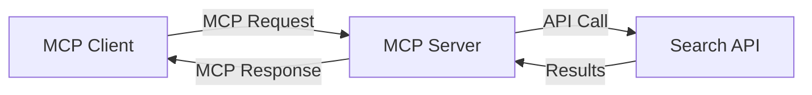
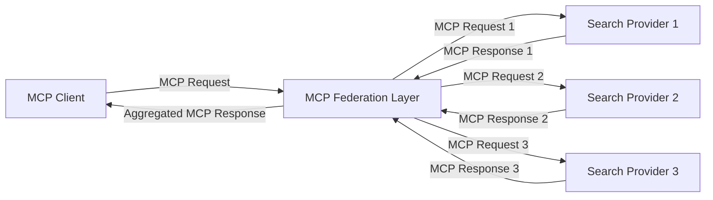
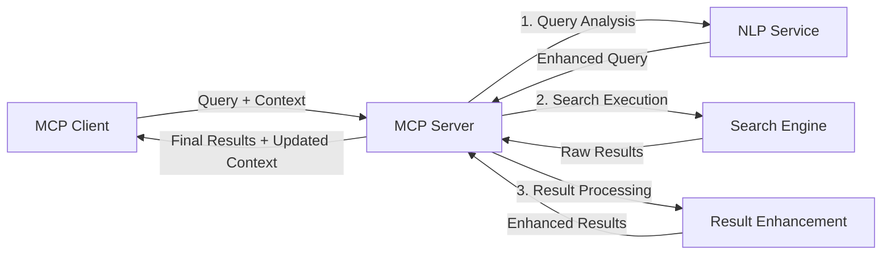

<!--
CO_OP_TRANSLATOR_METADATA:
{
  "original_hash": "333a03e51f90bdf3e6f1ba1694c73f36",
  "translation_date": "2025-07-17T06:42:29+00:00",
  "source_file": "05-AdvancedTopics/mcp-realtimesearch/README.md",
  "language_code": "no"
}
-->
## Ansvarsfraskrivelse for kodeeksempler

> **Viktig merknad**: Kodeeksemplene nedenfor viser integrasjon av Model Context Protocol (MCP) med websøke-funksjonalitet. Selv om de følger mønstrene og strukturene i de offisielle MCP SDK-ene, er de forenklet for pedagogiske formål.
> 
> Disse eksemplene viser:
> 
> 1. **Python-implementasjon**: En FastMCP-server som tilbyr et websøkeverktøy og kobler til en ekstern søke-API. Dette eksempelet demonstrerer riktig håndtering av levetid, kontekstbehandling og verktøyimplementasjon i tråd med mønstrene i [den offisielle MCP Python SDK-en](https://github.com/modelcontextprotocol/python-sdk). Serveren bruker den anbefalte Streamable HTTP-transporten, som har erstattet den eldre SSE-transporten for produksjonsbruk.
> 
> 2. **JavaScript-implementasjon**: En TypeScript/JavaScript-implementasjon som bruker FastMCP-mønsteret fra [den offisielle MCP TypeScript SDK-en](https://github.com/modelcontextprotocol/typescript-sdk) for å lage en søkeserver med riktige verktøydefinisjoner og klienttilkoblinger. Den følger de nyeste anbefalte mønstrene for sesjonshåndtering og kontekstbevaring.
> 
> Disse eksemplene krever ytterligere feilhåndtering, autentisering og spesifikk API-integrasjonskode for produksjonsbruk. Søke-API-endepunktene som vises (`https://api.search-service.example/search`) er plassholdere og må erstattes med faktiske søketjenesteendepunkter.
> 
> For fullstendige implementasjonsdetaljer og de mest oppdaterte tilnærmingene, vennligst se [den offisielle MCP-spesifikasjonen](https://spec.modelcontextprotocol.io/) og SDK-dokumentasjonen.

## Kjernebegreper

### Model Context Protocol (MCP)-rammeverket

Grunnleggende gir Model Context Protocol en standardisert måte for AI-modeller, applikasjoner og tjenester å utveksle kontekst på. I sanntid websøking er dette rammeverket avgjørende for å skape sammenhengende, flertrinns søkeopplevelser. Nøkkelkomponenter inkluderer:

1. **Klient-server-arkitektur**: MCP etablerer en tydelig separasjon mellom søkeklienter (forespørrere) og søkeservere (tilbydere), noe som gir fleksible distribusjonsmodeller.

2. **JSON-RPC-kommunikasjon**: Protokollen bruker JSON-RPC for meldingsutveksling, noe som gjør den kompatibel med webteknologier og enkel å implementere på tvers av plattformer.

3. **Kontekststyring**: MCP definerer strukturerte metoder for å opprettholde, oppdatere og utnytte søkekontekst over flere interaksjoner.

4. **Verktøydefinisjoner**: Søkemuligheter eksponeres som standardiserte verktøy med veldefinerte parametere og returverdier.

5. **Streaming-støtte**: Protokollen støtter strømming av resultater, essensielt for sanntidssøk der resultater kan komme gradvis.

### Integrasjonsmønstre for websøking

Når MCP integreres med websøking, oppstår flere mønstre:

#### 1. Direkte integrasjon med søkeleverandør

I dette mønsteret kobler MCP-serveren direkte til en eller flere søke-API-er, oversetter MCP-forespørsler til API-spesifikke kall og formaterer resultatene som MCP-svar.

#### 2. Føderert søk med kontekstbevaring

Dette mønsteret distribuerer søkespørringer på tvers av flere MCP-kompatible søkeleverandører, som hver kan spesialisere seg på ulike typer innhold eller søkefunksjoner, samtidig som en samlet kontekst opprettholdes.

#### 3. Kontekstberiket søkekjede

I dette mønsteret deles søkeprosessen opp i flere trinn, hvor konteksten berikes i hvert steg, noe som gir gradvis mer relevante resultater.

### Komponenter i søkekontekst

I MCP-basert websøking inkluderer kontekst vanligvis:

- **Spørringshistorikk**: Tidligere søkespørringer i økten
- **Brukerpreferanser**: Språk, region, sikker søk-innstillinger
- **Interaksjonshistorikk**: Hvilke resultater som ble klikket på, tid brukt på resultater
- **Søkeparametere**: Filtre, sorteringsrekkefølge og andre søkemodifikatorer
- **Domene-kunnskap**: Fagspesifikk kontekst relevant for søket
- **Tidskontekst**: Tidsbaserte relevansfaktorer
- **Kildepreferanser**: Foretrukne eller pålitelige informasjonskilder

## Bruksområder og anvendelser

### Forskning og informasjonsinnhenting

MCP forbedrer forskningsarbeidsflyter ved å:

- Bevare forskningskontekst på tvers av søkeøkter
- Muliggjøre mer sofistikerte og kontekstrelevante spørringer
- Støtte fler-kilde søkeføderasjon
- Legge til rette for kunnskapsutvinning fra søkeresultater

### Sanntidsnyheter og trendovervåking

MCP-drevet søk gir fordeler for nyhetsovervåking:

- Nesten sanntidsoppdagelse av nye nyhetssaker
- Kontekstuell filtrering av relevant informasjon
- Sporing av temaer og enheter på tvers av flere kilder
- Personlige nyhetsvarsler basert på brukerkontekst

### AI-forsterket nettlesing og forskning

MCP åpner nye muligheter for AI-forsterket nettlesing:

- Kontekstuelle søkeforslag basert på nåværende nettleseraktivitet
- Sømløs integrasjon av websøking med LLM-drevne assistenter
- Flertrinns søkeforbedring med bevart kontekst
- Forbedret faktasjekking og informasjonsverifisering

## Fremtidige trender og innovasjoner

### Utvikling av MCP i websøking

Fremover forventer vi at MCP vil utvikle seg for å håndtere:

- **Multimodalt søk**: Integrering av tekst-, bilde-, lyd- og videosøk med bevart kontekst
- **Desentralisert søk**: Støtte for distribuerte og fødererte søkøkosystemer
- **Søk personvern**: Kontekstbevisste søkemekanismer som ivaretar personvern  
- **Forespørselsforståelse**: Dyp semantisk analyse av naturlige språkspørringer

### Potensielle teknologiske fremskritt

Nye teknologier som vil forme fremtiden for MCP-søk:

1. **Nevrale søkearkitekturer**: Innebyggingsbaserte søkesystemer optimalisert for MCP  
2. **Personlig søkekontekst**: Læring av individuelle brukermønstre over tid  
3. **Integrasjon av kunnskapsgraf**: Kontekstualisert søk forbedret med domenespesifikke kunnskapsgrafer  
4. **Tverrmodal kontekst**: Opprettholde kontekst på tvers av ulike søkemodaliteter

## Praktiske øvelser

### Øvelse 1: Sette opp en grunnleggende MCP-søkerørledning

I denne øvelsen lærer du å:  
- Konfigurere et grunnleggende MCP-søkemiljø  
- Implementere kontekstbehandlere for nettsøk  
- Teste og validere kontekstbevaring gjennom søkeiterasjoner

### Øvelse 2: Bygge en forskningsassistent med MCP-søk

Lag en komplett applikasjon som:  
- Behandler forskningsspørsmål formulert i naturlig språk  
- Utfører kontekstbevisste nettsøk  
- Syntetiserer informasjon fra flere kilder  
- Presenterer organiserte forskningsfunn

### Øvelse 3: Implementere fler-kilde søkefederasjon med MCP

Avansert øvelse som dekker:  
- Kontekstbevisst forespørselsdistribusjon til flere søkemotorer  
- Rangering og aggregering av resultater  
- Kontekstuell deduplisering av søkeresultater  
- Håndtering av kilde-spesifikk metadata

## Ekstra ressurser

- [Model Context Protocol Specification](https://spec.modelcontextprotocol.io/) - Offisiell MCP-spesifikasjon og detaljert protokoll-dokumentasjon  
- [Model Context Protocol Documentation](https://modelcontextprotocol.io/) - Detaljerte veiledninger og implementasjonsguider  
- [MCP Python SDK](https://github.com/modelcontextprotocol/python-sdk) - Offisiell Python-implementasjon av MCP-protokollen  
- [MCP TypeScript SDK](https://github.com/modelcontextprotocol/typescript-sdk) - Offisiell TypeScript-implementasjon av MCP-protokollen  
- [MCP Reference Servers](https://github.com/modelcontextprotocol/servers) - Referanseimplementasjoner av MCP-servere  
- [Bing Web Search API Documentation](https://learn.microsoft.com/en-us/bing/search-apis/bing-web-search/overview) - Microsofts websøke-API  
- [Google Custom Search JSON API](https://developers.google.com/custom-search/v1/overview) - Googles programmerbare søkemotor  
- [SerpAPI Documentation](https://serpapi.com/search-api) - API for søkeresultatsider  
- [Meilisearch Documentation](https://www.meilisearch.com/docs) - Åpen kildekode søkemotor  
- [Elasticsearch Documentation](https://www.elastic.co/guide/index.html) - Distribuert søke- og analysemotor  
- [LangChain Documentation](https://python.langchain.com/docs/get_started/introduction) - Bygge applikasjoner med LLM-er

## Læringsmål

Etter å ha fullført denne modulen vil du kunne:

- Forstå grunnprinsippene for sanntidssøk på nettet og utfordringene knyttet til dette  
- Forklare hvordan Model Context Protocol (MCP) forbedrer sanntidssøk på nettet  
- Implementere MCP-baserte søkeløsninger ved hjelp av populære rammeverk og API-er  
- Designe og distribuere skalerbare, høyytelses søkearkitekturer med MCP  
- Anvende MCP-konsepter på ulike bruksområder, inkludert semantisk søk, forskningsassistanse og AI-forsterket nettlesing  
- Vurdere nye trender og fremtidige innovasjoner innen MCP-baserte søketeknologier

### Vurderinger rundt tillit og sikkerhet

Når du implementerer MCP-baserte nettsøkeløsninger, husk disse viktige prinsippene fra MCP-spesifikasjonen:

1. **Brukersamtykke og kontroll**: Brukere må gi eksplisitt samtykke og forstå all datatilgang og operasjoner. Dette er spesielt viktig for nettsøk som kan få tilgang til eksterne datakilder.

2. **Datapersonvern**: Sørg for korrekt håndtering av søkespørringer og resultater, spesielt når de kan inneholde sensitiv informasjon. Implementer passende tilgangskontroller for å beskytte brukerdata.

3. **Verktøysikkerhet**: Implementer riktig autorisasjon og validering for søkeverktøy, da de kan utgjøre sikkerhetsrisikoer gjennom vilkårlig kodekjøring. Beskrivelser av verktøyatferd bør anses som upålitelige med mindre de kommer fra en betrodd server.

4. **Tydelig dokumentasjon**: Gi klar dokumentasjon om muligheter, begrensninger og sikkerhetshensyn ved din MCP-baserte søkeimplementasjon, i tråd med retningslinjene i MCP-spesifikasjonen.

5. **Robuste samtykkeflyt**: Bygg robuste samtykke- og autorisasjonsflyter som tydelig forklarer hva hvert verktøy gjør før bruk, spesielt for verktøy som interagerer med eksterne nettressurser.

For fullstendige detaljer om MCP-sikkerhet og tillitsvurderinger, se [offisiell dokumentasjon](https://modelcontextprotocol.io/specification/2025-03-26#security-and-trust-%26-safety).

## Hva skjer videre

- [5.12 Entra ID Authentication for Model Context Protocol Servers](../mcp-security-entra/README.md)

**Ansvarsfraskrivelse**:  
Dette dokumentet er oversatt ved hjelp av AI-oversettelsestjenesten [Co-op Translator](https://github.com/Azure/co-op-translator). Selv om vi streber etter nøyaktighet, vennligst vær oppmerksom på at automatiske oversettelser kan inneholde feil eller unøyaktigheter. Det opprinnelige dokumentet på originalspråket skal anses som den autoritative kilden. For kritisk informasjon anbefales profesjonell menneskelig oversettelse. Vi er ikke ansvarlige for eventuelle misforståelser eller feiltolkninger som oppstår ved bruk av denne oversettelsen.