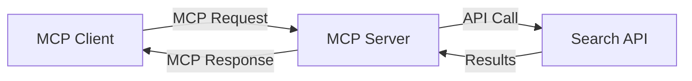
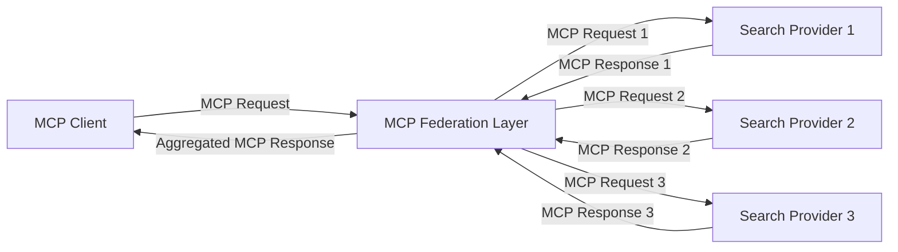
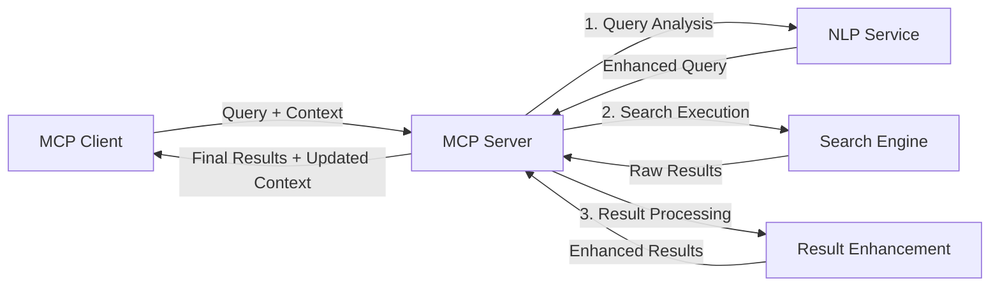

<!--
CO_OP_TRANSLATOR_METADATA:
{
  "original_hash": "16bef2c93c6a86d4ca6a8ce9e120e384",
  "translation_date": "2025-06-13T02:50:48+00:00",
  "source_file": "05-AdvancedTopics/mcp-realtimesearch/README.md",
  "language_code": "no"
}
-->
## Ansvarsfraskrivelse for kodeeksempler

> **Viktig merknad**: Kodeeksemplene nedenfor viser integrasjon av Model Context Protocol (MCP) med websøke-funksjonalitet. Selv om de følger mønstrene og strukturene til de offisielle MCP SDK-ene, er de forenklet for pedagogiske formål.
> 
> Disse eksemplene viser:
> 
> 1. **Python-implementasjon**: En FastMCP-server som tilbyr et websøkeverktøy og kobler til en ekstern søke-API. Dette eksemplet demonstrerer riktig håndtering av livssyklus, kontekstbehandling og verktøyimplementasjon etter mønstrene i [offisiell MCP Python SDK](https://github.com/modelcontextprotocol/python-sdk). Serveren bruker den anbefalte Streamable HTTP-transporten som har erstattet den eldre SSE-transporten for produksjonsbruk.
> 
> 2. **JavaScript-implementasjon**: En TypeScript/JavaScript-implementasjon som bruker FastMCP-mønsteret fra [offisiell MCP TypeScript SDK](https://github.com/modelcontextprotocol/typescript-sdk) for å lage en søkeserver med riktige verktøydefinisjoner og klienttilkoblinger. Den følger de nyeste anbefalte mønstrene for sesjonshåndtering og kontekstbevaring.
> 
> Disse eksemplene krever ytterligere feilhåndtering, autentisering og spesifikk API-integrasjonskode for produksjonsbruk. Søke-API-endepunktene som vises (`https://api.search-service.example/search`) er plassholdere og må erstattes med faktiske søketjenesteendepunkter.
> 
> For fullstendige implementasjonsdetaljer og de mest oppdaterte tilnærmingene, vennligst se [offisiell MCP-spesifikasjon](https://spec.modelcontextprotocol.io/) og SDK-dokumentasjon.

## Kjernebegreper

### Model Context Protocol (MCP)-rammeverket

Grunnlaget for Model Context Protocol er å tilby en standardisert måte for AI-modeller, applikasjoner og tjenester å utveksle kontekst på. I sanntids websøking er dette rammeverket avgjørende for å skape sammenhengende søkeopplevelser med flere steg. Nøkkelkomponenter inkluderer:

1. **Klient-server-arkitektur**: MCP etablerer en tydelig separasjon mellom søkeklienter (forespørrere) og søkeservere (tilbydere), noe som gir fleksible distribusjonsmodeller.

2. **JSON-RPC-kommunikasjon**: Protokollen bruker JSON-RPC for meldingsutveksling, noe som gjør den kompatibel med webteknologier og enkel å implementere på tvers av plattformer.

3. **Kontekststyring**: MCP definerer strukturerte metoder for å opprettholde, oppdatere og utnytte søkekontekst over flere interaksjoner.

4. **Verktøydefinisjoner**: Søkemuligheter eksponeres som standardiserte verktøy med veldefinerte parametere og returverdier.

5. **Streaming-støtte**: Protokollen støtter strømming av resultater, viktig for sanntidssøk hvor resultater kan komme gradvis.

### Integrasjonsmønstre for websøking

Når MCP integreres med websøking, oppstår flere mønstre:

#### 1. Direkte integrasjon med søkeleverandør

I dette mønsteret kommuniserer MCP-serveren direkte med én eller flere søke-API-er, oversetter MCP-forespørsler til API-spesifikke kall og formaterer resultatene som MCP-responser.

#### 2. Føderert søk med kontekstbevaring

Dette mønsteret distribuerer søkespørringer til flere MCP-kompatible søkeleverandører, som hver kan spesialisere seg på ulike innholdstyper eller søkefunksjoner, samtidig som en samlet kontekst opprettholdes.

#### 3. Kontekstberiket søkekjede

I dette mønsteret deles søkeprosessen i flere steg, hvor konteksten berikes i hvert trinn, noe som gir gradvis mer relevante resultater.

### Søke kontekstkomponenter

I MCP-baserte websøkesystemer inkluderer kontekst vanligvis:

- **Spørringshistorikk**: Tidligere søkespørringer i sesjonen
- **Brukerpreferanser**: Språk, region, sikker søk-innstillinger
- **Interaksjonshistorikk**: Hvilke resultater som ble klikket, tid brukt på resultater
- **Søkeparametere**: Filtre, sorteringsrekkefølge og andre søkemodifikatorer
- **Domene-kunnskap**: Fagspesifikk kontekst relevant for søket
- **Tidsmessig kontekst**: Relevansfaktorer basert på tid
- **Kildepreferanser**: Foretrukne eller pålitelige informasjonskilder

## Bruksområder og applikasjoner

### Forskning og informasjonsinnhenting

MCP forbedrer forskningsarbeidsflyter ved å:

- Bevare forskningskontekst over søkesesjoner
- Muliggjøre mer sofistikerte og kontekstuelle søkespørringer
- Støtte føderert søk over flere kilder
- Legge til rette for kunnskapsutvinning fra søkeresultater

### Sanntids nyhets- og trendovervåkning

MCP-drevet søk gir fordeler for nyhetsovervåkning:

- Nesten sanntids oppdagelse av nye nyhetshistorier
- Kontekstuell filtrering av relevant informasjon
- Sporing av temaer og entiteter på tvers av flere kilder
- Personlige nyhetsvarsler basert på brukerens kontekst

### AI-augmentert nettlesing og forskning

MCP åpner nye muligheter for AI-augmentert nettlesing:

- Kontekstuelle søkeforslag basert på nåværende nettleseraktivitet
- Sømløs integrasjon av websøking med LLM-drevne assistenter
- Flerspørsmåls søkeforbedring med bevart kontekst
- Forbedret faktasjekk og informasjonsverifisering

## Fremtidige trender og innovasjoner

### Utviklingen av MCP i websøking

Fremover forventer vi at MCP vil utvikle seg for å møte:

- **Multimodalt søk**: Integrering av tekst-, bilde-, lyd- og videosøk med bevart kontekst
- **Desentralisert søk**: Støtte for distribuerte og fødererte søkeøkosystemer
- **Søk og personvern**: Kontekstbevisste personvernbevarende søkemekanismer
- **Spørringsforståelse**: Dyp semantisk analyse av naturlige språkspørringer

### Potensielle teknologiske fremskritt

Nye teknologier som vil forme fremtidens MCP-søk:

1. **Nevrale søkearkitekturer**: Embedding-baserte søkesystemer optimalisert for MCP
2. **Personlig søkekontekst**: Læring av individuelle brukermønstre over tid
3. **Integrasjon med kunnskapsgrafer**: Kontekstualisert søk styrket av domene-spesifikke kunnskapsgrafer
4. **Tverrmodal kontekst**: Bevaring av kontekst på tvers av ulike søkemodaliteter

## Praktiske øvelser

### Øvelse 1: Sette opp en grunnleggende MCP søkekjede

I denne øvelsen lærer du å:
- Konfigurere et grunnleggende MCP-søkemiljø
- Implementere kontekstbehandlere for websøking
- Teste og validere kontekstbevaring på tvers av søkeiterasjoner

### Øvelse 2: Lage en forskningsassistent med MCP-søk

Lag en komplett applikasjon som:
- Behandler naturlige språk forskningsspørsmål
- Utfører kontekstbevisste websøkinger
- Syntetiserer informasjon fra flere kilder
- Presenterer organiserte forskningsfunn

### Øvelse 3: Implementere føderert søk med MCP

Avansert øvelse som dekker:
- Kontekstbevisst spørringsutsending til flere søkemotorer
- Rangering og aggregering av resultater
- Kontekstuell duplikathåndtering av søkeresultater
- Håndtering av kilde-spesifikk metadata

## Ytterligere ressurser

- [Model Context Protocol Specification](https://spec.modelcontextprotocol.io/) - Offisiell MCP-spesifikasjon og detaljert protokoll-dokumentasjon
- [Model Context Protocol Documentation](https://modelcontextprotocol.io/) - Detaljerte veiledninger og implementasjonsguider
- [MCP Python SDK](https://github.com/modelcontextprotocol/python-sdk) - Offisiell Python-implementasjon av MCP-protokollen
- [MCP TypeScript SDK](https://github.com/modelcontextprotocol/typescript-sdk) - Offisiell TypeScript-implementasjon av MCP-protokollen
- [MCP Reference Servers](https://github.com/modelcontextprotocol/servers) - Referanseimplementasjoner av MCP-servere
- [Bing Web Search API Documentation](https://learn.microsoft.com/en-us/bing/search-apis/bing-web-search/overview) - Microsofts websøke-API
- [Google Custom Search JSON API](https://developers.google.com/custom-search/v1/overview) - Googles programmerbare søkemotor
- [SerpAPI Documentation](https://serpapi.com/search-api) - API for søkeresultatsider
- [Meilisearch Documentation](https://www.meilisearch.com/docs) - Åpen kildekode søkemotor
- [Elasticsearch Documentation](https://www.elastic.co/guide/index.html) - Distribuert søke- og analysemotor
- [LangChain Documentation](https://python.langchain.com/docs/get_started/introduction) - Bygge applikasjoner med LLM-er

## Læringsmål

Ved å fullføre dette modulen vil du kunne:

- Forstå grunnleggende prinsipper for sanntids websøking og utfordringer
- Forklare hvordan Model Context Protocol (MCP) forbedrer sanntids websøking
- Implementere MCP-baserte søkeløsninger med populære rammeverk og API-er
- Designe og distribuere skalerbare, høyytelses søkearkitekturer med MCP
- Anvende MCP-konsepter til ulike brukstilfeller som semantisk søk, forskningsassistenter og AI-augmentert nettlesing
- Vurdere fremvoksende trender og fremtidige innovasjoner innen MCP-baserte søketeknologier

### Tillit og sikkerhetshensyn

Når du implementerer MCP-baserte websøkeløsninger, husk disse viktige prinsippene fra MCP-spesifikasjonen:

1. **Brukersamtykke og kontroll**: Brukere må eksplisitt samtykke til og forstå all datatilgang og operasjoner. Dette er spesielt viktig for websøking som kan ha tilgang til eksterne datakilder.

2. **Datapersonvern**: Sørg for riktig håndtering av søkespørringer og resultater, spesielt når de kan inneholde sensitiv informasjon. Implementer passende tilgangskontroller for å beskytte brukerdata.

3. **Verktøysikkerhet**: Implementer korrekt autorisasjon og validering for søkeverktøy, da disse kan representere sikkerhetsrisikoer gjennom kjøring av vilkårlig kode. Beskrivelser av verktøyatferd bør anses som upålitelige med mindre de kommer fra en betrodd server.

4. **Klar dokumentasjon**: Gi tydelig dokumentasjon om kapabiliteter, begrensninger og sikkerhetshensyn for din MCP-baserte søkeimplementasjon, i tråd med MCP-spesifikasjonens retningslinjer.

5. **Robuste samtykkeflyt**: Bygg robuste samtykke- og autorisasjonsflyter som tydelig forklarer hva hvert verktøy gjør før bruk blir autorisert, spesielt for verktøy som interagerer med eksterne webressurser.

For fullstendige detaljer om MCP-sikkerhet og tillitshensyn, se [offisiell dokumentasjon](https://modelcontextprotocol.io/specification/2025-03-26#security-and-trust-%26-safety).

## Hva nå

- [6. Community Contributions](../../06-CommunityContributions/README.md)

**Ansvarsfraskrivelse**:  
Dette dokumentet er oversatt ved hjelp av AI-oversettelsestjenesten [Co-op Translator](https://github.com/Azure/co-op-translator). Selv om vi streber etter nøyaktighet, vennligst vær oppmerksom på at automatiske oversettelser kan inneholde feil eller unøyaktigheter. Det originale dokumentet på det opprinnelige språket skal anses som den autoritative kilden. For kritisk informasjon anbefales profesjonell menneskelig oversettelse. Vi er ikke ansvarlige for eventuelle misforståelser eller feiltolkninger som oppstår ved bruk av denne oversettelsen.