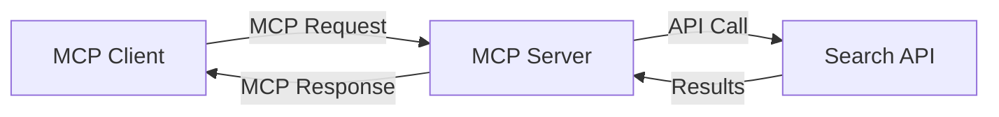
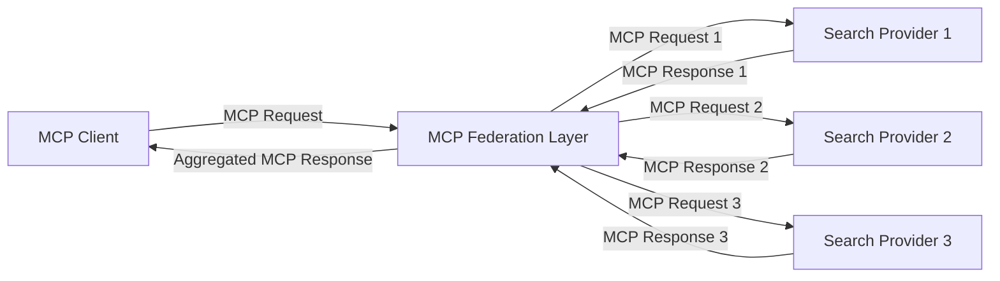
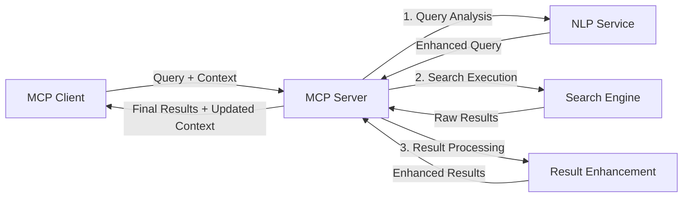

<!--
CO_OP_TRANSLATOR_METADATA:
{
  "original_hash": "eb12652eb7bd17f2193b835a344425c6",
  "translation_date": "2025-06-26T14:07:13+00:00",
  "source_file": "05-AdvancedTopics/mcp-realtimesearch/README.md",
  "language_code": "no"
}
-->
## Ansvarsfraskrivelse for kodeeksempler

> **Viktig merknad**: Kodeeksemplene nedenfor viser integrasjon av Model Context Protocol (MCP) med websøke-funksjonalitet. Selv om de følger mønstrene og strukturene til de offisielle MCP SDK-ene, er de forenklet for opplæringsformål.
> 
> Disse eksemplene viser:
> 
> 1. **Python-implementasjon**: En FastMCP-server som tilbyr et websøkeverktøy og kobler til en ekstern søke-API. Dette eksempelet demonstrerer riktig livssyklusadministrasjon, kontekstbehandling og verktøyimplementasjon i tråd med mønstrene i [den offisielle MCP Python SDK](https://github.com/modelcontextprotocol/python-sdk). Serveren bruker den anbefalte Streamable HTTP-transporten, som har erstattet den eldre SSE-transporten for produksjonsdistribusjoner.
> 
> 2. **JavaScript-implementasjon**: En TypeScript/JavaScript-implementasjon basert på FastMCP-mønsteret fra [den offisielle MCP TypeScript SDK](https://github.com/modelcontextprotocol/typescript-sdk) for å lage en søkeserver med riktige verktøydefinisjoner og klienttilkoblinger. Den følger de nyeste anbefalte mønstrene for sesjonsstyring og kontekstbevaring.
> 
> Disse eksemplene krever ytterligere feilhåndtering, autentisering og spesifikk API-integrasjonskode for produksjonsbruk. Søke-API-endepunktene som vises (`https://api.search-service.example/search`) er plassholdere og må erstattes med faktiske søketjenesteendepunkter.
> 
> For fullstendige implementasjonsdetaljer og de mest oppdaterte tilnærmingene, se [den offisielle MCP-spesifikasjonen](https://spec.modelcontextprotocol.io/) og SDK-dokumentasjonen.

## Kjernebegreper

### Model Context Protocol (MCP)-rammeverket

I bunn og grunn gir Model Context Protocol en standardisert måte for AI-modeller, applikasjoner og tjenester å utveksle kontekst på. I sanntids nettsøk er dette rammeverket essensielt for å skape sammenhengende søkeopplevelser over flere runder. Nøkkelkomponenter inkluderer:

1. **Klient-server-arkitektur**: MCP etablerer en klar separasjon mellom søkeklienter (forespørrere) og søkeservere (tilbydere), som muliggjør fleksible distribusjonsmodeller.

2. **JSON-RPC-kommunikasjon**: Protokollen bruker JSON-RPC for meldingsutveksling, noe som gjør den kompatibel med webteknologier og enkel å implementere på tvers av plattformer.

3. **Kontekststyring**: MCP definerer strukturerte metoder for å opprettholde, oppdatere og utnytte søkekontekst gjennom flere interaksjoner.

4. **Verktøydefinisjoner**: Søkemuligheter eksponeres som standardiserte verktøy med veldefinerte parametere og returverdier.

5. **Streaming-støtte**: Protokollen støtter streaming av resultater, noe som er avgjørende for sanntidssøk der resultater kan komme gradvis.

### Integrasjonsmønstre for websøking

Når MCP integreres med websøking, oppstår flere mønstre:

#### 1. Direkte integrasjon med søkeleverandør

I dette mønsteret kobler MCP-serveren direkte til én eller flere søke-API-er, oversetter MCP-forespørsler til API-spesifikke kall og formaterer resultatene som MCP-svar.

#### 2. Føderert søk med kontekstbevaring

Dette mønsteret distribuerer søkespørringer på tvers av flere MCP-kompatible søkeleverandører, som hver kan ha spesialisering på ulike typer innhold eller søkefunksjoner, samtidig som en samlet kontekst opprettholdes.

#### 3. Kontekstforsterket søkekjede

Her deles søkeprosessen opp i flere trinn, hvor konteksten berikes i hvert steg, noe som gir stadig mer relevante resultater.

### Søkkontekstkomponenter

I MCP-baserte websøkesystemer inkluderer kontekst vanligvis:

- **Spørringshistorikk**: Tidligere søkespørringer i økten
- **Brukerpreferanser**: Språk, region, sikker søking-innstillinger
- **Interaksjonshistorikk**: Hvilke resultater som ble klikket på, tid brukt på resultater
- **Søkeparametere**: Filtre, sorteringsrekkefølge og andre søkemodifikatorer
- **Domene-kunnskap**: Emnespesifikk kontekst relevant for søket
- **Tidsbasert kontekst**: Relevansfaktorer knyttet til tid
- **Kildepreferanser**: Foretrukne eller betrodde informasjonskilder

## Bruksområder og anvendelser

### Forskning og informasjonsinnhenting

MCP forbedrer forskningsarbeidsflyter ved å:

- Bevare forskningskontekst på tvers av søkeøkter
- Muliggjøre mer sofistikerte og kontekstuelle søkespørringer
- Støtte fler-kilde søkeføderasjon
- Legge til rette for kunnskapsutvinning fra søkeresultater

### Sanntids nyhets- og trendovervåking

MCP-drevet søk tilbyr fordeler for nyhetsovervåking:

- Nesten sanntids oppdagelse av nye nyhetssaker
- Kontekstuell filtrering av relevant informasjon
- Sporing av temaer og enheter på tvers av flere kilder
- Personlige nyhetsvarsler basert på brukerens kontekst

### AI-augmented nettlesing og forskning

MCP åpner nye muligheter for AI-forsterket nettlesing:

- Kontekstuelle søkeforslag basert på nåværende nettleseraktivitet
- Sømløs integrasjon av websøking med LLM-drevne assistenter
- Flere søkerunder med bevart kontekst
- Forbedret faktasjekk og informasjonsverifisering

## Fremtidige trender og innovasjoner

### MCPs utvikling i nettsøk

Fremover forventer vi at MCP utvikler seg til å håndtere:

- **Multimodalt søk**: Integrering av tekst-, bilde-, lyd- og videosøk med bevart kontekst
- **Desentralisert søk**: Støtte for distribuerte og fødererte søkøkosystemer
- **Søkeprivatliv**: Kontekstbevisste personvernbevarende søkemekanismer
- **Spørringsforståelse**: Dyp semantisk analyse av naturlige språk-søkespørringer

### Potensielle teknologiske fremskritt

Nye teknologier som vil forme MCP-søkes fremtid:

1. **Neurale søkearkitekturer**: Embedding-baserte søkesystemer optimalisert for MCP
2. **Personalisert søkkontekst**: Læring av individuelle brukerens søkemønstre over tid
3. **Integrasjon av kunnskapsgrafer**: Kontekstuelle søk forbedret av domenespesifikke kunnskapsgrafer
4. **Tverrmodale kontekster**: Opprettholde kontekst på tvers av ulike søkemodaliteter

## Praktiske øvelser

### Øvelse 1: Sette opp en grunnleggende MCP-søke-pipeline

I denne øvelsen lærer du å:
- Konfigurere et grunnleggende MCP-søkemiljø
- Implementere kontekstbehandlere for websøking
- Teste og validere kontekstbevaring gjennom søkeiterasjoner

### Øvelse 2: Lage en forskningsassistent med MCP-søk

Lag en komplett applikasjon som:
- Behandler naturlige språk forskningsspørsmål
- Utfører kontekstbevisste nettsøk
- Syntetiserer informasjon fra flere kilder
- Presenterer organiserte forskningsfunn

### Øvelse 3: Implementere fler-kilde søkeføderasjon med MCP

Avansert øvelse som dekker:
- Kontekstbevisst spørringsdistribusjon til flere søkemotorer
- Rangering og aggregering av resultater
- Kontekstuell duplikathåndtering av søkeresultater
- Håndtering av kilde-spesifikk metadata

## Ekstra ressurser

- [Model Context Protocol Specification](https://spec.modelcontextprotocol.io/) – Offisiell MCP-spesifikasjon og detaljert protokoll-dokumentasjon
- [Model Context Protocol Documentation](https://modelcontextprotocol.io/) – Detaljerte veiledninger og implementasjonsguider
- [MCP Python SDK](https://github.com/modelcontextprotocol/python-sdk) – Offisiell Python-implementasjon av MCP-protokollen
- [MCP TypeScript SDK](https://github.com/modelcontextprotocol/typescript-sdk) – Offisiell TypeScript-implementasjon av MCP-protokollen
- [MCP Reference Servers](https://github.com/modelcontextprotocol/servers) – Referanseimplementasjoner av MCP-servere
- [Bing Web Search API Documentation](https://learn.microsoft.com/en-us/bing/search-apis/bing-web-search/overview) – Microsofts websøke-API
- [Google Custom Search JSON API](https://developers.google.com/custom-search/v1/overview) – Googles programmerbare søkemotor
- [SerpAPI Documentation](https://serpapi.com/search-api) – API for søkeresultatsider
- [Meilisearch Documentation](https://www.meilisearch.com/docs) – Åpen kildekode søkemotor
- [Elasticsearch Documentation](https://www.elastic.co/guide/index.html) – Distribuert søke- og analysemotor
- [LangChain Documentation](https://python.langchain.com/docs/get_started/introduction) – Bygge applikasjoner med LLM-er

## Læringsutbytte

Etter å ha fullført dette modulen vil du kunne:

- Forstå grunnprinsippene for sanntids nettsøk og utfordringene knyttet til det
- Forklare hvordan Model Context Protocol (MCP) forbedrer sanntids nettsøk
- Implementere MCP-baserte søkeløsninger ved bruk av populære rammeverk og API-er
- Designe og distribuere skalerbare, høyytelses søkearkitekturer med MCP
- Anvende MCP-konsepter på ulike bruksområder, inkludert semantisk søk, forskningsassistenter og AI-forsterket nettlesing
- Vurdere nye trender og fremtidige innovasjoner innen MCP-baserte søketeknologier

### Tillit og sikkerhet

Når du implementerer MCP-baserte websøkeløsninger, husk disse viktige prinsippene fra MCP-spesifikasjonen:

1. **Brukersamtykke og kontroll**: Brukere må eksplisitt samtykke til og forstå all data-tilgang og operasjoner. Dette er spesielt viktig for websøkeimplementasjoner som kan få tilgang til eksterne datakilder.

2. **Dataprivatliv**: Sørg for korrekt håndtering av søkespørringer og resultater, særlig når de kan inneholde sensitiv informasjon. Implementer passende tilgangskontroller for å beskytte brukerdata.

3. **Verktøysikkerhet**: Implementer riktig autorisasjon og validering for søkeverktøy, da de kan representere sikkerhetsrisikoer gjennom vilkårlig kodekjøring. Beskrivelser av verktøyadferd bør betraktes som ukontrollerte med mindre de kommer fra en betrodd server.

4. **Tydelig dokumentasjon**: Gi klar dokumentasjon om muligheter, begrensninger og sikkerhetshensyn ved din MCP-baserte søkeimplementasjon, i tråd med MCP-spesifikasjonens retningslinjer.

5. **Robuste samtykkeflyt**: Bygg robuste samtykke- og autorisasjonsflyter som tydelig forklarer hva hvert verktøy gjør før det gis tillatelse til bruk, spesielt for verktøy som interagerer med eksterne webressurser.

For fullstendige detaljer om MCP-sikkerhet og tillits- og sikkerhetshensyn, se [den offisielle dokumentasjonen](https://modelcontextprotocol.io/specification/2025-03-26#security-and-trust-%26-safety).

## Hva nå?

- [5.11 Entra ID-autentisering for Model Context Protocol-servere](../mcp-security-entra/README.md)

**Ansvarsfraskrivelse**:  
Dette dokumentet er oversatt ved hjelp av AI-oversettelsestjenesten [Co-op Translator](https://github.com/Azure/co-op-translator). Selv om vi streber etter nøyaktighet, vennligst vær oppmerksom på at automatiske oversettelser kan inneholde feil eller unøyaktigheter. Det originale dokumentet på dets opprinnelige språk skal anses som den autoritative kilden. For kritisk informasjon anbefales profesjonell menneskelig oversettelse. Vi er ikke ansvarlige for misforståelser eller feiltolkninger som oppstår ved bruk av denne oversettelsen.