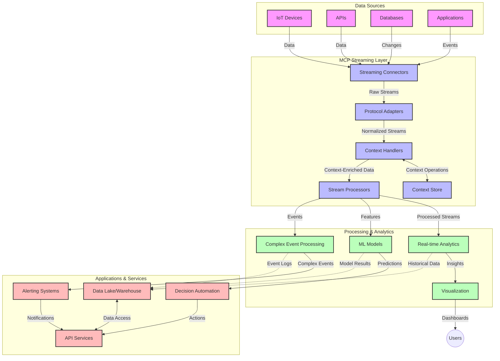

<!--
CO_OP_TRANSLATOR_METADATA:
{
  "original_hash": "68c518dbff8a3b127ed2aa934054c56c",
  "translation_date": "2025-06-11T17:20:19+00:00",
  "source_file": "05-AdvancedTopics/mcp-realtimestreaming/README.md",
  "language_code": "no"
}
-->
# Modellkontekstprotokoll for sanntids datastrømming

## Oversikt

Sanntids datastrømming har blitt essensielt i dagens datadrevne verden, der bedrifter og applikasjoner trenger umiddelbar tilgang til informasjon for å ta raske beslutninger. Modellkontekstprotokollen (MCP) representerer et betydelig fremskritt i å optimalisere disse sanntidsstrømmene, forbedre databehandlings-effektiviteten, opprettholde kontekstuell integritet og øke systemets totale ytelse.

Denne modulen utforsker hvordan MCP endrer sanntids datastrømming ved å tilby en standardisert tilnærming til kontekststyring på tvers av AI-modeller, strømmingsplattformer og applikasjoner.

## Introduksjon til sanntids datastrømming

Sanntids datastrømming er et teknologisk paradigme som muliggjør kontinuerlig overføring, behandling og analyse av data etter hvert som de genereres, slik at systemer kan reagere umiddelbart på ny informasjon. I motsetning til tradisjonell batch-prosessering som opererer på statiske datasett, behandler strømming data i bevegelse, og leverer innsikt og handlinger med minimal forsinkelse.

### Grunnleggende konsepter i sanntids datastrømming:

- **Kontinuerlig dataflyt**: Data behandles som en kontinuerlig, uavbrutt strøm av hendelser eller poster.
- **Lav latensbehandling**: Systemer er designet for å minimere tiden mellom datagenerering og behandling.
- **Skalerbarhet**: Strømmingsarkitekturer må håndtere variabel datamengde og hastighet.
- **Feiltoleranse**: Systemer må være robuste mot feil for å sikre uavbrutt dataflyt.
- **Tilstandshåndtering**: Å opprettholde kontekst på tvers av hendelser er avgjørende for meningsfull analyse.

### Modellkontekstprotokollen og sanntidsstrømming

Modellkontekstprotokollen (MCP) løser flere viktige utfordringer i sanntidsstrømmingsmiljøer:

1. **Kontekstuell kontinuitet**: MCP standardiserer hvordan kontekst opprettholdes på tvers av distribuerte strømmekomponenter, og sikrer at AI-modeller og prosesseringsnoder har tilgang til relevant historisk og miljømessig kontekst.

2. **Effektiv tilstandshåndtering**: Ved å tilby strukturerte mekanismer for kontekstoverføring reduserer MCP belastningen ved tilstandshåndtering i strømmingsrørledninger.

3. **Interoperabilitet**: MCP skaper et felles språk for kontekstdeling mellom ulike strømmingsteknologier og AI-modeller, noe som muliggjør mer fleksible og utvidbare arkitekturer.

4. **Strømmingsoptimalisert kontekst**: MCP-implementasjoner kan prioritere hvilke kontekstelementer som er mest relevante for sanntidsbeslutninger, og optimaliserer både ytelse og nøyaktighet.

5. **Adaptiv behandling**: Med riktig kontekststyring gjennom MCP kan strømmingssystemer dynamisk justere behandlingen basert på endrede forhold og mønstre i dataene.

I moderne applikasjoner, fra IoT-sensornettverk til finansielle handelsplattformer, muliggjør integrasjonen av MCP med strømmingsteknologier mer intelligent, kontekstbevisst behandling som kan respondere hensiktsmessig på komplekse, dynamiske situasjoner i sanntid.

## Læringsmål

Etter denne leksjonen skal du kunne:

- Forstå grunnprinsippene i sanntids datastrømming og de tilhørende utfordringene
- Forklare hvordan Modellkontekstprotokollen (MCP) forbedrer sanntids datastrømming
- Implementere MCP-baserte strømmingsløsninger med populære rammeverk som Kafka og Pulsar
- Designe og drifte feiltolerante, høyytelses strømmingsarkitekturer med MCP
- Anvende MCP-konsepter i IoT, finanshandel og AI-drevne analysetilfeller
- Vurdere nye trender og fremtidige innovasjoner innen MCP-baserte strømmingsteknologier

### Definisjon og betydning

Sanntids datastrømming innebærer kontinuerlig generering, behandling og levering av data med minimal forsinkelse. I motsetning til batch-prosessering, hvor data samles og behandles i grupper, behandles strømmingsdata inkrementelt etter hvert som de kommer, noe som muliggjør umiddelbar innsikt og handling.

Nøkkeltrekk ved sanntids datastrømming inkluderer:

- **Lav latens**: Behandling og analyse av data innen millisekunder til sekunder
- **Kontinuerlig flyt**: Uavbrutte datastrømmer fra ulike kilder
- **Umiddelbar behandling**: Analyse av data etter hvert som de ankommer, ikke i batch
- **Hendelsesdrevet arkitektur**: Respons på hendelser idet de skjer

### Utfordringer i tradisjonell datastrømming

Tradisjonelle tilnærminger til datastrømming møter flere begrensninger:

1. **Konteksttap**: Vanskeligheter med å opprettholde kontekst på tvers av distribuerte systemer
2. **Skalerbarhetsproblemer**: Utfordringer med å håndtere store datavolumer og høy hastighet
3. **Integrasjonskompleksitet**: Problemer med interoperabilitet mellom ulike systemer
4. **Latensstyring**: Balansering av gjennomstrømning og behandlingstid
5. **Datakonsistens**: Sikre nøyaktighet og fullstendighet i datastrømmen

## Forstå Modellkontekstprotokollen (MCP)

### Hva er MCP?

Modellkontekstprotokollen (MCP) er en standardisert kommunikasjonsprotokoll designet for å legge til rette for effektiv samhandling mellom AI-modeller og applikasjoner. I sammenheng med sanntids datastrømming tilbyr MCP et rammeverk for:

- Å bevare kontekst gjennom hele datapipelinen
- Standardisere datautvekslingsformater
- Optimalisere overføring av store datasett
- Forbedre kommunikasjon mellom modell-til-modell og modell-til-applikasjon

### Kjernekomponenter og arkitektur

MCP-arkitekturen for sanntidsstrømming består av flere viktige komponenter:

1. **Kontekstbehandlere**: Administrerer og opprettholder kontekstuell informasjon gjennom strømmingsrøret
2. **Strømmingsprosessorer**: Behandler innkommende datastrømmer med kontekstbevisste metoder
3. **Protokolladaptere**: Konverterer mellom ulike strømmingsprotokoller samtidig som konteksten bevares
4. **Kontekstlager**: Effektiv lagring og henting av kontekstuell informasjon
5. **Strømmingskoblinger**: Kobler til ulike strømmingsplattformer (Kafka, Pulsar, Kinesis osv.)



### Hvordan MCP forbedrer sanntids datahåndtering

MCP løser tradisjonelle utfordringer i strømming gjennom:

- **Kontektuell integritet**: Opprettholder relasjoner mellom datapunkter gjennom hele pipelinen
- **Optimalisert overføring**: Reduserer redundans i datautveksling via intelligent kontekststyring
- **Standardiserte grensesnitt**: Tilbyr konsistente API-er for strømmingskomponenter
- **Redusert latens**: Minimerer prosesseringskostnader gjennom effektiv kontekstbehandling
- **Forbedret skalerbarhet**: Støtter horisontal skalering samtidig som konteksten bevares

## Integrasjon og implementering

Sanntids datastrømmingssystemer krever nøye arkitekturdesign og implementering for å opprettholde både ytelse og kontekstuell integritet. Modellkontekstprotokollen gir en standardisert tilnærming for integrasjon av AI-modeller og strømmingsteknologier, som muliggjør mer avanserte, kontekstbevisste behandlingsrørledninger.

### Oversikt over MCP-integrasjon i strømmingsarkitekturer

Implementering av MCP i sanntidsstrømmingsmiljøer krever flere viktige hensyn:

1. **Kontekstserialisering og transport**: MCP tilbyr effektive mekanismer for koding av kontekstinformasjon i strømmingsdatapakker, og sikrer at essensiell kontekst følger data gjennom hele prosesseringsrøret. Dette inkluderer standardiserte serialiseringsformater optimalisert for strømming.

2. **Tilstandshåndtert strømmingsprosessering**: MCP muliggjør mer intelligent tilstandshåndtering ved å opprettholde konsistent kontekstrepresentasjon på tvers av prosesseringsnoder. Dette er spesielt verdifullt i distribuerte strømmingsarkitekturer hvor tilstandshåndtering tradisjonelt er utfordrende.

3. **Hendelsestid vs. prosesseringstid**: MCP-implementasjoner må håndtere utfordringen med å skille mellom når hendelser skjedde og når de behandles. Protokollen kan inkludere tidsmessig kontekst som bevarer hendelsestidsemantikk.

4. **Backpressure-håndtering**: Ved å standardisere kontekstbehandling hjelper MCP med å håndtere backpressure i strømmingssystemer, slik at komponenter kan kommunisere sine prosesseringskapasiteter og justere flyten deretter.

5. **Kontekstvinduer og aggregering**: MCP legger til rette for mer avanserte vindusoperasjoner ved å tilby strukturerte representasjoner av tidsmessig og relasjonell kontekst, som muliggjør mer meningsfulle aggregeringer over hendelsesstrømmer.

6. **Eksakt-én-gang prosessering**: I systemer som krever eksakt-én-gang-semantikk, kan MCP inkludere prosesseringsmetadata for å spore og verifisere prosesseringsstatus på tvers av distribuerte komponenter.

Implementeringen av MCP på tvers av ulike strømmingsteknologier skaper en enhetlig tilnærming til kontekststyring, som reduserer behovet for tilpasset integrasjonskode samtidig som systemets evne til å opprettholde meningsfull kontekst gjennom databehandlingen styrkes.

### MCP i ulike datastrømmingsrammeverk

MCP kan integreres med populære strømmingsrammeverk, inkludert:

#### Apache Kafka-integrasjon

```python
from mcp_streaming import MCPKafkaConnector

# Initialize MCP Kafka connector
connector = MCPKafkaConnector(
    bootstrap_servers='localhost:9092',
    context_preservation=True
)

# Create a context-aware consumer
consumer = connector.create_consumer('input-topic')

# Process streaming data with context
for message in consumer:
    context = message.get_context()
    data = message.get_value()
    
    # Process with context awareness
    result = process_with_context(data, context)
    
    # Produce output with preserved context
    connector.produce('output-topic', result, context=context)
```

#### Apache Pulsar-implementasjon

```python
from mcp_streaming import MCPPulsarClient

# Initialize MCP Pulsar client
client = MCPPulsarClient('pulsar://localhost:6650')

# Subscribe with context awareness
consumer = client.subscribe('input-topic', 'subscription-name', 
                           context_enabled=True)

# Process messages with context preservation
while True:
    message = consumer.receive()
    context = message.get_context()
    
    # Process with context
    result = process_with_context(message.data(), context)
    
    # Acknowledge the message
    consumer.acknowledge(message)
    
    # Send result with preserved context
    producer = client.create_producer('output-topic')
    producer.send(result, context=context)
```

### Beste praksis for utrulling

Når du implementerer MCP for sanntidsstrømming:

1. **Design for feiltoleranse**:
   - Implementer riktig feilhåndtering
   - Bruk dead-letter-køer for mislykkede meldinger
   - Design idempotente prosessorer

2. **Optimaliser ytelse**:
   - Konfigurer passende bufferstørrelser
   - Bruk batching der det er hensiktsmessig
   - Implementer backpressure-mekanismer

3. **Overvåk og observer**:
   - Følg med på strømmingsprosess-metrikker
   - Overvåk kontekstpropagering
   - Sett opp varsler ved avvik

4. **Sikre strømmene dine**:
   - Implementer kryptering for sensitiv data
   - Bruk autentisering og autorisasjon
   - Påfør riktige tilgangskontroller

### MCP i IoT og edge computing

MCP forbedrer IoT-strømming ved å:

- Bevare enhetskontekst gjennom hele behandlingsrøret
- Muliggjøre effektiv edge-til-sky datastrømming
- Støtte sanntidsanalyse av IoT-datastrømmer
- Legge til rette for enhet-til-enhet-kommunikasjon med kontekst

Eksempel: Smarte by-sensornettverk  
```
Sensors → Edge Gateways → MCP Stream Processors → Real-time Analytics → Automated Responses
```

### Rolle i finansielle transaksjoner og høyfrekvent handel

MCP gir betydelige fordeler for finansielle datastrømmer:

- Ultra-lav latens for handelsbeslutninger
- Opprettholder transaksjonskontekst gjennom hele behandlingen
- Støtter kompleks hendelsesbehandling med kontekstbevissthet
- Sikrer datakonsistens i distribuerte handelssystemer

### Forbedring av AI-drevne dataanalyser

MCP åpner nye muligheter for strømmingsanalyse:

- Sanntids modelltrening og inferens
- Kontinuerlig læring fra datastrømmer
- Kontekstbevisst funksjonsekstraksjon
- Flere modell-inferensrørledninger med bevart kontekst

## Fremtidige trender og innovasjoner

### Utvikling av MCP i sanntidsmiljøer

Fremover forventes MCP å utvikle seg for å håndtere:

- **Integrasjon med kvanteberegning**: Forberede kvantebaserte strømmingssystemer
- **Edge-native behandling**: Flytte mer kontekstbevisst behandling til edge-enheter
- **Autonom strømmingsstyring**: Selvovervåkende og selvoptimaliserende strømmingsrørledninger
- **Føderert strømming**: Distribuert behandling med ivaretakelse av personvern

### Potensielle teknologiske fremskritt

Nye teknologier som vil forme fremtiden for MCP-strømming:

1. **AI-optimaliserte strømmingsprotokoller**: Skreddersydde protokoller for AI-arbeidsbelastninger
2. **Neuromorfisk databehandling**: Hjerneinspirert databehandling for strømmingsprosesser
3. **Serverløs strømming**: Hendelsesdrevet, skalerbar strømming uten infrastrukturadministrasjon
4. **Distribuerte kontekstlagre**: Globalt distribuerte, men svært konsistente kontekststyringssystemer

## Praktiske øvelser

### Øvelse 1: Sette opp en grunnleggende MCP-strømmingspipeline

I denne øvelsen lærer du hvordan du:

- Konfigurerer et grunnleggende MCP-strømmingsmiljø
- Implementerer kontekstbehandlere for strømmingsprosessering
- Tester og validerer kontekstbevaring

### Øvelse 2: Bygge et sanntids analyse-dashboard

Lag en fullstendig applikasjon som:

- Inntar datastrømmer ved hjelp av MCP
- Behandler strømmene mens kontekst opprettholdes
- Visualiserer resultater i sanntid

### Øvelse 3: Implementere kompleks hendelsesbehandling med MCP

Avansert øvelse som dekker:

- Mønsteroppdagelse i strømmene
- Kontekstuell korrelasjon på tvers av flere strømminger
- Generering av komplekse hendelser med bevart kontekst

## Ekstra ressurser

- [Model Context Protocol Specification](https://github.com/microsoft/model-context-protocol) - Offisiell MCP-spesifikasjon og dokumentasjon
- [Apache Kafka Documentation](https://kafka.apache.org/documentation/) - Lær om Kafka for strømmingsbehandling
- [Apache Pulsar](https://pulsar.apache.org/) - Enhetlig meldings- og strømmingsplattform
- [Streaming Systems: The What, Where, When, and How of Large-Scale Data Processing](https://www.oreilly.com/library/view/streaming-systems/9781491983867/) - Omfattende bok om strømmingsarkitekturer
- [Microsoft Azure Event Hubs](https://learn.microsoft.com/en-us/azure/event-hubs/event-hubs-about) - Administrert hendelsesstrømmingstjeneste
- [MLflow Documentation](https://mlflow.org/docs/latest/index.html) - For ML-modellsporing og distribusjon
- [Real-Time Analytics with Apache Storm](https://storm.apache.org/releases/current/index.html) - Behandlingsrammeverk for sanntidsberegning
- [Flink ML](https://nightlies.apache.org/flink/flink-ml-docs-master/) - Maskinlæringsbibliotek for Apache Flink
- [LangChain Documentation](https://python.langchain.com/docs/get_started/introduction) - Bygge applikasjoner med LLM-er

## Læringsutbytte

Etter å ha fullført denne modulen vil du kunne:

- Forstå grunnprinsippene i sanntids datastrømming og de tilhørende utfordringene
- Forklare hvordan Modellkontekstprotokollen (MCP) forbedrer sanntids datastrømming
- Implementere MCP-baserte strømmingsløsninger med populære rammeverk som Kafka og Pulsar
- Designe og drifte feiltolerante, høyytelses strømmingsarkitekturer med MCP
- Anvende MCP-konsepter i IoT, finanshandel og AI-drevne analysetilfeller
- Vurdere nye trender og fremtidige innovasjoner innen MCP-baserte strømmingsteknologier

## Hva skjer videre

- [6. Community Contributions](../../06-CommunityContributions/README.md)

**Ansvarsfraskrivelse**:  
Dette dokumentet er oversatt ved hjelp av AI-oversettelsestjenesten [Co-op Translator](https://github.com/Azure/co-op-translator). Selv om vi streber etter nøyaktighet, vennligst vær oppmerksom på at automatiske oversettelser kan inneholde feil eller unøyaktigheter. Det opprinnelige dokumentet på originalspråket skal anses som den autoritative kilden. For kritisk informasjon anbefales profesjonell menneskelig oversettelse. Vi er ikke ansvarlige for eventuelle misforståelser eller feiltolkninger som oppstår ved bruk av denne oversettelsen.