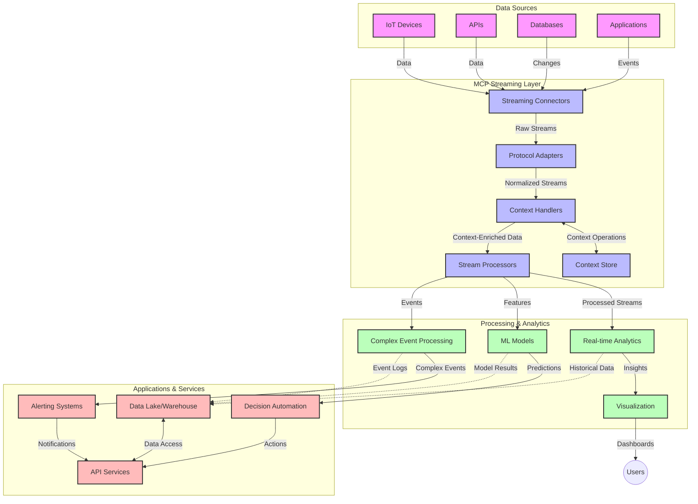

<!--
CO_OP_TRANSLATOR_METADATA:
{
  "original_hash": "195f7287638b77a549acadd96c8f981c",
  "translation_date": "2025-06-13T00:11:10+00:00",
  "source_file": "05-AdvancedTopics/mcp-realtimestreaming/README.md",
  "language_code": "no"
}
-->
# Modellkontekstprotokoll for sanntids datastrømming

## Oversikt

Sanntids datastrømming har blitt essensielt i dagens datadrevne verden, hvor bedrifter og applikasjoner krever umiddelbar tilgang til informasjon for å kunne ta raske beslutninger. Modellkontekstprotokollen (MCP) representerer et viktig fremskritt i å optimalisere disse sanntidsstrømmene, ved å forbedre databehandlingseffektiviteten, opprettholde kontekstuell integritet og øke den totale systemytelsen.

Denne modulen utforsker hvordan MCP forvandler sanntids datastrømming ved å tilby en standardisert tilnærming til kontekststyring på tvers av AI-modeller, strømmingsplattformer og applikasjoner.

## Introduksjon til sanntids datastrømming

Sanntids datastrømming er et teknologisk paradigme som muliggjør kontinuerlig overføring, behandling og analyse av data mens de genereres, slik at systemer kan reagere umiddelbart på ny informasjon. I motsetning til tradisjonell batchbehandling som opererer på statiske datasett, behandles data i bevegelse, og gir innsikt og handlinger med minimal forsinkelse.

### Kjerneprinsipper for sanntids datastrømming:

- **Kontinuerlig dataflyt**: Data behandles som en uavbrutt, evigvarende strøm av hendelser eller poster.
- **Lav latens i behandling**: Systemer er designet for å minimere tiden mellom datagenerering og behandling.
- **Skalerbarhet**: Strømmingsarkitekturer må håndtere variabel datamengde og hastighet.
- **Feiltoleranse**: Systemene må være robuste mot feil for å sikre uavbrutt dataflyt.
- **Tilstandshåndtering**: Det er avgjørende å opprettholde kontekst over hendelser for meningsfull analyse.

### Modellkontekstprotokollen og sanntidsstrømming

Modellkontekstprotokollen (MCP) løser flere viktige utfordringer i sanntids strømmingsmiljøer:

1. **Kontekstuelt kontinuitet**: MCP standardiserer hvordan kontekst opprettholdes på tvers av distribuerte strømmingskomponenter, og sikrer at AI-modeller og behandlingsnoder har tilgang til relevant historisk og miljømessig kontekst.

2. **Effektiv tilstandshåndtering**: Ved å tilby strukturerte mekanismer for kontekstoverføring reduserer MCP belastningen ved tilstandshåndtering i strømmingsrørledninger.

3. **Interoperabilitet**: MCP skaper et felles språk for kontekstdeling mellom ulike strømmingsteknologier og AI-modeller, noe som muliggjør mer fleksible og utvidbare arkitekturer.

4. **Strømmingsoptimalisert kontekst**: MCP-implementasjoner kan prioritere hvilke kontekstelementer som er mest relevante for sanntids beslutningstaking, og optimaliserer både ytelse og nøyaktighet.

5. **Adaptiv behandling**: Med riktig kontekststyring via MCP kan strømmingssystemer dynamisk justere behandlingen basert på endrede forhold og mønstre i dataene.

I moderne applikasjoner, fra IoT-sensornettverk til finansielle handelsplattformer, muliggjør integrering av MCP med strømmingsteknologier mer intelligent, kontekstbevisst behandling som kan reagere hensiktsmessig på komplekse, dynamiske situasjoner i sanntid.

## Læringsmål

Etter denne leksjonen skal du kunne:

- Forstå grunnprinsippene for sanntids datastrømming og tilhørende utfordringer
- Forklare hvordan Modellkontekstprotokollen (MCP) forbedrer sanntids datastrømming
- Implementere MCP-baserte strømmingsløsninger ved bruk av populære rammeverk som Kafka og Pulsar
- Designe og distribuere feiltolerante, høyytelses strømmingsarkitekturer med MCP
- Anvende MCP-konsepter på IoT, finanshandel og AI-drevne analysebrukstilfeller
- Vurdere nye trender og fremtidige innovasjoner innen MCP-baserte strømmingsteknologier

### Definisjon og betydning

Sanntids datastrømming innebærer kontinuerlig generering, behandling og levering av data med minimal forsinkelse. I motsetning til batchbehandling, hvor data samles og behandles i grupper, behandles strømmende data inkrementelt etter hvert som de kommer inn, noe som muliggjør umiddelbar innsikt og handling.

Nøkkeltrekk ved sanntids datastrømming inkluderer:

- **Lav latens**: Behandling og analyse av data innen millisekunder til sekunder
- **Kontinuerlig flyt**: Uavbrutte datastreams fra ulike kilder
- **Umiddelbar behandling**: Analyse av data ved ankomst, ikke i batch
- **Hendelsesdrevet arkitektur**: Reaksjon på hendelser i det de skjer

### Utfordringer i tradisjonell datastrømming

Tradisjonelle tilnærminger til datastrømming møter flere begrensninger:

1. **Konteksttap**: Vanskeligheter med å opprettholde kontekst på tvers av distribuerte systemer
2. **Skalerbarhetsproblemer**: Utfordringer med å håndtere høye volumer og hastigheter
3. **Integrasjonskompleksitet**: Problemer med interoperabilitet mellom ulike systemer
4. **Latenshåndtering**: Balansering mellom gjennomstrømning og behandlingstid
5. **Datakonsistens**: Sikring av nøyaktighet og fullstendighet i dataflyten

## Forstå Modellkontekstprotokollen (MCP)

### Hva er MCP?

Modellkontekstprotokollen (MCP) er en standardisert kommunikasjonsprotokoll designet for å legge til rette for effektiv interaksjon mellom AI-modeller og applikasjoner. I sanntids datastrømming gir MCP en ramme for:

- Å bevare kontekst gjennom hele datapipelinen
- Standardisere datautvekslingsformater
- Optimalisere overføring av store datasett
- Forbedre kommunikasjonen mellom modell-til-modell og modell-til-applikasjon

### Kjernekomponenter og arkitektur

MCP-arkitekturen for sanntidsstrømming består av flere viktige komponenter:

1. **Kontekstbehandlere**: Håndterer og opprettholder kontekstuell informasjon gjennom strømmingspipen
2. **Strømmingsprosessorer**: Behandler innkommende datastrømmer med kontekstbevisste metoder
3. **Protokolladaptere**: Konverterer mellom ulike strømmingsprotokoller samtidig som kontekst bevares
4. **Kontekstlagring**: Effektiv lagring og henting av kontekstuell informasjon
5. **Strømmingskoblinger**: Kobler til ulike strømmingsplattformer (Kafka, Pulsar, Kinesis osv.)



### Hvordan MCP forbedrer sanntids databehandling

MCP løser tradisjonelle strømmingsutfordringer gjennom:

- **Kontekstuell integritet**: Opprettholder relasjoner mellom datapunkter gjennom hele pipelinen
- **Optimalisert overføring**: Reduserer duplisering i datautveksling gjennom intelligent kontekststyring
- **Standardiserte grensesnitt**: Tilbyr konsistente API-er for strømmingskomponenter
- **Redusert latens**: Minimerer behandlingskostnader med effektiv kontekstbehandling
- **Forbedret skalerbarhet**: Støtter horisontal skalering samtidig som kontekst bevares

## Integrasjon og implementering

Sanntids datastrømmingssystemer krever nøye arkitektonisk design og implementering for å opprettholde både ytelse og kontekstuell integritet. Modellkontekstprotokollen tilbyr en standardisert tilnærming for å integrere AI-modeller og strømmingsteknologier, noe som muliggjør mer avanserte, kontekstbevisste behandlingsrørledninger.

### Oversikt over MCP-integrasjon i strømmingsarkitekturer

Implementering av MCP i sanntids strømmingsmiljøer involverer flere viktige hensyn:

1. **Kontekstserialisering og transport**: MCP tilbyr effektive mekanismer for å kode kontekstuell informasjon i strømmingsdatapakker, slik at essensiell kontekst følger data gjennom hele behandlingsrøret. Dette inkluderer standardiserte serialiseringsformater optimalisert for strømmingstransport.

2. **Tilstandshåndtering i strømmen**: MCP muliggjør mer intelligent tilstandshåndtering ved å opprettholde konsistent kontekstrepresentasjon på tvers av behandlingsnoder. Dette er spesielt verdifullt i distribuerte strømmingsarkitekturer hvor tilstandsstyring tradisjonelt er utfordrende.

3. **Hendelsestid vs. behandlingstid**: MCP-implementasjoner må håndtere utfordringen med å skille mellom når hendelser inntraff og når de behandles. Protokollen kan inkludere tidsmessig kontekst som bevarer hendelsestidens semantikk.

4. **Backpressure-håndtering**: Ved å standardisere kontekstbehandling hjelper MCP med å håndtere backpressure i strømmingssystemer, slik at komponenter kan kommunisere sine behandlingskapasiteter og justere dataflyten deretter.

5. **Kontekstvinduing og aggregering**: MCP legger til rette for mer avanserte vindusoperasjoner ved å tilby strukturerte representasjoner av tidsmessig og relasjonell kontekst, noe som muliggjør mer meningsfulle aggregeringer over hendelsesstrømmer.

6. **Eksakt-en-gang-behandling**: I systemer som krever eksakt-en-gang-semantikk, kan MCP inkorporere behandlingsmetadata for å spore og verifisere behandlingsstatus på tvers av distribuerte komponenter.

Implementeringen av MCP på tvers av ulike strømmingsteknologier skaper en enhetlig tilnærming til kontekststyring, reduserer behovet for spesialtilpasset integrasjonskode samtidig som systemets evne til å bevare meningsfull kontekst gjennom dataflyten styrkes.

### MCP i ulike datastrømmingsrammeverk

Disse eksemplene følger den nåværende MCP-spesifikasjonen som fokuserer på en JSON-RPC-basert protokoll med ulike transportmekanismer. Koden viser hvordan du kan implementere egendefinerte transportlag som integrerer strømmingsplattformer som Kafka og Pulsar, samtidig som full kompatibilitet med MCP-protokollen opprettholdes.

Eksemplene er designet for å vise hvordan strømmingsplattformer kan integreres med MCP for å tilby sanntids databehandling samtidig som den kontekstbevisste kjernen i MCP ivaretas. Denne tilnærmingen sikrer at kodeeksemplene nøyaktig reflekterer den nåværende statusen for MCP-spesifikasjonen per juni 2025.

MCP kan integreres med populære strømmingsrammeverk, inkludert:

#### Apache Kafka-integrasjon

```python
import asyncio
import json
from typing import Dict, Any, Optional
from confluent_kafka import Consumer, Producer, KafkaError
from mcp.client import Client, ClientCapabilities
from mcp.core.message import JsonRpcMessage
from mcp.core.transports import Transport

# Custom transport class to bridge MCP with Kafka
class KafkaMCPTransport(Transport):
    def __init__(self, bootstrap_servers: str, input_topic: str, output_topic: str):
        self.bootstrap_servers = bootstrap_servers
        self.input_topic = input_topic
        self.output_topic = output_topic
        self.producer = Producer({'bootstrap.servers': bootstrap_servers})
        self.consumer = Consumer({
            'bootstrap.servers': bootstrap_servers,
            'group.id': 'mcp-client-group',
            'auto.offset.reset': 'earliest'
        })
        self.message_queue = asyncio.Queue()
        self.running = False
        self.consumer_task = None
        
    async def connect(self):
        """Connect to Kafka and start consuming messages"""
        self.consumer.subscribe([self.input_topic])
        self.running = True
        self.consumer_task = asyncio.create_task(self._consume_messages())
        return self
        
    async def _consume_messages(self):
        """Background task to consume messages from Kafka and queue them for processing"""
        while self.running:
            try:
                msg = self.consumer.poll(1.0)
                if msg is None:
                    await asyncio.sleep(0.1)
                    continue
                
                if msg.error():
                    if msg.error().code() == KafkaError._PARTITION_EOF:
                        continue
                    print(f"Consumer error: {msg.error()}")
                    continue
                
                # Parse the message value as JSON-RPC
                try:
                    message_str = msg.value().decode('utf-8')
                    message_data = json.loads(message_str)
                    mcp_message = JsonRpcMessage.from_dict(message_data)
                    await self.message_queue.put(mcp_message)
                except Exception as e:
                    print(f"Error parsing message: {e}")
            except Exception as e:
                print(f"Error in consumer loop: {e}")
                await asyncio.sleep(1)
    
    async def read(self) -> Optional[JsonRpcMessage]:
        """Read the next message from the queue"""
        try:
            message = await self.message_queue.get()
            return message
        except Exception as e:
            print(f"Error reading message: {e}")
            return None
    
    async def write(self, message: JsonRpcMessage) -> None:
        """Write a message to the Kafka output topic"""
        try:
            message_json = json.dumps(message.to_dict())
            self.producer.produce(
                self.output_topic,
                message_json.encode('utf-8'),
                callback=self._delivery_report
            )
            self.producer.poll(0)  # Trigger callbacks
        except Exception as e:
            print(f"Error writing message: {e}")
    
    def _delivery_report(self, err, msg):
        """Kafka producer delivery callback"""
        if err is not None:
            print(f'Message delivery failed: {err}')
        else:
            print(f'Message delivered to {msg.topic()} [{msg.partition()}]')
    
    async def close(self) -> None:
        """Close the transport"""
        self.running = False
        if self.consumer_task:
            self.consumer_task.cancel()
            try:
                await self.consumer_task
            except asyncio.CancelledError:
                pass
        self.consumer.close()
        self.producer.flush()

# Example usage of the Kafka MCP transport
async def kafka_mcp_example():
    # Create MCP client with Kafka transport
    client = Client(
        {"name": "kafka-mcp-client", "version": "1.0.0"},
        ClientCapabilities({})
    )
    
    # Create and connect the Kafka transport
    transport = KafkaMCPTransport(
        bootstrap_servers="localhost:9092",
        input_topic="mcp-responses",
        output_topic="mcp-requests"
    )
    
    await client.connect(transport)
    
    try:
        # Initialize the MCP session
        await client.initialize()
        
        # Example of executing a tool via MCP
        response = await client.execute_tool(
            "process_data",
            {
                "data": "sample data",
                "metadata": {
                    "source": "sensor-1",
                    "timestamp": "2025-06-12T10:30:00Z"
                }
            }
        )
        
        print(f"Tool execution response: {response}")
        
        # Clean shutdown
        await client.shutdown()
    finally:
        await transport.close()

# Run the example
if __name__ == "__main__":
    asyncio.run(kafka_mcp_example())
```

#### Apache Pulsar-implementasjon

```python
import asyncio
import json
import pulsar
from typing import Dict, Any, Optional
from mcp.core.message import JsonRpcMessage
from mcp.core.transports import Transport
from mcp.server import Server, ServerOptions
from mcp.server.tools import Tool, ToolExecutionContext, ToolMetadata

# Create a custom MCP transport that uses Pulsar
class PulsarMCPTransport(Transport):
    def __init__(self, service_url: str, request_topic: str, response_topic: str):
        self.service_url = service_url
        self.request_topic = request_topic
        self.response_topic = response_topic
        self.client = pulsar.Client(service_url)
        self.producer = self.client.create_producer(response_topic)
        self.consumer = self.client.subscribe(
            request_topic,
            "mcp-server-subscription",
            consumer_type=pulsar.ConsumerType.Shared
        )
        self.message_queue = asyncio.Queue()
        self.running = False
        self.consumer_task = None
    
    async def connect(self):
        """Connect to Pulsar and start consuming messages"""
        self.running = True
        self.consumer_task = asyncio.create_task(self._consume_messages())
        return self
    
    async def _consume_messages(self):
        """Background task to consume messages from Pulsar and queue them for processing"""
        while self.running:
            try:
                # Non-blocking receive with timeout
                msg = self.consumer.receive(timeout_millis=500)
                
                # Process the message
                try:
                    message_str = msg.data().decode('utf-8')
                    message_data = json.loads(message_str)
                    mcp_message = JsonRpcMessage.from_dict(message_data)
                    await self.message_queue.put(mcp_message)
                    
                    # Acknowledge the message
                    self.consumer.acknowledge(msg)
                except Exception as e:
                    print(f"Error processing message: {e}")
                    # Negative acknowledge if there was an error
                    self.consumer.negative_acknowledge(msg)
            except Exception as e:
                # Handle timeout or other exceptions
                await asyncio.sleep(0.1)
    
    async def read(self) -> Optional[JsonRpcMessage]:
        """Read the next message from the queue"""
        try:
            message = await self.message_queue.get()
            return message
        except Exception as e:
            print(f"Error reading message: {e}")
            return None
    
    async def write(self, message: JsonRpcMessage) -> None:
        """Write a message to the Pulsar output topic"""
        try:
            message_json = json.dumps(message.to_dict())
            self.producer.send(message_json.encode('utf-8'))
        except Exception as e:
            print(f"Error writing message: {e}")
    
    async def close(self) -> None:
        """Close the transport"""
        self.running = False
        if self.consumer_task:
            self.consumer_task.cancel()
            try:
                await self.consumer_task
            except asyncio.CancelledError:
                pass
        self.consumer.close()
        self.producer.close()
        self.client.close()

# Define a sample MCP tool that processes streaming data
@Tool(
    name="process_streaming_data",
    description="Process streaming data with context preservation",
    metadata=ToolMetadata(
        required_capabilities=["streaming"]
    )
)
async def process_streaming_data(
    ctx: ToolExecutionContext,
    data: str,
    source: str,
    priority: str = "medium"
) -> Dict[str, Any]:
    """
    Process streaming data while preserving context
    
    Args:
        ctx: Tool execution context
        data: The data to process
        source: The source of the data
        priority: Priority level (low, medium, high)
        
    Returns:
        Dict containing processed results and context information
    """
    # Example processing that leverages MCP context
    print(f"Processing data from {source} with priority {priority}")
    
    # Access conversation context from MCP
    conversation_id = ctx.conversation_id if hasattr(ctx, 'conversation_id') else "unknown"
    
    # Return results with enhanced context
    return {
        "processed_data": f"Processed: {data}",
        "context": {
            "conversation_id": conversation_id,
            "source": source,
            "priority": priority,
            "processing_timestamp": ctx.get_current_time_iso()
        }
    }

# Example MCP server implementation using Pulsar transport
async def run_mcp_server_with_pulsar():
    # Create MCP server
    server = Server(
        {"name": "pulsar-mcp-server", "version": "1.0.0"},
        ServerOptions(
            capabilities={"streaming": True}
        )
    )
    
    # Register our tool
    server.register_tool(process_streaming_data)
    
    # Create and connect Pulsar transport
    transport = PulsarMCPTransport(
        service_url="pulsar://localhost:6650",
        request_topic="mcp-requests",
        response_topic="mcp-responses"
    )
    
    try:
        # Start the server with the Pulsar transport
        await server.run(transport)
    finally:
        await transport.close()

# Run the server
if __name__ == "__main__":
    asyncio.run(run_mcp_server_with_pulsar())
```

### Beste praksis for distribusjon

Når du implementerer MCP for sanntidsstrømming:

1. **Design for feiltoleranse**:
   - Implementer god feilhåndtering
   - Bruk dead-letter køer for mislykkede meldinger
   - Design idempotente prosessorer

2. **Optimaliser for ytelse**:
   - Konfigurer passende bufferstørrelser
   - Bruk batching der det er hensiktsmessig
   - Implementer backpressure-mekanismer

3. **Overvåk og observer**:
   - Følg med på strømmingsbehandlingsmetrikker
   - Overvåk kontekstpropagering
   - Sett opp varsler ved avvik

4. **Sikre strømningene dine**:
   - Krypter sensitiv data
   - Bruk autentisering og autorisasjon
   - Anvend riktige tilgangskontroller

### MCP i IoT og edge computing

MCP forbedrer IoT-strømming ved å:

- Bevare enhetskontekst gjennom hele behandlingsrøret
- Legge til rette for effektiv edge-til-sky datastrømming
- Støtte sanntidsanalyse av IoT-datastrømmer
- Tilrettelegge for enhet-til-enhet kommunikasjon med kontekst

Eksempel: Smarte bysensornettverk  
```
Sensors → Edge Gateways → MCP Stream Processors → Real-time Analytics → Automated Responses
```

### Rolle i finansielle transaksjoner og høyfrekvent handel

MCP gir betydelige fordeler for finansielle datastrømmer:

- Ekstremt lav latens i beslutningsprosesser for handel
- Opprettholder transaksjonskontekst gjennom hele behandlingen
- Støtter kompleks hendelsesbehandling med kontekstbevissthet
- Sikrer datakonsistens på tvers av distribuerte handelssystemer

### Forbedring av AI-drevne dataanalyser

MCP åpner nye muligheter for strømmingsanalyse:

- Sanntidstrening og inferens av modeller
- Kontinuerlig læring fra datastrømmer
- Kontekstbevisst funksjonsekstraksjon
- Flermodells inferensrørledninger med bevart kontekst

## Fremtidige trender og innovasjoner

### Utvikling av MCP i sanntidsmiljøer

Fremover forventes MCP å utvikle seg for å håndtere:

- **Integrasjon med kvanteberegning**: Forberede for kvantebaserte strømmingssystemer
- **Edge-native behandling**: Flytte mer kontekstbevisst behandling til edge-enheter
- **Autonom strømmingsstyring**: Selvoptimaliserende strømmingsrørledninger
- **Føderert strømming**: Distribuert behandling med ivaretatt personvern

### Potensielle teknologiske fremskritt

Fremvoksende teknologier som vil forme MCP-strømmingens fremtid:

1. **AI-optimaliserte strømmingsprotokoller**: Skreddersydde protokoller spesielt for AI-arbeidsmengder
2. **Neuromorfisk databehandling**: Hjerneinspirert databehandling for strømmingsprosessering
3. **Serverløs strømming**: Hendelsesdrevet, skalerbar strømming uten infrastrukturhåndtering
4. **Distribuerte kontekstlagre**: Globalt distribuerte, men svært konsistente kontekststyringssystemer

## Praktiske øvelser

### Øvelse 1: Sette opp en grunnleggende MCP-strømmingspipeline

I denne øvelsen lærer du å:
- Konfigurere et grunnleggende MCP-strømmingsmiljø
- Implementere kontekstbehandlere for strømmingsbehandling
- Teste og verifisere kontekstbevaring

### Øvelse 2: Bygge et sanntidsanalyse-dashboard

Lag en komplett applikasjon som:
- Inntar datastrømmer via MCP
- Behandler strømmen samtidig som kontekst opprettholdes
- Visualiserer resultater i sanntid

### Øvelse 3: Implementere kompleks hendelsesbehandling med MCP

Avansert øvelse som dekker:
- Mønsterdeteksjon i strømmer
- Kontekstuell korrelasjon på tvers av flere strømmer
- Generering av komplekse hendelser med bevart kontekst

## Ekstra ressurser

- [Model Context Protocol Specification](https://github.com/modelcontextprotocol) - Offisiell MCP-spesifikasjon og dokumentasjon
- [Apache Kafka Documentation](https://kafka.apache.org/documentation/) - Lær om Kafka for strømmingsbehandling
- [Apache Pulsar](https://pulsar.apache.org/) - Unified meldings- og strømmingsplattform
- [Streaming Systems: The What, Where, When, and How of Large-Scale Data Processing](https://www.oreilly.com/library/view/streaming-systems/9781491983867/) - Omfattende bok om strømmingsarkitekturer
- [Microsoft Azure Event Hubs](https://learn.microsoft.com/azure/event-hubs/event-hubs-about) - Administrert eventstrømmingstjeneste
- [MLflow Documentation](https://mlflow.org/docs/latest/index.html) - For ML-modellsporing og distribusjon
- [Real-Time Analytics with Apache Storm](https://storm.apache.org/releases/current/index.html) - Behandlingsrammeverk for sanntidsberegning
- [Flink ML](https://nightlies.apache.org/flink/flink-ml-docs-master/) - Maskinlæringsbibliotek for Apache Flink
- [LangChain Documentation](https://python.langchain.com/docs/get_started/introduction) - Bygge applikasjoner med LLMs

## Læringsresultater

Ved å fullføre denne modulen vil du kunne:

- Forstå grunnprinsippene for sanntids datastrømming og tilhørende utfordringer
- Forklare hvordan Modellkontekstprotokollen (MCP) forbedrer sanntids datastrømming
- Implementere MCP-baserte strømmingsløsninger ved bruk av populære rammeverk som Kafka og Pulsar
- Designe og distribuere feiltolerante, høyytelses strømmingsarkitekturer med MCP
- Anvende MCP-konsepter på IoT, finanshandel og AI-drevne analysebrukstilfeller
- Vurdere nye trender og fremtidige innovasjoner innen MCP-baser

**Ansvarsfraskrivelse**:  
Dette dokumentet er oversatt ved hjelp av AI-oversettelsestjenesten [Co-op Translator](https://github.com/Azure/co-op-translator). Selv om vi streber etter nøyaktighet, vennligst vær oppmerksom på at automatiserte oversettelser kan inneholde feil eller unøyaktigheter. Det originale dokumentet på dets opprinnelige språk bør betraktes som den autoritative kilden. For kritisk informasjon anbefales profesjonell menneskelig oversettelse. Vi er ikke ansvarlige for eventuelle misforståelser eller feiltolkninger som oppstår fra bruk av denne oversettelsen.