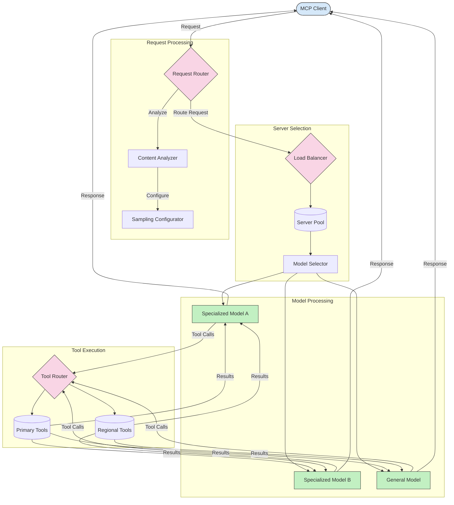

<!--
CO_OP_TRANSLATOR_METADATA:
{
  "original_hash": "2f1b473818b5a6cc9a9bbf777fffa6d4",
  "translation_date": "2025-07-14T21:48:35+00:00",
  "source_file": "05-AdvancedTopics/mcp-routing/README.md",
  "language_code": "no"
}
-->
## Prøvetaking og rutearkitektur i MCP

Prøvetaking er en kritisk komponent i Model Context Protocol (MCP) som muliggjør effektiv behandling og ruting av forespørsler. Det innebærer å analysere innkommende forespørsler for å avgjøre hvilken modell eller tjeneste som er best egnet til å håndtere dem, basert på ulike kriterier som innholdstype, brukerkontekst og systembelastning.

Prøvetaking og ruting kan kombineres for å skape en robust arkitektur som optimaliserer ressursutnyttelsen og sikrer høy tilgjengelighet. Prøvetakingsprosessen kan brukes til å klassifisere forespørsler, mens ruting sørger for at de sendes til riktige modeller eller tjenester.

Diagrammet nedenfor illustrerer hvordan prøvetaking og ruting fungerer sammen i en omfattende MCP-arkitektur:

## Hva skjer videre

- [5.6 Sampling](../mcp-sampling/README.md)

**Ansvarsfraskrivelse**:  
Dette dokumentet er oversatt ved hjelp av AI-oversettelsestjenesten [Co-op Translator](https://github.com/Azure/co-op-translator). Selv om vi streber etter nøyaktighet, vennligst vær oppmerksom på at automatiske oversettelser kan inneholde feil eller unøyaktigheter. Det opprinnelige dokumentet på originalspråket skal anses som den autoritative kilden. For kritisk informasjon anbefales profesjonell menneskelig oversettelse. Vi er ikke ansvarlige for eventuelle misforståelser eller feiltolkninger som oppstår ved bruk av denne oversettelsen.