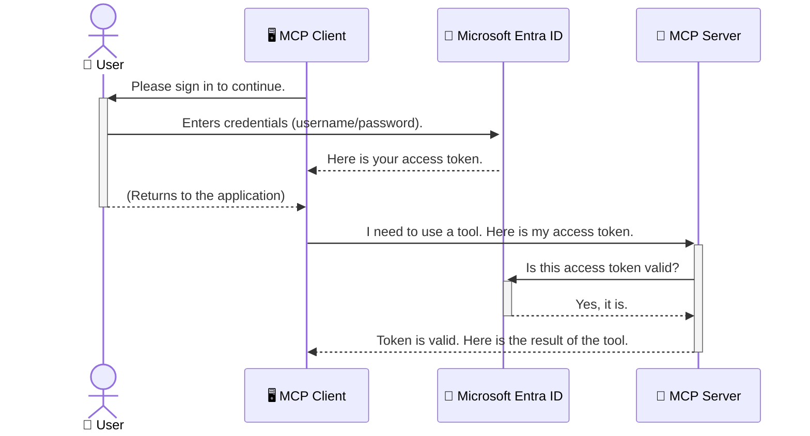

<!--
CO_OP_TRANSLATOR_METADATA:
{
  "original_hash": "6e562d7e5a77c8982da4aa8f762ad1d8",
  "translation_date": "2025-07-14T03:07:06+00:00",
  "source_file": "05-AdvancedTopics/mcp-security-entra/README.md",
  "language_code": "no"
}
-->
# Sikring av AI-arbeidsflyter: Entra ID-autentisering for Model Context Protocol-servere

## Introduksjon  
Å sikre Model Context Protocol (MCP)-serveren din er like viktig som å låse inngangsdøren hjemme. Å la MCP-serveren stå åpen eksponerer verktøyene og dataene dine for uautorisert tilgang, noe som kan føre til sikkerhetsbrudd. Microsoft Entra ID tilbyr en robust skybasert løsning for identitets- og tilgangsstyring, som hjelper deg med å sikre at bare autoriserte brukere og applikasjoner kan kommunisere med MCP-serveren din. I denne delen vil du lære hvordan du beskytter AI-arbeidsflytene dine ved hjelp av Entra ID-autentisering.

## Læringsmål  
Etter å ha fullført denne delen vil du kunne:

- Forstå viktigheten av å sikre MCP-servere.  
- Forklare grunnleggende om Microsoft Entra ID og OAuth 2.0-autentisering.  
- Skille mellom offentlige og konfidensielle klienter.  
- Implementere Entra ID-autentisering i både lokale (offentlig klient) og eksterne (konfidensiell klient) MCP-server-scenarier.  
- Anvende sikkerhetsbeste praksis ved utvikling av AI-arbeidsflyter.

## Sikkerhet og MCP  

Akkurat som du ikke ville latt inngangsdøren stå ulåst, bør du ikke la MCP-serveren være åpen for alle. Å sikre AI-arbeidsflytene dine er avgjørende for å bygge robuste, pålitelige og trygge applikasjoner. Dette kapitlet introduserer hvordan du bruker Microsoft Entra ID for å sikre MCP-serverne dine, slik at bare autoriserte brukere og applikasjoner får tilgang til verktøyene og dataene dine.

## Hvorfor sikkerhet er viktig for MCP-servere  

Tenk deg at MCP-serveren din har et verktøy som kan sende e-poster eller få tilgang til en kundedatabase. En usikret server betyr at hvem som helst potensielt kan bruke dette verktøyet, noe som kan føre til uautorisert datatilgang, spam eller andre skadelige handlinger.

Ved å implementere autentisering sikrer du at hver forespørsel til serveren blir verifisert, og bekrefter identiteten til brukeren eller applikasjonen som sender forespørselen. Dette er det første og viktigste steget for å sikre AI-arbeidsflytene dine.

## Introduksjon til Microsoft Entra ID  

[**Microsoft Entra ID**](https://adoption.microsoft.com/microsoft-security/entra/) er en skybasert tjeneste for identitets- og tilgangsstyring. Tenk på det som en universell sikkerhetsvakt for applikasjonene dine. Den håndterer den komplekse prosessen med å verifisere brukeridentiteter (autentisering) og avgjøre hva de har lov til å gjøre (autorisasjon).

Ved å bruke Entra ID kan du:

- Aktivere sikker pålogging for brukere.  
- Beskytte API-er og tjenester.  
- Administrere tilgangspolicyer fra ett sentralt sted.

For MCP-servere tilbyr Entra ID en robust og anerkjent løsning for å styre hvem som kan få tilgang til serverens funksjoner.

---

## Forstå magien: Hvordan Entra ID-autentisering fungerer  

Entra ID bruker åpne standarder som **OAuth 2.0** for å håndtere autentisering. Selv om detaljene kan være komplekse, er kjernen enkel og kan forklares med en analogi.

### En enkel introduksjon til OAuth 2.0: Valet-nøkkelen  

Tenk på OAuth 2.0 som en parkeringsassistent for bilen din. Når du kommer til en restaurant, gir du ikke parkeringsvakten hovednøkkelen. I stedet gir du en **valet-nøkkel** som har begrensede rettigheter – den kan starte bilen og låse dørene, men den kan ikke åpne bagasjerommet eller hanskerommet.

I denne analogien:

- **Du** er **Brukeren**.  
- **Bilen din** er **MCP-serveren** med sine verdifulle verktøy og data.  
- **Valet** er **Microsoft Entra ID**.  
- **Parkeringsvakten** er **MCP-klienten** (applikasjonen som prøver å få tilgang til serveren).  
- **Valet-nøkkelen** er **Access Token**.

Access token er en sikker tekststreng som MCP-klienten mottar fra Entra ID etter at du har logget inn. Klienten sender deretter denne tokenen til MCP-serveren med hver forespørsel. Serveren kan verifisere tokenen for å sikre at forespørselen er legitim og at klienten har nødvendige rettigheter, uten å måtte håndtere dine faktiske påloggingsopplysninger (som passord).

### Autentiseringsflyten  

Slik fungerer prosessen i praksis:



### Introduksjon til Microsoft Authentication Library (MSAL)  

Før vi går inn i koden, er det viktig å introdusere en sentral komponent du vil se i eksemplene: **Microsoft Authentication Library (MSAL)**.

MSAL er et bibliotek utviklet av Microsoft som gjør det mye enklere for utviklere å håndtere autentisering. I stedet for at du må skrive all kompleks kode for å håndtere sikkerhetstokener, pålogginger og oppfrisking av sesjoner, tar MSAL seg av det tunge arbeidet.

Å bruke et bibliotek som MSAL anbefales sterkt fordi:

- **Det er sikkert:** Det implementerer industristandardprotokoller og sikkerhetsbeste praksis, noe som reduserer risikoen for sårbarheter i koden din.  
- **Det forenkler utviklingen:** Det skjuler kompleksiteten i OAuth 2.0 og OpenID Connect-protokollene, slik at du kan legge til robust autentisering i applikasjonen med bare noen få kodelinjer.  
- **Det vedlikeholdes:** Microsoft oppdaterer og vedlikeholder MSAL aktivt for å håndtere nye sikkerhetstrusler og plattformendringer.

MSAL støtter mange språk og applikasjonsrammeverk, inkludert .NET, JavaScript/TypeScript, Python, Java, Go og mobilplattformer som iOS og Android. Dette betyr at du kan bruke samme konsistente autentiseringsmønstre på tvers av hele teknologistakken din.

For mer informasjon om MSAL, kan du se den offisielle [MSAL-oversiktsdokumentasjonen](https://learn.microsoft.com/entra/identity-platform/msal-overview).

---

## Sikre MCP-serveren din med Entra ID: En steg-for-steg-guide  

Nå skal vi gå gjennom hvordan du sikrer en lokal MCP-server (en som kommuniserer over `stdio`) ved hjelp av Entra ID. Dette eksempelet bruker en **offentlig klient**, som passer for applikasjoner som kjører på brukerens maskin, som en skrivebordsapp eller en lokal utviklingsserver.

### Scenario 1: Sikre en lokal MCP-server (med en offentlig klient)  

I dette scenariet ser vi på en MCP-server som kjører lokalt, kommuniserer over `stdio`, og bruker Entra ID for å autentisere brukeren før tilgang til verktøyene gis. Serveren har ett verktøy som henter brukerens profilinformasjon fra Microsoft Graph API.

#### 1. Registrere applikasjonen i Entra ID  

Før du skriver kode, må du registrere applikasjonen i Microsoft Entra ID. Dette forteller Entra ID om applikasjonen din og gir den tillatelse til å bruke autentiseringstjenesten.

1. Gå til **[Microsoft Entra-portalen](https://entra.microsoft.com/)**.  
2. Gå til **App registrations** og klikk på **New registration**.  
3. Gi applikasjonen et navn (f.eks. "My Local MCP Server").  
4. For **Supported account types**, velg **Accounts in this organizational directory only**.  
5. Du kan la **Redirect URI** stå tom for dette eksempelet.  
6. Klikk på **Register**.

Når applikasjonen er registrert, noter deg **Application (client) ID** og **Directory (tenant) ID**. Du trenger disse i koden din.

#### 2. Koden: En oversikt  

La oss se på de viktigste delene av koden som håndterer autentisering. Fullstendig kode for dette eksempelet finnes i [Entra ID - Local - WAM](https://github.com/Azure-Samples/mcp-auth-servers/tree/main/src/entra-id-local-wam)-mappen i [mcp-auth-servers GitHub-repositoriet](https://github.com/Azure-Samples/mcp-auth-servers).

**`AuthenticationService.cs`**  

Denne klassen håndterer samspillet med Entra ID.

- **`CreateAsync`**: Initialiserer `PublicClientApplication` fra MSAL. Den konfigureres med applikasjonens `clientId` og `tenantId`.  
- **`WithBroker`**: Aktiverer bruk av en broker (som Windows Web Account Manager), som gir en sikrere og mer sømløs single sign-on-opplevelse.  
- **`AcquireTokenAsync`**: Kjernen i metoden. Den prøver først å hente en token stille (uten brukerinteraksjon hvis en gyldig sesjon finnes). Hvis det ikke lykkes, vil den be brukeren om å logge inn interaktivt.

```csharp
// Simplified for clarity
public static async Task<AuthenticationService> CreateAsync(ILogger<AuthenticationService> logger)
{
    var msalClient = PublicClientApplicationBuilder
        .Create(_clientId) // Your Application (client) ID
        .WithAuthority(AadAuthorityAudience.AzureAdMyOrg)
        .WithTenantId(_tenantId) // Your Directory (tenant) ID
        .WithBroker(new BrokerOptions(BrokerOptions.OperatingSystems.Windows))
        .Build();

    // ... cache registration ...

    return new AuthenticationService(logger, msalClient);
}

public async Task<string> AcquireTokenAsync()
{
    try
    {
        // Try silent authentication first
        var accounts = await _msalClient.GetAccountsAsync();
        var account = accounts.FirstOrDefault();

        AuthenticationResult? result = null;

        if (account != null)
        {
            result = await _msalClient.AcquireTokenSilent(_scopes, account).ExecuteAsync();
        }
        else
        {
            // If no account, or silent fails, go interactive
            result = await _msalClient.AcquireTokenInteractive(_scopes).ExecuteAsync();
        }

        return result.AccessToken;
    }
    catch (Exception ex)
    {
        _logger.LogError(ex, "An error occurred while acquiring the token.");
        throw; // Optionally rethrow the exception for higher-level handling
    }
}
```

**`Program.cs`**  

Her settes MCP-serveren opp og autentiseringstjenesten integreres.

- **`AddSingleton<AuthenticationService>`**: Registrerer `AuthenticationService` i dependency injection-containeren, slik at den kan brukes av andre deler av applikasjonen (som verktøyet vårt).  
- **`GetUserDetailsFromGraph`-verktøyet**: Dette verktøyet krever en instans av `AuthenticationService`. Før det gjør noe, kaller det `authService.AcquireTokenAsync()` for å hente en gyldig access token. Hvis autentiseringen lykkes, bruker det tokenet til å kalle Microsoft Graph API og hente brukerens detaljer.

```csharp
// Simplified for clarity
[McpServerTool(Name = "GetUserDetailsFromGraph")]
public static async Task<string> GetUserDetailsFromGraph(
    AuthenticationService authService)
{
    try
    {
        // This will trigger the authentication flow
        var accessToken = await authService.AcquireTokenAsync();

        // Use the token to create a GraphServiceClient
        var graphClient = new GraphServiceClient(
            new BaseBearerTokenAuthenticationProvider(new TokenProvider(authService)));

        var user = await graphClient.Me.GetAsync();

        return System.Text.Json.JsonSerializer.Serialize(user);
    }
    catch (Exception ex)
    {
        return $"Error: {ex.Message}";
    }
}
```

#### 3. Hvordan det hele fungerer sammen  

1. Når MCP-klienten prøver å bruke `GetUserDetailsFromGraph`-verktøyet, kaller verktøyet først `AcquireTokenAsync`.  
2. `AcquireTokenAsync` får MSAL til å sjekke om det finnes en gyldig token.  
3. Hvis ingen token finnes, vil MSAL, via brokeren, be brukeren logge inn med Entra ID-kontoen sin.  
4. Når brukeren logger inn, utsteder Entra ID en access token.  
5. Verktøyet mottar tokenet og bruker det til å gjøre et sikkert kall til Microsoft Graph API.  
6. Brukerens detaljer returneres til MCP-klienten.

Denne prosessen sikrer at bare autentiserte brukere kan bruke verktøyet, og beskytter dermed din lokale MCP-server.

### Scenario 2: Sikre en ekstern MCP-server (med en konfidensiell klient)  

Når MCP-serveren kjører på en ekstern maskin (for eksempel en skyserver) og kommuniserer over en protokoll som HTTP Streaming, er sikkerhetskravene annerledes. I dette tilfellet bør du bruke en **konfidensiell klient** og **Authorization Code Flow**. Dette er en sikrere metode fordi applikasjonens hemmeligheter aldri eksponeres for nettleseren.

Dette eksempelet bruker en TypeScript-basert MCP-server som benytter Express.js for å håndtere HTTP-forespørsler.

#### 1. Registrere applikasjonen i Entra ID  

Oppsettet i Entra ID ligner på det for offentlig klient, men med én viktig forskjell: du må opprette en **client secret**.

1. Gå til **[Microsoft Entra-portalen](https://entra.microsoft.com/)**.  
2. I app-registreringen din, gå til fanen **Certificates & secrets**.  
3. Klikk på **New client secret**, gi den en beskrivelse, og klikk **Add**.  
4. **Viktig:** Kopier hemmeligheten med en gang. Du vil ikke kunne se den igjen.  
5. Du må også konfigurere en **Redirect URI**. Gå til fanen **Authentication**, klikk på **Add a platform**, velg **Web**, og skriv inn redirect URI for applikasjonen din (f.eks. `http://localhost:3001/auth/callback`).

> **⚠️ Viktig sikkerhetsmerknad:** For produksjonsapplikasjoner anbefaler Microsoft sterkt å bruke **secretless authentication**-metoder som **Managed Identity** eller **Workload Identity Federation** i stedet for klienthemmeligheter. Klienthemmeligheter utgjør en sikkerhetsrisiko fordi de kan bli eksponert eller kompromittert. Managed identities gir en sikrere tilnærming ved å eliminere behovet for å lagre legitimasjon i kode eller konfigurasjon.  
>  
> For mer informasjon om managed identities og hvordan du implementerer dem, se [Managed identities for Azure resources overview](https://learn.microsoft.com/entra/identity/managed-identities-azure-resources/overview).

#### 2. Koden: En oversikt  

Dette eksempelet bruker en sesjonsbasert tilnærming. Når brukeren autentiserer seg, lagrer serveren access token og refresh token i en sesjon, og gir brukeren en sesjonstoken. Denne sesjonstoken brukes deretter for påfølgende forespørsler. Fullstendig kode for dette eksempelet finnes i [Entra ID - Confidential client](https://github.com/Azure-Samples/mcp-auth-servers/tree/main/src/entra-id-cca-session)-mappen i [mcp-auth-servers GitHub-repositoriet](https://github.com/Azure-Samples/mcp-auth-servers).

**`Server.ts`**  

Denne filen setter opp Express-serveren og MCP-transportlaget.

- **`requireBearerAuth`**: Middleware som beskytter `/sse` og `/message` endepunktene. Den sjekker om det finnes en gyldig bearer-token i `Authorization`-headeren i forespørselen.  
- **`EntraIdServerAuthProvider`**: En egendefinert klasse som implementerer `McpServerAuthorizationProvider`-grensesnittet. Den håndterer OAuth 2.0-flyten.  
- **`/auth/callback`**: Dette endepunktet håndterer redirect fra Entra ID etter at brukeren har autentisert seg. Det bytter autorisasjonskoden mot en access token og en refresh token.

```typescript
// Simplified for clarity
const app = express();
const { server } = createServer();
const provider = new EntraIdServerAuthProvider();

// Protect the SSE endpoint
app.get("/sse", requireBearerAuth({
  provider,
  requiredScopes: ["User.Read"]
}), async (req, res) => {
  // ... connect to the transport ...
});

// Protect the message endpoint
app.post("/message", requireBearerAuth({
  provider,
  requiredScopes: ["User.Read"]
}), async (req, res) => {
  // ... handle the message ...
});

// Handle the OAuth 2.0 callback
app.get("/auth/callback", (req, res) => {
  provider.handleCallback(req.query.code, req.query.state)
    .then(result => {
      // ... handle success or failure ...
    });
});
```

**`Tools.ts`**  

Denne filen definerer verktøyene MCP-serveren tilbyr. `getUserDetails`-verktøyet ligner på det i forrige eksempel, men henter access token fra sesjonen.

```typescript
// Simplified for clarity
server.setRequestHandler(CallToolRequestSchema, async (request) => {
  const { name } = request.params;
  const context = request.params?.context as { token?: string } | undefined;
  const sessionToken = context?.token;

  if (name === ToolName.GET_USER_DETAILS) {
    if (!sessionToken) {
      throw new AuthenticationError("Authentication token is missing or invalid. Ensure the token is provided in the request context.");
    }

    // Get the Entra ID token from the session store
    const tokenData = tokenStore.getToken(sessionToken);
    const entraIdToken = tokenData.accessToken;

    const graphClient = Client.init({
      authProvider: (done) => {
        done(null, entraIdToken);
      }
    });

    const user = await graphClient.api('/me').get();

    // ... return user details ...
  }
});
```

**`auth/EntraIdServerAuthProvider.ts`**  

Denne klassen håndterer logikken for:

- Å omdirigere brukeren til Entra ID-påloggingssiden.  
- Å bytte autorisasjonskoden mot en access token.  
- Å lagre tokenene i `tokenStore`.  
- Å fornye access token når den utløper.

#### 3. Hvordan det hele fungerer sammen  

1. Når en bruker først prøver å koble til MCP-serveren, vil `requireBearerAuth`-middleware oppdage at de ikke har en gyldig sesjon og omdirigere dem til Entra ID-påloggingssiden.  
2. Brukeren logger inn med sin Entra ID-konto.  
3. Entra ID omdirigerer brukeren tilbake til `/auth/callback`-endepunktet med en autorisasjonskode.
4. Serveren bytter koden mot et access token og et refresh token, lagrer dem, og oppretter et sesjonstoken som sendes til klienten.  
5. Klienten kan nå bruke dette sesjonstokenet i `Authorization`-headeren for alle fremtidige forespørsler til MCP-serveren.  
6. Når `getUserDetails`-verktøyet kalles, bruker det sesjonstokenet for å hente Entra ID access token, og bruker deretter dette til å kalle Microsoft Graph API.

Denne flyten er mer kompleks enn flyten for public client, men er nødvendig for internettvendte endepunkter. Siden eksterne MCP-servere er tilgjengelige over det offentlige internett, kreves sterkere sikkerhetstiltak for å beskytte mot uautorisert tilgang og potensielle angrep.


## Security Best Practices

- **Bruk alltid HTTPS**: Krypter kommunikasjonen mellom klient og server for å beskytte tokenene mot avlytting.  
- **Implementer rollebasert tilgangskontroll (RBAC)**: Sjekk ikke bare *om* en bruker er autentisert, men *hva* de har tillatelse til å gjøre. Du kan definere roller i Entra ID og sjekke disse i MCP-serveren din.  
- **Overvåk og revider**: Loggfør alle autentiseringshendelser slik at du kan oppdage og reagere på mistenkelig aktivitet.  
- **Håndter rate limiting og throttling**: Microsoft Graph og andre API-er implementerer rate limiting for å forhindre misbruk. Implementer eksponentiell backoff og retry-logikk i MCP-serveren for å håndtere HTTP 429 (Too Many Requests) på en smidig måte. Vurder også caching av ofte brukte data for å redusere antall API-kall.  
- **Sikker lagring av token**: Lagre access tokens og refresh tokens sikkert. For lokale applikasjoner, bruk systemets sikre lagringsmekanismer. For serverapplikasjoner, vurder kryptert lagring eller sikre nøkkelhåndteringstjenester som Azure Key Vault.  
- **Håndtering av tokenutløp**: Access tokens har begrenset levetid. Implementer automatisk oppfriskning av token ved hjelp av refresh tokens for å opprettholde en sømløs brukeropplevelse uten behov for ny autentisering.  
- **Vurder å bruke Azure API Management**: Selv om det gir deg finmasket kontroll å implementere sikkerhet direkte i MCP-serveren, kan API-gatewayer som Azure API Management håndtere mange av disse sikkerhetsaspektene automatisk, inkludert autentisering, autorisasjon, rate limiting og overvåking. De tilbyr et sentralisert sikkerhetslag mellom klientene dine og MCP-serverne. For mer informasjon om bruk av API-gatewayer med MCP, se vår [Azure API Management Your Auth Gateway For MCP Servers](https://techcommunity.microsoft.com/blog/integrationsonazureblog/azure-api-management-your-auth-gateway-for-mcp-servers/4402690).


## Key Takeaways

- Å sikre MCP-serveren din er avgjørende for å beskytte data og verktøy.  
- Microsoft Entra ID tilbyr en robust og skalerbar løsning for autentisering og autorisasjon.  
- Bruk en **public client** for lokale applikasjoner og en **confidential client** for eksterne servere.  
- **Authorization Code Flow** er det sikreste alternativet for webapplikasjoner.


## Exercise

1. Tenk på en MCP-server du kunne tenke deg å bygge. Ville det vært en lokal server eller en ekstern server?  
2. Basert på svaret ditt, ville du brukt en public eller confidential client?  
3. Hvilke tillatelser ville MCP-serveren din kreve for å utføre handlinger mot Microsoft Graph?


## Hands-on Exercises

### Exercise 1: Register an Application in Entra ID  
Gå til Microsoft Entra-portalen.  
Registrer en ny applikasjon for MCP-serveren din.  
Noter Application (client) ID og Directory (tenant) ID.

### Exercise 2: Secure a Local MCP Server (Public Client)  
- Følg kodeeksempelet for å integrere MSAL (Microsoft Authentication Library) for brukerautentisering.  
- Test autentiseringsflyten ved å kalle MCP-verktøyet som henter brukeropplysninger fra Microsoft Graph.

### Exercise 3: Secure a Remote MCP Server (Confidential Client)  
- Registrer en confidential client i Entra ID og opprett en klienthemmelighet.  
- Konfigurer Express.js MCP-serveren din til å bruke Authorization Code Flow.  
- Test de beskyttede endepunktene og bekreft tilgang basert på token.

### Exercise 4: Apply Security Best Practices  
- Aktiver HTTPS for din lokale eller eksterne server.  
- Implementer rollebasert tilgangskontroll (RBAC) i serverlogikken.  
- Legg til håndtering av tokenutløp og sikker lagring av token.


## Resources

1. **MSAL Overview Documentation**  
   Lær hvordan Microsoft Authentication Library (MSAL) muliggjør sikker tokeninnhenting på tvers av plattformer:  
   [MSAL Overview on Microsoft Learn](https://learn.microsoft.com/en-gb/entra/msal/overview)

2. **Azure-Samples/mcp-auth-servers GitHub Repository**  
   Referanseimplementasjoner av MCP-servere som demonstrerer autentiseringsflyter:  
   [Azure-Samples/mcp-auth-servers on GitHub](https://github.com/Azure-Samples/mcp-auth-servers)

3. **Managed Identities for Azure Resources Overview**  
   Forstå hvordan du kan eliminere hemmeligheter ved å bruke system- eller bruker-tilordnede managed identities:  
   [Managed Identities Overview on Microsoft Learn](https://learn.microsoft.com/en-us/entra/identity/managed-identities-azure-resources/)

4. **Azure API Management: Your Auth Gateway for MCP Servers**  
   En grundig gjennomgang av bruk av APIM som en sikker OAuth2-gateway for MCP-servere:  
   [Azure API Management Your Auth Gateway For MCP Servers](https://techcommunity.microsoft.com/blog/integrationsonazureblog/azure-api-management-your-auth-gateway-for-mcp-servers/4402690)

5. **Microsoft Graph Permissions Reference**  
   Omfattende liste over delegerte og applikasjonstillatelser for Microsoft Graph:  
   [Microsoft Graph Permissions Reference](https://learn.microsoft.com/zh-tw/graph/permissions-reference)


## Learning Outcomes  
Etter å ha fullført denne seksjonen vil du kunne:

- Forklare hvorfor autentisering er kritisk for MCP-servere og AI-arbeidsflyter.  
- Sette opp og konfigurere Entra ID-autentisering for både lokale og eksterne MCP-server-scenarier.  
- Velge riktig klienttype (public eller confidential) basert på serverens distribusjon.  
- Implementere sikre kodingspraksiser, inkludert tokenlagring og rollebasert autorisasjon.  
- Trygt beskytte MCP-serveren og verktøyene mot uautorisert tilgang.

## What's next 

- [5.13 Model Context Protocol (MCP) Integration with Azure AI Foundry](../mcp-foundry-agent-integration/README.md)

**Ansvarsfraskrivelse**:  
Dette dokumentet er oversatt ved hjelp av AI-oversettelsestjenesten [Co-op Translator](https://github.com/Azure/co-op-translator). Selv om vi streber etter nøyaktighet, vennligst vær oppmerksom på at automatiske oversettelser kan inneholde feil eller unøyaktigheter. Det opprinnelige dokumentet på originalspråket skal anses som den autoritative kilden. For kritisk informasjon anbefales profesjonell menneskelig oversettelse. Vi er ikke ansvarlige for eventuelle misforståelser eller feiltolkninger som oppstår ved bruk av denne oversettelsen.