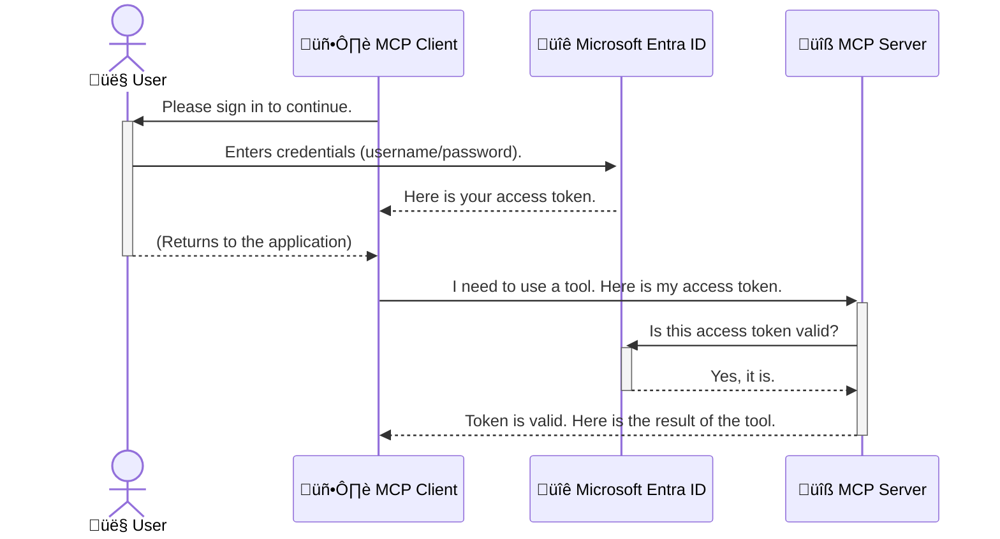

<!--
CO_OP_TRANSLATOR_METADATA:
{
  "original_hash": "0abf26a6c4dbe905d5d49ccdc0ccfe92",
  "translation_date": "2025-06-26T16:33:14+00:00",
  "source_file": "05-AdvancedTopics/mcp-security-entra/README.md",
  "language_code": "no"
}
-->
# Sikring av AI-arbeidsflyter: Entra ID-autentisering for Model Context Protocol-servere

## Introduksjon
Å sikre din Model Context Protocol (MCP)-server er like viktig som å låse inngangsdøren hjemme. Hvis du lar MCP-serveren stå åpen, utsetter du verktøyene og dataene dine for uautorisert tilgang, noe som kan føre til sikkerhetsbrudd. Microsoft Entra ID tilbyr en robust skybasert løsning for identitets- og tilgangsstyring, som hjelper deg med å sikre at bare autoriserte brukere og applikasjoner kan kommunisere med MCP-serveren din. I denne delen vil du lære hvordan du beskytter AI-arbeidsflytene dine ved hjelp av Entra ID-autentisering.

## Læringsmål
Etter å ha fullført denne delen vil du kunne:

- Forstå viktigheten av å sikre MCP-servere.
- Forklare grunnleggende om Microsoft Entra ID og OAuth 2.0-autentisering.
- Skille mellom offentlige og konfidensielle klienter.
- Implementere Entra ID-autentisering både i lokale (offentlige klienter) og eksterne (konfidensielle klienter) MCP-server-scenarier.
- Anvende sikkerhetsbeste praksis ved utvikling av AI-arbeidsflyter.

## Sikkerhet og MCP

Akkurat som du ikke ville latt inngangsdøren stå ulåst, bør du ikke la MCP-serveren være åpen for alle. Å sikre AI-arbeidsflytene dine er avgjørende for å bygge robuste, pålitelige og sikre applikasjoner. Dette kapitlet vil introdusere deg for hvordan du bruker Microsoft Entra ID for å beskytte MCP-serverne dine, slik at bare autoriserte brukere og applikasjoner kan få tilgang til verktøyene og dataene dine.

## Hvorfor sikkerhet er viktig for MCP-servere

Tenk deg at MCP-serveren din har et verktøy som kan sende e-post eller få tilgang til en kundedatabase. En usikret server betyr at hvem som helst potensielt kan bruke dette verktøyet, noe som kan føre til uautorisert datatilgang, spam eller andre ondsinnede handlinger.

Ved å implementere autentisering sikrer du at hver forespørsel til serveren din blir verifisert, og at identiteten til brukeren eller applikasjonen som sender forespørselen blir bekreftet. Dette er det første og viktigste steget for å sikre AI-arbeidsflytene dine.

## Introduksjon til Microsoft Entra ID

[**Microsoft Entra ID**](https://adoption.microsoft.com/microsoft-security/entra/) er en skybasert tjeneste for identitets- og tilgangsstyring. Tenk på det som en universell sikkerhetsvakt for applikasjonene dine. Den håndterer den komplekse prosessen med å verifisere brukeridentiteter (autentisering) og avgjøre hva de har lov til å gjøre (autorisasjon).

Ved å bruke Entra ID kan du:

- Aktivere sikker pålogging for brukere.
- Beskytte API-er og tjenester.
- Administrere tilgangspolicyer fra ett sentralt sted.

For MCP-servere tilbyr Entra ID en robust og bredt anerkjent løsning for å kontrollere hvem som kan få tilgang til serverens funksjoner.

---

## Forstå magien: Hvordan Entra ID-autentisering fungerer

Entra ID bruker åpne standarder som **OAuth 2.0** for å håndtere autentisering. Selv om detaljene kan være komplekse, er hovedideen enkel og kan forklares med en analogi.

### En enkel introduksjon til OAuth 2.0: Nøkkelen til parkeringshjelpen

Tenk på OAuth 2.0 som en parkeringshjelp for bilen din. Når du ankommer en restaurant, gir du ikke parkeringshjelpen hovednøkkelen din. I stedet gir du en **valet-nøkkel** som har begrensede rettigheter – den kan starte bilen og låse dørene, men den kan ikke åpne bagasjerommet eller hanskerommet.

I denne analogien:

- **Du** er **Brukeren**.
- **Bilen din** er **MCP-serveren** med sine verdifulle verktøy og data.
- **Parkeringshjelpen** er **Microsoft Entra ID**.
- **Parkeringsassistenten** er **MCP-klienten** (applikasjonen som prøver å få tilgang til serveren).
- **Valet-nøkkelen** er **Access Token**.

Access token er en sikker tekststreng som MCP-klienten mottar fra Entra ID etter at du har logget inn. Klienten sender deretter denne tokenen til MCP-serveren med hver forespørsel. Serveren kan verifisere tokenen for å sikre at forespørselen er legitim og at klienten har nødvendige rettigheter, uten å måtte håndtere dine faktiske påloggingsopplysninger (som passord).

### Autentiseringsflyten

Slik fungerer prosessen i praksis:



### Introduksjon til Microsoft Authentication Library (MSAL)

Før vi går inn i koden, er det viktig å introdusere en sentral komponent du vil se i eksemplene: **Microsoft Authentication Library (MSAL)**.

MSAL er et bibliotek utviklet av Microsoft som gjør det mye enklere for utviklere å håndtere autentisering. I stedet for at du må skrive all den komplekse koden for å håndtere sikkerhetstokener, innlogging og sesjonsfornyelse, tar MSAL seg av det tunge arbeidet.

Å bruke et bibliotek som MSAL anbefales sterkt fordi:

- **Det er sikkert:** Det implementerer industristandard protokoller og sikkerhetspraksis, noe som reduserer risikoen for sårbarheter i koden din.
- **Det forenkler utviklingen:** Det skjuler kompleksiteten i OAuth 2.0 og OpenID Connect, slik at du kan legge til robust autentisering med bare noen få kodelinjer.
- **Det vedlikeholdes:** Microsoft oppdaterer og vedlikeholder MSAL aktivt for å håndtere nye sikkerhetstrusler og plattformendringer.

MSAL støtter mange språk og applikasjonsrammeverk, inkludert .NET, JavaScript/TypeScript, Python, Java, Go, og mobile plattformer som iOS og Android. Det betyr at du kan bruke samme autentiseringsmønster på tvers av hele teknologistakken din.

For mer informasjon om MSAL kan du se den offisielle [MSAL-oversiktsdokumentasjonen](https://learn.microsoft.com/entra/identity-platform/msal-overview).

---

## Sikre MCP-serveren din med Entra ID: En steg-for-steg-guide

Nå skal vi gå gjennom hvordan du sikrer en lokal MCP-server (en som kommuniserer over `stdio`) using Entra ID. This example uses a **public client**, which is suitable for applications running on a user's machine, like a desktop app or a local development server.

### Scenario 1: Securing a Local MCP Server (with a Public Client)

In this scenario, we'll look at an MCP server that runs locally, communicates over `stdio`, and uses Entra ID to authenticate the user before allowing access to its tools. The server will have a single tool that fetches the user's profile information from the Microsoft Graph API.

#### 1. Setting Up the Application in Entra ID

Before writing any code, you need to register your application in Microsoft Entra ID. This tells Entra ID about your application and grants it permission to use the authentication service.

1. Navigate to the **[Microsoft Entra portal](https://entra.microsoft.com/)**.
2. Go to **App registrations** and click **New registration**.
3. Give your application a name (e.g., "My Local MCP Server").
4. For **Supported account types**, select **Accounts in this organizational directory only**.
5. You can leave the **Redirect URI** blank for this example.
6. Click **Register**.

Once registered, take note of the **Application (client) ID** and **Directory (tenant) ID**. You'll need these in your code.

#### 2. The Code: A Breakdown

Let's look at the key parts of the code that handle authentication. The full code for this example is available in the [Entra ID - Local - WAM](https://github.com/Azure-Samples/mcp-auth-servers/tree/main/src/entra-id-local-wam) folder of the [mcp-auth-servers GitHub repository](https://github.com/Azure-Samples/mcp-auth-servers).

**`AuthenticationService.cs`**

This class is responsible for handling the interaction with Entra ID.

- **`CreateAsync`**: This method initializes the `PublicClientApplication` from the MSAL (Microsoft Authentication Library). It's configured with your application's `clientId` and `tenantId`.
- **`WithBroker`**: This enables the use of a broker (like the Windows Web Account Manager), which provides a more secure and seamless single sign-on experience.
- **`AcquireTokenAsync`**: Dette er kjernemetoden. Den prøver først å hente token stille (uten at brukeren må logge inn på nytt hvis de allerede har en gyldig økt). Hvis en stille token ikke kan skaffes, vil brukeren bli bedt om å logge inn interaktivt.

```csharp
// Simplified for clarity
public static async Task<AuthenticationService> CreateAsync(ILogger<AuthenticationService> logger)
{
    var msalClient = PublicClientApplicationBuilder
        .Create(_clientId) // Your Application (client) ID
        .WithAuthority(AadAuthorityAudience.AzureAdMyOrg)
        .WithTenantId(_tenantId) // Your Directory (tenant) ID
        .WithBroker(new BrokerOptions(BrokerOptions.OperatingSystems.Windows))
        .Build();

    // ... cache registration ...

    return new AuthenticationService(logger, msalClient);
}

public async Task<string> AcquireTokenAsync()
{
    try
    {
        // Try silent authentication first
        var accounts = await _msalClient.GetAccountsAsync();
        var account = accounts.FirstOrDefault();

        AuthenticationResult? result = null;

        if (account != null)
        {
            result = await _msalClient.AcquireTokenSilent(_scopes, account).ExecuteAsync();
        }
        else
        {
            // If no account, or silent fails, go interactive
            result = await _msalClient.AcquireTokenInteractive(_scopes).ExecuteAsync();
        }

        return result.AccessToken;
    }
    catch (Exception ex)
    {
        _logger.LogError(ex, "An error occurred while acquiring the token.");
        throw; // Optionally rethrow the exception for higher-level handling
    }
}
```

**`Program.cs`**

This is where the MCP server is set up and the authentication service is integrated.

- **`AddSingleton<AuthenticationService>`**: This registers the `AuthenticationService` with the dependency injection container, so it can be used by other parts of the application (like our tool).
- **`GetUserDetailsFromGraph` tool**: This tool requires an instance of `AuthenticationService`. Before it does anything, it calls `authService.AcquireTokenAsync()` for å hente en gyldig access token. Hvis autentiseringen er vellykket, bruker den tokenen til å kalle Microsoft Graph API og hente brukerens detaljer.

```csharp
// Simplified for clarity
[McpServerTool(Name = "GetUserDetailsFromGraph")]
public static async Task<string> GetUserDetailsFromGraph(
    AuthenticationService authService)
{
    try
    {
        // This will trigger the authentication flow
        var accessToken = await authService.AcquireTokenAsync();

        // Use the token to create a GraphServiceClient
        var graphClient = new GraphServiceClient(
            new BaseBearerTokenAuthenticationProvider(new TokenProvider(authService)));

        var user = await graphClient.Me.GetAsync();

        return System.Text.Json.JsonSerializer.Serialize(user);
    }
    catch (Exception ex)
    {
        return $"Error: {ex.Message}";
    }
}
```

#### 3. Hvordan alt fungerer sammen

1. Når MCP-klienten prøver å bruke `GetUserDetailsFromGraph` tool, the tool first calls `AcquireTokenAsync`.
2. `AcquireTokenAsync` triggers the MSAL library to check for a valid token.
3. If no token is found, MSAL, through the broker, will prompt the user to sign in with their Entra ID account.
4. Once the user signs in, Entra ID issues an access token.
5. The tool receives the token and uses it to make a secure call to the Microsoft Graph API.
6. The user's details are returned to the MCP client.

This process ensures that only authenticated users can use the tool, effectively securing your local MCP server.

### Scenario 2: Securing a Remote MCP Server (with a Confidential Client)

When your MCP server is running on a remote machine (like a cloud server) and communicates over a protocol like HTTP Streaming, the security requirements are different. In this case, you should use a **confidential client** and the **Authorization Code Flow**. This is a more secure method because the application's secrets are never exposed to the browser.

This example uses a TypeScript-based MCP server that uses Express.js to handle HTTP requests.

#### 1. Setting Up the Application in Entra ID

The setup in Entra ID is similar to the public client, but with one key difference: you need to create a **client secret**.

1. Navigate to the **[Microsoft Entra portal](https://entra.microsoft.com/)**.
2. In your app registration, go to the **Certificates & secrets** tab.
3. Click **New client secret**, give it a description, and click **Add**.
4. **Important:** Copy the secret value immediately. You will not be able to see it again.
5. You also need to configure a **Redirect URI**. Go to the **Authentication** tab, click **Add a platform**, select **Web**, and enter the redirect URI for your application (e.g., `http://localhost:3001/auth/callback`).

> **⚠️ Important Security Note:** For production applications, Microsoft strongly recommends using **secretless authentication** methods such as **Managed Identity** or **Workload Identity Federation** instead of client secrets. Client secrets pose security risks as they can be exposed or compromised. Managed identities provide a more secure approach by eliminating the need to store credentials in your code or configuration.
>
> For more information about managed identities and how to implement them, see the [Managed identities for Azure resources overview](https://learn.microsoft.com/entra/identity/managed-identities-azure-resources/overview).

#### 2. The Code: A Breakdown

This example uses a session-based approach. When the user authenticates, the server stores the access token and refresh token in a session and gives the user a session token. This session token is then used for subsequent requests. The full code for this example is available in the [Entra ID - Confidential client](https://github.com/Azure-Samples/mcp-auth-servers/tree/main/src/entra-id-cca-session) folder of the [mcp-auth-servers GitHub repository](https://github.com/Azure-Samples/mcp-auth-servers).

**`Server.ts`**

This file sets up the Express server and the MCP transport layer.

- **`requireBearerAuth`**: This is middleware that protects the `/sse` and `/message` endpoints. It checks for a valid bearer token in the `Authorization` header of the request.
- **`EntraIdServerAuthProvider`**: This is a custom class that implements the `McpServerAuthorizationProvider` interface. It's responsible for handling the OAuth 2.0 flow.
- **`/auth/callback`**: Denne endepunktet håndterer omdirigeringen fra Entra ID etter at brukeren har autentisert seg. Den bytter autorisasjonskoden mot en access token og en refresh token.

```typescript
// Simplified for clarity
const app = express();
const { server } = createServer();
const provider = new EntraIdServerAuthProvider();

// Protect the SSE endpoint
app.get("/sse", requireBearerAuth({
  provider,
  requiredScopes: ["User.Read"]
}), async (req, res) => {
  // ... connect to the transport ...
});

// Protect the message endpoint
app.post("/message", requireBearerAuth({
  provider,
  requiredScopes: ["User.Read"]
}), async (req, res) => {
  // ... handle the message ...
});

// Handle the OAuth 2.0 callback
app.get("/auth/callback", (req, res) => {
  provider.handleCallback(req.query.code, req.query.state)
    .then(result => {
      // ... handle success or failure ...
    });
});
```

**`Tools.ts`**

This file defines the tools that the MCP server provides. The `getUserDetails`-verktøyet ligner på det i forrige eksempel, men det henter access token fra sesjonen.

```typescript
// Simplified for clarity
server.setRequestHandler(CallToolRequestSchema, async (request) => {
  const { name } = request.params;
  const context = request.params?.context as { token?: string } | undefined;
  const sessionToken = context?.token;

  if (name === ToolName.GET_USER_DETAILS) {
    if (!sessionToken) {
      throw new AuthenticationError("Authentication token is missing or invalid. Ensure the token is provided in the request context.");
    }

    // Get the Entra ID token from the session store
    const tokenData = tokenStore.getToken(sessionToken);
    const entraIdToken = tokenData.accessToken;

    const graphClient = Client.init({
      authProvider: (done) => {
        done(null, entraIdToken);
      }
    });

    const user = await graphClient.api('/me').get();

    // ... return user details ...
  }
});
```

**`auth/EntraIdServerAuthProvider.ts`**

This class handles the logic for:

- Redirecting the user to the Entra ID sign-in page.
- Exchanging the authorization code for an access token.
- Storing the tokens in the `tokenStore`.
- Refreshing the access token when it expires.

#### 3. How It All Works Together

1. When a user first tries to connect to the MCP server, the `requireBearerAuth` middleware will see that they don't have a valid session and will redirect them to the Entra ID sign-in page.
2. The user signs in with their Entra ID account.
3. Entra ID redirects the user back to the `/auth/callback` endpoint with an authorization code.
4. The server exchanges the code for an access token and a refresh token, stores them, and creates a session token which is sent to the client.
5. The client can now use this session token in the `Authorization` header for all future requests to the MCP server.
6. When the `getUserDetails`-verktøyet kalles, og bruker sesjonstoken for å finne Entra ID access token, som deretter brukes til å kalle Microsoft Graph API.

Denne flyten er mer kompleks enn den for offentlige klienter, men er nødvendig for internettvendte endepunkter. Siden eksterne MCP-servere er tilgjengelige over det offentlige internett, krever de sterkere sikkerhetstiltak for å beskytte mot uautorisert tilgang og potensielle angrep.

## Sikkerhetsbeste praksis

- **Bruk alltid HTTPS**: Krypter kommunikasjonen mellom klient og server for å beskytte tokenene mot avlytting.
- **Implementer rollebasert tilgangskontroll (RBAC)**: Sjekk ikke bare *om* en bruker er autentisert, men *hva* brukeren har rettigheter til å gjøre. Du kan definere roller i Entra ID og sjekke disse i MCP-serveren.
- **Overvåk og revider**: Loggfør alle autentiseringshendelser slik at du kan oppdage og reagere på mistenkelig aktivitet.
- **Håndter rate limiting og throttling**: Microsoft Graph og andre API-er har begrensninger for å hindre misbruk. Implementer eksponentiell tilbakekobling og retry-logikk i MCP-serveren for å håndtere HTTP 429 (Too Many Requests) på en smidig måte. Vurder å cache ofte brukte data for å redusere antall API-kall.
- **Sikker lagring av token**: Oppbevar access tokens og refresh tokens sikkert. For lokale applikasjoner, bruk systemets sikre lagringsmekanismer. For serverapplikasjoner, vurder kryptert lagring eller sikre nøkkelhåndteringstjenester som Azure Key Vault.
- **Håndtering av token-utløp**: Access tokens har begrenset levetid. Implementer automatisk fornyelse av token med refresh tokens for å sikre en sømløs brukeropplevelse uten behov for ny pålogging.
- **Vurder å bruke Azure API Management**: Selv om sikkerhet direkte i MCP-serveren gir deg finmasket kontroll, kan API-gatewayer som Azure API Management håndtere mange sikkerhetsaspekter automatisk, inkludert autentisering, autorisasjon, rate limiting og overvåkning. De gir et sentralisert sikkerhetslag mellom klientene dine og MCP-serverne. For mer informasjon om bruk av API-gatewayer med MCP, se vår [Azure API Management Your Auth Gateway For MCP Servers](https://techcommunity.microsoft.com/blog/integrationsonazureblog/azure-api-management-your-auth-gateway-for-mcp-servers/4402690).

## Viktige punkter

- Å sikre MCP-serveren din er avgjørende for å beskytte data og verktøy.
- Microsoft Entra ID tilbyr en robust og skalerbar løsning for autentisering og autorisasjon.
- Bruk en **offentlig klient** for lokale applikasjoner og en **konfidensiell klient** for eksterne servere.
- **Authorization Code Flow** er det sikreste alternativet for webapplikasjoner.

## Øvelse

1. Tenk på en MCP-server du kunne tenke deg å bygge. Ville det vært en lokal eller en ekstern server?
2. Basert på svaret ditt, ville du brukt en offentlig eller konfidensiell klient?
3. Hvilke tillatelser ville MCP-serveren din trenge for å utføre handlinger mot Microsoft Graph?

## Praktiske øvelser

### Øvelse 1: Registrer en applikasjon i Entra ID
Gå til Microsoft Entra-portalen.  
Registrer en ny applikasjon for MCP-serveren din.  
Noter Application (client) ID og Directory (tenant) ID.

### Øvelse 2: Sikre en lokal MCP-server (offentlig klient)
- Følg kodeeksempelet for å integrere MSAL (Microsoft Authentication Library) for brukerautentisering.
- Test autentiseringsflyten ved å kalle MCP-verktøyet som henter brukerdata fra Microsoft Graph.

### Øvelse 3: Sikre en ekstern MCP-server (konfidensiell klient)
- Registrer en konfidensiell klient i Entra ID og opprett en klienthemmelighet.
- Konfigurer Express.js MCP-serveren din til å bruke Authorization Code Flow.
- Test de beskyttede endepunktene og bekreft token-basert tilgang.

### Øvelse 4: Anvend sikkerhetsbeste praksis
- Aktiver HTTPS for lokal eller ekstern server.
- Implementer rollebasert tilgangskontroll (RBAC) i serverlogikken.
- Legg til håndtering av token-utløp og sikker token-lagring.

## Ressurser

1. **MSAL Oversiktsdokumentasjon**  
   Lær hvordan Microsoft Authentication Library (MSAL) muliggjør sikker token-innhenting på tvers av plattformer:  
   [MSAL Oversikt på Microsoft Learn](https://learn.microsoft.com/en-gb/entra/msal/overview)

2. **Azure-Samples/mcp-auth-servers GitHub Repository**  
   Referanseimplementasjoner av MCP-servere som demonstrerer autentiseringsflyter:  
   [Azure-Samples/mcp-auth-servers på GitHub](https://github.com/Azure-Samples/mcp-auth-servers)

3. **Managed Identities for Azure Resources Oversikt**  
   Forstå hvordan du kan eliminere hemmeligheter ved å bruke system- eller bruker-tilordnede managed identities:  
   [Managed Identities Oversikt på Microsoft Learn](https://learn.microsoft.com/en-us/entra/identity/managed-identities-azure-resources/)

4. **Azure API Management: Din Auth Gateway for MCP-servere**  
   En grundig gjennomgang av bruk av APIM som en sikker OAuth2-gateway for MCP-servere:  
   [Azure API Management Your Auth Gateway For MCP Servers](https://techcommunity.microsoft.com/blog/integrationsonazureblog/azure-api-management-your-auth-gateway-for-mcp-servers/4402690)

5. **Microsoft Graph Tillatelsesreferanse**  
   Omfattende liste over delegerte og applikasjonstillatelser for Microsoft Graph:  
   [Microsoft Graph Permissions Reference](https://learn.microsoft.com/zh-tw/graph/permissions-reference)

## Læringsutbytte
Etter å ha fullført denne delen vil du kunne:

- Forklare hvorfor autentisering er kritisk for MCP-servere og AI-arbeidsflyter.
- Sette opp og konfigurere Entra ID-autentisering for både lokale og eksterne MCP-server-scenarier.
- Velge riktig klienttype (offentlig eller konfidensiell) basert på serverens distribusjon.
- Implementere sikre utviklingspraksiser, inkludert token-lagring og rollebasert autorisasjon.
- Trygt beskytte MCP-serveren og verktøyene mot uautorisert tilgang.

## Hva skjer videre

- [6. Community Contributions](../../06-CommunityContributions/README.md)

**Ansvarsfraskrivelse**:  
Dette dokumentet er oversatt ved hjelp av AI-oversettelsestjenesten [Co-op Translator](https://github.com/Azure/co-op-translator). Selv om vi streber etter nøyaktighet, vennligst vær oppmerksom på at automatiske oversettelser kan inneholde feil eller unøyaktigheter. Det opprinnelige dokumentet på originalspråket bør anses som den autoritative kilden. For kritisk informasjon anbefales profesjonell menneskelig oversettelse. Vi er ikke ansvarlige for eventuelle misforståelser eller feiltolkninger som oppstår ved bruk av denne oversettelsen.