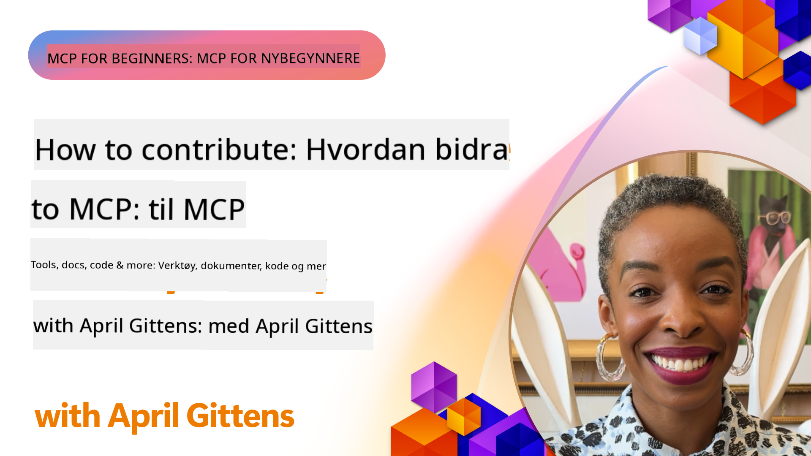

<!--
CO_OP_TRANSLATOR_METADATA:
{
  "original_hash": "fcf1e12b62102bf7d16b78deb2b163b7",
  "translation_date": "2025-08-18T15:53:15+00:00",
  "source_file": "06-CommunityContributions/README.md",
  "language_code": "no"
}
-->
# Fellesskap og Bidrag

[](https://youtu.be/v1pvCYAWpRE)

_(Klikk på bildet over for å se videoen til denne leksjonen)_

## Oversikt

Denne leksjonen fokuserer på hvordan du kan engasjere deg i MCP-fellesskapet, bidra til MCP-økosystemet og følge beste praksis for samarbeidende utvikling. Å forstå hvordan man deltar i åpne MCP-prosjekter er essensielt for de som ønsker å forme fremtiden til denne teknologien.

## Læringsmål

Ved slutten av denne leksjonen vil du kunne:

- Forstå strukturen til MCP-fellesskapet og økosystemet
- Delta effektivt i MCP-fora og diskusjoner
- Bidra til MCPs åpne kildekode-repositorier
- Lage og dele tilpassede MCP-verktøy og servere
- Følge beste praksis for MCP-utvikling og samarbeid
- Oppdage fellesskapsressurser og rammeverk for MCP-utvikling

## MCP-fellesskapets økosystem

MCP-økosystemet består av ulike komponenter og deltakere som samarbeider for å fremme protokollen.

### Viktige fellesskapskomponenter

1. **Kjerneprotokollens vedlikeholdere**: Den offisielle [Model Context Protocol GitHub-organisasjonen](https://github.com/modelcontextprotocol) vedlikeholder MCP-spesifikasjonene og referanseimplementasjonene.
2. **Verktøyutviklere**: Personer og team som lager MCP-verktøy og servere.
3. **Integrasjonsleverandører**: Selskaper som integrerer MCP i sine produkter og tjenester.
4. **Sluttbrukere**: Utviklere og organisasjoner som bruker MCP i sine applikasjoner.
5. **Bidragsytere**: Fellesskapsmedlemmer som bidrar med kode, dokumentasjon eller andre ressurser.

### Fellesskapsressurser

#### Offisielle kanaler

- [MCP GitHub-organisasjon](https://github.com/modelcontextprotocol)
- [MCP-dokumentasjon](https://modelcontextprotocol.io/)
- [MCP-spesifikasjon](https://modelcontextprotocol.io/docs/specification)
- [GitHub-diskusjoner](https://github.com/orgs/modelcontextprotocol/discussions)
- [MCP Eksempler & Servere-repositorium](https://github.com/modelcontextprotocol/servers)

#### Fellesskapsdrevne ressurser

- [MCP-klienter](https://modelcontextprotocol.io/clients) - Liste over klienter som støtter MCP-integrasjoner
- [Fellesskaps-MCP-servere](https://github.com/modelcontextprotocol/servers?tab=readme-ov-file#-community-servers) - Voksende liste over MCP-servere utviklet av fellesskapet
- [Awesome MCP Servers](https://github.com/wong2/awesome-mcp-servers) - Kuratert liste over MCP-servere
- [PulseMCP](https://www.pulsemcp.com/) - Fellesskapshub og nyhetsbrev for å oppdage MCP-ressurser
- [Discord-server](https://discord.gg/jHEGxQu2a5) - Koble deg til MCP-utviklere
- Språkspesifikke SDK-implementasjoner
- Blogginnlegg og veiledninger

## Bidra til MCP

### Typer bidrag

MCP-økosystemet ønsker ulike typer bidrag velkommen:

1. **Kodebidrag**:
   - Forbedringer av kjerneprotokollen
   - Feilrettinger
   - Implementering av verktøy og servere
   - Klient-/serverbiblioteker på ulike språk

2. **Dokumentasjon**:
   - Forbedring av eksisterende dokumentasjon
   - Lage veiledninger og guider
   - Oversette dokumentasjon
   - Lage eksempler og prøveapplikasjoner

3. **Fellesskapsstøtte**:
   - Svare på spørsmål i fora og diskusjoner
   - Teste og rapportere problemer
   - Organisere fellesskapsarrangementer
   - Veilede nye bidragsytere

### Bidragsprosess: Kjerneprotokollen

For å bidra til kjerneprotokollen eller offisielle implementasjoner, følg disse prinsippene fra de [offisielle retningslinjene for bidrag](https://github.com/modelcontextprotocol/modelcontextprotocol/blob/main/CONTRIBUTING.md):

1. **Enkelhet og minimalisme**: MCP-spesifikasjonen opprettholder en høy terskel for å legge til nye konsepter. Det er enklere å legge til noe i en spesifikasjon enn å fjerne det.
2. **Konkret tilnærming**: Endringer i spesifikasjonen bør baseres på spesifikke implementeringsutfordringer, ikke spekulative ideer.
3. **Faser i et forslag**:
   - Definer: Utforsk problemområdet, valider at andre MCP-brukere står overfor lignende utfordringer.
   - Prototype: Bygg et eksempel på en løsning og demonstrer dens praktiske anvendelse.
   - Skriv: Basert på prototypen, skriv et spesifikasjonsforslag.

### Oppsett av utviklingsmiljø

```bash
# Fork the repository
git clone https://github.com/YOUR-USERNAME/modelcontextprotocol.git
cd modelcontextprotocol

# Install dependencies
npm install

# For schema changes, validate and generate schema.json:
npm run check:schema:ts
npm run generate:schema

# For documentation changes
npm run check:docs
npm run format

# Preview documentation locally (optional):
npm run serve:docs
```

### Eksempel: Bidra med en feilretting

```javascript
// Original code with bug in the typescript-sdk
export function validateResource(resource: unknown): resource is MCPResource {
  if (!resource || typeof resource !== 'object') {
    return false;
  }
  
  // Bug: Missing property validation
  // Current implementation:
  const hasName = 'name' in resource;
  const hasSchema = 'schema' in resource;
  
  return hasName && hasSchema;
}

// Fixed implementation in a contribution
export function validateResource(resource: unknown): resource is MCPResource {
  if (!resource || typeof resource !== 'object') {
    return false;
  }
  
  // Improved validation
  const hasName = 'name' in resource && typeof (resource as MCPResource).name === 'string';
  const hasSchema = 'schema' in resource && typeof (resource as MCPResource).schema === 'object';
  const hasDescription = !('description' in resource) || typeof (resource as MCPResource).description === 'string';
  
  return hasName && hasSchema && hasDescription;
}
```

### Eksempel: Bidra med et nytt verktøy til standardbiblioteket

```python
# Example contribution: A CSV data processing tool for the MCP standard library

from mcp_tools import Tool, ToolRequest, ToolResponse, ToolExecutionException
import pandas as pd
import io
import json
from typing import Dict, Any, List, Optional

class CsvProcessingTool(Tool):
    """
    Tool for processing and analyzing CSV data.
    
    This tool allows models to extract information from CSV files,
    run basic analysis, and convert data between formats.
    """
    
    def get_name(self):
        return "csvProcessor"
        
    def get_description(self):
        return "Processes and analyzes CSV data"
    
    def get_schema(self):
        return {
            "type": "object",
            "properties": {
                "csvData": {
                    "type": "string", 
                    "description": "CSV data as a string"
                },
                "csvUrl": {
                    "type": "string",
                    "description": "URL to a CSV file (alternative to csvData)"
                },
                "operation": {
                    "type": "string",
                    "enum": ["summary", "filter", "transform", "convert"],
                    "description": "Operation to perform on the CSV data"
                },
                "filterColumn": {
                    "type": "string",
                    "description": "Column to filter by (for filter operation)"
                },
                "filterValue": {
                    "type": "string",
                    "description": "Value to filter for (for filter operation)"
                },
                "outputFormat": {
                    "type": "string",
                    "enum": ["json", "csv", "markdown"],
                    "default": "json",
                    "description": "Output format for the processed data"
                }
            },
            "oneOf": [
                {"required": ["csvData", "operation"]},
                {"required": ["csvUrl", "operation"]}
            ]
        }
    
    async def execute_async(self, request: ToolRequest) -> ToolResponse:
        try:
            # Extract parameters
            operation = request.parameters.get("operation")
            output_format = request.parameters.get("outputFormat", "json")
            
            # Get CSV data from either direct data or URL
            df = await self._get_dataframe(request)
            
            # Process based on requested operation
            result = {}
            
            if operation == "summary":
                result = self._generate_summary(df)
            elif operation == "filter":
                column = request.parameters.get("filterColumn")
                value = request.parameters.get("filterValue")
                if not column:
                    raise ToolExecutionException("filterColumn is required for filter operation")
                result = self._filter_data(df, column, value)
            elif operation == "transform":
                result = self._transform_data(df, request.parameters)
            elif operation == "convert":
                result = self._convert_format(df, output_format)
            else:
                raise ToolExecutionException(f"Unknown operation: {operation}")
            
            return ToolResponse(result=result)
        
        except Exception as e:
            raise ToolExecutionException(f"CSV processing failed: {str(e)}")
    
    async def _get_dataframe(self, request: ToolRequest) -> pd.DataFrame:
        """Gets a pandas DataFrame from either CSV data or URL"""
        if "csvData" in request.parameters:
            csv_data = request.parameters.get("csvData")
            return pd.read_csv(io.StringIO(csv_data))
        elif "csvUrl" in request.parameters:
            csv_url = request.parameters.get("csvUrl")
            return pd.read_csv(csv_url)
        else:
            raise ToolExecutionException("Either csvData or csvUrl must be provided")
    
    def _generate_summary(self, df: pd.DataFrame) -> Dict[str, Any]:
        """Generates a summary of the CSV data"""
        return {
            "columns": df.columns.tolist(),
            "rowCount": len(df),
            "columnCount": len(df.columns),
            "numericColumns": df.select_dtypes(include=['number']).columns.tolist(),
            "categoricalColumns": df.select_dtypes(include=['object']).columns.tolist(),
            "sampleRows": json.loads(df.head(5).to_json(orient="records")),
            "statistics": json.loads(df.describe().to_json())
        }
    
    def _filter_data(self, df: pd.DataFrame, column: str, value: str) -> Dict[str, Any]:
        """Filters the DataFrame by a column value"""
        if column not in df.columns:
            raise ToolExecutionException(f"Column '{column}' not found")
            
        filtered_df = df[df[column].astype(str).str.contains(value)]
        
        return {
            "originalRowCount": len(df),
            "filteredRowCount": len(filtered_df),
            "data": json.loads(filtered_df.to_json(orient="records"))
        }
    
    def _transform_data(self, df: pd.DataFrame, params: Dict[str, Any]) -> Dict[str, Any]:
        """Transforms the data based on parameters"""
        # Implementation would include various transformations
        return {
            "status": "success",
            "message": "Transformation applied"
        }
    
    def _convert_format(self, df: pd.DataFrame, format: str) -> Dict[str, Any]:
        """Converts the DataFrame to different formats"""
        if format == "json":
            return {
                "data": json.loads(df.to_json(orient="records")),
                "format": "json"
            }
        elif format == "csv":
            return {
                "data": df.to_csv(index=False),
                "format": "csv"
            }
        elif format == "markdown":
            return {
                "data": df.to_markdown(),
                "format": "markdown"
            }
        else:
            raise ToolExecutionException(f"Unsupported output format: {format}")
```

### Retningslinjer for bidrag

For å lykkes med å bidra til MCP-prosjekter:

1. **Start i det små**: Begynn med dokumentasjon, feilrettinger eller små forbedringer.
2. **Følg stilguiden**: Følg prosjektets kodestil og konvensjoner.
3. **Skriv tester**: Inkluder enhetstester for kodebidragene dine.
4. **Dokumenter arbeidet ditt**: Legg til tydelig dokumentasjon for nye funksjoner eller endringer.
5. **Send målrettede PR-er**: Hold pull requests fokusert på ett enkelt problem eller funksjon.
6. **Engasjer deg i tilbakemeldinger**: Vær responsiv på tilbakemeldinger om bidragene dine.

### Eksempel på bidragsarbeidsflyt

```bash
# Clone the repository
git clone https://github.com/modelcontextprotocol/typescript-sdk.git
cd typescript-sdk

# Create a new branch for your contribution
git checkout -b feature/my-contribution

# Make your changes
# ...

# Run tests to ensure your changes don't break existing functionality
npm test

# Commit your changes with a descriptive message
git commit -am "Fix validation in resource handler"

# Push your branch to your fork
git push origin feature/my-contribution

# Create a pull request from your branch to the main repository
# Then engage with feedback and iterate on your PR as needed
```

## Lage og dele MCP-servere

En av de mest verdifulle måtene å bidra til MCP-økosystemet på er å lage og dele tilpassede MCP-servere. Fellesskapet har allerede utviklet hundrevis av servere for ulike tjenester og bruksområder.

### MCP-serverutviklingsrammeverk

Flere rammeverk er tilgjengelige for å forenkle utviklingen av MCP-servere:

1. **Offisielle SDK-er**:
   - [TypeScript SDK](https://github.com/modelcontextprotocol/typescript-sdk)
   - [Python SDK](https://github.com/modelcontextprotocol/python-sdk)
   - [C# SDK](https://github.com/modelcontextprotocol/csharp-sdk)
   - [Go SDK](https://github.com/modelcontextprotocol/go-sdk)
   - [Java SDK](https://github.com/modelcontextprotocol/java-sdk)
   - [Kotlin SDK](https://github.com/modelcontextprotocol/kotlin-sdk)

2. **Fellesskapsrammeverk**:
   - [MCP-Framework](https://mcp-framework.com/) - Bygg MCP-servere med eleganse og hastighet i TypeScript.
   - [MCP Declarative Java SDK](https://github.com/codeboyzhou/mcp-declarative-java-sdk) - Annotasjonsdrevet MCP-servere med Java.
   - [Quarkus MCP Server SDK](https://github.com/quarkiverse/quarkus-mcp-server) - Java-rammeverk for MCP-servere.
   - [Next.js MCP Server Template](https://github.com/vercel-labs/mcp-for-next.js) - Startprosjekt for MCP-servere i Next.js.

### Utvikling av delbare verktøy

#### .NET Eksempel: Lage en delbar verktøypakke

```csharp
// Create a new .NET library project
// dotnet new classlib -n McpFinanceTools

using Microsoft.Mcp.Tools;
using System.Threading.Tasks;
using System.Net.Http;
using System.Text.Json;

namespace McpFinanceTools
{
    // Stock quote tool
    public class StockQuoteTool : IMcpTool
    {
        private readonly HttpClient _httpClient;
        
        public StockQuoteTool(HttpClient httpClient = null)
        {
            _httpClient = httpClient ?? new HttpClient();
        }
        
        public string Name => "stockQuote";
        public string Description => "Gets current stock quotes for specified symbols";
        
        public object GetSchema()
        {
            return new {
                type = "object",
                properties = new {
                    symbol = new { 
                        type = "string",
                        description = "Stock symbol (e.g., MSFT, AAPL)" 
                    },
                    includeHistory = new { 
                        type = "boolean",
                        description = "Whether to include historical data",
                        default = false
                    }
                },
                required = new[] { "symbol" }
            };
        }
        
        public async Task<ToolResponse> ExecuteAsync(ToolRequest request)
        {
            // Extract parameters
            string symbol = request.Parameters.GetProperty("symbol").GetString();
            bool includeHistory = false;
            
            if (request.Parameters.TryGetProperty("includeHistory", out var historyProp))
            {
                includeHistory = historyProp.GetBoolean();
            }
            
            // Call external API (example)
            var quoteResult = await GetStockQuoteAsync(symbol);
            
            // Add historical data if requested
            if (includeHistory)
            {
                var historyData = await GetStockHistoryAsync(symbol);
                quoteResult.Add("history", historyData);
            }
            
            // Return formatted result
            return new ToolResponse {
                Result = JsonSerializer.SerializeToElement(quoteResult)
            };
        }
        
        private async Task<Dictionary<string, object>> GetStockQuoteAsync(string symbol)
        {
            // Implementation would call a real stock API
            // This is a simplified example
            return new Dictionary<string, object>
            {
                ["symbol"] = symbol,
                ["price"] = 123.45,
                ["change"] = 2.5,
                ["percentChange"] = 1.2,
                ["lastUpdated"] = DateTime.UtcNow
            };
        }
        
        private async Task<object> GetStockHistoryAsync(string symbol)
        {
            // Implementation would get historical data
            // Simplified example
            return new[]
            {
                new { date = DateTime.Now.AddDays(-7).Date, price = 120.25 },
                new { date = DateTime.Now.AddDays(-6).Date, price = 122.50 },
                new { date = DateTime.Now.AddDays(-5).Date, price = 121.75 }
                // More historical data...
            };
        }
    }
}

// Create package and publish to NuGet
// dotnet pack -c Release
// dotnet nuget push bin/Release/McpFinanceTools.1.0.0.nupkg -s https://api.nuget.org/v3/index.json -k YOUR_API_KEY
```

#### Java Eksempel: Lage en Maven-pakke for verktøy

```java
// pom.xml configuration for a shareable MCP tool package
<!-- 
<project>
    <groupId>com.example</groupId>
    <artifactId>mcp-weather-tools</artifactId>
    <version>1.0.0</version>
    
    <dependencies>
        <dependency>
            <groupId>com.mcp</groupId>
            <artifactId>mcp-server</artifactId>
            <version>1.0.0</version>
        </dependency>
    </dependencies>
    
    <distributionManagement>
        <repository>
            <id>github</id>
            <name>GitHub Packages</name>
            <url>https://maven.pkg.github.com/username/mcp-weather-tools</url>
        </repository>
    </distributionManagement>
</project>
-->

package com.example.mcp.weather;

import com.mcp.tools.Tool;
import com.mcp.tools.ToolRequest;
import com.mcp.tools.ToolResponse;
import com.mcp.tools.ToolExecutionException;

import java.net.http.HttpClient;
import java.net.http.HttpRequest;
import java.net.http.HttpResponse;
import java.net.URI;
import java.util.HashMap;
import java.util.Map;

public class WeatherForecastTool implements Tool {
    private final HttpClient httpClient;
    private final String apiKey;
    
    public WeatherForecastTool(String apiKey) {
        this.httpClient = HttpClient.newHttpClient();
        this.apiKey = apiKey;
    }
    
    @Override
    public String getName() {
        return "weatherForecast";
    }
    
    @Override
    public String getDescription() {
        return "Gets weather forecast for a specified location";
    }
    
    @Override
    public Object getSchema() {
        Map<String, Object> schema = new HashMap<>();
        // Schema definition...
        return schema;
    }
    
    @Override
    public ToolResponse execute(ToolRequest request) {
        try {
            String location = request.getParameters().get("location").asText();
            int days = request.getParameters().has("days") ? 
                request.getParameters().get("days").asInt() : 3;
            
            // Call weather API
            Map<String, Object> forecast = getForecast(location, days);
            
            // Build response
            return new ToolResponse.Builder()
                .setResult(forecast)
                .build();
        } catch (Exception ex) {
            throw new ToolExecutionException("Weather forecast failed: " + ex.getMessage(), ex);
        }
    }
    
    private Map<String, Object> getForecast(String location, int days) {
        // Implementation would call weather API
        // Simplified example
        Map<String, Object> result = new HashMap<>();
        // Add forecast data...
        return result;
    }
}

// Build and publish using Maven
// mvn clean package
// mvn deploy
```

#### Python Eksempel: Publisere en PyPI-pakke

```python
# Directory structure for a PyPI package:
# mcp_nlp_tools/
# ├── LICENSE
# ├── README.md
# ├── setup.py
# ├── mcp_nlp_tools/
# │   ├── __init__.py
# │   ├── sentiment_tool.py
# │   └── translation_tool.py

# Example setup.py
"""
from setuptools import setup, find_packages

setup(
    name="mcp_nlp_tools",
    version="0.1.0",
    packages=find_packages(),
    install_requires=[
        "mcp_server>=1.0.0",
        "transformers>=4.0.0",
        "torch>=1.8.0"
    ],
    author="Your Name",
    author_email="your.email@example.com",
    description="MCP tools for natural language processing tasks",
    long_description=open("README.md").read(),
    long_description_content_type="text/markdown",
    url="https://github.com/username/mcp_nlp_tools",
    classifiers=[
        "Programming Language :: Python :: 3",
        "License :: OSI Approved :: MIT License",
        "Operating System :: OS Independent",
    ],
    python_requires=">=3.8",
)
"""

# Example NLP tool implementation (sentiment_tool.py)
from mcp_tools import Tool, ToolRequest, ToolResponse, ToolExecutionException
from transformers import pipeline
import torch

class SentimentAnalysisTool(Tool):
    """MCP tool for sentiment analysis of text"""
    
    def __init__(self, model_name="distilbert-base-uncased-finetuned-sst-2-english"):
        # Load the sentiment analysis model
        self.sentiment_analyzer = pipeline("sentiment-analysis", model=model_name)
    
    def get_name(self):
        return "sentimentAnalysis"
        
    def get_description(self):
        return "Analyzes the sentiment of text, classifying it as positive or negative"
    
    def get_schema(self):
        return {
            "type": "object",
            "properties": {
                "text": {
                    "type": "string", 
                    "description": "The text to analyze for sentiment"
                },
                "includeScore": {
                    "type": "boolean",
                    "description": "Whether to include confidence scores",
                    "default": True
                }
            },
            "required": ["text"]
        }
    
    async def execute_async(self, request: ToolRequest) -> ToolResponse:
        try:
            # Extract parameters
            text = request.parameters.get("text")
            include_score = request.parameters.get("includeScore", True)
            
            # Analyze sentiment
            sentiment_result = self.sentiment_analyzer(text)[0]
            
            # Format result
            result = {
                "sentiment": sentiment_result["label"],
                "text": text
            }
            
            if include_score:
                result["score"] = sentiment_result["score"]
            
            # Return result
            return ToolResponse(result=result)
            
        except Exception as e:
            raise ToolExecutionException(f"Sentiment analysis failed: {str(e)}")

# To publish:
# python setup.py sdist bdist_wheel
# python -m twine upload dist/*
```

### Dele beste praksis

Når du deler MCP-verktøy med fellesskapet:

1. **Fullstendig dokumentasjon**:
   - Dokumenter formål, bruk og eksempler.
   - Forklar parametere og returverdier.
   - Dokumenter eventuelle eksterne avhengigheter.

2. **Feilhåndtering**:
   - Implementer robust feilhåndtering.
   - Gi nyttige feilmeldinger.
   - Håndter kanttilfeller på en god måte.

3. **Ytelseshensyn**:
   - Optimaliser for både hastighet og ressursbruk.
   - Implementer caching der det er hensiktsmessig.
   - Tenk på skalerbarhet.

4. **Sikkerhet**:
   - Bruk sikre API-nøkler og autentisering.
   - Valider og rens innganger.
   - Implementer hastighetsbegrensning for eksterne API-kall.

5. **Testing**:
   - Inkluder omfattende testdekning.
   - Test med ulike inngangstyper og kanttilfeller.
   - Dokumenter testprosedyrer.

## Fellesskapssamarbeid og beste praksis

Effektivt samarbeid er nøkkelen til et blomstrende MCP-økosystem.

### Kommunikasjonskanaler

- GitHub Issues og diskusjoner
- Microsoft Tech Community
- Discord- og Slack-kanaler
- Stack Overflow (tag: `model-context-protocol` eller `mcp`)

### Kodegjennomganger

Når du gjennomgår MCP-bidrag:

1. **Klarhet**: Er koden tydelig og godt dokumentert?
2. **Korrekthet**: Fungerer den som forventet?
3. **Konsistens**: Følger den prosjektets konvensjoner?
4. **Fullstendighet**: Er tester og dokumentasjon inkludert?
5. **Sikkerhet**: Er det noen sikkerhetsproblemer?

### Versjonskompatibilitet

Når du utvikler for MCP:

1. **Protokollversjonering**: Følg MCP-protokollversjonen verktøyet ditt støtter.
2. **Klientkompatibilitet**: Tenk på bakoverkompatibilitet.
3. **Serverkompatibilitet**: Følg retningslinjene for serverimplementasjon.
4. **Brytende endringer**: Dokumenter tydelig eventuelle brytende endringer.

## Eksempel på fellesskapsprosjekt: MCP-verktøyregister

En viktig fellesskapsbidrag kan være å utvikle et offentlig register for MCP-verktøy.

```python
# Example schema for a community tool registry API

from fastapi import FastAPI, HTTPException, Depends
from pydantic import BaseModel, Field, HttpUrl
from typing import List, Optional
import datetime
import uuid

# Models for the tool registry
class ToolSchema(BaseModel):
    """JSON Schema for a tool"""
    type: str
    properties: dict
    required: List[str] = []

class ToolRegistration(BaseModel):
    """Information for registering a tool"""
    name: str = Field(..., description="Unique name for the tool")
    description: str = Field(..., description="Description of what the tool does")
    version: str = Field(..., description="Semantic version of the tool")
    schema: ToolSchema = Field(..., description="JSON Schema for tool parameters")
    author: str = Field(..., description="Author of the tool")
    repository: Optional[HttpUrl] = Field(None, description="Repository URL")
    documentation: Optional[HttpUrl] = Field(None, description="Documentation URL")
    package: Optional[HttpUrl] = Field(None, description="Package URL")
    tags: List[str] = Field(default_factory=list, description="Tags for categorization")
    examples: List[dict] = Field(default_factory=list, description="Example usage")

class Tool(ToolRegistration):
    """Tool with registry metadata"""
    id: uuid.UUID = Field(default_factory=uuid.uuid4)
    created_at: datetime.datetime = Field(default_factory=datetime.datetime.now)
    updated_at: datetime.datetime = Field(default_factory=datetime.datetime.now)
    downloads: int = Field(default=0)
    rating: float = Field(default=0.0)
    ratings_count: int = Field(default=0)

# FastAPI application for the registry
app = FastAPI(title="MCP Tool Registry")

# In-memory database for this example
tools_db = {}

@app.post("/tools", response_model=Tool)
async def register_tool(tool: ToolRegistration):
    """Register a new tool in the registry"""
    if tool.name in tools_db:
        raise HTTPException(status_code=400, detail=f"Tool '{tool.name}' already exists")
    
    new_tool = Tool(**tool.dict())
    tools_db[tool.name] = new_tool
    return new_tool

@app.get("/tools", response_model=List[Tool])
async def list_tools(tag: Optional[str] = None):
    """List all registered tools, optionally filtered by tag"""
    if tag:
        return [tool for tool in tools_db.values() if tag in tool.tags]
    return list(tools_db.values())

@app.get("/tools/{tool_name}", response_model=Tool)
async def get_tool(tool_name: str):
    """Get information about a specific tool"""
    if tool_name not in tools_db:
        raise HTTPException(status_code=404, detail=f"Tool '{tool_name}' not found")
    return tools_db[tool_name]

@app.delete("/tools/{tool_name}")
async def delete_tool(tool_name: str):
    """Delete a tool from the registry"""
    if tool_name not in tools_db:
        raise HTTPException(status_code=404, detail=f"Tool '{tool_name}' not found")
    del tools_db[tool_name]
    return {"message": f"Tool '{tool_name}' deleted"}
```

## Viktige punkter

- MCP-fellesskapet er mangfoldig og ønsker ulike typer bidrag velkommen.
- Å bidra til MCP kan variere fra forbedringer av kjerneprotokollen til tilpassede verktøy.
- Å følge retningslinjer for bidrag øker sjansen for at PR-en din blir akseptert.
- Å lage og dele MCP-verktøy er en verdifull måte å styrke økosystemet på.
- Fellesskapssamarbeid er essensielt for vekst og forbedring av MCP.

## Øvelse

1. Identifiser et område i MCP-økosystemet hvor du kan bidra basert på dine ferdigheter og interesser.
2. Fork MCP-repositoriet og sett opp et lokalt utviklingsmiljø.
3. Lag en liten forbedring, feilretting eller et verktøy som kan være til nytte for fellesskapet.
4. Dokumenter bidraget ditt med riktige tester og dokumentasjon.
5. Send inn en pull request til det aktuelle repositoriet.

## Tilleggsressurser

- [MCP-fellesskapsprosjekter](https://github.com/topics/model-context-protocol)

---

Neste: [Leksjoner fra tidlig adopsjon](../07-LessonsfromEarlyAdoption/README.md)

**Ansvarsfraskrivelse**:  
Dette dokumentet er oversatt ved hjelp av AI-oversettelsestjenesten [Co-op Translator](https://github.com/Azure/co-op-translator). Selv om vi streber etter nøyaktighet, vær oppmerksom på at automatiserte oversettelser kan inneholde feil eller unøyaktigheter. Det originale dokumentet på sitt opprinnelige språk bør anses som den autoritative kilden. For kritisk informasjon anbefales profesjonell menneskelig oversettelse. Vi er ikke ansvarlige for eventuelle misforståelser eller feiltolkninger som oppstår ved bruk av denne oversettelsen.