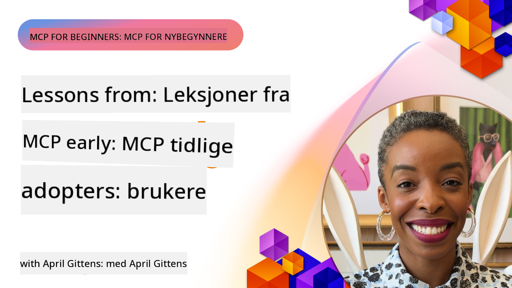

<!--
CO_OP_TRANSLATOR_METADATA:
{
  "original_hash": "41f16dac486d2086a53bc644a01cbe42",
  "translation_date": "2025-08-18T15:34:50+00:00",
  "source_file": "07-LessonsfromEarlyAdoption/README.md",
  "language_code": "no"
}
-->
# 🌟 Lærdom fra tidlige brukere

[](https://youtu.be/jds7dSmNptE)

_(Klikk på bildet over for å se videoen til denne leksjonen)_

## 🎯 Hva denne modulen dekker

Denne modulen utforsker hvordan ekte organisasjoner og utviklere bruker Model Context Protocol (MCP) for å løse faktiske utfordringer og drive innovasjon. Gjennom detaljerte casestudier og praktiske eksempler vil du oppdage hvordan MCP muliggjør sikker, skalerbar AI-integrasjon som kobler språkmodeller, verktøy og bedriftsdata.

### 📚 Se MCP i praksis

Vil du se disse prinsippene anvendt på produksjonsklare verktøy? Sjekk ut vår [**10 Microsoft MCP Servers That Are Transforming Developer Productivity**](microsoft-mcp-servers.md), som viser frem ekte Microsoft MCP-servere du kan bruke i dag.

## Oversikt

Denne leksjonen utforsker hvordan tidlige brukere har utnyttet Model Context Protocol (MCP) for å løse reelle utfordringer og drive innovasjon på tvers av bransjer. Gjennom detaljerte casestudier og praktiske prosjekter vil du se hvordan MCP muliggjør standardisert, sikker og skalerbar AI-integrasjon—som kobler store språkmodeller, verktøy og bedriftsdata i en enhetlig rammeverk. Du vil få praktisk erfaring med å designe og bygge MCP-baserte løsninger, lære av velprøvde implementeringsmønstre og oppdage beste praksis for å distribuere MCP i produksjonsmiljøer. Leksjonen fremhever også fremvoksende trender, fremtidige retninger og åpne ressurskilder for å hjelpe deg med å holde deg i forkant av MCP-teknologi og dens utviklende økosystem.

## Læringsmål

- Analysere reelle MCP-implementeringer på tvers av ulike bransjer
- Designe og bygge komplette MCP-baserte applikasjoner
- Utforske fremvoksende trender og fremtidige retninger innen MCP-teknologi
- Anvende beste praksis i faktiske utviklingsscenarier

## Reelle MCP-implementeringer

### Casestudie 1: Automatisering av kundestøtte for bedrifter

Et multinasjonalt selskap implementerte en MCP-basert løsning for å standardisere AI-interaksjoner på tvers av deres kundestøttesystemer. Dette gjorde det mulig for dem å:

- Skape et enhetlig grensesnitt for flere LLM-leverandører
- Opprettholde konsistent prompthåndtering på tvers av avdelinger
- Implementere robuste sikkerhets- og samsvarskontroller
- Enkelt bytte mellom ulike AI-modeller basert på spesifikke behov

**Teknisk implementering:**

```python
# Python MCP server implementation for customer support
import logging
import asyncio
from modelcontextprotocol import create_server, ServerConfig
from modelcontextprotocol.server import MCPServer
from modelcontextprotocol.transports import create_http_transport
from modelcontextprotocol.resources import ResourceDefinition
from modelcontextprotocol.prompts import PromptDefinition
from modelcontextprotocol.tool import ToolDefinition

# Configure logging
logging.basicConfig(level=logging.INFO)

async def main():
    # Create server configuration
    config = ServerConfig(
        name="Enterprise Customer Support Server",
        version="1.0.0",
        description="MCP server for handling customer support inquiries"
    )
    
    # Initialize MCP server
    server = create_server(config)
    
    # Register knowledge base resources
    server.resources.register(
        ResourceDefinition(
            name="customer_kb",
            description="Customer knowledge base documentation"
        ),
        lambda params: get_customer_documentation(params)
    )
    
    # Register prompt templates
    server.prompts.register(
        PromptDefinition(
            name="support_template",
            description="Templates for customer support responses"
        ),
        lambda params: get_support_templates(params)
    )
    
    # Register support tools
    server.tools.register(
        ToolDefinition(
            name="ticketing",
            description="Create and update support tickets"
        ),
        handle_ticketing_operations
    )
    
    # Start server with HTTP transport
    transport = create_http_transport(port=8080)
    await server.run(transport)

if __name__ == "__main__":
    asyncio.run(main())
```

**Resultater:** 30 % reduksjon i modellkostnader, 45 % forbedring i responskonsistens og forbedret samsvar på tvers av globale operasjoner.

### Casestudie 2: Diagnostisk assistent for helsevesenet

En helseleverandør utviklet en MCP-infrastruktur for å integrere flere spesialiserte medisinske AI-modeller samtidig som de sikret at sensitive pasientdata forble beskyttet:

- Sømløs bytte mellom generalist- og spesialistmedisinske modeller
- Strenge personvernkontroller og revisjonsspor
- Integrasjon med eksisterende elektroniske pasientjournaler (EHR)
- Konsistent promptutforming for medisinsk terminologi

**Teknisk implementering:**

```csharp
// C# MCP host application implementation in healthcare application
using Microsoft.Extensions.DependencyInjection;
using ModelContextProtocol.SDK.Client;
using ModelContextProtocol.SDK.Security;
using ModelContextProtocol.SDK.Resources;

public class DiagnosticAssistant
{
    private readonly MCPHostClient _mcpClient;
    private readonly PatientContext _patientContext;
    
    public DiagnosticAssistant(PatientContext patientContext)
    {
        _patientContext = patientContext;
        
        // Configure MCP client with healthcare-specific settings
        var clientOptions = new ClientOptions
        {
            Name = "Healthcare Diagnostic Assistant",
            Version = "1.0.0",
            Security = new SecurityOptions
            {
                Encryption = EncryptionLevel.Medical,
                AuditEnabled = true
            }
        };
        
        _mcpClient = new MCPHostClientBuilder()
            .WithOptions(clientOptions)
            .WithTransport(new HttpTransport("https://healthcare-mcp.example.org"))
            .WithAuthentication(new HIPAACompliantAuthProvider())
            .Build();
    }
    
    public async Task<DiagnosticSuggestion> GetDiagnosticAssistance(
        string symptoms, string patientHistory)
    {
        // Create request with appropriate resources and tool access
        var resourceRequest = new ResourceRequest
        {
            Name = "patient_records",
            Parameters = new Dictionary<string, object>
            {
                ["patientId"] = _patientContext.PatientId,
                ["requestingProvider"] = _patientContext.ProviderId
            }
        };
        
        // Request diagnostic assistance using appropriate prompt
        var response = await _mcpClient.SendPromptRequestAsync(
            promptName: "diagnostic_assistance",
            parameters: new Dictionary<string, object>
            {
                ["symptoms"] = symptoms,
                patientHistory = patientHistory,
                relevantGuidelines = _patientContext.GetRelevantGuidelines()
            });
            
        return DiagnosticSuggestion.FromMCPResponse(response);
    }
}
```

**Resultater:** Forbedrede diagnostiske forslag for leger samtidig som full HIPAA-samsvar opprettholdes og betydelig reduksjon i kontekstbytte mellom systemer.

### Casestudie 3: Risikoanalyse for finansielle tjenester

En finansinstitusjon implementerte MCP for å standardisere sine risikoanalyseprosesser på tvers av ulike avdelinger:

- Opprettet et enhetlig grensesnitt for kreditt-, svindel- og investeringsrisikomodeller
- Implementerte strenge tilgangskontroller og modellversjonering
- Sikret revisjonsmulighet for alle AI-anbefalinger
- Opprettholdt konsistent dataformatering på tvers av ulike systemer

**Teknisk implementering:**

```java
// Java MCP server for financial risk assessment
import org.mcp.server.*;
import org.mcp.security.*;

public class FinancialRiskMCPServer {
    public static void main(String[] args) {
        // Create MCP server with financial compliance features
        MCPServer server = new MCPServerBuilder()
            .withModelProviders(
                new ModelProvider("risk-assessment-primary", new AzureOpenAIProvider()),
                new ModelProvider("risk-assessment-audit", new LocalLlamaProvider())
            )
            .withPromptTemplateDirectory("./compliance/templates")
            .withAccessControls(new SOCCompliantAccessControl())
            .withDataEncryption(EncryptionStandard.FINANCIAL_GRADE)
            .withVersionControl(true)
            .withAuditLogging(new DatabaseAuditLogger())
            .build();
            
        server.addRequestValidator(new FinancialDataValidator());
        server.addResponseFilter(new PII_RedactionFilter());
        
        server.start(9000);
        
        System.out.println("Financial Risk MCP Server running on port 9000");
    }
}
```

**Resultater:** Forbedret regulatorisk samsvar, 40 % raskere modellimplementeringssykluser og forbedret konsistens i risikoanalyse på tvers av avdelinger.

### Casestudie 4: Microsoft Playwright MCP Server for nettleserautomatisering

Microsoft utviklet [Playwright MCP-serveren](https://github.com/microsoft/playwright-mcp) for å muliggjøre sikker, standardisert nettleserautomatisering gjennom Model Context Protocol. Denne produksjonsklare serveren lar AI-agenter og LLM-er samhandle med nettlesere på en kontrollert, revisjonsbar og utvidbar måte—som muliggjør brukstilfeller som automatisert nett-testing, datauttrekk og ende-til-ende arbeidsflyter.

> **🎯 Produksjonsklart verktøy**
> 
> Denne casestudien viser en ekte MCP-server du kan bruke i dag! Lær mer om Playwright MCP Server og 9 andre produksjonsklare Microsoft MCP-servere i vår [**Microsoft MCP Servers Guide**](microsoft-mcp-servers.md#8--playwright-mcp-server).

**Nøkkelfunksjoner:**
- Eksponerer nettleserautomatiseringsfunksjoner (navigering, skjemautfylling, skjermbildeopptak, etc.) som MCP-verktøy
- Implementerer strenge tilgangskontroller og sandkasse for å forhindre uautoriserte handlinger
- Gir detaljerte revisjonslogger for alle nettleserinteraksjoner
- Støtter integrasjon med Azure OpenAI og andre LLM-leverandører for agentdrevet automatisering
- Driver GitHub Copilot's Coding Agent med nettleserfunksjoner

**Teknisk implementering:**

```typescript
// TypeScript: Registering Playwright browser automation tools in an MCP server
import { createServer, ToolDefinition } from 'modelcontextprotocol';
import { launch } from 'playwright';

const server = createServer({
  name: 'Playwright MCP Server',
  version: '1.0.0',
  description: 'MCP server for browser automation using Playwright'
});

// Register a tool for navigating to a URL and capturing a screenshot
server.tools.register(
  new ToolDefinition({
    name: 'navigate_and_screenshot',
    description: 'Navigate to a URL and capture a screenshot',
    parameters: {
      url: { type: 'string', description: 'The URL to visit' }
    }
  }),
  async ({ url }) => {
    const browser = await launch();
    const page = await browser.newPage();
    await page.goto(url);
    const screenshot = await page.screenshot();
    await browser.close();
    return { screenshot };
  }
);

// Start the MCP server
server.listen(8080);
```

**Resultater:**

- Muliggjorde sikker, programmert nettleserautomatisering for AI-agenter og LLM-er
- Reduserte manuelt testarbeid og forbedret testdekning for nettapplikasjoner
- Tilbydde et gjenbrukbart, utvidbart rammeverk for nettleserbasert verktøyintegrasjon i bedriftsmiljøer
- Driver GitHub Copilot's nettleserfunksjoner

**Referanser:**

- [Playwright MCP Server GitHub Repository](https://github.com/microsoft/playwright-mcp)
- [Microsoft AI og automatiseringsløsninger](https://azure.microsoft.com/en-us/products/ai-services/)

### Casestudie 5: Azure MCP – Bedriftsklasse Model Context Protocol som en tjeneste

Azure MCP Server ([https://aka.ms/azmcp](https://aka.ms/azmcp)) er Microsofts administrerte, bedriftsklasse implementering av Model Context Protocol, designet for å tilby skalerbare, sikre og samsvarende MCP-serverfunksjoner som en skytjeneste. Azure MCP muliggjør organisasjoner å raskt distribuere, administrere og integrere MCP-servere med Azure AI, data og sikkerhetstjenester, redusere operasjonell overhead og akselerere AI-adopsjon.

> **🎯 Produksjonsklart verktøy**
> 
> Dette er en ekte MCP-server du kan bruke i dag! Lær mer om Azure AI Foundry MCP Server i vår [**Microsoft MCP Servers Guide**](microsoft-mcp-servers.md).

- Fullt administrert MCP-serverhosting med innebygd skalering, overvåking og sikkerhet
- Naturlig integrasjon med Azure OpenAI, Azure AI Search og andre Azure-tjenester
- Bedriftsautentisering og autorisasjon via Microsoft Entra ID
- Støtte for tilpassede verktøy, promptmaler og ressurskoblinger
- Samsvar med bedriftsikkerhet og regulatoriske krav

**Teknisk implementering:**

```yaml
# Example: Azure MCP server deployment configuration (YAML)
apiVersion: mcp.microsoft.com/v1
kind: McpServer
metadata:
  name: enterprise-mcp-server
spec:
  modelProviders:
    - name: azure-openai
      type: AzureOpenAI
      endpoint: https://<your-openai-resource>.openai.azure.com/
      apiKeySecret: <your-azure-keyvault-secret>
  tools:
    - name: document_search
      type: AzureAISearch
      endpoint: https://<your-search-resource>.search.windows.net/
      apiKeySecret: <your-azure-keyvault-secret>
  authentication:
    type: EntraID
    tenantId: <your-tenant-id>
  monitoring:
    enabled: true
    logAnalyticsWorkspace: <your-log-analytics-id>
```

**Resultater:**  
- Redusert tid-til-verdi for bedrifts-AI-prosjekter ved å tilby en klar-til-bruk, samsvarende MCP-serverplattform
- Forenklet integrasjon av LLM-er, verktøy og bedriftsdatakilder
- Forbedret sikkerhet, observabilitet og operasjonell effektivitet for MCP-arbeidsbelastninger
- Forbedret kodekvalitet med Azure SDK beste praksis og gjeldende autentiseringsmønstre

**Referanser:**  
- [Azure MCP Dokumentasjon](https://aka.ms/azmcp)
- [Azure MCP Server GitHub Repository](https://github.com/Azure/azure-mcp)
- [Azure AI-tjenester](https://azure.microsoft.com/en-us/products/ai-services/)
- [Microsoft MCP Center](https://mcp.azure.com)

### Casestudie 6: NLWeb

MCP (Model Context Protocol) er en fremvoksende protokoll for chatbots og AI-assistenter for å samhandle med verktøy. Hver NLWeb-instans er også en MCP-server, som støtter én kjernefunksjon, ask, som brukes til å stille et nettsted et spørsmål i naturlig språk. Svaret som returneres benytter schema.org, et mye brukt vokabular for å beskrive webdata. Grovt sagt er MCP til NLWeb som Http er til HTML. NLWeb kombinerer protokoller, Schema.org-formater og eksempelkode for å hjelpe nettsteder raskt med å opprette disse endepunktene, til fordel for både mennesker gjennom samtalegrensesnitt og maskiner gjennom naturlig agent-til-agent-interaksjon.

Det er to distinkte komponenter i NLWeb:
- En protokoll, veldig enkel å begynne med, for å grensesnitt med et nettsted i naturlig språk og et format, som benytter json og schema.org for det returnerte svaret. Se dokumentasjonen om REST API for mer detaljer.
- En enkel implementering av (1) som utnytter eksisterende markup, for nettsteder som kan abstraheres som lister over elementer (produkter, oppskrifter, attraksjoner, anmeldelser, etc.). Sammen med et sett med brukergrensesnitt-widgets kan nettsteder enkelt tilby samtalegrensesnitt til innholdet sitt. Se dokumentasjonen om Life of a chat query for mer detaljer om hvordan dette fungerer.

**Referanser:**  
- [Azure MCP Dokumentasjon](https://aka.ms/azmcp)
- [NLWeb](https://github.com/microsoft/NlWeb)

### Casestudie 7: Azure AI Foundry MCP Server – Integrasjon av bedrifts-AI-agenter

Azure AI Foundry MCP-servere demonstrerer hvordan MCP kan brukes til å orkestrere og administrere AI-agenter og arbeidsflyter i bedriftsmiljøer. Ved å integrere MCP med Azure AI Foundry kan organisasjoner standardisere agentinteraksjoner, utnytte Foundrys arbeidsflytadministrasjon og sikre sikre, skalerbare distribusjoner.

> **🎯 Produksjonsklart verktøy**
> 
> Dette er en ekte MCP-server du kan bruke i dag! Lær mer om Azure AI Foundry MCP Server i vår [**Microsoft MCP Servers Guide**](microsoft-mcp-servers.md#9--azure-ai-foundry-mcp-server).

**Nøkkelfunksjoner:**
- Omfattende tilgang til Azures AI-økosystem, inkludert modellkataloger og distribusjonsadministrasjon
- Kunnskapsindeksering med Azure AI Search for RAG-applikasjoner
- Evaluering av AI-modellens ytelse og kvalitetssikring
- Integrasjon med Azure AI Foundry Catalog og Labs for banebrytende forskningsmodeller
- Agentadministrasjon og evalueringsfunksjoner for produksjonsscenarier

**Resultater:**
- Rask prototyping og robust overvåking av AI-agentarbeidsflyter
- Sømløs integrasjon med Azure AI-tjenester for avanserte scenarier
- Enhetlig grensesnitt for bygging, distribusjon og overvåking av agentpipelines
- Forbedret sikkerhet, samsvar og operasjonell effektivitet for bedrifter
- Akselerert AI-adopsjon samtidig som kontroll over komplekse agentdrevne prosesser opprettholdes

**Referanser:**
- [Azure AI Foundry MCP Server GitHub Repository](https://github.com/azure-ai-foundry/mcp-foundry)
- [Integrering av Azure AI-agenter med MCP (Microsoft Foundry Blog)](https://devblogs.microsoft.com/foundry/integrating-azure-ai-agents-mcp/)

### Casestudie 8: Foundry MCP Playground – Eksperimentering og prototyping

Foundry MCP Playground tilbyr et klar-til-bruk miljø for eksperimentering med MCP-servere og Azure AI Foundry-integrasjoner. Utviklere kan raskt prototype, teste og evaluere AI-modeller og agentarbeidsflyter ved å bruke ressurser fra Azure AI Foundry Catalog og Labs. Playground forenkler oppsett, gir eksempler på prosjekter og støtter samarbeidende utvikling, noe som gjør det enkelt å utforske beste praksis og nye scenarier med minimal overhead. Det er spesielt nyttig for team som ønsker å validere ideer, dele eksperimenter og akselerere læring uten behov for kompleks infrastruktur. Ved å senke terskelen for oppstart, bidrar playground til å fremme innovasjon og samfunnsbidrag i MCP- og Azure AI Foundry-økosystemet.

**Referanser:**

- [Foundry MCP Playground GitHub Repository](https://github.com/azure-ai-foundry/foundry-mcp-playground)

### Casestudie 9: Microsoft Learn Docs MCP Server – AI-drevet dokumentasjonstilgang

Microsoft Learn Docs MCP Server er en skybasert tjeneste som gir AI-assistenter sanntidstilgang til offisiell Microsoft-dokumentasjon gjennom Model Context Protocol. Denne produksjonsklare serveren kobler til det omfattende Microsoft Learn-økosystemet og muliggjør semantisk søk på tvers av alle offisielle Microsoft-kilder.
> **🎯 Produksjonsklar verktøy**
> 
> Dette er en ekte MCP-server du kan bruke i dag! Lær mer om Microsoft Learn Docs MCP Server i vår [**Microsoft MCP Servers Guide**](microsoft-mcp-servers.md#1--microsoft-learn-docs-mcp-server).
**Nøkkelfunksjoner:**
- Sanntidstilgang til offisiell Microsoft-dokumentasjon, Azure-dokumenter og Microsoft 365-dokumentasjon
- Avanserte semantiske søkefunksjoner som forstår kontekst og intensjon
- Alltid oppdatert informasjon ettersom Microsoft Learn-innhold publiseres
- Omfattende dekning av Microsoft Learn, Azure-dokumentasjon og Microsoft 365-kilder
- Returnerer opptil 10 innholdsbiter av høy kvalitet med artikkeltitler og URL-er

**Hvorfor det er kritisk:**
- Løser problemet med "utdatert AI-kunnskap" for Microsoft-teknologier
- Sikrer at AI-assistenter har tilgang til de nyeste funksjonene i .NET, C#, Azure og Microsoft 365
- Gir autoritativ, førstepartsinformasjon for nøyaktig kodegenerering
- Essensielt for utviklere som jobber med raskt utviklende Microsoft-teknologier

**Resultater:**
- Dramatisk forbedret nøyaktighet i AI-generert kode for Microsoft-teknologier
- Redusert tid brukt på å søke etter oppdatert dokumentasjon og beste praksis
- Økt utviklerproduktivitet med kontekstbevisst dokumentasjonsinnhenting
- Sømløs integrasjon med utviklingsarbeidsflyter uten å forlate IDE-en

**Referanser:**
- [Microsoft Learn Docs MCP Server GitHub Repository](https://github.com/MicrosoftDocs/mcp)
- [Microsoft Learn Documentation](https://learn.microsoft.com/)

## Praktiske prosjekter

### Prosjekt 1: Bygg en Multi-Provider MCP Server

**Mål:** Opprett en MCP-server som kan dirigere forespørsler til flere AI-modelleverandører basert på spesifikke kriterier.

**Krav:**

- Støtte minst tre forskjellige modellleverandører (f.eks. OpenAI, Anthropic, lokale modeller)
- Implementere en rutemekanisme basert på forespørselsmetadata
- Opprette et konfigurasjonssystem for administrasjon av leverandørlegitimasjon
- Legge til caching for å optimalisere ytelse og kostnader
- Bygge et enkelt dashbord for overvåking av bruk

**Implementeringstrinn:**

1. Sett opp den grunnleggende MCP-serverinfrastrukturen
2. Implementer leverandøradaptere for hver AI-modelltjeneste
3. Opprett rutelogikken basert på forespørselsattributter
4. Legg til caching-mekanismer for hyppige forespørsler
5. Utvikle overvåkingsdashbordet
6. Test med ulike forespørselmønstre

**Teknologier:** Velg mellom Python (.NET/Java/Python basert på preferanse), Redis for caching, og et enkelt webrammeverk for dashbordet.

### Prosjekt 2: Enterprise Prompt Management System

**Mål:** Utvikle et MCP-basert system for administrasjon, versjonering og distribusjon av prompt-maler i en organisasjon.

**Krav:**

- Opprett et sentralisert lager for prompt-maler
- Implementer versjonering og godkjenningsarbeidsflyter
- Bygg testfunksjoner for maler med eksempelinnspill
- Utvikle rollebaserte tilgangskontroller
- Opprett en API for henting og distribusjon av maler

**Implementeringstrinn:**

1. Design databaseskjemaet for mal-lagring
2. Opprett kjerne-API-en for CRUD-operasjoner på maler
3. Implementer versjoneringssystemet
4. Bygg godkjenningsarbeidsflyten
5. Utvikle testrammeverket
6. Opprett et enkelt webgrensesnitt for administrasjon
7. Integrer med en MCP-server

**Teknologier:** Valgfritt backend-rammeverk, SQL eller NoSQL-database, og et frontend-rammeverk for administrasjonsgrensesnittet.

### Prosjekt 3: MCP-basert innholdsproduksjonsplattform

**Mål:** Bygg en innholdsproduksjonsplattform som bruker MCP for å levere konsistente resultater på tvers av ulike innholdstyper.

**Krav:**

- Støtte flere innholdsformater (blogginnlegg, sosiale medier, markedsføringskopi)
- Implementere malbasert generering med tilpasningsalternativer
- Opprett et system for innholdsgjennomgang og tilbakemelding
- Spor ytelsesmetrikker for innhold
- Støtte versjonering og iterasjon av innhold

**Implementeringstrinn:**

1. Sett opp MCP-klientinfrastrukturen
2. Opprett maler for ulike innholdstyper
3. Bygg innholdsproduksjonsrørledningen
4. Implementer gjennomgangssystemet
5. Utvikle systemet for sporing av metrikker
6. Opprett et brukergrensesnitt for maladministrasjon og innholdsproduksjon

**Teknologier:** Foretrukket programmeringsspråk, webrammeverk og databasesystem.

## Fremtidige retninger for MCP-teknologi

### Fremvoksende trender

1. **Multi-Modal MCP**
   - Utvidelse av MCP for å standardisere interaksjoner med bilde-, lyd- og videomodeller
   - Utvikling av tverrmodal resonneringskapabiliteter
   - Standardiserte promptformater for ulike modaliteter

2. **Federert MCP-infrastruktur**
   - Distribuerte MCP-nettverk som kan dele ressurser på tvers av organisasjoner
   - Standardiserte protokoller for sikker deling av modeller
   - Personvernbevarende beregningsteknikker

3. **MCP-markedsplasser**
   - Økosystemer for deling og kommersialisering av MCP-maler og plugins
   - Kvalitetssikring og sertifiseringsprosesser
   - Integrasjon med modellmarkedsplasser

4. **MCP for Edge Computing**
   - Tilpasning av MCP-standarder for ressursbegrensede edge-enheter
   - Optimaliserte protokoller for lavbåndbredde-miljøer
   - Spesialiserte MCP-implementeringer for IoT-økosystemer

5. **Regulatoriske rammeverk**
   - Utvikling av MCP-utvidelser for regulatorisk samsvar
   - Standardiserte revisjonsspor og forklaringsgrensesnitt
   - Integrasjon med fremvoksende AI-styringsrammeverk

### MCP-løsninger fra Microsoft

Microsoft og Azure har utviklet flere open-source-repositorier for å hjelpe utviklere med å implementere MCP i ulike scenarier:

#### Microsoft-organisasjon

1. [playwright-mcp](https://github.com/microsoft/playwright-mcp) - En Playwright MCP-server for nettleserautomatisering og testing
2. [files-mcp-server](https://github.com/microsoft/files-mcp-server) - En OneDrive MCP-serverimplementering for lokal testing og samfunnsbidrag
3. [NLWeb](https://github.com/microsoft/NlWeb) - NLWeb er en samling av åpne protokoller og tilhørende open-source-verktøy. Hovedfokuset er å etablere et grunnlag for AI Web

#### Azure-Samples-organisasjon

1. [mcp](https://github.com/Azure-Samples/mcp) - Lenker til eksempler, verktøy og ressurser for å bygge og integrere MCP-servere på Azure med flere språk
2. [mcp-auth-servers](https://github.com/Azure-Samples/mcp-auth-servers) - Referanse-MCP-servere som demonstrerer autentisering med gjeldende Model Context Protocol-spesifikasjon
3. [remote-mcp-functions](https://github.com/Azure-Samples/remote-mcp-functions) - Landingsside for Remote MCP Server-implementeringer i Azure Functions med lenker til språkspesifikke repositorier
4. [remote-mcp-functions-python](https://github.com/Azure-Samples/remote-mcp-functions-python) - Hurtigstartmal for å bygge og distribuere tilpassede Remote MCP-servere med Azure Functions og Python
5. [remote-mcp-functions-dotnet](https://github.com/Azure-Samples/remote-mcp-functions-dotnet) - Hurtigstartmal for å bygge og distribuere tilpassede Remote MCP-servere med Azure Functions og .NET/C#
6. [remote-mcp-functions-typescript](https://github.com/Azure-Samples/remote-mcp-functions-typescript) - Hurtigstartmal for å bygge og distribuere tilpassede Remote MCP-servere med Azure Functions og TypeScript
7. [remote-mcp-apim-functions-python](https://github.com/Azure-Samples/remote-mcp-apim-functions-python) - Azure API Management som AI Gateway til Remote MCP-servere med Python
8. [AI-Gateway](https://github.com/Azure-Samples/AI-Gateway) - APIM ❤️ AI-eksperimenter inkludert MCP-funksjoner, integrering med Azure OpenAI og AI Foundry

Disse repositoriene gir ulike implementeringer, maler og ressurser for arbeid med Model Context Protocol på tvers av forskjellige programmeringsspråk og Azure-tjenester. De dekker et bredt spekter av bruksområder fra grunnleggende serverimplementeringer til autentisering, sky-distribusjon og bedriftsintegrasjonsscenarier.

#### MCP Resources Directory

[MCP Resources Directory](https://github.com/microsoft/mcp/tree/main/Resources) i den offisielle Microsoft MCP-repositoriet gir en kuratert samling av eksempler på ressurser, prompt-maler og verktøydefinisjoner for bruk med Model Context Protocol-servere. Denne katalogen er designet for å hjelpe utviklere med å komme raskt i gang med MCP ved å tilby gjenbrukbare byggeklosser og beste praksis-eksempler for:

- **Prompt-maler:** Ferdige prompt-maler for vanlige AI-oppgaver og scenarier, som kan tilpasses for egne MCP-serverimplementeringer.
- **Verktøydefinisjoner:** Eksempelverktøyskjemaer og metadata for å standardisere verktøyintegrasjon og -kall på tvers av ulike MCP-servere.
- **Ressursprøver:** Eksempelressursdefinisjoner for tilkobling til datakilder, API-er og eksterne tjenester innen MCP-rammeverket.
- **Referanseimplementeringer:** Praktiske eksempler som demonstrerer hvordan man strukturerer og organiserer ressurser, prompts og verktøy i virkelige MCP-prosjekter.

Disse ressursene akselererer utvikling, fremmer standardisering og hjelper med å sikre beste praksis ved bygging og distribusjon av MCP-baserte løsninger.

#### MCP Resources Directory

- [MCP Resources (Sample Prompts, Tools, and Resource Definitions)](https://github.com/microsoft/mcp/tree/main/Resources)

### Forskningsmuligheter

- Effektive teknikker for prompt-optimalisering innen MCP-rammeverk
- Sikkerhetsmodeller for multi-tenant MCP-distribusjoner
- Ytelsesbenchmarking på tvers av ulike MCP-implementeringer
- Formelle verifikasjonsmetoder for MCP-servere

## Konklusjon

Model Context Protocol (MCP) former raskt fremtiden for standardisert, sikker og interoperabel AI-integrasjon på tvers av bransjer. Gjennom casestudier og praktiske prosjekter i denne leksjonen har du sett hvordan tidlige brukere—inkludert Microsoft og Azure—utnytter MCP for å løse virkelige utfordringer, akselerere AI-adopsjon og sikre samsvar, sikkerhet og skalerbarhet. MCPs modulære tilnærming gjør det mulig for organisasjoner å koble store språkmodeller, verktøy og bedriftsdata i et samlet, reviderbart rammeverk. Etter hvert som MCP fortsetter å utvikle seg, vil det være avgjørende å holde seg engasjert i fellesskapet, utforske open-source-ressurser og anvende beste praksis for å bygge robuste, fremtidsrettede AI-løsninger.

## Tilleggsressurser

- [MCP Foundry GitHub Repository](https://github.com/azure-ai-foundry/mcp-foundry)
- [Foundry MCP Playground](https://github.com/azure-ai-foundry/foundry-mcp-playground)
- [Integrating Azure AI Agents with MCP (Microsoft Foundry Blog)](https://devblogs.microsoft.com/foundry/integrating-azure-ai-agents-mcp/)
- [MCP GitHub Repository (Microsoft)](https://github.com/microsoft/mcp)
- [MCP Resources Directory (Sample Prompts, Tools, and Resource Definitions)](https://github.com/microsoft/mcp/tree/main/Resources)
- [MCP Community & Documentation](https://modelcontextprotocol.io/introduction)
- [Azure MCP Documentation](https://aka.ms/azmcp)
- [Playwright MCP Server GitHub Repository](https://github.com/microsoft/playwright-mcp)
- [Files MCP Server (OneDrive)](https://github.com/microsoft/files-mcp-server)
- [Azure-Samples MCP](https://github.com/Azure-Samples/mcp)
- [MCP Auth Servers (Azure-Samples)](https://github.com/Azure-Samples/mcp-auth-servers)
- [Remote MCP Functions (Azure-Samples)](https://github.com/Azure-Samples/remote-mcp-functions)
- [Remote MCP Functions Python (Azure-Samples)](https://github.com/Azure-Samples/remote-mcp-functions-python)
- [Remote MCP Functions .NET (Azure-Samples)](https://github.com/Azure-Samples/remote-mcp-functions-dotnet)
- [Remote MCP Functions TypeScript (Azure-Samples)](https://github.com/Azure-Samples/remote-mcp-functions-typescript)
- [Remote MCP APIM Functions Python (Azure-Samples)](https://github.com/Azure-Samples/remote-mcp-apim-functions-python)
- [AI-Gateway (Azure-Samples)](https://github.com/Azure-Samples/AI-Gateway)
- [Microsoft AI and Automation Solutions](https://azure.microsoft.com/en-us/products/ai-services/)

## Øvelser

1. Analyser en av casestudiene og foreslå en alternativ implementeringstilnærming.
2. Velg en av prosjektideene og lag en detaljert teknisk spesifikasjon.
3. Undersøk en bransje som ikke er dekket i casestudiene og skisser hvordan MCP kan adressere dens spesifikke utfordringer.
4. Utforsk en av de fremtidige retningene og lag et konsept for en ny MCP-utvidelse som støtter den.

Neste: [Microsoft MCP Server](../07-LessonsfromEarlyAdoption/microsoft-mcp-servers.md)

**Ansvarsfraskrivelse**:  
Dette dokumentet er oversatt ved hjelp av AI-oversettelsestjenesten [Co-op Translator](https://github.com/Azure/co-op-translator). Selv om vi streber etter nøyaktighet, vær oppmerksom på at automatiske oversettelser kan inneholde feil eller unøyaktigheter. Det originale dokumentet på sitt opprinnelige språk bør anses som den autoritative kilden. For kritisk informasjon anbefales profesjonell menneskelig oversettelse. Vi er ikke ansvarlige for eventuelle misforståelser eller feiltolkninger som oppstår ved bruk av denne oversettelsen.