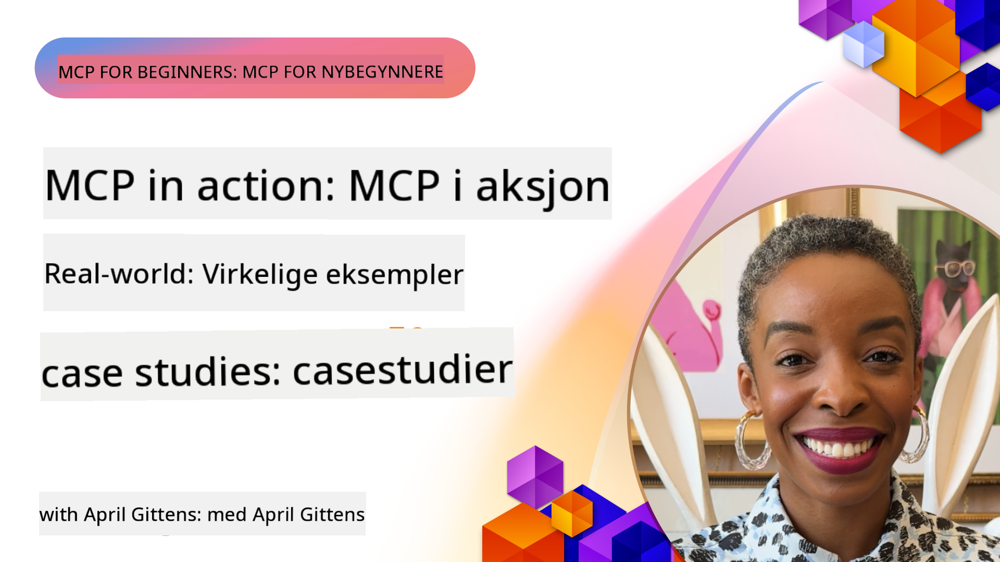

<!--
CO_OP_TRANSLATOR_METADATA:
{
  "original_hash": "1611dc5f6a2a35a789fc4c95fc5bfbe8",
  "translation_date": "2025-09-26T18:35:44+00:00",
  "source_file": "09-CaseStudy/README.md",
  "language_code": "no"
}
-->
# MCP i praksis: Virkelige casestudier

_(Klikk på bildet over for å se videoen til denne leksjonen)_

Model Context Protocol (MCP) endrer hvordan AI-applikasjoner samhandler med data, verktøy og tjenester. Denne delen presenterer virkelige casestudier som viser praktiske anvendelser av MCP i ulike bedriftsmiljøer.

## Oversikt

Denne delen fremhever konkrete eksempler på MCP-implementeringer og viser hvordan organisasjoner bruker protokollen for å løse komplekse forretningsutfordringer. Ved å studere disse casestudiene vil du få innsikt i MCPs allsidighet, skalerbarhet og praktiske fordeler i virkelige situasjoner.

## Viktige læringsmål

Ved å utforske disse casestudiene vil du:

- Forstå hvordan MCP kan brukes til å løse spesifikke forretningsproblemer
- Lære om ulike integrasjonsmønstre og arkitektoniske tilnærminger
- Gjenkjenne beste praksis for implementering av MCP i bedriftsmiljøer
- Få innsikt i utfordringer og løsninger fra virkelige implementeringer
- Identifisere muligheter for å bruke lignende mønstre i dine egne prosjekter

## Utvalgte casestudier

### 1. [Azure AI Reiseagenter – Referanseimplementering](./travelagentsample.md)

Denne casestudien undersøker Microsofts omfattende referanseløsning som viser hvordan man bygger en multi-agent, AI-drevet reiseplanleggingsapplikasjon ved hjelp av MCP, Azure OpenAI og Azure AI Search. Prosjektet fremhever:

- Orkestrering av flere agenter gjennom MCP
- Integrasjon av bedriftsdata med Azure AI Search
- Sikker, skalerbar arkitektur ved bruk av Azure-tjenester
- Utvidbare verktøy med gjenbrukbare MCP-komponenter
- Konversasjonsbasert brukeropplevelse drevet av Azure OpenAI

Arkitekturen og implementeringsdetaljene gir verdifull innsikt i hvordan man bygger komplekse, multi-agent systemer med MCP som koordineringslag.

### 2. [Oppdatering av Azure DevOps-elementer fra YouTube-data](./UpdateADOItemsFromYT.md)

Denne casestudien viser en praktisk anvendelse av MCP for å automatisere arbeidsflytprosesser. Den demonstrerer hvordan MCP-verktøy kan brukes til å:

- Hente data fra nettplattformer (YouTube)
- Oppdatere arbeidsoppgaver i Azure DevOps-systemer
- Skape repeterbare automatiseringsarbeidsflyter
- Integrere data på tvers av ulike systemer

Dette eksemplet illustrerer hvordan selv relativt enkle MCP-implementeringer kan gi betydelige effektivitetsgevinster ved å automatisere rutineoppgaver og forbedre datakonsistens på tvers av systemer.

### 3. [Sanntidsdokumentasjonshenting med MCP](./docs-mcp/README.md)

Denne casestudien veileder deg gjennom hvordan du kobler en Python-konsollklient til en Model Context Protocol (MCP)-server for å hente og logge sanntids, kontekstbevisst Microsoft-dokumentasjon. Du vil lære hvordan du:

- Knytter deg til en MCP-server ved hjelp av en Python-klient og den offisielle MCP SDK
- Bruker strømmende HTTP-klienter for effektiv sanntidsdatahenting
- Kaller dokumentasjonsverktøy på serveren og logger svarene direkte til konsollen
- Integrerer oppdatert Microsoft-dokumentasjon i arbeidsflyten uten å forlate terminalen

Kapittelet inkluderer en praktisk oppgave, et minimalt fungerende kodeeksempel og lenker til ytterligere ressurser for dypere læring. Se hele gjennomgangen og koden i det lenkede kapittelet for å forstå hvordan MCP kan transformere dokumentasjonstilgang og utviklerproduktivitet i konsollbaserte miljøer.

### 4. [Interaktiv studieplangenerator som webapp med MCP](./docs-mcp/README.md)

Denne casestudien viser hvordan man bygger en interaktiv webapplikasjon ved hjelp av Chainlit og Model Context Protocol (MCP) for å generere personlige studieplaner for ethvert emne. Brukere kan spesifisere et tema (som "AI-900-sertifisering") og en studielengde (f.eks. 8 uker), og appen vil gi en uke-for-uke oversikt over anbefalt innhold. Chainlit muliggjør en konversasjonsbasert chatgrensesnitt, noe som gjør opplevelsen engasjerende og tilpasningsdyktig.

- Konversasjonsbasert webapp drevet av Chainlit
- Brukerstyrte forespørsler for tema og varighet
- Uke-for-uke innholdsanbefalinger ved hjelp av MCP
- Sanntids, tilpasningsdyktige svar i et chatgrensesnitt

Prosjektet illustrerer hvordan konversasjonsbasert AI og MCP kan kombineres for å skape dynamiske, brukerdrevne læringsverktøy i et moderne webmiljø.

### 5. [Dokumentasjon i editoren med MCP-server i VS Code](./docs-mcp/README.md)

Denne casestudien viser hvordan du kan bringe Microsoft Learn Docs direkte inn i VS Code-miljøet ditt ved hjelp av MCP-serveren—slik at du slipper å bytte nettleserfaner! Du vil se hvordan du:

- Umiddelbart søker og leser dokumentasjon i VS Code ved hjelp av MCP-panelet eller kommandopaletten
- Refererer til dokumentasjon og setter inn lenker direkte i README- eller kurs-markdownfiler
- Bruker GitHub Copilot og MCP sammen for sømløs, AI-drevet dokumentasjon og kodearbeidsflyter
- Validerer og forbedrer dokumentasjonen med sanntidstilbakemeldinger og Microsoft-kildebasert nøyaktighet
- Integrerer MCP med GitHub-arbeidsflyter for kontinuerlig dokumentasjonsvalidering

Implementeringen inkluderer:

- Eksempel på `.vscode/mcp.json`-konfigurasjon for enkel oppsett
- Skjermbaserte gjennomganger av opplevelsen i editoren
- Tips for å kombinere Copilot og MCP for maksimal produktivitet

Dette scenariet er ideelt for kursforfattere, dokumentasjonsforfattere og utviklere som ønsker å holde fokus i editoren mens de jobber med dokumentasjon, Copilot og valideringsverktøy—alt drevet av MCP.

### 6. [Opprettelse av APIM MCP-server](./apimsample.md)

Denne casestudien gir en trinnvis veiledning om hvordan du oppretter en MCP-server ved hjelp av Azure API Management (APIM). Den dekker:

- Oppsett av en MCP-server i Azure API Management
- Eksponering av API-operasjoner som MCP-verktøy
- Konfigurering av policyer for hastighetsbegrensning og sikkerhet
- Testing av MCP-serveren ved hjelp av Visual Studio Code og GitHub Copilot

Dette eksemplet illustrerer hvordan man kan utnytte Azures muligheter til å lage en robust MCP-server som kan brukes i ulike applikasjoner, og forbedre integrasjonen av AI-systemer med bedrifts-APIer.

### 7. [GitHub MCP Registry — Akselererer agentisk integrasjon](https://github.com/mcp)

Denne casestudien undersøker hvordan GitHubs MCP Registry, lansert i september 2025, adresserer en kritisk utfordring i AI-økosystemet: fragmentert oppdagelse og distribusjon av Model Context Protocol (MCP)-servere.

#### Oversikt
**MCP Registry** løser problemet med spredte MCP-servere på tvers av repositorier og registre, som tidligere gjorde integrasjon treg og feilutsatt. Disse serverne gjør det mulig for AI-agenter å samhandle med eksterne systemer som APIer, databaser og dokumentasjonskilder.

#### Problemstilling
Utviklere som bygger agentiske arbeidsflyter møtte flere utfordringer:
- **Dårlig oppdagbarhet** av MCP-servere på ulike plattformer
- **Redundante oppsettspørsmål** spredt over forum og dokumentasjon
- **Sikkerhetsrisikoer** fra uverifiserte og upålitelige kilder
- **Manglende standardisering** i serverkvalitet og kompatibilitet

#### Løsningsarkitektur
GitHubs MCP Registry sentraliserer pålitelige MCP-servere med nøkkelfunksjoner:
- **Ett-klikk installasjon** integrasjon via VS Code for strømlinjeformet oppsett
- **Signal-over-støy sortering** basert på stjerner, aktivitet og samfunnsvalidering
- **Direkte integrasjon** med GitHub Copilot og andre MCP-kompatible verktøy
- **Åpen bidragsmodell** som gjør det mulig for både samfunn og bedriftsparter å bidra

#### Forretningspåvirkning
Registeret har levert målbare forbedringer:
- **Raskere onboarding** for utviklere som bruker verktøy som Microsoft Learn MCP Server, som strømmer offisiell dokumentasjon direkte inn i agenter
- **Forbedret produktivitet** via spesialiserte servere som `github-mcp-server`, som muliggjør naturlig språkbasert GitHub-automatisering (PR-opprettelse, CI-omkjøringer, kodeskanning)
- **Sterkere økosystemtillit** gjennom kuraterte oppføringer og transparente konfigurasjonsstandarder

#### Strategisk verdi
For praktikere som spesialiserer seg på agentlivssyklusadministrasjon og reproduserbare arbeidsflyter, gir MCP Registry:
- **Modulær agentdistribusjon** med standardiserte komponenter
- **Register-støttede evalueringspipelines** for konsistent testing og validering
- **Tverrverktøy-interoperabilitet** som muliggjør sømløs integrasjon på tvers av ulike AI-plattformer

Denne casestudien viser at MCP Registry er mer enn bare en katalog—det er en grunnleggende plattform for skalerbar, virkelighetsnær modellintegrasjon og distribusjon av agentiske systemer.

## Konklusjon

Disse syv omfattende casestudiene demonstrerer den bemerkelsesverdige allsidigheten og de praktiske anvendelsene av Model Context Protocol på tvers av ulike virkelige scenarier. Fra komplekse multi-agent reiseplanleggingssystemer og bedrifts-API-administrasjon til strømlinjeformede dokumentasjonsarbeidsflyter og det revolusjonerende GitHub MCP Registry, viser disse eksemplene hvordan MCP gir en standardisert, skalerbar måte å koble AI-systemer med verktøyene, dataene og tjenestene de trenger for å levere eksepsjonell verdi.

Casestudiene dekker flere dimensjoner av MCP-implementering:
- **Bedriftsintegrasjon**: Azure API Management og Azure DevOps-automatisering
- **Multi-agent orkestrering**: Reiseplanlegging med koordinerte AI-agenter
- **Utviklerproduktivitet**: VS Code-integrasjon og sanntidsdokumentasjonstilgang
- **Økosystemutvikling**: GitHubs MCP Registry som en grunnleggende plattform
- **Utdanningsapplikasjoner**: Interaktive studieplangeneratorer og konversasjonsgrensesnitt

Ved å studere disse implementeringene får du kritisk innsikt i:
- **Arkitektoniske mønstre** for ulike skalaer og bruksområder
- **Implementeringsstrategier** som balanserer funksjonalitet med vedlikeholdbarhet
- **Sikkerhets- og skalerbarhetsvurderinger** for produksjonsdistribusjoner
- **Beste praksis** for MCP-serverutvikling og klientintegrasjon
- **Økosystemtenkning** for å bygge sammenkoblede AI-drevne løsninger

Disse eksemplene viser samlet at MCP ikke bare er et teoretisk rammeverk, men en moden, produksjonsklar protokoll som muliggjør praktiske løsninger på komplekse forretningsutfordringer. Enten du bygger enkle automatiseringsverktøy eller sofistikerte multi-agent systemer, gir mønstrene og tilnærmingene som er illustrert her et solid grunnlag for dine egne MCP-prosjekter.

## Ytterligere ressurser

- [Azure AI Reiseagenter GitHub-repositorium](https://github.com/Azure-Samples/azure-ai-travel-agents)
- [Azure DevOps MCP-verktøy](https://github.com/microsoft/azure-devops-mcp)
- [Playwright MCP-verktøy](https://github.com/microsoft/playwright-mcp)
- [Microsoft Docs MCP-server](https://github.com/MicrosoftDocs/mcp)
- [GitHub MCP Registry — Akselererer agentisk integrasjon](https://github.com/mcp)
- [MCP-samfunnseksempler](https://github.com/microsoft/mcp)

Neste: Praktisk lab [Strømlinjeforme AI-arbeidsflyter: Bygge en MCP-server med AI Toolkit](../10-StreamliningAIWorkflowsBuildingAnMCPServerWithAIToolkit/README.md)

---

