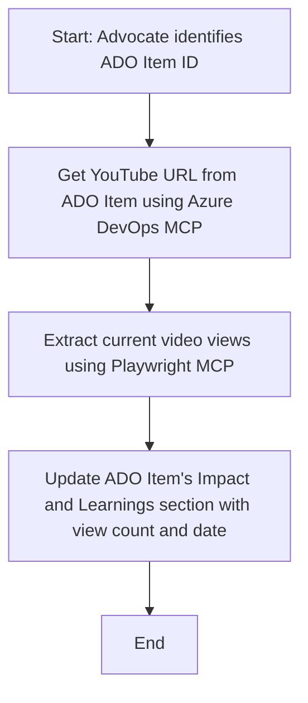

<!--
CO_OP_TRANSLATOR_METADATA:
{
  "original_hash": "14a2dfbea55ef735660a06bd6bdfe5f3",
  "translation_date": "2025-06-13T21:36:08+00:00",
  "source_file": "09-CaseStudy/UpdateADOItemsFromYT.md",
  "language_code": "no"
}
-->
# Case Study: Oppdatering av Azure DevOps-elementer med data fra YouTube ved hjelp av MCP

> **Ansvarsfraskrivelse:** Det finnes allerede nettbaserte verktøy og rapporter som kan automatisere prosessen med å oppdatere Azure DevOps-elementer med data fra plattformer som YouTube. Følgende scenario er kun et eksempel på hvordan MCP-verktøy kan brukes til automatisering og integrasjonsoppgaver.

## Oversikt

Denne casestudien viser et eksempel på hvordan Model Context Protocol (MCP) og dets verktøy kan brukes til å automatisere oppdateringen av Azure DevOps (ADO) arbeidsoppgaver med informasjon hentet fra nettplattformer som YouTube. Det beskrevne scenarioet er bare én illustrasjon av de bredere mulighetene disse verktøyene tilbyr, og kan tilpasses mange lignende automatiseringsbehov.

I dette eksempelet følger en Advocate opp nettbaserte sesjoner ved hjelp av ADO-elementer, der hvert element inneholder en YouTube-video-URL. Ved å bruke MCP-verktøy kan Advocaten holde ADO-elementene oppdatert med de nyeste videostatistikkene, som antall visninger, på en gjentakbar og automatisert måte. Denne tilnærmingen kan også brukes i andre tilfeller hvor informasjon fra nettbaserte kilder må integreres i ADO eller andre systemer.

## Scenario

En Advocate har ansvar for å følge opp effekten av nettbaserte sesjoner og samfunnsengasjement. Hver sesjon loggføres som et ADO-arbeidselement i prosjektet 'DevRel', og arbeidselementet inneholder et felt for YouTube-videoens URL. For å rapportere nøyaktig om rekkevidden til sesjonen, må Advocaten oppdatere ADO-elementet med det aktuelle antallet videovisninger og datoen da denne informasjonen ble hentet.

## Verktøy som brukes

- [Azure DevOps MCP](https://github.com/microsoft/azure-devops-mcp): Gir programmatisk tilgang og mulighet for oppdatering av ADO-arbeidselementer via MCP.
- [Playwright MCP](https://github.com/microsoft/playwright-mcp): Automatiserer nettleserhandlinger for å hente sanntidsdata fra nettsider, som YouTube-videostatistikk.

## Steg-for-steg arbeidsflyt

1. **Identifiser ADO-elementet**: Start med ADO-arbeidselementets ID (f.eks. 1234) i prosjektet 'DevRel'.
2. **Hent YouTube-URL**: Bruk Azure DevOps MCP-verktøyet for å hente YouTube-URL-en fra arbeidselementet.
3. **Hent videovisninger**: Bruk Playwright MCP-verktøyet til å navigere til YouTube-URL-en og hente det aktuelle antallet visninger.
4. **Oppdater ADO-elementet**: Skriv inn det siste visningstallet og datoen for henting i delen 'Impact and Learnings' i ADO-arbeidselementet ved hjelp av Azure DevOps MCP-verktøyet.

## Eksempelprompt

```bash
- Work with the ADO Item ID: 1234
- The project is '2025-Awesome'
- Get the YouTube URL for the ADO item
- Use Playwright to get the current views from the YouTube video
- Update the ADO item with the current video views and the updated date of the information
```

## Mermaid flytskjema



## Teknisk implementering

- **MCP Orkestrering**: Arbeidsflyten styres av en MCP-server som koordinerer bruken av både Azure DevOps MCP og Playwright MCP-verktøyene.
- **Automatisering**: Prosessen kan startes manuelt eller settes opp til å kjøre med jevne mellomrom for å holde ADO-elementene oppdatert.
- **Utvidbarhet**: Samme mønster kan brukes for å oppdatere ADO-elementer med andre nettbaserte måledata (f.eks. likes, kommentarer) eller fra andre plattformer.

## Resultater og betydning

- **Effektivitet**: Reduserer manuelt arbeid for Advocates ved å automatisere innhenting og oppdatering av videostatistikk.
- **Nøyaktighet**: Sikrer at ADO-elementer reflekterer den mest oppdaterte informasjonen tilgjengelig fra nettbaserte kilder.
- **Gjentakbarhet**: Gir en gjenbrukbar arbeidsflyt for lignende scenarioer med andre datakilder eller måleparametere.

## Referanser

- [Azure DevOps MCP](https://github.com/microsoft/azure-devops-mcp)
- [Playwright MCP](https://github.com/microsoft/playwright-mcp)
- [Model Context Protocol (MCP)](https://modelcontextprotocol.io/)

**Ansvarsfraskrivelse**:  
Dette dokumentet er oversatt ved hjelp av AI-oversettelsestjenesten [Co-op Translator](https://github.com/Azure/co-op-translator). Selv om vi streber etter nøyaktighet, vennligst vær oppmerksom på at automatiske oversettelser kan inneholde feil eller unøyaktigheter. Det originale dokumentet på det opprinnelige språket bør anses som den autoritative kilden. For kritisk informasjon anbefales profesjonell menneskelig oversettelse. Vi er ikke ansvarlige for eventuelle misforståelser eller feiltolkninger som oppstår ved bruk av denne oversettelsen.