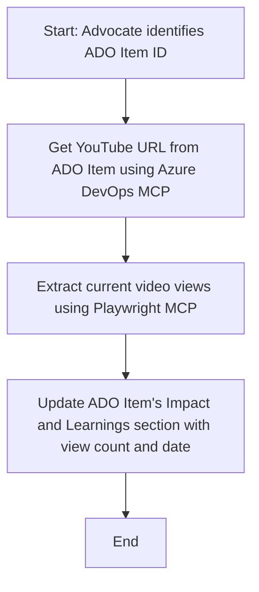

<!--
CO_OP_TRANSLATOR_METADATA:
{
  "original_hash": "14a2dfbea55ef735660a06bd6bdfe5f3",
  "translation_date": "2025-07-14T06:13:17+00:00",
  "source_file": "09-CaseStudy/UpdateADOItemsFromYT.md",
  "language_code": "no"
}
-->
# Case Study: Oppdatere Azure DevOps-elementer med data fra YouTube ved hjelp av MCP

> **Disclaimer:** Det finnes allerede nettbaserte verktøy og rapporter som kan automatisere prosessen med å oppdatere Azure DevOps-elementer med data fra plattformer som YouTube. Følgende scenario er kun et eksempel for å illustrere hvordan MCP-verktøy kan brukes til automatisering og integrasjonsoppgaver.

## Oversikt

Denne casestudien viser et eksempel på hvordan Model Context Protocol (MCP) og tilhørende verktøy kan brukes til å automatisere oppdateringen av Azure DevOps (ADO) arbeidsoppgaver med informasjon hentet fra nettplattformer som YouTube. Det beskrevne scenariet er bare en illustrasjon av de bredere mulighetene disse verktøyene tilbyr, og kan tilpasses mange lignende automatiseringsbehov.

I dette eksempelet følger en Advocate opp nettbaserte sesjoner ved hjelp av ADO-elementer, hvor hvert element inneholder en YouTube-video-URL. Ved å bruke MCP-verktøy kan Advocaten holde ADO-elementene oppdatert med de nyeste videostatistikkene, som antall visninger, på en repeterbar og automatisert måte. Denne tilnærmingen kan generaliseres til andre tilfeller der informasjon fra nettbaserte kilder må integreres i ADO eller andre systemer.

## Scenario

En Advocate har ansvar for å følge opp effekten av nettbaserte sesjoner og engasjement i fellesskapet. Hver sesjon loggføres som en ADO-arbeidsoppgave i prosjektet 'DevRel', og arbeidsoppgaven inneholder et felt for YouTube-videoens URL. For å rapportere nøyaktig om rekkevidden til sesjonen, må Advocaten oppdatere ADO-elementet med det nåværende antallet videovisninger og datoen for når denne informasjonen ble hentet.

## Verktøy som brukes

- [Azure DevOps MCP](https://github.com/microsoft/azure-devops-mcp): Gir programmatisk tilgang og oppdatering av ADO-arbeidsoppgaver via MCP.
- [Playwright MCP](https://github.com/microsoft/playwright-mcp): Automatiserer nettleserhandlinger for å hente live data fra nettsider, som YouTube-videostatistikk.

## Trinnvis arbeidsflyt

1. **Identifiser ADO-elementet**: Start med ADO-arbeidsoppgave-ID (f.eks. 1234) i prosjektet 'DevRel'.
2. **Hent YouTube-URL**: Bruk Azure DevOps MCP-verktøyet for å hente YouTube-URL-en fra arbeidsoppgaven.
3. **Hent videovisninger**: Bruk Playwright MCP-verktøyet for å navigere til YouTube-URL-en og hente det nåværende antallet visninger.
4. **Oppdater ADO-elementet**: Skriv inn det siste antallet visninger og datoen for innhenting i seksjonen 'Impact and Learnings' i ADO-arbeidsoppgaven ved hjelp av Azure DevOps MCP-verktøyet.

## Eksempel på prompt

```bash
- Work with the ADO Item ID: 1234
- The project is '2025-Awesome'
- Get the YouTube URL for the ADO item
- Use Playwright to get the current views from the YouTube video
- Update the ADO item with the current video views and the updated date of the information
```

## Mermaid flytskjema



## Teknisk implementering

- **MCP Orkestrering**: Arbeidsflyten styres av en MCP-server som koordinerer bruken av både Azure DevOps MCP og Playwright MCP-verktøyene.
- **Automatisering**: Prosessen kan startes manuelt eller settes opp til å kjøre med jevne mellomrom for å holde ADO-elementene oppdatert.
- **Utvidbarhet**: Samme mønster kan brukes for å oppdatere ADO-elementer med andre nettbaserte måleparametere (f.eks. likes, kommentarer) eller fra andre plattformer.

## Resultater og effekt

- **Effektivitet**: Reduserer manuelt arbeid for Advocates ved å automatisere innhenting og oppdatering av videostatistikk.
- **Nøyaktighet**: Sikrer at ADO-elementene gjenspeiler de mest oppdaterte dataene tilgjengelig fra nettbaserte kilder.
- **Reproduserbarhet**: Gir en gjenbrukbar arbeidsflyt for lignende scenarioer som involverer andre datakilder eller måleparametere.

## Referanser

- [Azure DevOps MCP](https://github.com/microsoft/azure-devops-mcp)
- [Playwright MCP](https://github.com/microsoft/playwright-mcp)
- [Model Context Protocol (MCP)](https://modelcontextprotocol.io/)

**Ansvarsfraskrivelse**:  
Dette dokumentet er oversatt ved hjelp av AI-oversettelsestjenesten [Co-op Translator](https://github.com/Azure/co-op-translator). Selv om vi streber etter nøyaktighet, vennligst vær oppmerksom på at automatiske oversettelser kan inneholde feil eller unøyaktigheter. Det opprinnelige dokumentet på originalspråket skal anses som den autoritative kilden. For kritisk informasjon anbefales profesjonell menneskelig oversettelse. Vi er ikke ansvarlige for eventuelle misforståelser eller feiltolkninger som oppstår ved bruk av denne oversettelsen.