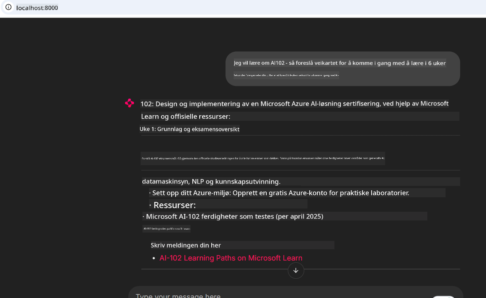

<!--
CO_OP_TRANSLATOR_METADATA:
{
  "original_hash": "4319d291c9d124ecafea52b3d04bfa0e",
  "translation_date": "2025-07-14T06:25:40+00:00",
  "source_file": "09-CaseStudy/docs-mcp/README.md",
  "language_code": "no"
}
-->
# Case Study: Koble til Microsoft Learn Docs MCP-serveren fra en klient

Har du noen gang opplevd å måtte veksle mellom dokumentasjonsnettsteder, Stack Overflow og utallige søkemotorfaner, alt mens du prøver å løse et problem i koden din? Kanskje du har en ekstra skjerm bare for dokumentasjon, eller du bytter stadig mellom IDE-en og en nettleser. Ville det ikke vært bedre om du kunne hente dokumentasjonen rett inn i arbeidsflyten din—integrert i appene dine, IDE-en eller til og med dine egne tilpassede verktøy? I denne casestudien skal vi utforske hvordan du kan gjøre nettopp det ved å koble direkte til Microsoft Learn Docs MCP-serveren fra din egen klientapplikasjon.

## Oversikt

Moderne utvikling handler om mer enn bare å skrive kode—det handler om å finne riktig informasjon til rett tid. Dokumentasjon finnes overalt, men sjelden der du trenger den mest: inne i verktøyene og arbeidsflytene dine. Ved å integrere dokumentasjonshenting direkte i applikasjonene dine kan du spare tid, redusere kontekstbytte og øke produktiviteten. I denne delen viser vi deg hvordan du kobler en klient til Microsoft Learn Docs MCP-serveren, slik at du kan få tilgang til sanntids, kontekstbevisst dokumentasjon uten å forlate appen din.

Vi går gjennom prosessen med å etablere en tilkobling, sende en forespørsel og håndtere strømmende svar på en effektiv måte. Denne tilnærmingen forenkler ikke bare arbeidsflyten din, men åpner også døren for å bygge smartere og mer hjelpsomme utviklerverktøy.

## Læringsmål

Hvorfor gjør vi dette? Fordi de beste utvikleropplevelsene er de som fjerner friksjon. Tenk deg en verden der kodeeditoren, chatboten eller nettappen din kan svare på dokumentasjonsspørsmål umiddelbart, med det nyeste innholdet fra Microsoft Learn. Når du er ferdig med dette kapitlet, vil du kunne:

- Forstå det grunnleggende om MCP server-klient kommunikasjon for dokumentasjon
- Implementere en konsoll- eller webapplikasjon som kobler til Microsoft Learn Docs MCP-serveren
- Bruke strømmende HTTP-klienter for sanntids dokumentasjonshenting
- Loggføre og tolke dokumentasjonssvar i applikasjonen din

Du vil se hvordan disse ferdighetene kan hjelpe deg med å bygge verktøy som ikke bare er reaktive, men virkelig interaktive og kontekstbevisste.

## Scenario 1 - Sanntids dokumentasjonshenting med MCP

I dette scenariet viser vi deg hvordan du kobler en klient til Microsoft Learn Docs MCP-serveren, slik at du kan få tilgang til sanntids, kontekstbevisst dokumentasjon uten å forlate appen din.

La oss sette dette ut i praksis. Oppgaven din er å skrive en app som kobler til Microsoft Learn Docs MCP-serveren, kaller `microsoft_docs_search`-verktøyet, og logger det strømmende svaret til konsollen.

### Hvorfor denne tilnærmingen?
Fordi det er grunnlaget for å bygge mer avanserte integrasjoner—enten du vil drive en chatbot, en IDE-utvidelse eller et webdashbord.

Du finner koden og instruksjonene for dette scenariet i [`solution`](./solution/README.md)-mappen i denne casestudien. Stegene vil veilede deg gjennom oppsettet av tilkoblingen:
- Bruk den offisielle MCP SDK-en og en strømmende HTTP-klient for tilkobling
- Kall `microsoft_docs_search`-verktøyet med en søkeparameter for å hente dokumentasjon
- Implementer riktig logging og feilhåndtering
- Lag et interaktivt konsollgrensesnitt som lar brukere skrive inn flere søkespørringer

Dette scenariet demonstrerer hvordan du:
- Koble til Docs MCP-serveren
- Sende en forespørsel
- Tolke og skrive ut resultatene

Slik kan det se ut når løsningen kjører:

```
Prompt> What is Azure Key Vault?
Answer> Azure Key Vault is a cloud service for securely storing and accessing secrets. ...
```

Nedenfor er et minimalt eksempel på en løsning. Full kode og detaljer finnes i solution-mappen.

<details>
<summary>Python</summary>

```python
import asyncio
from mcp.client.streamable_http import streamablehttp_client
from mcp import ClientSession

async def main():
    async with streamablehttp_client("https://learn.microsoft.com/api/mcp") as (read_stream, write_stream, _):
        async with ClientSession(read_stream, write_stream) as session:
            await session.initialize()
            result = await session.call_tool("microsoft_docs_search", {"query": "Azure Functions best practices"})
            print(result.content)

if __name__ == "__main__":
    asyncio.run(main())
```

- For full implementering og logging, se [`scenario1.py`](../../../../09-CaseStudy/docs-mcp/solution/python/scenario1.py).
- For installasjons- og bruksanvisning, se [`README.md`](./solution/python/README.md) i samme mappe.
</details>

## Scenario 2 - Interaktiv studieplan-generator webapp med MCP

I dette scenariet lærer du hvordan du integrerer Docs MCP i et webutviklingsprosjekt. Målet er å gjøre det mulig for brukere å søke i Microsoft Learn-dokumentasjonen direkte fra et webgrensesnitt, slik at dokumentasjonen blir umiddelbart tilgjengelig i appen eller på nettstedet ditt.

Du vil lære hvordan du:
- Setter opp en webapp
- Koble til Docs MCP-serveren
- Håndtere brukerinput og vise resultater

Slik kan det se ut når løsningen kjører:

```
User> I want to learn about AI102 - so suggest the roadmap to get it started from learn for 6 weeks

Assistant> Here’s a detailed 6-week roadmap to start your preparation for the AI-102: Designing and Implementing a Microsoft Azure AI Solution certification, using official Microsoft resources and focusing on exam skills areas:

---
## Week 1: Introduction & Fundamentals
- **Understand the Exam**: Review the [AI-102 exam skills outline](https://learn.microsoft.com/en-us/credentials/certifications/exams/ai-102/).
- **Set up Azure**: Sign up for a free Azure account if you don't have one.
- **Learning Path**: [Introduction to Azure AI services](https://learn.microsoft.com/en-us/training/modules/intro-to-azure-ai/)
- **Focus**: Get familiar with Azure portal, AI capabilities, and necessary tools.

....more weeks of the roadmap...

Let me know if you want module-specific recommendations or need more customized weekly tasks!
```

Nedenfor er et minimalt eksempel på en løsning. Full kode og detaljer finnes i solution-mappen.



<details>
<summary>Python (Chainlit)</summary>

Chainlit er et rammeverk for å bygge konversasjonsbaserte AI-webapper. Det gjør det enkelt å lage interaktive chatboter og assistenter som kan kalle MCP-verktøy og vise resultater i sanntid. Det er ideelt for rask prototyping og brukervennlige grensesnitt.

```python
import chainlit as cl
import requests

MCP_URL = "https://learn.microsoft.com/api/mcp"

@cl.on_message
def handle_message(message):
    query = {"question": message}
    response = requests.post(MCP_URL, json=query)
    if response.ok:
        result = response.json()
        cl.Message(content=result.get("answer", "No answer found.")).send()
    else:
        cl.Message(content="Error: " + response.text).send()
```

- For full implementering, se [`scenario2.py`](../../../../09-CaseStudy/docs-mcp/solution/python/scenario2.py).
- For oppsett og kjøreinstruksjoner, se [`README.md`](./solution/python/README.md).
</details>

## Scenario 3: Dokumentasjon i editor med MCP-server i VS Code

Hvis du vil ha Microsoft Learn Docs direkte inne i VS Code (i stedet for å bytte nettleserfaner), kan du bruke MCP-serveren i editoren din. Dette lar deg:
- Søke og lese dokumentasjon i VS Code uten å forlate kodearbeidsmiljøet.
- Referere til dokumentasjon og sette inn lenker direkte i README- eller kursfiler.
- Bruke GitHub Copilot og MCP sammen for en sømløs, AI-drevet dokumentasjonsflyt.

**Du vil lære hvordan du:**
- Legger til en gyldig `.vscode/mcp.json`-fil i rotmappen for arbeidsområdet ditt (se eksempel nedenfor).
- Åpner MCP-panelet eller bruker kommandopaletten i VS Code for å søke og sette inn dokumentasjon.
- Refererer til dokumentasjon direkte i markdown-filene dine mens du jobber.
- Kombinerer denne arbeidsflyten med GitHub Copilot for enda høyere produktivitet.

Her er et eksempel på hvordan du setter opp MCP-serveren i VS Code:

```json
{
  "servers": {
    "LearnDocsMCP": {
      "url": "https://learn.microsoft.com/api/mcp"
    }
  }
}
```

</details>

> For en detaljert gjennomgang med skjermbilder og steg-for-steg guide, se [`README.md`](./solution/scenario3/README.md).


Denne tilnærmingen er ideell for alle som lager tekniske kurs, skriver dokumentasjon eller utvikler kode med hyppige referansebehov.

## Viktige punkter

Å integrere dokumentasjon direkte i verktøyene dine er ikke bare praktisk—det er en produktivitetsrevolusjon. Ved å koble til Microsoft Learn Docs MCP-serveren fra klienten din kan du:

- Eliminere kontekstbytte mellom kode og dokumentasjon
- Hente oppdatert, kontekstbevisst dokumentasjon i sanntid
- Bygge smartere, mer interaktive utviklerverktøy

Disse ferdighetene hjelper deg med å lage løsninger som ikke bare er effektive, men også hyggelige å bruke.

## Ekstra ressurser

For å utdype forståelsen din, utforsk disse offisielle ressursene:

- [Microsoft Learn Docs MCP Server (GitHub)](https://github.com/MicrosoftDocs/mcp)
- [Kom i gang med Azure MCP Server (mcp-python)](https://learn.microsoft.com/en-us/azure/developer/azure-mcp-server/get-started#create-the-python-app)
- [Hva er Azure MCP Server?](https://learn.microsoft.com/en-us/azure/developer/azure-mcp-server/)
- [Model Context Protocol (MCP) Introduksjon](https://modelcontextprotocol.io/introduction)
- [Legg til plugins fra en MCP Server (Python)](https://learn.microsoft.com/en-us/semantic-kernel/concepts/plugins/adding-mcp-plugins)

**Ansvarsfraskrivelse**:  
Dette dokumentet er oversatt ved hjelp av AI-oversettelsestjenesten [Co-op Translator](https://github.com/Azure/co-op-translator). Selv om vi streber etter nøyaktighet, vennligst vær oppmerksom på at automatiske oversettelser kan inneholde feil eller unøyaktigheter. Det opprinnelige dokumentet på originalspråket skal anses som den autoritative kilden. For kritisk informasjon anbefales profesjonell menneskelig oversettelse. Vi er ikke ansvarlige for eventuelle misforståelser eller feiltolkninger som oppstår ved bruk av denne oversettelsen.