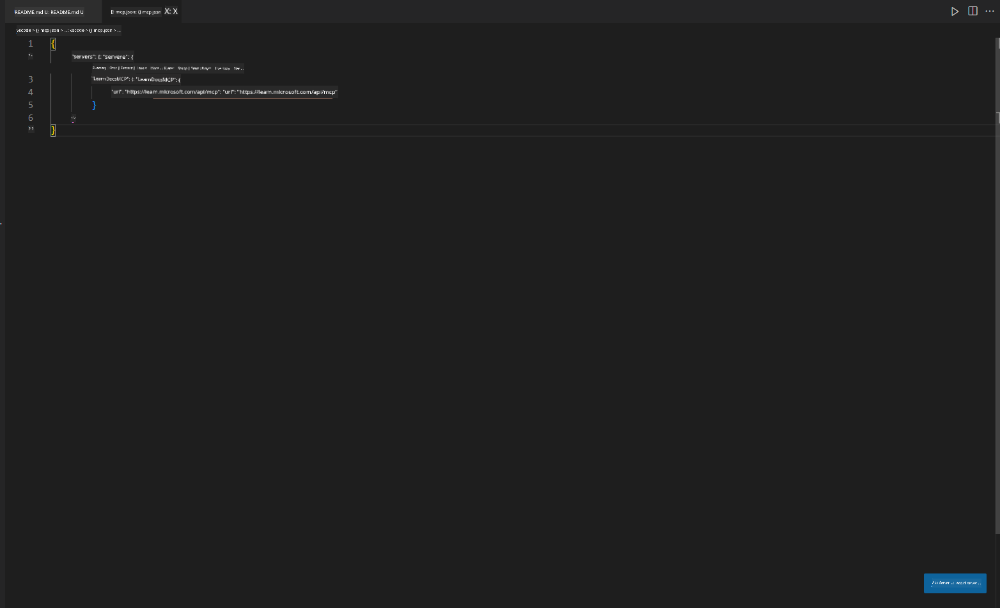
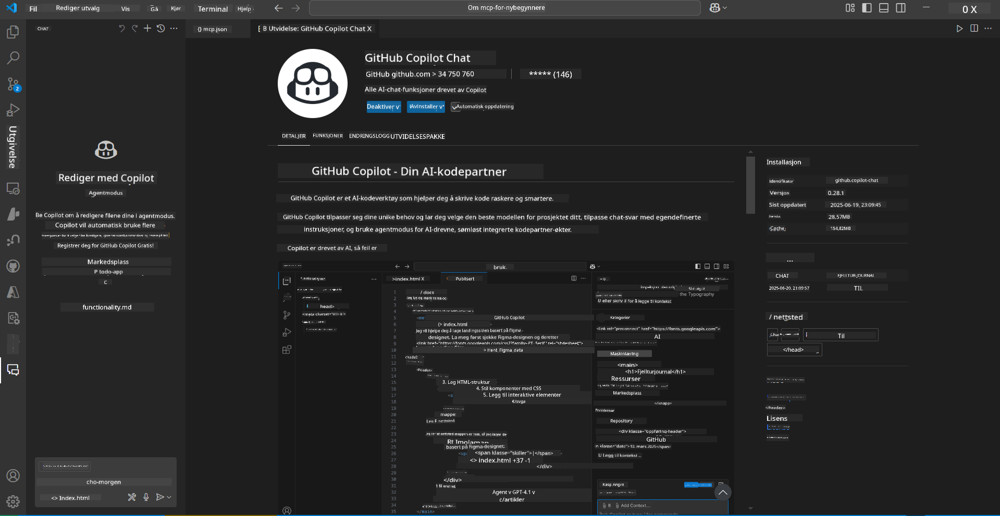
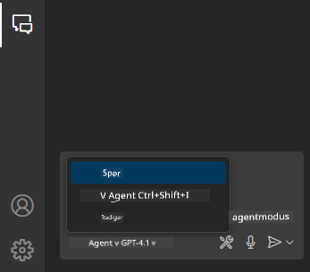
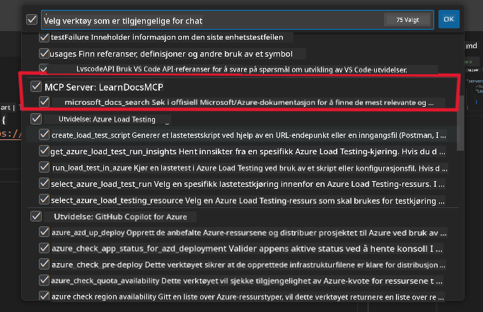
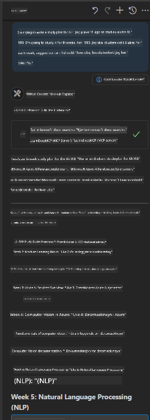
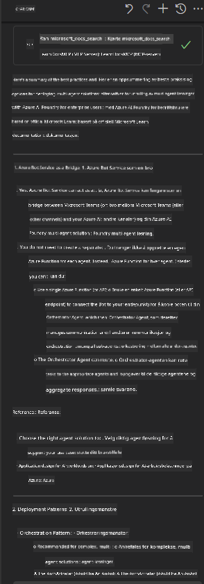

<!--
CO_OP_TRANSLATOR_METADATA:
{
  "original_hash": "db532b1ec386c9ce38c791653dc3c881",
  "translation_date": "2025-07-14T06:52:41+00:00",
  "source_file": "09-CaseStudy/docs-mcp/solution/scenario3/README.md",
  "language_code": "no"
}
-->
# Scenario 3: Dokumentasjon i editoren med MCP-server i VS Code

## Oversikt

I dette scenariet vil du lære hvordan du kan hente Microsoft Learn Docs direkte inn i Visual Studio Code-miljøet ditt ved hjelp av MCP-serveren. I stedet for å stadig bytte nettleserfaner for å søke etter dokumentasjon, kan du få tilgang til, søke i og referere til offisiell dokumentasjon rett i editoren. Denne tilnærmingen effektiviserer arbeidsflyten din, holder deg fokusert og muliggjør sømløs integrasjon med verktøy som GitHub Copilot.

- Søk og les dokumentasjon inne i VS Code uten å forlate kode-miljøet.
- Referer dokumentasjon og sett inn lenker direkte i README- eller kursfiler.
- Bruk GitHub Copilot og MCP sammen for en sømløs, AI-drevet dokumentasjonsflyt.

## Læringsmål

Når du er ferdig med dette kapitlet, vil du forstå hvordan du setter opp og bruker MCP-serveren i VS Code for å forbedre dokumentasjons- og utviklingsarbeidsflyten din. Du vil kunne:

- Konfigurere arbeidsområdet ditt til å bruke MCP-serveren for dokumentasjonssøk.
- Søke etter og sette inn dokumentasjon direkte fra VS Code.
- Kombinere kraften til GitHub Copilot og MCP for en mer produktiv, AI-forsterket arbeidsflyt.

Disse ferdighetene vil hjelpe deg med å holde fokus, forbedre dokumentasjonskvaliteten og øke produktiviteten som utvikler eller teknisk skribent.

## Løsning

For å få tilgang til dokumentasjon i editoren, følger du en rekke trinn som integrerer MCP-serveren med VS Code og GitHub Copilot. Denne løsningen passer perfekt for kursforfattere, dokumentasjonsskribenter og utviklere som ønsker å holde fokus i editoren mens de jobber med dokumentasjon og Copilot.

- Legg raskt til referanselenker i en README mens du skriver kurs- eller prosjektdokumentasjon.
- Bruk Copilot til å generere kode og MCP til å umiddelbart finne og sitere relevant dokumentasjon.
- Hold fokus i editoren og øk produktiviteten.

### Trinnvis veiledning

For å komme i gang, følg disse stegene. For hvert steg kan du legge til et skjermbilde fra assets-mappen for å illustrere prosessen visuelt.

1. **Legg til MCP-konfigurasjonen:**  
   I prosjektets rotmappe, opprett en `.vscode/mcp.json`-fil og legg til følgende konfigurasjon:  
   ```json
   {
     "servers": {
       "LearnDocsMCP": {
         "url": "https://learn.microsoft.com/api/mcp"
       }
     }
   }
   ```  
   Denne konfigurasjonen forteller VS Code hvordan den skal koble til [`Microsoft Learn Docs MCP server`](https://github.com/MicrosoftDocs/mcp).
   
   
    
2. **Åpne GitHub Copilot Chat-panelet:**  
   Hvis du ikke allerede har GitHub Copilot-utvidelsen installert, gå til Extensions-visningen i VS Code og installer den. Du kan laste den ned direkte fra [Visual Studio Code Marketplace](https://marketplace.visualstudio.com/items?itemName=GitHub.copilot-chat). Åpne deretter Copilot Chat-panelet fra sidemenyen.

   

3. **Aktiver agentmodus og verifiser verktøy:**  
   I Copilot Chat-panelet, aktiver agentmodus.

   

   Etter at agentmodus er aktivert, sjekk at MCP-serveren er listet som et av de tilgjengelige verktøyene. Dette sikrer at Copilot-agenten kan få tilgang til dokumentasjonsserveren for å hente relevant informasjon.
   
   

4. **Start en ny chat og spør agenten:**  
   Åpne en ny chat i Copilot Chat-panelet. Nå kan du stille agenten spørsmål om dokumentasjon. Agenten vil bruke MCP-serveren til å hente og vise relevant Microsoft Learn-dokumentasjon direkte i editoren.

   - *"Jeg prøver å lage en studieplan for tema X. Jeg skal studere det i 8 uker, foreslå innhold jeg bør ta for hver uke."*

   

5. **Live-spørring:**

   > La oss ta en live-spørring fra [#get-help](https://discord.gg/D6cRhjHWSC)-seksjonen i Azure AI Foundry Discord ([se originalmelding](https://discord.com/channels/1113626258182504448/1385498306720829572)):  
   
   *"Jeg søker svar på hvordan man kan distribuere en multi-agent-løsning med AI-agenter utviklet på Azure AI Foundry. Jeg ser at det ikke finnes en direkte distribusjonsmetode, som Copilot Studio-kanaler. Så, hva er de ulike måtene å gjøre denne distribusjonen på for bedriftsbrukere slik at de kan samhandle og få jobben gjort?  
Det finnes mange artikler/blogger som sier at vi kan bruke Azure Bot-tjenesten til dette, som kan fungere som en bro mellom MS Teams og Azure AI Foundry-agenter. Vil dette fungere hvis jeg setter opp en Azure-bot som kobler til Orchestrator Agent på Azure AI Foundry via Azure Function for å utføre orkestreringen, eller må jeg lage en Azure Function for hver av AI-agentene i multi-agent-løsningen for å gjøre orkestreringen i Bot Framework? Andre forslag mottas med takk."*

   

   Agenten vil svare med relevante dokumentasjonslenker og oppsummeringer, som du deretter kan sette inn direkte i markdown-filene dine eller bruke som referanser i koden.

### Eksempelspørringer

Her er noen eksempler på spørsmål du kan prøve. Disse spørringene viser hvordan MCP-serveren og Copilot kan samarbeide for å gi umiddelbar, kontekstbevisst dokumentasjon og referanser uten å forlate VS Code:

- "Vis meg hvordan jeg bruker Azure Functions triggers."
- "Sett inn en lenke til den offisielle dokumentasjonen for Azure Key Vault."
- "Hva er beste praksis for å sikre Azure-ressurser?"
- "Finn en quickstart for Azure AI-tjenester."

Disse spørringene demonstrerer hvordan MCP-serveren og Copilot kan jobbe sammen for å gi rask, kontekstbevisst dokumentasjon og referanser uten å forlate VS Code.

---

**Ansvarsfraskrivelse**:  
Dette dokumentet er oversatt ved hjelp av AI-oversettelsestjenesten [Co-op Translator](https://github.com/Azure/co-op-translator). Selv om vi streber etter nøyaktighet, vennligst vær oppmerksom på at automatiske oversettelser kan inneholde feil eller unøyaktigheter. Det opprinnelige dokumentet på originalspråket skal anses som den autoritative kilden. For kritisk informasjon anbefales profesjonell menneskelig oversettelse. Vi er ikke ansvarlige for eventuelle misforståelser eller feiltolkninger som oppstår ved bruk av denne oversettelsen.