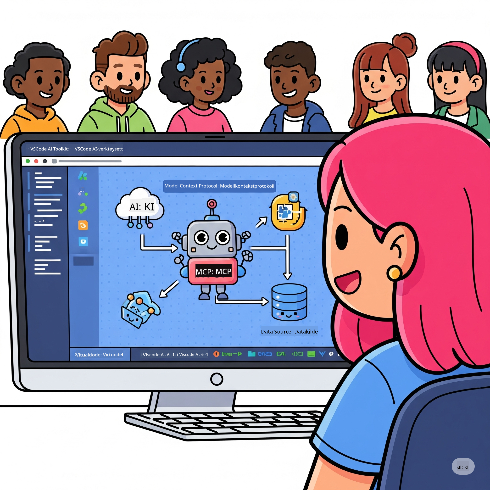
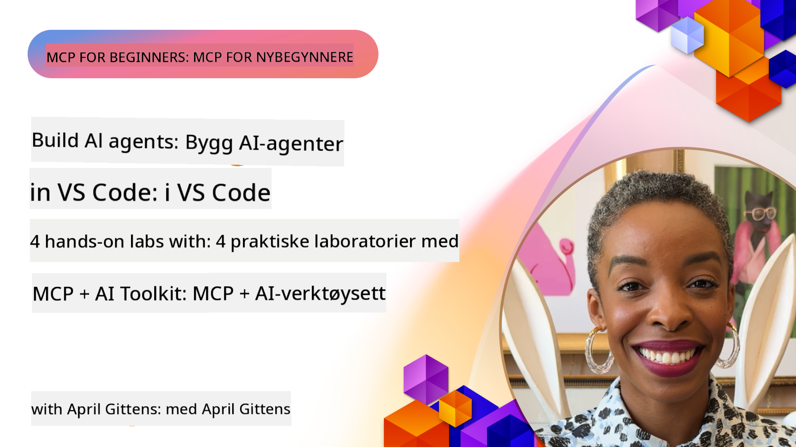

<!--
CO_OP_TRANSLATOR_METADATA:
{
  "original_hash": "1b000fd6e1b04c047578bfc5d07d54eb",
  "translation_date": "2025-08-18T15:52:44+00:00",
  "source_file": "10-StreamliningAIWorkflowsBuildingAnMCPServerWithAIToolkit/README.md",
  "language_code": "no"
}
-->
# Strømlinjeforming av AI-arbeidsflyter: Bygg en MCP-server med AI Toolkit

## 🎯  Oversikt

_(Klikk på bildet over for å se videoen til denne leksjonen)_

Velkommen til **Model Context Protocol (MCP) Workshop**! Denne omfattende praktiske workshopen kombinerer to banebrytende teknologier for å revolusjonere utviklingen av AI-applikasjoner:

- **🔗 Model Context Protocol (MCP)**: En åpen standard for sømløs integrasjon av AI-verktøy
- **🛠️ AI Toolkit for Visual Studio Code (AITK)**: Microsofts kraftige AI-utviklingsutvidelse

### 🎓 Hva du vil lære

Ved slutten av denne workshopen vil du mestre kunsten å bygge intelligente applikasjoner som kobler AI-modeller med virkelige verktøy og tjenester. Fra automatisert testing til tilpassede API-integrasjoner, vil du få praktiske ferdigheter til å løse komplekse forretningsutfordringer.

## 🏗️ Teknologistabel

### 🔌 Model Context Protocol (MCP)

MCP er **"USB-C for AI"** - en universell standard som kobler AI-modeller til eksterne verktøy og datakilder.

**✨ Nøkkelfunksjoner:**

- 🔄 **Standardisert integrasjon**: Universelt grensesnitt for AI-verktøytilkoblinger
- 🏛️ **Fleksibel arkitektur**: Lokale og eksterne servere via stdio/SSE transport
- 🧰 **Rikt økosystem**: Verktøy, oppfordringer og ressurser i én protokoll
- 🔒 **Klar for bedrifter**: Innebygd sikkerhet og pålitelighet

**🎯 Hvorfor MCP er viktig:**
Akkurat som USB-C eliminerte kabelkaos, eliminerer MCP kompleksiteten ved AI-integrasjoner. Én protokoll, uendelige muligheter.

### 🤖 AI Toolkit for Visual Studio Code (AITK)

Microsofts flaggskip AI-utviklingsutvidelse som forvandler VS Code til en AI-kraftpakke.

**🚀 Kjernefunksjoner:**

- 📦 **Modellkatalog**: Tilgang til modeller fra Azure AI, GitHub, Hugging Face, Ollama
- ⚡ **Lokal inferens**: ONNX-optimalisert CPU/GPU/NPU utførelse
- 🏗️ **Agent Builder**: Visuell utvikling av AI-agenter med MCP-integrasjon
- 🎭 **Multi-modal**: Støtte for tekst, visjon og strukturert output

**💡 Utviklingsfordeler:**

- Modellutplassering uten konfigurasjon
- Visuell oppfordringsutforming
- Sanntidstestingsmiljø
- Sømløs MCP-serverintegrasjon

## 📚 Læringsreise

### [🚀 Modul 1: Grunnleggende om AI Toolkit](./lab1/README.md)

**Varighet**: 15 minutter

- 🛠️ Installer og konfigurer AI Toolkit for VS Code
- 🗂️ Utforsk Modellkatalogen (100+ modeller fra GitHub, ONNX, OpenAI, Anthropic, Google)
- 🎮 Mestre det interaktive testmiljøet for sanntidstesting av modeller
- 🤖 Bygg din første AI-agent med Agent Builder
- 📊 Evaluer modellytelse med innebygde målinger (F1, relevans, likhet, sammenheng)
- ⚡ Lær batch-prosessering og multi-modal støtte

**🎯 Læringsutbytte**: Lag en funksjonell AI-agent med omfattende forståelse av AITK-funksjoner

### [🌐 Modul 2: MCP med AI Toolkit Grunnleggende](./lab2/README.md)

**Varighet**: 20 minutter

- 🧠 Mestre Model Context Protocol (MCP) arkitektur og konsepter
- 🌐 Utforsk Microsofts MCP-serverøkosystem
- 🤖 Bygg en nettleserautomatiseringsagent ved hjelp av Playwright MCP-server
- 🔧 Integrer MCP-servere med AI Toolkit Agent Builder
- 📊 Konfigurer og test MCP-verktøy innenfor dine agenter
- 🚀 Eksporter og utplasser MCP-drevne agenter for produksjonsbruk

**🎯 Læringsutbytte**: Utplasser en AI-agent superladet med eksterne verktøy via MCP

### [🔧 Modul 3: Avansert MCP-utvikling med AI Toolkit](./lab3/README.md)

**Varighet**: 20 minutter

- 💻 Lag tilpassede MCP-servere ved hjelp av AI Toolkit
- 🐍 Konfigurer og bruk den nyeste MCP Python SDK (v1.9.3)
- 🔍 Sett opp og bruk MCP Inspector for feilsøking
- 🛠️ Bygg en Weather MCP Server med profesjonelle feilsøkingsarbeidsflyter
- 🧪 Feilsøk MCP-servere i både Agent Builder og Inspector-miljøer

**🎯 Læringsutbytte**: Utvikle og feilsøk tilpassede MCP-servere med moderne verktøy

### [🐙 Modul 4: Praktisk MCP-utvikling - Tilpasset GitHub Clone Server](./lab4/README.md)

**Varighet**: 30 minutter

- 🏗️ Bygg en GitHub Clone MCP Server for utviklingsarbeidsflyter
- 🔄 Implementer smart repository-kloning med validering og feilhåndtering
- 📁 Lag intelligent kataloghåndtering og VS Code-integrasjon
- 🤖 Bruk GitHub Copilot Agent Mode med tilpassede MCP-verktøy
- 🛡️ Bruk produksjonsklar pålitelighet og plattformkompatibilitet

**🎯 Læringsutbytte**: Utplasser en produksjonsklar MCP-server som strømlinjeformer utviklingsarbeidsflyter

## 💡 Virkelige applikasjoner og innvirkning

### 🏢 Bruksområder i bedrifter

#### 🔄 DevOps-automatisering

Transformér utviklingsarbeidsflyten med intelligent automatisering:

- **Smart repository-håndtering**: AI-drevet kodegjennomgang og beslutninger om sammenslåing
- **Intelligent CI/CD**: Automatisert optimalisering av pipeline basert på kodeendringer
- **Problemløsning**: Automatisk klassifisering og tildeling av feil

#### 🧪 Revolusjonering av kvalitetssikring

Forbedre testing med AI-drevet automatisering:

- **Intelligent testgenerering**: Lag omfattende testsett automatisk
- **Visuell regresjonstesting**: AI-drevet deteksjon av UI-endringer
- **Ytelsesovervåking**: Proaktiv identifisering og løsning av problemer

#### 📊 Intelligens i databehandlingsarbeidsflyter

Bygg smartere databehandlingsarbeidsflyter:

- **Adaptive ETL-prosesser**: Selvoptimaliserende datatransformasjoner
- **Anomalideteksjon**: Sanntidsovervåking av datakvalitet
- **Intelligent ruting**: Smart styring av dataflyt

#### 🎧 Forbedring av kundeopplevelser

Skap eksepsjonelle kundeinteraksjoner:

- **Kontekstbevisst støtte**: AI-agenter med tilgang til kundehistorikk
- **Proaktiv problemløsning**: Prediktiv kundeservice
- **Multi-kanals integrasjon**: Enhetlig AI-opplevelse på tvers av plattformer

## 🛠️ Forutsetninger og oppsett

### 💻 Systemkrav

| Komponent | Krav | Notater |
|-----------|------|---------|
| **Operativsystem** | Windows 10+, macOS 10.15+, Linux | Ethvert moderne OS |
| **Visual Studio Code** | Nyeste stabile versjon | Kreves for AITK |
| **Node.js** | v18.0+ og npm | For MCP-serverutvikling |
| **Python** | 3.10+ | Valgfritt for Python MCP-servere |
| **Minne** | Minimum 8GB RAM | 16GB anbefalt for lokale modeller |

### 🔧 Utviklingsmiljø

#### Anbefalte VS Code-utvidelser

- **AI Toolkit** (ms-windows-ai-studio.windows-ai-studio)
- **Python** (ms-python.python)
- **Python Debugger** (ms-python.debugpy)
- **GitHub Copilot** (GitHub.copilot) - Valgfritt, men nyttig

#### Valgfrie verktøy

- **uv**: Moderne Python-pakkebehandler
- **MCP Inspector**: Visuelt feilsøkingsverktøy for MCP-servere
- **Playwright**: For eksempler på nettautomatisering

## 🎖️ Læringsutbytte og sertifiseringsvei

### 🏆 Ferdighetsmestringssjekkliste

Ved å fullføre denne workshopen vil du oppnå mestring i:

#### 🎯 Kjernekompetanser

- [ ] **MCP-protokollmestring**: Dyp forståelse av arkitektur og implementeringsmønstre
- [ ] **AITK-ferdigheter**: Ekspertbruk av AI Toolkit for rask utvikling
- [ ] **Tilpasset serverutvikling**: Bygg, utplasser og vedlikehold produksjonsklare MCP-servere
- [ ] **Verktøyintegrasjon**: Sømløst koble AI med eksisterende utviklingsarbeidsflyter
- [ ] **Problemløsningsapplikasjon**: Bruk lærte ferdigheter på virkelige forretningsutfordringer

#### 🔧 Tekniske ferdigheter

- [ ] Sett opp og konfigurer AI Toolkit i VS Code
- [ ] Design og implementer tilpassede MCP-servere
- [ ] Integrer GitHub-modeller med MCP-arkitektur
- [ ] Bygg automatiserte testarbeidsflyter med Playwright
- [ ] Utplasser AI-agenter for produksjonsbruk
- [ ] Feilsøk og optimaliser MCP-serverytelse

#### 🚀 Avanserte evner

- [ ] Arkitekt AI-integrasjoner i bedriftsmålestokk
- [ ] Implementer sikkerhetspraksis for AI-applikasjoner
- [ ] Design skalerbare MCP-serverarkitekturer
- [ ] Lag tilpassede verktøykjeder for spesifikke domener
- [ ] Veilede andre i AI-basert utvikling

## 📖 Tilleggsressurser

- [MCP Spesifikasjon](https://modelcontextprotocol.io/docs)
- [AI Toolkit GitHub Repository](https://github.com/microsoft/vscode-ai-toolkit)
- [Samling av MCP-servereksempler](https://github.com/modelcontextprotocol/servers)
- [Beste praksis-guide](https://modelcontextprotocol.io/docs/best-practices)

---

**🚀 Klar til å revolusjonere din AI-utviklingsarbeidsflyt?**

La oss bygge fremtiden for intelligente applikasjoner sammen med MCP og AI Toolkit!

**Ansvarsfraskrivelse**:  
Dette dokumentet er oversatt ved hjelp av AI-oversettelsestjenesten [Co-op Translator](https://github.com/Azure/co-op-translator). Selv om vi streber etter nøyaktighet, vær oppmerksom på at automatiserte oversettelser kan inneholde feil eller unøyaktigheter. Det originale dokumentet på sitt opprinnelige språk bør anses som den autoritative kilden. For kritisk informasjon anbefales profesjonell menneskelig oversettelse. Vi er ikke ansvarlige for misforståelser eller feiltolkninger som oppstår ved bruk av denne oversettelsen.