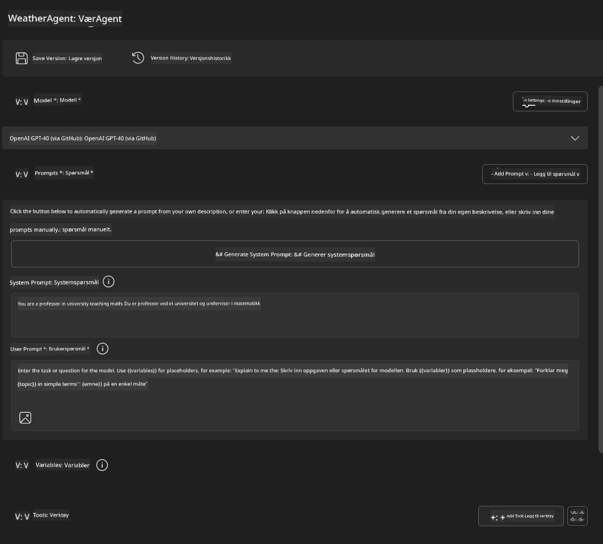
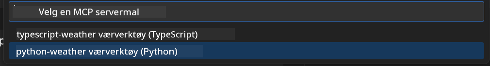
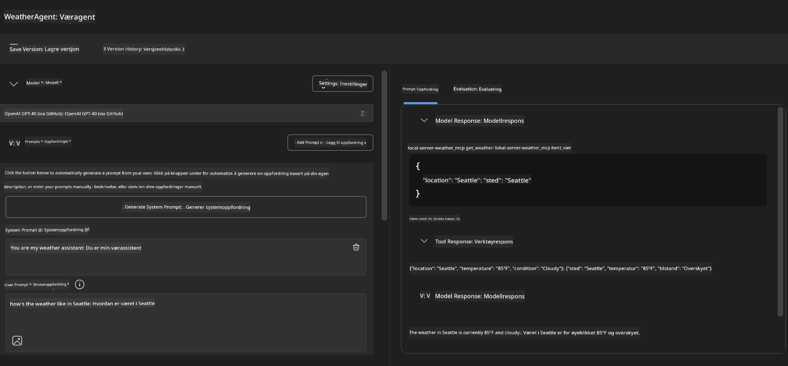
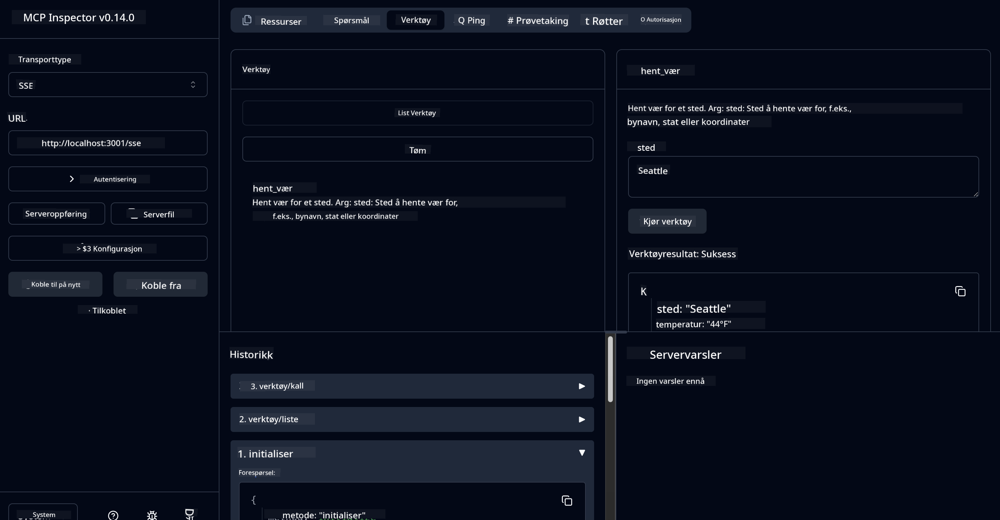

<!--
CO_OP_TRANSLATOR_METADATA:
{
  "original_hash": "dd8da3f75addcef453fe11f02a270217",
  "translation_date": "2025-07-14T08:15:17+00:00",
  "source_file": "10-StreamliningAIWorkflowsBuildingAnMCPServerWithAIToolkit/lab3/README.md",
  "language_code": "no"
}
-->
# 🔧 Modul 3: Avansert MCP-utvikling med AI Toolkit


## 🎯 Læringsmål

Når du er ferdig med denne labben, vil du kunne:

- ✅ Lage tilpassede MCP-servere ved hjelp av AI Toolkit
- ✅ Konfigurere og bruke den nyeste MCP Python SDK (v1.9.3)
- ✅ Sette opp og bruke MCP Inspector for feilsøking
- ✅ Feilsøke MCP-servere i både Agent Builder og Inspector-miljøer
- ✅ Forstå avanserte arbeidsflyter for MCP-serverutvikling

## 📋 Forutsetninger

- Fullført Lab 2 (MCP Grunnleggende)
- VS Code med AI Toolkit-utvidelsen installert
- Python 3.10+ miljø
- Node.js og npm for oppsett av Inspector

## 🏗️ Hva du skal bygge

I denne labben skal du lage en **Weather MCP Server** som demonstrerer:
- Tilpasset MCP-serverimplementasjon
- Integrasjon med AI Toolkit Agent Builder
- Profesjonelle feilsøkingsarbeidsflyter
- Moderne MCP SDK-bruksmønstre

---

## 🔧 Oversikt over kjernekomponenter

### 🐍 MCP Python SDK  
Model Context Protocol Python SDK gir grunnlaget for å bygge tilpassede MCP-servere. Du vil bruke versjon 1.9.3 med forbedrede feilsøkingsmuligheter.

### 🔍 MCP Inspector  
Et kraftig feilsøkingsverktøy som tilbyr:  
- Sanntidsovervåking av server  
- Visualisering av verktøykjøring  
- Inspeksjon av nettverksforespørsler/-svar  
- Interaktivt testmiljø  

---

## 📖 Trinnvis implementering

### Trinn 1: Opprett en WeatherAgent i Agent Builder

1. **Start Agent Builder** i VS Code via AI Toolkit-utvidelsen  
2. **Opprett en ny agent** med følgende konfigurasjon:  
   - Agentnavn: `WeatherAgent`



### Trinn 2: Initialiser MCP Server-prosjekt

1. **Gå til Tools** → **Add Tool** i Agent Builder  
2. **Velg "MCP Server"** fra tilgjengelige alternativer  
3. **Velg "Create A new MCP Server"**  
4. **Velg malen `python-weather`**  
5. **Gi serveren navnet:** `weather_mcp`



### Trinn 3: Åpne og undersøk prosjektet

1. **Åpne det genererte prosjektet** i VS Code  
2. **Gå gjennom prosjektstrukturen:**  
   ```
   weather_mcp/
   ├── src/
   │   ├── __init__.py
   │   └── server.py
   ├── inspector/
   │   ├── package.json
   │   └── package-lock.json
   ├── .vscode/
   │   ├── launch.json
   │   └── tasks.json
   ├── pyproject.toml
   └── README.md
   ```

### Trinn 4: Oppgrader til nyeste MCP SDK

> **🔍 Hvorfor oppgradere?** Vi ønsker å bruke den nyeste MCP SDK (v1.9.3) og Inspector-tjenesten (0.14.0) for forbedrede funksjoner og bedre feilsøking.

#### 4a. Oppdater Python-avhengigheter

**Rediger `pyproject.toml`:** oppdater [./code/weather_mcp/pyproject.toml](../../../../10-StreamliningAIWorkflowsBuildingAnMCPServerWithAIToolkit/lab3/code/weather_mcp/pyproject.toml)

#### 4b. Oppdater Inspector-konfigurasjon

**Rediger `inspector/package.json`:** oppdater [./code/weather_mcp/inspector/package.json](../../../../10-StreamliningAIWorkflowsBuildingAnMCPServerWithAIToolkit/lab3/code/weather_mcp/inspector/package.json)

#### 4c. Oppdater Inspector-avhengigheter

**Rediger `inspector/package-lock.json`:** oppdater [./code/weather_mcp/inspector/package-lock.json](../../../../10-StreamliningAIWorkflowsBuildingAnMCPServerWithAIToolkit/lab3/code/weather_mcp/inspector/package-lock.json)

> **📝 Merk:** Denne filen inneholder omfattende avhengighetsdefinisjoner. Nedenfor vises den essensielle strukturen – fullstendig innhold sikrer korrekt avhengighetsløsning.

> **⚡ Full Package Lock:** Den komplette package-lock.json inneholder ca. 3000 linjer med avhengighetsdefinisjoner. Ovenfor vises nøkkelstrukturen – bruk den medfølgende filen for fullstendig avhengighetsløsning.

### Trinn 5: Konfigurer VS Code for feilsøking

*Merk: Vennligst kopier filen i angitt sti for å erstatte tilsvarende lokal fil*

#### 5a. Oppdater lanseringskonfigurasjon

**Rediger `.vscode/launch.json`:**

```json
{
  "version": "0.2.0",
  "configurations": [
    {
      "name": "Attach to Local MCP",
      "type": "debugpy",
      "request": "attach",
      "connect": {
        "host": "localhost",
        "port": 5678
      },
      "presentation": {
        "hidden": true
      },
      "internalConsoleOptions": "neverOpen",
      "postDebugTask": "Terminate All Tasks"
    },
    {
      "name": "Launch Inspector (Edge)",
      "type": "msedge",
      "request": "launch",
      "url": "http://localhost:6274?timeout=60000&serverUrl=http://localhost:3001/sse#tools",
      "cascadeTerminateToConfigurations": [
        "Attach to Local MCP"
      ],
      "presentation": {
        "hidden": true
      },
      "internalConsoleOptions": "neverOpen"
    },
    {
      "name": "Launch Inspector (Chrome)",
      "type": "chrome",
      "request": "launch",
      "url": "http://localhost:6274?timeout=60000&serverUrl=http://localhost:3001/sse#tools",
      "cascadeTerminateToConfigurations": [
        "Attach to Local MCP"
      ],
      "presentation": {
        "hidden": true
      },
      "internalConsoleOptions": "neverOpen"
    }
  ],
  "compounds": [
    {
      "name": "Debug in Agent Builder",
      "configurations": [
        "Attach to Local MCP"
      ],
      "preLaunchTask": "Open Agent Builder",
    },
    {
      "name": "Debug in Inspector (Edge)",
      "configurations": [
        "Launch Inspector (Edge)",
        "Attach to Local MCP"
      ],
      "preLaunchTask": "Start MCP Inspector",
      "stopAll": true
    },
    {
      "name": "Debug in Inspector (Chrome)",
      "configurations": [
        "Launch Inspector (Chrome)",
        "Attach to Local MCP"
      ],
      "preLaunchTask": "Start MCP Inspector",
      "stopAll": true
    }
  ]
}
```

**Rediger `.vscode/tasks.json`:**

```
{
  "version": "2.0.0",
  "tasks": [
    {
      "label": "Start MCP Server",
      "type": "shell",
      "command": "python -m debugpy --listen 127.0.0.1:5678 src/__init__.py sse",
      "isBackground": true,
      "options": {
        "cwd": "${workspaceFolder}",
        "env": {
          "PORT": "3001"
        }
      },
      "problemMatcher": {
        "pattern": [
          {
            "regexp": "^.*$",
            "file": 0,
            "location": 1,
            "message": 2
          }
        ],
        "background": {
          "activeOnStart": true,
          "beginsPattern": ".*",
          "endsPattern": "Application startup complete|running"
        }
      }
    },
    {
      "label": "Start MCP Inspector",
      "type": "shell",
      "command": "npm run dev:inspector",
      "isBackground": true,
      "options": {
        "cwd": "${workspaceFolder}/inspector",
        "env": {
          "CLIENT_PORT": "6274",
          "SERVER_PORT": "6277",
        }
      },
      "problemMatcher": {
        "pattern": [
          {
            "regexp": "^.*$",
            "file": 0,
            "location": 1,
            "message": 2
          }
        ],
        "background": {
          "activeOnStart": true,
          "beginsPattern": "Starting MCP inspector",
          "endsPattern": "Proxy server listening on port"
        }
      },
      "dependsOn": [
        "Start MCP Server"
      ]
    },
    {
      "label": "Open Agent Builder",
      "type": "shell",
      "command": "echo ${input:openAgentBuilder}",
      "presentation": {
        "reveal": "never"
      },
      "dependsOn": [
        "Start MCP Server"
      ],
    },
    {
      "label": "Terminate All Tasks",
      "command": "echo ${input:terminate}",
      "type": "shell",
      "problemMatcher": []
    }
  ],
  "inputs": [
    {
      "id": "openAgentBuilder",
      "type": "command",
      "command": "ai-mlstudio.agentBuilder",
      "args": {
        "initialMCPs": [ "local-server-weather_mcp" ],
        "triggeredFrom": "vsc-tasks"
      }
    },
    {
      "id": "terminate",
      "type": "command",
      "command": "workbench.action.tasks.terminate",
      "args": "terminateAll"
    }
  ]
}
```

---

## 🚀 Kjøre og teste MCP-serveren din

### Trinn 6: Installer avhengigheter

Etter å ha gjort konfigurasjonsendringene, kjør følgende kommandoer:

**Installer Python-avhengigheter:**  
```bash
uv sync
```

**Installer Inspector-avhengigheter:**  
```bash
cd inspector
npm install
```

### Trinn 7: Feilsøk med Agent Builder

1. **Trykk F5** eller bruk konfigurasjonen **"Debug in Agent Builder"**  
2. **Velg den sammensatte konfigurasjonen** i feilsøkingspanelet  
3. **Vent på at serveren starter** og Agent Builder åpnes  
4. **Test din weather MCP-server** med naturlige språkspørsmål

Skriv inn prompt som dette

SYSTEM_PROMPT

```
You are my weather assistant
```

USER_PROMPT

```
How's the weather like in Seattle
```



### Trinn 8: Feilsøk med MCP Inspector

1. **Bruk konfigurasjonen "Debug in Inspector"** (Edge eller Chrome)  
2. **Åpne Inspector-grensesnittet** på `http://localhost:6274`  
3. **Utforsk det interaktive testmiljøet:**  
   - Se tilgjengelige verktøy  
   - Test verktøykjøring  
   - Overvåk nettverksforespørsler  
   - Feilsøk serverresponser  



---

## 🎯 Viktige læringsresultater

Ved å fullføre denne labben har du:

- [x] **Opprettet en tilpasset MCP-server** ved hjelp av AI Toolkit-maler  
- [x] **Oppgradert til nyeste MCP SDK** (v1.9.3) for forbedret funksjonalitet  
- [x] **Konfigurert profesjonelle feilsøkingsarbeidsflyter** for både Agent Builder og Inspector  
- [x] **Satt opp MCP Inspector** for interaktiv servertesting  
- [x] **Behersket VS Code feilsøkingskonfigurasjoner** for MCP-utvikling  

## 🔧 Avanserte funksjoner utforsket

| Funksjon                  | Beskrivelse                  | Bruksområde                 |
|---------------------------|-----------------------------|-----------------------------|
| **MCP Python SDK v1.9.3** | Nyeste protokollimplementasjon | Moderne serverutvikling      |
| **MCP Inspector 0.14.0**  | Interaktivt feilsøkingsverktøy | Sanntidstesting av server   |
| **VS Code Debugging**     | Integrert utviklingsmiljø    | Profesjonell feilsøkingsflyt |
| **Agent Builder Integration** | Direkte AI Toolkit-tilkobling | Helhetlig agenttesting       |

## 📚 Ekstra ressurser

- [MCP Python SDK Dokumentasjon](https://modelcontextprotocol.io/docs/sdk/python)  
- [AI Toolkit Utvidelsesguide](https://code.visualstudio.com/docs/ai/ai-toolkit)  
- [VS Code Feilsøkingsdokumentasjon](https://code.visualstudio.com/docs/editor/debugging)  
- [Model Context Protocol Spesifikasjon](https://modelcontextprotocol.io/docs/concepts/architecture)  

---

**🎉 Gratulerer!** Du har nå fullført Lab 3 og kan lage, feilsøke og distribuere tilpassede MCP-servere med profesjonelle utviklingsarbeidsflyter.

### 🔜 Fortsett til neste modul

Klar til å bruke MCP-ferdighetene dine i en ekte utviklingsarbeidsflyt? Fortsett til **[Modul 4: Praktisk MCP-utvikling - Tilpasset GitHub Clone Server](../lab4/README.md)** hvor du vil:  
- Bygge en produksjonsklar MCP-server som automatiserer GitHub-repositorieoperasjoner  
- Implementere GitHub-repositorie-kloning via MCP  
- Integrere tilpassede MCP-servere med VS Code og GitHub Copilot Agent Mode  
- Teste og distribuere tilpassede MCP-servere i produksjonsmiljøer  
- Lære praktisk arbeidsflytautomatisering for utviklere

**Ansvarsfraskrivelse**:  
Dette dokumentet er oversatt ved hjelp av AI-oversettelsestjenesten [Co-op Translator](https://github.com/Azure/co-op-translator). Selv om vi streber etter nøyaktighet, vennligst vær oppmerksom på at automatiske oversettelser kan inneholde feil eller unøyaktigheter. Det opprinnelige dokumentet på originalspråket skal anses som den autoritative kilden. For kritisk informasjon anbefales profesjonell menneskelig oversettelse. Vi er ikke ansvarlige for eventuelle misforståelser eller feiltolkninger som oppstår ved bruk av denne oversettelsen.