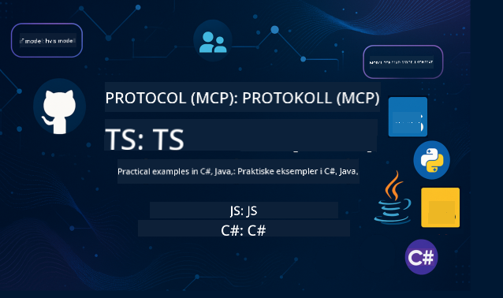

<!--
CO_OP_TRANSLATOR_METADATA:
{
  "original_hash": "db69f754d127d295e6449e29c08ed5c8",
  "translation_date": "2025-09-15T20:35:47+00:00",
  "source_file": "README.md",
  "language_code": "no"
}
-->
 

Følg disse stegene for å komme i gang med ressursene:
1. **Fork repositoryen**: Klikk 
2. **Klon repositoryen**:   `git clone https://github.com/microsoft/mcp-for-beginners.git`
3. [**Bli med på Azure AI Foundry Discord og møt eksperter og andre utviklere**](https://discord.com/invite/ByRwuEEgH4)

### 🌐 Støtte for flere språk

#### Støttet via GitHub Action (Automatisk og alltid oppdatert)

 [Arabic](../ar/README.md) | [Bengali](../bn/README.md) | [Bulgarian](../bg/README.md) | [Burmese (Myanmar)](../my/README.md) | [Chinese (Simplified)](../zh/README.md) | [Chinese (Traditional, Hong Kong)](../hk/README.md) | [Chinese (Traditional, Macau)](../mo/README.md) | [Chinese (Traditional, Taiwan)](../tw/README.md) | [Croatian](../hr/README.md) | [Czech](../cs/README.md) | [Danish](../da/README.md) | [Dutch](../nl/README.md) | [Finnish](../fi/README.md) | [French](../fr/README.md) | [German](../de/README.md) | [Greek](../el/README.md) | [Hebrew](../he/README.md) | [Hindi](../hi/README.md) | [Hungarian](../hu/README.md) | [Indonesian](../id/README.md) | [Italian](../it/README.md) | [Japanese](../ja/README.md) | [Korean](../ko/README.md) | [Malay](../ms/README.md) | [Marathi](../mr/README.md) | [Nepali](../ne/README.md) | [Norwegian](./README.md) | [Persian (Farsi)](../fa/README.md) | [Polish](../pl/README.md) | [Portuguese (Brazil)](../br/README.md) | [Portuguese (Portugal)](../pt/README.md) | [Punjabi (Gurmukhi)](../pa/README.md) | [Romanian](../ro/README.md) | [Russian](../ru/README.md) | [Serbian (Cyrillic)](../sr/README.md) | [Slovak](../sk/README.md) | [Slovenian](../sl/README.md) | [Spanish](../es/README.md) | [Swahili](../sw/README.md) | [Swedish](../sv/README.md) | [Tagalog (Filipino)](../tl/README.md) | [Thai](../th/README.md) | [Turkish](../tr/README.md) | [Ukrainian](../uk/README.md) | [Urdu](../ur/README.md) | [Vietnamese](../vi/README.md)

# 🚀 Model Context Protocol (MCP) Læremateriell for Nybegynnere

## **Lær MCP med praktiske kodeeksempler i C#, Java, JavaScript, Rust, Python og TypeScript**

## 🧠 Oversikt over Model Context Protocol Læremateriell

**Model Context Protocol (MCP)** er et banebrytende rammeverk designet for å standardisere interaksjoner mellom AI-modeller og klientapplikasjoner. Dette open-source læremateriellet tilbyr en strukturert læringsvei, komplett med praktiske kodeeksempler og virkelige brukstilfeller, på populære programmeringsspråk som C#, Java, JavaScript, TypeScript og Python.

Enten du er AI-utvikler, systemarkitekt eller programvareingeniør, er denne guiden din omfattende ressurs for å mestre MCP-grunnleggende og implementeringsstrategier.

## 🔗 Offisielle MCP-ressurser

- 📘 [MCP Dokumentasjon](https://modelcontextprotocol.io/) – Detaljerte opplæringer og brukerveiledninger  
- 📜 [MCP Spesifikasjon](https://modelcontextprotocol.io/docs/) – Protokollarkitektur og tekniske referanser  
- 📜 [Original MCP Spesifikasjon](https://spec.modelcontextprotocol.io/) – Legacy tekniske referanser (kan inneholde ekstra detaljer)  
- 🧑‍💻 [MCP GitHub Repository](https://github.com/modelcontextprotocol) – Open-source SDK-er, verktøy og kodeeksempler
- 🌐 [MCP Community](https://github.com/orgs/modelcontextprotocol/discussions) – Delta i diskusjoner og bidra til fellesskapet

## 🧭 MCP Læremateriell Oversikt

### 📚 Komplett Struktur for Læremateriell

| Modul | Emne | Beskrivelse | Lenke |
|-------|------|-------------|-------|
| **Modul 1-3: Grunnleggende** | | | |
| 00 | Introduksjon til MCP | Oversikt over Model Context Protocol og dens betydning i AI-pipelines | [Les mer](./00-Introduction/README.md) |
| 01 | Forklaring av kjernebegreper | Dypdykk i MCPs kjernebegreper | [Les mer](./01-CoreConcepts/README.md) |
| 02 | Sikkerhet i MCP | Sikkerhetstrusler og beste praksis | [Les mer](./02-Security/README.md) |
| 03 | Komme i gang med MCP | Oppsett av miljø, grunnleggende servere/klienter, integrasjon | [Les mer](./03-GettingStarted/README.md) |
| **Modul 3: Bygg din første server og klient** | | | |
| 3.1 | Første server | Lag din første MCP-server | [Guide](./03-GettingStarted/01-first-server/README.md) |
| 3.2 | Første klient | Utvikle en grunnleggende MCP-klient | [Guide](./03-GettingStarted/02-client/README.md) |
| 3.3 | Klient med LLM | Integrer store språkmodeller | [Guide](./03-GettingStarted/03-llm-client/README.md) |
| 3.4 | VS Code-integrasjon | Bruk MCP-servere i VS Code | [Guide](./03-GettingStarted/04-vscode/README.md) |
| 3.5 | stdio Server | Lag servere med stdio transport | [Guide](./03-GettingStarted/05-stdio-server/README.md) |
| 3.6 | HTTP Streaming | Implementer HTTP streaming i MCP | [Guide](./03-GettingStarted/06-http-streaming/README.md) |
| 3.7 | AI Toolkit | Bruk AI Toolkit med MCP | [Guide](./03-GettingStarted/07-aitk/README.md) |
| 3.8 | Testing | Test din MCP-serverimplementering | [Guide](./03-GettingStarted/08-testing/README.md) |
| 3.9 | Utrulling | Rull ut MCP-servere til produksjon | [Guide](./03-GettingStarted/09-deployment/README.md) |
| **Modul 4-5: Praktisk og Avansert** | | | |
| 04 | Praktisk implementering | SDK-er, debugging, testing, gjenbrukbare prompt-maler | [Les mer](./04-PracticalImplementation/README.md) |
| 05 | Avanserte emner i MCP | Multi-modal AI, skalering, bruk i bedrifter | [Les mer](./05-AdvancedTopics/README.md) |
| 5.1 | Azure-integrasjon | MCP-integrasjon med Azure | [Guide](./05-AdvancedTopics/mcp-integration/README.md) |
| 5.2 | Multi-modalitet | Arbeid med flere modaliteter | [Guide](./05-AdvancedTopics/mcp-multi-modality/README.md) |
| 5.3 | OAuth2 Demo | Implementer OAuth2-autentisering | [Guide](./05-AdvancedTopics/mcp-oauth2-demo/README.md) |
| 5.4 | Root Contexts | Forstå og implementer root contexts | [Guide](./05-AdvancedTopics/mcp-root-contexts/README.md) |
| 5.5 | Routing | MCP-routingstrategier | [Guide](./05-AdvancedTopics/mcp-routing/README.md) |
| 5.6 | Sampling | Sampling-teknikker i MCP | [Guide](./05-AdvancedTopics/mcp-sampling/README.md) |
| 5.7 | Skalering | Skalere MCP-implementeringer | [Guide](./05-AdvancedTopics/mcp-scaling/README.md) |
| 5.8 | Sikkerhet | Avanserte sikkerhetsvurderinger | [Guide](./05-AdvancedTopics/mcp-security/README.md) |
| 5.9 | Websøk | Implementer websøk-funksjonalitet | [Guide](./05-AdvancedTopics/web-search-mcp/README.md) |
| 5.10 | Sanntidsstreaming | Bygg sanntidsstreaming-funksjonalitet | [Guide](./05-AdvancedTopics/mcp-realtimestreaming/README.md) |
| 5.11 | Sanntidssøk | Implementer sanntidssøk | [Guide](./05-AdvancedTopics/mcp-realtimesearch/README.md) |
| 5.12 | Entra ID Auth | Autentisering med Microsoft Entra ID | [Guide](./05-AdvancedTopics/mcp-security-entra/README.md) |
| 5.13 | Foundry-integrasjon | Integrer med Azure AI Foundry | [Guide](./05-AdvancedTopics/mcp-foundry-agent-integration/README.md) |
| 5.14 | Context Engineering | Teknikker for effektiv context engineering | [Guide](./05-AdvancedTopics/mcp-contextengineering/README.md) |
| 5.15 | MCP Custom Transport | Tilpassede transportimplementeringer | [Guide](./05-AdvancedTopics/mcp-transport/README.md) |

| **Modul 6-10: Fellesskap og Beste Praksis** | | | |
| 06 | Bidrag fra fellesskapet | Hvordan bidra til MCP-økosystemet | [Guide](./06-CommunityContributions/README.md) |
| 07 | Innsikt fra tidlig adopsjon | Virkelige implementeringshistorier | [Guide](./07-LessonsFromEarlyAdoption/README.md) |
| 08 | Beste praksis for MCP | Ytelse, feiltoleranse, robusthet | [Guide](./08-BestPractices/README.md) |
| 09 | MCP Case Studies | Praktiske implementeringseksempler | [Guide](./09-CaseStudy/README.md) |
| 10 | Praktisk workshop | Bygg en MCP-server med AI Toolkit | [Lab](./10-StreamliningAIWorkflowsBuildingAnMCPServerWithAIToolkit/README.md) |

### 💻 Eksempelprosjekter

#### Grunnleggende MCP Kalkulator Eksempler

| Språk | Beskrivelse | Lenke |
|-------|-------------|-------|
| C# | MCP Server Eksempel | [Se kode](./03-GettingStarted/samples/csharp/README.md) |
| Java | MCP Kalkulator | [Se kode](./03-GettingStarted/samples/java/calculator/README.md) |
| JavaScript | MCP Demo | [Se kode](./03-GettingStarted/samples/javascript/README.md) |
| Python | MCP Server | [Se kode](../../03-GettingStarted/samples/python/mcp_calculator_server.py) |
| TypeScript | MCP Eksempel | [Se kode](./03-GettingStarted/samples/typescript/README.md) |
| Rust | MCP Eksempel | [Se kode](./03-GettingStarted/samples/rust/README.md) |
#### Avanserte MCP-implementasjoner

| Språk | Beskrivelse | Lenke |
|-------|-------------|-------|
| C# | Avansert eksempel | [View Code](./04-PracticalImplementation/samples/csharp/README.md) |
| Java med Spring | Eksempel på container-app | [View Code](./04-PracticalImplementation/samples/java/containerapp/README.md) |
| JavaScript | Avansert eksempel | [View Code](./04-PracticalImplementation/samples/javascript/README.md) |
| Python | Kompleks implementasjon | [View Code](../../04-PracticalImplementation/samples/python/READMEmd) |
| TypeScript | Eksempel på container | [View Code](./04-PracticalImplementation/samples/typescript/README.md) |

## 🎯 Forutsetninger for å lære MCP

For å få mest mulig ut av dette kurset bør du ha:

- Grunnleggende kunnskap om programmering i minst ett av følgende språk: C#, Java, JavaScript, Python eller TypeScript
- Forståelse av klient-server-modellen og API-er
- Kjennskap til REST og HTTP-konsepter
- (Valgfritt) Bakgrunn i AI/ML-konsepter

- Delta i våre diskusjoner i fellesskapet for støtte

## 📚 Studieveiledning og ressurser

Dette repositoriet inneholder flere ressurser som hjelper deg med å navigere og lære effektivt:

### Studieveiledning

En omfattende [Studieveiledning](./study_guide.md) er tilgjengelig for å hjelpe deg med å navigere i dette repositoriet. Veiledningen inkluderer:

- Et visuelt kart over pensum som viser alle dekkede emner
- Detaljert oversikt over hver seksjon i repositoriet
- Veiledning om hvordan du bruker eksempelprosjekter
- Anbefalte læringsveier for ulike ferdighetsnivåer
- Ekstra ressurser for å supplere læringsreisen din

### Endringslogg

Vi opprettholder en detaljert [Endringslogg](./changelog.md) som sporer alle betydelige oppdateringer av kursmaterialet, inkludert:

- Nye innholdstillegg
- Strukturelle endringer
- Funksjonsforbedringer
- Dokumentasjonsoppdateringer

## 🛠️ Hvordan bruke dette kurset effektivt

Hver leksjon i denne veiledningen inkluderer:

1. Klare forklaringer av MCP-konsepter  
2. Live kodeeksempler i flere språk  
3. Øvelser for å bygge ekte MCP-applikasjoner  
4. Ekstra ressurser for avanserte elever

## Arrangementer 

### [MCP Dev Days juli 2025](https://developer.microsoft.com/en-us/reactor/series/S-1563/)
#### [➡️Se på forespørsel - MCP Dev Days](https://developer.microsoft.com/en-us/reactor/series/S-1563/)
Gjør deg klar for to dager med dyp teknisk innsikt, fellesskapstilknytning og praktisk læring på MCP Dev Days, et virtuelt arrangement dedikert til Model Context Protocol (MCP) — den fremvoksende standarden som kobler AI-modeller og verktøyene de er avhengige av.
Du kan se MCP Dev Days ved å registrere deg på vår arrangementsside: https://aka.ms/mcpdevdays. 

#### [Dag 1: MCP Produktivitet, utviklerverktøy og fellesskap:](https://developer.microsoft.com/en-us/reactor/series/S-1563/)

Handler om å gi utviklere mulighet til å bruke MCP i sin utviklerarbeidsflyt og feire det fantastiske MCP-fellesskapet. Vi vil bli med fellesskapsmedlemmer og partnere som Arcade, Block, Okta og Neon for å se hvordan de samarbeider med Microsoft for å forme et åpent, utvidbart MCP-økosystem. 
Reelle demoer på tvers av VS Code, Visual Studio, GitHub Copilot og populære fellesskapsverktøy
Praktiske, kontekstbaserte utviklerarbeidsflyter
Fellesskapsledede sesjoner og innsikt
Enten du nettopp har begynt med MCP eller allerede bygger med det, vil dag 1 sette scenen med inspirasjon og handlingsrettede tips.

#### [Dag 2: Bygg MCP-servere med selvtillit](https://developer.microsoft.com/en-us/reactor/series/S-1563/)

Er for MCP-utviklere. Vi vil gå dypt inn i implementeringsstrategier og beste praksis for å lage MCP-servere og integrere MCP i AI-arbeidsflyter.

#### Emner inkluderer:

- Bygge MCP-servere og integrere dem i agentopplevelser
- Prompt-drevet utvikling
- Beste praksis for sikkerhet
- Bruke byggeklosser som Functions, ACA og API Management
- Justering av register og verktøy (1P + 3P)

Hvis du er utvikler, verktøybygger eller AI-produktstrateg, er denne dagen fullpakket med innsikt du trenger for å bygge skalerbare, sikre og fremtidsklare MCP-løsninger.

### MCP Boot Camp august 2025
Lær gjennom intensive videosesjoner hvordan du lager MCP-servere, integrerer med VS Code og distribuerer profesjonelt på Azure basert på innhold fra MCP for nybegynnere-kurset. Gå bort med praktiske ferdigheter i en teknologi som store selskaper allerede bruker.

#### [➡️Se på forespørsel MCP Bootcamp | Engelsk](https://developer.microsoft.com/en-us/reactor/series/s-1568/)
#### [➡️Se på forespørsel MCP Bootcamp | Brasil](https://developer.microsoft.com/en-us/reactor/series/S-1566/)
#### [➡️Se på forespørsel MCP Bootcamp | Spansk](https://developer.microsoft.com/en-us/reactor/series/S-1567/)

### La oss lære MCP med C# - Tutorial-serie
La oss lære om Model Context Protocol (MCP), et banebrytende rammeverk designet for å standardisere interaksjoner mellom AI-modeller og klientapplikasjoner. Gjennom denne nybegynnervennlige sesjonen vil vi introdusere deg for MCP og veilede deg gjennom å lage din første MCP-server.
#### C#: [https://aka.ms/letslearnmcp-csharp](https://aka.ms/letslearnmcp-csharp)
#### Java: [https://aka.ms/letslearnmcp-java](https://aka.ms/letslearnmcp-java)
#### JavaScript: [https://aka.ms/letslearnmcp-javascript](https://aka.ms/letslearnmcp-javascript)
#### Python: [https://aka.ms/letslearnmcp-python](https://aka.ms/letslearnmcp-python)

## 🌟 Takk til fellesskapet

Takk til Microsoft Valued Professional [Shivam Goyal](https://www.linkedin.com/in/shivam2003/) for å ha bidratt med viktige kodeeksempler. 

## 📜 Lisensinformasjon

Dette innholdet er lisensiert under **MIT-lisensen**. For vilkår og betingelser, se [LICENSE](../../LICENSE).

## 🤝 Retningslinjer for bidrag

Dette prosjektet ønsker bidrag og forslag velkommen. De fleste bidrag krever at du godtar en
Contributor License Agreement (CLA) som erklærer at du har rett til, og faktisk gir oss,
rettighetene til å bruke ditt bidrag. For detaljer, besøk 
<https://cla.opensource.microsoft.com>.

Når du sender inn en pull request, vil en CLA-bot automatisk avgjøre om du trenger å gi
en CLA og dekorere PR-en deretter (f.eks. statuskontroll, kommentar). Følg bare instruksjonene
gitt av boten. Du trenger bare å gjøre dette én gang på tvers av alle repositorier som bruker vår CLA.

Dette prosjektet har vedtatt [Microsoft Open Source Code of Conduct](https://opensource.microsoft.com/codeofconduct/).
For mer informasjon, se [Code of Conduct FAQ](https://opensource.microsoft.com/codeofconduct/faq/) eller
kontakt [opencode@microsoft.com](mailto:opencode@microsoft.com) med eventuelle spørsmål eller kommentarer.

## 📂 Repositoriets struktur

Repositoriet er organisert som følger:

- **Kjernepensum (00-10)**: Hovedinnholdet organisert i ti sekvensielle moduler
- **images/**: Diagrammer og illustrasjoner brukt gjennom pensum
- **translations/**: Flerspråklig støtte med automatiserte oversettelser
- **translated_images/**: Lokaliserte versjoner av diagrammer og illustrasjoner
- **study_guide.md**: Omfattende veiledning for å navigere i repositoriet
- **changelog.md**: Oversikt over alle betydelige endringer i kursmaterialet
- **mcp.json**: Konfigurasjonsfil for MCP-spesifikasjon
- **CODE_OF_CONDUCT.md, LICENSE, SECURITY.md, SUPPORT.md**: Dokumenter for prosjektstyring

## 🎒 Andre kurs
Vårt team produserer andre kurs! Sjekk ut:

- [AI Agents For Beginners](https://github.com/microsoft/ai-agents-for-beginners?WT.mc_id=academic-105485-koreyst)
- [Generative AI for Beginners using .NET](https://github.com/microsoft/Generative-AI-for-beginners-dotnet?WT.mc_id=academic-105485-koreyst)
- [Generative AI for Beginners using JavaScript](https://github.com/microsoft/generative-ai-with-javascript?WT.mc_id=academic-105485-koreyst)
- [Generative AI for Beginners](https://github.com/microsoft/generative-ai-for-beginners?WT.mc_id=academic-105485-koreyst)
- [Generative AI for Beginners using Java](https://github.com/microsoft/generative-ai-for-beginners-java?WT.mc_id=academic-105485-koreyst)
- [ML for Beginners](https://aka.ms/ml-beginners?WT.mc_id=academic-105485-koreyst)
- [Data Science for Beginners](https://aka.ms/datascience-beginners?WT.mc_id=academic-105485-koreyst)
- [AI for Beginners](https://aka.ms/ai-beginners?WT.mc_id=academic-105485-koreyst)
- [Cybersecurity for Beginners](https://github.com/microsoft/Security-101?WT.mc_id=academic-96948-sayoung)
- [Web Dev for Beginners](https://aka.ms/webdev-beginners?WT.mc_id=academic-105485-koreyst)
- [IoT for Beginners](https://aka.ms/iot-beginners?WT.mc_id=academic-105485-koreyst)
- [XR Development for Beginners](https://github.com/microsoft/xr-development-for-beginners?WT.mc_id=academic-105485-koreyst)
- [Mastering GitHub Copilot for AI Paired Programming](https://aka.ms/GitHubCopilotAI?WT.mc_id=academic-105485-koreyst)
- [Mastering GitHub Copilot for C#/.NET Developers](https://github.com/microsoft/mastering-github-copilot-for-dotnet-csharp-developers?WT.mc_id=academic-105485-koreyst)
- [Choose Your Own Copilot Adventure](https://github.com/microsoft/CopilotAdventures?WT.mc_id=academic-105485-koreyst)

## ™️ Varemerkeinformasjon

Dette prosjektet kan inneholde varemerker eller logoer for prosjekter, produkter eller tjenester. Autorisert bruk av Microsoft
varemerker eller logoer er underlagt og må følge
[Microsofts retningslinjer for varemerker og merkevare](https://www.microsoft.com/legal/intellectualproperty/trademarks/usage/general).
Bruk av Microsofts varemerker eller logoer i modifiserte versjoner av dette prosjektet må ikke forårsake forvirring eller antyde Microsoft-sponsing.
Enhver bruk av tredjeparts varemerker eller logoer er underlagt disse tredjepartenes retningslinjer.

---

**Ansvarsfraskrivelse**:  
Dette dokumentet er oversatt ved hjelp av AI-oversettelsestjenesten [Co-op Translator](https://github.com/Azure/co-op-translator). Selv om vi streber etter nøyaktighet, vær oppmerksom på at automatiserte oversettelser kan inneholde feil eller unøyaktigheter. Det originale dokumentet på sitt opprinnelige språk bør anses som den autoritative kilden. For kritisk informasjon anbefales profesjonell menneskelig oversettelse. Vi er ikke ansvarlige for misforståelser eller feiltolkninger som oppstår ved bruk av denne oversettelsen.