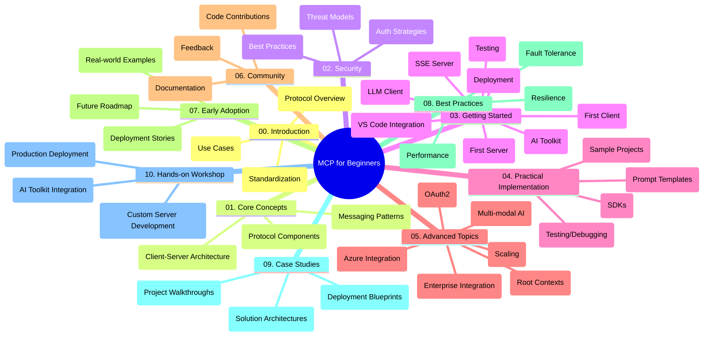

<!--
CO_OP_TRANSLATOR_METADATA:
{
  "original_hash": "a607d4febc94caee9a12b77795f7fc9a",
  "translation_date": "2025-06-11T16:45:46+00:00",
  "source_file": "study_guide.md",
  "language_code": "no"
}
-->
# Model Context Protocol (MCP) for Beginners - Studieveiledning

Denne studieveiledningen gir en oversikt over mappestrukturen og innholdet i "Model Context Protocol (MCP) for Beginners"-kurset. Bruk denne veiledningen for å navigere effektivt i repositoriet og få mest mulig ut av tilgjengelige ressurser.

## Oversikt over Repositoriet

Model Context Protocol (MCP) er et standardisert rammeverk for samhandling mellom AI-modeller og klientapplikasjoner. Dette repositoriet tilbyr et omfattende kurs med praktiske kodeeksempler i C#, Java, JavaScript, Python og TypeScript, designet for AI-utviklere, systemarkitekter og programvareingeniører.

## Visuell Kurskart

## Struktur i Repositoriet

Repositoriet er delt inn i ti hovedseksjoner, hver med fokus på ulike aspekter av MCP:

1. **Introduksjon (00-Introduction/)**
   - Oversikt over Model Context Protocol
   - Hvorfor standardisering er viktig i AI-pipelines
   - Praktiske bruksområder og fordeler

2. **Kjernebegreper (01-CoreConcepts/)**
   - Klient-server-arkitektur
   - Nøkkelkomponenter i protokollen
   - Meldingsmønstre i MCP

3. **Sikkerhet (02-Security/)**
   - Sikkerhetstrusler i MCP-baserte systemer
   - Beste praksis for sikre implementasjoner
   - Autentisering og autorisasjonsstrategier

4. **Kom i Gang (03-GettingStarted/)**
   - Oppsett av miljø og konfigurasjon
   - Lage grunnleggende MCP-servere og klienter
   - Integrasjon med eksisterende applikasjoner
   - Undersseksjoner for første server, første klient, LLM-klient, VS Code-integrasjon, SSE-server, AI Toolkit, testing og utrulling

5. **Praktisk Implementering (04-PracticalImplementation/)**
   - Bruk av SDK-er på ulike programmeringsspråk
   - Feilsøking, testing og valideringsteknikker
   - Lage gjenbrukbare prompt-maler og arbeidsflyter
   - Eksempelsprosjekter med implementasjonsdemonstrasjoner

6. **Avanserte Emner (05-AdvancedTopics/)**
   - Multimodale AI-arbeidsflyter og utvidbarhet
   - Sikker skalering
   - MCP i bedriftsøkosystemer
   - Spesialiserte temaer som Azure-integrasjon, multimodalitet, OAuth2, rotkontekster, ruting, sampling, skalering, sikkerhet, websøkintegrasjon og streaming.

7. **Fellesskapsbidrag (06-CommunityContributions/)**
   - Hvordan bidra med kode og dokumentasjon
   - Samarbeid via GitHub
   - Fellesskapsdrevne forbedringer og tilbakemeldinger

8. **Lærdom fra Tidlig Adopsjon (07-LessonsfromEarlyAdoption/)**
   - Virkelige implementasjoner og suksesshistorier
   - Bygging og utrulling av MCP-baserte løsninger
   - Trender og fremtidig veikart

9. **Beste Praksis (08-BestPractices/)**
   - Ytelsesoptimalisering
   - Design av feilresistente MCP-systemer
   - Testing og robusthetsstrategier

10. **Case Studier (09-CaseStudy/)**
    - Dyptgående analyser av MCP-løsningsarkitekturer
    - Utrullingsplaner og integrasjonstips
    - Annoterte diagrammer og prosjektgjennomganger

11. **Hands-on Workshop (10-StreamliningAIWorkflowsBuildingAnMCPServerWithAIToolkit/)**
    - Omfattende praktisk workshop som kombinerer MCP med Microsofts AI Toolkit for VS Code
    - Bygge intelligente applikasjoner som kobler AI-modeller med virkelige verktøy
    - Praktiske moduler som dekker grunnleggende, tilpasset serverutvikling og produksjonsutrulling

## Eksempelsprosjekter

Repositoriet inneholder flere eksempelsprosjekter som viser MCP-implementasjon i ulike programmeringsspråk:

### Grunnleggende MCP Kalkulator Eksempler
- C# MCP Server Eksempel
- Java MCP Kalkulator
- JavaScript MCP Demo
- Python MCP Server
- TypeScript MCP Eksempel

### Avanserte MCP Kalkulator Prosjekter
- Avansert C# Eksempel
- Java Container App Eksempel
- JavaScript Avansert Eksempel
- Python Kompleks Implementasjon
- TypeScript Container Eksempel

## Tilleggsressurser

Repositoriet inneholder støtteressurser:

- **Images-mappen**: Inneholder diagrammer og illustrasjoner brukt i kurset
- **Oversettelser**: Flerspråklig støtte med automatiske oversettelser av dokumentasjon
- **Offisielle MCP Ressurser**:
  - [MCP Documentation](https://modelcontextprotocol.io/)
  - [MCP Specification](https://spec.modelcontextprotocol.io/)
  - [MCP GitHub Repository](https://github.com/modelcontextprotocol)

## Hvordan Bruke Dette Repositoriet

1. **Sekvensiell Læring**: Følg kapitlene i rekkefølge (00 til 10) for en strukturert læringsopplevelse.
2. **Språkspesifikt Fokus**: Hvis du er interessert i et bestemt programmeringsspråk, utforsk eksempelkatalogene for implementasjoner på ønsket språk.
3. **Praktisk Implementering**: Start med "Kom i Gang"-seksjonen for å sette opp miljøet ditt og lage din første MCP-server og klient.
4. **Avansert Utforskning**: Når du er komfortabel med det grunnleggende, dykk ned i avanserte emner for å utvide kunnskapen.
5. **Fellesskapsengasjement**: Bli med i [Azure AI Foundry Discord](https://discord.com/invite/ByRwuEEgH4) for å knytte kontakt med eksperter og andre utviklere.

## Bidra

Dette repositoriet ønsker bidrag fra fellesskapet velkommen. Se seksjonen Fellesskapsbidrag for veiledning om hvordan du kan bidra.

---

*Denne studieveiledningen ble laget 11. juni 2025 og gir en oversikt over repositoriet per den datoen. Innholdet i repositoriet kan ha blitt oppdatert siden da.*

**Ansvarsfraskrivelse**:  
Dette dokumentet er oversatt ved hjelp av AI-oversettelsestjenesten [Co-op Translator](https://github.com/Azure/co-op-translator). Selv om vi streber etter nøyaktighet, vennligst vær oppmerksom på at automatiske oversettelser kan inneholde feil eller unøyaktigheter. Det opprinnelige dokumentet på originalspråket skal anses som den autoritative kilden. For kritisk informasjon anbefales profesjonell menneskelig oversettelse. Vi er ikke ansvarlige for eventuelle misforståelser eller feiltolkninger som oppstår ved bruk av denne oversettelsen.