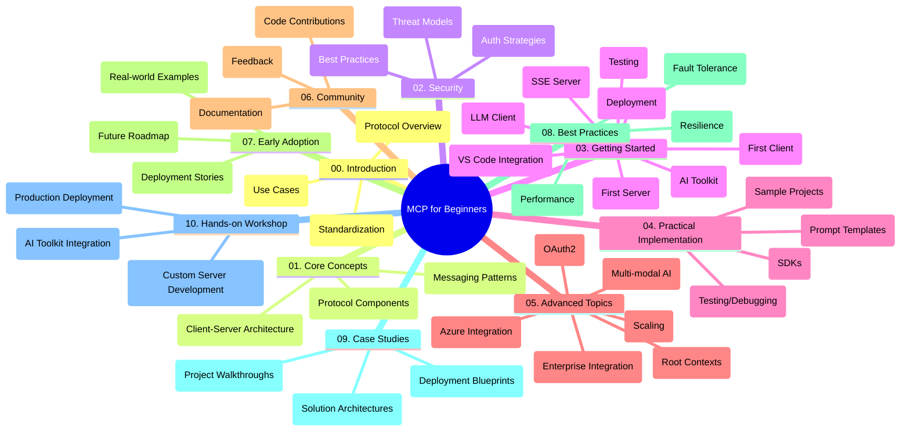

<!--
CO_OP_TRANSLATOR_METADATA:
{
  "original_hash": "a607d4febc94caee9a12b77795f7fc9a",
  "translation_date": "2025-07-13T15:15:28+00:00",
  "source_file": "study_guide.md",
  "language_code": "no"
}
-->
# Model Context Protocol (MCP) for nybegynnere - Studieveiledning

Denne studieveiledningen gir en oversikt over mappestrukturen og innholdet i "Model Context Protocol (MCP) for nybegynnere"-pensumet. Bruk denne veiledningen for å navigere i depotet effektivt og få mest mulig ut av de tilgjengelige ressursene.

## Oversikt over depotet

Model Context Protocol (MCP) er en standardisert ramme for samhandling mellom AI-modeller og klientapplikasjoner. Dette depotet tilbyr et omfattende pensum med praktiske kodeeksempler i C#, Java, JavaScript, Python og TypeScript, utviklet for AI-utviklere, systemarkitekter og programvareingeniører.

## Visuelt pensumkart

## Depotstruktur

Depotet er organisert i ti hovedseksjoner, hver med fokus på ulike aspekter av MCP:

1. **Introduksjon (00-Introduction/)**
   - Oversikt over Model Context Protocol
   - Hvorfor standardisering er viktig i AI-pipelines
   - Praktiske bruksområder og fordeler

2. **Kjernebegreper (01-CoreConcepts/)**
   - Klient-server-arkitektur
   - Viktige protokollkomponenter
   - Meldingsmønstre i MCP

3. **Sikkerhet (02-Security/)**
   - Sikkerhetstrusler i MCP-baserte systemer
   - Beste praksis for sikre implementasjoner
   - Autentisering og autorisasjonsstrategier

4. **Kom i gang (03-GettingStarted/)**
   - Oppsett og konfigurasjon av miljø
   - Lage grunnleggende MCP-servere og klienter
   - Integrasjon med eksisterende applikasjoner
   - Undersseksjoner for første server, første klient, LLM-klient, VS Code-integrasjon, SSE-server, AI Toolkit, testing og distribusjon

5. **Praktisk implementering (04-PracticalImplementation/)**
   - Bruke SDK-er på tvers av ulike programmeringsspråk
   - Feilsøking, testing og valideringsteknikker
   - Lage gjenbrukbare promptmaler og arbeidsflyter
   - Eksempelsprosjekter med implementasjonsdemonstrasjoner

6. **Avanserte emner (05-AdvancedTopics/)**
   - Multimodale AI-arbeidsflyter og utvidbarhet
   - Sikker skalering
   - MCP i bedriftsøkosystemer
   - Spesialiserte temaer som Azure-integrasjon, multimodalitet, OAuth2, root contexts, ruting, sampling, skalering, sikkerhet, websøkintegrasjon og streaming.

7. **Bidrag fra fellesskapet (06-CommunityContributions/)**
   - Hvordan bidra med kode og dokumentasjon
   - Samarbeid via GitHub
   - Fellesskapsdrevne forbedringer og tilbakemeldinger

8. **Lærdom fra tidlig adopsjon (07-LessonsfromEarlyAdoption/)**
   - Virkelige implementasjoner og suksesshistorier
   - Bygging og utrulling av MCP-baserte løsninger
   - Trender og fremtidig veikart

9. **Beste praksis (08-BestPractices/)**
   - Ytelsesoptimalisering og tuning
   - Design av feiltolerante MCP-systemer
   - Testing og robusthetsstrategier

10. **Case-studier (09-CaseStudy/)**
    - Grundige gjennomganger av MCP-løsningsarkitekturer
    - Distribusjonsplaner og integrasjonstips
    - Annoterte diagrammer og prosjektgjennomganger

11. **Praktisk workshop (10-StreamliningAIWorkflowsBuildingAnMCPServerWithAIToolkit/)**
    - Omfattende praktisk workshop som kombinerer MCP med Microsofts AI Toolkit for VS Code
    - Bygge intelligente applikasjoner som kobler AI-modeller med virkelige verktøy
    - Praktiske moduler som dekker grunnleggende, utvikling av egendefinert server og produksjonsutrulling

## Eksempelsprosjekter

Depotet inneholder flere eksempelsprosjekter som demonstrerer MCP-implementering på ulike programmeringsspråk:

### Enkle MCP-kalkulator-eksempler
- C# MCP-servereksempel
- Java MCP-kalkulator
- JavaScript MCP-demo
- Python MCP-server
- TypeScript MCP-eksempel

### Avanserte MCP-kalkulatorprosjekter
- Avansert C#-eksempel
- Java container-app-eksempel
- JavaScript avansert eksempel
- Python kompleks implementering
- TypeScript container-eksempel

## Tilleggsressurser

Depotet inkluderer støtteressurser:

- **Bilder-mappe**: Inneholder diagrammer og illustrasjoner brukt gjennom pensumet
- **Oversettelser**: Flerspråklig støtte med automatiserte oversettelser av dokumentasjon
- **Offisielle MCP-ressurser**:
  - [MCP Documentation](https://modelcontextprotocol.io/)
  - [MCP Specification](https://spec.modelcontextprotocol.io/)
  - [MCP GitHub Repository](https://github.com/modelcontextprotocol)

## Hvordan bruke dette depotet

1. **Sekvensiell læring**: Følg kapitlene i rekkefølge (00 til 10) for en strukturert læringsopplevelse.
2. **Språkspesifikt fokus**: Hvis du er interessert i et bestemt programmeringsspråk, utforsk mappene med eksempler for implementasjoner i ditt foretrukne språk.
3. **Praktisk implementering**: Start med "Kom i gang"-seksjonen for å sette opp miljøet ditt og lage din første MCP-server og klient.
4. **Avansert utforskning**: Når du er komfortabel med det grunnleggende, kan du dykke ned i avanserte emner for å utvide kunnskapen din.
5. **Fellesskapsengasjement**: Bli med i [Azure AI Foundry Discord](https://discord.com/invite/ByRwuEEgH4) for å knytte kontakt med eksperter og andre utviklere.

## Bidra

Dette depotet ønsker bidrag fra fellesskapet velkommen. Se seksjonen Bidrag fra fellesskapet for veiledning om hvordan du kan bidra.

---

*Denne studieveiledningen ble laget 11. juni 2025, og gir en oversikt over depotet per den datoen. Innholdet i depotet kan ha blitt oppdatert siden da.*

**Ansvarsfraskrivelse**:  
Dette dokumentet er oversatt ved hjelp av AI-oversettelsestjenesten [Co-op Translator](https://github.com/Azure/co-op-translator). Selv om vi streber etter nøyaktighet, vennligst vær oppmerksom på at automatiske oversettelser kan inneholde feil eller unøyaktigheter. Det opprinnelige dokumentet på originalspråket skal anses som den autoritative kilden. For kritisk informasjon anbefales profesjonell menneskelig oversettelse. Vi er ikke ansvarlige for eventuelle misforståelser eller feiltolkninger som oppstår ved bruk av denne oversettelsen.