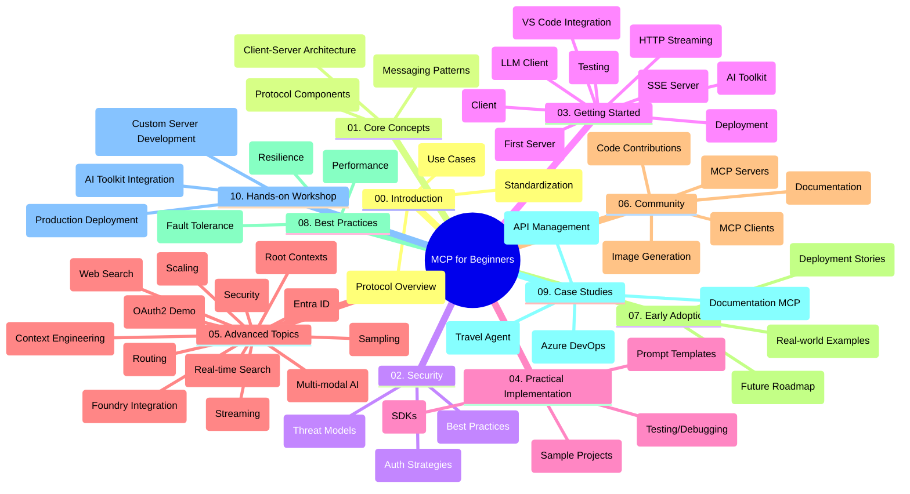

<!--
CO_OP_TRANSLATOR_METADATA:
{
  "original_hash": "5f321ea583cf087a94e47ee74c62b504",
  "translation_date": "2025-07-17T06:34:28+00:00",
  "source_file": "study_guide.md",
  "language_code": "no"
}
-->
# Model Context Protocol (MCP) for nybegynnere - Studieveiledning

Denne studieveiledningen gir en oversikt over repositoriets struktur og innhold for "Model Context Protocol (MCP) for nybegynnere"-pensumet. Bruk denne veiledningen for å navigere i repositoriet effektivt og få mest mulig ut av de tilgjengelige ressursene.

## Oversikt over repositoriet

Model Context Protocol (MCP) er et standardisert rammeverk for samhandling mellom AI-modeller og klientapplikasjoner. Opprinnelig utviklet av Anthropic, vedlikeholdes MCP nå av det bredere MCP-fellesskapet gjennom den offisielle GitHub-organisasjonen. Dette repositoriet tilbyr et omfattende pensum med praktiske kodeeksempler i C#, Java, JavaScript, Python og TypeScript, designet for AI-utviklere, systemarkitekter og programvareingeniører.

## Visuelt pensumkart

## Repositoriets struktur

Repositoriet er organisert i ti hovedseksjoner, hver med fokus på ulike aspekter av MCP:

1. **Introduksjon (00-Introduction/)**
   - Oversikt over Model Context Protocol
   - Hvorfor standardisering er viktig i AI-pipelines
   - Praktiske bruksområder og fordeler

2. **Kjernebegreper (01-CoreConcepts/)**
   - Klient-server-arkitektur
   - Viktige protokollkomponenter
   - Meldingsmønstre i MCP

3. **Sikkerhet (02-Security/)**
   - Sikkerhetstrusler i MCP-baserte systemer
   - Beste praksis for sikre implementasjoner
   - Autentiserings- og autorisasjonsstrategier

4. **Kom i gang (03-GettingStarted/)**
   - Oppsett og konfigurasjon av miljø
   - Lage grunnleggende MCP-servere og klienter
   - Integrasjon med eksisterende applikasjoner
   - Inkluderer seksjoner for:
     - Første serverimplementasjon
     - Klientutvikling
     - LLM-klientintegrasjon
     - VS Code-integrasjon
     - Server-Sent Events (SSE) server
     - HTTP-strømming
     - AI Toolkit-integrasjon
     - Teststrategier
     - Distribusjonsretningslinjer

5. **Praktisk implementering (04-PracticalImplementation/)**
   - Bruk av SDK-er på ulike programmeringsspråk
   - Feilsøking, testing og valideringsteknikker
   - Lage gjenbrukbare promptmaler og arbeidsflyter
   - Eksempelsprosjekter med implementasjonsdemonstrasjoner

6. **Avanserte emner (05-AdvancedTopics/)**
   - Teknikker for kontekstutforming
   - Integrasjon med Foundry-agent
   - Multimodale AI-arbeidsflyter
   - OAuth2-autentiseringsdemoer
   - Sanntidssøk
   - Sanntidsstrømming
   - Implementering av rotkontekster
   - Rutingsstrategier
   - Samplingsteknikker
   - Skaleringsmetoder
   - Sikkerhetshensyn
   - Entra ID-sikkerhetsintegrasjon
   - Websøk-integrasjon

7. **Fellesskapsbidrag (06-CommunityContributions/)**
   - Hvordan bidra med kode og dokumentasjon
   - Samarbeid via GitHub
   - Fellesskapsdrevne forbedringer og tilbakemeldinger
   - Bruk av ulike MCP-klienter (Claude Desktop, Cline, VSCode)
   - Arbeid med populære MCP-servere inkludert bildegenerering

8. **Lærdom fra tidlig adopsjon (07-LessonsfromEarlyAdoption/)**
   - Virkelige implementasjoner og suksesshistorier
   - Bygging og utrulling av MCP-baserte løsninger
   - Trender og fremtidig veikart

9. **Beste praksis (08-BestPractices/)**
   - Ytelsesoptimalisering og tuning
   - Design av feiltolerante MCP-systemer
   - Test- og robusthetsstrategier

10. **Case-studier (09-CaseStudy/)**
    - Case-studie: Azure API Management-integrasjon
    - Case-studie: Reisebyråimplementasjon
    - Case-studie: Azure DevOps-integrasjon med YouTube
    - Implementasjonseksempler med detaljert dokumentasjon

11. **Praktisk workshop (10-StreamliningAIWorkflowsBuildingAnMCPServerWithAIToolkit/)**
    - Omfattende praktisk workshop som kombinerer MCP med AI Toolkit
    - Bygge intelligente applikasjoner som kobler AI-modeller med virkelige verktøy
    - Praktiske moduler som dekker grunnleggende, egendefinert serverutvikling og produksjonsdistribusjon
    - Lab-basert læringsmetode med trinnvise instruksjoner

## Ekstra ressurser

Repositoriet inkluderer støtteressurser:

- **Bilder-mappe**: Inneholder diagrammer og illustrasjoner brukt gjennom pensumet
- **Oversettelser**: Flerspråklig støtte med automatiserte oversettelser av dokumentasjon
- **Offisielle MCP-ressurser**:
  - [MCP Documentation](https://modelcontextprotocol.io/)
  - [MCP Specification](https://spec.modelcontextprotocol.io/)
  - [MCP GitHub Repository](https://github.com/modelcontextprotocol)

## Hvordan bruke dette repositoriet

1. **Sekvensiell læring**: Følg kapitlene i rekkefølge (00 til 10) for en strukturert læringsopplevelse.
2. **Språkspesifikt fokus**: Hvis du er interessert i et bestemt programmeringsspråk, utforsk mappene med eksempler for implementasjoner i ditt foretrukne språk.
3. **Praktisk implementering**: Start med "Kom i gang"-seksjonen for å sette opp miljøet ditt og lage din første MCP-server og klient.
4. **Avansert utforskning**: Når du er komfortabel med det grunnleggende, kan du dykke ned i avanserte emner for å utvide kunnskapen.
5. **Fellesskapsengasjement**: Bli med i MCP-fellesskapet via GitHub-diskusjoner og Discord-kanaler for å knytte kontakt med eksperter og andre utviklere.

## MCP-klienter og verktøy

Pensumet dekker ulike MCP-klienter og verktøy:

1. **Offisielle klienter**:
   - Visual Studio Code
   - MCP i Visual Studio Code
   - Claude Desktop
   - Claude i VSCode
   - Claude API

2. **Fellesskapsklienter**:
   - Cline (terminalbasert)
   - Cursor (kodeeditor)
   - ChatMCP
   - Windsurf

3. **MCP-administrasjonsverktøy**:
   - MCP CLI
   - MCP Manager
   - MCP Linker
   - MCP Router

## Populære MCP-servere

Repositoriet introduserer ulike MCP-servere, inkludert:

1. **Offisielle referanseservere**:
   - Filesystem
   - Fetch
   - Memory
   - Sequential Thinking

2. **Bildegenerering**:
   - Azure OpenAI DALL-E 3
   - Stable Diffusion WebUI
   - Replicate

3. **Utviklingsverktøy**:
   - Git MCP
   - Terminal Control
   - Code Assistant

4. **Spesialiserte servere**:
   - Salesforce
   - Microsoft Teams
   - Jira & Confluence

## Bidra

Dette repositoriet ønsker bidrag fra fellesskapet velkommen. Se seksjonen Fellesskapsbidrag for veiledning om hvordan du kan bidra effektivt til MCP-økosystemet.

## Endringslogg

| Dato | Endringer |
|------|-----------|
| 16. juli 2025 | - Oppdatert repositoriets struktur for å reflektere nåværende innhold - Lagt til seksjon for MCP-klienter og verktøy - Lagt til seksjon for populære MCP-servere - Oppdatert visuelt pensumkart med alle nåværende temaer - Utvidet avanserte emner med alle spesialiserte områder - Oppdatert case-studier med faktiske eksempler - Presisert MCPs opprinnelse som utviklet av Anthropic |
| 11. juni 2025 | - Første utgave av studieveiledningen - Lagt til visuelt pensumkart - Skisset opp repositoriets struktur - Inkludert eksempelsprosjekter og ekstra ressurser |

---

*Denne studieveiledningen ble oppdatert 16. juli 2025 og gir en oversikt over repositoriet per denne datoen. Innholdet i repositoriet kan bli oppdatert etter denne datoen.*

**Ansvarsfraskrivelse**:  
Dette dokumentet er oversatt ved hjelp av AI-oversettelsestjenesten [Co-op Translator](https://github.com/Azure/co-op-translator). Selv om vi streber etter nøyaktighet, vennligst vær oppmerksom på at automatiske oversettelser kan inneholde feil eller unøyaktigheter. Det opprinnelige dokumentet på originalspråket skal anses som den autoritative kilden. For kritisk informasjon anbefales profesjonell menneskelig oversettelse. Vi er ikke ansvarlige for eventuelle misforståelser eller feiltolkninger som oppstår ved bruk av denne oversettelsen.