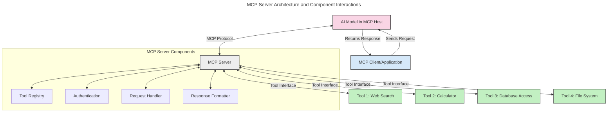
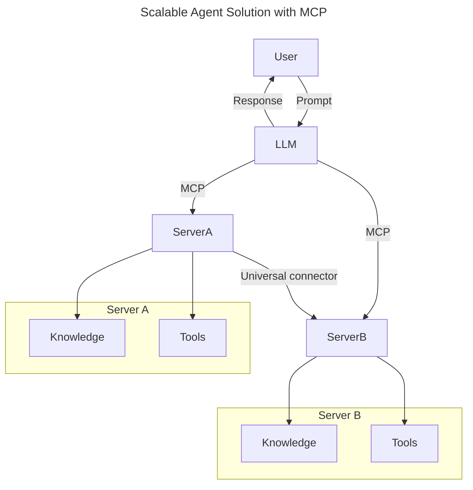
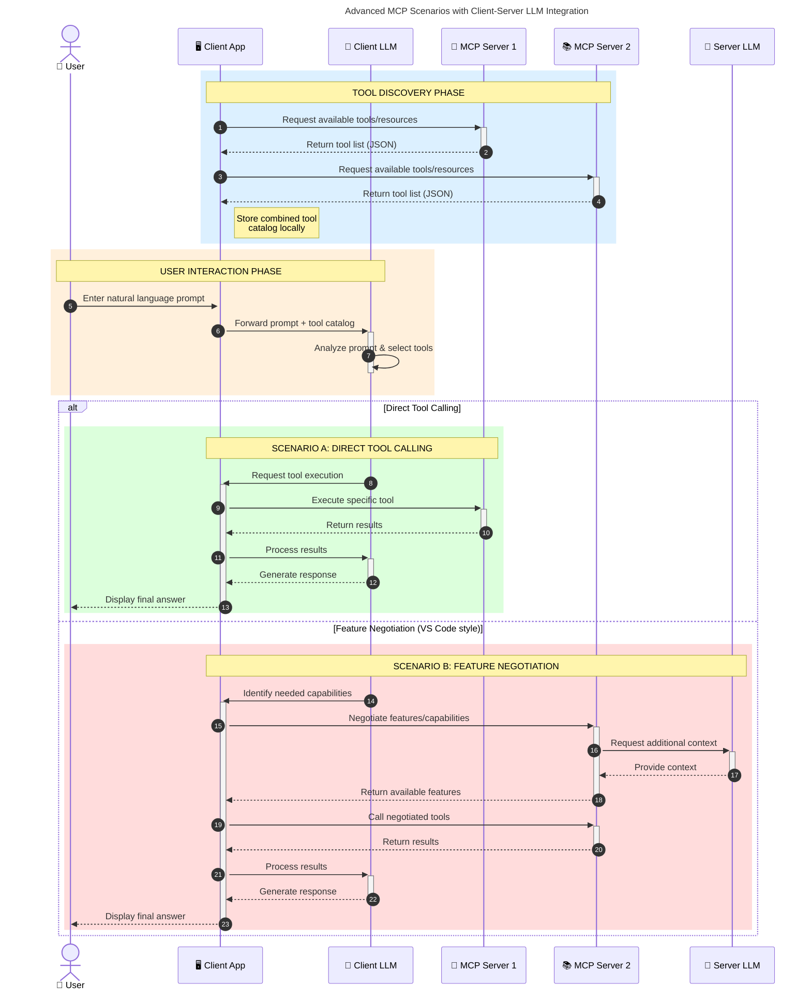

<!--
CO_OP_TRANSLATOR_METADATA:
{
  "original_hash": "1446979020432f512c883848d7eca144",
  "translation_date": "2025-05-29T21:45:58+00:00",
  "source_file": "00-Introduction/README.md",
  "language_code": "pa"
}
-->
# ਮਾਡਲ ਕਾਂਟੈਕਸਟ ਪ੍ਰੋਟੋਕੋਲ (MCP) ਦਾ ਪਰਚਿਆ: ਵੱਡੇ ਪੱਧਰ ਦੇ AI ਐਪਲੀਕੇਸ਼ਨਾਂ ਲਈ ਕਿਉਂ ਜ਼ਰੂਰੀ ਹੈ

ਜਨਰੇਟਿਵ AI ਐਪਲੀਕੇਸ਼ਨ ਇੱਕ ਵੱਡਾ ਕਦਮ ਹਨ ਕਿਉਂਕਿ ਇਹ ਆਮ ਤੌਰ 'ਤੇ ਯੂਜ਼ਰ ਨੂੰ ਕੁਦਰਤੀ ਭਾਸ਼ਾ ਪ੍ਰੰਪਟਾਂ ਰਾਹੀਂ ਐਪ ਨਾਲ ਇੰਟਰੈਕਟ ਕਰਨ ਦਾ ਮੌਕਾ ਦਿੰਦੇ ਹਨ। ਪਰ ਜਿਵੇਂ ਜਿਵੇਂ ਇਨ੍ਹਾਂ ਐਪਾਂ ਵਿੱਚ ਵਧੇਰੇ ਸਮਾਂ ਅਤੇ ਸਰੋਤ ਲੱਗਦੇ ਹਨ, ਤੁਹਾਨੂੰ ਇਹ ਯਕੀਨੀ ਬਣਾਉਣਾ ਚਾਹੀਦਾ ਹੈ ਕਿ ਤੁਸੀਂ ਫੰਕਸ਼ਨਾਲਿਟੀ ਅਤੇ ਸਰੋਤਾਂ ਨੂੰ ਇਸ ਤਰ੍ਹਾਂ ਜੋੜ ਸਕੋ ਜੋ ਆਸਾਨੀ ਨਾਲ ਵਧਾਏ ਜਾ ਸਕਣ, ਤੁਹਾਡੀ ਐਪ ਇੱਕ ਤੋਂ ਵੱਧ ਮਾਡਲ ਨੂੰ ਸਹਿਣ ਕਰ ਸਕੇ ਅਤੇ ਵੱਖ-ਵੱਖ ਮਾਡਲ ਦੀਆਂ ਜਟਿਲਤਾਵਾਂ ਨੂੰ ਸੰਭਾਲ ਸਕੇ। ਸਿੱਧੇ ਸ਼ਬਦਾਂ ਵਿੱਚ, ਜਨਰੇਟਿਵ AI ਐਪ ਬਣਾਉਣਾ ਸ਼ੁਰੂਆਤ ਵਿੱਚ ਆਸਾਨ ਹੈ, ਪਰ ਜਿਵੇਂ ਇਹ ਵੱਧਦੇ ਅਤੇ ਜਟਿਲ ਹੁੰਦੇ ਹਨ, ਤੁਹਾਨੂੰ ਇੱਕ ਆਰਕੀਟੈਕਚਰ ਬਣਾਉਣ ਦੀ ਲੋੜ ਪੈਂਦੀ ਹੈ ਅਤੇ ਸੰਭਵਤ: ਇੱਕ ਮਿਆਰੀਕਰਨ ਤੇ ਨਿਰਭਰ ਕਰਨਾ ਪੈਂਦਾ ਹੈ ਤਾਂ ਜੋ ਤੁਹਾਡੇ ਐਪ ਇੱਕਸਾਰ ਢੰਗ ਨਾਲ ਬਣੇ ਰਹਿਣ। ਇੱਥੇ MCP ਮਦਦ ਲਈ ਆਉਂਦਾ ਹੈ ਜੋ ਸਾਰਥਕ ਵਿਵਸਥਾ ਅਤੇ ਇੱਕ ਮਿਆਰੀਕਰਨ ਪ੍ਰਦਾਨ ਕਰਦਾ ਹੈ।

---

## **🔍 ਮਾਡਲ ਕਾਂਟੈਕਸਟ ਪ੍ਰੋਟੋਕੋਲ (MCP) ਕੀ ਹੈ?**

**ਮਾਡਲ ਕਾਂਟੈਕਸਟ ਪ੍ਰੋਟੋਕੋਲ (MCP)** ਇੱਕ **ਖੁਲਾ, ਮਿਆਰੀਕ੍ਰਿਤ ਇੰਟਰਫੇਸ** ਹੈ ਜੋ ਵੱਡੇ ਭਾਸ਼ਾਈ ਮਾਡਲਾਂ (LLMs) ਨੂੰ ਬਾਹਰੀ ਟੂਲਾਂ, APIs ਅਤੇ ਡਾਟਾ ਸਰੋਤਾਂ ਨਾਲ ਬਿਨਾਂ ਕਿਸੇ ਰੁਕਾਵਟ ਦੇ ਇੰਟਰੈਕਟ ਕਰਨ ਦਿੰਦਾ ਹੈ। ਇਹ ਇੱਕ ਇਕਸਾਰ ਆਰਕੀਟੈਕਚਰ ਪ੍ਰਦਾਨ ਕਰਦਾ ਹੈ ਜੋ AI ਮਾਡਲ ਦੀ ਕਾਰਗੁਜ਼ਾਰੀ ਨੂੰ ਉਨ੍ਹਾਂ ਦੇ ਟਰੇਨਿੰਗ ਡਾਟਾ ਤੋਂ ਬਾਹਰ ਵਧਾਉਂਦਾ ਹੈ, ਜਿਸ ਨਾਲ ਸਮਾਰਟ, ਸਕੇਲ ਕਰਨ ਯੋਗ ਅਤੇ ਜ਼ਿਆਦਾ ਪ੍ਰਤੀਕ੍ਰਿਆਸ਼ੀਲ AI ਸਿਸਟਮ ਬਣਦੇ ਹਨ।

---

## **🎯 AI ਵਿੱਚ ਮਿਆਰੀਕਰਨ ਕਿਉਂ ਜ਼ਰੂਰੀ ਹੈ**

ਜਿਵੇਂ ਜਨਰੇਟਿਵ AI ਐਪਲੀਕੇਸ਼ਨ ਹੋਰ ਜਟਿਲ ਹੁੰਦੇ ਜਾ ਰਹੇ ਹਨ, ਇਹ ਜ਼ਰੂਰੀ ਹੈ ਕਿ ਅਜਿਹੇ ਮਿਆਰਾਂ ਨੂੰ ਅਪਣਾਇਆ ਜਾਵੇ ਜੋ **ਸਕੇਲਬਿਲਟੀ, ਵਿਸਥਾਰਯੋਗਤਾ** ਅਤੇ **ਰੱਖ-ਰਖਾਅ ਯੋਗਤਾ** ਨੂੰ ਯਕੀਨੀ ਬਣਾਉਂਦੇ ਹਨ। MCP ਇਹਨਾਂ ਜ਼ਰੂਰਤਾਂ ਨੂੰ ਇਸ ਤਰ੍ਹਾਂ ਪੂਰਾ ਕਰਦਾ ਹੈ:

- ਮਾਡਲ-ਟੂਲ ਇੰਟਿਗ੍ਰੇਸ਼ਨਾਂ ਨੂੰ ਇਕਜੁੱਟ ਕਰਨਾ
- ਇਕ-ਵਾਰੀ ਦੇ ਕਸਟਮ ਹੱਲਾਂ ਨੂੰ ਘਟਾਉਣਾ
- ਇੱਕ ਹੀ ਪਰਿਸਰ ਵਿੱਚ ਕਈ ਮਾਡਲਾਂ ਨੂੰ ਇਕੱਠੇ ਰਹਿਣ ਦੇਣਾ

---

## **📚 ਸਿੱਖਣ ਦੇ ਉਦੇਸ਼**

ਇਸ ਲੇਖ ਦੇ ਅੰਤ ਤੱਕ, ਤੁਸੀਂ ਸਮਝ ਸਕੋਗੇ:

- **ਮਾਡਲ ਕਾਂਟੈਕਸਟ ਪ੍ਰੋਟੋਕੋਲ (MCP)** ਕੀ ਹੈ ਅਤੇ ਇਸਦੇ ਵਰਤੋਂ ਦੇ ਮਾਮਲੇ
- MCP ਮਾਡਲ-ਟੂਲ ਸੰਚਾਰ ਨੂੰ ਕਿਵੇਂ ਮਿਆਰੀਕ੍ਰਿਤ ਕਰਦਾ ਹੈ
- MCP ਆਰਕੀਟੈਕਚਰ ਦੇ ਮੁੱਖ ਹਿੱਸਿਆਂ ਦੀ ਪਛਾਣ ਕਰਨਾ
- ਵਪਾਰ ਅਤੇ ਵਿਕਾਸ ਸੰਦਰਭਾਂ ਵਿੱਚ MCP ਦੇ ਅਸਲੀ ਵਰਤੋਂ ਦੇ ਮਿਸਾਲਾਂ ਦੀ ਖੋਜ

---

## **💡 ਮਾਡਲ ਕਾਂਟੈਕਸਟ ਪ੍ਰੋਟੋਕੋਲ (MCP) ਕਿਉਂ ਇੱਕ ਖੇਡ ਬਦਲਣ ਵਾਲਾ ਹੈ**

### **🔗 MCP AI ਇੰਟਰੈਕਸ਼ਨਾਂ ਵਿੱਚ ਟੁਕੜੇਪਣ ਨੂੰ ਦੂਰ ਕਰਦਾ ਹੈ**

MCP ਤੋਂ ਪਹਿਲਾਂ, ਮਾਡਲਾਂ ਨੂੰ ਟੂਲਾਂ ਨਾਲ ਜੋੜਨ ਲਈ ਲੋੜ ਸੀ:

- ਹਰ ਟੂਲ-ਮਾਡਲ ਜੋੜੀ ਲਈ ਕਸਟਮ ਕੋਡ
- ਹਰ ਵਿਕਰੇਤਾ ਲਈ ਗੈਰ-ਮਿਆਰੀ API
- ਅਪਡੇਟਾਂ ਕਾਰਨ ਬਾਰ-ਬਾਰ ਟੁੱਟਣਾ
- ਜ਼ਿਆਦਾ ਟੂਲਾਂ ਨਾਲ ਖਰਾਬ ਸਕੇਲਬਿਲਟੀ

### **✅ MCP ਮਿਆਰੀਕਰਨ ਦੇ ਫਾਇਦੇ**

| **ਫਾਇਦਾ**               | **ਵੇਰਵਾ**                                                                    |
|--------------------------|----------------------------------------------------------------------------|
| ਇੰਟਰਓਪਰੇਬਿਲਿਟੀ         | LLMs ਵੱਖ-ਵੱਖ ਵਿਕਰੇਤਿਆਂ ਦੇ ਟੂਲਾਂ ਨਾਲ ਬਿਨਾਂ ਰੁਕਾਵਟ ਕੰਮ ਕਰਦੇ ਹਨ              |
| ਇਕਸਾਰਤਾ                  | ਪਲੇਟਫਾਰਮਾਂ ਅਤੇ ਟੂਲਾਂ ਵਿੱਚ ਇੱਕਸਾਰ ਵਿਹਾਰ                                 |
| ਦੁਬਾਰਾ ਵਰਤੋਂਯੋਗਤਾ       | ਇੱਕ ਵਾਰੀ ਬਣਾਏ ਟੂਲ ਪ੍ਰੋਜੈਕਟਾਂ ਅਤੇ ਸਿਸਟਮਾਂ ਵਿੱਚ ਵਰਤੇ ਜਾ ਸਕਦੇ ਹਨ               |
| ਵਿਕਾਸ ਵਿੱਚ ਤੇਜ਼ੀ           | ਮਿਆਰੀਕ੍ਰਿਤ, ਪਲੱਗ-ਅਤੇ-ਪਲੇਅ ਇੰਟਰਫੇਸ ਵਰਤ ਕੇ ਵਿਕਾਸ ਸਮਾਂ ਘਟਾਉਣਾ               |

---

## **🧱 MCP ਆਰਕੀਟੈਕਚਰ ਦਾ ਉੱਚ-ਸਤਹੀ ਜਾਇਜ਼ਾ**

MCP ਇੱਕ **ਕਲਾਇੰਟ-ਸਰਵਰ ਮਾਡਲ** ਨੂੰ ਫਾਲੋ ਕਰਦਾ ਹੈ, ਜਿਸ ਵਿੱਚ:

- **MCP Hosts** AI ਮਾਡਲ ਚਲਾਉਂਦੇ ਹਨ
- **MCP Clients** ਬੇਨਤੀਆਂ ਭੇਜਦੇ ਹਨ
- **MCP Servers** ਕਾਂਟੈਕਸਟ, ਟੂਲ ਅਤੇ ਸਮਰੱਥਾਵਾਂ ਸੇਵਾ ਕਰਦੇ ਹਨ

### **ਮੁੱਖ ਹਿੱਸੇ:**

- **Resources** – ਮਾਡਲਾਂ ਲਈ ਸਥਿਰ ਜਾਂ ਗਤੀਸ਼ੀਲ ਡਾਟਾ  
- **Prompts** – ਦਿਸ਼ਾ-ਨਿਰਦੇਸ਼ਿਤ ਜਨਰੇਸ਼ਨ ਲਈ ਪਹਿਲਾਂ ਤੋਂ ਨਿਰਧਾਰਿਤ ਵਰਕਫਲੋ  
- **Tools** – ਖੋਜ, ਗਣਨਾ ਵਰਗੇ ਕਾਰਜ ਕਰਨ ਵਾਲੇ ਫੰਕਸ਼ਨ  
- **Sampling** – ਦੁਹਰਾਏ ਜਾਂਦੇ ਇੰਟਰੈਕਸ਼ਨਾਂ ਰਾਹੀਂ ਏਜੰਟਿਕ ਵਿਹਾਰ

---

## MCP Servers ਕਿਵੇਂ ਕੰਮ ਕਰਦੇ ਹਨ

MCP ਸਰਵਰ ਹੇਠਾਂ ਦਿੱਤੇ ਤਰੀਕੇ ਨਾਲ ਕੰਮ ਕਰਦੇ ਹਨ:

- **ਬੇਨਤੀ ਦਾ ਪ੍ਰਵਾਹ**:  
    1. MCP Client ਇੱਕ ਬੇਨਤੀ MCP Host ਵਿੱਚ ਚੱਲ ਰਹੇ AI ਮਾਡਲ ਨੂੰ ਭੇਜਦਾ ਹੈ।  
    2. AI ਮਾਡਲ ਪਛਾਣਦਾ ਹੈ ਕਿ ਕਦੋਂ ਉਸਨੂੰ ਬਾਹਰੀ ਟੂਲਾਂ ਜਾਂ ਡਾਟਾ ਦੀ ਲੋੜ ਹੈ।  
    3. ਮਾਡਲ ਮਿਆਰੀਕ੍ਰਿਤ ਪ੍ਰੋਟੋਕੋਲ ਰਾਹੀਂ MCP Server ਨਾਲ ਸੰਚਾਰ ਕਰਦਾ ਹੈ।  

- **MCP Server ਦੀ ਕਾਰਗੁਜ਼ਾਰੀ**:  
    - ਟੂਲ ਰਜਿਸਟਰੀ: ਉਪਲਬਧ ਟੂਲਾਂ ਅਤੇ ਉਹਨਾਂ ਦੀਆਂ ਸਮਰੱਥਾਵਾਂ ਦਾ ਕੈਟਲੌਗ ਰੱਖਦਾ ਹੈ।  
    - ਪ੍ਰਮਾਣਿਕਤਾ: ਟੂਲ ਪਹੁੰਚ ਲਈ ਅਧਿਕਾਰਾਂ ਦੀ ਜਾਂਚ ਕਰਦਾ ਹੈ।  
    - ਬੇਨਤੀ ਹੈਂਡਲਰ: ਮਾਡਲ ਤੋਂ ਆ ਰਹੀਆਂ ਟੂਲ ਬੇਨਤੀਆਂ ਨੂੰ ਪ੍ਰਕਿਰਿਆ ਕਰਦਾ ਹੈ।  
    - ਜਵਾਬ ਫਾਰਮੈਟਰ: ਟੂਲ ਦੇ ਨਤੀਜੇ ਮਾਡਲ ਲਈ ਸਮਝਣਯੋਗ ਫਾਰਮੈਟ ਵਿੱਚ ਤਿਆਰ ਕਰਦਾ ਹੈ।  

- **ਟੂਲ ਐਗਜ਼ੀਕਿਊਸ਼ਨ**:  
    - ਸਰਵਰ ਬੇਨਤੀਆਂ ਨੂੰ ਸਹੀ ਬਾਹਰੀ ਟੂਲਾਂ ਵੱਲ ਭੇਜਦਾ ਹੈ।  
    - ਟੂਲ ਆਪਣੇ ਵਿਸ਼ੇਸ਼ ਕਾਰਜ (ਖੋਜ, ਗਣਨਾ, ਡਾਟਾਬੇਸ ਕਵੈਰੀਆਂ ਆਦਿ) ਕਰਦੇ ਹਨ।  
    - ਨਤੀਜੇ ਮਾਡਲ ਨੂੰ ਇੱਕਸਾਰ ਫਾਰਮੈਟ ਵਿੱਚ ਵਾਪਸ ਭੇਜੇ ਜਾਂਦੇ ਹਨ।  

- **ਜਵਾਬ ਪੂਰਾ ਕਰਨਾ**:  
    - AI ਮਾਡਲ ਟੂਲ ਦੇ ਨਤੀਜਿਆਂ ਨੂੰ ਆਪਣੇ ਜਵਾਬ ਵਿੱਚ ਸ਼ਾਮਲ ਕਰਦਾ ਹੈ।  
    - ਅੰਤਿਮ ਜਵਾਬ ਕਲਾਇੰਟ ਐਪਲੀਕੇਸ਼ਨ ਨੂੰ ਭੇਜਿਆ ਜਾਂਦਾ ਹੈ।  

## 👨‍💻 MCP Server ਕਿਵੇਂ ਬਣਾਇਆ ਜਾਵੇ (ਉਦਾਹਰਨਾਂ ਸਮੇਤ)

MCP ਸਰਵਰ ਤੁਹਾਨੂੰ LLM ਸਮਰੱਥਾਵਾਂ ਵਧਾਉਣ ਦੀ ਆਗਿਆ ਦਿੰਦੇ ਹਨ, ਡਾਟਾ ਅਤੇ ਫੰਕਸ਼ਨਾਲਿਟੀ ਪ੍ਰਦਾਨ ਕਰਕੇ। 

ਕਮਾਉਣ ਲਈ ਤਿਆਰ? ਇੱਥੇ ਵੱਖ-ਵੱਖ ਭਾਸ਼ਾਵਾਂ ਵਿੱਚ ਇੱਕ ਸਧਾਰਣ MCP ਸਰਵਰ ਬਣਾਉਣ ਦੀਆਂ ਉਦਾਹਰਨਾਂ ਹਨ:

- **Python Example**: https://github.com/modelcontextprotocol/python-sdk

- **TypeScript Example**: https://github.com/modelcontextprotocol/typescript-sdk

- **Java Example**: https://github.com/modelcontextprotocol/java-sdk

- **C#/.NET Example**: https://github.com/modelcontextprotocol/csharp-sdk

## 🌍 MCP ਲਈ ਅਸਲੀ ਵਰਤੋਂ ਦੇ ਮਾਮਲੇ

MCP AI ਸਮਰੱਥਾਵਾਂ ਨੂੰ ਵਧਾ ਕੇ ਵੱਖ-ਵੱਖ ਐਪਲੀਕੇਸ਼ਨਾਂ ਨੂੰ ਯੋਗ ਬਣਾਉਂਦਾ ਹੈ:

| **ਐਪਲੀਕੇਸ਼ਨ**             | **ਵੇਰਵਾ**                                                                     |
|----------------------------|-------------------------------------------------------------------------------|
| Enterprise Data Integration | LLMs ਨੂੰ ਡਾਟਾਬੇਸ, CRM ਜਾਂ ਅੰਦਰੂਨੀ ਟੂਲਾਂ ਨਾਲ ਜੋੜਨਾ                            |
| Agentic AI Systems          | ਟੂਲ ਪਹੁੰਚ ਅਤੇ ਫੈਸਲਾ ਲੈਣ ਵਾਲੇ ਵਰਕਫਲੋ ਨਾਲ ਖੁਦਮੁਖਤਿਆਰ ਏਜੰਟ ਯੋਗ ਬਣਾਉਣਾ        |
| Multi-modal Applications    | ਇੱਕ ਇਕਸਾਰ AI ਐਪ ਵਿੱਚ ਟੈਕਸਟ, ਚਿੱਤਰ ਅਤੇ ਆਡੀਓ ਟੂਲਾਂ ਨੂੰ ਮਿਲਾਉਣਾ                |
| Real-time Data Integration  | AI ਇੰਟਰੈਕਸ਼ਨਾਂ ਵਿੱਚ ਤਾਜ਼ਾ ਡਾਟਾ ਲਿਆਉਣਾ ਤਾਂ ਜੋ ਨਤੀਜੇ ਹੋਰ ਸਹੀ ਅਤੇ ਮੌਜੂਦਾ ਹੋਣ    |

### 🧠 MCP = AI ਇੰਟਰੈਕਸ਼ਨਾਂ ਲਈ ਯੂਨੀਵਰਸਲ ਮਿਆਰ

ਮਾਡਲ ਕਾਂਟੈਕਸਟ ਪ੍ਰੋਟੋਕੋਲ (MCP) AI ਇੰਟਰੈਕਸ਼ਨਾਂ ਲਈ ਇੱਕ ਯੂਨੀਵਰਸਲ ਮਿਆਰ ਵਾਂਗ ਕੰਮ ਕਰਦਾ ਹੈ, ਜਿਵੇਂ USB-C ਨੇ ਜ਼ਰੀਏ ਡਿਵਾਈਸਾਂ ਲਈ ਫਿਜ਼ੀਕਲ ਕਨੈਕਸ਼ਨਾਂ ਨੂੰ ਮਿਆਰੀਕ੍ਰਿਤ ਕੀਤਾ। AI ਦੀ ਦੁਨੀਆ ਵਿੱਚ, MCP ਇੱਕ ਇਕਸਾਰ ਇੰਟਰਫੇਸ ਦਿੰਦਾ ਹੈ, ਜੋ ਮਾਡਲਾਂ (ਕਲਾਇੰਟਾਂ) ਨੂੰ ਬਾਹਰੀ ਟੂਲਾਂ ਅਤੇ ਡਾਟਾ ਪ੍ਰਦਾਤਿਆਂ (ਸਰਵਰਾਂ) ਨਾਲ ਬਿਨਾਂ ਰੁਕਾਵਟ ਜੋੜਦਾ ਹੈ। ਇਸ ਨਾਲ ਹਰ API ਜਾਂ ਡਾਟਾ ਸਰੋਤ ਲਈ ਵੱਖ-ਵੱਖ, ਕਸਟਮ ਪ੍ਰੋਟੋਕੋਲ ਦੀ ਲੋੜ ਖਤਮ ਹੋ ਜਾਂਦੀ ਹੈ।

MCP ਅਨੁਕੂਲ ਟੂਲ (ਜਿਸਨੂੰ MCP ਸਰਵਰ ਕਿਹਾ ਜਾਂਦਾ ਹੈ) ਇੱਕ ਇਕਸਾਰ ਮਿਆਰ ਦੀ ਪਾਲਣਾ ਕਰਦਾ ਹੈ। ਇਹ ਸਰਵਰ ਉਹ ਟੂਲ ਜਾਂ ਕਾਰਜ ਦਰਜ ਕਰ ਸਕਦੇ ਹਨ ਜੋ ਉਹ ਪ੍ਰਦਾਨ ਕਰਦੇ ਹਨ ਅਤੇ AI ਏਜੰਟ ਦੀ ਬੇਨਤੀ 'ਤੇ ਉਹਨਾਂ ਕਾਰਜਾਂ ਨੂੰ ਚਲਾ ਸਕਦੇ ਹਨ। MCP ਸਮਰਥਿਤ AI ਏਜੰਟ ਪਲੇਟਫਾਰਮ ਸਰਵਰਾਂ ਤੋਂ ਉਪਲਬਧ ਟੂਲਾਂ ਨੂੰ ਲੱਭ ਸਕਦੇ ਹਨ ਅਤੇ ਇਸ ਮਿਆਰੀ ਪ੍ਰੋਟੋਕੋਲ ਰਾਹੀਂ ਉਨ੍ਹਾਂ ਨੂੰ ਕਾਲ ਕਰ ਸਕਦੇ ਹਨ।

### 💡 ਗਿਆਨ ਤੱਕ ਪਹੁੰਚ ਨੂੰ ਆਸਾਨ ਬਣਾਉਂਦਾ ਹੈ

ਟੂਲਾਂ ਦੇ ਨਾਲ-ਨਾਲ, MCP ਗਿਆਨ ਤੱਕ ਪਹੁੰਚ ਵੀ ਆਸਾਨ ਬਣਾਉਂਦਾ ਹੈ। ਇਹ ਐਪਲੀਕੇਸ਼ਨਾਂ ਨੂੰ ਵੱਡੇ ਭਾਸ਼ਾਈ ਮਾਡਲਾਂ (LLMs) ਨੂੰ ਵੱਖ-ਵੱਖ ਡਾਟਾ ਸਰੋਤਾਂ ਨਾਲ ਜੋੜ ਕੇ ਸੰਦਰਭ ਪ੍ਰਦਾਨ ਕਰਨ ਦੀ ਆਗਿਆ ਦਿੰਦਾ ਹੈ। ਉਦਾਹਰਨ ਵਜੋਂ, ਇੱਕ MCP ਸਰਵਰ ਕਿਸੇ ਕੰਪਨੀ ਦੀ ਦਸਤਾਵੇਜ਼ ਰਿਪੋਜ਼ਿਟਰੀ ਨੂੰ ਦਰਸਾ ਸਕਦਾ ਹੈ, ਜਿਸ ਨਾਲ ਏਜੰਟ ਲੋੜ ਮੁਤਾਬਕ ਸੰਬੰਧਤ ਜਾਣਕਾਰੀ ਪ੍ਰਾਪਤ ਕਰ ਸਕਦੇ ਹਨ। ਦੂਜਾ ਸਰਵਰ ਖਾਸ ਕਾਰਜਾਂ ਜਿਵੇਂ ਈਮੇਲ ਭੇਜਣਾ ਜਾਂ ਰਿਕਾਰਡ ਅਪਡੇਟ ਕਰਨਾ ਸੰਭਾਲ ਸਕਦਾ ਹੈ। ਏਜੰਟ ਦੀ ਨਜ਼ਰ ਵਿੱਚ, ਇਹ ਸਿਰਫ਼ ਉਹ ਟੂਲ ਹਨ ਜੋ ਉਹ ਵਰਤ ਸਕਦਾ ਹੈ—ਕੁਝ ਟੂਲ ਡਾਟਾ (ਗਿਆਨ ਸੰਦਰਭ) ਵਾਪਸ ਕਰਦੇ ਹਨ, ਜਦਕਿ ਹੋਰ ਕਾਰਜ ਕਰਦੇ ਹਨ। MCP ਦੋਹਾਂ ਨੂੰ ਪ੍ਰਭਾਵਸ਼ਾਲੀ ਢੰਗ ਨਾਲ ਸੰਭਾਲਦਾ ਹੈ।

ਇੱਕ ਏਜੰਟ ਜੋ MCP ਸਰਵਰ ਨਾਲ ਜੁੜਦਾ ਹੈ, ਉਹ ਆਟੋਮੈਟਿਕ ਤੌਰ 'ਤੇ ਸਰਵਰ ਦੀ ਉਪਲਬਧ ਸਮਰੱਥਾਵਾਂ ਅਤੇ ਡਾਟਾ ਨੂੰ ਇੱਕ ਮਿਆਰੀ ਫਾਰਮੈਟ ਰਾਹੀਂ ਸਿੱਖ ਲੈਂਦਾ ਹੈ। ਇਹ ਮਿਆਰੀਕਰਨ ਗਤੀਸ਼ੀਲ ਟੂਲ ਉਪਲਬਧਤਾ ਨੂੰ ਯਕੀਨੀ ਬਣਾਉਂਦਾ ਹੈ। ਉਦਾਹਰਨ ਵਜੋਂ, ਕਿਸੇ ਨਵੇਂ MCP ਸਰਵਰ ਨੂੰ ਏਜੰਟ ਦੇ ਸਿਸਟਮ ਵਿੱਚ ਜੋੜਨ ਨਾਲ ਉਸਦੇ ਫੰਕਸ਼ਨ ਤੁਰੰਤ ਵਰਤੇ ਜਾ ਸਕਦੇ ਹਨ ਬਿਨਾਂ ਏਜੰਟ ਦੀਆਂ ਹਦਾਇਤਾਂ ਵਿੱਚ ਹੋਰ ਬਦਲਾਅ ਕੀਤੇ।

ਇਹ ਸੁਗਮ ਇੰਟਿਗ੍ਰੇਸ਼ਨ ਉਸ ਪ੍ਰਵਾਹ ਨਾਲ ਮੇਲ ਖਾਂਦੀ ਹੈ ਜੋ ਮਰਮੇਡ ਡਾਇਗ੍ਰਾਮ ਵਿੱਚ ਦਿਖਾਈ ਗਈ ਹੈ, ਜਿੱਥੇ ਸਰਵਰ ਟੂਲ ਅਤੇ ਗਿਆਨ ਦੋਹਾਂ ਪ੍ਰਦਾਨ ਕਰਦੇ ਹਨ, ਜੋ ਸਿਸਟਮਾਂ ਵਿੱਚ ਬਿਨਾਂ ਰੁਕਾਵਟ ਸਹਿਯੋਗ ਯਕੀਨੀ ਬਣਾਉਂਦਾ ਹੈ।

### 👉 ਉਦਾਹਰਨ: ਸਕੇਲ ਕਰਨ ਯੋਗ ਏਜੰਟ ਹੱਲ

### 🔄 ਕਲਾਇੰਟ-ਸਾਈਡ LLM ਇੰਟਿਗ੍ਰੇਸ਼ਨ ਨਾਲ ਉੱਨਤ MCP ਸਥਿਤੀਆਂ

ਮੂਲ MCP ਆਰਕੀਟੈਕਚਰ ਤੋਂ ਇਲਾਵਾ, ਉੱਚ-ਸਤਹੀ ਸਥਿਤੀਆਂ ਵੀ ਹਨ ਜਿੱਥੇ ਕਲਾਇੰਟ ਅਤੇ ਸਰਵਰ ਦੋਹਾਂ ਵਿੱਚ LLM ਹੁੰਦੇ ਹਨ, ਜੋ ਹੋਰ ਸੁਧਰੇ ਹੋਏ ਇੰਟਰੈਕਸ਼ਨਾਂ ਨੂੰ ਯੋਗ ਬਣਾਉਂਦੇ ਹਨ:

## 🔐 MCP ਦੇ ਵਿਹਾਰਕ ਫਾਇਦੇ

MCP ਵਰਤਣ ਦੇ ਕੁਝ ਵਿਹਾਰਕ ਫਾਇਦੇ:

- **ਤਾਜਗੀ**: ਮਾਡਲ ਆਪਣੇ ਟਰੇਨਿੰਗ ਡਾਟਾ ਤੋਂ ਬਾਹਰ ਅਪ-ਟੂ-ਡੇਟ ਜਾਣਕਾਰੀ ਤੱਕ ਪਹੁੰਚ ਸਕਦੇ ਹਨ  
- **ਸਮਰੱਥਾ ਵਾਧਾ**: ਮਾਡਲ ਉਹਨਾਂ ਕੰਮਾਂ ਲਈ ਵਿਸ਼ੇਸ਼ ਟੂਲ ਵਰਤ ਸਕਦੇ ਹਨ ਜਿਨ੍ਹਾਂ ਲਈ ਉਹ ਟਰੇਨ ਨਹੀਂ ਹੋਏ  
- **ਘਟੀਆ ਫੈਸਲੇ ਘਟਾਉਣਾ**: ਬਾਹਰੀ ਡਾਟਾ ਸਰੋਤ ਸੱਚਾਈ ਦਾ ਆਧਾਰ ਪ੍ਰਦਾਨ ਕਰਦੇ ਹਨ  
- **ਪ੍ਰਾਈਵੇਸੀ**: ਸੰਵੇਦਨਸ਼ੀਲ ਡਾਟਾ ਸੁਰੱਖਿਅਤ ਵਾਤਾਵਰਨ ਵਿੱਚ ਰਹਿ ਸਕਦਾ ਹੈ, ਪ੍ਰੰਪਟ ਵਿੱਚ ਨਹੀਂ ਮਿਲਾਇਆ ਜਾਂਦਾ

## 📌 ਮੁੱਖ ਗੱਲਾਂ

MCP ਵਰਤੋਂ ਲਈ ਮੁੱਖ ਗੱਲਾਂ:

- **MCP** AI ਮਾਡਲਾਂ ਦੇ ਟੂਲਾਂ ਅਤੇ ਡਾਟਾ ਨਾਲ ਸੰਚਾਰ ਨੂੰ ਮਿਆਰੀਕ੍ਰਿਤ ਕਰਦਾ ਹੈ  
- **ਵਿਸਥਾਰਯੋਗਤਾ, ਇਕਸਾਰਤਾ ਅਤੇ ਇੰਟਰਓਪਰੇਬਿਲਿਟੀ** ਨੂੰ ਪ੍ਰੋਤਸਾਹਿਤ ਕਰਦਾ ਹੈ  
- MCP ਵਿਕਾਸ ਸਮਾਂ ਘਟਾਉਂਦਾ ਹੈ, ਭਰੋਸੇਯੋਗਤਾ ਸੁਧਾਰਦਾ ਹੈ ਅਤੇ ਮਾਡਲ ਸਮਰੱਥਾਵਾਂ ਵਧਾਉਂਦਾ ਹੈ  
- ਕਲਾਇੰਟ-ਸਰਵਰ ਆਰਕੀਟੈਕਚਰ ਲਚਕੀਲੇ ਅਤੇ ਵਿਸਥਾਰਯੋਗ AI ਐਪਲੀਕੇਸ਼ਨਾਂ ਨੂੰ ਯੋਗ ਬਣਾਉਂਦਾ ਹੈ

## 🧠 ਅਭਿਆਸ

ਆਪਣੇ ਮਨਪਸੰਦ AI ਐਪਲੀਕੇਸ਼ਨ ਬਾਰੇ ਸੋਚੋ।

- ਕਿਹੜੇ **ਬਾਹਰੀ ਟੂਲ ਜਾਂ ਡਾਟਾ** ਇਸ ਦੀ ਸਮਰੱਥਾ ਵਧਾ ਸਕਦੇ ਹਨ?  
- MCP ਇੰਟਿਗ੍ਰੇਸ਼ਨ ਨੂੰ ਕਿਵੇਂ **ਸਰਲ ਅਤੇ ਭਰੋਸੇਯੋਗ** ਬਣਾ ਸਕਦਾ ਹੈ?

## ਵਾਧੂ ਸਰੋਤ

- [MCP GitHub Repository](https://github

**ਅਸਵੀਕਾਰੋਪਣ**:  
ਇਹ ਦਸਤਾਵੇਜ਼ AI ਅਨੁਵਾਦ ਸੇਵਾ [Co-op Translator](https://github.com/Azure/co-op-translator) ਦੀ ਵਰਤੋਂ ਕਰਕੇ ਅਨੁਵਾਦ ਕੀਤਾ ਗਿਆ ਹੈ। ਜਦੋਂ ਕਿ ਅਸੀਂ ਸਹੀਅਤ ਲਈ ਕੋਸ਼ਿਸ਼ ਕਰਦੇ ਹਾਂ, ਕਿਰਪਾ ਕਰਕੇ ਧਿਆਨ ਰੱਖੋ ਕਿ ਸਵੈਚਾਲਿਤ ਅਨੁਵਾਦਾਂ ਵਿੱਚ ਗਲਤੀਆਂ ਜਾਂ ਅਸਮਰਥਤਾਵਾਂ ਹੋ ਸਕਦੀਆਂ ਹਨ। ਮੂਲ ਦਸਤਾਵੇਜ਼ ਆਪਣੇ ਮੂਲ ਭਾਸ਼ਾ ਵਿੱਚ ਪ੍ਰਮਾਣਿਕ ਸਰੋਤ ਮੰਨਿਆ ਜਾਣਾ ਚਾਹੀਦਾ ਹੈ। ਜਰੂਰੀ ਜਾਣਕਾਰੀ ਲਈ, ਪੇਸ਼ੇਵਰ ਮਨੁੱਖੀ ਅਨੁਵਾਦ ਦੀ ਸਿਫਾਰਸ਼ ਕੀਤੀ ਜਾਂਦੀ ਹੈ। ਅਸੀਂ ਇਸ ਅਨੁਵਾਦ ਦੇ ਇਸਤੇਮਾਲ ਤੋਂ ਉਤਪੰਨ ਕਿਸੇ ਵੀ ਗਲਤਫਹਿਮੀ ਜਾਂ ਗਲਤ ਵਿਆਖਿਆਵਾਂ ਲਈ ਜ਼ਿੰਮੇਵਾਰ ਨਹੀਂ ਹਾਂ।