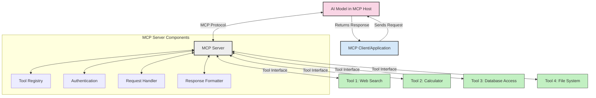
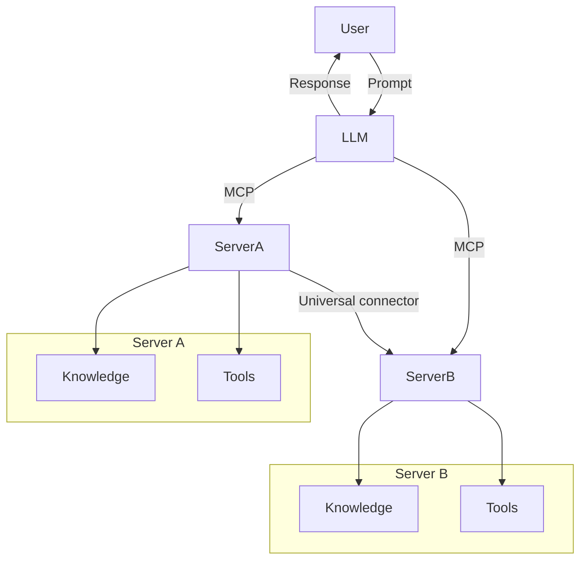
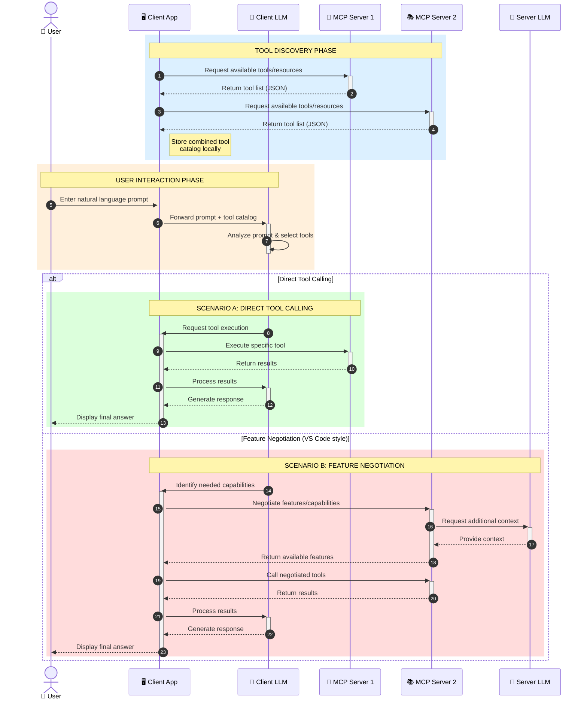

<!--
CO_OP_TRANSLATOR_METADATA:
{
  "original_hash": "25a94c681cf43612ff394d8cf78a74de",
  "translation_date": "2025-05-27T16:01:34+00:00",
  "source_file": "00-Introduction/README.md",
  "language_code": "pa"
}
-->
# ਮਾਡਲ ਸੰਦਰਭ ਪ੍ਰੋਟੋਕੋਲ (MCP) ਦਾ ਪਰਿਚਯ: ਸਕੇਲ ਕਰਨ ਯੋਗ AI ਐਪਲੀਕੇਸ਼ਨਾਂ ਲਈ ਇਹ ਕਿਉਂ ਜਰੂਰੀ ਹੈ

ਜਨਰੇਟਿਵ AI ਐਪਲੀਕੇਸ਼ਨ ਇੱਕ ਵੱਡਾ ਕਦਮ ਹਨ ਕਿਉਂਕਿ ਇਹ ਆਮ ਤੌਰ 'ਤੇ ਯੂਜ਼ਰ ਨੂੰ ਕੁਦਰਤੀ ਭਾਸ਼ਾ ਦੇ ਪ੍ਰਾਂਪਟਾਂ ਰਾਹੀਂ ਐਪ ਨਾਲ ਗੱਲਬਾਤ ਕਰਨ ਦਿੰਦੇ ਹਨ। ਪਰ ਜਿਵੇਂ ਜਿਵੇਂ ਇਸ ਤਰ੍ਹਾਂ ਦੇ ਐਪ ਵਿੱਚ ਸਮਾਂ ਅਤੇ ਸਰੋਤ ਵਧਦੇ ਹਨ, ਤੁਹਾਨੂੰ ਇਹ ਯਕੀਨੀ ਬਣਾਉਣਾ ਚਾਹੀਦਾ ਹੈ ਕਿ ਤੁਸੀਂ ਫੰਕਸ਼ਨਲਿਟੀ ਅਤੇ ਸਰੋਤਾਂ ਨੂੰ ਇਸ ਤਰ੍ਹਾਂ ਇਕੱਠੇ ਕਰ ਸਕੋ ਕਿ ਉਹ ਅਸਾਨੀ ਨਾਲ ਵਧਾਏ ਜਾ ਸਕਣ, ਤੁਹਾਡਾ ਐਪ ਇੱਕ ਤੋਂ ਵੱਧ ਮਾਡਲ ਵਰਤਣ ਯੋਗ ਹੋਵੇ ਅਤੇ ਵੱਖ-ਵੱਖ ਮਾਡਲ ਦੀਆਂ ਜਟਿਲਤਾਵਾਂ ਨੂੰ ਸੰਭਾਲ ਸਕੇ। ਸਧਾਰਨ ਸ਼ਬਦਾਂ ਵਿੱਚ, ਜਨਰੇਟਿਵ AI ਐਪ ਬਣਾਉਣਾ ਸ਼ੁਰੂਆਤ ਵਿੱਚ ਆਸਾਨ ਹੈ, ਪਰ ਜਿਵੇਂ ਇਹ ਵੱਧਦੇ ਹਨ ਅਤੇ ਜਟਿਲ ਹੋ ਜਾਂਦੇ ਹਨ, ਤੁਹਾਨੂੰ ਇੱਕ ਆਰਕੀਟੈਕਚਰ ਬਣਾਉਣੀ ਪਵੇਗੀ ਅਤੇ ਇੱਕ ਮਿਆਰੀਕਰਨ 'ਤੇ ਨਿਰਭਰ ਕਰਨਾ ਪਵੇਗਾ ਤਾਂ ਜੋ ਤੁਹਾਡੇ ਐਪ ਇਕਸਾਰ ਤਰੀਕੇ ਨਾਲ ਬਣ ਸਕਣ। ਇੱਥੇ MCP ਕੰਮ ਵਿੱਚ ਆਉਂਦਾ ਹੈ ਜੋ ਚੀਜ਼ਾਂ ਨੂੰ ਸੰਗਠਿਤ ਕਰਦਾ ਹੈ ਅਤੇ ਇੱਕ ਮਿਆਰ ਪ੍ਰਦਾਨ ਕਰਦਾ ਹੈ।

---

## **🔍 ਮਾਡਲ ਸੰਦਰਭ ਪ੍ਰੋਟੋਕੋਲ (MCP) ਕੀ ਹੈ?**

**ਮਾਡਲ ਸੰਦਰਭ ਪ੍ਰੋਟੋਕੋਲ (MCP)** ਇੱਕ **ਖੁੱਲ੍ਹਾ, ਮਿਆਰੀਕ੍ਰਿਤ ਇੰਟਰਫੇਸ** ਹੈ ਜੋ ਵੱਡੇ ਭਾਸ਼ਾਈ ਮਾਡਲਾਂ (LLMs) ਨੂੰ ਬਾਹਰੀ ਟੂਲ, API ਅਤੇ ਡਾਟਾ ਸਰੋਤਾਂ ਨਾਲ ਬਿਨਾ ਰੁਕਾਵਟ ਗੱਲਬਾਤ ਕਰਨ ਦੀ ਆਗਿਆ ਦਿੰਦਾ ਹੈ। ਇਹ AI ਮਾਡਲ ਦੀ ਕਾਰਗੁਜ਼ਾਰੀ ਨੂੰ ਉਨ੍ਹਾਂ ਦੇ ਟ੍ਰੇਨਿੰਗ ਡਾਟਾ ਤੋਂ ਬਾਹਰ ਵਧਾਉਣ ਲਈ ਇੱਕ ਸਥਿਰ ਆਰਕੀਟੈਕਚਰ ਪ੍ਰਦਾਨ ਕਰਦਾ ਹੈ, ਜਿਸ ਨਾਲ ਹੋਸ਼ਿਆਰ, ਸਕੇਲ ਕਰਨ ਯੋਗ ਅਤੇ ਜ਼ਿਆਦਾ ਪ੍ਰਭਾਵਸ਼ਾਲੀ AI ਸਿਸਟਮ ਬਣਦੇ ਹਨ।

---

## **🎯 AI ਵਿੱਚ ਮਿਆਰੀਕਰਨ ਕਿਉਂ ਜਰੂਰੀ ਹੈ**

ਜਿਵੇਂ ਜਨਰੇਟਿਵ AI ਐਪ ਜਟਿਲ ਹੁੰਦੇ ਜਾਂਦੇ ਹਨ, ਇਹ ਜਰੂਰੀ ਹੈ ਕਿ ਅਜਿਹੇ ਮਿਆਰ ਅਪਣਾਏ ਜਾਣ ਜੋ **ਸਕੇਲਯੋਗਤਾ, ਵਿਸਥਾਰਯੋਗਤਾ** ਅਤੇ **ਰੱਖ-ਰਖਾਵ** ਨੂੰ ਯਕੀਨੀ ਬਣਾਉਂਦੇ ਹਨ। MCP ਇਹਨਾਂ ਜ਼ਰੂਰਤਾਂ ਨੂੰ ਪੂਰਾ ਕਰਦਾ ਹੈ:

- ਮਾਡਲ-ਟੂਲ ਇੰਟੀਗ੍ਰੇਸ਼ਨਾਂ ਨੂੰ ਇਕਜੁੱਟ ਕਰਨਾ  
- ਟੁੱਟਦੇ ਹੋਏ, ਇੱਕ-ਵਾਰੀ ਦੀਆਂ ਵਿਲੱਖਣ ਹੱਲਾਂ ਨੂੰ ਘਟਾਉਣਾ  
- ਇੱਕ ਹੀ ਪਰਿਸਰ ਵਿੱਚ ਕਈ ਮਾਡਲਾਂ ਨੂੰ ਇਕੱਠਾ ਰੱਖਣਾ  

---

## **📚 ਸਿੱਖਣ ਦੇ ਉਦੇਸ਼**

ਇਸ ਲੇਖ ਦੇ ਅੰਤ ਤੱਕ, ਤੁਸੀਂ ਸਮਝ ਸਕੋਗੇ:

- **ਮਾਡਲ ਸੰਦਰਭ ਪ੍ਰੋਟੋਕੋਲ (MCP)** ਅਤੇ ਇਸਦੇ ਉਪਯੋਗ  
- MCP ਕਿਵੇਂ ਮਾਡਲ-ਟੂਲ ਸੰਚਾਰ ਨੂੰ ਮਿਆਰੀਕ੍ਰਿਤ ਕਰਦਾ ਹੈ  
- MCP ਆਰਕੀਟੈਕਚਰ ਦੇ ਮੁੱਖ ਭਾਗ  
- MCP ਦੇ ਵਾਸਤਵਿਕ ਦੁਨੀਆ ਦੇ ਉਪਯੋਗ ਕਾਰਜ  

---

## **💡 ਮਾਡਲ ਸੰਦਰਭ ਪ੍ਰੋਟੋਕੋਲ (MCP) ਕਿਉਂ ਖੇਡ ਬਦਲਣ ਵਾਲਾ ਹੈ**

### **🔗 MCP AI ਗੱਲਬਾਤਾਂ ਵਿੱਚ ਟੁਕੜੇ-ਟੁਕੜੇਪਨ ਨੂੰ ਦੂਰ ਕਰਦਾ ਹੈ**

MCP ਤੋਂ ਪਹਿਲਾਂ, ਮਾਡਲਾਂ ਨੂੰ ਟੂਲਾਂ ਨਾਲ ਜੋੜਨ ਲਈ ਲੋੜ ਹੁੰਦੀ ਸੀ:

- ਹਰ ਟੂਲ-ਮਾਡਲ ਜੋੜ ਲਈ ਕਸਟਮ ਕੋਡ  
- ਹਰ ਵੈਂਡਰ ਲਈ ਗੈਰ-ਮਿਆਰੀ API  
- ਅਕਸਰ ਅਪਡੇਟਾਂ ਕਰਕੇ ਟੁੱਟਣਾ  
- ਜ਼ਿਆਦਾ ਟੂਲਾਂ ਨਾਲ ਘੱਟ ਸਕੇਲਯੋਗਤਾ  

### **✅ MCP ਮਿਆਰੀਕਰਨ ਦੇ ਫਾਇਦੇ**

| **ਫਾਇਦਾ**              | **ਵਰਣਨ**                                                                |
|------------------------|-------------------------------------------------------------------------|
| ਇੰਟਰਓਪਰੇਬਿਲਿਟੀ        | LLM ਵੱਖ-ਵੱਖ ਵੈਂਡਰਾਂ ਦੇ ਟੂਲਾਂ ਨਾਲ ਬਿਨਾ ਰੁਕਾਵਟ ਕੰਮ ਕਰਦੇ ਹਨ               |
| ਸਥਿਰਤਾ                 | ਪਲੇਟਫਾਰਮਾਂ ਅਤੇ ਟੂਲਾਂ ਵਿੱਚ ਇਕਸਾਰ ਵਰਤਾਰਾ                              |
| ਦੁਬਾਰਾ ਵਰਤੋਂਯੋਗਤਾ      | ਇਕ ਵਾਰੀ ਬਣਾਏ ਟੂਲ ਪ੍ਰੋਜੈਕਟਾਂ ਅਤੇ ਸਿਸਟਮਾਂ ਵਿੱਚ ਵਰਤੇ ਜਾ ਸਕਦੇ ਹਨ            |
| ਵਿਕਾਸ ਵਿੱਚ ਤੇਜ਼ੀ          | ਮਿਆਰੀਕ੍ਰਿਤ, ਪਲੱਗ-ਅਤੇ-ਪਲੇਅ ਇੰਟਰਫੇਸ ਦੀ ਵਰਤੋਂ ਨਾਲ ਵਿਕਾਸ ਸਮਾਂ ਘਟਾਉਣਾ      |

---

## **🧱 MCP ਦੀ ਉੱਚ-ਸਤਰ ਦੀ ਆਰਕੀਟੈਕਚਰ ਝਲਕ**

MCP ਇੱਕ **ਕਲਾਇੰਟ-ਸਰਵਰ ਮਾਡਲ** ਦੀ ਪਾਲਣਾ ਕਰਦਾ ਹੈ, ਜਿੱਥੇ:

- **MCP Hosts** AI ਮਾਡਲ ਚਲਾਉਂਦੇ ਹਨ  
- **MCP Clients** ਬੇਨਤੀਆਂ ਕਰਦੇ ਹਨ  
- **MCP Servers** ਸੰਦਰਭ, ਟੂਲ ਅਤੇ ਯੋਗਤਾਵਾਂ ਪ੍ਰਦਾਨ ਕਰਦੇ ਹਨ  

### **ਮੁੱਖ ਭਾਗ:**

- **Resources** – ਮਾਡਲਾਂ ਲਈ ਸਥਿਰ ਜਾਂ ਗਤੀਸ਼ੀਲ ਡਾਟਾ  
- **Prompts** – ਨਿਰਧਾਰਿਤ ਵਰਕਫਲੋਜ਼ ਸਹਾਇਤਾ ਲਈ  
- **Tools** – ਖੋਜ, ਗਣਨਾ ਵਰਗੇ ਕਾਰਜ ਕਰਨ ਵਾਲੇ ਫੰਕਸ਼ਨ  
- **Sampling** – ਮੁੜ ਮੁੜ ਗੱਲਬਾਤ ਰਾਹੀਂ ਏਜੰਟਿਕ ਵਰਤਾਰਾ  

---

## MCP ਸਰਵਰ ਕਿਵੇਂ ਕੰਮ ਕਰਦੇ ਹਨ

MCP ਸਰਵਰ ਇਸ ਤਰ੍ਹਾਂ ਕੰਮ ਕਰਦੇ ਹਨ:

- **ਬੇਨਤੀ ਦਾ ਪ੍ਰਵਾਹ**:  
    1. MCP Client ਇੱਕ ਬੇਨਤੀ MCP Host ਵਿੱਚ ਚੱਲ ਰਹੇ AI ਮਾਡਲ ਨੂੰ ਭੇਜਦਾ ਹੈ।  
    2. AI ਮਾਡਲ ਪਛਾਣਦਾ ਹੈ ਕਿ ਇਸਨੂੰ ਬਾਹਰੀ ਟੂਲ ਜਾਂ ਡਾਟਾ ਦੀ ਲੋੜ ਹੈ।  
    3. ਮਾਡਲ ਮਿਆਰੀਕ੍ਰਿਤ ਪ੍ਰੋਟੋਕੋਲ ਰਾਹੀਂ MCP Server ਨਾਲ ਸੰਚਾਰ ਕਰਦਾ ਹੈ।  

- **MCP ਸਰਵਰ ਫੰਕਸ਼ਨਾਲਿਟੀ**:  
    - ਟੂਲ ਰਜਿਸਟਰੀ: ਉਪਲਬਧ ਟੂਲਾਂ ਅਤੇ ਉਨ੍ਹਾਂ ਦੀਆਂ ਯੋਗਤਾਵਾਂ ਦਾ ਕੈਟਾਲੌਗ ਸੰਭਾਲਦਾ ਹੈ।  
    - ਪ੍ਰਮਾਣਿਕਤਾ: ਟੂਲ ਐਕਸੈਸ ਲਈ ਅਧਿਕਾਰਾਂ ਦੀ ਜਾਂਚ ਕਰਦਾ ਹੈ।  
    - ਬੇਨਤੀ ਹੈਂਡਲਰ: ਮਾਡਲ ਤੋਂ ਆ ਰਹੀਆਂ ਟੂਲ ਬੇਨਤੀਆਂ ਨੂੰ ਸੰਭਾਲਦਾ ਹੈ।  
    - ਜਵਾਬ ਫਾਰਮੈਟਰ: ਟੂਲ ਦੇ ਨਤੀਜੇ ਇਸ ਤਰ੍ਹਾਂ ਤਿਆਰ ਕਰਦਾ ਹੈ ਕਿ ਮਾਡਲ ਸਮਝ ਸਕੇ।  

- **ਟੂਲ ਚਲਾਉਣਾ**:  
    - ਸਰਵਰ ਬੇਨਤੀਆਂ ਨੂੰ ਸਹੀ ਬਾਹਰੀ ਟੂਲਾਂ ਵੱਲ ਰੂਟ ਕਰਦਾ ਹੈ।  
    - ਟੂਲ ਖੋਜ, ਗਣਨਾ, ਡਾਟਾਬੇਸ ਪੁੱਛਗਿੱਛ ਆਦਿ ਕਰਦੇ ਹਨ।  
    - ਨਤੀਜੇ ਮਾਡਲ ਨੂੰ ਇਕਸਾਰ ਫਾਰਮੈਟ ਵਿੱਚ ਵਾਪਸ ਭੇਜੇ ਜਾਂਦੇ ਹਨ।  

- **ਜਵਾਬ ਪੂਰਾ ਕਰਨਾ**:  
    - AI ਮਾਡਲ ਟੂਲ ਨਤੀਜਿਆਂ ਨੂੰ ਆਪਣੇ ਜਵਾਬ ਵਿੱਚ ਸ਼ਾਮਲ ਕਰਦਾ ਹੈ।  
    - ਆਖਰੀ ਜਵਾਬ ਕਲਾਇੰਟ ਐਪਲੀਕੇਸ਼ਨ ਨੂੰ ਭੇਜਿਆ ਜਾਂਦਾ ਹੈ।  

## 👨‍💻 MCP ਸਰਵਰ ਕਿਵੇਂ ਬਣਾਇਆ ਜਾਵੇ (ਉਦਾਹਰਨਾਂ ਸਮੇਤ)

MCP ਸਰਵਰ ਤੁਹਾਨੂੰ LLM ਦੀਆਂ ਯੋਗਤਾਵਾਂ ਵਧਾਉਣ ਲਈ ਡਾਟਾ ਅਤੇ ਕਾਰਜਸ਼ੀਲਤਾ ਪ੍ਰਦਾਨ ਕਰਦੇ ਹਨ।

ਤਿਆਰ ਹੋ? ਇੱਥੇ ਵੱਖ-ਵੱਖ ਭਾਸ਼ਾਵਾਂ ਵਿੱਚ ਇੱਕ ਸਧਾਰਨ MCP ਸਰਵਰ ਬਣਾਉਣ ਦੀਆਂ ਉਦਾਹਰਨਾਂ ਹਨ:

- **Python Example**: https://github.com/modelcontextprotocol/python-sdk

- **TypeScript Example**: https://github.com/modelcontextprotocol/typescript-sdk

- **Java Example**: https://github.com/modelcontextprotocol/java-sdk

- **C#/.NET Example**: https://github.com/modelcontextprotocol/csharp-sdk

## 🌍 MCP ਦੇ ਵਾਸਤਵਿਕ ਦੁਨੀਆ ਦੇ ਉਪਯੋਗ

MCP AI ਦੀਆਂ ਯੋਗਤਾਵਾਂ ਨੂੰ ਵਧਾ ਕੇ ਕਈ ਐਪਲੀਕੇਸ਼ਨਾਂ ਨੂੰ ਸੰਭਵ ਬਣਾਉਂਦਾ ਹੈ:

| **ਐਪਲੀਕੇਸ਼ਨ**               | **ਵਰਣਨ**                                                                 |
|-----------------------------|--------------------------------------------------------------------------|
| ਐਂਟਰਪ੍ਰਾਈਜ਼ ਡਾਟਾ ਇੰਟੀਗ੍ਰੇਸ਼ਨ | LLM ਨੂੰ ਡਾਟਾਬੇਸ, CRM ਜਾਂ ਅੰਦਰੂਨੀ ਟੂਲਾਂ ਨਾਲ ਜੋੜਨਾ                      |
| ਏਜੰਟਿਕ AI ਸਿਸਟਮ             | ਟੂਲ ਐਕਸੈਸ ਅਤੇ ਫੈਸਲਾ-ਲੈਣ ਵਾਲੇ ਵਰਕਫਲੋਜ਼ ਨਾਲ ਸੁਤੰਤਰ ਏਜੰਟ ਬਣਾਉਣਾ          |
| ਮਲਟੀ-ਮੋਡਲ ਐਪਲੀਕੇਸ਼ਨ         | ਇੱਕ ਇਕਾਈ AI ਐਪ ਵਿੱਚ ਟੈਕਸਟ, ਚਿੱਤਰ ਅਤੇ ਆਡੀਓ ਟੂਲਾਂ ਨੂੰ ਜੋੜਨਾ              |
| ਰੀਅਲ-ਟਾਈਮ ਡਾਟਾ ਇੰਟੀਗ੍ਰੇਸ਼ਨ | ਤਾਜ਼ਾ ਡਾਟਾ AI ਗੱਲਬਾਤਾਂ ਵਿੱਚ ਲਿਆਉਣਾ ਤਾਂ ਜੋ ਨਤੀਜੇ ਵਧੇਰੇ ਸਹੀ ਹੋਣ           |

### 🧠 MCP = AI ਗੱਲਬਾਤਾਂ ਲਈ ਯੂਨੀਵਰਸਲ ਮਿਆਰ

ਮਾਡਲ ਸੰਦਰਭ ਪ੍ਰੋਟੋਕੋਲ (MCP) AI ਗੱਲਬਾਤਾਂ ਲਈ ਇੱਕ ਯੂਨੀਵਰਸਲ ਮਿਆਰ ਵਜੋਂ ਕੰਮ ਕਰਦਾ ਹੈ, ਜਿਵੇਂ USB-C ਨੇ ਡਿਵਾਈਸਾਂ ਲਈ ਭੌਤਿਕ ਕਨੈਕਸ਼ਨਾਂ ਨੂੰ ਮਿਆਰੀਕ੍ਰਿਤ ਕੀਤਾ। AI ਦੀ ਦੁਨੀਆ ਵਿੱਚ, MCP ਇੱਕ ਸਥਿਰ ਇੰਟਰਫੇਸ ਪ੍ਰਦਾਨ ਕਰਦਾ ਹੈ ਜੋ ਮਾਡਲਾਂ (ਕਲਾਇੰਟ) ਨੂੰ ਬਾਹਰੀ ਟੂਲਾਂ ਅਤੇ ਡਾਟਾ ਪ੍ਰਦਾਤਾਵਾਂ (ਸਰਵਰ) ਨਾਲ ਬਿਨਾ ਰੁਕਾਵਟ ਜੁੜਨ ਦਿੰਦਾ ਹੈ। ਇਸ ਨਾਲ ਹਰ API ਜਾਂ ਡਾਟਾ ਸਰੋਤ ਲਈ ਵੱਖ-ਵੱਖ, ਕਸਟਮ ਪ੍ਰੋਟੋਕੋਲ ਦੀ ਲੋੜ ਖਤਮ ਹੋ ਜਾਂਦੀ ਹੈ।

MCP ਅਨੁਕੂਲ ਟੂਲ (ਜਿਸਨੂੰ MCP ਸਰਵਰ ਕਹਿੰਦੇ ਹਨ) ਇੱਕ ਇਕਸਾਰ ਮਿਆਰ ਦੀ ਪਾਲਣਾ ਕਰਦੇ ਹਨ। ਇਹ ਸਰਵਰ ਉਪਲਬਧ ਟੂਲਾਂ ਜਾਂ ਕਾਰਵਾਈਆਂ ਦੀ ਸੂਚੀ ਦਿੰਦੇ ਹਨ ਅਤੇ ਜਦੋਂ AI ਏਜੰਟ ਮੰਗ ਕਰਦਾ ਹੈ ਤਾਂ ਉਹਨਾਂ ਨੂੰ ਚਲਾਉਂਦੇ ਹਨ। MCP ਨੂੰ ਸਹਾਇਤਾ ਦੇਣ ਵਾਲੇ AI ਏਜੰਟ ਪਲੇਟਫਾਰਮ ਸਰਵਰਾਂ ਤੋਂ ਉਪਲਬਧ ਟੂਲਾਂ ਦੀ ਖੋਜ ਕਰ ਸਕਦੇ ਹਨ ਅਤੇ ਇਸ ਮਿਆਰੀਕ੍ਰਿਤ ਪ੍ਰੋਟੋਕੋਲ ਰਾਹੀਂ ਉਹਨਾਂ ਨੂੰ ਬੁਲਾ ਸਕਦੇ ਹਨ।

### 💡 ਗਿਆਨ ਤੱਕ ਪਹੁੰਚ ਆਸਾਨ ਬਣਾਉਂਦਾ ਹੈ

ਟੂਲਾਂ ਦੇ ਨਾਲ-ਨਾਲ, MCP ਗਿਆਨ ਤੱਕ ਪਹੁੰਚ ਵੀ ਆਸਾਨ ਬਣਾਉਂਦਾ ਹੈ। ਇਹ ਐਪਲੀਕੇਸ਼ਨਾਂ ਨੂੰ ਵੱਡੇ ਭਾਸ਼ਾਈ ਮਾਡਲਾਂ (LLMs) ਨੂੰ ਸੰਦਰਭ ਦੇਣ ਲਈ ਵੱਖ-ਵੱਖ ਡਾਟਾ ਸਰੋਤਾਂ ਨਾਲ ਜੋੜਨ ਦੀ ਆਗਿਆ ਦਿੰਦਾ ਹੈ। ਉਦਾਹਰਨ ਵਜੋਂ, ਇੱਕ MCP ਸਰਵਰ ਕੰਪਨੀ ਦੇ ਦਸਤਾਵੇਜ਼ ਸੰਗ੍ਰਹਿ ਦਾ ਪ੍ਰਤੀਨਿਧਿਤ ਕਰ ਸਕਦਾ ਹੈ, ਜਿਸ ਨਾਲ ਏਜੰਟ ਜ਼ਰੂਰਤ 'ਤੇ ਸਬੰਧਿਤ ਜਾਣਕਾਰੀ ਲੈ ਸਕਦੇ ਹਨ। ਦੂਜਾ ਸਰਵਰ ਖਾਸ ਕਾਰਵਾਈਆਂ ਜਿਵੇਂ ਈਮੇਲ ਭੇਜਣਾ ਜਾਂ ਰਿਕਾਰਡ ਅੱਪਡੇਟ ਕਰਨਾ ਸੰਭਾਲ ਸਕਦਾ ਹੈ। ਏਜੰਟ ਦੇ ਨਜ਼ਰੀਏ ਤੋਂ, ਇਹ ਸਿਰਫ਼ ਟੂਲ ਹਨ—ਕੁਝ ਟੂਲ ਡਾਟਾ (ਗਿਆਨ ਸੰਦਰਭ) ਵਾਪਸ ਕਰਦੇ ਹਨ, ਜਦਕਿ ਹੋਰ ਕਾਰਵਾਈ ਕਰਦੇ ਹਨ। MCP ਦੋਹਾਂ ਨੂੰ ਪ੍ਰਭਾਵਸ਼ਾਲੀ ਤਰੀਕੇ ਨਾਲ ਸੰਭਾਲਦਾ ਹੈ।

ਜਦੋਂ ਕੋਈ ਏਜੰਟ MCP ਸਰਵਰ ਨਾਲ ਜੁੜਦਾ ਹੈ, ਉਹ ਸਰਵਰ ਦੀ ਉਪਲਬਧ ਯੋਗਤਾਵਾਂ ਅਤੇ ਡਾਟਾ ਨੂੰ ਮਿਆਰੀ ਫਾਰਮੈਟ ਰਾਹੀਂ ਆਪਣੇ ਆਪ ਸਿੱਖ ਲੈਂਦਾ ਹੈ। ਇਹ ਮਿਆਰੀਕਰਨ ਡਾਇਨਾਮਿਕ ਟੂਲ ਉਪਲਬਧਤਾ ਨੂੰ ਯਕੀਨੀ ਬਣਾਉਂਦਾ ਹੈ। ਉਦਾਹਰਨ ਵਜੋਂ, ਜੇ ਕੋਈ ਨਵਾਂ MCP ਸਰਵਰ ਏਜੰਟ ਦੇ ਸਿਸਟਮ ਵਿੱਚ ਸ਼ਾਮਲ ਕੀਤਾ ਜਾਂਦਾ ਹੈ, ਤਾਂ ਉਸਦੇ ਫੰਕਸ਼ਨ ਬਿਨਾਂ ਕਿਸੇ ਹੋਰ ਕਸਟਮਾਈਜ਼ੇਸ਼ਨ ਦੇ ਤੁਰੰਤ ਵਰਤੇ ਜਾ ਸਕਦੇ ਹਨ।

ਇਹ ਸਧਾਰਨ ਇੰਟੀਗ੍ਰੇਸ਼ਨ ਉਸ ਪ੍ਰਕਿਰਿਆ ਨਾਲ ਮਿਲਦੀ ਹੈ ਜੋ ਮਰਮੇਡ ਡਾਇਗ੍ਰਾਮ ਵਿੱਚ ਦਰਸਾਈ ਗਈ ਹੈ, ਜਿੱਥੇ ਸਰਵਰ ਦੋਹਾਂ ਟੂਲ ਅਤੇ ਗਿਆਨ ਪ੍ਰਦਾਨ ਕਰਦੇ ਹਨ, ਜੋ ਸਿਸਟਮਾਂ ਵਿਚਕਾਰ ਬਿਨਾ ਰੁਕਾਵਟ ਸਹਿਯੋਗ ਯਕੀਨੀ ਬਣਾਉਂਦਾ ਹੈ।

### 👉 ਉਦਾਹਰਨ: ਸਕੇਲ ਕਰਨ ਯੋਗ ਏਜੰਟ ਹੱਲ

### 🔄 ਕਲਾਇੰਟ-ਸਾਈਡ LLM ਇੰਟੀਗ੍ਰੇਸ਼ਨ ਨਾਲ ਉੱਚ-ਸਤਰ ਦੇ MCP ਸਥਿਤੀਆਂ

ਮੂਲ MCP ਆਰਕੀਟੈਕਚਰ ਤੋਂ ਇਲਾਵਾ, ਕੁਝ ਉੱਚ-ਸਤਰ ਸਥਿਤੀਆਂ ਹਨ ਜਿੱਥੇ ਦੋਹਾਂ ਕਲਾਇੰਟ ਅਤੇ ਸਰਵਰ ਵਿੱਚ LLM ਹੁੰਦੇ ਹਨ, ਜੋ ਹੋਰ ਸੁਧਰੇ ਹੋਏ ਸੰਚਾਰ ਨੂੰ ਸੰਭਵ ਬਣਾਉਂਦੇ ਹਨ:

## 🔐 MCP ਦੇ ਪ੍ਰਯੋਗਿਕ ਫਾਇਦੇ

MCP ਵਰਤਣ ਦੇ ਹੇਠਾਂ ਦਿੱਤੇ ਪ੍ਰਯੋਗਿਕ ਫਾਇਦੇ ਹਨ:

- **ਤਾਜ਼ਗੀ**: ਮਾਡਲ ਆਪਣੇ ਟ੍ਰੇਨਿੰਗ ਡਾਟਾ ਤੋਂ ਬਾਹਰ ਤਾਜ਼ਾ ਜਾਣਕਾਰੀ ਪ੍ਰਾਪਤ ਕਰ ਸਕਦੇ ਹਨ  
- **ਯੋਗਤਾ ਵਧਾਉਣਾ**: ਮਾਡਲ ਉਹ ਕਾਰਜ ਕਰ ਸਕਦੇ ਹਨ ਜਿਨ੍ਹਾਂ ਲਈ ਉਹ ਟ੍ਰੇਨ ਨਹੀਂ ਕੀਤੇ ਗਏ  
- **ਘਟੀਆ ਕਲਪਨਾਵਾਂ ਘਟਾਉਣਾ**: ਬਾਹਰੀ ਡਾਟਾ ਸਰੋਤ ਤੱਥਾਂ ਦਾ ਆਧਾਰ ਪ੍ਰਦਾਨ ਕਰਦੇ ਹਨ  
- **ਪ੍ਰਾਈਵੇਸੀ**: ਸੰਵੇਦਨਸ਼ੀਲ ਡਾਟਾ ਸੁਰੱਖਿਅਤ ਵਾਤਾਵਰਨ ਵਿੱਚ ਰਹਿੰਦਾ ਹੈ, ਪ੍ਰਾਂਪਟ ਵਿੱਚ ਨਹੀਂ ਜਾਦਾ  

## 📌 ਮੁੱਖ ਬਿੰਦੂ

MCP ਵਰਤਣ ਲਈ ਮੁੱਖ ਬਿੰਦੂ:

- **MCP** AI ਮਾਡਲਾਂ ਦੇ ਟੂਲ ਅਤੇ ਡਾਟਾ ਨਾਲ ਗੱਲਬਾਤ ਕਰਨ ਦਾ ਮਿਆਰ ਨਿਰਧਾਰਿਤ ਕਰਦਾ ਹੈ  
- **ਵਿਸਥਾਰਯੋਗਤਾ, ਸਥਿਰਤਾ ਅਤੇ ਇੰਟਰਓਪਰੇਬਿਲਿਟੀ** ਨੂੰ ਪ੍ਰੋਤਸਾਹਿਤ ਕਰਦਾ ਹੈ  
- MCP ਵਿਕਾਸ ਸਮਾਂ ਘਟਾਉਂਦਾ, ਭਰੋਸੇਯੋਗਤਾ ਵਧਾਉਂਦਾ ਅਤੇ ਮਾਡਲ ਦੀਆਂ ਯੋਗਤਾਵਾਂ ਨੂੰ ਵਧਾਉਂਦਾ ਹੈ  
- ਕਲਾਇੰਟ-ਸਰਵਰ ਆਰਕੀਟੈਕਚਰ ਲਚਕੀਲੇ, ਵਿਸਥਾਰਯੋਗ AI ਐਪ ਬਣਾਉਂਦਾ ਹੈ  

## 🧠 ਅਭਿਆਸ

ਆਪਣੇ ਮਨਪਸੰਦ AI ਐਪ ਬਾਰੇ ਸੋਚੋ:

- ਕਿਹੜੇ **ਬਾਹਰੀ ਟੂਲ ਜਾਂ ਡਾਟਾ** ਇਸ ਦੀ ਯੋਗਤਾ ਵਧਾ ਸਕਦੇ ਹਨ?  
- MCP ਇੰਟੀਗ੍ਰੇਸ਼ਨ ਨੂੰ ਕਿਵੇਂ **ਸਰਲ ਅਤੇ ਭਰੋਸੇਯੋਗ** ਬਣਾ ਸਕਦਾ ਹੈ?  

## ਵਾਧੂ ਸਰੋਤ

- [MCP GitHub Repository](https://github.com/modelcontextprotocol)

## ਅਗਲਾ ਕੀ ਹੈ

ਅਗਲਾ: [Chapter 1: Core Concepts](/01-CoreConcepts/README.md)

**ਡਿਸਕਲੇਮਰ**:  
ਇਹ ਦਸਤਾਵੇਜ਼ AI ਅਨੁਵਾਦ ਸੇਵਾ [Co-op Translator](https://github.com/Azure/co-op-translator) ਦੀ ਵਰਤੋਂ ਕਰਕੇ ਅਨੁਵਾਦ ਕੀਤਾ ਗਿਆ ਹੈ। ਜਦੋਂ ਕਿ ਅਸੀਂ ਸਹੀਤਾ ਲਈ ਕੋਸ਼ਿਸ਼ ਕਰਦੇ ਹਾਂ, ਕਿਰਪਾ ਕਰਕੇ ਧਿਆਨ ਵਿੱਚ ਰੱਖੋ ਕਿ ਸਵੈਚਾਲਿਤ ਅਨੁਵਾਦਾਂ ਵਿੱਚ ਗਲਤੀਆਂ ਜਾਂ ਅਸਹੀਤਾਵਾਂ ਹੋ ਸਕਦੀਆਂ ਹਨ। ਮੂਲ ਦਸਤਾਵੇਜ਼ ਆਪਣੀ ਮੂਲ ਭਾਸ਼ਾ ਵਿੱਚ ਅਧਿਕਾਰਕ ਸਰੋਤ ਮੰਨਿਆ ਜਾਣਾ ਚਾਹੀਦਾ ਹੈ। ਜਰੂਰੀ ਜਾਣਕਾਰੀ ਲਈ, ਪੇਸ਼ੇਵਰ ਮਨੁੱਖੀ ਅਨੁਵਾਦ ਦੀ ਸਿਫਾਰਸ਼ ਕੀਤੀ ਜਾਂਦੀ ਹੈ। ਅਸੀਂ ਇਸ ਅਨੁਵਾਦ ਦੇ ਇਸਤੇਮਾਲ ਤੋਂ ਪੈਦਾ ਹੋਣ ਵਾਲੀਆਂ ਕਿਸੇ ਵੀ ਗਲਤਫਹਮੀਆਂ ਜਾਂ ਭ੍ਰਮਾਂ ਲਈ ਜ਼ਿੰਮੇਵਾਰ ਨਹੀਂ ਹਾਂ।