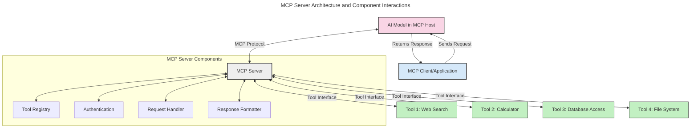
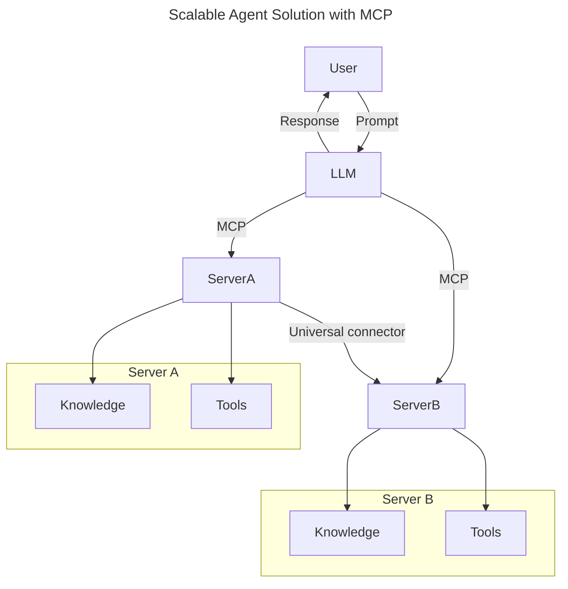
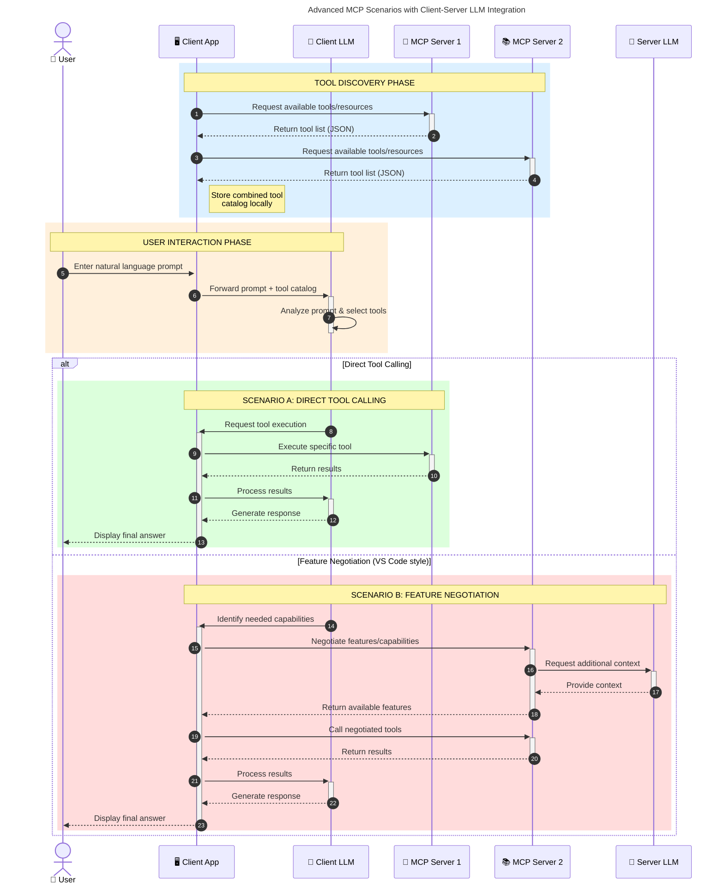

<!--
CO_OP_TRANSLATOR_METADATA:
{
  "original_hash": "105c2ddbb77bc38f7e9df009e1b06e45",
  "translation_date": "2025-07-13T15:30:44+00:00",
  "source_file": "00-Introduction/README.md",
  "language_code": "pa"
}
-->
# ਮਾਡਲ ਕਾਂਟੈਕਸਟ ਪ੍ਰੋਟੋਕੋਲ (MCP) ਦਾ ਪਰਿਚਯ: ਸਕੇਲ ਕਰਨ ਯੋਗ AI ਐਪਲੀਕੇਸ਼ਨਾਂ ਲਈ ਇਹ ਕਿਉਂ ਜਰੂਰੀ ਹੈ

ਜਨਰੇਟਿਵ AI ਐਪਲੀਕੇਸ਼ਨ ਇੱਕ ਵੱਡਾ ਕਦਮ ਹਨ ਕਿਉਂਕਿ ਇਹ ਅਕਸਰ ਯੂਜ਼ਰ ਨੂੰ ਕੁਦਰਤੀ ਭਾਸ਼ਾ ਦੇ ਪ੍ਰਾਂਪਟਾਂ ਰਾਹੀਂ ਐਪ ਨਾਲ ਗੱਲਬਾਤ ਕਰਨ ਦੀ ਆਗਿਆ ਦਿੰਦੇ ਹਨ। ਪਰ ਜਿਵੇਂ ਜਿਵੇਂ ਇਨ੍ਹਾਂ ਐਪਾਂ ਵਿੱਚ ਵਧੇਰੇ ਸਮਾਂ ਅਤੇ ਸਰੋਤ ਲਗਾਏ ਜਾਂਦੇ ਹਨ, ਤੁਹਾਨੂੰ ਇਹ ਯਕੀਨੀ ਬਣਾਉਣਾ ਚਾਹੀਦਾ ਹੈ ਕਿ ਤੁਸੀਂ ਫੰਕਸ਼ਨਾਲਿਟੀ ਅਤੇ ਸਰੋਤਾਂ ਨੂੰ ਇਸ ਤਰ੍ਹਾਂ ਜੋੜ ਸਕੋ ਕਿ ਇਹ ਆਸਾਨੀ ਨਾਲ ਵਧਾਇਆ ਜਾ ਸਕੇ, ਤੁਹਾਡੀ ਐਪ ਇੱਕ ਤੋਂ ਵੱਧ ਮਾਡਲਾਂ ਨੂੰ ਸਹਿਯੋਗ ਦੇ ਸਕੇ ਅਤੇ ਵੱਖ-ਵੱਖ ਮਾਡਲਾਂ ਦੀਆਂ ਜਟਿਲਤਾਵਾਂ ਨੂੰ ਸੰਭਾਲ ਸਕੇ। ਸਧਾਰਨ ਸ਼ਬਦਾਂ ਵਿੱਚ, ਜਨਰੇਟਿਵ AI ਐਪ ਬਣਾਉਣਾ ਸ਼ੁਰੂਆਤ ਵਿੱਚ ਆਸਾਨ ਹੁੰਦਾ ਹੈ, ਪਰ ਜਿਵੇਂ ਇਹ ਵਧਦੇ ਹਨ ਅਤੇ ਜਟਿਲ ਹੋ ਜਾਂਦੇ ਹਨ, ਤੁਹਾਨੂੰ ਇੱਕ ਆਰਕੀਟੈਕਚਰ ਤੈਅ ਕਰਨੀ ਪੈਂਦੀ ਹੈ ਅਤੇ ਇੱਕ ਮਿਆਰੀਕਰਨ 'ਤੇ ਨਿਰਭਰ ਕਰਨਾ ਪੈਂਦਾ ਹੈ ਤਾਂ ਜੋ ਤੁਹਾਡੀਆਂ ਐਪਾਂ ਇੱਕਸਾਰ ਢੰਗ ਨਾਲ ਬਣਾਈਆਂ ਜਾ ਸਕਣ। ਇੱਥੇ MCP ਕੰਮ ਵਿੱਚ ਆਉਂਦਾ ਹੈ ਜੋ ਚੀਜ਼ਾਂ ਨੂੰ ਸੰਗਠਿਤ ਕਰਦਾ ਹੈ ਅਤੇ ਇੱਕ ਮਿਆਰ ਪ੍ਰਦਾਨ ਕਰਦਾ ਹੈ।

---

## **🔍 ਮਾਡਲ ਕਾਂਟੈਕਸਟ ਪ੍ਰੋਟੋਕੋਲ (MCP) ਕੀ ਹੈ?**

**ਮਾਡਲ ਕਾਂਟੈਕਸਟ ਪ੍ਰੋਟੋਕੋਲ (MCP)** ਇੱਕ **ਖੁੱਲ੍ਹਾ, ਮਿਆਰੀਕ੍ਰਿਤ ਇੰਟਰਫੇਸ** ਹੈ ਜੋ ਵੱਡੇ ਭਾਸ਼ਾ ਮਾਡਲਾਂ (LLMs) ਨੂੰ ਬਾਹਰੀ ਟੂਲਾਂ, APIs ਅਤੇ ਡਾਟਾ ਸਰੋਤਾਂ ਨਾਲ ਬਿਨਾਂ ਰੁਕਾਵਟ ਦੇ ਇੰਟਰੈਕਟ ਕਰਨ ਦੀ ਆਗਿਆ ਦਿੰਦਾ ਹੈ। ਇਹ ਇੱਕ ਸਥਿਰ ਆਰਕੀਟੈਕਚਰ ਪ੍ਰਦਾਨ ਕਰਦਾ ਹੈ ਜੋ AI ਮਾਡਲ ਦੀ ਕਾਰਗੁਜ਼ਾਰੀ ਨੂੰ ਉਨ੍ਹਾਂ ਦੇ ਟ੍ਰੇਨਿੰਗ ਡਾਟਾ ਤੋਂ ਬਾਹਰ ਵਧਾਉਂਦਾ ਹੈ, ਜਿਸ ਨਾਲ ਹੋਸ਼ਿਆਰ, ਸਕੇਲ ਕਰਨ ਯੋਗ ਅਤੇ ਜ਼ਿਆਦਾ ਜਵਾਬਦੇਹ AI ਸਿਸਟਮ ਬਣਦੇ ਹਨ।

---

## **🎯 AI ਵਿੱਚ ਮਿਆਰੀਕਰਨ ਕਿਉਂ ਜਰੂਰੀ ਹੈ**

ਜਿਵੇਂ ਜਨਰੇਟਿਵ AI ਐਪਲੀਕੇਸ਼ਨ ਹੋਰ ਜਟਿਲ ਹੁੰਦੀਆਂ ਜਾਂਦੀਆਂ ਹਨ, ਇਹ ਜਰੂਰੀ ਹੈ ਕਿ ਅਜਿਹੇ ਮਿਆਰ ਅਪਣਾਏ ਜਾਣ ਜੋ **ਸਕੇਲਬਿਲਟੀ, ਵਧਾਉਣਯੋਗਤਾ** ਅਤੇ **ਰਖ-ਰਖਾਅ** ਨੂੰ ਯਕੀਨੀ ਬਣਾਉਂਦੇ ਹਨ। MCP ਇਹਨਾਂ ਜ਼ਰੂਰਤਾਂ ਨੂੰ ਪੂਰਾ ਕਰਦਾ ਹੈ:

- ਮਾਡਲ-ਟੂਲ ਇੰਟੀਗ੍ਰੇਸ਼ਨਾਂ ਨੂੰ ਇਕੱਠਾ ਕਰਨਾ  
- ਨਾਜ਼ੁਕ, ਇੱਕ-ਵਾਰੀ ਦੇ ਕਸਟਮ ਹੱਲਾਂ ਨੂੰ ਘਟਾਉਣਾ  
- ਇੱਕ ਹੀ ਪਰਿਸਰ ਵਿੱਚ ਕਈ ਮਾਡਲਾਂ ਨੂੰ ਇਕੱਠਾ ਰੱਖਣਾ  

---

## **📚 ਸਿੱਖਣ ਦੇ ਲਕੜੇ**

ਇਸ ਲੇਖ ਦੇ ਅੰਤ ਤੱਕ, ਤੁਸੀਂ ਸਮਝ ਸਕੋਗੇ:

- **ਮਾਡਲ ਕਾਂਟੈਕਸਟ ਪ੍ਰੋਟੋਕੋਲ (MCP)** ਕੀ ਹੈ ਅਤੇ ਇਸਦੇ ਉਪਯੋਗ  
- MCP ਮਾਡਲ-ਟੂਲ ਸੰਚਾਰ ਨੂੰ ਕਿਵੇਂ ਮਿਆਰੀਕ੍ਰਿਤ ਕਰਦਾ ਹੈ  
- MCP ਆਰਕੀਟੈਕਚਰ ਦੇ ਮੁੱਖ ਹਿੱਸੇ ਕੀ ਹਨ  
- MCP ਦੇ ਵਾਸਤਵਿਕ ਦੁਨੀਆ ਦੇ ਉਪਯੋਗਾਂ ਦੀ ਖੋਜ  

---

## **💡 ਮਾਡਲ ਕਾਂਟੈਕਸਟ ਪ੍ਰੋਟੋਕੋਲ (MCP) ਕਿਉਂ ਇੱਕ ਖੇਡ ਬਦਲਣ ਵਾਲਾ ਹੈ**

### **🔗 MCP AI ਇੰਟਰੈਕਸ਼ਨਾਂ ਵਿੱਚ ਟੁਕੜੇ-ਟੁਕੜੇ ਹੋਣ ਦੀ ਸਮੱਸਿਆ ਹੱਲ ਕਰਦਾ ਹੈ**

MCP ਤੋਂ ਪਹਿਲਾਂ, ਮਾਡਲਾਂ ਨੂੰ ਟੂਲਾਂ ਨਾਲ ਜੋੜਨ ਲਈ ਲੋੜ ਸੀ:

- ਹਰ ਟੂਲ-ਮਾਡਲ ਜੋੜ ਲਈ ਕਸਟਮ ਕੋਡ  
- ਹਰ ਵੇਂਡਰ ਲਈ ਗੈਰ-ਮਿਆਰੀ API  
- ਅਕਸਰ ਅਪਡੇਟਾਂ ਕਾਰਨ ਟੁੱਟਣਾ  
- ਵਧੇਰੇ ਟੂਲਾਂ ਨਾਲ ਘੱਟ ਸਕੇਲਬਿਲਟੀ  

### **✅ MCP ਮਿਆਰੀਕਰਨ ਦੇ ਫਾਇਦੇ**

| **ਫਾਇਦਾ**               | **ਵੇਰਵਾ**                                                                 |
|-------------------------|---------------------------------------------------------------------------|
| ਇੰਟਰਓਪਰੇਬਿਲਿਟੀ         | LLMs ਵੱਖ-ਵੱਖ ਵੇਂਡਰਾਂ ਦੇ ਟੂਲਾਂ ਨਾਲ ਬਿਨਾਂ ਰੁਕਾਵਟ ਕੰਮ ਕਰਦੇ ਹਨ               |
| ਸਥਿਰਤਾ                  | ਪਲੇਟਫਾਰਮਾਂ ਅਤੇ ਟੂਲਾਂ ਵਿੱਚ ਇਕਸਾਰ ਵਰਤਾਰਾ                                  |
| ਦੁਬਾਰਾ ਵਰਤੋਂਯੋਗਤਾ       | ਇੱਕ ਵਾਰੀ ਬਣਾਏ ਟੂਲ ਪ੍ਰੋਜੈਕਟਾਂ ਅਤੇ ਸਿਸਟਮਾਂ ਵਿੱਚ ਵਰਤੇ ਜਾ ਸਕਦੇ ਹਨ              |
| ਵਿਕਾਸ ਦੀ ਤੇਜ਼ੀ            | ਮਿਆਰੀਕ੍ਰਿਤ, ਪਲੱਗ-ਅਤੇ-ਪਲੇਅ ਇੰਟਰਫੇਸਾਂ ਨਾਲ ਵਿਕਾਸ ਸਮਾਂ ਘਟਾਉਣਾ               |

---

## **🧱 MCP ਆਰਕੀਟੈਕਚਰ ਦਾ ਉੱਚ-ਸਤਰ ਦਾ ਜਾਇਜ਼ਾ**

MCP ਇੱਕ **ਕਲਾਇੰਟ-ਸਰਵਰ ਮਾਡਲ** ਨੂੰ ਫਾਲੋ ਕਰਦਾ ਹੈ, ਜਿੱਥੇ:

- **MCP Hosts** AI ਮਾਡਲ ਚਲਾਉਂਦੇ ਹਨ  
- **MCP Clients** ਬੇਨਤੀਆਂ ਸ਼ੁਰੂ ਕਰਦੇ ਹਨ  
- **MCP Servers** ਕਾਂਟੈਕਸਟ, ਟੂਲ ਅਤੇ ਸਮਰੱਥਾਵਾਂ ਪ੍ਰਦਾਨ ਕਰਦੇ ਹਨ  

### **ਮੁੱਖ ਹਿੱਸੇ:**

- **Resources** – ਮਾਡਲਾਂ ਲਈ ਸਥਿਰ ਜਾਂ ਗਤੀਸ਼ੀਲ ਡਾਟਾ  
- **Prompts** – ਮਾਰਗਦਰਸ਼ਿਤ ਜਨਰੇਸ਼ਨ ਲਈ ਪਹਿਲਾਂ ਤੈਅ ਕੀਤੇ ਵਰਕਫਲੋ  
- **Tools** – ਖੋਜ, ਗਣਨਾ ਵਰਗੇ ਕਾਰਜਕਾਰੀ ਫੰਕਸ਼ਨ  
- **Sampling** – ਦੁਹਰਾਏ ਜਾਣ ਵਾਲੇ ਇੰਟਰੈਕਸ਼ਨਾਂ ਰਾਹੀਂ ਏਜੰਟਿਕ ਵਿਹਾਰ  

---

## MCP ਸਰਵਰ ਕਿਵੇਂ ਕੰਮ ਕਰਦੇ ਹਨ

MCP ਸਰਵਰ ਹੇਠਾਂ ਦਿੱਤੇ ਤਰੀਕੇ ਨਾਲ ਕੰਮ ਕਰਦੇ ਹਨ:

- **ਬੇਨਤੀ ਦਾ ਪ੍ਰਵਾਹ**:  
    1. MCP Client ਇੱਕ ਬੇਨਤੀ MCP Host ਵਿੱਚ ਚੱਲ ਰਹੇ AI ਮਾਡਲ ਨੂੰ ਭੇਜਦਾ ਹੈ।  
    2. AI ਮਾਡਲ ਪਛਾਣਦਾ ਹੈ ਕਿ ਕਦੋਂ ਉਸਨੂੰ ਬਾਹਰੀ ਟੂਲਾਂ ਜਾਂ ਡਾਟਾ ਦੀ ਲੋੜ ਹੈ।  
    3. ਮਾਡਲ ਮਿਆਰੀਕ੍ਰਿਤ ਪ੍ਰੋਟੋਕੋਲ ਦੀ ਵਰਤੋਂ ਕਰਕੇ MCP ਸਰਵਰ ਨਾਲ ਸੰਚਾਰ ਕਰਦਾ ਹੈ।  

- **MCP ਸਰਵਰ ਦੀ ਕਾਰਗੁਜ਼ਾਰੀ**:  
    - ਟੂਲ ਰਜਿਸਟਰੀ: ਉਪਲਬਧ ਟੂਲਾਂ ਅਤੇ ਉਨ੍ਹਾਂ ਦੀਆਂ ਸਮਰੱਥਾਵਾਂ ਦਾ ਕੈਟਾਲੌਗ ਰੱਖਦਾ ਹੈ।  
    - ਪ੍ਰਮਾਣਿਕਤਾ: ਟੂਲ ਐਕਸੈਸ ਲਈ ਅਧਿਕਾਰਾਂ ਦੀ ਜਾਂਚ ਕਰਦਾ ਹੈ।  
    - ਬੇਨਤੀ ਹੈਂਡਲਰ: ਮਾਡਲ ਤੋਂ ਆਉਣ ਵਾਲੀਆਂ ਟੂਲ ਬੇਨਤੀਆਂ ਨੂੰ ਪ੍ਰਕਿਰਿਆ ਕਰਦਾ ਹੈ।  
    - ਜਵਾਬ ਫਾਰਮੈਟਰ: ਟੂਲ ਦੇ ਨਤੀਜੇ ਮਾਡਲ ਲਈ ਸਮਝਣਯੋਗ ਫਾਰਮੈਟ ਵਿੱਚ ਤਿਆਰ ਕਰਦਾ ਹੈ।  

- **ਟੂਲ ਕਾਰਜਨਵਾਈ**:  
    - ਸਰਵਰ ਬੇਨਤੀਆਂ ਨੂੰ ਸਹੀ ਬਾਹਰੀ ਟੂਲਾਂ ਵੱਲ ਰੂਟ ਕਰਦਾ ਹੈ  
    - ਟੂਲ ਆਪਣੇ ਵਿਸ਼ੇਸ਼ ਕਾਰਜ (ਖੋਜ, ਗਣਨਾ, ਡਾਟਾਬੇਸ ਪੁੱਛਗਿੱਛ ਆਦਿ) ਕਰਦੇ ਹਨ  
    - ਨਤੀਜੇ ਮਾਡਲ ਨੂੰ ਇੱਕਸਾਰ ਫਾਰਮੈਟ ਵਿੱਚ ਵਾਪਸ ਭੇਜੇ ਜਾਂਦੇ ਹਨ  

- **ਜਵਾਬ ਪੂਰਾ ਹੋਣਾ**:  
    - AI ਮਾਡਲ ਟੂਲ ਦੇ ਨਤੀਜਿਆਂ ਨੂੰ ਆਪਣੇ ਜਵਾਬ ਵਿੱਚ ਸ਼ਾਮਲ ਕਰਦਾ ਹੈ  
    - ਅੰਤਿਮ ਜਵਾਬ ਕਲਾਇੰਟ ਐਪਲੀਕੇਸ਼ਨ ਨੂੰ ਭੇਜਿਆ ਜਾਂਦਾ ਹੈ  

## 👨‍💻 MCP ਸਰਵਰ ਕਿਵੇਂ ਬਣਾਇਆ ਜਾਵੇ (ਉਦਾਹਰਣਾਂ ਸਮੇਤ)

MCP ਸਰਵਰ ਤੁਹਾਨੂੰ LLM ਸਮਰੱਥਾਵਾਂ ਨੂੰ ਡਾਟਾ ਅਤੇ ਫੰਕਸ਼ਨਾਲਿਟੀ ਦੇ ਕੇ ਵਧਾਉਣ ਦੀ ਆਗਿਆ ਦਿੰਦੇ ਹਨ।

ਤਿਆਰ ਹੋ? ਇੱਥੇ ਵੱਖ-ਵੱਖ ਭਾਸ਼ਾਵਾਂ ਵਿੱਚ ਸਧਾਰਣ MCP ਸਰਵਰ ਬਣਾਉਣ ਦੇ ਉਦਾਹਰਣ ਹਨ:

- **Python Example**: https://github.com/modelcontextprotocol/python-sdk

- **TypeScript Example**: https://github.com/modelcontextprotocol/typescript-sdk

- **Java Example**: https://github.com/modelcontextprotocol/java-sdk

- **C#/.NET Example**: https://github.com/modelcontextprotocol/csharp-sdk

## 🌍 MCP ਦੇ ਵਾਸਤਵਿਕ ਦੁਨੀਆ ਦੇ ਉਪਯੋਗ

MCP AI ਸਮਰੱਥਾਵਾਂ ਨੂੰ ਵਧਾ ਕੇ ਵੱਖ-ਵੱਖ ਐਪਲੀਕੇਸ਼ਨਾਂ ਨੂੰ ਯੋਗ ਬਣਾਉਂਦਾ ਹੈ:

| **ਐਪਲੀਕੇਸ਼ਨ**              | **ਵੇਰਵਾ**                                                                 |
|-----------------------------|---------------------------------------------------------------------------|
| ਐਂਟਰਪ੍ਰਾਈਜ਼ ਡਾਟਾ ਇੰਟੀਗ੍ਰੇਸ਼ਨ | LLMs ਨੂੰ ਡਾਟਾਬੇਸ, CRM ਜਾਂ ਅੰਦਰੂਨੀ ਟੂਲਾਂ ਨਾਲ ਜੋੜਨਾ                      |
| ਏਜੰਟਿਕ AI ਸਿਸਟਮ             | ਟੂਲ ਐਕਸੈਸ ਅਤੇ ਫੈਸਲਾ-ਲੈਣ ਵਾਲੇ ਵਰਕਫਲੋਜ਼ ਨਾਲ ਸੁਤੰਤਰ ਏਜੰਟ ਬਣਾਉਣਾ          |
| ਮਲਟੀ-ਮੋਡਲ ਐਪਲੀਕੇਸ਼ਨ        | ਇੱਕ ਹੀ ਏਆਈ ਐਪ ਵਿੱਚ ਟੈਕਸਟ, ਚਿੱਤਰ ਅਤੇ ਆਡੀਓ ਟੂਲਾਂ ਨੂੰ ਜੋੜਨਾ              |
| ਰੀਅਲ-ਟਾਈਮ ਡਾਟਾ ਇੰਟੀਗ੍ਰੇਸ਼ਨ | AI ਇੰਟਰੈਕਸ਼ਨਾਂ ਵਿੱਚ ਤਾਜ਼ਾ ਡਾਟਾ ਲਿਆਉਣਾ ਤਾਂ ਜੋ ਨਤੀਜੇ ਹੋਰ ਸਹੀ ਹੋਣ          |

### 🧠 MCP = AI ਇੰਟਰੈਕਸ਼ਨਾਂ ਲਈ ਯੂਨੀਵਰਸਲ ਮਿਆਰ

ਮਾਡਲ ਕਾਂਟੈਕਸਟ ਪ੍ਰੋਟੋਕੋਲ (MCP) AI ਇੰਟਰੈਕਸ਼ਨਾਂ ਲਈ ਇੱਕ ਯੂਨੀਵਰਸਲ ਮਿਆਰ ਵਜੋਂ ਕੰਮ ਕਰਦਾ ਹੈ, ਜਿਵੇਂ USB-C ਨੇ ਡਿਵਾਈਸਾਂ ਲਈ ਭੌਤਿਕ ਕਨੈਕਸ਼ਨਾਂ ਨੂੰ ਮਿਆਰੀਕ੍ਰਿਤ ਕੀਤਾ। AI ਦੀ ਦੁਨੀਆ ਵਿੱਚ, MCP ਇੱਕ ਸਥਿਰ ਇੰਟਰਫੇਸ ਪ੍ਰਦਾਨ ਕਰਦਾ ਹੈ, ਜਿਸ ਨਾਲ ਮਾਡਲ (ਕਲਾਇੰਟ) ਬਾਹਰੀ ਟੂਲਾਂ ਅਤੇ ਡਾਟਾ ਪ੍ਰਦਾਤਾਵਾਂ (ਸਰਵਰ) ਨਾਲ ਬਿਨਾਂ ਰੁਕਾਵਟ ਜੁੜ ਸਕਦੇ ਹਨ। ਇਸ ਨਾਲ ਹਰ API ਜਾਂ ਡਾਟਾ ਸਰੋਤ ਲਈ ਵੱਖ-ਵੱਖ, ਕਸਟਮ ਪ੍ਰੋਟੋਕੋਲ ਦੀ ਲੋੜ ਖਤਮ ਹੋ ਜਾਂਦੀ ਹੈ।

MCP ਅਨੁਕੂਲ ਟੂਲ (ਜਿਸਨੂੰ MCP ਸਰਵਰ ਕਿਹਾ ਜਾਂਦਾ ਹੈ) ਇੱਕ ਇਕਸਾਰ ਮਿਆਰ ਦੀ ਪਾਲਣਾ ਕਰਦਾ ਹੈ। ਇਹ ਸਰਵਰ ਉਪਲਬਧ ਟੂਲਾਂ ਜਾਂ ਕਾਰਵਾਈਆਂ ਦੀ ਸੂਚੀ ਦਿੰਦੇ ਹਨ ਅਤੇ ਜਦੋਂ AI ਏਜੰਟ ਮੰਗ ਕਰਦਾ ਹੈ ਤਾਂ ਉਹਨਾਂ ਕਾਰਵਾਈਆਂ ਨੂੰ ਚਲਾਉਂਦੇ ਹਨ। MCP ਨੂੰ ਸਹਿਯੋਗ ਦੇਣ ਵਾਲੇ AI ਏਜੰਟ ਪਲੇਟਫਾਰਮ ਸਰਵਰਾਂ ਤੋਂ ਉਪਲਬਧ ਟੂਲਾਂ ਨੂੰ ਖੋਜ ਸਕਦੇ ਹਨ ਅਤੇ ਇਸ ਮਿਆਰੀਕ੍ਰਿਤ ਪ੍ਰੋਟੋਕੋਲ ਰਾਹੀਂ ਉਨ੍ਹਾਂ ਨੂੰ ਕਾਲ ਕਰ ਸਕਦੇ ਹਨ।

### 💡 ਗਿਆਨ ਤੱਕ ਪਹੁੰਚ ਨੂੰ ਆਸਾਨ ਬਣਾਉਂਦਾ ਹੈ

ਟੂਲਾਂ ਦੇ ਨਾਲ-ਨਾਲ, MCP ਗਿਆਨ ਤੱਕ ਪਹੁੰਚ ਨੂੰ ਵੀ ਆਸਾਨ ਬਣਾਉਂਦਾ ਹੈ। ਇਹ ਐਪਲੀਕੇਸ਼ਨਾਂ ਨੂੰ ਵੱਡੇ ਭਾਸ਼ਾ ਮਾਡਲਾਂ (LLMs) ਨੂੰ ਕਾਂਟੈਕਸਟ ਪ੍ਰਦਾਨ ਕਰਨ ਦੀ ਆਗਿਆ ਦਿੰਦਾ ਹੈ ਜਿਵੇਂ ਕਿ ਵੱਖ-ਵੱਖ ਡਾਟਾ ਸਰੋਤਾਂ ਨਾਲ ਜੋੜ ਕੇ। ਉਦਾਹਰਣ ਵਜੋਂ, ਇੱਕ MCP ਸਰਵਰ ਕਿਸੇ ਕੰਪਨੀ ਦੇ ਦਸਤਾਵੇਜ਼ ਸੰਗ੍ਰਹਿ ਦਾ ਪ੍ਰਤੀਨਿਧਿਤ ਕਰ ਸਕਦਾ ਹੈ, ਜਿਸ ਨਾਲ ਏਜੰਟ ਮੰਗ 'ਤੇ ਸੰਬੰਧਿਤ ਜਾਣਕਾਰੀ ਪ੍ਰਾਪਤ ਕਰ ਸਕਦੇ ਹਨ। ਦੂਜਾ ਸਰਵਰ ਖਾਸ ਕਾਰਵਾਈਆਂ ਜਿਵੇਂ ਈਮੇਲ ਭੇਜਣਾ ਜਾਂ ਰਿਕਾਰਡ ਅਪਡੇਟ ਕਰਨਾ ਸੰਭਾਲ ਸਕਦਾ ਹੈ। ਏਜੰਟ ਦੇ ਨਜ਼ਰੀਏ ਤੋਂ, ਇਹ ਸਿਰਫ ਟੂਲ ਹਨ—ਕੁਝ ਟੂਲ ਡਾਟਾ (ਗਿਆਨ ਕਾਂਟੈਕਸਟ) ਵਾਪਸ ਕਰਦੇ ਹਨ, ਜਦਕਿ ਹੋਰ ਕਾਰਵਾਈਆਂ ਕਰਦੇ ਹਨ। MCP ਦੋਹਾਂ ਨੂੰ ਪ੍ਰਭਾਵਸ਼ਾਲੀ ਢੰਗ ਨਾਲ ਸੰਭਾਲਦਾ ਹੈ।

ਜਦੋਂ ਕੋਈ ਏਜੰਟ MCP ਸਰਵਰ ਨਾਲ ਜੁੜਦਾ ਹੈ, ਤਾਂ ਉਹ ਸਰਵਰ ਦੀਆਂ ਉਪਲਬਧ ਸਮਰੱਥਾਵਾਂ ਅਤੇ ਡਾਟਾ ਨੂੰ ਇੱਕ ਮਿਆਰੀ ਫਾਰਮੈਟ ਰਾਹੀਂ ਆਪਣੇ ਆਪ ਸਿੱਖ ਲੈਂਦਾ ਹੈ। ਇਹ ਮਿਆਰੀਕਰਨ ਗਤੀਸ਼ੀਲ ਟੂਲ ਉਪਲਬਧਤਾ ਨੂੰ ਯਕੀਨੀ ਬਣਾਉਂਦਾ ਹੈ। ਉਦਾਹਰਣ ਵਜੋਂ, ਇੱਕ ਨਵਾਂ MCP ਸਰਵਰ ਏਜੰਟ ਦੇ ਸਿਸਟਮ ਵਿੱਚ ਸ਼ਾਮਲ ਕਰਨ ਨਾਲ ਉਸਦੇ ਫੰਕਸ਼ਨ ਤੁਰੰਤ ਵਰਤੇ ਜਾ ਸਕਦੇ ਹਨ ਬਿਨਾਂ ਏਜੰਟ ਦੇ ਨਿਰਦੇਸ਼ਾਂ ਵਿੱਚ ਹੋਰ ਬਦਲਾਅ ਕੀਤੇ।

ਇਹ ਸਧਾਰਨ ਇੰਟੀਗ੍ਰੇਸ਼ਨ ਉਸ ਪ੍ਰਵਾਹ ਨਾਲ ਮੇਲ ਖਾਂਦੀ ਹੈ ਜੋ ਮਰਮੇਡ ਡਾਇਗ੍ਰਾਮ ਵਿੱਚ ਦਰਸਾਇਆ ਗਿਆ ਹੈ, ਜਿੱਥੇ ਸਰਵਰ ਦੋਹਾਂ ਟੂਲ ਅਤੇ ਗਿਆਨ ਪ੍ਰਦਾਨ ਕਰਦੇ ਹਨ, ਜਿਸ ਨਾਲ ਸਿਸਟਮਾਂ ਵਿੱਚ ਬਿਨਾਂ ਰੁਕਾਵਟ ਸਹਿਯੋਗ ਹੁੰਦਾ ਹੈ।

### 👉 ਉਦਾਹਰਣ: ਸਕੇਲ ਕਰਨ ਯੋਗ ਏਜੰਟ ਹੱਲ

### 🔄 ਕਲਾਇੰਟ-ਸਾਈਡ LLM ਇੰਟੀਗ੍ਰੇਸ਼ਨ ਨਾਲ ਉੱਨਤ MCP ਸਥਿਤੀਆਂ

ਮੂਲ MCP ਆਰਕੀਟੈਕਚਰ ਤੋਂ ਇਲਾਵਾ, ਕੁਝ ਉੱਨਤ ਸਥਿਤੀਆਂ ਹਨ ਜਿੱਥੇ ਦੋਹਾਂ ਕਲਾਇੰਟ ਅਤੇ ਸਰਵਰ ਵਿੱਚ LLM ਹੁੰਦੇ ਹਨ, ਜੋ ਹੋਰ ਸੁਧਰੇ ਹੋਏ ਇੰਟਰੈਕਸ਼ਨਾਂ ਨੂੰ ਯੋਗ ਬਣਾਉਂਦੇ ਹਨ:

## 🔐 MCP ਦੇ ਵਿਹਾਰਕ ਫਾਇਦੇ

MCP ਵਰਤਣ ਦੇ ਕੁਝ ਵਿਹਾਰਕ ਫਾਇਦੇ ਹਨ:

- **ਤਾਜ਼ਗੀ**: ਮਾਡਲ ਆਪਣੇ ਟ੍ਰੇਨਿੰਗ ਡਾਟਾ ਤੋਂ ਬਾਹਰ ਤਾਜ਼ਾ ਜਾਣਕਾਰੀ ਤੱਕ ਪਹੁੰਚ ਸਕਦੇ ਹਨ  
- **ਸਮਰੱਥਾ ਵਾਧਾ**: ਮਾਡਲ ਉਹ ਕੰਮ ਕਰਨ ਲਈ ਵਿਸ਼ੇਸ਼ ਟੂਲਾਂ ਦੀ ਵਰਤੋਂ ਕਰ ਸਕਦੇ ਹਨ ਜਿਨ੍ਹਾਂ ਲਈ ਉਹ ਟ੍ਰੇਨ ਨਹੀਂ ਕੀਤੇ ਗਏ  
- **ਘਟੇ ਹੋਏ ਭਰਮ**: ਬਾਹਰੀ ਡਾਟਾ ਸਰੋਤ ਤੱਥਾਂ 'ਤੇ ਆਧਾਰਿਤ ਜਾਣਕਾਰੀ ਦਿੰਦੇ ਹਨ  
- **ਪ੍ਰਾਈਵੇਸੀ**: ਸੰਵੇਦਨਸ਼ੀਲ ਡਾਟਾ ਸੁਰੱਖਿਅਤ ਵਾਤਾਵਰਣ ਵਿੱਚ ਰਹਿ ਸਕਦਾ ਹੈ ਬਜਾਏ ਪ੍ਰਾਂਪਟਾਂ ਵਿੱਚ ਸ਼ਾਮਲ ਹੋਣ ਦੇ  

## 📌 ਮੁੱਖ ਗੱਲਾਂ

MCP ਵਰਤਣ ਲਈ ਕੁਝ ਮੁੱਖ ਗੱਲਾਂ:

- **MCP** AI ਮਾਡਲਾਂ ਦੇ ਟੂਲਾਂ ਅਤੇ ਡਾਟਾ ਨਾਲ ਇੰਟਰੈਕਸ਼ਨ ਨੂੰ ਮਿਆਰੀਕ੍ਰਿਤ ਕਰਦਾ ਹੈ  
- **ਵਧਾਉਣਯੋਗਤਾ, ਸਥਿਰਤਾ ਅਤੇ ਇੰਟਰਓਪਰੇਬਿਲਿਟੀ** ਨੂੰ ਪ੍ਰੋਤਸਾਹਿਤ ਕਰਦਾ ਹੈ  
- MCP ਵਿਕਾਸ ਸਮਾਂ ਘਟਾਉਂਦਾ ਹੈ, ਭਰੋਸੇਯੋਗਤਾ ਸੁਧਾਰਦਾ ਹੈ ਅਤੇ ਮਾਡਲ ਸਮਰੱਥਾਵਾਂ ਨੂੰ ਵਧਾਉਂਦਾ ਹੈ  
- ਕਲਾਇੰਟ-ਸਰਵਰ ਆਰਕੀਟੈਕਚਰ ਲਚਕੀਲੇ, ਵਧਾਉਣਯੋਗ AI ਐਪਲੀਕੇਸ਼ਨਾਂ ਨੂੰ ਯੋਗ ਬਣਾਉਂਦਾ ਹੈ  

## 🧠 ਅਭਿਆਸ

ਆਪਣੇ ਮਨ ਵਿੱਚ ਇੱਕ AI ਐਪਲੀਕੇਸ਼ਨ ਬਨਾਉਣ ਬਾਰੇ ਸੋਚੋ।

- ਕਿਹੜੇ **ਬਾਹਰੀ ਟੂਲ ਜਾਂ ਡਾਟਾ** ਇਸ ਦੀ ਸਮਰੱਥਾ ਵਧਾ ਸਕਦੇ ਹਨ?  
- MCP ਇੰਟੀਗ੍ਰ

**ਅਸਵੀਕਾਰੋਪਣ**:  
ਇਹ ਦਸਤਾਵੇਜ਼ AI ਅਨੁਵਾਦ ਸੇਵਾ [Co-op Translator](https://github.com/Azure/co-op-translator) ਦੀ ਵਰਤੋਂ ਕਰਕੇ ਅਨੁਵਾਦਿਤ ਕੀਤਾ ਗਿਆ ਹੈ। ਜਦੋਂ ਕਿ ਅਸੀਂ ਸਹੀਤਾ ਲਈ ਕੋਸ਼ਿਸ਼ ਕਰਦੇ ਹਾਂ, ਕਿਰਪਾ ਕਰਕੇ ਧਿਆਨ ਰੱਖੋ ਕਿ ਸਵੈਚਾਲਿਤ ਅਨੁਵਾਦਾਂ ਵਿੱਚ ਗਲਤੀਆਂ ਜਾਂ ਅਸਮਰਥਤਾਵਾਂ ਹੋ ਸਕਦੀਆਂ ਹਨ। ਮੂਲ ਦਸਤਾਵੇਜ਼ ਆਪਣੀ ਮੂਲ ਭਾਸ਼ਾ ਵਿੱਚ ਪ੍ਰਮਾਣਿਕ ਸਰੋਤ ਮੰਨਿਆ ਜਾਣਾ ਚਾਹੀਦਾ ਹੈ। ਮਹੱਤਵਪੂਰਨ ਜਾਣਕਾਰੀ ਲਈ, ਪੇਸ਼ੇਵਰ ਮਨੁੱਖੀ ਅਨੁਵਾਦ ਦੀ ਸਿਫਾਰਸ਼ ਕੀਤੀ ਜਾਂਦੀ ਹੈ। ਇਸ ਅਨੁਵਾਦ ਦੀ ਵਰਤੋਂ ਤੋਂ ਉਤਪੰਨ ਕਿਸੇ ਵੀ ਗਲਤਫਹਮੀ ਜਾਂ ਗਲਤ ਵਿਆਖਿਆ ਲਈ ਅਸੀਂ ਜ਼ਿੰਮੇਵਾਰ ਨਹੀਂ ਹਾਂ।