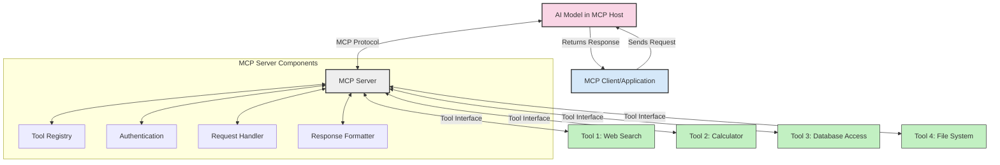
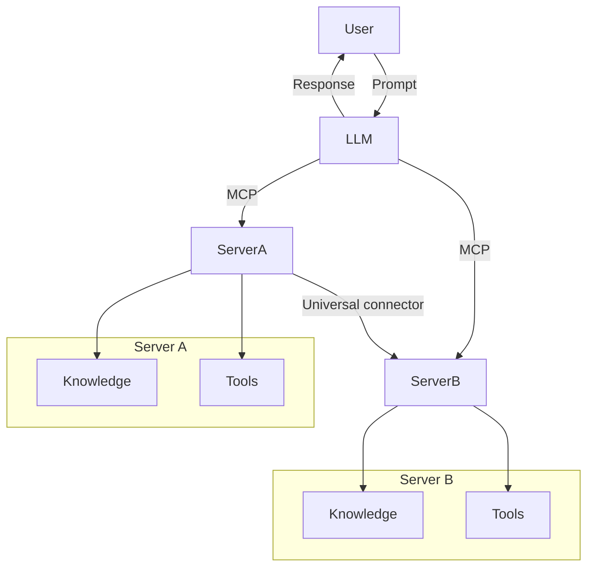

<!--
CO_OP_TRANSLATOR_METADATA:
{
  "original_hash": "02301140adbd807ecf0f17720fa307bc",
  "translation_date": "2025-05-17T05:58:02+00:00",
  "source_file": "00-Introduction/README.md",
  "language_code": "pa"
}
-->
# ਮਾਡਲ ਸੰਦਰਭ ਪ੍ਰੋਟੋਕੋਲ (MCP) ਦਾ ਪਰਿਚਯ: ਵਧ ਸਕੇਲਯੋਗ AI ਐਪਲੀਕੇਸ਼ਨਾਂ ਲਈ ਇਸਦੀ ਮਹੱਤਤਾ

ਜਨਰੇਟਿਵ AI ਐਪਲੀਕੇਸ਼ਨਾਂ ਵੱਡਾ ਅੱਗੇ ਵਧਣ ਵਾਲਾ ਕਦਮ ਹਨ ਕਿਉਂਕਿ ਇਹ ਅਕਸਰ ਉਪਭੋਗਤਾ ਨੂੰ ਕੁਦਰਤੀ ਭਾਸ਼ਾ ਦੇ ਪ੍ਰੋਮਪਟਾਂ ਦੀ ਵਰਤੋਂ ਕਰਕੇ ਐਪ ਨਾਲ ਗੱਲਬਾਤ ਕਰਨ ਦੀ ਆਗਿਆ ਦਿੰਦੇ ਹਨ। ਹਾਲਾਂਕਿ, ਜਿਵੇਂ ਜਿਵੇਂ ਇਸ ਤਰ੍ਹਾਂ ਦੀਆਂ ਐਪਸ ਵਿੱਚ ਵਧੇਰੇ ਸਮਾਂ ਅਤੇ ਸਰੋਤ ਲਗਾਏ ਜਾਂਦੇ ਹਨ, ਤੁਸੀਂ ਯਕੀਨੀ ਬਣਾਉਣਾ ਚਾਹੁੰਦੇ ਹੋ ਕਿ ਤੁਸੀਂ ਅਸਾਨੀ ਨਾਲ ਫੰਕਸ਼ਨਾਲਿਟੀ ਅਤੇ ਸਰੋਤਾਂ ਨੂੰ ਇਸ ਤਰ੍ਹਾਂ ਜੋੜ ਸਕਦੇ ਹੋ ਕਿ ਇਸਨੂੰ ਵਧਾਉਣਾ ਆਸਾਨ ਹੈ, ਤੁਹਾਡੀ ਐਪ ਇੱਕ ਤੋਂ ਵੱਧ ਮਾਡਲ ਦੀ ਵਰਤੋਂ ਕਰ ਸਕਦੀ ਹੈ, ਅਤੇ ਇਸ ਦੀਆਂ ਜਟਿਲਤਾਵਾਂ। ਖਾਸ ਤੌਰ 'ਤੇ, ਜਨ AI ਐਪਸ ਬਣਾਉਣਾ ਸ਼ੁਰੂ ਕਰਨ ਲਈ ਆਸਾਨ ਹੈ ਪਰ ਜਿਵੇਂ ਜਿਵੇਂ ਇਹ ਵਧਦਾ ਹੈ ਅਤੇ ਵਧੇਰੇ ਕਠਿਨ ਹੋ ਜਾਂਦਾ ਹੈ, ਤੁਹਾਨੂੰ ਇੱਕ ਆਰਕੀਟੈਕਚਰ ਦੀ ਵਿਆਖਿਆ ਕਰਨ ਦੀ ਲੋੜ ਹੁੰਦੀ ਹੈ ਅਤੇ ਸਭ ਤੋਂ ਸੰਭਾਵਨਾ ਹੈ ਕਿ ਤੁਹਾਨੂੰ ਇੱਕ ਮਿਆਰ 'ਤੇ ਨਿਰਭਰ ਕਰਨਾ ਪਵੇਗਾ ਇਹ ਯਕੀਨੀ ਬਣਾਉਣ ਲਈ ਕਿ ਤੁਹਾਡੀਆਂ ਐਪਸ ਇੱਕ ਸਥਿਰ ਢੰਗ ਨਾਲ ਬਣਾਈਆਂ ਗਈਆਂ ਹਨ। ਇੱਥੇ ਹੀ MCP ਚੀਜ਼ਾਂ ਨੂੰ ਸੰਗਠਿਤ ਕਰਨ ਲਈ ਆਉਂਦਾ ਹੈ, ਇੱਕ ਮਿਆਰ ਪ੍ਰਦਾਨ ਕਰਨ ਲਈ।

---

## **🔍 ਮਾਡਲ ਸੰਦਰਭ ਪ੍ਰੋਟੋਕੋਲ (MCP) ਕੀ ਹੈ?**

**ਮਾਡਲ ਸੰਦਰਭ ਪ੍ਰੋਟੋਕੋਲ (MCP)** ਇੱਕ **ਖੁੱਲਾ, ਮਿਆਰੀ ਇੰਟਰਫੇਸ** ਹੈ ਜੋ ਵੱਡੇ ਭਾਸ਼ਾਈ ਮਾਡਲਾਂ (LLMs) ਨੂੰ ਬਾਹਰੀ ਟੂਲ, API ਅਤੇ ਡੇਟਾ ਸਰੋਤਾਂ ਨਾਲ ਬਿਨਾ ਕਿਸੇ ਰੁਕਾਵਟ ਦੇ ਗੱਲਬਾਤ ਕਰਨ ਦੀ ਆਗਿਆ ਦਿੰਦਾ ਹੈ। ਇਹ ਇੱਕ ਸਥਿਰ ਆਰਕੀਟੈਕਚਰ ਪ੍ਰਦਾਨ ਕਰਦਾ ਹੈ ਜੋ ਉਨ੍ਹਾਂ ਦੇ ਪ੍ਰਸ਼ਿਕਸ਼ਣ ਡੇਟਾ ਤੋਂ ਪਰੇ AI ਮਾਡਲ ਫੰਕਸ਼ਨਲਿਟੀ ਨੂੰ ਵਧਾਉਂਦਾ ਹੈ, ਸਿਆਣੇ, ਵਧ ਸਕੇਲਯੋਗ, ਅਤੇ ਵਧੇਰੇ ਪ੍ਰਤਿਕ੍ਰਿਆਸ਼ੀਲ AI ਸਿਸਟਮਾਂ ਨੂੰ ਯੋਗ ਬਣਾਉਂਦਾ ਹੈ।

---

## **🎯 AI ਵਿੱਚ ਮਿਆਰੀਕਰਨ ਕਿਉਂ ਮਹੱਤਵਪੂਰਨ ਹੈ**

ਜਿਵੇਂ ਜਨਰੇਟਿਵ AI ਐਪਲੀਕੇਸ਼ਨ ਵਧੇਰੇ ਜਟਿਲ ਹੋ ਜਾਂਦੇ ਹਨ, ਇਹ ਮਹੱਤਵਪੂਰਨ ਹੈ ਕਿ ਮਿਆਰਾਂ ਨੂੰ ਅਪਣਾਇਆ ਜਾਵੇ ਜੋ **ਸਕੇਲਯੋਗਤਾ, ਵਧਾਉਣਯੋਗਤਾ**, ਅਤੇ **ਸੰਭਾਲਯੋਗਤਾ** ਨੂੰ ਯਕੀਨੀ ਬਣਾਉਂਦੇ ਹਨ। MCP ਇਨ੍ਹਾਂ ਲੋੜਾਂ ਨੂੰ ਪੂਰਾ ਕਰਦਾ ਹੈ:

- ਮਾਡਲ-ਟੂਲ ਇੰਟੀਗ੍ਰੇਸ਼ਨ ਨੂੰ ਇਕਸਾਰ ਕਰਨਾ
- ਕਮਜ਼ੋਰ, ਇੱਕ-ਵਾਰ ਦੀਆਂ ਕਸਟਮ ਹੱਲਾਂ ਨੂੰ ਘਟਾਉਣਾ
- ਇੱਕ ਪਰਿਸਥਿਤਕੀ ਤੰਤ੍ਰ ਵਿੱਚ ਕਈ ਮਾਡਲਾਂ ਨੂੰ ਸਹਿ-ਅਸਤੀਤਵ ਕਰਨ ਦੀ ਆਗਿਆ ਦੇਣਾ

---

## **📚 ਸਿੱਖਣ ਦੇ ਲਕਸ਼**

ਇਸ ਲੇਖ ਦੇ ਅੰਤ ਤੱਕ, ਤੁਸੀਂ ਸਮਰਥ ਹੋਵੋਗੇ:

- **ਮਾਡਲ ਸੰਦਰਭ ਪ੍ਰੋਟੋਕੋਲ (MCP)** ਅਤੇ ਇਸਦੇ ਵਰਤੋਂ ਦੇ ਮਾਮਲਿਆਂ ਨੂੰ ਪਰਿਭਾਸ਼ਿਤ ਕਰੋ
- ਸਮਝੋ ਕਿ MCP ਮਾਡਲ-ਟੂ-ਟੂਲ ਸੰਚਾਰ ਨੂੰ ਕਿਵੇਂ ਮਿਆਰੀਕ੍ਰਿਤ ਕਰਦਾ ਹੈ
- MCP ਆਰਕੀਟੈਕਚਰ ਦੇ ਮੁੱਖ ਹਿੱਸਿਆਂ ਦੀ ਪਛਾਣ ਕਰੋ
- ਐਨਟਰਪ੍ਰਾਈਜ਼ ਅਤੇ ਵਿਕਾਸ ਸੰਦਰਭਾਂ ਵਿੱਚ MCP ਦੇ ਵਾਸਤਵਿਕ-ਜਗਤ ਦੇ ਐਪਲੀਕੇਸ਼ਨ ਨੂੰ ਖੋਜੋ

---

## **💡 ਮਾਡਲ ਸੰਦਰਭ ਪ੍ਰੋਟੋਕੋਲ (MCP) ਕਿਉਂ ਖੇਡ-ਬਦਲਣ ਵਾਲਾ ਹੈ**

### **🔗 MCP AI ਗੱਲਬਾਤਾਂ ਵਿੱਚ ਖੰਡਨ ਦਾ ਹੱਲ ਕਰਦਾ ਹੈ**

MCP ਤੋਂ ਪਹਿਲਾਂ, ਮਾਡਲਾਂ ਨੂੰ ਟੂਲਾਂ ਨਾਲ ਜੋੜਨ ਲਈ ਲੋੜ ਸੀ:

- ਪ੍ਰਤੀ ਟੂਲ-ਮਾਡਲ ਜੋੜੇ ਲਈ ਕਸਟਮ ਕੋਡ
- ਹਰ ਵਿਕਰੇਤਾ ਲਈ ਗੈਰ-ਮਿਆਰੀ API
- ਅੱਪਡੇਟਸ ਦੇ ਕਾਰਨ ਵਾਰੰ-ਵਾਰ ਤੋੜ
- ਵਧੇਰੇ ਟੂਲਾਂ ਨਾਲ ਖਰਾਬ ਸਕੇਲਯੋਗਤਾ

### **✅ MCP ਮਿਆਰੀਕਰਨ ਦੇ ਫਾਇਦੇ**

| **ਫਾਇਦਾ**                | **ਵੇਰਵਾ**                                                                       |
|--------------------------|--------------------------------------------------------------------------------|
| ਇੰਟਰਓਪਰੇਬਿਲਿਟੀ          | LLM ਵੱਖ-ਵੱਖ ਵਿਕਰੇਤਾਵਾਂ ਦੇ ਟੂਲਾਂ ਨਾਲ ਬਿਨਾ ਕਿਸੇ ਰੁਕਾਵਟ ਦੇ ਕੰਮ ਕਰਦੇ ਹਨ              |
| ਸਥਿਰਤਾ                  | ਪਲੇਟਫਾਰਮਾਂ ਅਤੇ ਟੂਲਾਂ ਵਿੱਚ ਇਕਸਾਰ ਵਰਤਾਅ                                         |
| ਦੁਬਾਰਾ ਵਰਤਣਯੋਗਤਾ        | ਇੱਕ ਵਾਰ ਬਣਾਏ ਗਏ ਟੂਲਾਂ ਨੂੰ ਪ੍ਰੋਜੈਕਟਾਂ ਅਤੇ ਸਿਸਟਮਾਂ ਵਿੱਚ ਵਰਤਿਆ ਜਾ ਸਕਦਾ ਹੈ        |
| ਤੇਜ਼ ਵਿਕਾਸ                | ਮਿਆਰੀਕ੍ਰਿਤ, ਪਲੱਗ-ਅਤੇ-ਪਲੇ ਇੰਟਰਫੇਸ ਦੀ ਵਰਤੋਂ ਕਰਕੇ ਵਿਕਾਸ ਸਮਾਂ ਘਟਾਓ                |

---

## **🧱 ਉੱਚ-ਸਤਰ MCP ਆਰਕੀਟੈਕਚਰ ਝਲਕ**

MCP ਇੱਕ **ਕਲਾਇੰਟ-ਸਰਵਰ ਮਾਡਲ** ਦੀ ਪਾਲਣਾ ਕਰਦਾ ਹੈ, ਜਿੱਥੇ:

- **MCP ਹੋਸਟ** AI ਮਾਡਲ ਚਲਾਉਂਦੇ ਹਨ
- **MCP ਕਲਾਇੰਟ** ਬੇਨਤੀ ਸ਼ੁਰੂ ਕਰਦੇ ਹਨ
- **MCP ਸਰਵਰ** ਸੰਦਰਭ, ਟੂਲ ਅਤੇ ਯੋਗਤਾਵਾਂ ਪ੍ਰਦਾਨ ਕਰਦੇ ਹਨ

### **ਮੁੱਖ ਹਿੱਸੇ:**

- **ਸਰੋਤ** – ਮਾਡਲਾਂ ਲਈ ਸਥਿਰ ਜਾਂ ਗਤੀਸ਼ੀਲ ਡੇਟਾ  
- **ਪ੍ਰੋਮਪਟ** – ਨਿਰਧਾਰਤ ਵਰਕਫਲੋਜ਼ ਲਈ ਮਾਰਗਦਰਸ਼ਕ ਪੈਦਾਵਾਰ  
- **ਟੂਲ** – ਖੋਜ, ਗਣਨਾ ਵਰਗੇ ਕਾਰਜਨਯੋਗ ਫੰਕਸ਼ਨ  
- **ਸੈਂਪਲਿੰਗ** – ਦੁਹਰਾਏ ਗਏ ਗੱਲਬਾਤਾਂ ਰਾਹੀਂ ਏਜੰਟਿਕ ਵਰਤਾਅ

---

## MCP ਸਰਵਰ ਕਿਵੇਂ ਕੰਮ ਕਰਦੇ ਹਨ

MCP ਸਰਵਰ ਹੇਠਾਂ ਦਿੱਤੇ ਤਰੀਕੇ ਨਾਲ ਕੰਮ ਕਰਦੇ ਹਨ:

- **ਬੇਨਤੀ ਦਾ ਪ੍ਰਵਾਹ**: 
    1. MCP ਕਲਾਇੰਟ AI ਮਾਡਲ ਨੂੰ ਇੱਕ ਬੇਨਤੀ ਭੇਜਦਾ ਹੈ ਜੋ ਇੱਕ MCP ਹੋਸਟ ਵਿੱਚ ਚੱਲ ਰਿਹਾ ਹੈ।
    2. AI ਮਾਡਲ ਪਛਾਣਦਾ ਹੈ ਕਿ ਇਸਨੂੰ ਬਾਹਰੀ ਟੂਲ ਜਾਂ ਡੇਟਾ ਦੀ ਲੋੜ ਹੈ।
    3. ਮਾਡਲ ਮਿਆਰੀ ਪ੍ਰੋਟੋਕੋਲ ਦੀ ਵਰਤੋਂ ਕਰਕੇ MCP ਸਰਵਰ ਨਾਲ ਗੱਲਬਾਤ ਕਰਦਾ ਹੈ।

- **MCP ਸਰਵਰ ਦੀ ਕਾਰਗੁਜ਼ਾਰੀ**:
    - ਟੂਲ ਰਜਿਸਟਰੀ: ਉਪਲਬਧ ਟੂਲਾਂ ਅਤੇ ਉਨ੍ਹਾਂ ਦੀਆਂ ਯੋਗਤਾਵਾਂ ਦੀ ਕੈਟਾਲਾਗ ਬਣਾਈ ਰੱਖਦਾ ਹੈ।
    - ਪ੍ਰਮਾਣਕਿਤਾ: ਟੂਲ ਪਹੁੰਚ ਲਈ ਅਨੁਮਤੀਆਂ ਦੀ ਪੁਸ਼ਟੀ ਕਰਦਾ ਹੈ।
    - ਬੇਨਤੀ ਹੈਂਡਲਰ: ਮਾਡਲ ਤੋਂ ਆਉਣ ਵਾਲੀਆਂ ਟੂਲ ਬੇਨਤੀਆਂ ਨੂੰ ਪ੍ਰਕਿਰਿਆ ਕਰਦਾ ਹੈ।
    - ਪ੍ਰਤਿਕ੍ਰਿਆ ਫਾਰਮੈਟਰ: ਟੂਲ ਆਉਟਪੁੱਟ ਨੂੰ ਉਸ ਫਾਰਮੈਟ ਵਿੱਚ ਸਟ੍ਰਕਚਰ ਕਰਦਾ ਹੈ ਜੋ ਮਾਡਲ ਸਮਝ ਸਕਦਾ ਹੈ।

- **ਟੂਲ ਕਾਰਜਨਵੀਤੀ**: 
    - ਸਰਵਰ ਬੇਨਤੀਆਂ ਨੂੰ ਉਚਿਤ ਬਾਹਰੀ ਟੂਲਾਂ ਵੱਲ ਰੂਪਾਂਤਰਿਤ ਕਰਦਾ ਹੈ
    - ਟੂਲ ਆਪਣੇ ਵਿਸ਼ੇਸ਼ ਫੰਕਸ਼ਨ (ਖੋਜ, ਗਣਨਾ, ਡੇਟਾਬੇਸ ਪੁੱਛਗਿੱਛ ਆਦਿ) ਚਲਾਉਂਦੇ ਹਨ
    - ਨਤੀਜੇ ਇੱਕ ਸਥਿਰ ਫਾਰਮੈਟ ਵਿੱਚ ਮਾਡਲ ਨੂੰ ਵਾਪਸ ਕੀਤੇ ਜਾਂਦੇ ਹਨ।

- **ਪ੍ਰਤਿਕ੍ਰਿਆ ਪੂਰਨਤਾ**: 
    - AI ਮਾਡਲ ਆਪਣੇ ਜਵਾਬ ਵਿੱਚ ਟੂਲ ਆਉਟਪੁੱਟ ਨੂੰ ਸ਼ਾਮਲ ਕਰਦਾ ਹੈ।
    - ਆਖਰੀ ਜਵਾਬ ਕਲਾਇੰਟ ਐਪਲੀਕੇਸ਼ਨ ਨੂੰ ਵਾਪਸ ਭੇਜਿਆ ਜਾਂਦਾ ਹੈ।

## 👨‍💻 ਇੱਕ MCP ਸਰਵਰ ਕਿਵੇਂ ਬਣਾਉਣਾ (ਉਦਾਹਰਣਾਂ ਨਾਲ)

MCP ਸਰਵਰ ਤੁਹਾਨੂੰ ਡੇਟਾ ਅਤੇ ਫੰਕਸ਼ਨਲਿਟੀ ਪ੍ਰਦਾਨ ਕਰਕੇ LLM ਯੋਗਤਾਵਾਂ ਨੂੰ ਵਧਾਉਣ ਦੀ ਆਗਿਆ ਦਿੰਦੇ ਹਨ। 

ਤਿਆਰ ਹੋ ਇਸਨੂੰ ਅਜ਼ਮਾਉਣ ਲਈ? ਵੱਖ-ਵੱਖ ਭਾਸ਼ਾਵਾਂ ਵਿੱਚ ਇੱਕ ਸਧਾਰਨ MCP ਸਰਵਰ ਬਣਾਉਣ ਦੇ ਉਦਾਹਰਣ ਇੱਥੇ ਹਨ:

- **ਪਾਈਥਨ ਉਦਾਹਰਣ**: https://github.com/modelcontextprotocol/python-sdk

- **ਟਾਈਪਸਕ੍ਰਿਪਟ ਉਦਾਹਰਣ**: https://github.com/modelcontextprotocol/typescript-sdk

- **ਜਾਵਾ ਉਦਾਹਰਣ**: https://github.com/modelcontextprotocol/java-sdk

- **C#/.NET ਉਦਾਹਰਣ**: https://github.com/modelcontextprotocol/csharp-sdk

## 🌍 MCP ਲਈ ਵਾਸਤਵਿਕ-ਜਗਤ ਦੇ ਵਰਤੋਂ ਦੇ ਮਾਮਲੇ

MCP AI ਯੋਗਤਾਵਾਂ ਨੂੰ ਵਧਾਉਣ ਦੁਆਰਾ ਵਿਆਪਕ ਐਪਲੀਕੇਸ਼ਨਾਂ ਨੂੰ ਯੋਗ ਬਣਾਉਂਦਾ ਹੈ:

| **ਐਪਲੀਕੇਸ਼ਨ**              | **ਵੇਰਵਾ**                                                                       |
|------------------------------|--------------------------------------------------------------------------------|
| ਐਨਟਰਪ੍ਰਾਈਜ਼ ਡੇਟਾ ਇੰਟੀਗ੍ਰੇਸ਼ਨ | LLM ਨੂੰ ਡੇਟਾਬੇਸ, CRM, ਜਾਂ ਅੰਦਰੂਨੀ ਟੂਲਾਂ ਨਾਲ ਜੋੜੋ                              |
| ਏਜੰਟਿਕ AI ਸਿਸਟਮ            | ਟੂਲ ਪਹੁੰਚ ਅਤੇ ਫੈਸਲੇ ਕਰਨ ਦੇ ਵਰਕਫਲੋਜ਼ ਨਾਲ ਖੁਦਮੁਖਤਾਰ ਏਜੰਟ ਯੋਗ ਬਣਾਓ              |
| ਬਹੁ-ਮੋਡਲ ਐਪਲੀਕੇਸ਼ਨ         | ਇੱਕ ਇਕਸਾਰ AI ਐਪ ਵਿੱਚ ਪਾਠ, ਚਿੱਤਰ, ਅਤੇ ਆਡੀਓ ਟੂਲਾਂ ਨੂੰ ਜੋੜੋ                      |
| ਰੀਅਲ-ਟਾਈਮ ਡੇਟਾ ਇੰਟੀਗ੍ਰੇਸ਼ਨ | ਵਧੇਰੇ ਸਹੀ, ਮੌਜੂਦਾ ਆਉਟਪੁੱਟਾਂ ਲਈ AI ਗੱਲਬਾਤਾਂ ਵਿੱਚ ਲਾਈਵ ਡੇਟਾ ਲਿਆਓ             |

### 🧠 MCP = AI ਗੱਲਬਾਤਾਂ ਲਈ ਵਿਸ਼ਵ ਮਿਆਰ

ਮਾਡਲ ਸੰਦਰਭ ਪ੍ਰੋਟੋਕੋਲ (MCP) AI ਗੱਲਬਾਤਾਂ ਲਈ ਵਿਸ਼ਵ ਮਿਆਰ ਵਜੋਂ ਕੰਮ ਕਰਦਾ ਹੈ, ਬਿਲਕੁਲ ਜਿਵੇਂ ਕਿ USB-C ਨੇ ਉਪਕਰਨਾਂ ਲਈ ਭੌਤਿਕ ਸੰਪਰਕਾਂ ਨੂੰ ਮਿਆਰੀਕ੍ਰਿਤ ਕੀਤਾ। AI ਦੀ ਦੁਨੀਆ ਵਿੱਚ, MCP ਇੱਕ ਸਥਿਰ ਇੰਟਰਫੇਸ ਪ੍ਰਦਾਨ ਕਰਦਾ ਹੈ, ਜੋ ਮਾਡਲਾਂ (ਕਲਾਇੰਟਾਂ) ਨੂੰ ਬਾਹਰੀ ਟੂਲਾਂ ਅਤੇ ਡੇਟਾ ਪ੍ਰਦਾਤਾਵਾਂ (ਸਰਵਰਾਂ) ਨਾਲ ਬਿਨਾ ਕਿਸੇ ਰੁਕਾਵਟ ਦੇ ਜੋੜਨ ਦੀ ਆਗਿਆ ਦਿੰਦਾ ਹੈ। ਇਹ ਹਰ API ਜਾਂ ਡੇਟਾ ਸਰੋਤ ਲਈ ਵੱਖ-ਵੱਖ, ਕਸਟਮ ਪ੍ਰੋਟੋਕੋਲ ਦੀ ਲੋੜ ਨੂੰ ਖਤਮ ਕਰਦਾ ਹੈ।

MCP ਦੇ ਤਹਿਤ, ਇੱਕ MCP-ਅਨੁਕੂਲ ਟੂਲ (ਜਿਸਨੂੰ MCP ਸਰਵਰ ਕਿਹਾ ਜਾਂਦਾ ਹੈ) ਇੱਕ ਇਕਸਾਰ ਮਿਆਰ ਦੀ ਪਾਲਣਾ ਕਰਦਾ ਹੈ। ਇਹ ਸਰਵਰ ਉਹ ਟੂਲ ਜਾਂ ਕਾਰਵਾਈਆਂ ਸੂਚਬੱਧ ਕਰ ਸਕਦੇ ਹਨ ਜੋ ਉਹ ਪੇਸ਼ ਕਰਦੇ ਹਨ ਅਤੇ ਜਦੋਂ ਕਿਸੇ AI ਏਜੰਟ ਦੁਆਰਾ ਬੇਨਤੀ ਕੀਤੀ ਜਾਂਦੀ ਹੈ ਤਾਂ ਉਹ ਕਾਰਵਾਈਆਂ ਚਲਾਉਂਦੇ ਹਨ। AI ਏਜੰਟ ਪਲੇਟਫਾਰਮਾਂ ਜੋ MCP ਦਾ ਸਮਰਥਨ ਕਰਦੀਆਂ ਹਨ ਸਰਵਰਾਂ ਤੋਂ ਉਪਲਬਧ ਟੂਲਾਂ ਦੀ ਖੋਜ ਕਰਨ ਅਤੇ ਇਸ ਮਿਆਰੀ ਪ੍ਰੋਟੋਕੋਲ ਰਾਹੀਂ ਉਨ੍ਹਾਂ ਨੂੰ ਕਾਲ ਕਰਨ ਦੇ ਯੋਗ ਹੁੰਦੀਆਂ ਹਨ।

### 💡 ਗਿਆਨ ਤੱਕ ਪਹੁੰਚ ਦੀ ਸਹੂਲਤ

ਟੂਲ ਪੇਸ਼ ਕਰਨ ਤੋਂ ਪਰੇ, MCP ਗਿਆਨ ਤੱਕ ਪਹੁੰਚ ਨੂੰ ਵੀ ਸਹੂਲਤ ਦਿੰਦਾ ਹੈ। ਇਹ ਐਪਲੀਕੇਸ਼ਨਾਂ ਨੂੰ ਵੱਡੇ ਭਾਸ਼ਾਈ ਮਾਡਲਾਂ (LLMs) ਨੂੰ ਵੱਖ-ਵੱਖ ਡੇਟਾ ਸਰੋਤਾਂ ਨਾਲ ਜੋੜ ਕੇ ਸੰਦਰਭ ਪ੍ਰਦਾਨ ਕਰਨ ਦੀ ਆਗਿਆ ਦਿੰਦਾ ਹੈ। ਉਦਾਹਰਣ ਲਈ, ਇੱਕ MCP ਸਰਵਰ ਕਿਸੇ ਕੰਪਨੀ ਦੇ ਦਸਤਾਵੇਜ਼ ਰਿਪੋਜ਼ਟਰੀ ਦਾ ਪ੍ਰਤੀਨਿਧਿਤਾ ਕਰ ਸਕਦਾ ਹੈ, ਜੋ ਏਜੰਟਾਂ ਨੂੰ ਮੰਗ 'ਤੇ ਸੰਬੰਧਿਤ ਜਾਣਕਾਰੀ ਪ੍ਰਾਪਤ ਕਰਨ ਦੀ ਆਗਿਆ ਦਿੰਦਾ ਹੈ। ਇੱਕ ਹੋਰ ਸਰਵਰ ਈਮੇਲ ਭੇਜਣ ਜਾਂ ਰਿਕਾਰਡ ਅਪਡੇਟ ਕਰਨ ਵਰਗੀਆਂ ਵਿਸ਼ੇਸ਼ ਕਾਰਵਾਈਆਂ ਸੰਭਾਲ ਸਕਦਾ ਹੈ। ਏਜੰਟ ਦੇ ਨਜ਼ਰੀਏ ਤੋਂ, ਇਹ ਸਿਰਫ਼ ਟੂਲ ਹਨ ਜੋ ਇਹ ਵਰਤ ਸਕਦਾ ਹੈ—ਕੁਝ ਟੂਲ ਡੇਟਾ (ਗਿਆਨ ਸੰਦਰਭ) ਵਾਪਸ ਕਰਦੇ ਹਨ, ਜਦਕਿ ਹੋਰ ਕਾਰਵਾਈਆਂ ਕਰਦੇ ਹਨ। MCP ਦੋਵਾਂ ਦਾ ਕੁਸ਼ਲ ਪ੍ਰਬੰਧਨ ਕਰਦਾ ਹੈ।

ਇੱਕ MCP ਸਰਵਰ ਨਾਲ ਜੁੜਣ ਵਾਲਾ ਏਜੰਟ ਇੱਕ ਮਿਆਰੀ ਫਾਰਮੈਟ ਰਾਹੀਂ ਸਰਵਰ ਦੀਆਂ ਉਪਲਬਧ ਯੋਗਤਾਵਾਂ ਅਤੇ ਪਹੁੰਚਯੋਗ ਡੇਟਾ ਨੂੰ ਸਵੈਚਲਿਤ ਤੌਰ 'ਤੇ ਸਿੱਖ ਲੈਂਦਾ ਹੈ। ਇਹ ਮਿਆਰੀਕ੍ਰਿਤਾ ਗਤੀਸ਼ੀਲ ਟੂਲ ਉਪਲਬਧਤਾ ਨੂੰ ਯੋਗ ਬਣਾਉਂਦੀ ਹੈ। ਉਦਾਹਰਣ ਲਈ, ਇੱਕ ਏਜੰਟ ਦੇ ਸਿਸਟਮ ਵਿੱਚ ਇੱਕ ਨਵਾਂ MCP ਸਰਵਰ ਸ਼ਾਮਲ ਕਰਨਾ ਇਸਦੇ ਫੰਕਸ਼ਨਾਂ ਨੂੰ ਤੁਰੰਤ ਵਰਤਣਯੋਗ ਬਣਾਉਂਦਾ ਹੈ ਬਿਨਾ ਏਜੰਟ ਦੀਆਂ ਨਿਰਦੇਸ਼ਾਂ ਦੇ ਅੱਗੇ ਵਧੇਰੇ ਕਸਟਮਾਈਜ਼ੇਸ਼ਨ ਦੀ ਲੋੜ ਪਵੇ।

ਇਹ ਸੁਚਾਰੂ ਇੰਟੀਗ੍ਰੇਸ਼ਨ ਮਰਮੈਡ ਡਾਇਗ੍ਰਾਮ ਵਿੱਚ ਦਰਸਾਏ ਗਏ ਪ੍ਰਵਾਹ ਦੇ ਨਾਲ ਅਨੁਕੂਲ ਹੈ, ਜਿੱਥੇ ਸਰਵਰ ਦੋਵੇਂ ਟੂਲ ਅਤੇ ਗਿਆਨ ਪ੍ਰਦਾਨ ਕਰਦੇ ਹਨ, ਸਿਸਟਮਾਂ ਵਿੱਚ ਬਿਨਾ ਕਿਸੇ ਰੁਕਾਵਟ ਦੇ ਸਹਿਕਾਰ ਨੂੰ ਯਕੀਨੀ ਬਣਾਉਂਦੇ ਹਨ।

### 👉 ਉਦਾਹਰਣ: ਵਧ ਸਕੇਲਯੋਗ ਏਜੰਟ ਹੱਲ

## 🔐 MCP ਦੇ ਵਿਹਾਰਕ ਫਾਇਦੇ

MCP ਵਰਤਣ ਦੇ ਕੁਝ ਵਿਹਾਰਕ ਫਾਇਦੇ ਇੱਥੇ ਹਨ:

- **ਤਾਜਗੀ**: ਮਾਡਲ ਆਪਣੇ ਪ੍ਰਸ਼ਿਕਸ਼ਣ ਡੇਟਾ ਤੋਂ ਪਰੇ ਤਾਜ਼ਾ ਜਾਣਕਾਰੀ ਤੱਕ ਪਹੁੰਚ ਸਕਦੇ ਹਨ
- **ਯੋਗਤਾ ਦਾ ਵਾਧਾ**: ਮਾਡਲ ਵਿਸ਼ੇਸ਼ ਟੂਲਾਂ ਦੀ ਵਰਤੋਂ ਕਰ ਸਕਦੇ ਹਨ ਉਹ ਕੰਮ ਲਈ ਜਿਨ੍ਹਾਂ ਲਈ ਉਹ ਪ੍ਰਸ਼ਿਕਸ਼ਿਤ ਨਹੀਂ ਕੀਤੇ ਗਏ
- **ਘਟੀਆਂ ਘਟਾਉਣਾ**: ਬਾਹਰੀ ਡੇਟਾ ਸਰੋਤ ਤੱਥਪੂਰਨ ਅਧਾਰ ਪ੍ਰਦਾਨ ਕਰਦੇ ਹਨ
- **ਨਿੱਜਤਾ**: ਸੰਵੇਦਨਸ਼ੀਲ ਡੇਟਾ ਪ੍ਰੋਮਪਟਾਂ ਵਿੱਚ ਸ਼ਾਮਲ ਹੋਣ ਦੀ ਬਜਾਏ ਸੁਰੱਖਿਅਤ ਵਾਤਾਵਰਣਾਂ ਵਿੱਚ ਰਹਿ ਸਕਦਾ ਹੈ

## 📌 ਮੁੱਖ ਨਿਸ਼ਚੇ

MCP ਵਰਤਣ ਲਈ ਹੇਠ ਲਿਖੇ ਮੁੱਖ ਨਿਸ਼ਚੇ ਹਨ:

- **MCP** ਇਹ ਮਿਆਰੀਕ੍ਰਿਤ ਕਰਦਾ ਹੈ ਕਿ AI ਮਾਡਲ ਟੂਲਾਂ ਅਤੇ ਡੇਟਾ ਨਾਲ ਕਿਵੇਂ ਗੱਲਬਾਤ ਕਰਦੇ ਹਨ
- **ਵਧਾਉਣਯੋਗਤਾ, ਸਥਿਰਤਾ ਅਤੇ ਇੰਟਰਓਪਰੇਬਿਲਿਟੀ** ਨੂੰ ਉਤਸ਼ਾਹਿਤ ਕਰਦਾ ਹੈ
- MCP **ਵਿਕਾਸ ਦੇ ਸਮੇਂ ਨੂੰ ਘਟਾਉਣ, ਭਰੋਸੇਯੋਗਤਾ ਵਿੱਚ ਸੁਧਾਰ ਕਰਨ, ਅਤੇ ਮਾਡਲ ਯੋਗਤਾਵਾਂ ਨੂੰ ਵਧਾਉਣ** ਵਿੱਚ ਮਦਦ ਕਰਦਾ ਹੈ
- ਕਲਾਇ

**ਅਸਵੀਕਾਰਨ**:  
ਇਹ ਦਸਤਾਵੇਜ਼ AI ਅਨੁਵਾਦ ਸੇਵਾ [Co-op Translator](https://github.com/Azure/co-op-translator) ਦੀ ਵਰਤੋਂ ਕਰਕੇ ਅਨੁਵਾਦ ਕੀਤਾ ਗਿਆ ਹੈ। ਜਦੋਂ ਕਿ ਅਸੀਂ ਸਹੀਤਾ ਲਈ ਯਤਨਸ਼ੀਲ ਹਾਂ, ਕਿਰਪਾ ਕਰਕੇ ਸੂਚਿਤ ਰਹੋ ਕਿ ਸਵੈਚਾਲਿਤ ਅਨੁਵਾਦਾਂ ਵਿੱਚ ਗਲਤੀਆਂ ਜਾਂ ਅਸੁਨਿਸ਼ਚਿਤਤਾਵਾਂ ਹੋ ਸਕਦੀਆਂ ਹਨ। ਮੂਲ ਦਸਤਾਵੇਜ਼ ਨੂੰ ਇਸਦੀ ਮੂਲ ਭਾਸ਼ਾ ਵਿੱਚ ਅਧਿਕਾਰਤ ਸਰੋਤ ਮੰਨਿਆ ਜਾਣਾ ਚਾਹੀਦਾ ਹੈ। ਮਹੱਤਵਪੂਰਨ ਜਾਣਕਾਰੀ ਲਈ, ਪੇਸ਼ੇਵਰ ਮਨੁੱਖੀ ਅਨੁਵਾਦ ਦੀ ਸਿਫਾਰਸ਼ ਕੀਤੀ ਜਾਂਦੀ ਹੈ। ਅਸੀਂ ਇਸ ਅਨੁਵਾਦ ਦੀ ਵਰਤੋਂ ਤੋਂ ਪੈਦਾ ਹੋਣ ਵਾਲੀਆਂ ਕਿਸੇ ਵੀ ਗਲਤਫਹਿਮੀਆਂ ਜਾਂ ਗਲਤ ਵਿਆਖਿਆਵਾਂ ਲਈ ਜ਼ਿੰਮੇਵਾਰ ਨਹੀਂ ਹਾਂ।