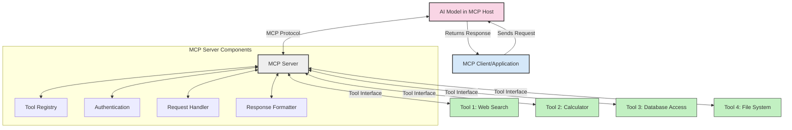
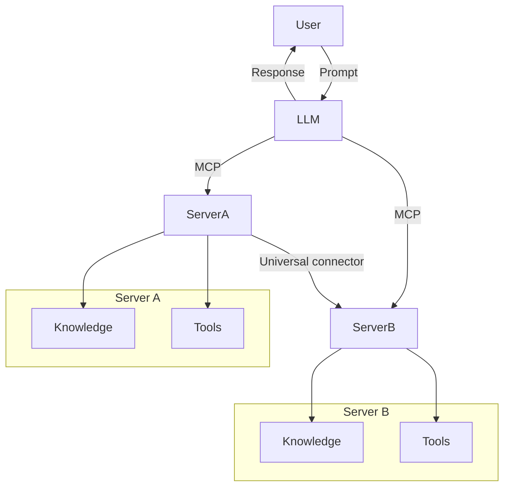

<!--
CO_OP_TRANSLATOR_METADATA:
{
  "original_hash": "cf84f987e1b771d2201408e110dfd2db",
  "translation_date": "2025-05-20T16:41:52+00:00",
  "source_file": "00-Introduction/README.md",
  "language_code": "pa"
}
-->
# ਮਾਡਲ ਕਾਂਟੈਕਸਟ ਪ੍ਰੋਟੋਕੋਲ (MCP) ਦਾ ਪਰਿਚਯ: ਵੱਧ ਸਕੇਲ ਵਾਲੀਆਂ AI ਐਪਲੀਕੇਸ਼ਨਾਂ ਲਈ ਇਹ ਕਿਉਂ ਮਹੱਤਵਪੂਰਣ ਹੈ

ਜਨਰੇਟਿਵ AI ਐਪਲੀਕੇਸ਼ਨ ਇੱਕ ਵੱਡਾ ਕਦਮ ਹਨ ਕਿਉਂਕਿ ਇਹ ਆਮ ਤੌਰ 'ਤੇ ਵਰਤੋਂਕਾਰ ਨੂੰ ਕੁਦਰਤੀ ਭਾਸ਼ਾ ਦੇ ਪ੍ਰੰਪਟਾਂ ਰਾਹੀਂ ਐਪ ਨਾਲ ਗੱਲਬਾਤ ਕਰਨ ਦੀ ਆਜ਼ਾਦੀ ਦਿੰਦੇ ਹਨ। ਪਰ ਜਿਵੇਂ ਜਿਵੇਂ ਇਨ੍ਹਾਂ ਐਪਾਂ ਵਿੱਚ ਸਮਾਂ ਅਤੇ ਸਰੋਤ ਜ਼ਿਆਦਾ ਲਗਦੇ ਹਨ, ਤੁਹਾਨੂੰ ਇਹ ਯਕੀਨੀ ਬਣਾਉਣਾ ਚਾਹੀਦਾ ਹੈ ਕਿ ਤੁਸੀਂ ਫੰਕਸ਼ਨਲਿਟੀ ਅਤੇ ਸਰੋਤਾਂ ਨੂੰ ਇਸ ਤਰ੍ਹਾਂ ਜੋੜ ਸਕੋ ਕਿ ਉਹ ਆਸਾਨੀ ਨਾਲ ਵਧਾਏ ਜਾ ਸਕਣ, ਤੁਹਾਡੀ ਐਪ ਇੱਕ ਤੋਂ ਵੱਧ ਮਾਡਲਾਂ ਦੀ ਵਰਤੋਂ ਕਰ ਸਕੇ ਅਤੇ ਉਹਨਾਂ ਦੀਆਂ ਬਰੀਕੀਆਂ ਨੂੰ ਸਮਝ ਸਕੇ। ਸਧਾਰਨ ਸ਼ਬਦਾਂ ਵਿੱਚ, ਜਨਰੇਟਿਵ AI ਐਪ ਬਣਾਉਣਾ ਸ਼ੁਰੂਆਤ ਵਿੱਚ ਆਸਾਨ ਹੈ, ਪਰ ਜਿਵੇਂ ਇਹ ਵਧਦਾ ਅਤੇ ਜਟਿਲ ਹੁੰਦਾ ਹੈ, ਤੁਹਾਨੂੰ ਇੱਕ ਆਰਕੀਟੈਕਚਰ ਬਣਾਉਣ ਦੀ ਲੋੜ ਪੈਂਦੀ ਹੈ ਅਤੇ ਸੰਭਵਤ: ਇੱਕ ਮਿਆਰੀਕਰਨ ਤੇ ਨਿਰਭਰ ਕਰਨਾ ਪੈਂਦਾ ਹੈ ਤਾਂ ਜੋ ਤੁਹਾਡੇ ਐਪ ਇਕਸਾਰ ਢੰਗ ਨਾਲ ਬਣੇ ਰਹਿਣ। ਇੱਥੇ MCP ਕਾਮ ਆਉਂਦਾ ਹੈ, ਜੋ ਚੀਜ਼ਾਂ ਨੂੰ ਠੀਕ ਢੰਗ ਨਾਲ ਸੰਗਠਿਤ ਕਰਦਾ ਹੈ ਅਤੇ ਇੱਕ ਮਿਆਰ ਮੁਹੱਈਆ ਕਰਵਾਉਂਦਾ ਹੈ।

---

## **🔍 ਮਾਡਲ ਕਾਂਟੈਕਸਟ ਪ੍ਰੋਟੋਕੋਲ (MCP) ਕੀ ਹੈ?**

**ਮਾਡਲ ਕਾਂਟੈਕਸਟ ਪ੍ਰੋਟੋਕੋਲ (MCP)** ਇੱਕ **ਖੁੱਲ੍ਹਾ, ਮਿਆਰੀ ਇੰਟਰਫੇਸ** ਹੈ ਜੋ ਵੱਡੇ ਭਾਸ਼ਾਈ ਮਾਡਲਾਂ (LLMs) ਨੂੰ ਬਾਹਰੀ ਟੂਲਾਂ, APIs ਅਤੇ ਡਾਟਾ ਸਰੋਤਾਂ ਨਾਲ ਬਿਨਾਂ ਕਿਸੇ ਰੁਕਾਵਟ ਦੇ ਗੱਲਬਾਤ ਕਰਨ ਦੀ ਆਗਿਆ ਦਿੰਦਾ ਹੈ। ਇਹ ਇੱਕ ਇਕਸਾਰ ਆਰਕੀਟੈਕਚਰ ਮੁਹੱਈਆ ਕਰਵਾਉਂਦਾ ਹੈ ਜੋ AI ਮਾਡਲ ਦੀ ਕਾਰਗੁਜ਼ਾਰੀ ਨੂੰ ਉਨ੍ਹਾਂ ਦੇ ਟ੍ਰੇਨਿੰਗ ਡਾਟਾ ਤੋਂ ਬਾਹਰ ਵਧਾਉਂਦਾ ਹੈ, ਜਿਸ ਨਾਲ ਹੋਸ਼ਿਆਰ, ਵੱਧ ਸਕੇਲਯੋਗ ਅਤੇ ਜ਼ਿਆਦਾ ਪ੍ਰਤੀਕ੍ਰਿਆਸ਼ੀਲ AI ਸਿਸਟਮ ਬਣਦੇ ਹਨ।

---

## **🎯 AI ਵਿੱਚ ਮਿਆਰੀਕਰਨ ਕਿਉਂ ਜ਼ਰੂਰੀ ਹੈ**

ਜਿਵੇਂ ਜਨਰੇਟਿਵ AI ਐਪਲੀਕੇਸ਼ਨ ਜ਼ਿਆਦਾ ਜਟਿਲ ਹੁੰਦੇ ਹਨ, ਇਹ ਜ਼ਰੂਰੀ ਹੈ ਕਿ ਅਸੀਂ ਉਹ ਮਿਆਰ ਅਪਣਾਈਏ ਜੋ **ਵੱਧ ਸਕੇਲਯੋਗਤਾ, ਵਧਾਉਣਯੋਗਤਾ**, ਅਤੇ **ਸੰਭਾਲਯੋਗਤਾ** ਨੂੰ ਯਕੀਨੀ ਬਣਾਉਂਦੇ ਹਨ। MCP ਇਹਨਾਂ ਜ਼ਰੂਰਤਾਂ ਨੂੰ ਪੂਰਾ ਕਰਦਾ ਹੈ:

- ਮਾਡਲ-ਟੂਲ ਇੰਟੀਗ੍ਰੇਸ਼ਨ ਨੂੰ ਇਕਜੁਟ ਕਰਨਾ
- ਟੁੱਟਣ ਵਾਲੇ, ਇੱਕ-ਵਾਰੀ ਖਾਸ ਹੱਲਾਂ ਨੂੰ ਘਟਾਉਣਾ
- ਇੱਕੋ ਇਕੋ ਇਕੋ ਪਰਿਵਾਰ ਵਿੱਚ ਕਈ ਮਾਡਲਾਂ ਨੂੰ ਰੱਖਣ ਦੀ ਆਗਿਆ ਦੇਣਾ

---

## **📚 ਸਿੱਖਣ ਦੇ ਉਦੇਸ਼**

ਇਸ ਲੇਖ ਦੇ ਅੰਤ ਤੱਕ, ਤੁਸੀਂ ਸਮਝ ਸਕੋਗੇ:

- **ਮਾਡਲ ਕਾਂਟੈਕਸਟ ਪ੍ਰੋਟੋਕੋਲ (MCP)** ਕੀ ਹੈ ਅਤੇ ਇਸਦੇ ਉਪਯੋਗ
- MCP ਮਾਡਲ-ਟੂਲ ਸੰਚਾਰ ਨੂੰ ਕਿਵੇਂ ਮਿਆਰੀਕ੍ਰਿਤ ਕਰਦਾ ਹੈ
- MCP ਆਰਕੀਟੈਕਚਰ ਦੇ ਮੁੱਖ ਹਿੱਸੇ ਕੀ ਹਨ
- ਉਦਯੋਗ ਅਤੇ ਵਿਕਾਸ ਸੰਦਰਭ ਵਿੱਚ MCP ਦੇ ਅਸਲ ਵਰਤੋਂ ਦੇ ਮਾਮਲੇ

---

## **💡 ਮਾਡਲ ਕਾਂਟੈਕਸਟ ਪ੍ਰੋਟੋਕੋਲ (MCP) ਕਿਉਂ ਇੱਕ ਖੇਡ ਬਦਲਣ ਵਾਲਾ ਹੈ**

### **🔗 MCP AI ਇੰਟਰੈਕਸ਼ਨਾਂ ਵਿੱਚ ਟੁਕੜੇਪਨ ਨੂੰ ਦੂਰ ਕਰਦਾ ਹੈ**

MCP ਤੋਂ ਪਹਿਲਾਂ, ਮਾਡਲਾਂ ਨੂੰ ਟੂਲਾਂ ਨਾਲ ਜੋੜਨ ਲਈ ਲੋੜ ਸੀ:

- ਹਰ ਟੂਲ-ਮਾਡਲ ਜੋੜ ਲਈ ਖਾਸ ਕੋਡ
- ਹਰ ਵੇਂਡਰ ਲਈ ਗੈਰ-ਮਿਆਰੀ APIs
- ਅਪਡੇਟਾਂ ਕਾਰਨ ਅਕਸਰ ਟੁੱਟ ਜਾਣਾ
- ਵੱਧ ਟੂਲਾਂ ਨਾਲ ਘੱਟ ਸਕੇਲਯੋਗਤਾ

### **✅ MCP ਮਿਆਰੀਕਰਨ ਦੇ ਫਾਇਦੇ**

| **ਫਾਇਦਾ**              | **ਵੇਰਵਾ**                                                               |
|--------------------------|-------------------------------------------------------------------------|
| ਇੰਟਰਓਪਰੇਬਿਲਿਟੀ         | LLM ਵੱਖ-ਵੱਖ ਵੇਂਡਰਾਂ ਦੇ ਟੂਲਾਂ ਨਾਲ ਬਿਨਾਂ ਰੁਕਾਵਟ ਦੇ ਕੰਮ ਕਰਦੇ ਹਨ          |
| ਸਥਿਰਤਾ                  | ਪਲੇਟਫਾਰਮ ਅਤੇ ਟੂਲਾਂ ਵਿੱਚ ਇਕਸਾਰ ਵਰਤਾਰਾ                               |
| ਦੁਬਾਰਾ ਵਰਤੋਂਯੋਗਤਾ       | ਇਕ ਵਾਰੀ ਬਣਾਏ ਗਏ ਟੂਲਾਂ ਨੂੰ ਪ੍ਰਾਜੈਕਟਾਂ ਅਤੇ ਸਿਸਟਮਾਂ ਵਿੱਚ ਦੁਬਾਰਾ ਵਰਤਿਆ ਜਾ ਸਕਦਾ ਹੈ |
| ਤੇਜ਼ ਵਿਕਾਸ               | ਮਿਆਰੀਕ੍ਰਿਤ, ਪਲੱਗ-ਅਤੇ-ਪਲੇਅ ਇੰਟਰਫੇਸ ਦੀ ਵਰਤੋਂ ਨਾਲ ਵਿਕਾਸ ਸਮਾਂ ਘਟਾਓ          |

---

## **🧱 ਉੱਚ-ਸਤਹ MCP ਆਰਕੀਟੈਕਚਰ ਦਾ ਝਲਕ**

MCP ਇੱਕ **ਕਲਾਇੰਟ-ਸਰਵਰ ਮਾਡਲ** ਨੂੰ ਫਾਲੋ ਕਰਦਾ ਹੈ, ਜਿੱਥੇ:

- **MCP Hosts** AI ਮਾਡਲ ਚਲਾਉਂਦੇ ਹਨ
- **MCP Clients** ਬੇਨਤੀਆਂ ਭੇਜਦੇ ਹਨ
- **MCP Servers** ਕਾਂਟੈਕਸਟ, ਟੂਲਾਂ ਅਤੇ ਸਮਰੱਥਾਵਾਂ ਮੁਹੱਈਆ ਕਰਵਾਉਂਦੇ ਹਨ

### **ਮੁੱਖ ਹਿੱਸੇ:**

- **Resources** – ਮਾਡਲਾਂ ਲਈ ਸਥਿਰ ਜਾਂ ਗਤੀਸ਼ੀਲ ਡਾਟਾ  
- **Prompts** – ਨਿਰਧਾਰਿਤ ਵਰਕਫਲੋਜ਼ ਗਾਈਡਡ ਜਨਰੇਸ਼ਨ ਲਈ  
- **Tools** – ਕਾਰਜਕਾਰੀ ਫੰਕਸ਼ਨ ਜਿਵੇਂ ਖੋਜ, ਗਣਨਾ  
- **Sampling** – recursive interactions ਰਾਹੀਂ ਏਜੰਟਿਕ ਵਰਤਾਰਾ

---

## MCP ਸਰਵਰ ਕਿਵੇਂ ਕੰਮ ਕਰਦੇ ਹਨ

MCP ਸਰਵਰ ਹੇਠਾਂ ਦਿੱਤੇ ਢੰਗ ਨਾਲ ਕੰਮ ਕਰਦੇ ਹਨ:

- **ਬੇਨਤੀ ਦਾ ਪ੍ਰਵਾਹ**:  
    1. MCP Client ਇੱਕ ਬੇਨਤੀ MCP Host ਵਿੱਚ ਚੱਲ ਰਹੇ AI ਮਾਡਲ ਨੂੰ ਭੇਜਦਾ ਹੈ।  
    2. AI ਮਾਡਲ ਪਛਾਣਦਾ ਹੈ ਕਿ ਕਦੋਂ ਬਾਹਰੀ ਟੂਲ ਜਾਂ ਡਾਟਾ ਦੀ ਲੋੜ ਹੈ।  
    3. ਮਾਡਲ ਮਿਆਰੀ ਪ੍ਰੋਟੋਕੋਲ ਦੀ ਵਰਤੋਂ ਕਰਕੇ MCP Server ਨਾਲ ਗੱਲਬਾਤ ਕਰਦਾ ਹੈ।  

- **MCP Server ਦੀ ਕਾਰਗੁਜ਼ਾਰੀ**:  
    - Tool Registry: ਉਪਲਬਧ ਟੂਲਾਂ ਅਤੇ ਉਹਨਾਂ ਦੀਆਂ ਸਮਰੱਥਾਵਾਂ ਦਾ ਕੈਟਾਲੌਗ ਰੱਖਦਾ ਹੈ।  
    - Authentication: ਟੂਲ ਐਕਸੈਸ ਲਈ ਅਧਿਕਾਰਾਂ ਦੀ ਜਾਂਚ ਕਰਦਾ ਹੈ।  
    - Request Handler: ਮਾਡਲ ਤੋਂ ਆ ਰਹੀਆਂ ਟੂਲ ਬੇਨਤੀਆਂ ਨੂੰ ਪ੍ਰੋਸੈਸ ਕਰਦਾ ਹੈ।  
    - Response Formatter: ਟੂਲ ਆਉਟਪੁੱਟ ਨੂੰ ਐਸਾ ਫਾਰਮੈਟ ਦਿੰਦਾ ਹੈ ਜੋ ਮਾਡਲ ਸਮਝ ਸਕੇ।  

- **ਟੂਲ ਚਲਾਉਣਾ**:  
    - ਸਰਵਰ ਬੇਨਤੀਆਂ ਨੂੰ ਸਹੀ ਬਾਹਰੀ ਟੂਲਾਂ ਨੂੰ ਭੇਜਦਾ ਹੈ  
    - ਟੂਲ ਆਪਣੀਆਂ ਖਾਸ ਕਾਰਵਾਈਆਂ (ਖੋਜ, ਗਣਨਾ, ਡਾਟਾਬੇਸ ਪੁੱਛਗਿੱਛ ਆਦਿ) ਕਰਦੇ ਹਨ  
    - ਨਤੀਜੇ ਮਾਡਲ ਨੂੰ ਇਕਸਾਰ ਫਾਰਮੈਟ ਵਿੱਚ ਵਾਪਸ ਕੀਤੇ ਜਾਂਦੇ ਹਨ  

- **ਜਵਾਬ ਦੀ ਪੂਰੀਤਾ**:  
    - AI ਮਾਡਲ ਟੂਲ ਆਉਟਪੁੱਟ ਨੂੰ ਆਪਣੇ ਜਵਾਬ ਵਿੱਚ ਸ਼ਾਮਿਲ ਕਰਦਾ ਹੈ।  
    - ਆਖਰੀ ਜਵਾਬ ਕਲਾਇੰਟ ਐਪਲੀਕੇਸ਼ਨ ਨੂੰ ਭੇਜਿਆ ਜਾਂਦਾ ਹੈ।  

## 👨‍💻 MCP ਸਰਵਰ ਕਿਵੇਂ ਬਣਾਇਆ ਜਾਵੇ (ਉਦਾਹਰਨਾਂ ਸਮੇਤ)

MCP ਸਰਵਰ LLM ਦੀਆਂ ਸਮਰੱਥਾਵਾਂ ਨੂੰ ਡਾਟਾ ਅਤੇ ਫੰਕਸ਼ਨਲਿਟੀ ਦੇ ਕੇ ਵਧਾਉਂਦੇ ਹਨ।

ਟ੍ਰਾਈ ਕਰਨ ਲਈ ਤਿਆਰ? ਹੇਠਾਂ ਵੱਖ-ਵੱਖ ਭਾਸ਼ਾਵਾਂ ਵਿੱਚ ਇੱਕ ਸਧਾਰਣ MCP ਸਰਵਰ ਬਣਾਉਣ ਦੀਆਂ ਉਦਾਹਰਨਾਂ ਹਨ:

- **Python Example**: https://github.com/modelcontextprotocol/python-sdk

- **TypeScript Example**: https://github.com/modelcontextprotocol/typescript-sdk

- **Java Example**: https://github.com/modelcontextprotocol/java-sdk

- **C#/.NET Example**: https://github.com/modelcontextprotocol/csharp-sdk

## 🌍 MCP ਲਈ ਅਸਲ ਜ਼ਿੰਦਗੀ ਦੇ ਵਰਤੋਂ ਦੇ ਮਾਮਲੇ

MCP AI ਸਮਰੱਥਾਵਾਂ ਨੂੰ ਵਧਾ ਕੇ ਵੱਖ-ਵੱਖ ਐਪਲੀਕੇਸ਼ਨਾਂ ਨੂੰ ਸੰਭਵ ਬਣਾਉਂਦਾ ਹੈ:

| **ਐਪਲੀਕੇਸ਼ਨ**            | **ਵੇਰਵਾ**                                                                 |
|----------------------------|---------------------------------------------------------------------------|
| Enterprise Data Integration | LLMs ਨੂੰ ਡਾਟਾਬੇਸ, CRM ਜਾਂ ਅੰਦਰੂਨੀ ਟੂਲਾਂ ਨਾਲ ਜੋੜਨਾ                        |
| Agentic AI Systems          | ਟੂਲ ਐਕਸੈਸ ਅਤੇ ਫੈਸਲਾ ਕਰਨ ਵਾਲੇ ਵਰਕਫਲੋਜ਼ ਨਾਲ ਖੁਦਮੁਖਤਿਆਰ ਏਜੰਟ ਬਣਾਉਣਾ       |
| Multi-modal Applications    | ਇੱਕ ਹੀ ਏਕਸਾਰ AI ਐਪ ਵਿੱਚ ਟੈਕਸਟ, ਇਮেজ ਅਤੇ ਆਡੀਓ ਟੂਲਾਂ ਨੂੰ ਜੋੜਨਾ            |
| Real-time Data Integration  | AI ਇੰਟਰੈਕਸ਼ਨਾਂ ਵਿੱਚ ਤਾਜ਼ਾ ਡਾਟਾ ਲਿਆਉਣਾ ਤਾਂ ਜੋ ਨਤੀਜੇ ਹੋਰ ਸਹੀ ਅਤੇ ਮੌਜੂਦਾ ਹੋਣ |

### 🧠 MCP = AI ਇੰਟਰੈਕਸ਼ਨਾਂ ਲਈ ਵਿਸ਼ਵ ਮਿਆਰ

ਮਾਡਲ ਕਾਂਟੈਕਸਟ ਪ੍ਰੋਟੋਕੋਲ (MCP) AI ਇੰਟਰੈਕਸ਼ਨਾਂ ਲਈ ਇੱਕ ਵਿਸ਼ਵ ਮਿਆਰ ਵਜੋਂ ਕੰਮ ਕਰਦਾ ਹੈ, ਬਿਲਕੁਲ ਉਸੇ ਤਰ੍ਹਾਂ ਜਿਵੇਂ USB-C ਨੇ ਡਿਵਾਈਸਾਂ ਲਈ ਭੌਤਿਕ ਜੁੜਾਈ ਨੂੰ ਮਿਆਰੀਕ੍ਰਿਤ ਕੀਤਾ। AI ਦੀ ਦੁਨੀਆ ਵਿੱਚ, MCP ਇੱਕ ਇਕਸਾਰ ਇੰਟਰਫੇਸ ਮੁਹੱਈਆ ਕਰਵਾਉਂਦਾ ਹੈ, ਜੋ ਮਾਡਲਾਂ (ਕਲਾਇੰਟਾਂ) ਨੂੰ ਬਾਹਰੀ ਟੂਲਾਂ ਅਤੇ ਡਾਟਾ ਪ੍ਰਦਾਤਾਵਾਂ (ਸਰਵਰਾਂ) ਨਾਲ ਆਸਾਨੀ ਨਾਲ ਜੋੜਨ ਦੀ ਆਗਿਆ ਦਿੰਦਾ ਹੈ। ਇਸ ਨਾਲ ਹਰ API ਜਾਂ ਡਾਟਾ ਸਰੋਤ ਲਈ ਵੱਖ-ਵੱਖ, ਖਾਸ ਪ੍ਰੋਟੋਕੋਲ ਦੀ ਲੋੜ ਖਤਮ ਹੋ ਜਾਂਦੀ ਹੈ।

MCP ਅਨੁਕੂਲ ਟੂਲ (ਜਿਸਨੂੰ MCP ਸਰਵਰ ਕਿਹਾ ਜਾਂਦਾ ਹੈ) ਇੱਕ ਇਕਜੁਟ ਮਿਆਰ ਨੂੰ ਫਾਲੋ ਕਰਦਾ ਹੈ। ਇਹ ਸਰਵਰ ਉਹ ਟੂਲ ਜਾਂ ਕਾਰਵਾਈਆਂ ਦਰਸਾ ਸਕਦੇ ਹਨ ਜੋ ਉਹ ਮੁਹੱਈਆ ਕਰਵਾਉਂਦੇ ਹਨ ਅਤੇ AI ਏਜੰਟ ਦੀ ਬੇਨਤੀ 'ਤੇ ਉਹਨਾਂ ਨੂੰ ਚਲਾਉਂਦੇ ਹਨ। MCP ਦਾ ਸਮਰਥਨ ਕਰਨ ਵਾਲੇ AI ਏਜੰਟ ਪਲੇਟਫਾਰਮ ਸਰਵਰਾਂ ਤੋਂ ਉਪਲਬਧ ਟੂਲਾਂ ਨੂੰ ਲੱਭ ਸਕਦੇ ਹਨ ਅਤੇ ਇਸ ਮਿਆਰੀ ਪ੍ਰੋਟੋਕੋਲ ਰਾਹੀਂ ਉਹਨਾਂ ਨੂੰ ਕਾਲ ਕਰ ਸਕਦੇ ਹਨ।

### 💡 ਗਿਆਨ ਤੱਕ ਪਹੁੰਚ ਨੂੰ ਆਸਾਨ ਬਣਾਉਂਦਾ ਹੈ

ਸਿਰਫ ਟੂਲ ਮੁਹੱਈਆ ਕਰਨ ਤੋਂ ਇਲਾਵਾ, MCP ਗਿਆਨ ਤੱਕ ਪਹੁੰਚ ਵੀ ਆਸਾਨ ਬਣਾਉਂਦਾ ਹੈ। ਇਹ ਐਪਲੀਕੇਸ਼ਨਾਂ ਨੂੰ ਵੱਡੇ ਭਾਸ਼ਾਈ ਮਾਡਲਾਂ (LLMs) ਨੂੰ ਕਾਂਟੈਕਸਟ ਦੇਣ ਲਈ ਵੱਖ-ਵੱਖ ਡਾਟਾ ਸਰੋਤਾਂ ਨਾਲ ਜੋੜਨ ਦੀ ਆਗਿਆ ਦਿੰਦਾ ਹੈ। ਉਦਾਹਰਨ ਲਈ, ਇੱਕ MCP ਸਰਵਰ ਕਿਸੇ ਕੰਪਨੀ ਦੀ ਡੌਕੂਮੈਂਟ ਰਿਪੋਜ਼ਿਟਰੀ ਨੂੰ ਦਰਸਾ ਸਕਦਾ ਹੈ, ਜਿਸ ਨਾਲ ਏਜੰਟ ਲੋੜ ਮੌਕੇ 'ਤੇ ਸੰਬੰਧਿਤ ਜਾਣਕਾਰੀ ਪ੍ਰਾਪਤ ਕਰ ਸਕਦੇ ਹਨ। ਇੱਕ ਹੋਰ ਸਰਵਰ ਖਾਸ ਕਾਰਵਾਈਆਂ ਜਿਵੇਂ ਈਮੇਲ ਭੇਜਣਾ ਜਾਂ ਰਿਕਾਰਡ ਅੱਪਡੇਟ ਕਰਨਾ ਸੰਭਾਲ ਸਕਦਾ ਹੈ। ਏਜੰਟ ਦੇ ਨਜ਼ਰੀਏ ਤੋਂ, ਇਹ ਸਿਰਫ ਟੂਲ ਹਨ — ਕੁਝ ਟੂਲ ਡਾਟਾ (ਗਿਆਨ ਕਾਂਟੈਕਸਟ) ਵਾਪਸ ਕਰਦੇ ਹਨ, ਜਦਕਿ ਹੋਰ ਕਾਰਵਾਈਆਂ ਕਰਦੇ ਹਨ। MCP ਦੋਹਾਂ ਨੂੰ ਪ੍ਰਭਾਵਸ਼ਾਲੀ ਢੰਗ ਨਾਲ ਸੰਭਾਲਦਾ ਹੈ।

ਜਦੋਂ ਇੱਕ ਏਜੰਟ MCP ਸਰਵਰ ਨਾਲ ਜੁੜਦਾ ਹੈ, ਤਾਂ ਉਹ ਸਰਵਰ ਦੀਆਂ ਉਪਲਬਧ ਸਮਰੱਥਾਵਾਂ ਅਤੇ ਡਾਟਾ ਤੱਕ ਪਹੁੰਚ ਨੂੰ ਮਿਆਰੀ ਫਾਰਮੈਟ ਰਾਹੀਂ ਆਪਣੇ ਆਪ ਸਿੱਖ ਲੈਂਦਾ ਹੈ। ਇਹ ਮਿਆਰੀਕਰਨ ਗਤੀਸ਼ੀਲ ਟੂਲ ਉਪਲਬਧਤਾ ਨੂੰ ਯਕੀਨੀ ਬਣਾਉਂਦਾ ਹੈ। ਉਦਾਹਰਨ ਲਈ, ਜਦੋਂ ਕਿਸੇ ਏਜੰਟ ਦੇ ਸਿਸਟਮ ਵਿੱਚ ਨਵਾਂ MCP ਸਰਵਰ ਸ਼ਾਮਿਲ ਕੀਤਾ ਜਾਂਦਾ ਹੈ, ਤਾਂ ਉਸਦੇ ਫੰਕਸ਼ਨ ਤੁਰੰਤ ਵਰਤੋਂ ਲਈ ਤਿਆਰ ਹੋ ਜਾਂਦੇ ਹਨ ਬਿਨਾਂ ਕਿਸੇ ਵਾਧੂ ਕਸਟਮਾਈਜ਼ੇਸ਼ਨ ਦੀ ਲੋੜ ਦੇ।

ਇਹ ਸਧਾਰਨ ਇੰਟੀਗ੍ਰੇਸ਼ਨ ਉਸ ਫਲੋ ਨਾਲ ਮੇਲ ਖਾਂਦੀ ਹੈ ਜੋ ਮਰਮੇਡ ਡਾਇਗ੍ਰਾਮ ਵਿੱਚ ਦਿਖਾਇਆ ਗਿਆ ਹੈ, ਜਿੱਥੇ ਸਰਵਰ ਟੂਲ ਅਤੇ ਗਿਆਨ ਦੋਹਾਂ ਮੁਹੱਈਆ ਕਰਵਾਉਂਦੇ ਹਨ, ਯਕੀਨੀ ਬਣਾਉਂਦੇ ਹਨ ਕਿ ਸਿਸਟਮਾਂ ਵਿੱਚ ਸਹਿਯੋਗ ਬਿਨਾਂ ਰੁਕਾਵਟ ਦੇ ਹੋਵੇ।

### 👉 ਉਦਾਹਰਨ: ਵੱਧ ਸਕੇਲ ਵਾਲਾ ਏਜੰਟ ਹੱਲ

## 🔐 MCP ਦੇ ਪ੍ਰਯੋਗਿਕ ਫਾਇਦੇ

MCP ਵਰਤਣ ਦੇ ਪ੍ਰਯੋਗਿਕ ਫਾਇਦੇ ਇਹ ਹਨ:

- **ਤਾਜ਼ਗੀ**: ਮਾਡਲ ਆਪਣੇ ਟ੍ਰੇਨਿੰਗ ਡਾਟਾ ਤੋਂ ਬਾਹਰ ਤਾਜ਼ਾ ਜਾਣਕਾਰੀ ਤੱਕ ਪਹੁੰਚ ਕਰ ਸਕਦੇ ਹਨ  
- **ਸਮਰੱਥਾ ਵਧਾਉਣਾ**: ਮਾਡਲ ਉਹਨਾਂ ਖਾਸ ਟਾਸਕਾਂ ਲਈ ਟੂਲ ਵਰਤ ਸਕਦੇ ਹਨ ਜਿਨ੍ਹਾਂ ਲਈ ਉਹ ਟ੍ਰੇਨ ਨਹੀਂ ਕੀਤੇ ਗਏ  
- **ਘੱਟ ਹਲੂਸੀਨੇਸ਼ਨ**: ਬਾਹਰੀ ਡਾਟਾ ਸਰੋਤ ਤੱਥਾਂ 'ਤੇ ਆਧਾਰਿਤ ਜਾਣਕਾਰੀ ਦਿੰਦੇ ਹਨ  
- **ਪ੍ਰਾਈਵੇਸੀ**: ਸੰਵੇਦਨਸ਼ੀਲ ਡਾਟਾ ਸੁਰੱਖਿਅਤ ਮਾਹੌਲ ਵਿੱਚ ਹੀ ਰਹਿ ਸਕਦਾ ਹੈ, ਪ੍ਰੰਪਟਾਂ ਵਿੱਚ ਸ਼ਾਮਿਲ ਨਾ ਹੋਵੇ

## 📌 ਮੁੱਖ ਨੁਕਤੇ

MCP ਵਰਤਣ ਲਈ ਕੁਝ ਮੁੱਖ ਨੁਕਤੇ:

- **MCP** AI ਮਾਡਲਾਂ ਨੂੰ ਟੂਲਾਂ ਅਤੇ ਡਾਟਾ ਨਾਲ ਗੱਲਬਾਤ ਕਰਨ ਦਾ ਮਿਆਰ ਬਣਾ ਦਿੰਦਾ ਹੈ  
- ਵਧਾਉਣਯੋਗਤਾ, ਇਕਸਾਰਤਾ ਅਤੇ ਇੰਟਰਓਪਰੇਬਿਲਿਟੀ ਨੂੰ فروغ ਦਿੰਦਾ ਹੈ  
- MCP ਵਿਕਾਸ ਸਮਾਂ ਘਟਾਉਂਦਾ, ਭਰੋਸੇਯੋਗਤਾ ਵਧਾਉਂਦਾ ਅਤੇ ਮਾਡਲ ਸਮਰੱਥਾਵਾਂ ਨੂੰ ਵਧਾਉਂਦਾ ਹੈ  
- ਕਲਾਇੰਟ-ਸਰਵਰ ਆਰਕੀਟੈਕਚਰ ਲਚਕੀਲੇ ਅਤੇ ਵਧਾਉਣਯੋਗ AI ਐਪਲੀਕੇਸ਼ਨਾਂ ਨੂੰ ਸੰਭਵ ਬਣਾਉਂਦਾ ਹੈ

## 🧠 ਅਭਿਆਸ

ਆਪਣੇ ਮਨ ਵਿੱਚ ਇੱਕ AI ਐਪਲੀਕੇਸ਼ਨ ਬਨਾਉਣ ਬਾਰੇ ਸੋਚੋ।

- ਕਿਹੜੇ **ਬਾਹਰੀ ਟੂਲ ਜਾਂ ਡਾਟਾ** ਇਸਦੀ ਸਮਰੱਥਾ ਵਧਾ ਸਕਦੇ ਹਨ?  
- MCP ਇੰਟੀਗ੍ਰੇਸ਼ਨ ਨੂੰ ਕਿਵੇਂ **ਸਰਲ ਅਤੇ ਭਰੋਸੇਯੋਗ** ਬਣਾਉਂਦਾ ਹੈ?

## ਵਾਧੂ ਸਰੋਤ

- [MCP GitHub Repository](https://github.com/modelcontextprotocol)

## ਅੱਗੇ ਕੀ

ਅਗਲਾ: [Chapter 1: Core Concepts](/01-CoreConcepts/README.md)

**ਅਸਵੀਕਾਰੋਪੱਤਰ**:  
ਇਹ ਦਸਤਾਵੇਜ਼ AI ਅਨੁਵਾਦ ਸੇਵਾ [Co-op Translator](https://github.com/Azure/co-op-translator) ਦੀ ਵਰਤੋਂ ਕਰਕੇ ਅਨੁਵਾਦਿਤ ਕੀਤਾ ਗਿਆ ਹੈ। ਜਦੋਂ ਕਿ ਅਸੀਂ ਸਹੀਤਾ ਲਈ ਕੋਸ਼ਿਸ਼ ਕਰਦੇ ਹਾਂ, ਕਿਰਪਾ ਕਰਕੇ ਧਿਆਨ ਵਿੱਚ ਰੱਖੋ ਕਿ ਸਵੈਚਾਲਿਤ ਅਨੁਵਾਦਾਂ ਵਿੱਚ ਗਲਤੀਆਂ ਜਾਂ ਅਸਹੀਤਾਂ ਹੋ ਸਕਦੀਆਂ ਹਨ। ਮੂਲ ਦਸਤਾਵੇਜ਼ ਆਪਣੀ ਮੂਲ ਭਾਸ਼ਾ ਵਿੱਚ ਪ੍ਰਮਾਣਿਕ ਸਰੋਤ ਮੰਨਿਆ ਜਾਣਾ ਚਾਹੀਦਾ ਹੈ। ਮਹੱਤਵਪੂਰਣ ਜਾਣਕਾਰੀ ਲਈ, ਪੇਸ਼ੇਵਰ ਮਨੁੱਖੀ ਅਨੁਵਾਦ ਦੀ ਸਿਫ਼ਾਰਸ਼ ਕੀਤੀ ਜਾਂਦੀ ਹੈ। ਅਸੀਂ ਇਸ ਅਨੁਵਾਦ ਦੀ ਵਰਤੋਂ ਤੋਂ ਪੈਦਾ ਹੋਣ ਵਾਲੀਆਂ ਕਿਸੇ ਵੀ ਗਲਤਫਹਮੀਆਂ ਜਾਂ ਗਲਤ ਵਿਆਖਿਆਵਾਂ ਲਈ ਜ਼ਿੰਮੇਵਾਰ ਨਹੀਂ ਹਾਂ।