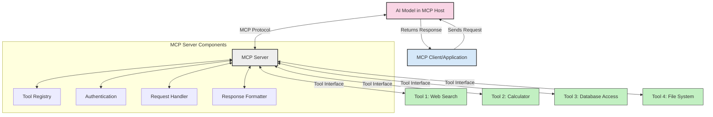
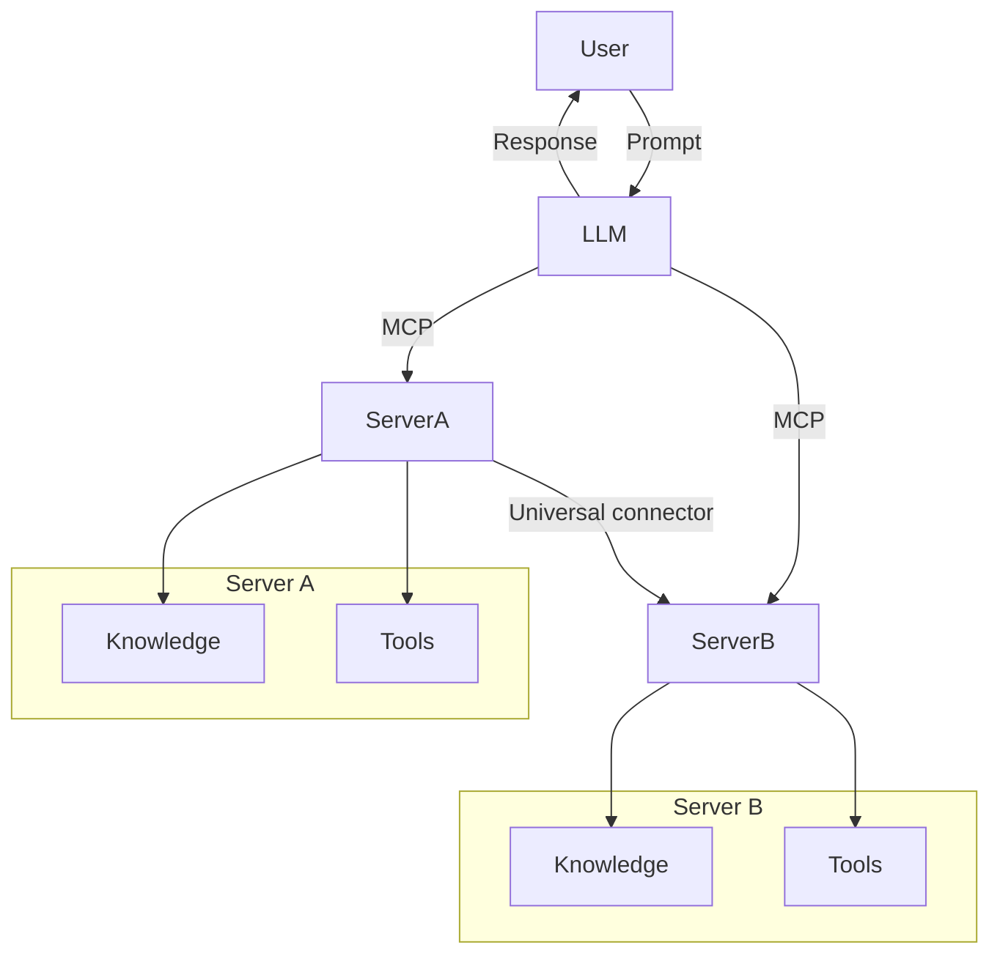

<!--
CO_OP_TRANSLATOR_METADATA:
{
  "original_hash": "1d88dee994dcbb3fa52c271d0c0817b5",
  "translation_date": "2025-05-20T21:08:32+00:00",
  "source_file": "00-Introduction/README.md",
  "language_code": "pa"
}
-->
# ਮਾਡਲ ਕਾਂਟੈਕਸਟ ਪ੍ਰੋਟੋਕੋਲ (MCP) ਦਾ ਪਰਚਿਆ: ਸਕੇਲਬਲ AI ਐਪਲੀਕੇਸ਼ਨਾਂ ਲਈ ਇਸਦੀ ਮਹੱਤਤਾ

ਜਨਰੇਟਿਵ AI ਐਪਲੀਕੇਸ਼ਨ ਇੱਕ ਵੱਡਾ ਕਦਮ ਹੈ ਕਿਉਂਕਿ ਇਹ ਆਮ ਤੌਰ 'ਤੇ ਯੂਜ਼ਰ ਨੂੰ ਕੁਦਰਤੀ ਭਾਸ਼ਾ ਪ੍ਰੰਪਟਾਂ ਰਾਹੀਂ ਐਪ ਨਾਲ ਗੱਲਬਾਤ ਕਰਨ ਦਿੰਦੇ ਹਨ। ਪਰ ਜਿਵੇਂ ਜਿਵੇਂ ਇਨ੍ਹਾਂ ਐਪ ਵਿੱਚ ਵਧੇਰੇ ਸਮਾਂ ਅਤੇ ਸਰੋਤ ਲਗਾਏ ਜਾਂਦੇ ਹਨ, ਤੁਹਾਨੂੰ ਇਹ ਯਕੀਨੀ ਬਣਾਉਣਾ ਚਾਹੀਦਾ ਹੈ ਕਿ ਤੁਸੀਂ ਫੰਕਸ਼ਨਾਲਿਟੀ ਅਤੇ ਸਰੋਤਾਂ ਨੂੰ ਇਸ ਤਰ੍ਹਾਂ ਜੋੜ ਸਕੋ ਕਿ ਇਹ ਆਸਾਨੀ ਨਾਲ ਵਧਾਇਆ ਜਾ ਸਕੇ, ਤੁਹਾਡੀ ਐਪ ਇਕ ਤੋਂ ਵੱਧ ਮਾਡਲਾਂ ਨੂੰ ਸਮਭਾਲ ਸਕੇ, ਅਤੇ ਵੱਖ-ਵੱਖ ਮਾਡਲਾਂ ਦੀਆਂ ਜਟਿਲਤਾਵਾਂ ਨੂੰ ਸੰਭਾਲ ਸਕੇ। ਸਾਦੇ ਸ਼ਬਦਾਂ ਵਿੱਚ, ਜਨਰੇਟਿਵ AI ਐਪ ਬਣਾਉਣਾ ਸ਼ੁਰੂਆਤ ਵਿੱਚ ਆਸਾਨ ਹੁੰਦਾ ਹੈ, ਪਰ ਜਿਵੇਂ ਇਹ ਵਧਦੇ ਹਨ ਅਤੇ ਜ਼ਿਆਦਾ ਜਟਿਲ ਹੋ ਜਾਂਦੇ ਹਨ, ਤੁਹਾਨੂੰ ਇੱਕ ਆਰਕੀਟੈਕਚਰ ਬਣਾਉਣੀ ਪੈਂਦੀ ਹੈ ਅਤੇ ਇੱਕ ਮਿਆਰ 'ਤੇ ਨਿਰਭਰ ਕਰਨਾ ਪੈਂਦਾ ਹੈ ਤਾਂ ਜੋ ਤੁਹਾਡੇ ਐਪ ਸਥਿਰ ਅਤੇ ਇੱਕਸਾਰ ਤਰੀਕੇ ਨਾਲ ਬਣੇ ਰਹਿਣ। ਇੱਥੇ MCP ਕੰਮ ਵਿੱਚ ਆਉਂਦਾ ਹੈ ਜੋ ਸਭ ਕੁਝ ਠੀਕ ਢੰਗ ਨਾਲ ਠਹਿਰਾਉਂਦਾ ਹੈ ਅਤੇ ਇੱਕ ਮਿਆਰੀ ਢਾਂਚਾ ਦਿੰਦਾ ਹੈ।

---

## **🔍 ਮਾਡਲ ਕਾਂਟੈਕਸਟ ਪ੍ਰੋਟੋਕੋਲ (MCP) ਕੀ ਹੈ?**

**ਮਾਡਲ ਕਾਂਟੈਕਸਟ ਪ੍ਰੋਟੋਕੋਲ (MCP)** ਇੱਕ **ਖੁੱਲ੍ਹਾ, ਮਿਆਰੀ ਇੰਟਰਫੇਸ** ਹੈ ਜੋ ਵੱਡੇ ਭਾਸ਼ਾ ਮਾਡਲਾਂ (LLMs) ਨੂੰ ਬਾਹਰੀ ਟੂਲਾਂ, APIs, ਅਤੇ ਡਾਟਾ ਸਰੋਤਾਂ ਨਾਲ ਬਿਨਾਂ ਰੁਕਾਵਟ ਇੰਟਰੈਕਟ ਕਰਨ ਦੀ ਆਗਿਆ ਦਿੰਦਾ ਹੈ। ਇਹ ਇੱਕ ਸਥਿਰ ਆਰਕੀਟੈਕਚਰ ਪ੍ਰਦਾਨ ਕਰਦਾ ਹੈ ਜੋ AI ਮਾਡਲ ਦੀਆਂ ਖੁਬੀਆਂ ਨੂੰ ਉਨ੍ਹਾਂ ਦੇ ਟ੍ਰੇਨਿੰਗ ਡਾਟਾ ਤੋਂ ਬਾਹਰ ਵਧਾਉਂਦਾ ਹੈ, ਜਿਸ ਨਾਲ ਹੋਸ਼ਿਆਰ, ਸਕੇਲਬਲ ਅਤੇ ਜ਼ਿਆਦਾ ਜਵਾਬਦੇਹ AI ਸਿਸਟਮ ਬਣਦੇ ਹਨ।

---

## **🎯 AI ਵਿੱਚ ਮਿਆਰੀਕਰਨ ਕਿਉਂ ਜਰੂਰੀ ਹੈ**

ਜਿਵੇਂ ਜਨਰੇਟਿਵ AI ਐਪਲੀਕੇਸ਼ਨ ਹੋਰ ਜਟਿਲ ਹੋ ਰਹੀਆਂ ਹਨ, ਇਹ ਜਰੂਰੀ ਹੈ ਕਿ ਅਸੀਂ ਐਸੇ ਮਿਆਰ ਅਪਣਾਈਏ ਜੋ **ਸਕੇਲਬਿਲਟੀ, ਵਧਾਉਣਯੋਗਤਾ**, ਅਤੇ **ਰਖ-ਰਖਾਵ** ਨੂੰ ਯਕੀਨੀ ਬਣਾਉਂਦੇ ਹਨ। MCP ਇਹਨਾਂ ਲੋੜਾਂ ਨੂੰ ਹੱਲ ਕਰਦਾ ਹੈ:

- ਮਾਡਲ-ਟੂਲ ਇੰਟਿਗ੍ਰੇਸ਼ਨਾਂ ਨੂੰ ਇਕਠਾ ਕਰਨਾ
- ਟੁੱਟਣ ਵਾਲੇ, ਇਕ ਵਾਰੀ ਵਾਲੇ ਕਸਟਮ ਹੱਲਾਂ ਨੂੰ ਘਟਾਉਣਾ
- ਇਕ ਹੀ ਇਕੋਸਿਸਟਮ ਵਿੱਚ ਕਈ ਮਾਡਲਾਂ ਨੂੰ ਇਕੱਠੇ ਰਹਿਣ ਦੀ ਆਗਿਆ ਦੇਣਾ

---

## **📚 ਸਿੱਖਣ ਦੇ ਉਦੇਸ਼**

ਇਸ ਲੇਖ ਦੇ ਅੰਤ ਤੱਕ, ਤੁਸੀਂ ਸਮਝ ਪਾ ਜਾਵੋਗੇ:

- **ਮਾਡਲ ਕਾਂਟੈਕਸਟ ਪ੍ਰੋਟੋਕੋਲ (MCP)** ਅਤੇ ਇਸਦੇ ਉਪਯੋਗ
- MCP ਮਾਡਲ-ਟੂਲ ਸੰਚਾਰ ਨੂੰ ਕਿਵੇਂ ਮਿਆਰੀਕ੍ਰਿਤ ਕਰਦਾ ਹੈ
- MCP ਆਰਕੀਟੈਕਚਰ ਦੇ ਮੁੱਖ ਹਿੱਸੇ
- ਉਦਯੋਗ ਅਤੇ ਵਿਕਾਸ ਸੰਦਰਭ ਵਿੱਚ MCP ਦੇ ਅਸਲੀ ਦੁਨੀਆ ਦੇ ਉਪਯੋਗ

---

## **💡 ਮਾਡਲ ਕਾਂਟੈਕਸਟ ਪ੍ਰੋਟੋਕੋਲ (MCP) ਕਿਉਂ ਇੱਕ ਖੇਡ ਬਦਲਣ ਵਾਲਾ ਹੈ**

### **🔗 MCP AI ਇੰਟਰੈਕਸ਼ਨਾਂ ਵਿੱਚ ਫਰੈਗਮੈਂਟੇਸ਼ਨ ਨੂੰ ਹੱਲ ਕਰਦਾ ਹੈ**

MCP ਤੋਂ ਪਹਿਲਾਂ, ਮਾਡਲਾਂ ਨੂੰ ਟੂਲਾਂ ਨਾਲ ਜੋੜਨ ਲਈ ਲੋੜ ਸੀ:

- ਹਰ ਟੂਲ-ਮਾਡਲ ਜੋੜ ਲਈ ਕਸਟਮ ਕੋਡ
- ਹਰ ਵੇਂਡਰ ਲਈ ਗੈਰ-ਮਿਆਰੀ API
- ਅਪਡੇਟਾਂ ਕਾਰਨ ਵਾਰ-ਵਾਰ ਟੁੱਟਣਾ
- ਜ਼ਿਆਦਾ ਟੂਲਾਂ ਨਾਲ ਖਰਾਬ ਸਕੇਲਬਿਲਟੀ

### **✅ MCP ਮਿਆਰੀਕਰਨ ਦੇ ਫਾਇਦੇ**

| **ਫਾਇਦਾ**              | **ਵਰਣਨ**                                                                  |
|--------------------------|----------------------------------------------------------------------------|
| ਇੰਟਰਓਪਰੇਬਿਲਿਟੀ         | LLMs ਵੱਖ-ਵੱਖ ਵੇਂਡਰਾਂ ਦੇ ਟੂਲਾਂ ਨਾਲ ਬਿਨਾਂ ਰੁਕਾਵਟ ਕੰਮ ਕਰਦੇ ਹਨ               |
| ਸਥਿਰਤਾ                  | ਪਲੇਟਫਾਰਮਾਂ ਅਤੇ ਟੂਲਾਂ ਵਿੱਚ ਇੱਕਸਾਰ ਵਿਹਾਰ                                  |
| ਦੁਬਾਰਾ ਵਰਤੋਂ ਯੋਗਤਾ       | ਇਕ ਵਾਰੀ ਬਣਾਏ ਟੂਲ ਪ੍ਰੋਜੈਕਟਾਂ ਅਤੇ ਸਿਸਟਮਾਂ ਵਿੱਚ ਵਰਤੇ ਜਾ ਸਕਦੇ ਹਨ               |
| ਵਿਕਾਸ ਤੇਜ਼ੀ               | ਮਿਆਰੀਕ੍ਰਿਤ, ਪਲੱਗ-ਅਤੇ-ਪਲੇਅ ਇੰਟਰਫੇਸ ਨਾਲ ਵਿਕਾਸ ਸਮਾਂ ਘਟਾਉਂਦਾ ਹੈ               |

---

## **🧱 MCP ਆਰਕੀਟੈਕਚਰ ਦਾ ਉੱਚ-ਸਤਹੀ ਜਾਇਜ਼ਾ**

MCP ਇੱਕ **ਕਲਾਇੰਟ-ਸਰਵਰ ਮਾਡਲ** ਨੂੰ ਫਾਲੋ ਕਰਦਾ ਹੈ, ਜਿੱਥੇ:

- **MCP Hosts** AI ਮਾਡਲ ਚਲਾਉਂਦੇ ਹਨ  
- **MCP Clients** ਬੇਨਤੀਆਂ ਭੇਜਦੇ ਹਨ  
- **MCP Servers** ਕਾਂਟੈਕਸਟ, ਟੂਲ, ਅਤੇ ਸਮਰੱਥਾਵਾਂ ਪ੍ਰਦਾਨ ਕਰਦੇ ਹਨ  

### **ਮੁੱਖ ਹਿੱਸੇ:**

- **Resources** – ਮਾਡਲਾਂ ਲਈ ਸਥਿਰ ਜਾਂ ਗਤੀਸ਼ੀਲ ਡਾਟਾ  
- **Prompts** – ਨਿਰਧਾਰਿਤ ਵਰਕਫਲੋਜ਼ ਜਿਨ੍ਹਾਂ ਨਾਲ ਜਨਰੇਸ਼ਨ ਨੂੰ ਮਦਦ ਮਿਲਦੀ ਹੈ  
- **Tools** – ਚਲਾਏ ਜਾਣ ਵਾਲੇ ਫੰਕਸ਼ਨ ਜਿਵੇਂ ਖੋਜ, ਗਣਨਾ  
- **Sampling** – recursive interactions ਰਾਹੀਂ ਏਜੰਟਿਕ ਵਰਤਾਰਾ  

---

## MCP ਸਰਵਰ ਕਿਵੇਂ ਕੰਮ ਕਰਦੇ ਹਨ

MCP ਸਰਵਰ ਹੇਠ ਲਿਖੇ ਤਰੀਕੇ ਨਾਲ ਕੰਮ ਕਰਦੇ ਹਨ:

- **ਬੇਨਤੀ ਦਾ ਪ੍ਰਵਾਹ**:  
    1. MCP Client AI ਮਾਡਲ ਨੂੰ ਬੇਨਤੀ ਭੇਜਦਾ ਹੈ ਜੋ MCP Host 'ਚ ਚੱਲ ਰਿਹਾ ਹੈ।  
    2. AI ਮਾਡਲ ਪਛਾਣਦਾ ਹੈ ਜਦੋਂ ਉਸਨੂੰ ਬਾਹਰੀ ਟੂਲਾਂ ਜਾਂ ਡਾਟਾ ਦੀ ਲੋੜ ਹੁੰਦੀ ਹੈ।  
    3. ਮਾਡਲ ਮਿਆਰੀ ਪ੍ਰੋਟੋਕੋਲ ਰਾਹੀਂ MCP ਸਰਵਰ ਨਾਲ ਗੱਲਬਾਤ ਕਰਦਾ ਹੈ।  

- **MCP ਸਰਵਰ ਦੀ ਕਾਰਗੁਜ਼ਾਰੀ**:  
    - ਟੂਲ ਰਜਿਸਟਰੀ: ਉਪਲਬਧ ਟੂਲਾਂ ਅਤੇ ਉਹਨਾਂ ਦੀਆਂ ਸਮਰੱਥਾਵਾਂ ਦਾ ਕੈਟਾਲੌਗ ਰੱਖਦਾ ਹੈ।  
    - ਪ੍ਰਮਾਣਿਕਤਾ: ਟੂਲਾਂ ਦੀ ਪਹੁੰਚ ਲਈ ਅਧਿਕਾਰਾਂ ਦੀ ਪੁਸ਼ਟੀ ਕਰਦਾ ਹੈ।  
    - ਬੇਨਤੀ ਹੈਂਡਲਰ: ਮਾਡਲ ਤੋਂ ਆਉਣ ਵਾਲੀਆਂ ਟੂਲ ਬੇਨਤੀਆਂ ਨੂੰ ਪ੍ਰਕਿਰਿਆ ਕਰਦਾ ਹੈ।  
    - ਜਵਾਬ ਫਾਰਮੈਟਰ: ਟੂਲ ਆਉਟਪੁੱਟ ਨੂੰ ਮਾਡਲ ਲਈ ਸਮਝਣ ਯੋਗ ਫਾਰਮੈਟ ਵਿੱਚ ਤਿਆਰ ਕਰਦਾ ਹੈ।  

- **ਟੂਲ ਚਲਾਉਣਾ**:  
    - ਸਰਵਰ ਬੇਨਤੀਆਂ ਨੂੰ ਸਹੀ ਬਾਹਰੀ ਟੂਲਾਂ ਵੱਲ ਰੂਟ ਕਰਦਾ ਹੈ  
    - ਟੂਲ ਆਪਣੇ ਵਿਸ਼ੇਸ਼ ਫੰਕਸ਼ਨਾਂ ਨੂੰ ਚਲਾਉਂਦੇ ਹਨ (ਖੋਜ, ਗਣਨਾ, ਡੇਟਾਬੇਸ ਕਵੈਰੀਜ਼ ਆਦਿ)  
    - ਨਤੀਜੇ ਮਾਡਲ ਨੂੰ ਇੱਕ ਸਥਿਰ ਫਾਰਮੈਟ ਵਿੱਚ ਵਾਪਸ ਮਿਲਦੇ ਹਨ।  

- **ਜਵਾਬ ਪੂਰਾ ਕਰਨਾ**:  
    - AI ਮਾਡਲ ਟੂਲ ਆਉਟਪੁੱਟ ਨੂੰ ਆਪਣੇ ਜਵਾਬ ਵਿੱਚ ਸ਼ਾਮਲ ਕਰਦਾ ਹੈ।  
    - ਅੰਤਿਮ ਜਵਾਬ ਕਲਾਇੰਟ ਐਪਲੀਕੇਸ਼ਨ ਨੂੰ ਭੇਜਿਆ ਜਾਂਦਾ ਹੈ।  

## 👨‍💻 MCP ਸਰਵਰ ਕਿਵੇਂ ਬਣਾਇਆ ਜਾਵੇ (ਉਦਾਹਰਣਾਂ ਸਮੇਤ)

MCP ਸਰਵਰ ਤੁਹਾਨੂੰ LLM ਸਮਰੱਥਾਵਾਂ ਨੂੰ ਵਧਾਉਣ ਦਿੰਦੇ ਹਨ ਜਿਵੇਂ ਕਿ ਡਾਟਾ ਅਤੇ ਫੰਕਸ਼ਨਾਲਿਟੀ ਪ੍ਰਦਾਨ ਕਰਨਾ।

ਤਿਆਰ ਹੋ? ਇੱਥੇ ਵੱਖ-ਵੱਖ ਭਾਸ਼ਾਵਾਂ ਵਿੱਚ ਇੱਕ ਸਧਾਰਣ MCP ਸਰਵਰ ਬਣਾਉਣ ਦੇ ਉਦਾਹਰਣ ਹਨ:

- **Python Example**: https://github.com/modelcontextprotocol/python-sdk

- **TypeScript Example**: https://github.com/modelcontextprotocol/typescript-sdk

- **Java Example**: https://github.com/modelcontextprotocol/java-sdk

- **C#/.NET Example**: https://github.com/modelcontextprotocol/csharp-sdk

## 🌍 MCP ਲਈ ਅਸਲੀ ਦੁਨੀਆ ਦੇ ਉਪਯੋਗ

MCP AI ਸਮਰੱਥਾਵਾਂ ਨੂੰ ਵਧਾ ਕੇ ਕਈ ਕਿਸਮ ਦੀਆਂ ਐਪਲੀਕੇਸ਼ਨਾਂ ਲਈ ਸਹੂਲਤ ਦਿੰਦਾ ਹੈ:

| **ਐਪਲੀਕੇਸ਼ਨ**            | **ਵਰਣਨ**                                                                   |
|----------------------------|----------------------------------------------------------------------------|
| ਐਂਟਰਪ੍ਰਾਈਜ਼ ਡਾਟਾ ਇੰਟਿਗ੍ਰੇਸ਼ਨ | LLMs ਨੂੰ ਡੇਟਾਬੇਸ, CRMs ਜਾਂ ਅੰਦਰੂਨੀ ਟੂਲਾਂ ਨਾਲ ਜੋੜਨਾ                        |
| ਏਜੰਟਿਕ AI ਸਿਸਟਮ           | ਟੂਲ ਪਹੁੰਚ ਅਤੇ ਫੈਸਲਾ ਲੈਣ ਵਾਲੇ ਵਰਕਫਲੋਜ਼ ਨਾਲ ਸੁਤੰਤਰ ਏਜੰਟਾਂ ਨੂੰ ਯੋਗ ਬਣਾਉਣਾ    |
| ਮਲਟੀ-ਮੋਡਲ ਐਪਲੀਕੇਸ਼ਨ     | ਟੈਕਸਟ, ਚਿੱਤਰ ਅਤੇ ਆਡੀਓ ਟੂਲਾਂ ਨੂੰ ਇਕੱਠੇ ਇੱਕ ਇਕਾਈ AI ਐਪ ਵਿੱਚ ਮਿਲਾਉਣਾ        |
| ਰੀਅਲ-ਟਾਈਮ ਡਾਟਾ ਇੰਟਿਗ੍ਰੇਸ਼ਨ | AI ਇੰਟਰੈਕਸ਼ਨਾਂ ਵਿੱਚ ਤਾਜ਼ਾ ਡਾਟਾ ਲਿਆਉਣਾ ਤਾਂ ਜੋ ਨਤੀਜੇ ਜ਼ਿਆਦਾ ਸਹੀ ਅਤੇ ਅਪਡੇਟ ਹੋਣ |

### 🧠 MCP = AI ਇੰਟਰੈਕਸ਼ਨਾਂ ਲਈ ਵਿਸ਼ਵਵਿਆਪੀ ਮਿਆਰ

ਮਾਡਲ ਕਾਂਟੈਕਸਟ ਪ੍ਰੋਟੋਕੋਲ (MCP) AI ਇੰਟਰੈਕਸ਼ਨਾਂ ਲਈ ਇੱਕ ਵਿਸ਼ਵਵਿਆਪੀ ਮਿਆਰ ਵਾਂਗ ਕੰਮ ਕਰਦਾ ਹੈ, ਜਿਵੇਂ USB-C ਨੇ ਡਿਵਾਈਸਾਂ ਲਈ ਫਿਜ਼ੀਕਲ ਕਨੈਕਸ਼ਨਾਂ ਨੂੰ ਮਿਆਰੀਕ੍ਰਿਤ ਕੀਤਾ। AI ਦੀ ਦੁਨੀਆ ਵਿੱਚ, MCP ਇੱਕ ਸਥਿਰ ਇੰਟਰਫੇਸ ਦਿੰਦਾ ਹੈ, ਜੋ ਮਾਡਲਾਂ (ਕਲਾਇੰਟ) ਨੂੰ ਬਾਹਰੀ ਟੂਲਾਂ ਅਤੇ ਡਾਟਾ ਪ੍ਰਦਾਤਾਵਾਂ (ਸਰਵਰ) ਨਾਲ ਬਿਨਾਂ ਰੁਕਾਵਟ ਜੋੜਨ ਦੀ ਆਗਿਆ ਦਿੰਦਾ ਹੈ। ਇਸ ਨਾਲ ਹਰ API ਜਾਂ ਡਾਟਾ ਸਰੋਤ ਲਈ ਵੱਖ-ਵੱਖ, ਕਸਟਮ ਪ੍ਰੋਟੋਕੋਲ ਦੀ ਲੋੜ ਖ਼ਤਮ ਹੋ ਜਾਂਦੀ ਹੈ।

MCP ਅਨੁਕੂਲ ਟੂਲ (ਜਿਸਨੂੰ MCP ਸਰਵਰ ਕਿਹਾ ਜਾਂਦਾ ਹੈ) ਇੱਕ ਇਕਸਾਰ ਮਿਆਰ ਦਾ ਪਾਲਣ ਕਰਦੇ ਹਨ। ਇਹ ਸਰਵਰ ਉਹ ਟੂਲ ਜਾਂ ਕਾਰਜ ਦਰਜ ਕਰ ਸਕਦੇ ਹਨ ਜੋ ਉਹ ਪ੍ਰਦਾਨ ਕਰਦੇ ਹਨ ਅਤੇ ਜਦੋਂ AI ਏਜੰਟ ਮੰਗ ਕਰਦਾ ਹੈ, ਉਹਨਾਂ ਨੂੰ ਚਲਾਉਂਦੇ ਹਨ। MCP ਸਮਰਥਿਤ AI ਏਜੰਟ ਪਲੇਟਫਾਰਮ ਸਰਵਰਾਂ ਤੋਂ ਉਪਲਬਧ ਟੂਲਾਂ ਦੀ ਖੋਜ ਕਰ ਸਕਦੇ ਹਨ ਅਤੇ ਇਸ ਮਿਆਰੀ ਪ੍ਰੋਟੋਕੋਲ ਰਾਹੀਂ ਉਨ੍ਹਾਂ ਨੂੰ ਕਾਲ ਕਰ ਸਕਦੇ ਹਨ।

### 💡 ਗਿਆਨ ਤੱਕ ਪਹੁੰਚ ਨੂੰ ਸਹੂਲਤ

ਟੂਲਾਂ ਦੇ ਨਾਲ-ਨਾਲ, MCP ਗਿਆਨ ਤੱਕ ਪਹੁੰਚ ਨੂੰ ਵੀ ਸਹੂਲਤ ਦਿੰਦਾ ਹੈ। ਇਹ ਐਪਲੀਕੇਸ਼ਨਾਂ ਨੂੰ ਵੱਡੇ ਭਾਸ਼ਾ ਮਾਡਲਾਂ (LLMs) ਨੂੰ ਵੱਖ-ਵੱਖ ਡਾਟਾ ਸਰੋਤਾਂ ਨਾਲ ਜੋੜ ਕੇ ਕਾਂਟੈਕਸਟ ਪ੍ਰਦਾਨ ਕਰਨ ਯੋਗ ਬਣਾਉਂਦਾ ਹੈ। ਉਦਾਹਰਨ ਵਜੋਂ, ਇੱਕ MCP ਸਰਵਰ ਕਿਸੇ ਕੰਪਨੀ ਦੀ ਡੌਕੂਮੈਂਟ ਰਿਪੋਜ਼ਿਟਰੀ ਦਾ ਪ੍ਰਤੀਨਿਧਿਤ ਕਰ ਸਕਦਾ ਹੈ, ਜਿਸ ਨਾਲ ਏਜੰਟ ਲੋੜ ਅਨੁਸਾਰ ਸੰਬੰਧਿਤ ਜਾਣਕਾਰੀ ਪ੍ਰਾਪਤ ਕਰ ਸਕਦੇ ਹਨ। ਹੋਰ ਇੱਕ ਸਰਵਰ ਖਾਸ ਕਾਰਜ ਜਿਵੇਂ ਈਮੇਲ ਭੇਜਣਾ ਜਾਂ ਰਿਕਾਰਡ ਅਪਡੇਟ ਕਰਨਾ ਸੰਭਾਲ ਸਕਦਾ ਹੈ। ਏਜੰਟ ਦੀ ਨਜ਼ਰ ਵਿੱਚ, ਇਹ ਸਿਰਫ ਟੂਲ ਹਨ—ਕੁਝ ਟੂਲ ਡਾਟਾ (ਗਿਆਨ ਕਾਂਟੈਕਸਟ) ਵਾਪਸ ਕਰਦੇ ਹਨ, ਜਦਕਿ ਹੋਰ ਕਾਰਜ ਕਰਦੇ ਹਨ। MCP ਦੋਹਾਂ ਨੂੰ ਪ੍ਰਭਾਵਸ਼ਾਲੀ ਢੰਗ ਨਾਲ ਸੰਭਾਲਦਾ ਹੈ।

ਇੱਕ ਏਜੰਟ ਜੋ MCP ਸਰਵਰ ਨਾਲ ਜੁੜਦਾ ਹੈ, ਸਟੈਂਡਰਡ ਫਾਰਮੈਟ ਰਾਹੀਂ ਸਰਵਰ ਦੀ ਉਪਲਬਧ ਸਮਰੱਥਾਵਾਂ ਅਤੇ ਡਾਟਾ ਬਾਰੇ ਸਵੈਚਾਲਿਤ ਜਾਣਕਾਰੀ ਪ੍ਰਾਪਤ ਕਰਦਾ ਹੈ। ਇਹ ਮਿਆਰੀਕਰਨ ਗਤੀਸ਼ੀਲ ਟੂਲ ਉਪਲਬਧਤਾ ਨੂੰ ਯਕੀਨੀ ਬਣਾਉਂਦਾ ਹੈ। ਉਦਾਹਰਨ ਵਜੋਂ, ਇੱਕ ਨਵਾਂ MCP ਸਰਵਰ ਏਜੰਟ ਦੇ ਸਿਸਟਮ ਵਿੱਚ ਸ਼ਾਮਿਲ ਕਰਨ ਨਾਲ ਉਸਦੇ ਫੰਕਸ਼ਨ ਤੁਰੰਤ ਵਰਤੋਂਯੋਗ ਹੋ ਜਾਂਦੇ ਹਨ ਬਿਨਾਂ ਏਜੰਟ ਦੀਆਂ ਹਦਾਇਤਾਂ ਵਿੱਚ ਹੋਰ ਤਬਦੀਲੀ ਕੀਤੇ।

ਇਹ ਸੁਚਾਰੂ ਇੰਟਿਗ੍ਰੇਸ਼ਨ ਮਰਮੇਡ ਡਾਇਗ੍ਰਾਮ ਵਿੱਚ ਦਰਸਾਏ ਗਏ ਪ੍ਰਵਾਹ ਨਾਲ ਮਿਲਦੀ ਹੈ, ਜਿੱਥੇ ਸਰਵਰ ਟੂਲ ਅਤੇ ਗਿਆਨ ਦੋਹਾਂ ਪ੍ਰਦਾਨ ਕਰਦੇ ਹਨ, ਸਿਸਟਮਾਂ ਵਿੱਚ ਬਿਨਾਂ ਰੁਕਾਵਟ ਸਹਿਯੋਗ ਯਕੀਨੀ ਬਣਾਉਂਦੇ ਹਨ।

### 👉 ਉਦਾਹਰਣ: ਸਕੇਲਬਲ ਏਜੰਟ ਹੱਲ

## 🔐 MCP ਦੇ ਵਰਤੋਂਗਤ ਫਾਇਦੇ

ਇਹ ਰਹੇ MCP ਵਰਤੋਂ ਦੇ ਅਮਲੀ ਫਾਇਦੇ:

- **ਤਾਜਗੀ**: ਮਾਡਲ ਆਪਣੀ ਟ੍ਰੇਨਿੰਗ ਡਾਟਾ ਤੋਂ ਬਾਹਰ ਅਪ-ਟੂ-ਡੇਟ ਜਾਣਕਾਰੀ ਤੱਕ ਪਹੁੰਚ ਸਕਦੇ ਹਨ  
- **ਸਮਰੱਥਾ ਵਾਧਾ**: ਮਾਡਲ ਉਹ ਕੰਮ ਕਰਨ ਲਈ ਖਾਸ ਟੂਲ ਵਰਤ ਸਕਦੇ ਹਨ ਜਿਨ੍ਹਾਂ ਲਈ ਉਹ ਟ੍ਰੇਨ ਨਹੀਂ ਕੀਤੇ ਗਏ  
- **ਘਟੇ ਹੋਏ ਭ੍ਰਮ**: ਬਾਹਰੀ ਡਾਟਾ ਸਰੋਤ ਤੱਥਾਂ 'ਤੇ ਅਧਾਰਿਤ ਜਾਣਕਾਰੀ ਦਿੰਦੇ ਹਨ  
- **ਪ੍ਰਾਈਵੇਸੀ**: ਸੰਵੇਦਨਸ਼ੀਲ ਡਾਟਾ ਸੁਰੱਖਿਅਤ ਮਾਹੌਲਾਂ ਵਿੱਚ ਰਹਿ ਸਕਦਾ ਹੈ ਨਾ ਕਿ ਪ੍ਰੰਪਟਾਂ ਵਿੱਚ ਸ਼ਾਮਲ ਹੋਵੇ  

## 📌 ਮੁੱਖ ਨਤੀਜੇ

MCP ਵਰਤੋਂ ਲਈ ਮੁੱਖ ਨਤੀਜੇ ਇਹ ਹਨ:

- **MCP** AI ਮਾਡਲਾਂ ਅਤੇ ਟੂਲਾਂ ਅਤੇ ਡਾਟਾ ਨਾਲ ਗੱਲਬਾਤ ਕਰਨ ਦਾ ਮਿਆਰੀਕ੍ਰਿਤ ਤਰੀਕਾ ਹੈ  
- **ਵਧਾਉਣਯੋਗਤਾ, ਸਥਿਰਤਾ, ਅਤੇ ਇੰਟਰਓਪਰੇਬਿਲਿਟੀ** ਨੂੰ فروغ ਦਿੰਦਾ ਹੈ  
- MCP ਵਿਕਾਸ ਸਮਾਂ ਘਟਾਉਂਦਾ ਹੈ, ਭਰੋਸੇਯੋਗਤਾ ਵਧਾਉਂਦਾ ਹੈ, ਅਤੇ ਮਾਡਲ ਸਮਰੱਥਾਵਾਂ ਨੂੰ ਵਧਾਉਂਦਾ ਹੈ  
- ਕਲਾਇੰਟ-ਸਰਵਰ ਆਰਕੀਟੈਕਚਰ ਲਚਕੀਲੇ ਅਤੇ ਵਧਾਉਣਯੋਗ AI ਐਪਲੀਕੇਸ਼ਨਾਂ ਨੂੰ ਯੋਗ ਬਣਾਉਂਦਾ ਹੈ  

## 🧠 ਅਭਿਆਸ

ਆਪਣੇ ਮਨ ਵਿੱਚ ਇੱਕ AI ਐਪਲੀਕੇਸ਼ਨ ਬਾਰੇ ਸੋਚੋ ਜੋ ਤੁਸੀਂ ਬਣਾਉਣਾ ਚਾਹੁੰਦੇ ਹੋ।

- ਕਿਹੜੇ **ਬਾਹਰੀ ਟੂਲ ਜਾਂ ਡਾਟਾ** ਇਸ ਦੀ ਸਮਰੱਥਾ ਵਧਾ ਸਕਦੇ ਹਨ?  
- MCP ਇੰਟਿਗ੍ਰੇਸ਼ਨ ਨੂੰ ਕਿਵੇਂ **ਸੌਖਾ ਅਤੇ ਭਰੋਸੇਯੋਗ** ਬਣਾ ਸਕਦਾ ਹੈ?  

## ਵਾਧੂ ਸਰੋਤ

- [MCP GitHub Repository](https://github.com/modelcontextprotocol)

## ਅਗਲਾ ਕੀ ਹੈ

ਅਗਲਾ: [Chapter 1: Core Concepts](/01-CoreConcepts/README.md)

**ਅਸਵੀਕਾਰੋਤਾ**:  
ਇਹ ਦਸਤਾਵੇਜ਼ AI ਅਨੁਵਾਦ ਸੇਵਾ [Co-op Translator](https://github.com/Azure/co-op-translator) ਦੀ ਵਰਤੋਂ ਕਰਕੇ ਅਨੁਵਾਦਿਤ ਕੀਤਾ ਗਿਆ ਹੈ। ਜਦੋਂ ਕਿ ਅਸੀਂ ਸਹੀਤਾ ਲਈ ਕੋਸ਼ਿਸ਼ ਕਰਦੇ ਹਾਂ, ਕਿਰਪਾ ਕਰਕੇ ਧਿਆਨ ਵਿੱਚ ਰੱਖੋ ਕਿ ਸਵੈਚਾਲਿਤ ਅਨੁਵਾਦਾਂ ਵਿੱਚ ਗਲਤੀਆਂ ਜਾਂ ਅਸਥਿਰਤਾਵਾਂ ਹੋ ਸਕਦੀਆਂ ਹਨ। ਮੂਲ ਦਸਤਾਵੇਜ਼ ਆਪਣੀ ਮੂਲ ਭਾਸ਼ਾ ਵਿੱਚ ਹੀ ਪ੍ਰਮਾਣਿਕ ਸਰੋਤ ਮੰਨਿਆ ਜਾਣਾ ਚਾਹੀਦਾ ਹੈ। ਜਰੂਰੀ ਜਾਣਕਾਰੀ ਲਈ, ਪੇਸ਼ੇਵਰ ਮਨੁੱਖੀ ਅਨੁਵਾਦ ਦੀ ਸਿਫਾਰਸ਼ ਕੀਤੀ ਜਾਂਦੀ ਹੈ। ਇਸ ਅਨੁਵਾਦ ਦੀ ਵਰਤੋਂ ਕਰਕੇ ਹੋਣ ਵਾਲੀਆਂ ਕਿਸੇ ਵੀ ਗਲਤਫਹਿਮੀਆਂ ਜਾਂ ਭ੍ਰਮਾਂ ਲਈ ਅਸੀਂ ਜ਼ਿੰਮੇਵਾਰ ਨਹੀਂ ਹਾਂ।