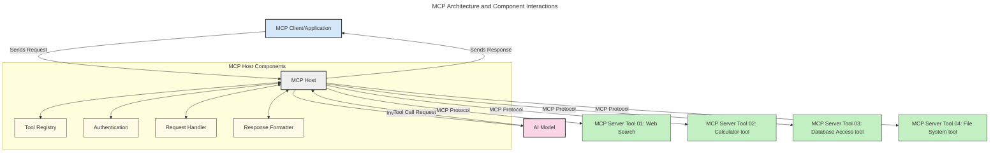

<!--
CO_OP_TRANSLATOR_METADATA:
{
  "original_hash": "0df1ee78a6dd8300f3a040ca5b411c2e",
  "translation_date": "2025-08-18T16:56:17+00:00",
  "source_file": "00-Introduction/README.md",
  "language_code": "pa"
}
-->
# ਮਾਡਲ ਕਾਂਟੈਕਸਟ ਪ੍ਰੋਟੋਕੋਲ (MCP) ਦਾ ਪਰਚੇ: ਵੱਡੇ ਪੈਮਾਨੇ ਦੇ AI ਐਪਲੀਕੇਸ਼ਨ ਲਈ ਇਸਦੀ ਮਹੱਤਤਾ

_(ਉਪਰ ਦਿੱਤੀ ਤਸਵੀਰ 'ਤੇ ਕਲਿਕ ਕਰਕੇ ਇਸ ਪਾਠ ਦਾ ਵੀਡੀਓ ਵੇਖੋ)_

ਜਨਰੇਟਿਵ AI ਐਪਲੀਕੇਸ਼ਨ ਇੱਕ ਵੱਡਾ ਕਦਮ ਹੈ ਕਿਉਂਕਿ ਇਹ ਅਕਸਰ ਯੂਜ਼ਰ ਨੂੰ ਕੁਦਰਤੀ ਭਾਸ਼ਾ ਪ੍ਰੋਮਪਟਾਂ ਦੀ ਵਰਤੋਂ ਕਰਕੇ ਐਪ ਨਾਲ ਇੰਟਰਐਕਟ ਕਰਨ ਦੀ ਆਗਿਆ ਦਿੰਦੇ ਹਨ। ਹਾਲਾਂਕਿ, ਜਿਵੇਂ ਜ਼ਿਆਦਾ ਸਮਾਂ ਅਤੇ ਸਰੋਤ ਐਪਸ ਵਿੱਚ ਲਗਾਏ ਜਾਂਦੇ ਹਨ, ਤੁਸੀਂ ਇਹ ਯਕੀਨੀ ਬਣਾਉਣਾ ਚਾਹੁੰਦੇ ਹੋ ਕਿ ਤੁਸੀਂ ਫੰਕਸ਼ਨਲਿਟੀ ਅਤੇ ਸਰੋਤਾਂ ਨੂੰ ਇਸ ਤਰੀਕੇ ਨਾਲ ਆਸਾਨੀ ਨਾਲ ਸ਼ਾਮਲ ਕਰ ਸਕਦੇ ਹੋ ਕਿ ਇਹ ਵਧਾਉਣ ਲਈ ਆਸਾਨ ਹੋਵੇ, ਤੁਹਾਡਾ ਐਪ ਇੱਕ ਤੋਂ ਵੱਧ ਮਾਡਲ ਦੀ ਵਰਤੋਂ ਕਰਨ ਦੇ ਯੋਗ ਹੋਵੇ, ਅਤੇ ਵੱਖ-ਵੱਖ ਮਾਡਲਾਂ ਦੀਆਂ ਜਟਿਲਤਾਵਾਂ ਨੂੰ ਸੰਭਾਲ ਸਕੇ। ਸਾਰਾ ਕੁਝ ਕਹਿਣ ਦਾ ਮਤਲਬ ਇਹ ਹੈ ਕਿ ਜਨਰੇਟਿਵ AI ਐਪਸ ਬਣਾਉਣਾ ਸ਼ੁਰੂ ਕਰਨ ਲਈ ਆਸਾਨ ਹੈ, ਪਰ ਜਿਵੇਂ ਇਹ ਵਧਦੇ ਹਨ ਅਤੇ ਜਟਿਲ ਹੋ ਜਾਂਦੇ ਹਨ, ਤੁਹਾਨੂੰ ਇੱਕ ਆਰਕੀਟੈਕਚਰ ਨੂੰ ਪਰਿਭਾਸ਼ਿਤ ਕਰਨਾ ਸ਼ੁਰੂ ਕਰਨਾ ਪਵੇਗਾ ਅਤੇ ਸੰਭਾਵਨਾ ਹੈ ਕਿ ਤੁਹਾਨੂੰ ਇੱਕ ਮਿਆਰ 'ਤੇ ਨਿਰਭਰ ਕਰਨਾ ਪਵੇਗਾ ਤਾਂ ਜੋ ਤੁਹਾਡੇ ਐਪਸ ਇੱਕ ਸਥਿਰ ਤਰੀਕੇ ਨਾਲ ਬਣੇ ਹੋਣ। ਇਹੀ MCP ਹੈ ਜੋ ਚੀਜ਼ਾਂ ਨੂੰ ਸੰਗਠਿਤ ਕਰਨ ਅਤੇ ਇੱਕ ਮਿਆਰ ਪ੍ਰਦਾਨ ਕਰਨ ਲਈ ਆਉਂਦਾ ਹੈ।

---

## **🔍 ਮਾਡਲ ਕਾਂਟੈਕਸਟ ਪ੍ਰੋਟੋਕੋਲ (MCP) ਕੀ ਹੈ?**

**ਮਾਡਲ ਕਾਂਟੈਕਸਟ ਪ੍ਰੋਟੋਕੋਲ (MCP)** ਇੱਕ **ਖੁੱਲ੍ਹਾ, ਮਿਆਰੀਕ੍ਰਿਤ ਇੰਟਰਫੇਸ** ਹੈ ਜੋ ਵੱਡੇ ਭਾਸ਼ਾ ਮਾਡਲਾਂ (LLMs) ਨੂੰ ਬਾਹਰੀ ਟੂਲ, APIs, ਅਤੇ ਡਾਟਾ ਸਰੋਤਾਂ ਨਾਲ ਬਿਨਾਂ ਕਿਸੇ ਰੁਕਾਵਟ ਦੇ ਇੰਟਰਐਕਟ ਕਰਨ ਦੀ ਆਗਿਆ ਦਿੰਦਾ ਹੈ। ਇਹ ਇੱਕ ਸਥਿਰ ਆਰਕੀਟੈਕਚਰ ਪ੍ਰਦਾਨ ਕਰਦਾ ਹੈ ਜੋ AI ਮਾਡਲ ਦੀ ਕਾਰਗੁਜ਼ਾਰੀ ਨੂੰ ਉਨ੍ਹਾਂ ਦੇ ਟ੍ਰੇਨਿੰਗ ਡਾਟਾ ਤੋਂ ਪਰੇ ਵਧਾਉਂਦਾ ਹੈ, ਸਮਾਰਟ, ਵੱਡੇ ਪੈਮਾਨੇ ਦੇ, ਅਤੇ ਜ਼ਿਆਦਾ ਪ੍ਰਤੀਕ੍ਰਿਆਸ਼ੀਲ AI ਸਿਸਟਮ ਬਣਾਉਣ ਲਈ।

---

## **🎯 AI ਵਿੱਚ ਮਿਆਰੀਕਰਨ ਕਿਉਂ ਮਹੱਤਵਪੂਰਨ ਹੈ**

ਜਿਵੇਂ ਜਨਰੇਟਿਵ AI ਐਪਲੀਕੇਸ਼ਨ ਜਟਿਲ ਹੋ ਰਹੇ ਹਨ, ਇਹ ਮਿਆਰਾਂ ਨੂੰ ਅਪਨਾਉਣਾ ਜ਼ਰੂਰੀ ਹੈ ਜੋ **ਵੱਡੇ ਪੈਮਾਨੇ, ਵਧਾਉਣਯੋਗਤਾ, ਰੱਖ-ਰਖਾਵਯੋਗਤਾ,** ਅਤੇ **ਵੈਂਡਰ ਲਾਕ-ਇਨ ਤੋਂ ਬਚਣ** ਨੂੰ ਯਕੀਨੀ ਬਣਾਉਂਦੇ ਹਨ। MCP ਇਹ ਜ਼ਰੂਰਤਾਂ ਨੂੰ ਪੂਰਾ ਕਰਦਾ ਹੈ:

- ਮਾਡਲ-ਟੂਲ ਇੰਟੀਗ੍ਰੇਸ਼ਨ ਨੂੰ ਇੱਕਜੁਟ ਕਰਨਾ
- ਕਮਜ਼ੋਰ, ਇੱਕ-ਵਾਰ ਦੇ ਕਸਟਮ ਹੱਲਾਂ ਨੂੰ ਘਟਾਉਣਾ
- ਵੱਖ-ਵੱਖ ਵੈਂਡਰਾਂ ਦੇ ਮਾਡਲਾਂ ਨੂੰ ਇੱਕੋ ਪਰਿਸਥਿਤੀ ਵਿੱਚ ਸਹਿ-ਅਸਤਿਤਵ ਕਰਨ ਦੀ ਆਗਿਆ ਦੇਣਾ

**ਨੋਟ:** ਹਾਲਾਂਕਿ MCP ਆਪਣੇ ਆਪ ਨੂੰ ਇੱਕ ਖੁੱਲ੍ਹਾ ਮਿਆਰ ਦੱਸਦਾ ਹੈ, MCP ਨੂੰ IEEE, IETF, W3C, ISO ਜਾਂ ਕਿਸੇ ਹੋਰ ਮਿਆਰ ਸਰੀਰ ਦੁਆਰਾ ਮਿਆਰੀਕ੍ਰਿਤ ਕਰਨ ਦੀ ਕੋਈ ਯੋਜਨਾ ਨਹੀਂ ਹੈ।

---

## **📚 ਸਿੱਖਣ ਦੇ ਉਦੇਸ਼**

ਇਸ ਲੇਖ ਦੇ ਅੰਤ ਤੱਕ, ਤੁਸੀਂ ਇਹ ਕਰਨ ਦੇ ਯੋਗ ਹੋਵੋਗੇ:

- **ਮਾਡਲ ਕਾਂਟੈਕਸਟ ਪ੍ਰੋਟੋਕੋਲ (MCP)** ਅਤੇ ਇਸਦੇ ਵਰਤੋਂ ਦੇ ਕੇਸਾਂ ਨੂੰ ਪਰਿਭਾਸ਼ਿਤ ਕਰੋ
- ਸਮਝੋ ਕਿ MCP ਮਾਡਲ-ਟੂ-ਟੂਲ ਸੰਚਾਰ ਨੂੰ ਕਿਵੇਂ ਮਿਆਰੀਕ੍ਰਿਤ ਕਰਦਾ ਹੈ
- MCP ਆਰਕੀਟੈਕਚਰ ਦੇ ਮੁੱਖ ਘਟਕਾਂ ਦੀ ਪਛਾਣ ਕਰੋ
- ਐਨਟਰਪ੍ਰਾਈਜ਼ ਅਤੇ ਵਿਕਾਸ ਦੇ ਸੰਦਰਭਾਂ ਵਿੱਚ MCP ਦੇ ਅਸਲ-ਜਗਤ ਦੇ ਐਪਲੀਕੇਸ਼ਨ ਦੀ ਖੋਜ ਕਰੋ

---

## **💡 ਮਾਡਲ ਕਾਂਟੈਕਸਟ ਪ੍ਰੋਟੋਕੋਲ (MCP) ਕਿਉਂ ਇੱਕ ਗੇਮ-ਚੇਂਜਰ ਹੈ**

### **🔗 MCP AI ਇੰਟਰਐਕਸ਼ਨ ਵਿੱਚ ਫਰੈਗਮੈਂਟੇਸ਼ਨ ਨੂੰ ਹੱਲ ਕਰਦਾ ਹੈ**

MCP ਤੋਂ ਪਹਿਲਾਂ, ਮਾਡਲਾਂ ਨੂੰ ਟੂਲਾਂ ਨਾਲ ਜੋੜਨ ਲਈ ਲੋੜ ਹੁੰਦੀ ਸੀ:

- ਹਰ ਟੂਲ-ਮਾਡਲ ਜੋੜੇ ਲਈ ਕਸਟਮ ਕੋਡ
- ਹਰ ਵੈਂਡਰ ਲਈ ਗੈਰ-ਮਿਆਰੀ APIs
- ਅੱਪਡੇਟਾਂ ਦੇ ਕਾਰਨ ਅਕਸਰ ਟੂਟ-ਫੂਟ
- ਵੱਧ ਟੂਲਾਂ ਨਾਲ ਖਰਾਬ ਵੱਡੇ ਪੈਮਾਨੇ

### **✅ MCP ਮਿਆਰੀਕਰਨ ਦੇ ਫਾਇਦੇ**

| **ਫਾਇਦਾ**                | **ਵੇਰਵਾ**                                                                      |
|--------------------------|--------------------------------------------------------------------------------|
| ਇੰਟਰਓਪਰੇਬਿਲਿਟੀ         | LLMs ਵੱਖ-ਵੱਖ ਵੈਂਡਰਾਂ ਦੇ ਟੂਲਾਂ ਨਾਲ ਬਿਨਾਂ ਕਿਸੇ ਰੁਕਾਵਟ ਦੇ ਕੰਮ ਕਰਦੇ ਹਨ            |
| ਸਥਿਰਤਾ                  | ਪਲੇਟਫਾਰਮਾਂ ਅਤੇ ਟੂਲਾਂ ਵਿੱਚ ਇੱਕਸਾਰ ਵਿਹਾਰ                                        |
| ਦੁਬਾਰਾ ਵਰਤਣਯੋਗਤਾ       | ਇੱਕ ਵਾਰ ਬਣਾਏ ਟੂਲ ਪ੍ਰਾਜੈਕਟਾਂ ਅਤੇ ਸਿਸਟਮਾਂ ਵਿੱਚ ਵਰਤੇ ਜਾ ਸਕਦੇ ਹਨ                   |
| ਵਿਕਾਸ ਵਿੱਚ ਤੇਜ਼ੀ          | ਮਿਆਰੀਕ੍ਰਿਤ, ਪਲੱਗ-ਐਂਡ-ਪਲੇ ਇੰਟਰਫੇਸ ਦੀ ਵਰਤੋਂ ਕਰਕੇ ਵਿਕਾਸ ਸਮਾਂ ਘਟਾਓ               |

---

## **🧱 ਉੱਚ-ਸਤਹ MCP ਆਰਕੀਟੈਕਚਰ ਦਾ ਜਾਇਜ਼ਾ**

MCP ਇੱਕ **ਕਲਾਇੰਟ-ਸਰਵਰ ਮਾਡਲ** ਦੀ ਪਾਲਣਾ ਕਰਦਾ ਹੈ, ਜਿੱਥੇ:

- **MCP ਹੋਸਟ** AI ਮਾਡਲ ਚਲਾਉਂਦੇ ਹਨ
- **MCP ਕਲਾਇੰਟ** ਬੇਨਤੀ ਸ਼ੁਰੂ ਕਰਦੇ ਹਨ
- **MCP ਸਰਵਰ** ਸੰਦਰਭ, ਟੂਲ, ਅਤੇ ਸਮਰੱਥਾਵਾਂ ਪ੍ਰਦਾਨ ਕਰਦੇ ਹਨ

### **ਮੁੱਖ ਘਟਕ:**

- **ਸਰੋਤ** – ਮਾਡਲਾਂ ਲਈ ਸਥਿਰ ਜਾਂ ਗਤੀਸ਼ੀਲ ਡਾਟਾ  
- **ਪ੍ਰੋਮਪਟ** – ਪੂਰਵ-ਨਿਰਧਾਰਤ ਵਰਕਫਲੋਜ਼ ਲਈ  
- **ਟੂਲ** – ਖੋਜ, ਗਣਨਾ ਵਰਗੇ ਕਾਰਜ  
- **ਸੈਂਪਲਿੰਗ** – ਰਿਕਰਸਿਵ ਇੰਟਰਐਕਸ਼ਨ ਦੁਆਰਾ ਏਜੰਟਿਕ ਵਿਹਾਰ

---

## MCP ਸਰਵਰ ਕਿਵੇਂ ਕੰਮ ਕਰਦੇ ਹਨ

MCP ਸਰਵਰ ਹੇਠਾਂ ਦਿੱਤੇ ਤਰੀਕੇ ਨਾਲ ਕੰਮ ਕਰਦੇ ਹਨ:

- **ਬੇਨਤੀ ਦਾ ਪ੍ਰਵਾਹ**:
    1. ਇੱਕ ਬੇਨਤੀ ਅੰਤਮ ਯੂਜ਼ਰ ਜਾਂ ਉਨ੍ਹਾਂ ਦੀ ਥਾਂ ਕੰਮ ਕਰਨ ਵਾਲੇ ਸੌਫਟਵੇਅਰ ਦੁਆਰਾ ਸ਼ੁਰੂ ਕੀਤੀ ਜਾਂਦੀ ਹੈ।
    2. **MCP ਕਲਾਇੰਟ** ਬੇਨਤੀ ਨੂੰ **MCP ਹੋਸਟ** ਨੂੰ ਭੇਜਦਾ ਹੈ, ਜੋ AI ਮਾਡਲ ਰਨਟਾਈਮ ਦਾ ਪ੍ਰਬੰਧ ਕਰਦਾ ਹੈ।
    3. **AI ਮਾਡਲ** ਯੂਜ਼ਰ ਪ੍ਰੋਮਪਟ ਪ੍ਰਾਪਤ ਕਰਦਾ ਹੈ ਅਤੇ ਇੱਕ ਜਾਂ ਵੱਧ ਟੂਲ ਕਾਲਾਂ ਦੁਆਰਾ ਬਾਹਰੀ ਟੂਲਾਂ ਜਾਂ ਡਾਟਾ ਤੱਕ ਪਹੁੰਚ ਦੀ ਬੇਨਤੀ ਕਰ ਸਕਦਾ ਹੈ।
    4. **MCP ਹੋਸਟ**, ਮਾਡਲ ਸਿੱਧੇ ਨਹੀਂ, ਮਿਆਰੀਕ੍ਰਿਤ ਪ੍ਰੋਟੋਕੋਲ ਦੀ ਵਰਤੋਂ ਕਰਕੇ ਉਚਿਤ **MCP ਸਰਵਰ(ਜ਼)** ਨਾਲ ਸੰਚਾਰ ਕਰਦਾ ਹੈ।
- **MCP ਹੋਸਟ ਦੀ ਕਾਰਗੁਜ਼ਾਰੀ**:
    - **ਟੂਲ ਰਜਿਸਟਰੀ**: ਉਪਲਬਧ ਟੂਲਾਂ ਅਤੇ ਉਨ੍ਹਾਂ ਦੀਆਂ ਸਮਰੱਥਾਵਾਂ ਦੀ ਕੈਟਾਲੌਗ ਰੱਖਦਾ ਹੈ।
    - **ਪ੍ਰਮਾਣਿਕਤਾ**: ਟੂਲ ਪਹੁੰਚ ਲਈ ਅਨੁਮਤੀਆਂ ਦੀ ਪੁਸ਼ਟੀ ਕਰਦਾ ਹੈ।
    - **ਬੇਨਤੀ ਸੰਭਾਲਕ**: ਮਾਡਲ ਤੋਂ ਆਉਣ ਵਾਲੀਆਂ ਟੂਲ ਬੇਨਤੀਆਂ ਨੂੰ ਪ੍ਰਕਿਰਿਆ ਕਰਦਾ ਹੈ।
    - **ਜਵਾਬ ਫਾਰਮੈਟਰ**: ਟੂਲ ਆਉਟਪੁੱਟ ਨੂੰ ਇੱਕ ਫਾਰਮੈਟ ਵਿੱਚ ਬਣਾਉਂਦਾ ਹੈ ਜੋ ਮਾਡਲ ਸਮਝ ਸਕਦਾ ਹੈ।
- **MCP ਸਰਵਰ ਦੀ ਕਾਰਗੁਜ਼ਾਰੀ**:
    - **MCP ਹੋਸਟ** ਟੂਲ ਕਾਲਾਂ ਨੂੰ ਇੱਕ ਜਾਂ ਵੱਧ **MCP ਸਰਵਰ(ਜ਼)** ਨੂੰ ਰੂਟ ਕਰਦਾ ਹੈ, ਹਰ ਇੱਕ ਵਿਸ਼ੇਸ਼ ਕਾਰਜ (ਜਿਵੇਂ ਖੋਜ, ਗਣਨਾ, ਡਾਟਾਬੇਸ ਪੁੱਛਗਿੱਛ) ਪ੍ਰਦਾਨ ਕਰਦਾ ਹੈ।
    - **MCP ਸਰਵਰ(ਜ਼)** ਆਪਣੇ-ਆਪਣੇ ਕਾਰਜ ਕਰਦੇ ਹਨ ਅਤੇ **MCP ਹੋਸਟ** ਨੂੰ ਇੱਕ ਸਥਿਰ ਫਾਰਮੈਟ ਵਿੱਚ ਨਤੀਜੇ ਵਾਪਸ ਕਰਦੇ ਹਨ।
    - **MCP ਹੋਸਟ** ਇਹ ਨਤੀਜੇ ਫਾਰਮੈਟ ਕਰਦਾ ਹੈ ਅਤੇ **AI ਮਾਡਲ** ਨੂੰ ਵਾਪਸ ਭੇਜਦਾ ਹੈ।
- **ਜਵਾਬ ਪੂਰਾ ਹੋਣਾ**:
    - **AI ਮਾਡਲ** ਟੂਲ ਆਉਟਪੁੱਟ ਨੂੰ ਅੰਤਮ ਜਵਾਬ ਵਿੱਚ ਸ਼ਾਮਲ ਕਰਦਾ ਹੈ।
    - **MCP ਹੋਸਟ** ਇਸ ਜਵਾਬ ਨੂੰ ਵਾਪਸ **MCP ਕਲਾਇੰਟ** ਨੂੰ ਭੇਜਦਾ ਹੈ, ਜੋ ਇਸਨੂੰ ਅੰਤਮ ਯੂਜ਼ਰ ਜਾਂ ਕਾਲਿੰਗ ਸੌਫਟਵੇਅਰ ਨੂੰ ਪਹੁੰਚਾਉਂਦਾ ਹੈ।

## 👨‍💻 MCP ਸਰਵਰ ਬਣਾਉਣ ਦਾ ਤਰੀਕਾ (ਉਦਾਹਰਣਾਂ ਦੇ ਨਾਲ)

MCP ਸਰਵਰ LLM ਸਮਰੱਥਾਵਾਂ ਨੂੰ ਡਾਟਾ ਅਤੇ ਕਾਰਗੁਜ਼ਾਰੀ ਪ੍ਰਦਾਨ ਕਰਕੇ ਵਧਾਉਣ ਦੀ ਆਗਿਆ ਦਿੰਦੇ ਹਨ। 

ਤਿਆਰ ਹੋ? ਇੱਥੇ ਵੱਖ-ਵੱਖ ਭਾਸ਼ਾਵਾਂ/ਸਟੈਕਸ ਵਿੱਚ ਸਧਾਰਨ MCP ਸਰਵਰ ਬਣਾਉਣ ਦੇ ਉਦਾਹਰਣਾਂ ਦੇ ਨਾਲ ਭਾਸ਼ਾ ਅਤੇ/ਜਾਂ ਸਟੈਕ ਵਿਸ਼ੇਸ਼ SDKs ਹਨ:

- **Python SDK**: https://github.com/modelcontextprotocol/python-sdk

- **TypeScript SDK**: https://github.com/modelcontextprotocol/typescript-sdk

- **Java SDK**: https://github.com/modelcontextprotocol/java-sdk

- **C#/.NET SDK**: https://github.com/modelcontextprotocol/csharp-sdk

## 🌍 MCP ਦੇ ਅਸਲ-ਜਗਤ ਦੇ ਵਰਤੋਂ ਦੇ ਕੇਸ

MCP AI ਸਮਰੱਥਾਵਾਂ ਨੂੰ ਵਧਾਉਣ ਦੁਆਰਾ ਵੱਖ-ਵੱਖ ਐਪਲੀਕੇਸ਼ਨ ਦੀ ਆਗਿਆ ਦਿੰਦਾ ਹੈ:

| **ਐਪਲੀਕੇਸ਼ਨ**              | **ਵੇਰਵਾ**                                                                      |
|------------------------------|--------------------------------------------------------------------------------|
| ਐਨਟਰਪ੍ਰਾਈਜ਼ ਡਾਟਾ ਇੰਟੀਗ੍ਰੇਸ਼ਨ  | LLMs ਨੂੰ ਡਾਟਾਬੇਸ, CRMs, ਜਾਂ ਅੰਦਰੂਨੀ ਟੂਲਾਂ ਨਾਲ ਜੋੜੋ                           |
| ਏਜੰਟਿਕ AI ਸਿਸਟਮ            | ਟੂਲ ਪਹੁੰਚ ਅਤੇ ਫੈਸਲੇ ਲੈਣ ਦੇ ਵਰਕਫਲੋਜ਼ ਨਾਲ ਸਵੈ-ਚਾਲਤ ਏਜੰਟਾਂ ਨੂੰ ਯੋਗ ਬਣਾਓ          |
| ਮਲਟੀ-ਮੋਡਲ ਐਪਲੀਕੇਸ਼ਨ        | ਇੱਕੋ ਇੱਕ AI ਐਪ ਵਿੱਚ ਟੈਕਸਟ, ਚਿੱਤਰ, ਅਤੇ ਆਡੀਓ ਟੂਲਾਂ ਨੂੰ ਜੋੜੋ                     |
| ਰੀਅਲ-ਟਾਈਮ ਡਾਟਾ ਇੰਟੀਗ੍ਰੇਸ਼ਨ | AI ਇੰਟਰਐਕਸ਼ਨ ਵਿੱਚ ਲਾਈਵ ਡਾਟਾ ਲਿਆਓ ਜ਼ਿਆਦਾ ਸਹੀ, ਮੌਜੂਦਾ ਆਉਟਪੁੱਟ ਲਈ              |

### 🧠 MCP = AI ਇੰਟਰਐਕਸ਼ਨ ਲਈ ਯੂਨੀਵਰਸਲ ਮਿਆਰ

ਮਾਡਲ ਕਾਂਟੈਕਸਟ ਪ੍ਰੋਟੋਕੋਲ (MCP) AI ਇੰਟਰਐਕਸ਼ਨ ਲਈ ਇੱਕ ਯੂਨੀਵਰਸਲ ਮਿਆਰ ਵਜੋਂ ਕੰਮ ਕਰਦਾ ਹੈ, ਜਿਵੇਂ USB-C ਡਿਵਾਈਸਾਂ ਲਈ ਭੌਤਿਕ ਕਨੈਕਸ਼ਨਾਂ ਨੂੰ ਮਿਆਰੀਕ੍ਰਿਤ ਕਰਦਾ ਹੈ। AI ਦੀ ਦੁਨੀਆ ਵਿੱਚ, MCP ਇੱਕ ਸਥਿਰ ਇੰਟਰਫੇਸ ਪ੍ਰਦਾਨ ਕਰਦਾ ਹੈ, ਜੋ ਮਾਡਲਾਂ (ਕਲਾਇੰਟਾਂ) ਨੂੰ ਬਾਹਰੀ ਟੂਲਾਂ ਅਤੇ ਡਾਟਾ ਪ੍ਰਦਾਤਾਵਾਂ (ਸਰਵਰਾਂ) ਨਾਲ ਬਿਨਾਂ ਕਿਸੇ ਰੁਕਾਵਟ ਦੇ ਜੋੜਨ ਦੀ ਆਗਿਆ ਦਿੰਦਾ ਹੈ। ਇਹ ਹਰ API ਜਾਂ ਡਾਟਾ ਸਰੋਤ ਲਈ ਵੱਖ-ਵੱਖ, ਕਸਟਮ ਪ੍ਰੋਟੋਕੋਲ ਦੀ ਲੋੜ ਨੂੰ ਖਤਮ ਕਰਦਾ ਹੈ।

MCP ਦੇ ਅਧੀਨ, ਇੱਕ MCP-ਅਨੁਕੂਲ ਟੂਲ (ਜਿਸਨੂੰ MCP ਸਰਵਰ ਕਿਹਾ ਜਾਂਦਾ ਹੈ) ਇੱਕ ਸਥਿਰ ਮਿਆਰ ਦੀ ਪਾਲਣਾ ਕਰਦਾ ਹੈ। ਇਹ ਸਰਵਰ ਉਹ ਟੂਲ ਜਾਂ ਕਾਰਜ ਸੂਚੀਬੱਧ ਕਰ ਸਕਦੇ ਹਨ ਜੋ ਉਹ ਪੇਸ਼ ਕਰਦੇ ਹਨ ਅਤੇ ਜਦੋਂ AI ਏਜੰਟ ਦੁਆਰਾ ਬੇਨਤੀ ਕੀਤੀ ਜਾਂਦੀ ਹੈ ਤਾਂ ਉਹ ਕਾਰਜ ਕਰਦੇ ਹਨ। MCP ਨੂੰ ਸਹਾਇਕ ਏਜੰਟ ਪਲੇਟਫਾਰਮਾਂ ਉਪਲਬਧ ਟੂਲਾਂ ਦੀ ਖੋਜ ਕਰਨ ਅਤੇ ਇਸ ਮਿਆਰੀਕ੍ਰਿਤ ਪ੍ਰੋਟੋਕੋਲ ਦੁਆਰਾ ਉਨ੍ਹਾਂ ਨੂੰ ਕਾਲ ਕਰਨ ਦੇ ਯੋਗ ਹਨ।

### 💡 ਗਿਆਨ ਤੱਕ ਪਹੁੰਚ ਨੂੰ ਸਹਾਇਕ ਬਣਾਉਣਾ

ਟੂਲਾਂ ਦੀ ਪੇਸ਼ਕਸ਼ ਤੋਂ ਇਲਾਵਾ, MCP ਗਿਆਨ ਤੱਕ ਪਹੁੰਚ ਨੂੰ ਵੀ ਸਹਾਇਕ ਬਣਾਉਂਦਾ ਹੈ। ਇਹ ਐਪਲੀਕੇਸ਼ਨ ਨੂੰ ਵੱਡੇ ਭਾਸ਼ਾ ਮਾਡਲਾਂ (LLMs) ਨੂੰ ਵੱਖ-ਵੱਖ ਡਾਟਾ ਸਰੋਤਾਂ ਨਾਲ ਜੋੜ ਕੇ ਸੰਦਰਭ ਪ੍ਰਦਾਨ ਕਰਨ ਦੀ ਆਗਿਆ ਦਿੰਦਾ ਹੈ। ਉਦਾਹਰਣ ਲਈ, ਇੱਕ MCP ਸਰਵਰ ਇੱਕ ਕੰਪਨੀ ਦੇ ਦਸਤਾਵੇਜ਼ ਰਿਪੋਜ਼ਟਰੀ ਦਾ ਪ੍ਰਤੀਨਿਧਿਤਾ ਕਰ ਸਕਦਾ ਹੈ, ਜੋ ਏਜੰਟਾਂ ਨੂੰ ਮੰਗ 'ਤੇ ਸਬੰਧਤ ਜਾਣਕਾਰੀ ਪ੍ਰਾਪਤ ਕਰਨ ਦੀ ਆਗਿਆ ਦਿੰਦਾ ਹੈ। ਇੱਕ ਹੋਰ ਸਰਵਰ ਵਿਸ਼ੇਸ਼ ਕਾਰਜਾਂ ਨੂੰ ਸੰਭਾਲ ਸਕਦਾ ਹੈ ਜਿਵੇਂ ਈਮੇਲ ਭੇਜਣਾ ਜਾਂ ਰਿਕਾਰਡ ਅਪਡੇਟ ਕਰਨਾ। ਏਜੰਟ ਦੇ ਨਜ਼ਰੀਏ ਤੋਂ, ਇਹ ਸਿਰਫ ਟੂਲ ਹਨ ਜੋ ਇਹ ਵਰਤ ਸਕਦਾ ਹੈ—ਕੁਝ ਟੂਲ ਡਾਟਾ (ਗਿਆਨ ਸੰਦਰਭ) ਵਾਪਸ ਕਰਦੇ ਹਨ, ਜਦਕਿ ਹੋਰ ਕਾਰਜ ਕਰਦੇ ਹਨ। MCP ਦੋਵਾਂ ਨੂੰ ਕੁਸ਼ਲਤਾਪੂਰਵਕ ਸੰਭਾਲਦਾ ਹੈ।

MCP ਸਰਵਰ ਨਾਲ ਜੁੜਨ ਵਾਲਾ ਇੱਕ ਏਜੰਟ ਸਥਿਰ ਫਾਰਮੈਟ ਦੁਆਰਾ ਸਰਵਰ ਦੀਆਂ ਉਪਲਬਧ ਸਮਰੱਥਾਵਾਂ ਅਤੇ ਪਹੁੰਚਯੋਗ ਡਾਟਾ ਬਾਰੇ ਆਪਣੇ-ਆਪ ਨੂੰ ਸਵੈ-ਚੇਤਨ ਕਰਦਾ ਹੈ। ਇਹ ਮਿਆਰੀਕਰਨ ਗਤੀਸ਼ੀਲ ਟੂਲ ਉਪਲਬਧਤਾ ਨੂੰ ਯੋਗ ਬਣਾਉਂਦਾ ਹੈ। ਉਦਾਹਰਣ ਲਈ, ਇੱਕ ਏਜੰਟ ਦੇ ਸਿਸਟਮ ਵਿੱਚ ਇੱਕ ਨਵਾਂ MCP ਸਰਵਰ ਸ਼ਾਮਲ ਕਰਨਾ ਇਸਦੇ ਕਾਰਜਾਂ ਨੂੰ ਤੁਰੰਤ ਵਰਤਣਯੋਗ ਬਣਾਉਂਦਾ ਹੈ ਬਿਨਾਂ ਏਜੰਟ ਦੇ ਨਿਰਦੇਸ਼ਾਂ ਨੂੰ ਹੋਰ ਕਸਟਮਾਈਜ਼ ਕਰਨ ਦੀ ਲੋੜ।

ਇਹ ਸਧਾਰਨ ਇੰਟੀਗ੍ਰੇਸ਼ਨ ਹੇਠਾਂ ਦਿੱਤੇ ਡਾਇਗ੍ਰਾਮ ਵਿੱਚ ਦਰਸਾਏ ਗਏ ਪ੍ਰਵਾਹ ਦੇ ਨਾਲ ਸੰਗਤ ਹੈ, ਜਿੱਥੇ ਸਰਵਰ ਟੂਲ ਅਤੇ ਗਿਆਨ ਦੋਵਾਂ ਪ੍ਰਦਾਨ ਕਰਦੇ ਹਨ, ਸਿਸਟਮਾਂ ਵਿੱਚ ਬਿਨਾਂ ਕਿਸੇ ਰੁਕਾਵਟ ਦੇ ਸਹਿਕਾਰ ਨੂੰ ਯਕੀਨੀ ਬਣਾਉਂਦੇ ਹਨ। 

### 👉 ਉਦਾਹਰਣ: ਵੱਡੇ ਪੈਮਾਨੇ ਦਾ ਏਜੰਟ ਹੱਲ

### 🔄 ਕਲਾਇੰਟ-ਸਾਈਡ LLM ਇੰਟੀਗ੍ਰੇਸ਼ਨ ਨਾਲ ਉੱਚ MCP ਸੰਦਰਭ

ਮੁੱਢਲੇ MCP ਆਰਕੀਟ

**ਅਸਵੀਕਾਰਨ**:  
ਇਹ ਦਸਤਾਵੇਜ਼ AI ਅਨੁਵਾਦ ਸੇਵਾ [Co-op Translator](https://github.com/Azure/co-op-translator) ਦੀ ਵਰਤੋਂ ਕਰਕੇ ਅਨੁਵਾਦ ਕੀਤਾ ਗਿਆ ਹੈ। ਜਦੋਂ ਕਿ ਅਸੀਂ ਸਹੀਤਾ ਲਈ ਯਤਨਸ਼ੀਲ ਹਾਂ, ਕਿਰਪਾ ਕਰਕੇ ਧਿਆਨ ਦਿਓ ਕਿ ਸਵੈਚਾਲਿਤ ਅਨੁਵਾਦਾਂ ਵਿੱਚ ਗਲਤੀਆਂ ਜਾਂ ਅਸੁਚਨਾਵਾਂ ਹੋ ਸਕਦੀਆਂ ਹਨ। ਮੂਲ ਦਸਤਾਵੇਜ਼ ਨੂੰ ਇਸਦੀ ਮੂਲ ਭਾਸ਼ਾ ਵਿੱਚ ਅਧਿਕਾਰਤ ਸਰੋਤ ਮੰਨਿਆ ਜਾਣਾ ਚਾਹੀਦਾ ਹੈ। ਮਹੱਤਵਪੂਰਨ ਜਾਣਕਾਰੀ ਲਈ, ਪੇਸ਼ੇਵਰ ਮਨੁੱਖੀ ਅਨੁਵਾਦ ਦੀ ਸਿਫਾਰਸ਼ ਕੀਤੀ ਜਾਂਦੀ ਹੈ। ਇਸ ਅਨੁਵਾਦ ਦੀ ਵਰਤੋਂ ਤੋਂ ਪੈਦਾ ਹੋਣ ਵਾਲੇ ਕਿਸੇ ਵੀ ਗਲਤਫਹਿਮੀ ਜਾਂ ਗਲਤ ਵਿਆਖਿਆ ਲਈ ਅਸੀਂ ਜ਼ਿੰਮੇਵਾਰ ਨਹੀਂ ਹਾਂ।