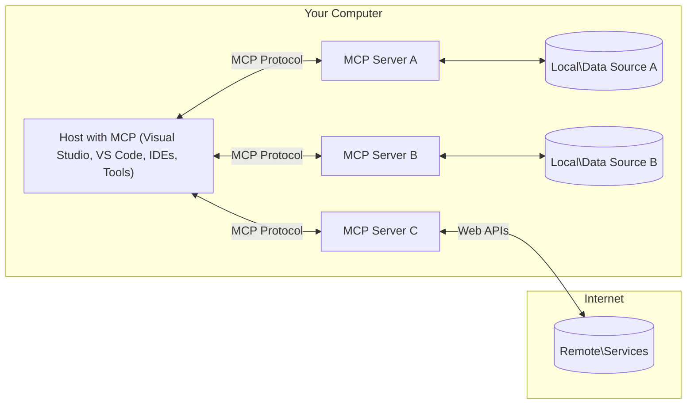

<!--
CO_OP_TRANSLATOR_METADATA:
{
  "original_hash": "0a6a7bcb289c024a91289e0444cb370b",
  "translation_date": "2025-08-18T16:28:10+00:00",
  "source_file": "01-CoreConcepts/README.md",
  "language_code": "pa"
}
-->
# MCP ਮੁੱਖ ਧਾਰਨਾਵਾਂ: AI ਇੰਟੀਗ੍ਰੇਸ਼ਨ ਲਈ ਮਾਡਲ ਕਾਂਟੈਕਸਟ ਪ੍ਰੋਟੋਕੋਲ ਨੂੰ ਸਮਝਣਾ

[](https://youtu.be/earDzWGtE84)

_(ਉਪਰ ਦਿੱਤੀ ਤਸਵੀਰ 'ਤੇ ਕਲਿਕ ਕਰਕੇ ਇਸ ਪਾਠ ਦਾ ਵੀਡੀਓ ਵੇਖੋ)_

[Model Context Protocol (MCP)](https://gi- **ਸਪਸ਼ਟ ਉਪਭੋਗਤਾ ਸਹਿਮਤੀ**: ਸਾਰੇ ਡਾਟਾ ਐਕਸੈਸ ਅਤੇ ਕਾਰਵਾਈਆਂ ਨੂੰ ਚਲਾਉਣ ਤੋਂ ਪਹਿਲਾਂ ਸਪਸ਼ਟ ਉਪਭੋਗਤਾ ਮਨਜ਼ੂਰੀ ਦੀ ਲੋੜ ਹੁੰਦੀ ਹੈ। ਉਪਭੋਗਤਾਵਾਂ ਨੂੰ ਸਪਸ਼ਟ ਤੌਰ 'ਤੇ ਸਮਝਣਾ ਚਾਹੀਦਾ ਹੈ ਕਿ ਕਿਹੜਾ ਡਾਟਾ ਐਕਸੈਸ ਕੀਤਾ ਜਾਵੇਗਾ ਅਤੇ ਕਿਹੜੀਆਂ ਕਾਰਵਾਈਆਂ ਕੀਤੀਆਂ ਜਾਣਗੀਆਂ, ਜਿਸ ਨਾਲ ਅਧਿਕਾਰਾਂ ਅਤੇ ਮਨਜ਼ੂਰੀਆਂ 'ਤੇ ਗਹਿਰਾਈ ਨਾਲ ਕੰਟਰੋਲ ਹੁੰਦਾ ਹੈ।

- **ਡਾਟਾ ਗੋਪਨੀਯਤਾ ਸੁਰੱਖਿਆ**: ਉਪਭੋਗਤਾ ਡਾਟਾ ਸਿਰਫ ਸਪਸ਼ਟ ਸਹਿਮਤੀ ਨਾਲ ਹੀ ਉਜਾਗਰ ਕੀਤਾ ਜਾਂਦਾ ਹੈ ਅਤੇ ਪੂਰੇ ਇੰਟਰੈਕਸ਼ਨ ਲਾਈਫਸਾਈਕਲ ਦੌਰਾਨ ਮਜ਼ਬੂਤ ਐਕਸੈਸ ਕੰਟਰੋਲ ਦੁਆਰਾ ਸੁਰੱਖਿਅਤ ਕੀਤਾ ਜਾਣਾ ਚਾਹੀਦਾ ਹੈ। ਅਣਅਧਿਕਾਰਤ ਡਾਟਾ ਟ੍ਰਾਂਸਮਿਸ਼ਨ ਨੂੰ ਰੋਕਣ ਅਤੇ ਸਖਤ ਗੋਪਨੀਯਤਾ ਸੀਮਾਵਾਂ ਨੂੰ ਬਣਾਈ ਰੱਖਣ ਲਈ ਲਾਗੂ ਕੀਤਾ ਜਾਣਾ ਚਾਹੀਦਾ ਹੈ।

- **ਟੂਲ ਚਲਾਉਣ ਦੀ ਸੁਰੱਖਿਆ**: ਹਰ ਟੂਲ ਨੂੰ ਚਲਾਉਣ ਲਈ ਸਪਸ਼ਟ ਉਪਭੋਗਤਾ ਸਹਿਮਤੀ ਦੀ ਲੋੜ ਹੁੰਦੀ ਹੈ, ਜਿਸ ਨਾਲ ਟੂਲ ਦੀ ਕਾਰਗੁਜ਼ਾਰੀ, ਪੈਰਾਮੀਟਰਾਂ ਅਤੇ ਸੰਭਾਵਿਤ ਪ੍ਰਭਾਵ ਦੀ ਸਪਸ਼ਟ ਸਮਝ ਹੁੰਦੀ ਹੈ। ਅਣਜਾਣੇ, ਅਸੁਰੱਖਿਅਤ ਜਾਂ ਦੁਸ਼ਟ ਟੂਲ ਚਲਾਉਣ ਨੂੰ ਰੋਕਣ ਲਈ ਮਜ਼ਬੂਤ ਸੁਰੱਖਿਆ ਸੀਮਾਵਾਂ ਲਾਗੂ ਕੀਤੀਆਂ ਜਾਣੀਆਂ ਚਾਹੀਦੀਆਂ ਹਨ।

- **ਟ੍ਰਾਂਸਪੋਰਟ ਲੇਅਰ ਸੁਰੱਖਿਆ**: ਸਾਰੇ ਸੰਚਾਰ ਚੈਨਲਾਂ ਨੂੰ ਉਚਿਤ ਇਨਕ੍ਰਿਪਸ਼ਨ ਅਤੇ ਪ੍ਰਮਾਣਿਕਤਾ ਮਕੈਨਿਜ਼ਮਾਂ ਦੀ ਵਰਤੋਂ ਕਰਨੀ ਚਾਹੀਦੀ ਹੈ। ਦੂਰ-ਦੂਰ ਦੇ ਕਨੈਕਸ਼ਨਾਂ ਨੂੰ ਸੁਰੱਖਿਅਤ ਟ੍ਰਾਂਸਪੋਰਟ ਪ੍ਰੋਟੋਕੋਲ ਅਤੇ ਸਹੀ ਪ੍ਰਮਾਣ ਪੱਤਰ ਪ੍ਰਬੰਧਨ ਲਾਗੂ ਕਰਨਾ ਚਾਹੀਦਾ ਹੈ।

#### ਲਾਗੂ ਕਰਨ ਦੇ ਨਿਰਦੇਸ਼:

- **ਅਧਿਕਾਰ ਪ੍ਰਬੰਧਨ**: ਉਪਭੋਗਤਾਵਾਂ ਨੂੰ ਕੰਟਰੋਲ ਕਰਨ ਦੀ ਆਗਿਆ ਦੇਣ ਵਾਲੇ ਸੁਖਮ ਅਧਿਕਾਰ ਪ੍ਰਣਾਲੀਆਂ ਲਾਗੂ ਕਰੋ ਕਿ ਕਿਹੜੇ ਸਰਵਰ, ਟੂਲ ਅਤੇ ਸਰੋਤ ਪਹੁੰਚਯੋਗ ਹਨ।
- **ਪ੍ਰਮਾਣਿਕਤਾ ਅਤੇ ਅਧਿਕਾਰ**: ਸਹੀ ਟੋਕਨ ਪ੍ਰਬੰਧਨ ਅਤੇ ਮਿਆਦ ਦੇ ਨਾਲ ਸੁਰੱਖਿਅਤ ਪ੍ਰਮਾਣਿਕਤਾ ਵਿਧੀਆਂ (OAuth, API ਕੁੰਜੀਆਂ) ਦੀ ਵਰਤੋਂ ਕਰੋ।  
- **ਇਨਪੁਟ ਵੈਧਤਾ**: ਇੰਜੈਕਸ਼ਨ ਹਮਲਿਆਂ ਨੂੰ ਰੋਕਣ ਲਈ ਪਰਿਭਾਸ਼ਿਤ ਸਕੀਮਾਂ ਦੇ ਅਨੁਸਾਰ ਸਾਰੇ ਪੈਰਾਮੀਟਰਾਂ ਅਤੇ ਡਾਟਾ ਇਨਪੁਟਾਂ ਦੀ ਵੈਧਤਾ ਕਰੋ।
- **ਆਡਿਟ ਲੌਗਿੰਗ**: ਸੁਰੱਖਿਆ ਨਿਗਰਾਨੀ ਅਤੇ ਅਨੁਕੂਲਤਾ ਲਈ ਸਾਰੀਆਂ ਕਾਰਵਾਈਆਂ ਦੇ ਵਿਸਤ੍ਰਿਤ ਲੌਗਸ ਰੱਖੋ।

## ਝਲਕ

ਇਸ ਪਾਠ ਵਿੱਚ ਮਾਡਲ ਕਾਂਟੈਕਸਟ ਪ੍ਰੋਟੋਕੋਲ (MCP) ਪ੍ਰਣਾਲੀ ਦੇ ਮੁੱਖ ਆਰਕੀਟੈਕਚਰ ਅਤੇ ਘਟਕਾਂ ਦੀ ਪੜਚੋਲ ਕੀਤੀ ਗਈ ਹੈ। ਤੁਸੀਂ ਸਿੱਖੋਗੇ ਕਿ ਕਲਾਇੰਟ-ਸਰਵਰ ਆਰਕੀਟੈਕਚਰ, ਮੁੱਖ ਭੂਮਿਕਾਵਾਂ, ਅਤੇ ਸੰਚਾਰ ਮਕੈਨਿਜ਼ਮ MCP ਇੰਟਰੈਕਸ਼ਨ ਨੂੰ ਕਿਵੇਂ ਸ਼ਕਤੀਸ਼ਾਲੀ ਬਣਾਉਂਦੇ ਹਨ।

## ਮੁੱਖ ਸਿੱਖਣ ਦੇ ਉਦੇਸ਼

ਇਸ ਪਾਠ ਦੇ ਅੰਤ ਤੱਕ, ਤੁਸੀਂ:

- MCP ਕਲਾਇੰਟ-ਸਰਵਰ ਆਰਕੀਟੈਕਚਰ ਨੂੰ ਸਮਝ ਸਕੋਗੇ।
- ਹੋਸਟਸ, ਕਲਾਇੰਟਸ, ਅਤੇ ਸਰਵਰਾਂ ਦੀਆਂ ਭੂਮਿਕਾਵਾਂ ਅਤੇ ਜ਼ਿੰਮੇਵਾਰੀਆਂ ਦੀ ਪਛਾਣ ਕਰ ਸਕੋਗੇ।
- MCP ਨੂੰ ਇੱਕ ਲਚਕਦਾਰ ਇੰਟੀਗ੍ਰੇਸ਼ਨ ਲੇਅਰ ਬਣਾਉਣ ਵਾਲੀਆਂ ਮੁੱਖ ਵਿਸ਼ੇਸ਼ਤਾਵਾਂ ਦਾ ਵਿਸ਼ਲੇਸ਼ਣ ਕਰ ਸਕੋਗੇ।
- MCP ਪ੍ਰਣਾਲੀ ਵਿੱਚ ਜਾਣਕਾਰੀ ਦੇ ਪ੍ਰਵਾਹ ਨੂੰ ਸਮਝ ਸਕੋਗੇ।
- .NET, Java, Python, ਅਤੇ JavaScript ਵਿੱਚ ਕੋਡ ਉਦਾਹਰਣਾਂ ਰਾਹੀਂ ਵਿਹੰਗੀਕ ਝਲਕ ਪ੍ਰਾਪਤ ਕਰ ਸਕੋਗੇ।

## MCP ਆਰਕੀਟੈਕਚਰ: ਇੱਕ ਗਹਿਰਾਈ ਵਾਲਾ ਅਧਿਐਨ

MCP ਪ੍ਰਣਾਲੀ ਕਲਾਇੰਟ-ਸਰਵਰ ਮਾਡਲ 'ਤੇ ਬਣੀ ਹੈ। ਇਹ ਮੋਡਿਊਲਰ ਢਾਂਚਾ AI ਐਪਲੀਕੇਸ਼ਨਾਂ ਨੂੰ ਟੂਲ, ਡਾਟਾਬੇਸ, APIs, ਅਤੇ ਸੰਦਰਭ ਸਰੋਤਾਂ ਨਾਲ ਕੁਸ਼ਲਤਾ ਨਾਲ ਇੰਟਰੈਕਟ ਕਰਨ ਦੀ ਆਗਿਆ ਦਿੰਦਾ ਹੈ। ਆਓ ਇਸ ਆਰਕੀਟੈਕਚਰ ਨੂੰ ਇਸਦੇ ਮੁੱਖ ਘਟਕਾਂ ਵਿੱਚ ਵੰਡ ਕੇ ਸਮਝੀਏ।

MCP ਦੇ ਕੇਂਦਰ ਵਿੱਚ ਇੱਕ ਕਲਾਇੰਟ-ਸਰਵਰ ਆਰਕੀਟੈਕਚਰ ਹੈ ਜਿੱਥੇ ਇੱਕ ਹੋਸਟ ਐਪਲੀਕੇਸ਼ਨ ਕਈ ਸਰਵਰਾਂ ਨਾਲ ਜੁੜ ਸਕਦੀ ਹੈ:



- **MCP ਹੋਸਟਸ**: VSCode, Claude Desktop, IDEs ਜਾਂ AI ਟੂਲ ਵਰਗੇ ਪ੍ਰੋਗਰਾਮ ਜੋ MCP ਰਾਹੀਂ ਡਾਟਾ ਤੱਕ ਪਹੁੰਚ ਕਰਨਾ ਚਾਹੁੰਦੇ ਹਨ।
- **MCP ਕਲਾਇੰਟਸ**: ਪ੍ਰੋਟੋਕੋਲ ਕਲਾਇੰਟਸ ਜੋ ਸਰਵਰਾਂ ਨਾਲ 1:1 ਕਨੈਕਸ਼ਨ ਬਣਾਈ ਰੱਖਦੇ ਹਨ।
- **MCP ਸਰਵਰਸ**: ਹਲਕੇ ਪ੍ਰੋਗਰਾਮ ਜੋ ਮਾਡਲ ਕਾਂਟੈਕਸਟ ਪ੍ਰੋਟੋਕੋਲ ਰਾਹੀਂ ਵਿਸ਼ੇਸ਼ ਸਮਰਥਨ ਪ੍ਰਦਾਨ ਕਰਦੇ ਹਨ।
- **ਸਥਾਨਕ ਡਾਟਾ ਸਰੋਤ**: ਤੁਹਾਡੇ ਕੰਪਿਊਟਰ ਦੀਆਂ ਫਾਈਲਾਂ, ਡਾਟਾਬੇਸ, ਅਤੇ ਸੇਵਾਵਾਂ ਜਿਨ੍ਹਾਂ ਤੱਕ MCP ਸਰਵਰ ਸੁਰੱਖਿਅਤ ਪਹੁੰਚ ਕਰ ਸਕਦੇ ਹਨ।
- **ਦੂਰ-ਦੂਰ ਦੀਆਂ ਸੇਵਾਵਾਂ**: ਇੰਟਰਨੈਟ 'ਤੇ ਉਪਲਬਧ ਬਾਹਰੀ ਪ੍ਰਣਾਲੀਆਂ ਜਿਨ੍ਹਾਂ ਤੱਕ MCP ਸਰਵਰ APIs ਰਾਹੀਂ ਜੁੜ ਸਕਦੇ ਹਨ।

MCP ਪ੍ਰੋਟੋਕੋਲ ਇੱਕ ਵਿਕਾਸਸ਼ੀਲ ਮਿਆਰ ਹੈ ਜੋ ਮਿਤੀ-ਅਧਾਰਿਤ ਵਰਜਨਿੰਗ (YYYY-MM-DD ਫਾਰਮੈਟ) ਦੀ ਵਰਤੋਂ ਕਰਦਾ ਹੈ। ਮੌਜੂਦਾ ਪ੍ਰੋਟੋਕੋਲ ਵਰਜਨ **2025-06-18** ਹੈ। ਤੁਸੀਂ [ਪ੍ਰੋਟੋਕੋਲ ਵਿਸ਼ੇਸ਼ਤਾ](https://modelcontextprotocol.io/specification/2025-06-18/) ਦੇ ਤਾਜ਼ਾ ਅੱਪਡੇਟ ਵੇਖ ਸਕਦੇ ਹੋ। 

### 1. ਹੋਸਟਸ

ਮਾਡਲ ਕਾਂਟੈਕਸਟ ਪ੍ਰੋਟੋਕੋਲ (MCP) ਵਿੱਚ, **ਹੋਸਟਸ** AI ਐਪਲੀਕੇਸ਼ਨ ਹਨ ਜੋ ਉਪਭੋਗਤਾਵਾਂ ਲਈ ਪ੍ਰੋਟੋਕੋਲ ਨਾਲ ਇੰਟਰੈਕਟ ਕਰਨ ਦਾ ਮੁੱਖ ਇੰਟਰਫੇਸ ਸੇਵਾ ਦਿੰਦੇ ਹਨ। ਹੋਸਟਸ ਕਈ MCP ਸਰਵਰਾਂ ਨਾਲ ਕਨੈਕਸ਼ਨ ਪ੍ਰਬੰਧਿਤ ਅਤੇ ਸਹਿਕਾਰ ਕਰਦੇ ਹਨ, ਹਰ ਸਰਵਰ ਕਨੈਕਸ਼ਨ ਲਈ ਸਮਰਪਿਤ MCP ਕਲਾਇੰਟ ਬਣਾਉਂਦੇ ਹਨ। ਹੋਸਟਸ ਦੇ ਉਦਾਹਰਣ ਹਨ:

- **AI ਐਪਲੀਕੇਸ਼ਨ**: Claude Desktop, Visual Studio Code, Claude Code
- **ਡਿਵੈਲਪਮੈਂਟ ਵਾਤਾਵਰਣ**: IDEs ਅਤੇ ਕੋਡ ਐਡੀਟਰ MCP ਇੰਟੀਗ੍ਰੇਸ਼ਨ ਨਾਲ  
- **ਕਸਟਮ ਐਪਲੀਕੇਸ਼ਨ**: ਉਦੇਸ਼-ਨਿਰਧਾਰਤ AI ਏਜੰਟ ਅਤੇ ਟੂਲ

**ਹੋਸਟਸ** ਉਹ ਐਪਲੀਕੇਸ਼ਨ ਹਨ ਜੋ AI ਮਾਡਲ ਇੰਟਰੈਕਸ਼ਨ ਨੂੰ ਸਹਿਕਾਰ ਕਰਦੇ ਹਨ। ਇਹ:

- **AI ਮਾਡਲਾਂ ਦਾ ਸੰਗਠਨ**: LLMs ਨੂੰ ਚਲਾਉਣ ਜਾਂ ਜਵਾਬ ਪੈਦਾ ਕਰਨ ਲਈ ਇੰਟਰੈਕਟ ਕਰਦੇ ਹਨ ਅਤੇ AI ਵਰਕਫਲੋਜ਼ ਨੂੰ ਸਹਿਕਾਰ ਕਰਦੇ ਹਨ।
- **ਕਲਾਇੰਟ ਕਨੈਕਸ਼ਨ ਪ੍ਰਬੰਧਿਤ ਕਰਦੇ ਹਨ**: ਹਰ MCP ਸਰਵਰ ਕਨੈਕਸ਼ਨ ਲਈ ਇੱਕ MCP ਕਲਾਇੰਟ ਬਣਾਉਂਦੇ ਅਤੇ ਸਹਿਕਾਰ ਕਰਦੇ ਹਨ।
- **ਉਪਭੋਗਤਾ ਇੰਟਰਫੇਸ ਨੂੰ ਕੰਟਰੋਲ ਕਰਦੇ ਹਨ**: ਗੱਲਬਾਤ ਦੇ ਪ੍ਰਵਾਹ, ਉਪਭੋਗਤਾ ਇੰਟਰੈਕਸ਼ਨ, ਅਤੇ ਜਵਾਬ ਪੇਸ਼ਕਸ਼ ਨੂੰ ਸੰਭਾਲਦੇ ਹਨ।  
- **ਸੁਰੱਖਿਆ ਲਾਗੂ ਕਰਦੇ ਹਨ**: ਅਧਿਕਾਰਾਂ, ਸੁਰੱਖਿਆ ਸੀਮਾਵਾਂ, ਅਤੇ ਪ੍ਰਮਾਣਿਕਤਾ ਨੂੰ ਕੰਟਰੋਲ ਕਰਦੇ ਹਨ।
- **ਉਪਭੋਗਤਾ ਸਹਿਮਤੀ ਨੂੰ ਸੰਭਾਲਦੇ ਹਨ**: ਡਾਟਾ ਸਾਂਝਾ ਕਰਨ ਅਤੇ ਟੂਲ ਚਲਾਉਣ ਲਈ ਉਪਭੋਗਤਾ ਮਨਜ਼ੂਰੀ ਪ੍ਰਬੰਧਿਤ ਕਰਦੇ ਹਨ।

### 2. ਕਲਾਇੰਟਸ

**ਕਲਾਇੰਟਸ** ਉਹ ਅਹਿਮ ਘਟਕ ਹਨ ਜੋ ਹੋਸਟਸ ਅਤੇ MCP ਸਰਵਰਾਂ ਦੇ ਵਿਚਕਾਰ ਸਮਰਪਿਤ ਇੱਕ-ਤੋਂ-ਇੱਕ ਕਨੈਕਸ਼ਨ ਬਣਾਈ ਰੱਖਦੇ ਹਨ। ਹਰ MCP ਕਲਾਇੰਟ ਹੋਸਟ ਦੁਆਰਾ ਇੱਕ ਵਿਸ਼ੇਸ਼ MCP ਸਰਵਰ ਨਾਲ ਜੁੜਨ ਲਈ ਬਣਾਇਆ ਜਾਂਦਾ ਹੈ, ਜਿਸ ਨਾਲ ਸੰਗਠਿਤ ਅਤੇ ਸੁਰੱਖਿਅਤ ਸੰਚਾਰ ਚੈਨਲਾਂ ਨੂੰ ਯਕੀਨੀ ਬਣਾਇਆ ਜਾਂਦਾ ਹੈ। ਕਈ ਕਲਾਇੰਟਸ ਹੋਸਟਸ ਨੂੰ ਇੱਕ ਸਮੇਂ ਵਿੱਚ ਕਈ ਸਰਵਰਾਂ ਨਾਲ ਜੁੜਨ ਦੀ ਆਗਿਆ ਦਿੰਦੇ ਹਨ।

**ਕਲਾਇੰਟਸ** ਹੋਸਟ ਐਪਲੀਕੇਸ਼ਨ ਦੇ ਅੰਦਰ ਕਨੈਕਟਰ ਘਟਕ ਹਨ। ਇਹ:

- **ਪ੍ਰੋਟੋਕੋਲ ਸੰਚਾਰ**: ਸਰਵਰਾਂ ਨੂੰ JSON-RPC 2.0 ਬੇਨਤੀ ਭੇਜਦੇ ਹਨ ਜਿਨ੍ਹਾਂ ਵਿੱਚ ਪ੍ਰੋੰਪਟਸ ਅਤੇ ਹਦਾਇਤਾਂ ਹੁੰਦੀਆਂ ਹਨ।
- **ਸਮਰਥਨ ਦੀ ਗੱਲਬਾਤ**: ਸ਼ੁਰੂਆਤ ਦੌਰਾਨ ਸਰਵਰਾਂ ਨਾਲ ਸਮਰਥਿਤ ਵਿਸ਼ੇਸ਼ਤਾਵਾਂ ਅਤੇ ਪ੍ਰੋਟੋਕੋਲ ਵਰਜਨ ਦੀ ਗੱਲਬਾਤ ਕਰਦੇ ਹਨ।
- **ਟੂਲ ਚਲਾਉਣ**: ਮਾਡਲਾਂ ਤੋਂ ਟੂਲ ਚਲਾਉਣ ਦੀਆਂ ਬੇਨਤੀਆਂ ਪ੍ਰਬੰਧਿਤ ਕਰਦੇ ਹਨ ਅਤੇ ਜਵਾਬ ਪ੍ਰਕਿਰਿਆ ਕਰਦੇ ਹਨ।
- **ਤੁਰੰਤ ਅੱਪਡੇਟ**: ਸਰਵਰਾਂ ਤੋਂ ਸੂਚਨਾਵਾਂ ਅਤੇ ਤੁਰੰਤ ਅੱਪਡੇਟ ਪ੍ਰਬੰਧਿਤ ਕਰਦੇ ਹਨ।
- **ਜਵਾਬ ਪ੍ਰਕਿਰਿਆ**: ਉਪਭੋਗਤਾਵਾਂ ਨੂੰ ਦਿਖਾਉਣ ਲਈ ਸਰਵਰ ਜਵਾਬਾਂ ਨੂੰ ਪ੍ਰਕਿਰਿਆ ਕਰਦੇ ਹਨ ਅਤੇ ਫਾਰਮੈਟ ਕਰਦੇ ਹਨ।

### 3. ਸਰਵਰਸ

**ਸਰਵਰਸ** ਉਹ ਪ੍ਰੋਗਰਾਮ ਹਨ ਜੋ MCP ਕਲਾਇੰਟਸ ਨੂੰ ਸੰਦਰਭ, ਟੂਲ, ਅਤੇ ਸਮਰਥਨ ਪ੍ਰਦਾਨ ਕਰਦੇ ਹਨ। ਇਹ ਸਥਾਨਕ ਤੌਰ 'ਤੇ (ਹੋਸਟ ਦੇ ਸਮੇ ਮਸ਼ੀਨ 'ਤੇ) ਜਾਂ ਦੂਰ-ਦੂਰ (ਬਾਹਰੀ ਪਲੇਟਫਾਰਮਾਂ 'ਤੇ) ਚਲ ਸਕਦੇ ਹਨ, ਅਤੇ ਕਲਾਇੰਟ ਬੇਨਤੀਆਂ ਨੂੰ ਸੰਭਾਲਣ ਅਤੇ ਸੰਰਚਿਤ ਜਵਾਬ ਪ੍ਰਦਾਨ ਕਰਨ ਲਈ ਜ਼ਿੰਮੇਵਾਰ ਹਨ। MCP ਪ੍ਰੋਟੋਕੋਲ ਰਾਹੀਂ ਵਿਸ਼ੇਸ਼ ਸਮਰਥਨ ਪ੍ਰਦਾਨ ਕਰਨ ਲਈ ਸਰਵਰਸ ਸਟੈਂਡਰਡਾਈਜ਼ਡ ਸਮਰਥਨ ਨੂੰ ਉਜਾਗਰ ਕਰਦੇ ਹਨ।

**ਸਰਵਰਸ** ਸੇਵਾਵਾਂ ਹਨ ਜੋ ਸੰਦਰਭ ਅਤੇ ਸਮਰਥਨ ਪ੍ਰਦਾਨ ਕਰਦੇ ਹਨ। ਇਹ:

- **ਵਿਸ਼ੇਸ਼ਤਾ ਰਜਿਸਟਰੇਸ਼ਨ**: ਉਪਲਬਧ ਪ੍ਰਿਮਿਟਿਵਜ਼ (ਸਰੋਤ, ਪ੍ਰੋੰਪਟਸ, ਟੂਲ) ਨੂੰ ਕਲਾਇੰਟਸ ਲਈ ਰਜਿਸਟਰ ਅਤੇ ਉਜਾਗਰ ਕਰਦੇ ਹਨ।
- **ਬੇਨਤੀ ਪ੍ਰਕਿਰਿਆ**: ਕਲਾਇੰਟਸ ਤੋਂ ਟੂਲ ਕਾਲਾਂ, ਸਰੋਤ ਬੇਨਤੀਆਂ, ਅਤੇ ਪ੍ਰੋੰਪਟ ਬੇਨਤੀਆਂ ਪ੍ਰਾਪਤ ਕਰਦੇ ਹਨ ਅਤੇ ਚਲਾਉਂਦੇ ਹਨ।
- **ਸੰਦਰਭ ਪ੍ਰਦਾਨ**: ਮਾਡਲ ਜਵਾਬਾਂ ਨੂੰ ਵਧੀਆ ਬਣਾਉਣ ਲਈ ਸੰਦਰਭ ਜਾਣਕਾਰੀ ਅਤੇ ਡਾਟਾ ਪ੍ਰਦਾਨ ਕਰਦੇ ਹਨ।
- **ਸਥਿਤੀ ਪ੍ਰਬੰਧਨ**: ਜਦੋਂ ਲੋੜ ਹੋਵੇ, ਸੈਸ਼ਨ ਸਥਿਤੀ ਨੂੰ ਬਣਾਈ ਰੱਖਦੇ ਹਨ ਅਤੇ ਸਥਿਤੀਵਾਨ ਇੰਟਰੈਕਸ਼ਨ ਨੂੰ ਸੰਭਾਲਦੇ ਹਨ।
- **ਤੁਰੰਤ ਸੂਚਨਾਵਾਂ**: ਜੁੜੇ ਕਲਾਇੰਟਸ ਨੂੰ ਸਮਰਥਨ ਬਦਲਾਅ ਅਤੇ ਅੱਪਡੇਟ ਬਾਰੇ ਸੂਚਨਾਵਾਂ ਭੇਜਦੇ ਹਨ।

ਸਰਵਰਸ ਕਿਸੇ ਵੀ ਵਿਅਕਤੀ ਦੁਆਰਾ ਵਿਕਸਿਤ ਕੀਤੇ ਜਾ ਸਕਦੇ ਹਨ ਜੋ ਮਾਡਲ ਸਮਰਥਨ ਨੂੰ ਵਿਸ਼ੇਸ਼ ਸਮਰਥਨ ਨਾਲ ਵਧਾਉਣ ਲਈ। ਇਹ ਸਥਾਨਕ ਅਤੇ ਦੂਰ-ਦੂਰ ਦੋਵੇਂ ਤਰ੍ਹਾਂ ਦੇployment ਸਥਿਤੀਆਂ ਦਾ ਸਮਰਥਨ ਕਰਦੇ ਹਨ।
- **ਲਾਈਫਸਾਈਕਲ ਮੈਨੇਜਮੈਂਟ**: ਕਲਾਇੰਟ ਅਤੇ ਸਰਵਰਾਂ ਦੇ ਵਿਚਕਾਰ ਕਨੈਕਸ਼ਨ ਸ਼ੁਰੂ ਕਰਨ, ਸਮਰੱਥਾ ਦੀ ਗੱਲਬਾਤ ਕਰਨ ਅਤੇ ਸੈਸ਼ਨ ਨੂੰ ਖਤਮ ਕਰਨ ਦੀ ਪ੍ਰਕਿਰਿਆ ਨੂੰ ਸੰਭਾਲਦਾ ਹੈ  
- **ਸਰਵਰ ਪ੍ਰਿਮਿਟਿਵਜ਼**: ਸਰਵਰਾਂ ਨੂੰ ਟੂਲ, ਸਰੋਤਾਂ ਅਤੇ ਪ੍ਰੋੰਪਟਾਂ ਰਾਹੀਂ ਮੁੱਖ ਕਾਰਜਸ਼ੀਲਤਾ ਪ੍ਰਦਾਨ ਕਰਨ ਯੋਗ ਬਣਾਉਂਦਾ ਹੈ  
- **ਕਲਾਇੰਟ ਪ੍ਰਿਮਿਟਿਵਜ਼**: ਸਰਵਰਾਂ ਨੂੰ LLMs ਤੋਂ ਸੈਂਪਲਿੰਗ ਦੀ ਬੇਨਤੀ ਕਰਨ, ਯੂਜ਼ਰ ਇਨਪੁਟ ਪ੍ਰਾਪਤ ਕਰਨ ਅਤੇ ਲੌਗ ਸੁਨੇਹੇ ਭੇਜਣ ਯੋਗ ਬਣਾਉਂਦਾ ਹੈ  
- **ਰਿਅਲ-ਟਾਈਮ ਨੋਟੀਫਿਕੇਸ਼ਨ**: ਪੋਲਿੰਗ ਤੋਂ ਬਿਨਾਂ ਗਤੀਸ਼ੀਲ ਅੱਪਡੇਟਾਂ ਲਈ ਅਸਮਕਾਲੀ ਨੋਟੀਫਿਕੇਸ਼ਨ ਦਾ ਸਮਰਥਨ ਕਰਦਾ ਹੈ  

#### ਮੁੱਖ ਵਿਸ਼ੇਸ਼ਤਾਵਾਂ:

- **ਪ੍ਰੋਟੋਕੋਲ ਵਰਜਨ ਗੱਲਬਾਤ**: ਤਾਰੀਖ-ਅਧਾਰਿਤ ਵਰਜਨਿੰਗ (YYYY-MM-DD) ਦੀ ਵਰਤੋਂ ਕਰਕੇ ਅਨੁਕੂਲਤਾ ਨੂੰ ਯਕੀਨੀ ਬਣਾਉਂਦਾ ਹੈ  
- **ਸਮਰੱਥਾ ਖੋਜ**: ਸ਼ੁਰੂਆਤ ਦੌਰਾਨ ਕਲਾਇੰਟ ਅਤੇ ਸਰਵਰ ਸਹਾਇਕ ਵਿਸ਼ੇਸ਼ਤਾਵਾਂ ਦੀ ਜਾਣਕਾਰੀ ਸਾਂਝੀ ਕਰਦੇ ਹਨ  
- **ਸਟੇਟਫੁਲ ਸੈਸ਼ਨ**: ਕਈ ਇੰਟਰੈਕਸ਼ਨ ਦੇ ਦੌਰਾਨ ਕਨੈਕਸ਼ਨ ਸਥਿਤੀ ਨੂੰ ਬਣਾਈ ਰੱਖਦਾ ਹੈ ਤਾਂ ਜੋ ਸੰਦਰਭ ਦੀ ਲਗਾਤਾਰਤਾ ਹੋਵੇ  

### ਟ੍ਰਾਂਸਪੋਰਟ ਲੇਅਰ

**ਟ੍ਰਾਂਸਪੋਰਟ ਲੇਅਰ** MCP ਭਾਗੀਦਾਰਾਂ ਦੇ ਵਿਚਕਾਰ ਸੰਚਾਰ ਚੈਨਲ, ਸੁਨੇਹਾ ਫ੍ਰੇਮਿੰਗ ਅਤੇ ਪ੍ਰਮਾਣਿਕਤਾ ਨੂੰ ਸੰਭਾਲਦਾ ਹੈ:  

#### ਸਮਰਥਿਤ ਟ੍ਰਾਂਸਪੋਰਟ ਮਕੈਨਿਜ਼ਮ:

1. **STDIO ਟ੍ਰਾਂਸਪੋਰਟ**:  
   - ਸਿੱਧੇ ਪ੍ਰਕਿਰਿਆ ਸੰਚਾਰ ਲਈ ਸਟੈਂਡਰਡ ਇਨਪੁਟ/ਆਉਟਪੁੱਟ ਸਟ੍ਰੀਮ ਦੀ ਵਰਤੋਂ ਕਰਦਾ ਹੈ  
   - ਉਹਨਾਂ ਮਸ਼ੀਨਾਂ 'ਤੇ ਸਥਾਨਕ ਪ੍ਰਕਿਰਿਆਵਾਂ ਲਈ ਉਤਕ੍ਰਿਸ਼ਟ ਜਿੱਥੇ ਕੋਈ ਨੈਟਵਰਕ ਓਵਰਹੈੱਡ ਨਹੀਂ ਹੈ  
   - ਆਮ ਤੌਰ 'ਤੇ ਸਥਾਨਕ MCP ਸਰਵਰ ਇਮਪਲੀਮੈਂਟੇਸ਼ਨ ਲਈ ਵਰਤਿਆ ਜਾਂਦਾ ਹੈ  

2. **ਸਟ੍ਰੀਮਬਲ HTTP ਟ੍ਰਾਂਸਪੋਰਟ**:  
   - ਕਲਾਇੰਟ-ਤੋਂ-ਸਰਵਰ ਸੁਨੇਹਿਆਂ ਲਈ HTTP POST ਦੀ ਵਰਤੋਂ ਕਰਦਾ ਹੈ  
   - ਸਰਵਰ-ਤੋਂ-ਕਲਾਇੰਟ ਸਟ੍ਰੀਮਿੰਗ ਲਈ ਵਿਕਲਪਿਕ Server-Sent Events (SSE)  
   - ਨੈਟਵਰਕਾਂ ਦੇ ਪਾਰ ਦੂਰ-ਦੂਰ ਦੇ ਸਰਵਰ ਸੰਚਾਰ ਯੋਗ ਬਣਾਉਂਦਾ ਹੈ  
   - ਸਟੈਂਡਰਡ HTTP ਪ੍ਰਮਾਣਿਕਤਾ (ਬੇਅਰ ਟੋਕਨ, API ਕੁੰਜੀਆਂ, ਕਸਟਮ ਹੈਡਰ) ਦਾ ਸਮਰਥਨ ਕਰਦਾ ਹੈ  
   - ਸੁਰੱਖਿਅਤ ਟੋਕਨ-ਅਧਾਰਿਤ ਪ੍ਰਮਾਣਿਕਤਾ ਲਈ MCP OAuth ਦੀ ਸਿਫਾਰਸ਼ ਕਰਦਾ ਹੈ  

#### ਟ੍ਰਾਂਸਪੋਰਟ ਐਬਸਟ੍ਰੈਕਸ਼ਨ:

ਟ੍ਰਾਂਸਪੋਰਟ ਲੇਅਰ ਡੇਟਾ ਲੇਅਰ ਤੋਂ ਸੰਚਾਰ ਵੇਰਵੇ ਨੂੰ ਐਬਸਟ੍ਰੈਕਟ ਕਰਦਾ ਹੈ, ਸਾਰੇ ਟ੍ਰਾਂਸਪੋਰਟ ਮਕੈਨਿਜ਼ਮਾਂ 'ਤੇ ਇੱਕੋ JSON-RPC 2.0 ਸੁਨੇਹਾ ਫਾਰਮੈਟ ਯੋਗ ਬਣਾਉਂਦਾ ਹੈ। ਇਹ ਐਬਸਟ੍ਰੈਕਸ਼ਨ ਐਪਲੀਕੇਸ਼ਨਾਂ ਨੂੰ ਸਥਾਨਕ ਅਤੇ ਦੂਰ-ਦੂਰ ਦੇ ਸਰਵਰਾਂ ਦੇ ਵਿਚਕਾਰ ਬਿਨਾਂ ਕਿਸੇ ਰੁਕਾਵਟ ਦੇ ਸਵਿੱਚ ਕਰਨ ਦੀ ਆਗਿਆ ਦਿੰਦਾ ਹੈ।  

### ਸੁਰੱਖਿਆ ਵਿਚਾਰ

MCP ਇਮਪਲੀਮੈਂਟੇਸ਼ਨ ਨੂੰ ਸਾਰੇ ਪ੍ਰੋਟੋਕੋਲ ਕਾਰਵਾਈਆਂ ਦੇ ਦੌਰਾਨ ਸੁਰੱਖਿਅਤ, ਭਰੋਸੇਯੋਗ ਅਤੇ ਸੁਰੱਖਿਅਤ ਇੰਟਰੈਕਸ਼ਨ ਨੂੰ ਯਕੀਨੀ ਬਣਾਉਣ ਲਈ ਕਈ ਮਹੱਤਵਪੂਰਨ ਸੁਰੱਖਿਆ ਸਿਧਾਂਤਾਂ ਦੀ ਪਾਲਣਾ ਕਰਨੀ ਚਾਹੀਦੀ ਹੈ:  

- **ਯੂਜ਼ਰ ਦੀ ਸਹਿਮਤੀ ਅਤੇ ਨਿਯੰਤਰਣ**: ਕਿਸੇ ਵੀ ਡੇਟਾ ਤੱਕ ਪਹੁੰਚ ਕਰਨ ਜਾਂ ਕਾਰਵਾਈ ਕਰਨ ਤੋਂ ਪਹਿਲਾਂ ਯੂਜ਼ਰ ਨੂੰ ਸਪਸ਼ਟ ਸਹਿਮਤੀ ਦੇਣੀ ਚਾਹੀਦੀ ਹੈ। ਯੂਜ਼ਰ ਨੂੰ ਸਪਸ਼ਟ ਨਿਯੰਤਰਣ ਹੋਣਾ ਚਾਹੀਦਾ ਹੈ ਕਿ ਕਿਹੜਾ ਡੇਟਾ ਸਾਂਝਾ ਕੀਤਾ ਜਾ ਰਿਹਾ ਹੈ ਅਤੇ ਕਿਹੜੀਆਂ ਕਾਰਵਾਈਆਂ ਨੂੰ ਅਧਿਕ੍ਰਿਤ ਕੀਤਾ ਗਿਆ ਹੈ, ਸਹਾਇਕ ਯੂਜ਼ਰ ਇੰਟਰਫੇਸਾਂ ਦੁਆਰਾ ਜੋ ਗਤੀਵਿਧੀਆਂ ਦੀ ਸਮੀਖਾ ਕਰਨ ਅਤੇ ਮਨਜ਼ੂਰੀ ਦੇਣ ਲਈ ਸਹੂਲਤ ਪ੍ਰਦਾਨ ਕਰਦੇ ਹਨ।  

- **ਡੇਟਾ ਗੋਪਨੀਯਤਾ**: ਯੂਜ਼ਰ ਡੇਟਾ ਨੂੰ ਸਿਰਫ ਸਪਸ਼ਟ ਸਹਿਮਤੀ ਨਾਲ ਹੀ ਉਜਾਗਰ ਕੀਤਾ ਜਾਣਾ ਚਾਹੀਦਾ ਹੈ ਅਤੇ ਯੋਗ ਪਹੁੰਚ ਨਿਯੰਤਰਣ ਦੁਆਰਾ ਸੁਰੱਖਿਅਤ ਕੀਤਾ ਜਾਣਾ ਚਾਹੀਦਾ ਹੈ। MCP ਇਮਪਲੀਮੈਂਟੇਸ਼ਨ ਨੂੰ ਅਣਅਧਿਕ੍ਰਿਤ ਡੇਟਾ ਪ੍ਰਸਾਰਣ ਦੇ ਖਿਲਾਫ ਸੁਰੱਖਿਅਤ ਕਰਨਾ ਚਾਹੀਦਾ ਹੈ ਅਤੇ ਸਾਰੇ ਇੰਟਰੈਕਸ਼ਨ ਦੇ ਦੌਰਾਨ ਗੋਪਨੀਯਤਾ ਨੂੰ ਯਕੀਨੀ ਬਣਾਉਣਾ ਚਾਹੀਦਾ ਹੈ।  

- **ਟੂਲ ਸੁਰੱਖਿਆ**: ਕਿਸੇ ਵੀ ਟੂਲ ਨੂੰ ਚਲਾਉਣ ਤੋਂ ਪਹਿਲਾਂ ਸਪਸ਼ਟ ਯੂਜ਼ਰ ਸਹਿਮਤੀ ਦੀ ਲੋੜ ਹੁੰਦੀ ਹੈ। ਯੂਜ਼ਰ ਨੂੰ ਹਰ ਟੂਲ ਦੀ ਕਾਰਜਸ਼ੀਲਤਾ ਦੀ ਸਪਸ਼ਟ ਸਮਝ ਹੋਣੀ ਚਾਹੀਦੀ ਹੈ, ਅਤੇ ਅਣਚਾਹੇ ਜਾਂ ਅਸੁਰੱਖਿਅਤ ਟੂਲ ਚਲਾਉਣ ਨੂੰ ਰੋਕਣ ਲਈ ਮਜ਼ਬੂਤ ਸੁਰੱਖਿਆ ਸੀਮਾਵਾਂ ਲਾਗੂ ਕੀਤੀਆਂ ਜਾਣੀਆਂ ਚਾਹੀਦੀਆਂ ਹਨ।  

ਇਹ ਸੁਰੱਖਿਆ ਸਿਧਾਂਤਾਂ ਦੀ ਪਾਲਣਾ ਕਰਕੇ, MCP ਯੂਜ਼ਰ ਦੇ ਭਰੋਸੇ, ਗੋਪਨੀਯਤਾ ਅਤੇ ਸੁਰੱਖਿਆ ਨੂੰ ਸਾਰੇ ਪ੍ਰੋਟੋਕੋਲ ਇੰਟਰੈਕਸ਼ਨ ਦੇ ਦੌਰਾਨ ਬਣਾਈ ਰੱਖਦਾ ਹੈ ਜਦੋਂ ਕਿ ਸ਼ਕਤੀਸ਼ਾਲੀ AI ਇੰਟੀਗ੍ਰੇਸ਼ਨ ਯੋਗ ਬਣਾਉਂਦਾ ਹੈ।  

## ਕੋਡ ਉਦਾਹਰਨਾਂ: ਮੁੱਖ ਘਟਕ

ਹੇਠਾਂ ਕਈ ਪ੍ਰਸਿੱਧ ਪ੍ਰੋਗਰਾਮਿੰਗ ਭਾਸ਼ਾਵਾਂ ਵਿੱਚ ਕੋਡ ਉਦਾਹਰਨਾਂ ਦਿੱਤੇ ਗਏ ਹਨ ਜੋ ਦਿਖਾਉਂਦੇ ਹਨ ਕਿ ਮੁੱਖ MCP ਸਰਵਰ ਘਟਕਾਂ ਅਤੇ ਟੂਲਾਂ ਨੂੰ ਕਿਵੇਂ ਲਾਗੂ ਕੀਤਾ ਜਾ ਸਕਦਾ ਹੈ।  

### .NET ਉਦਾਹਰਨ: ਟੂਲਾਂ ਨਾਲ ਇੱਕ ਸਧਾਰਨ MCP ਸਰਵਰ ਬਣਾਉਣਾ

ਇਹ ਇੱਕ ਵਿਹੰਗਮ .NET ਕੋਡ ਉਦਾਹਰਨ ਹੈ ਜੋ ਦਿਖਾਉਂਦਾ ਹੈ ਕਿ ਕਿਵੇਂ ਇੱਕ ਸਧਾਰਨ MCP ਸਰਵਰ ਨੂੰ ਕਸਟਮ ਟੂਲਾਂ ਨਾਲ ਲਾਗੂ ਕੀਤਾ ਜਾ ਸਕਦਾ ਹੈ। ਇਹ ਉਦਾਹਰਨ ਦਿਖਾਉਂਦੀ ਹੈ ਕਿ ਟੂਲਾਂ ਨੂੰ ਕਿਵੇਂ ਪਰਿਭਾਸ਼ਿਤ ਅਤੇ ਰਜਿਸਟਰ ਕੀਤਾ ਜਾ ਸਕਦਾ ਹੈ, ਬੇਨਤੀਆਂ ਨੂੰ ਕਿਵੇਂ ਸੰਭਾਲਿਆ ਜਾ ਸਕਦਾ ਹੈ, ਅਤੇ Model Context Protocol ਨਾਲ ਸਰਵਰ ਨੂੰ ਕਿਵੇਂ ਜੋੜਿਆ ਜਾ ਸਕਦਾ ਹੈ।  

```csharp
using System;
using System.Threading.Tasks;
using ModelContextProtocol.Server;
using ModelContextProtocol.Server.Transport;
using ModelContextProtocol.Server.Tools;

public class WeatherServer
{
    public static async Task Main(string[] args)
    {
        // Create an MCP server
        var server = new McpServer(
            name: "Weather MCP Server",
            version: "1.0.0"
        );
        
        // Register our custom weather tool
        server.AddTool<string, WeatherData>("weatherTool", 
            description: "Gets current weather for a location",
            execute: async (location) => {
                // Call weather API (simplified)
                var weatherData = await GetWeatherDataAsync(location);
                return weatherData;
            });
        
        // Connect the server using stdio transport
        var transport = new StdioServerTransport();
        await server.ConnectAsync(transport);
        
        Console.WriteLine("Weather MCP Server started");
        
        // Keep the server running until process is terminated
        await Task.Delay(-1);
    }
    
    private static async Task<WeatherData> GetWeatherDataAsync(string location)
    {
        // This would normally call a weather API
        // Simplified for demonstration
        await Task.Delay(100); // Simulate API call
        return new WeatherData { 
            Temperature = 72.5,
            Conditions = "Sunny",
            Location = location
        };
    }
}

public class WeatherData
{
    public double Temperature { get; set; }
    public string Conditions { get; set; }
    public string Location { get; set; }
}
```  

### ਜਾਵਾ ਉਦਾਹਰਨ: MCP ਸਰਵਰ ਘਟਕ

ਇਹ ਉਦਾਹਰਨ ਉਪਰੋਕਤ .NET ਉਦਾਹਰਨ ਦੇ ਜੇਹੇ ਹੀ MCP ਸਰਵਰ ਅਤੇ ਟੂਲ ਰਜਿਸਟ੍ਰੇਸ਼ਨ ਨੂੰ ਦਿਖਾਉਂਦੀ ਹੈ, ਪਰ ਜਾਵਾ ਵਿੱਚ ਲਾਗੂ ਕੀਤੀ ਗਈ ਹੈ।  

```java
import io.modelcontextprotocol.server.McpServer;
import io.modelcontextprotocol.server.McpToolDefinition;
import io.modelcontextprotocol.server.transport.StdioServerTransport;
import io.modelcontextprotocol.server.tool.ToolExecutionContext;
import io.modelcontextprotocol.server.tool.ToolResponse;

public class WeatherMcpServer {
    public static void main(String[] args) throws Exception {
        // Create an MCP server
        McpServer server = McpServer.builder()
            .name("Weather MCP Server")
            .version("1.0.0")
            .build();
            
        // Register a weather tool
        server.registerTool(McpToolDefinition.builder("weatherTool")
            .description("Gets current weather for a location")
            .parameter("location", String.class)
            .execute((ToolExecutionContext ctx) -> {
                String location = ctx.getParameter("location", String.class);
                
                // Get weather data (simplified)
                WeatherData data = getWeatherData(location);
                
                // Return formatted response
                return ToolResponse.content(
                    String.format("Temperature: %.1f°F, Conditions: %s, Location: %s", 
                    data.getTemperature(), 
                    data.getConditions(), 
                    data.getLocation())
                );
            })
            .build());
        
        // Connect the server using stdio transport
        try (StdioServerTransport transport = new StdioServerTransport()) {
            server.connect(transport);
            System.out.println("Weather MCP Server started");
            // Keep server running until process is terminated
            Thread.currentThread().join();
        }
    }
    
    private static WeatherData getWeatherData(String location) {
        // Implementation would call a weather API
        // Simplified for example purposes
        return new WeatherData(72.5, "Sunny", location);
    }
}

class WeatherData {
    private double temperature;
    private String conditions;
    private String location;
    
    public WeatherData(double temperature, String conditions, String location) {
        this.temperature = temperature;
        this.conditions = conditions;
        this.location = location;
    }
    
    public double getTemperature() {
        return temperature;
    }
    
    public String getConditions() {
        return conditions;
    }
    
    public String getLocation() {
        return location;
    }
}
```  

### ਪਾਇਥਨ ਉਦਾਹਰਨ: MCP ਸਰਵਰ ਬਣਾਉਣਾ

ਇਸ ਉਦਾਹਰਨ ਵਿੱਚ ਅਸੀਂ ਦਿਖਾਉਂਦੇ ਹਾਂ ਕਿ ਪਾਇਥਨ ਵਿੱਚ MCP ਸਰਵਰ ਕਿਵੇਂ ਬਣਾਇਆ ਜਾ ਸਕਦਾ ਹੈ। ਤੁਹਾਨੂੰ ਦੋ ਵੱਖ-ਵੱਖ ਤਰੀਕੇ ਦਿਖਾਏ ਜਾਂਦੇ ਹਨ ਕਿ ਟੂਲਾਂ ਕਿਵੇਂ ਬਣਾਈਆਂ ਜਾ ਸਕਦੀਆਂ ਹਨ।  

```python
#!/usr/bin/env python3
import asyncio
from mcp.server.fastmcp import FastMCP
from mcp.server.transports.stdio import serve_stdio

# Create a FastMCP server
mcp = FastMCP(
    name="Weather MCP Server",
    version="1.0.0"
)

@mcp.tool()
def get_weather(location: str) -> dict:
    """Gets current weather for a location."""
    # This would normally call a weather API
    # Simplified for demonstration
    return {
        "temperature": 72.5,
        "conditions": "Sunny",
        "location": location
    }

# Alternative approach using a class
class WeatherTools:
    @mcp.tool()
    def forecast(self, location: str, days: int = 1) -> dict:
        """Gets weather forecast for a location for the specified number of days."""
        # This would normally call a weather API forecast endpoint
        # Simplified for demonstration
        return {
            "location": location,
            "forecast": [
                {"day": i+1, "temperature": 70 + i, "conditions": "Partly Cloudy"}
                for i in range(days)
            ]
        }

# Instantiate the class to register its tools
weather_tools = WeatherTools()

# Start the server using stdio transport
if __name__ == "__main__":
    asyncio.run(serve_stdio(mcp))
```  

### ਜਾਵਾਸਕ੍ਰਿਪਟ ਉਦਾਹਰਨ: MCP ਸਰਵਰ ਬਣਾਉਣਾ

ਇਹ ਉਦਾਹਰਨ ਦਿਖਾਉਂਦੀ ਹੈ ਕਿ ਜਾਵਾਸਕ੍ਰਿਪਟ ਵਿੱਚ MCP ਸਰਵਰ ਬਣਾਉਣਾ ਅਤੇ ਦੋ ਮੌਸਮ-ਸੰਬੰਧੀ ਟੂਲਾਂ ਨੂੰ ਕਿਵੇਂ ਰਜਿਸਟਰ ਕਰਨਾ ਹੈ।  

```javascript
// Using the official Model Context Protocol SDK
import { McpServer } from "@modelcontextprotocol/sdk/server/mcp.js";
import { StdioServerTransport } from "@modelcontextprotocol/sdk/server/stdio.js";
import { z } from "zod"; // For parameter validation

// Create an MCP server
const server = new McpServer({
  name: "Weather MCP Server",
  version: "1.0.0"
});

// Define a weather tool
server.tool(
  "weatherTool",
  {
    location: z.string().describe("The location to get weather for")
  },
  async ({ location }) => {
    // This would normally call a weather API
    // Simplified for demonstration
    const weatherData = await getWeatherData(location);
    
    return {
      content: [
        { 
          type: "text", 
          text: `Temperature: ${weatherData.temperature}°F, Conditions: ${weatherData.conditions}, Location: ${weatherData.location}` 
        }
      ]
    };
  }
);

// Define a forecast tool
server.tool(
  "forecastTool",
  {
    location: z.string(),
    days: z.number().default(3).describe("Number of days for forecast")
  },
  async ({ location, days }) => {
    // This would normally call a weather API
    // Simplified for demonstration
    const forecast = await getForecastData(location, days);
    
    return {
      content: [
        { 
          type: "text", 
          text: `${days}-day forecast for ${location}: ${JSON.stringify(forecast)}` 
        }
      ]
    };
  }
);

// Helper functions
async function getWeatherData(location) {
  // Simulate API call
  return {
    temperature: 72.5,
    conditions: "Sunny",
    location: location
  };
}

async function getForecastData(location, days) {
  // Simulate API call
  return Array.from({ length: days }, (_, i) => ({
    day: i + 1,
    temperature: 70 + Math.floor(Math.random() * 10),
    conditions: i % 2 === 0 ? "Sunny" : "Partly Cloudy"
  }));
}

// Connect the server using stdio transport
const transport = new StdioServerTransport();
server.connect(transport).catch(console.error);

console.log("Weather MCP Server started");
```  

ਇਹ ਜਾਵਾਸਕ੍ਰਿਪਟ ਉਦਾਹਰਨ ਦਿਖਾਉਂਦੀ ਹੈ ਕਿ ਕਿਵੇਂ ਇੱਕ MCP ਕਲਾਇੰਟ ਬਣਾਇਆ ਜਾ ਸਕਦਾ ਹੈ ਜੋ ਸਰਵਰ ਨਾਲ ਜੁੜਦਾ ਹੈ, ਇੱਕ ਪ੍ਰੋੰਪਟ ਭੇਜਦਾ ਹੈ, ਅਤੇ ਜਵਾਬ ਨੂੰ ਪ੍ਰਕਿਰਿਆ ਕਰਦਾ ਹੈ ਜਿਸ ਵਿੱਚ ਕੀਤੇ ਗਏ ਕਿਸੇ ਵੀ ਟੂਲ ਕਾਲਾਂ ਨੂੰ ਸ਼ਾਮਲ ਕੀਤਾ ਗਿਆ ਹੈ।  

## ਸੁਰੱਖਿਆ ਅਤੇ ਅਧਿਕਾਰ

MCP ਪ੍ਰੋਟੋਕੋਲ ਦੇ ਦੌਰਾਨ ਸੁਰੱਖਿਆ ਅਤੇ ਅਧਿਕਾਰ ਨੂੰ ਸੰਭਾਲਣ ਲਈ ਕਈ ਅੰਦਰੂਨੀ ਧਾਰਨਾਵਾਂ ਅਤੇ ਮਕੈਨਿਜ਼ਮਾਂ ਨੂੰ ਸ਼ਾਮਲ ਕਰਦਾ ਹੈ:  

1. **ਟੂਲ ਅਨੁਮਤੀ ਨਿਯੰਤਰਣ**:  
   ਕਲਾਇੰਟ ਸੈਸ਼ਨ ਦੌਰਾਨ ਕਿਸੇ ਮਾਡਲ ਨੂੰ ਵਰਤਣ ਲਈ ਅਨੁਮਤ ਟੂਲਾਂ ਨੂੰ ਨਿਰਧਾਰਤ ਕਰ ਸਕਦੇ ਹਨ। ਇਹ ਯਕੀਨੀ ਬਣਾਉਂਦਾ ਹੈ ਕਿ ਸਿਰਫ ਸਪਸ਼ਟ ਤੌਰ 'ਤੇ ਅਧਿਕ੍ਰਿਤ ਟੂਲਾਂ ਹੀ ਪਹੁੰਚਯੋਗ ਹਨ, ਅਣਚਾਹੇ ਜਾਂ ਅਸੁਰੱਖਿਅਤ ਕਾਰਵਾਈਆਂ ਦੇ ਖਤਰੇ ਨੂੰ ਘਟਾਉਂਦਾ ਹੈ। ਅਨੁਮਤੀਆਂ ਨੂੰ ਯੂਜ਼ਰ ਦੀਆਂ ਪਸੰਦਾਂ, ਸੰਗਠਨਕ ਨੀਤੀਆਂ ਜਾਂ ਇੰਟਰੈਕਸ਼ਨ ਦੇ ਸੰਦਰਭ ਦੇ ਅਧਾਰ 'ਤੇ ਗਤੀਸ਼ੀਲ ਤੌਰ 'ਤੇ ਸੰਰਚਿਤ ਕੀਤਾ ਜਾ ਸਕਦਾ ਹੈ।  

2. **ਪ੍ਰਮਾਣਿਕਤਾ**:  
   ਸਰਵਰ ਟੂਲਾਂ, ਸਰੋਤਾਂ ਜਾਂ ਸੰਵੇਦਨਸ਼ੀਲ ਕਾਰਵਾਈਆਂ ਤੱਕ ਪਹੁੰਚ ਦੇਣ ਤੋਂ ਪਹਿਲਾਂ ਪ੍ਰਮਾਣਿਕਤਾ ਦੀ ਲੋੜ ਕਰ ਸਕਦੇ ਹਨ। ਇਸ ਵਿੱਚ API ਕੁੰਜੀਆਂ, OAuth ਟੋਕਨ ਜਾਂ ਹੋਰ ਪ੍ਰਮਾਣਿਕਤਾ ਯੋਜਨਾਵਾਂ ਸ਼ਾਮਲ ਹੋ ਸਕਦੀਆਂ ਹਨ। ਯੋਗ ਪ੍ਰਮਾਣਿਕਤਾ ਯਕੀਨੀ ਬਣਾਉਂਦੀ ਹੈ ਕਿ ਸਿਰਫ ਭਰੋਸੇਯੋਗ ਕਲਾਇੰਟ ਅਤੇ ਯੂਜ਼ਰ ਹੀ ਸਰਵਰ-ਪੱਖੀ ਸਮਰੱਥਾਵਾਂ ਨੂੰ ਚਾਲੂ ਕਰ ਸਕਦੇ ਹਨ।  

3. **ਵੈਧਤਾ**:  
   ਸਾਰੇ ਟੂਲ ਕਾਲਾਂ ਲਈ ਪੈਰਾਮੀਟਰ ਵੈਧਤਾ ਲਾਗੂ ਕੀਤੀ ਜਾਂਦੀ ਹੈ। ਹਰ ਟੂਲ ਆਪਣੇ ਪੈਰਾਮੀਟਰਾਂ ਲਈ ਉਮੀਦ ਕੀਤੇ ਕਿਸਮਾਂ, ਫਾਰਮੈਟਾਂ ਅਤੇ ਰੋਕਾਂ ਨੂੰ ਪਰਿਭਾਸ਼ਿਤ ਕਰਦਾ ਹੈ, ਅਤੇ ਸਰਵਰ ਆਉਣ ਵਾਲੀਆਂ ਬੇਨਤੀਆਂ ਨੂੰ ਇਸ ਅਨੁਸਾਰ ਵੈਧ ਕਰਦਾ ਹੈ। ਇਹ ਅਸੰਰਚਿਤ ਜਾਂ ਦੁਸ਼ਟ ਇਨਪੁੱਟ ਨੂੰ ਟੂਲ ਇਮਪਲੀਮੈਂਟੇਸ਼ਨ ਤੱਕ ਪਹੁੰਚਣ ਤੋਂ ਰੋਕਦਾ ਹੈ ਅਤੇ ਕਾਰਵਾਈਆਂ ਦੀ ਅਖੰਡਤਾ ਨੂੰ ਬਣਾਈ ਰੱਖਣ ਵਿੱਚ ਮਦਦ ਕਰਦਾ ਹੈ।  

4. **ਰੇਟ ਲਿਮਿਟਿੰਗ**:  
   ਸਰਵਰ ਸਰੋਤਾਂ ਦੀ ਨਿਆਇਪੂਰਨ ਵਰਤੋਂ ਨੂੰ ਯਕੀਨੀ ਬਣਾਉਣ ਅਤੇ ਦੁਰਵਿਵਹਾਰ ਨੂੰ ਰੋਕਣ ਲਈ, MCP ਸਰਵਰ ਟੂਲ ਕਾਲਾਂ ਅਤੇ ਸਰੋਤ ਪਹੁੰਚ ਲਈ ਰੇਟ ਲਿਮਿਟਿੰਗ ਲਾਗੂ ਕਰ ਸਕਦੇ ਹਨ। ਰੇਟ ਲਿਮਿਟਾਂ ਨੂੰ ਪ੍ਰਤੀ ਯੂਜ਼ਰ, ਪ੍ਰਤੀ ਸੈਸ਼ਨ ਜਾਂ ਗਲੋਬਲ ਤੌਰ 'ਤੇ ਲਾਗੂ ਕੀਤਾ ਜਾ ਸਕਦਾ ਹੈ, ਅਤੇ ਸੇਵਾ-ਇਨਕਾਰ ਹਮਲਿਆਂ ਜਾਂ ਵਧੇਰੇ ਸਰੋਤ ਖਪਤ ਦੇ ਖਿਲਾਫ ਸੁਰੱਖਿਅਤ ਕਰਨ ਵਿੱਚ ਮਦਦ ਕਰਦਾ ਹੈ।  

ਇਹ ਮਕੈਨਿਜ਼ਮਾਂ ਨੂੰ ਜੋੜ ਕੇ, MCP ਭਾਸ਼ਾ ਮਾਡਲਾਂ ਨੂੰ ਬਾਹਰੀ ਟੂਲਾਂ ਅਤੇ ਡੇਟਾ ਸਰੋਤਾਂ ਨਾਲ ਜੋੜਨ ਲਈ ਇੱਕ ਸੁਰੱਖਿਅਤ ਅਧਾਰ ਪ੍ਰਦਾਨ ਕਰਦਾ ਹੈ, ਜਦੋਂ ਕਿ ਪਹੁੰਚ ਅਤੇ ਵਰਤੋਂ 'ਤੇ ਯੂਜ਼ਰ ਅਤੇ ਡਿਵੈਲਪਰਾਂ ਨੂੰ ਸੁਖਮ ਨਿਯੰਤਰਣ ਦਿੰਦਾ ਹੈ।  

## ਪ੍ਰੋਟੋਕੋਲ ਸੁਨੇਹੇ ਅਤੇ ਸੰਚਾਰ ਪ੍ਰਵਾਹ

MCP ਸੰਚਾਰ **JSON-RPC 2.0** ਸੰਰਚਿਤ ਸੁਨੇਹਿਆਂ ਦੀ ਵਰਤੋਂ ਕਰਦਾ ਹੈ ਤਾਂ ਜੋ ਹੋਸਟਾਂ, ਕਲਾਇੰਟਾਂ ਅਤੇ ਸਰਵਰਾਂ ਦੇ ਵਿਚਕਾਰ ਸਪਸ਼ਟ ਅਤੇ ਭਰੋਸੇਯੋਗ ਇੰਟਰੈਕਸ਼ਨ ਨੂੰ ਯੋਗ ਬਣਾਇਆ ਜਾ ਸਕੇ। ਪ੍ਰੋਟੋਕੋਲ ਵੱਖ-ਵੱਖ ਕਿਸਮਾਂ ਦੀਆਂ ਕਾਰਵਾਈਆਂ ਲਈ ਵਿਸ਼ੇਸ਼ ਸੁਨੇਹਾ ਪੈਟਰਨਾਂ ਨੂੰ ਪਰਿਭਾਸ਼ਿਤ ਕਰਦਾ ਹੈ:  

### ਮੁੱਖ ਸੁਨੇਹਾ ਕਿਸਮਾਂ:

#### **ਸ਼ੁਰੂਆਤੀ ਸੁਨੇਹੇ**  
- **`initialize` ਬੇਨਤੀ**: ਕਨੈਕਸ਼ਨ ਸਥਾਪਤ ਕਰਦਾ ਹੈ ਅਤੇ ਪ੍ਰੋਟੋਕੋਲ ਵਰਜਨ ਅਤੇ ਸਮਰੱਥਾਵਾਂ ਦੀ ਗੱਲਬਾਤ ਕਰਦਾ ਹੈ  
- **`initialize` ਜਵਾਬ**: ਸਹਾਇਕ ਵਿਸ਼ੇਸ਼ਤਾਵਾਂ ਅਤੇ ਸਰਵਰ ਜਾਣਕਾਰੀ ਦੀ ਪੁਸ਼ਟੀ ਕਰਦਾ ਹੈ  
- **`notifications/initialized`**: ਸੰਕੇਤ ਦਿੰਦਾ ਹੈ ਕਿ ਸ਼ੁਰੂਆਤ ਪੂਰੀ ਹੋ ਗਈ ਹੈ ਅਤੇ ਸੈਸ਼ਨ ਤਿਆਰ ਹੈ  

#### **ਖੋਜ ਸੁਨੇਹੇ**  
- **`tools/list` ਬੇਨਤੀ**: ਸਰਵਰ ਤੋਂ ਉਪਲਬਧ ਟੂਲਾਂ ਦੀ ਖੋਜ ਕਰਦਾ ਹੈ  
- **`resources/list` ਬੇਨਤੀ**: ਉਪਲਬਧ ਸਰੋਤਾਂ (ਡੇਟਾ ਸਰੋਤਾਂ) ਦੀ ਸੂਚੀ ਦਿੰਦਾ ਹੈ  
- **`prompts/list` ਬੇਨਤੀ**: ਉਪਲਬਧ ਪ੍ਰੋੰਪਟ ਟੈਂਪਲੇਟਾਂ ਨੂੰ ਪ੍ਰਾਪਤ ਕਰਦਾ ਹੈ  

#### **ਕਾਰਵਾਈ ਸੁਨੇਹੇ**  
- **`tools/call` ਬੇਨਤੀ**: ਦਿੱਤੇ ਗਏ ਪੈਰਾਮੀਟਰਾਂ ਨਾਲ ਇੱਕ ਵਿਸ਼ੇਸ਼ ਟੂਲ ਚਾਲੂ ਕਰਦਾ ਹੈ  
- **`resources/read` ਬੇਨਤੀ**: ਇੱਕ ਵਿਸ਼ੇਸ਼ ਸਰੋਤ ਤੋਂ ਸਮੱਗਰੀ ਪ੍ਰਾਪਤ ਕਰਦਾ ਹੈ  
- **`prompts/get` ਬੇਨਤੀ**: ਵਿਕਲਪਿਕ ਪੈਰਾਮੀਟਰਾਂ ਨਾਲ ਇੱਕ ਪ੍ਰੋੰਪਟ ਟੈਂਪਲੇਟ ਨੂੰ ਲੈ ਕੇ ਆਉਂਦਾ ਹੈ  

#### **ਕਲਾਇੰਟ-ਪੱਖੀ ਸੁਨੇਹੇ**  
- **`sampling/complete` ਬੇਨਤੀ**: ਸਰਵਰ ਕਲਾਇੰਟ ਤੋਂ LLM ਪੂਰਨਤਾ ਦੀ ਬੇਨਤੀ ਕਰਦਾ ਹੈ  
- **`elicitation/request`**: ਸਰਵਰ ਕਲਾਇੰਟ ਇੰਟਰਫੇਸ ਰਾਹੀਂ ਯੂਜ਼ਰ ਇਨਪੁੱਟ ਦੀ ਬੇਨਤੀ ਕਰਦਾ ਹੈ  
- **ਲੌਗਿੰਗ ਸੁਨੇਹੇ**: ਸਰਵਰ ਕਲਾਇੰਟ ਨੂੰ ਸੰਰਚਿਤ ਲੌਗ ਸੁਨੇਹੇ ਭੇਜਦਾ ਹੈ  

#### **ਨੋਟੀਫਿਕੇਸ਼ਨ ਸੁਨੇਹੇ**  
- **`notifications/tools/list_changed`**: ਸਰਵਰ ਕਲਾਇੰਟ ਨੂੰ ਟੂਲ ਬਦਲਾਅ ਦੀ ਸੂਚਨਾ ਦਿੰਦਾ ਹੈ  
- **`notifications/resources/list_changed`**: ਸਰਵਰ ਕਲਾਇੰਟ ਨੂੰ ਸਰੋਤ ਬਦਲਾਅ ਦੀ ਸੂਚਨਾ ਦਿੰਦਾ ਹੈ  
- **`notifications/prompts/list_changed`**: ਸਰਵਰ ਕਲਾਇੰਟ ਨੂੰ ਪ੍ਰੋੰਪਟ ਬਦਲਾਅ ਦੀ ਸੂਚਨਾ ਦਿੰਦਾ ਹੈ  

### ਸੁਨੇਹਾ ਸੰਰਚਨਾ:

ਸਾਰੇ MCP ਸੁਨੇਹੇ JSON-RPC 2.0 ਫਾਰਮੈਟ ਦੀ ਪਾਲਣਾ ਕਰਦੇ ਹਨ:  
- **ਬੇਨਤੀ ਸੁਨੇਹੇ**: `id`, `method`, ਅਤੇ ਵਿਕਲਪਿਕ `params` ਸ਼ਾਮਲ ਹਨ  
- **ਜਵਾਬ ਸੁਨੇਹੇ**: `id` ਅਤੇ `result` ਜਾਂ `error` ਸ਼ਾਮਲ ਹਨ  
- **ਨੋਟੀਫਿਕੇਸ਼ਨ ਸੁਨੇਹੇ**: `method` ਅਤੇ ਵਿਕਲਪਿਕ `params

**ਅਸਵੀਕਾਰਨਾ**:  
ਇਹ ਦਸਤਾਵੇਜ਼ AI ਅਨੁਵਾਦ ਸੇਵਾ [Co-op Translator](https://github.com/Azure/co-op-translator) ਦੀ ਵਰਤੋਂ ਕਰਕੇ ਅਨੁਵਾਦ ਕੀਤਾ ਗਿਆ ਹੈ। ਜਦੋਂ ਕਿ ਅਸੀਂ ਸਹੀਤਾ ਲਈ ਯਤਨਸ਼ੀਲ ਹਾਂ, ਕਿਰਪਾ ਕਰਕੇ ਧਿਆਨ ਦਿਓ ਕਿ ਸਵੈਚਾਲਿਤ ਅਨੁਵਾਦਾਂ ਵਿੱਚ ਗਲਤੀਆਂ ਜਾਂ ਅਸੁਚਤਤਾਵਾਂ ਹੋ ਸਕਦੀਆਂ ਹਨ। ਮੂਲ ਦਸਤਾਵੇਜ਼ ਨੂੰ ਇਸਦੀ ਮੂਲ ਭਾਸ਼ਾ ਵਿੱਚ ਅਧਿਕਾਰਤ ਸਰੋਤ ਮੰਨਿਆ ਜਾਣਾ ਚਾਹੀਦਾ ਹੈ। ਮਹੱਤਵਪੂਰਨ ਜਾਣਕਾਰੀ ਲਈ, ਪੇਸ਼ੇਵਰ ਮਨੁੱਖੀ ਅਨੁਵਾਦ ਦੀ ਸਿਫਾਰਸ਼ ਕੀਤੀ ਜਾਂਦੀ ਹੈ। ਇਸ ਅਨੁਵਾਦ ਦੀ ਵਰਤੋਂ ਤੋਂ ਪੈਦਾ ਹੋਣ ਵਾਲੇ ਕਿਸੇ ਵੀ ਗਲਤਫਹਿਮੀ ਜਾਂ ਗਲਤ ਵਿਆਖਿਆ ਲਈ ਅਸੀਂ ਜ਼ਿੰਮੇਵਾਰ ਨਹੀਂ ਹਾਂ।