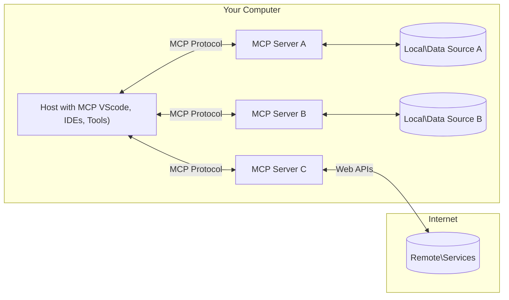

<!--
CO_OP_TRANSLATOR_METADATA:
{
  "original_hash": "b3b4a6ad10c3c0edbf7fa7cfa0ec496b",
  "translation_date": "2025-07-02T07:08:56+00:00",
  "source_file": "01-CoreConcepts/README.md",
  "language_code": "pa"
}
-->
# 📖 MCP ਕੋਰ ਸੰਕਲਪ: AI ਇੰਟਿਗ੍ਰੇਸ਼ਨ ਲਈ ਮਾਡਲ ਕੰਟੈਕਸਟ ਪ੍ਰੋਟੋਕੋਲ ਵਿੱਚ ਮਾਹਿਰ ਹੋਣਾ

[Model Context Protocol (MCP)](https://github.com/modelcontextprotocol) ਇੱਕ ਸ਼ਕਤੀਸ਼ਾਲੀ, ਮਿਆਰੀ ਫਰੇਮਵਰਕ ਹੈ ਜੋ ਵੱਡੇ ਭਾਸ਼ਾਈ ਮਾਡਲਾਂ (LLMs) ਅਤੇ ਬਾਹਰੀ ਟੂਲਾਂ, ਐਪਲੀਕੇਸ਼ਨਾਂ, ਅਤੇ ਡਾਟਾ ਸਰੋਤਾਂ ਵਿਚਕਾਰ ਸੰਚਾਰ ਨੂੰ ਬਿਹਤਰ ਬਣਾਉਂਦਾ ਹੈ। ਇਹ SEO-ਅਨੁਕੂਲ ਗਾਈਡ ਤੁਹਾਨੂੰ MCP ਦੇ ਮੁੱਖ ਸੰਕਲਪਾਂ ਵਿੱਚ ਲੈ ਕੇ ਚਲੇਗੀ, ਜਿਸ ਨਾਲ ਤੁਹਾਨੂੰ ਇਸ ਦੀ ਕਲਾਇੰਟ-ਸਰਵਰ ਆਰਕੀਟੈਕਚਰ, ਜਰੂਰੀ ਭਾਗ, ਸੰਚਾਰ ਮਕੈਨਿਕਸ ਅਤੇ ਲਾਗੂ ਕਰਨ ਦੀਆਂ ਸਭ ਤੋਂ ਵਧੀਆ ਪ੍ਰਥਾਵਾਂ ਦੀ ਸਮਝ ਹੋਵੇਗੀ।

## ਓਵਰਵਿਊ

ਇਸ ਪਾਠ ਵਿੱਚ Model Context Protocol (MCP) ਇਕੋਸਿਸਟਮ ਦੀ ਮੂਲ ਆਰਕੀਟੈਕਚਰ ਅਤੇ ਭਾਗਾਂ ਦੀ ਚਰਚਾ ਕੀਤੀ ਗਈ ਹੈ। ਤੁਸੀਂ ਕਲਾਇੰਟ-ਸਰਵਰ ਆਰਕੀਟੈਕਚਰ, ਮੁੱਖ ਭਾਗਾਂ ਅਤੇ ਸੰਚਾਰ ਮਕੈਨਿਕਸ ਬਾਰੇ ਜਾਣੋਗੇ ਜੋ MCP ਇੰਟਰੈਕਸ਼ਨਾਂ ਨੂੰ ਸੰਚਾਲਿਤ ਕਰਦੇ ਹਨ।

## 👩‍🎓 ਮੁੱਖ ਸਿੱਖਣ ਦੇ ਲਕੜ

ਇਸ ਪਾਠ ਦੇ ਅੰਤ ਤੱਕ, ਤੁਸੀਂ:

- MCP ਕਲਾਇੰਟ-ਸਰਵਰ ਆਰਕੀਟੈਕਚਰ ਨੂੰ ਸਮਝੋਗੇ।
- Hosts, Clients, ਅਤੇ Servers ਦੇ ਭੂਮਿਕਾਵਾਂ ਅਤੇ ਜ਼ਿੰਮੇਵਾਰੀਆਂ ਦੀ ਪਹਚਾਣ ਕਰੋਗੇ।
- MCP ਨੂੰ ਇੱਕ ਲਚਕੀਲਾ ਇੰਟਿਗ੍ਰੇਸ਼ਨ ਲੇਅਰ ਬਣਾਉਣ ਵਾਲੇ ਮੁੱਖ ਫੀਚਰਾਂ ਦਾ ਵਿਸ਼ਲੇਸ਼ਣ ਕਰੋਗੇ।
- MCP ਇਕੋਸਿਸਟਮ ਵਿੱਚ ਜਾਣਕਾਰੀ ਦੇ ਪ੍ਰਵਾਹ ਨੂੰ ਸਮਝੋਗੇ।
- .NET, Java, Python, ਅਤੇ JavaScript ਵਿੱਚ ਕੋਡ ਉਦਾਹਰਣਾਂ ਰਾਹੀਂ ਵਿਹਾਰਕ ਜਾਣਕਾਰੀ ਪ੍ਰਾਪਤ ਕਰੋਗੇ।

## 🔎 MCP ਆਰਕੀਟੈਕਚਰ: ਇੱਕ ਡੂੰਘੀ ਨਜ਼ਰ

MCP ਇਕੋਸਿਸਟਮ ਇੱਕ ਕਲਾਇੰਟ-ਸਰਵਰ ਮਾਡਲ 'ਤੇ ਬਣਿਆ ਹੈ। ਇਹ ਮੋਡੀਊਲਰ ਸੰਰਚਨਾ AI ਐਪਲੀਕੇਸ਼ਨਾਂ ਨੂੰ ਟੂਲਾਂ, ਡਾਟਾਬੇਸ, APIs, ਅਤੇ ਸੰਦੇਸ਼ਕ ਸਰੋਤਾਂ ਨਾਲ ਪ੍ਰਭਾਵਸ਼ਾਲੀ ਤਰੀਕੇ ਨਾਲ ਇੰਟਰੈਕਟ ਕਰਨ ਦੀ ਆਗਿਆ ਦਿੰਦੀ ਹੈ। ਆਓ ਇਸ ਆਰਕੀਟੈਕਚਰ ਨੂੰ ਇਸਦੇ ਮੁੱਖ ਭਾਗਾਂ ਵਿੱਚ ਵੰਡਦੇ ਹਾਂ।

ਆਧਾਰ ਵਿੱਚ, MCP ਇੱਕ ਕਲਾਇੰਟ-ਸਰਵਰ ਆਰਕੀਟੈਕਚਰ ਦੀ ਪਾਲਣਾ ਕਰਦਾ ਹੈ ਜਿੱਥੇ ਇੱਕ host ਐਪਲੀਕੇਸ਼ਨ ਕਈ ਸਰਵਰਾਂ ਨਾਲ ਜੁੜ ਸਕਦਾ ਹੈ:



- **MCP Hosts**: ਉਹ ਪ੍ਰੋਗਰਾਮ ਜਿਵੇਂ VSCode, Claude Desktop, IDEs ਜਾਂ AI ਟੂਲ ਜੋ MCP ਰਾਹੀਂ ਡਾਟਾ ਤੱਕ ਪਹੁੰਚਣਾ ਚਾਹੁੰਦੇ ਹਨ
- **MCP Clients**: ਪ੍ਰੋਟੋਕੋਲ ਕਲਾਇੰਟ ਜੋ ਸਰਵਰਾਂ ਨਾਲ 1:1 ਸੰਪਰਕ ਬਣਾਉਂਦੇ ਹਨ
- **MCP Servers**: ਹਲਕੇ ਫੁਲਕੇ ਪ੍ਰੋਗਰਾਮ ਜੋ ਹਰ ਇੱਕ ਮਿਆਰੀ Model Context Protocol ਰਾਹੀਂ ਵਿਸ਼ੇਸ਼ ਸਮਰੱਥਾਵਾਂ ਪ੍ਰਦਾਨ ਕਰਦੇ ਹਨ
- **ਲੋਕਲ ਡਾਟਾ ਸਰੋਤ**: ਤੁਹਾਡੇ ਕੰਪਿਊਟਰ ਦੀਆਂ ਫਾਈਲਾਂ, ਡਾਟਾਬੇਸ ਅਤੇ ਸੇਵਾਵਾਂ ਜਿਨ੍ਹਾਂ ਤੱਕ MCP ਸਰਵਰ ਸੁਰੱਖਿਅਤ ਤਰੀਕੇ ਨਾਲ ਪਹੁੰਚ ਸਕਦੇ ਹਨ
- **ਦੂਰ-ਦਰਾਜ਼ ਸੇਵਾਵਾਂ**: ਇੰਟਰਨੈੱਟ ਉੱਤੇ ਉਪਲਬਧ ਬਾਹਰੀ ਪ੍ਰਣਾਲੀਆਂ ਜਿਨ੍ਹਾਂ ਨਾਲ MCP ਸਰਵਰ APIs ਰਾਹੀਂ ਜੁੜ ਸਕਦੇ ਹਨ।

MCP ਪ੍ਰੋਟੋਕੋਲ ਇੱਕ ਵਿਕਸਤ ਹੋ ਰਹੀ ਮਿਆਰ ਹੈ; ਤੁਸੀਂ [protocol specification](https://modelcontextprotocol.io/specification/2025-06-18/) ਵਿੱਚ ਤਾਜ਼ਾ ਅੱਪਡੇਟ ਵੇਖ ਸਕਦੇ ਹੋ।

### 1. Hosts

Model Context Protocol (MCP) ਵਿੱਚ, Hosts ਮੁੱਖ ਇੰਟਰਫੇਸ ਵਜੋਂ ਕੰਮ ਕਰਦੇ ਹਨ ਜਿੱਥੇ ਉਪਭੋਗਤਾ ਪ੍ਰੋਟੋਕੋਲ ਨਾਲ ਸੰਪਰਕ ਕਰਦੇ ਹਨ। Hosts ਉਹ ਐਪਲੀਕੇਸ਼ਨ ਜਾਂ ਵਾਤਾਵਰਨ ਹਨ ਜੋ MCP ਸਰਵਰਾਂ ਨਾਲ ਜੁੜ ਕੇ ਡਾਟਾ, ਟੂਲ ਅਤੇ ਪ੍ਰੌਂਪਟ ਤੱਕ ਪਹੁੰਚ ਪ੍ਰਾਪਤ ਕਰਦੇ ਹਨ। Hosts ਦੇ ਉਦਾਹਰਣਾਂ ਵਿੱਚ Visual Studio Code ਵਰਗੇ IDEs, Claude Desktop ਵਰਗੇ AI ਟੂਲ, ਜਾਂ ਖਾਸ ਟਾਸਕਾਂ ਲਈ ਬਣਾਏ ਗਏ ਕਸਟਮ ਏਜੰਟ ਸ਼ਾਮਲ ਹਨ।

**Hosts** LLM ਐਪਲੀਕੇਸ਼ਨਾਂ ਹਨ ਜੋ ਸੰਪਰਕ ਸ਼ੁਰੂ ਕਰਦੇ ਹਨ। ਇਹ:

- AI ਮਾਡਲਾਂ ਨਾਲ ਇੰਟਰੈਕਟ ਕਰਕੇ ਜਵਾਬ ਤਿਆਰ ਕਰਦੇ ਹਨ।
- MCP ਸਰਵਰਾਂ ਨਾਲ ਸੰਪਰਕ ਸ਼ੁਰੂ ਕਰਦੇ ਹਨ।
- ਗੱਲਬਾਤ ਦੇ ਪ੍ਰਵਾਹ ਅਤੇ ਯੂਜ਼ਰ ਇੰਟਰਫੇਸ ਨੂੰ ਸੰਭਾਲਦੇ ਹਨ।
- ਪਰਮਿਸ਼ਨ ਅਤੇ ਸੁਰੱਖਿਆ ਸੀਮਾਵਾਂ ਨੂੰ ਕੰਟਰੋਲ ਕਰਦੇ ਹਨ।
- ਡਾਟਾ ਸਾਂਝਾ ਕਰਨ ਅਤੇ ਟੂਲ ਚਲਾਉਣ ਲਈ ਯੂਜ਼ਰ ਦੀ ਸਹਿਮਤੀ ਸੰਭਾਲਦੇ ਹਨ।

### 2. Clients

Clients ਉਹ ਜਰੂਰੀ ਭਾਗ ਹਨ ਜੋ Hosts ਅਤੇ MCP ਸਰਵਰਾਂ ਵਿਚਕਾਰ ਇੰਟਰੈਕਸ਼ਨ ਨੂੰ ਆਸਾਨ ਬਣਾਉਂਦੇ ਹਨ। Clients ਮੱਧਸਥ ਵਜੋਂ ਕੰਮ ਕਰਦੇ ਹਨ, Hosts ਨੂੰ MCP ਸਰਵਰਾਂ ਦੀਆਂ ਸਮਰੱਥਾਵਾਂ ਤੱਕ ਪਹੁੰਚ ਅਤੇ ਉਪਯੋਗ ਕਰਨ ਦੇ ਯੋਗ ਬਣਾਉਂਦੇ ਹਨ। ਇਹ MCP ਆਰਕੀਟੈਕਚਰ ਵਿੱਚ ਸਹੀ ਅਤੇ ਪ੍ਰਭਾਵਸ਼ਾਲੀ ਡਾਟਾ ਬਦਲਾਅ ਨੂੰ ਯਕੀਨੀ ਬਣਾਉਂਦੇ ਹਨ।

**Clients** host ਐਪਲੀਕੇਸ਼ਨ ਵਿੱਚ ਕੁਨੈਕਟਰ ਹਨ। ਇਹ:

- ਸਰਵਰਾਂ ਨੂੰ ਪ੍ਰੌਂਪਟ/ਹਦਾਇਤਾਂ ਨਾਲ ਬੇਨਤੀ ਭੇਜਦੇ ਹਨ।
- ਸਰਵਰਾਂ ਨਾਲ ਸਮਰੱਥਾਵਾਂ ਬਾਰੇ ਸਾਂਝਾ ਕਰਦੇ ਹਨ।
- ਮਾਡਲਾਂ ਤੋਂ ਟੂਲ ਚਲਾਉਣ ਦੀਆਂ ਬੇਨਤੀਆਂ ਨੂੰ ਸੰਭਾਲਦੇ ਹਨ।
- ਯੂਜ਼ਰਾਂ ਨੂੰ ਜਵਾਬ ਪ੍ਰਦਰਸ਼ਿਤ ਕਰਦੇ ਹਨ।

### 3. Servers

Servers MCP clients ਦੀਆਂ ਬੇਨਤੀਆਂ ਨੂੰ ਸੰਭਾਲਦੇ ਹਨ ਅਤੇ ਉਚਿਤ ਜਵਾਬ ਦਿੰਦੇ ਹਨ। ਇਹ ਡਾਟਾ ਪ੍ਰਾਪਤੀ, ਟੂਲ ਚਲਾਉਣਾ, ਅਤੇ ਪ੍ਰੌਂਪਟ ਬਣਾਉਣ ਵਰਗੀਆਂ ਕਈ ਕਾਰਵਾਈਆਂ ਨੂੰ ਸੰਚਾਲਿਤ ਕਰਦੇ ਹਨ। Servers ਯਕੀਨੀ ਬਣਾਉਂਦੇ ਹਨ ਕਿ clients ਅਤੇ Hosts ਵਿਚਕਾਰ ਸੰਚਾਰ ਪ੍ਰਭਾਵਸ਼ਾਲੀ ਅਤੇ ਭਰੋਸੇਯੋਗ ਹੋਵੇ, ਅਤੇ ਇੰਟਰੈਕਸ਼ਨ ਦੀ ਸਾਫ਼ਗਾਈ ਬਣਾਈ ਰੱਖਦੇ ਹਨ।

**Servers** ਉਹ ਸੇਵਾਵਾਂ ਹਨ ਜੋ ਸੰਦੇਸ਼ ਅਤੇ ਸਮਰੱਥਾਵਾਂ ਪ੍ਰਦਾਨ ਕਰਦੀਆਂ ਹਨ। ਇਹ:

- ਉਪਲਬਧ ਫੀਚਰਾਂ (ਸਰੋਤ, ਪ੍ਰੌਂਪਟ, ਟੂਲ) ਦਾ ਰਜਿਸਟਰ ਕਰਦੇ ਹਨ
- ਕਲਾਇੰਟ ਤੋਂ ਟੂਲ ਕਾਲਾਂ ਪ੍ਰਾਪਤ ਅਤੇ ਚਲਾਉਂਦੇ ਹਨ
- ਮਾਡਲ ਜਵਾਬਾਂ ਨੂੰ ਬਿਹਤਰ ਬਣਾਉਣ ਲਈ ਸੰਦੇਸ਼ਕ ਜਾਣਕਾਰੀ ਦਿੰਦੇ ਹਨ
- ਨਤੀਜੇ ਕਲਾਇੰਟ ਨੂੰ ਵਾਪਸ ਭੇਜਦੇ ਹਨ
- ਜ਼ਰੂਰਤ ਪੈਣ 'ਤੇ ਇੰਟਰੈਕਸ਼ਨਾਂ ਦੇ ਦੌਰਾਨ ਸਥਿਤੀ ਬਣਾਈ ਰੱਖਦੇ ਹਨ

ਕੋਈ ਵੀ ਵਿਅਕਤੀ ਮਾਡਲ ਸਮਰੱਥਾਵਾਂ ਨੂੰ ਵਿਸ਼ੇਸ਼ ਫੰਕਸ਼ਨਾਲਿਟੀ ਨਾਲ ਵਧਾਉਣ ਲਈ ਸਰਵਰ ਵਿਕਸਿਤ ਕਰ ਸਕਦਾ ਹੈ।

### 4. Server Features

Model Context Protocol (MCP) ਵਿੱਚ ਸਰਵਰ ਮੁੱਖ ਇਮਾਰਤੀ ਢਾਂਚੇ ਪ੍ਰਦਾਨ ਕਰਦੇ ਹਨ ਜੋ clients, hosts, ਅਤੇ ਭਾਸ਼ਾਈ ਮਾਡਲਾਂ ਵਿਚਕਾਰ ਧਨਾਤਮਕ ਇੰਟਰੈਕਸ਼ਨਾਂ ਨੂੰ ਯੋਗ ਬਣਾਉਂਦੇ ਹਨ। ਇਹ ਫੀਚਰ MCP ਦੀ ਸਮਰੱਥਾ ਨੂੰ ਵਧਾਉਂਦੇ ਹਨ ਜਿਵੇਂ ਕਿ ਸੰਰਚਿਤ ਸੰਦੇਸ਼, ਟੂਲ, ਅਤੇ ਪ੍ਰੌਂਪਟ ਪ੍ਰਦਾਨ ਕਰਕੇ।

MCP ਸਰਵਰ ਹੇਠਾਂ ਦਿੱਤੇ ਕਿਸੇ ਵੀ ਫੀਚਰ ਦੀ ਪੇਸ਼ਕਸ਼ ਕਰ ਸਕਦੇ ਹਨ:

#### 📑 Resources 

Model Context Protocol (MCP) ਵਿੱਚ Resources ਵੱਖ-ਵੱਖ ਕਿਸਮਾਂ ਦੇ ਸੰਦੇਸ਼ ਅਤੇ ਡਾਟਾ ਸ਼ਾਮਲ ਹੁੰਦੇ ਹਨ ਜੋ ਉਪਭੋਗਤਾ ਜਾਂ AI ਮਾਡਲ ਵਰਤ ਸਕਦੇ ਹਨ। ਇਹ ਵਿੱਚ ਸ਼ਾਮਲ ਹਨ:

- **ਸੰਦੇਸ਼ਕ ਡਾਟਾ**: ਜਾਣਕਾਰੀ ਅਤੇ ਸੰਦਰਭ ਜੋ ਉਪਭੋਗਤਾ ਜਾਂ AI ਮਾਡਲ ਫੈਸਲੇ ਕਰਨ ਅਤੇ ਕੰਮ ਕਰਨ ਲਈ ਵਰਤ ਸਕਦੇ ਹਨ।
- **ਨੋਲੇਜ ਬੇਸ ਅਤੇ ਦਸਤਾਵੇਜ਼ ਸੰਗ੍ਰਹਿ**: ਸੰਰਚਿਤ ਅਤੇ ਅਸੰਰਚਿਤ ਡਾਟਾ ਦੇ ਸੰਗ੍ਰਹਿ, ਜਿਵੇਂ ਲੇਖ, ਮੈਨੂਅਲ ਅਤੇ ਖੋਜ ਪੇਪਰ, ਜੋ ਕੀਮਤੀ ਜਾਣਕਾਰੀ ਦਿੰਦੇ ਹਨ।
- **ਲੋਕਲ ਫਾਈਲਾਂ ਅਤੇ ਡਾਟਾਬੇਸ**: ਡਾਟਾ ਜੋ ਸਥਾਨਕ ਤੌਰ 'ਤੇ ਜੰਤਰਾਂ ਜਾਂ ਡਾਟਾਬੇਸਾਂ ਵਿੱਚ ਸਟੋਰ ਹੈ, ਜੋ ਪ੍ਰਕਿਰਿਆ ਅਤੇ ਵਿਸ਼ਲੇਸ਼ਣ ਲਈ ਉਪਲਬਧ ਹੈ।
- **APIs ਅਤੇ ਵੈੱਬ ਸੇਵਾਵਾਂ**: ਬਾਹਰੀ ਇੰਟਰਫੇਸ ਅਤੇ ਸੇਵਾਵਾਂ ਜੋ ਵਾਧੂ ਡਾਟਾ ਅਤੇ ਫੰਕਸ਼ਨਾਲਿਟੀ ਪ੍ਰਦਾਨ ਕਰਦੀਆਂ ਹਨ, ਵੱਖ-ਵੱਖ ਆਨਲਾਈਨ ਸਰੋਤਾਂ ਅਤੇ ਟੂਲਾਂ ਨਾਲ ਇੰਟਿਗ੍ਰੇਸ਼ਨ ਯੋਗ ਬਣਾਉਂਦੀਆਂ ਹਨ।

ਇੱਕ resource ਉਦਾਹਰਣ ਵਜੋਂ ਡਾਟਾਬੇਸ ਸਕੀਮਾ ਜਾਂ ਫਾਈਲ ਹੋ ਸਕਦੀ ਹੈ ਜਿਸ ਤਰ੍ਹਾਂ ਪਹੁੰਚ ਕੀਤੀ ਜਾ ਸਕਦੀ ਹੈ:

```text
file://log.txt
database://schema
```

### 🤖 Prompts

Model Context Protocol (MCP) ਵਿੱਚ ਪ੍ਰੌਂਪਟ ਵੱਖ-ਵੱਖ ਪਹਿਲਾਂ ਤੋਂ ਬਣੇ ਟੈਮਪਲੇਟ ਅਤੇ ਇੰਟਰੈਕਸ਼ਨ ਪੈਟਰਨ ਸ਼ਾਮਲ ਹੁੰਦੇ ਹਨ ਜੋ ਯੂਜ਼ਰ ਵਰਕਫਲੋਜ਼ ਨੂੰ ਸੁਗਮ ਬਣਾਉਂਦੇ ਹਨ ਅਤੇ ਸੰਚਾਰ ਨੂੰ ਬਿਹਤਰ ਕਰਦੇ ਹਨ। ਇਹ ਵਿੱਚ ਸ਼ਾਮਲ ਹਨ:

- **ਟੈਮਪਲੇਟ ਕੀਤੇ ਸੁਨੇਹੇ ਅਤੇ ਵਰਕਫਲੋਜ਼**: ਪਹਿਲਾਂ ਤੋਂ ਬਣੇ ਸੁਨੇਹੇ ਅਤੇ ਪ੍ਰਕਿਰਿਆਵਾਂ ਜੋ ਯੂਜ਼ਰਾਂ ਨੂੰ ਖਾਸ ਕੰਮਾਂ ਅਤੇ ਇੰਟਰੈਕਸ਼ਨਾਂ ਵਿੱਚ ਮਦਦ ਕਰਦੀਆਂ ਹਨ।
- **ਪਹਿਲਾਂ ਤੋਂ ਨਿਰਧਾਰਤ ਇੰਟਰੈਕਸ਼ਨ ਪੈਟਰਨ**: ਮਿਆਰੀ ਕ੍ਰਮਬੱਧ ਕਾਰਵਾਈਆਂ ਅਤੇ ਜਵਾਬ ਜੋ ਸਥਿਰ ਅਤੇ ਪ੍ਰਭਾਵਸ਼ਾਲੀ ਸੰਚਾਰ ਲਈ ਸਹਾਇਕ ਹਨ।
- **ਵਿਸ਼ੇਸ਼ ਗੱਲਬਾਤ ਟੈਮਪਲੇਟ**: ਖਾਸ ਕਿਸਮ ਦੀਆਂ ਗੱਲਬਾਤਾਂ ਲਈ ਕਸਟਮਾਈਜ਼ ਕੀਤੇ ਟੈਮਪਲੇਟ, ਜੋ ਸੰਬੰਧਿਤ ਅਤੇ ਸੰਦਰਭਕ ਅਨੁਕੂਲ ਇੰਟਰੈਕਸ਼ਨਾਂ ਨੂੰ ਯਕੀਨੀ ਬਣਾਉਂਦੇ ਹਨ।

ਇੱਕ ਪ੍ਰੌਂਪਟ ਟੈਮਪਲੇਟ ਇਸ ਤਰ੍ਹਾਂ ਹੋ ਸਕਦਾ ਹੈ:

```markdown
Generate a product slogan based on the following {{product}} with the following {{keywords}}
```

#### ⛏️ Tools

Model Context Protocol (MCP) ਵਿੱਚ ਟੂਲ ਉਹ ਫੰਕਸ਼ਨ ਹਨ ਜੋ AI ਮਾਡਲ ਵਿਸ਼ੇਸ਼ ਕੰਮ ਕਰਨ ਲਈ ਚਲਾ ਸਕਦਾ ਹੈ। ਇਹ ਟੂਲ AI ਮਾਡਲ ਦੀ ਸਮਰੱਥਾ ਨੂੰ ਵਧਾਉਂਦੇ ਹਨ ਅਤੇ ਵਿਵਸਥਿਤ ਅਤੇ ਭਰੋਸੇਯੋਗ ਓਪਰੇਸ਼ਨਾਂ ਪ੍ਰਦਾਨ ਕਰਦੇ ਹਨ। ਮੁੱਖ ਗੁਣ ਹਨ:

- **AI ਮਾਡਲ ਵੱਲੋਂ ਚਲਾਏ ਜਾਣ ਵਾਲੇ ਫੰਕਸ਼ਨ**: ਟੂਲ ਚਲਾਏ ਜਾਣ ਵਾਲੇ ਫੰਕਸ਼ਨ ਹਨ ਜੋ AI ਮਾਡਲ ਵੱਲੋਂ ਵੱਖ-ਵੱਖ ਕਾਰਜ ਕਰਨ ਲਈ ਬੁਲਾਏ ਜਾਂਦੇ ਹਨ।
- **ਵੱਖਰਾ ਨਾਮ ਅਤੇ ਵੇਰਵਾ**: ਹਰ ਟੂਲ ਦਾ ਇੱਕ ਵਿਲੱਖਣ ਨਾਮ ਅਤੇ ਇਸਦਾ ਮਕਸਦ ਅਤੇ ਕਾਰਜ ਸ਼ਾਮਲ ਕਰਨ ਵਾਲਾ ਵੇਰਵਾ ਹੁੰਦਾ ਹੈ।
- **ਪੈਰਾਮੀਟਰ ਅਤੇ ਨਤੀਜੇ**: ਟੂਲ ਖਾਸ ਪੈਰਾਮੀਟਰ ਲੈਂਦੇ ਹਨ ਅਤੇ ਸੰਰਚਿਤ ਨਤੀਜੇ ਵਾਪਸ ਕਰਦੇ ਹਨ, ਜੋ ਨਤੀਜਿਆਂ ਨੂੰ ਸਥਿਰ ਅਤੇ ਅੰਦਾਜ਼ਾ ਲਗਾਉਣ ਯੋਗ ਬਣਾਉਂਦੇ ਹਨ।
- **ਵੱਖ-ਵੱਖ ਫੰਕਸ਼ਨ**: ਟੂਲ ਵੱਖ-ਵੱਖ ਕੰਮ ਕਰਦੇ ਹਨ ਜਿਵੇਂ ਵੈੱਬ ਖੋਜ, ਗਣਨਾ, ਅਤੇ ਡਾਟਾਬੇਸ ਕਵੈਰੀਜ਼।

ਇੱਕ ਟੂਲ ਦਾ ਉਦਾਹਰਣ ਇਸ ਤਰ੍ਹਾਂ ਹੋ ਸਕਦਾ ਹੈ:

```typescript
server.tool(
  "GetProducts",
  {
    pageSize: z.string().optional(),
    pageCount: z.string().optional()
  }, () => {
    // return results from API
  }
)
```

## Client Features

Model Context Protocol (MCP) ਵਿੱਚ, clients ਸਰਵਰਾਂ ਨੂੰ ਕਈ ਮੁੱਖ ਫੀਚਰ ਪ੍ਰਦਾਨ ਕਰਦੇ ਹਨ, ਜੋ ਪ੍ਰੋਟੋਕੋਲ ਦੇ ਕੁੱਲ ਫੰਕਸ਼ਨਾਲਿਟੀ ਅਤੇ ਇੰਟਰੈਕਸ਼ਨ ਨੂੰ ਵਧਾਉਂਦੇ ਹਨ। ਇੱਕ ਮਹੱਤਵਪੂਰਨ ਫੀਚਰ Sampling ਹੈ।

### 👉 Sampling

- **ਸਰਵਰ ਵੱਲੋਂ ਸ਼ੁਰੂ ਕੀਤੇ ਗਏ ਏਜੈਂਟਿਕ ਵਿਹਾਰ**: Clients ਸਰਵਰਾਂ ਨੂੰ ਖੁਦਮੁਖਤਿਆਰ ਤਰੀਕੇ ਨਾਲ ਖਾਸ ਕਾਰਵਾਈਆਂ ਜਾਂ ਵਿਹਾਰ ਸ਼ੁਰੂ ਕਰਨ ਦੇ ਯੋਗ ਬਣਾਉਂਦੇ ਹਨ, ਜੋ ਸਿਸਟਮ ਦੀ ਗਤੀਸ਼ੀਲ ਸਮਰੱਥਾ ਨੂੰ ਵਧਾਉਂਦਾ ਹੈ।
- **ਪੁਨਰਾਵਰਤੀ LLM ਇੰਟਰੈਕਸ਼ਨ**: ਇਹ ਫੀਚਰ ਵੱਡੇ ਭਾਸ਼ਾਈ ਮਾਡਲਾਂ (LLMs) ਨਾਲ ਦੁਹਰਾਏ ਜਾਣ ਵਾਲੇ ਇੰਟਰੈਕਸ਼ਨਾਂ ਦੀ ਆਗਿਆ ਦਿੰਦਾ ਹੈ, ਜੋ ਕੰਮਾਂ ਦੀ ਜਟਿਲ ਅਤੇ ਦੁਹਰਾਈਯੋਗ ਪ੍ਰਕਿਰਿਆ ਨੂੰ ਯੋਗ ਬਣਾਉਂਦਾ ਹੈ।
- **ਵਾਧੂ ਮਾਡਲ ਪੂਰਨਤਾਵਾਂ ਦੀ ਬੇਨਤੀ**: ਸਰਵਰ ਮਾਡਲ ਤੋਂ ਵਾਧੂ ਪੂਰਨਤਾਵਾਂ ਮੰਗ ਸਕਦੇ ਹਨ, ਯਕੀਨੀ ਬਣਾਉਂਦੇ ਹੋਏ ਕਿ ਜਵਾਬ ਪੂਰੇ ਅਤੇ ਸੰਦਰਭਕ ਹਨ।

## MCP ਵਿੱਚ ਜਾਣਕਾਰੀ ਦਾ ਪ੍ਰਵਾਹ

Model Context Protocol (MCP) ਹੋਸਟਾਂ, ਕਲਾਇੰਟਾਂ, ਸਰਵਰਾਂ ਅਤੇ ਮਾਡਲਾਂ ਵਿਚਕਾਰ ਜਾਣਕਾਰੀ ਦੇ ਸੰਰਚਿਤ ਪ੍ਰਵਾਹ ਨੂੰ ਪਰਿਭਾਸ਼ਿਤ ਕਰਦਾ ਹੈ। ਇਸ ਪ੍ਰਵਾਹ ਨੂੰ ਸਮਝਣਾ ਮਦਦ ਕਰਦਾ ਹੈ ਕਿ ਯੂਜ਼ਰ ਦੀਆਂ ਬੇਨਤੀਆਂ ਕਿਵੇਂ ਪ੍ਰਕਿਰਿਆਤ ਕੀਤੀਆਂ ਜਾਂਦੀਆਂ ਹਨ ਅਤੇ ਬਾਹਰੀ ਟੂਲ ਅਤੇ ਡਾਟਾ ਮਾਡਲ ਜਵਾਬਾਂ ਵਿੱਚ ਕਿਵੇਂ ਸ਼ਾਮਲ ਹੁੰਦੇ ਹਨ।

- **ਹੋਸਟ ਸੰਪਰਕ ਸ਼ੁਰੂ ਕਰਦਾ ਹੈ**  
  ਹੋਸਟ ਐਪਲੀਕੇਸ਼ਨ (ਜਿਵੇਂ IDE ਜਾਂ ਚੈਟ ਇੰਟਰਫੇਸ) ਆਮ ਤੌਰ 'ਤੇ STDIO, WebSocket ਜਾਂ ਹੋਰ ਸਮਰਥਿਤ ਟਰਾਂਸਪੋਰਟ ਰਾਹੀਂ MCP ਸਰਵਰ ਨਾਲ ਜੁੜਦਾ ਹੈ।

- **ਸਮਰੱਥਾ ਬਾਰੇ ਗੱਲਬਾਤ**  
  ਕਲਾਇੰਟ (ਜੋ ਹੋਸਟ ਵਿੱਚ ਏम्बੈੱਡ ਹੈ) ਅਤੇ ਸਰਵਰ ਆਪਣੇ ਸਮਰਥਿਤ ਫੀਚਰਾਂ, ਟੂਲਾਂ, ਸਰੋਤਾਂ ਅਤੇ ਪ੍ਰੋਟੋਕੋਲ ਵਰਜਨਾਂ ਬਾਰੇ ਜਾਣਕਾਰੀ ਦਾ ਅਦਲਾ-ਬਦਲੀ ਕਰਦੇ ਹਨ। ਇਹ ਯਕੀਨੀ ਬਣਾਉਂਦਾ ਹੈ ਕਿ ਦੋਹਾਂ ਪਾਸੇ ਸੈਸ਼ਨ ਲਈ ਉਪਲਬਧ ਸਮਰੱਥਾਵਾਂ ਨੂੰ ਸਮਝਦੇ ਹਨ।

- **ਯੂਜ਼ਰ ਬੇਨਤੀ**  
  ਯੂਜ਼ਰ ਹੋਸਟ ਨਾਲ ਇੰਟਰੈਕਟ ਕਰਦਾ ਹੈ (ਉਦਾਹਰਣ ਲਈ, ਪ੍ਰੌਂਪਟ ਜਾਂ ਕਮਾਂਡ ਦਾਖਲ ਕਰਦਾ ਹੈ)। ਹੋਸਟ ਇਹ ਇਨਪੁਟ ਇਕੱਤਰ ਕਰਦਾ ਹੈ ਅਤੇ ਪ੍ਰਕਿਰਿਆ ਲਈ ਕਲਾਇੰਟ ਨੂੰ ਭੇਜਦਾ ਹੈ।

- **ਸਰੋਤ ਜਾਂ ਟੂਲ ਵਰਤੋਂ**  
  - ਕਲਾਇੰਟ ਵਾਧੂ ਸੰਦਰਭ ਜਾਂ ਸਰੋਤਾਂ ਲਈ ਸਰਵਰ ਤੋਂ ਬੇਨਤੀ ਕਰ ਸਕਦਾ ਹੈ (ਜਿਵੇਂ ਫਾਈਲਾਂ, ਡਾਟਾਬੇਸ ਐਂਟਰੀਜ਼ ਜਾਂ ਨੋਲੇਜ ਬੇਸ ਲੇਖ) ਤਾਂ ਜੋ ਮਾਡਲ ਦੀ ਸਮਝ ਨੂੰ ਮਜ਼ਬੂਤ ਕੀਤਾ ਜਾ ਸਕੇ।
  - ਜੇ ਮਾਡਲ ਨਿਰਧਾਰਤ ਕਰਦਾ ਹੈ ਕਿ ਟੂਲ ਦੀ ਲੋੜ ਹੈ (ਜਿਵੇਂ ਡਾਟਾ ਲੈਣਾ, ਗਣਨਾ ਕਰਨੀ, ਜਾਂ API ਕਾਲ ਕਰਨੀ), ਤਾਂ ਕਲਾਇੰਟ ਸਰਵ

**ਅਸਵੀਕਾਰੋਧ**:  
ਇਹ ਦਸਤਾਵੇਜ਼ AI ਅਨੁਵਾਦ ਸੇਵਾ [Co-op Translator](https://github.com/Azure/co-op-translator) ਦੀ ਵਰਤੋਂ ਕਰਕੇ ਅਨੁਵਾਦ ਕੀਤਾ ਗਿਆ ਹੈ। ਜਦੋਂ ਕਿ ਅਸੀਂ ਸਹੀਤਾ ਲਈ ਯਤਨ ਕਰਦੇ ਹਾਂ, ਕਿਰਪਾ ਕਰਕੇ ਧਿਆਨ ਰੱਖੋ ਕਿ ਸਵੈਚਾਲਿਤ ਅਨੁਵਾਦਾਂ ਵਿੱਚ ਗਲਤੀਆਂ ਜਾਂ ਅਸਮਰਥਤਾਵਾਂ ਹੋ ਸਕਦੀਆਂ ਹਨ। ਮੂਲ ਦਸਤਾਵੇਜ਼ ਆਪਣੀ ਮੂਲ ਭਾਸ਼ਾ ਵਿੱਚ ਹੀ ਅਧਿਕਾਰਤ ਸਰੋਤ ਮੰਨਿਆ ਜਾਣਾ ਚਾਹੀਦਾ ਹੈ। ਜਰੂਰੀ ਜਾਣਕਾਰੀ ਲਈ, ਪੇਸ਼ੇਵਰ ਮਨੁੱਖੀ ਅਨੁਵਾਦ ਦੀ ਸਿਫਾਰਸ਼ ਕੀਤੀ ਜਾਂਦੀ ਹੈ। ਅਸੀਂ ਇਸ ਅਨੁਵਾਦ ਦੀ ਵਰਤੋਂ ਨਾਲ ਹੋਣ ਵਾਲੀਆਂ ਕਿਸੇ ਵੀ ਗਲਤਫਹਿਮੀਆਂ ਜਾਂ ਗਲਤ ਵਿਆਖਿਆਵਾਂ ਲਈ ਜ਼ਿੰਮੇਵਾਰ ਨਹੀਂ ਹਾਂ।