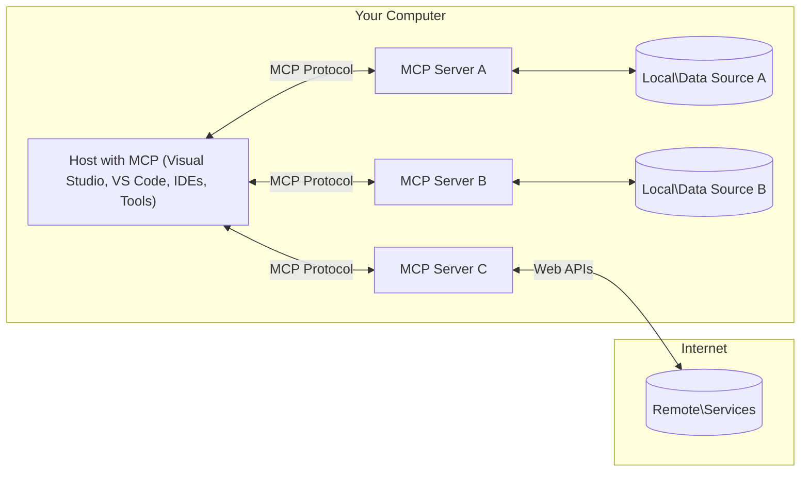

<!--
CO_OP_TRANSLATOR_METADATA:
{
  "original_hash": "904b59de1de9264801242d90a42cdd9d",
  "translation_date": "2025-09-05T10:49:48+00:00",
  "source_file": "01-CoreConcepts/README.md",
  "language_code": "pa"
}
-->
# MCP ਮੁੱਖ ਧਾਰਨਾਵਾਂ: AI ਇੰਟੀਗ੍ਰੇਸ਼ਨ ਲਈ ਮਾਡਲ ਕਾਂਟੈਕਸਟ ਪ੍ਰੋਟੋਕੋਲ ਨੂੰ ਸਮਝਣਾ

[](https://youtu.be/earDzWGtE84)

_(ਉਪਰ ਦਿੱਤੀ ਤਸਵੀਰ 'ਤੇ ਕਲਿਕ ਕਰਕੇ ਇਸ ਪਾਠ ਦਾ ਵੀਡੀਓ ਵੇਖੋ)_

[Model Context Protocol (MCP)](https://github.com/modelcontextprotocol) ਇੱਕ ਸ਼ਕਤੀਸ਼ਾਲੀ ਅਤੇ ਮਿਆਰੀ ਫਰੇਮਵਰਕ ਹੈ ਜੋ ਵੱਡੇ ਭਾਸ਼ਾ ਮਾਡਲ (LLMs) ਅਤੇ ਬਾਹਰੀ ਟੂਲ, ਐਪਲੀਕੇਸ਼ਨ, ਅਤੇ ਡਾਟਾ ਸਰੋਤਾਂ ਦੇ ਵਿਚਕਾਰ ਸੰਚਾਰ ਨੂੰ ਸੁਧਾਰਦਾ ਹੈ।  
ਇਹ ਗਾਈਡ ਤੁਹਾਨੂੰ MCP ਦੀਆਂ ਮੁੱਖ ਧਾਰਨਾਵਾਂ ਦੇ ਰਾਹੀਂ ਲੰਘੇਗੀ। ਤੁਸੀਂ ਇਸ ਦੇ ਕਲਾਇੰਟ-ਸਰਵਰ ਆਰਕੀਟੈਕਚਰ, ਜ਼ਰੂਰੀ ਹਿੱਸੇ, ਸੰਚਾਰ ਮਕੈਨਿਕਸ, ਅਤੇ ਲਾਗੂ ਕਰਨ ਦੇ ਸ੍ਰੇਸ਼ਠ ਤਰੀਕਿਆਂ ਬਾਰੇ ਸਿੱਖੋਗੇ।

- **ਸਪਸ਼ਟ ਉਪਭੋਗਤਾ ਸਹਿਮਤੀ**: ਸਾਰੇ ਡਾਟਾ ਐਕਸੈਸ ਅਤੇ ਕਾਰਵਾਈਆਂ ਨੂੰ ਅਮਲ ਕਰਨ ਤੋਂ ਪਹਿਲਾਂ ਸਪਸ਼ਟ ਉਪਭੋਗਤਾ ਮਨਜ਼ੂਰੀ ਦੀ ਲੋੜ ਹੁੰਦੀ ਹੈ। ਉਪਭੋਗਤਾਵਾਂ ਨੂੰ ਸਪਸ਼ਟ ਤੌਰ 'ਤੇ ਸਮਝਣਾ ਚਾਹੀਦਾ ਹੈ ਕਿ ਕਿਹੜਾ ਡਾਟਾ ਐਕਸੈਸ ਕੀਤਾ ਜਾਵੇਗਾ ਅਤੇ ਕਿਹੜੀਆਂ ਕਾਰਵਾਈਆਂ ਕੀਤੀਆਂ ਜਾਣਗੀਆਂ ਹਨ, ਜਿਸ ਨਾਲ ਅਧਿਕਾਰਾਂ ਅਤੇ ਮਨਜ਼ੂਰੀਆਂ 'ਤੇ ਵਿਸਤ੍ਰਿਤ ਨਿਯੰਤਰਣ ਹੁੰਦਾ ਹੈ।

- **ਡਾਟਾ ਗੋਪਨੀਯਤਾ ਸੁਰੱਖਿਆ**: ਉਪਭੋਗਤਾ ਡਾਟਾ ਸਿਰਫ ਸਪਸ਼ਟ ਸਹਿਮਤੀ ਨਾਲ ਹੀ ਉਜਾਗਰ ਕੀਤਾ ਜਾਂਦਾ ਹੈ ਅਤੇ ਪੂਰੇ ਸੰਚਾਰ ਚੱਕਰ ਦੇ ਦੌਰਾਨ ਮਜ਼ਬੂਤ ​​ਐਕਸੈਸ ਕੰਟਰੋਲ ਦੁਆਰਾ ਸੁਰੱਖਿਅਤ ਕੀਤਾ ਜਾਣਾ ਚਾਹੀਦਾ ਹੈ। ਲਾਗੂ ਕਰਨ ਵਾਲੇ ਅਨਧਿਕਾਰਤ ਡਾਟਾ ਪ੍ਰਸਾਰਨ ਨੂੰ ਰੋਕਣ ਅਤੇ ਸਖਤ ਗੋਪਨੀਯਤਾ ਸੀਮਾਵਾਂ ਨੂੰ ਬਣਾਈ ਰੱਖਣ ਲਈ ਜ਼ਿੰਮੇਵਾਰ ਹਨ।

- **ਟੂਲ ਐਕਸਿਕਿਊਸ਼ਨ ਸੁਰੱਖਿਆ**: ਹਰ ਟੂਲ ਨੂੰ ਚਲਾਉਣ ਲਈ ਸਪਸ਼ਟ ਉਪਭੋਗਤਾ ਸਹਿਮਤੀ ਦੀ ਲੋੜ ਹੁੰਦੀ ਹੈ, ਜਿਸ ਨਾਲ ਟੂਲ ਦੀ ਕਾਰਗੁਜ਼ਾਰੀ, ਪੈਰਾਮੀਟਰਾਂ, ਅਤੇ ਸੰਭਾਵਿਤ ਪ੍ਰਭਾਵ ਦੀ ਸਪਸ਼ਟ ਸਮਝ ਹੁੰਦੀ ਹੈ। ਅਣਜਾਣੇ, ਅਸੁਰੱਖਿਅਤ ਜਾਂ ਦੁਸ਼ਟ ਟੂਲ ਐਕਸਿਕਿਊਸ਼ਨ ਨੂੰ ਰੋਕਣ ਲਈ ਮਜ਼ਬੂਤ ​​ਸੁਰੱਖਿਆ ਸੀਮਾਵਾਂ ਦੀ ਲੋੜ ਹੁੰਦੀ ਹੈ।

- **ਟ੍ਰਾਂਸਪੋਰਟ ਲੇਅਰ ਸੁਰੱਖਿਆ**: ਸਾਰੇ ਸੰਚਾਰ ਚੈਨਲਾਂ ਨੂੰ ਉਚਿਤ ਇਨਕ੍ਰਿਪਸ਼ਨ ਅਤੇ ਪ੍ਰਮਾਣਿਕਤਾ ਮਕੈਨਿਕਸ ਦੀ ਵਰਤੋਂ ਕਰਨੀ ਚਾਹੀਦੀ ਹੈ। ਦੂਰ-ਦੂਰ ਦੇ ਕਨੈਕਸ਼ਨ ਸੁਰੱਖਿਅਤ ਟ੍ਰਾਂਸਪੋਰਟ ਪ੍ਰੋਟੋਕੋਲ ਅਤੇ ਸਹੀ ਪ੍ਰਮਾਣ ਪੱਤਰ ਪ੍ਰਬੰਧਨ ਨੂੰ ਲਾਗੂ ਕਰਨ ਚਾਹੀਦੇ ਹਨ।

#### ਲਾਗੂ ਕਰਨ ਦੇ ਨਿਯਮ:

- **ਮਨਜ਼ੂਰੀ ਪ੍ਰਬੰਧਨ**: ਉਪਭੋਗਤਾਵਾਂ ਨੂੰ ਨਿਯੰਤਰਣ ਦੇਣ ਲਈ ਵਿਸਤ੍ਰਿਤ ਮਨਜ਼ੂਰੀ ਪ੍ਰਣਾਲੀਆਂ ਲਾਗੂ ਕਰੋ ਕਿ ਕਿਹੜੇ ਸਰਵਰ, ਟੂਲ, ਅਤੇ ਸਰੋਤ ਪਹੁੰਚਯੋਗ ਹਨ।  
- **ਪ੍ਰਮਾਣਿਕਤਾ ਅਤੇ ਅਧਿਕਾਰ**: ਸੁਰੱਖਿਅਤ ਪ੍ਰਮਾਣਿਕਤਾ ਤਰੀਕੇ (OAuth, API ਕੁੰਜੀਆਂ) ਸਹੀ ਟੋਕਨ ਪ੍ਰਬੰਧਨ ਅਤੇ ਮਿਆਦ ਦੇ ਨਾਲ ਵਰਤੋ।  
- **ਇਨਪੁਟ ਵੈਧਤਾ**: ਇੰਜੈਕਸ਼ਨ ਹਮਲਿਆਂ ਨੂੰ ਰੋਕਣ ਲਈ ਪਰਿਭਾਸ਼ਿਤ ਸਕੀਮਾਂ ਦੇ ਅਨੁਸਾਰ ਸਾਰੇ ਪੈਰਾਮੀਟਰ ਅਤੇ ਡਾਟਾ ਇਨਪੁਟ ਦੀ ਜਾਂਚ ਕਰੋ।  
- **ਆਡਿਟ ਲੌਗਿੰਗ**: ਸੁਰੱਖਿਆ ਨਿਗਰਾਨੀ ਅਤੇ ਅਨੁਕੂਲਤਾ ਲਈ ਸਾਰੀਆਂ ਕਾਰਵਾਈਆਂ ਦੇ ਵਿਸਤ੍ਰਿਤ ਲੌਗ ਰੱਖੋ।  

## ਝਲਕ

ਇਹ ਪਾਠ ਮਾਡਲ ਕਾਂਟੈਕਸਟ ਪ੍ਰੋਟੋਕੋਲ (MCP) ਪਰਿਵਾਰ ਨੂੰ ਬਣਾਉਣ ਵਾਲੇ ਮੁੱਖ ਆਰਕੀਟੈਕਚਰ ਅਤੇ ਹਿੱਸਿਆਂ ਦੀ ਪੜਚੋਲ ਕਰਦਾ ਹੈ। ਤੁਸੀਂ ਕਲਾਇੰਟ-ਸਰਵਰ ਆਰਕੀਟੈਕਚਰ, ਮੁੱਖ ਹਿੱਸੇ, ਅਤੇ ਸੰਚਾਰ ਮਕੈਨਿਕਸ ਬਾਰੇ ਸਿੱਖੋਗੇ ਜੋ MCP ਸੰਚਾਰ ਨੂੰ ਸ਼ਕਤੀ ਦੇਂਦੇ ਹਨ।

## ਮੁੱਖ ਸਿੱਖਣ ਦੇ ਉਦੇਸ਼

ਇਸ ਪਾਠ ਦੇ ਅੰਤ ਤੱਕ, ਤੁਸੀਂ:

- MCP ਕਲਾਇੰਟ-ਸਰਵਰ ਆਰਕੀਟੈਕਚਰ ਨੂੰ ਸਮਝੋਗੇ।  
- ਹੋਸਟ, ਕਲਾਇੰਟ, ਅਤੇ ਸਰਵਰਾਂ ਦੀਆਂ ਭੂਮਿਕਾਵਾਂ ਅਤੇ ਜ਼ਿੰਮੇਵਾਰੀਆਂ ਦੀ ਪਛਾਣ ਕਰੋ।  
- ਮੁੱਖ ਵਿਸ਼ੇਸ਼ਤਾਵਾਂ ਦਾ ਵਿਸ਼ਲੇਸ਼ਣ ਕਰੋ ਜੋ MCP ਨੂੰ ਇੱਕ ਲਚਕਦਾਰ ਇੰਟੀਗ੍ਰੇਸ਼ਨ ਲੇਅਰ ਬਣਾਉਂਦੀਆਂ ਹਨ।  
- ਜਾਣੋ ਕਿ MCP ਪਰਿਵਾਰ ਦੇ ਅੰਦਰ ਜਾਣਕਾਰੀ ਕਿਵੇਂ ਵਗਦੀ ਹੈ।  
- .NET, Java, Python, ਅਤੇ JavaScript ਵਿੱਚ ਕੋਡ ਉਦਾਹਰਣਾਂ ਰਾਹੀਂ ਵਿਹੰਗਮ ਜਾਣਕਾਰੀ ਪ੍ਰਾਪਤ ਕਰੋ।  

## MCP ਆਰਕੀਟੈਕਚਰ: ਇੱਕ ਗਹਿਰਾ ਅਧਿਐਨ

MCP ਪਰਿਵਾਰ ਕਲਾਇੰਟ-ਸਰਵਰ ਮਾਡਲ 'ਤੇ ਬਣਿਆ ਹੈ। ਇਹ ਮੋਡਿਊਲਰ ਬਣਤਰ AI ਐਪਲੀਕੇਸ਼ਨਾਂ ਨੂੰ ਟੂਲ, ਡਾਟਾਬੇਸ, API, ਅਤੇ ਸੰਦਰਭ ਸਰੋਤਾਂ ਨਾਲ ਕੁਸ਼ਲਤਾਪੂਰਵਕ ਸੰਚਾਰ ਕਰਨ ਦੀ ਆਗਿਆ ਦਿੰਦੀ ਹੈ। ਆਓ ਇਸ ਆਰਕੀਟੈਕਚਰ ਨੂੰ ਇਸ ਦੇ ਮੁੱਖ ਹਿੱਸਿਆਂ ਵਿੱਚ ਵੰਡ ਕੇ ਸਮਝੀਏ।

MCP ਦੇ ਕੇਂਦਰ ਵਿੱਚ ਇੱਕ ਕਲਾਇੰਟ-ਸਰਵਰ ਆਰਕੀਟੈਕਚਰ ਹੈ ਜਿੱਥੇ ਇੱਕ ਹੋਸਟ ਐਪਲੀਕੇਸ਼ਨ ਕਈ ਸਰਵਰਾਂ ਨਾਲ ਜੁੜ ਸਕਦੀ ਹੈ:



- **MCP ਹੋਸਟ**: ਪ੍ਰੋਗਰਾਮ ਜਿਵੇਂ VSCode, Claude Desktop, IDEs, ਜਾਂ AI ਟੂਲ ਜੋ MCP ਰਾਹੀਂ ਡਾਟਾ ਤੱਕ ਪਹੁੰਚ ਕਰਨਾ ਚਾਹੁੰਦੇ ਹਨ।  
- **MCP ਕਲਾਇੰਟ**: ਪ੍ਰੋਟੋਕੋਲ ਕਲਾਇੰਟ ਜੋ ਸਰਵਰਾਂ ਨਾਲ 1:1 ਕਨੈਕਸ਼ਨ ਬਣਾਈ ਰੱਖਦੇ ਹਨ।  
- **MCP ਸਰਵਰ**: ਹਲਕੇ ਪ੍ਰੋਗਰਾਮ ਜੋ ਮਿਆਰੀ ਮਾਡਲ ਕਾਂਟੈਕਸਟ ਪ੍ਰੋਟੋਕੋਲ ਰਾਹੀਂ ਵਿਸ਼ੇਸ਼ ਸਮਰਥਨ ਪ੍ਰਦਾਨ ਕਰਦੇ ਹਨ।  
- **ਸਥਾਨਕ ਡਾਟਾ ਸਰੋਤ**: ਤੁਹਾਡੇ ਕੰਪਿਊਟਰ ਦੀਆਂ ਫਾਈਲਾਂ, ਡਾਟਾਬੇਸ, ਅਤੇ ਸੇਵਾਵਾਂ ਜਿਨ੍ਹਾਂ ਤੱਕ MCP ਸਰਵਰ ਸੁਰੱਖਿਅਤ ਪਹੁੰਚ ਕਰ ਸਕਦੇ ਹਨ।  
- **ਦੂਰ-ਦੂਰ ਦੀਆਂ ਸੇਵਾਵਾਂ**: ਇੰਟਰਨੈਟ 'ਤੇ ਉਪਲਬਧ ਬਾਹਰੀ ਪ੍ਰਣਾਲੀਆਂ ਜਿਨ੍ਹਾਂ ਤੱਕ MCP ਸਰਵਰ API ਰਾਹੀਂ ਜੁੜ ਸਕਦੇ ਹਨ।  

MCP ਪ੍ਰੋਟੋਕੋਲ ਇੱਕ ਵਿਕਸਿਤ ਮਿਆਰ ਹੈ ਜੋ ਮਿਤੀ-ਅਧਾਰਿਤ ਵਰਜਨਿੰਗ (YYYY-MM-DD ਫਾਰਮੈਟ) ਦੀ ਵਰਤੋਂ ਕਰਦਾ ਹੈ। ਮੌਜੂਦਾ ਪ੍ਰੋਟੋਕੋਲ ਵਰਜਨ **2025-06-18** ਹੈ। ਤੁਸੀਂ [ਪ੍ਰੋਟੋਕੋਲ ਵਿਸ਼ੇਸ਼ਤਾ](https://modelcontextprotocol.io/specification/2025-06-18/) ਵਿੱਚ ਨਵੀਆਂ ਅਪਡੇਟਾਂ ਦੇਖ ਸਕਦੇ ਹੋ।  

### 1. ਹੋਸਟ

ਮਾਡਲ ਕਾਂਟੈਕਸਟ ਪ੍ਰੋਟੋਕੋਲ (MCP) ਵਿੱਚ, **ਹੋਸਟ** AI ਐਪਲੀਕੇਸ਼ਨ ਹਨ ਜੋ ਪ੍ਰੋਟੋਕੋਲ ਦੇ ਰਾਹੀਂ ਉਪਭੋਗਤਾਵਾਂ ਨਾਲ ਸੰਚਾਰ ਕਰਨ ਲਈ ਮੁੱਖ ਇੰਟਰਫੇਸ ਵਜੋਂ ਕੰਮ ਕਰਦੇ ਹਨ। ਹੋਸਟ ਕਈ MCP ਸਰਵਰਾਂ ਨਾਲ ਕਨੈਕਸ਼ਨ ਬਣਾਉਣ ਅਤੇ ਪ੍ਰਬੰਧਿਤ ਕਰਨ ਲਈ ਹਰ ਸਰਵਰ ਕਨੈਕਸ਼ਨ ਲਈ ਸਮਰਪਿਤ MCP ਕਲਾਇੰਟ ਬਣਾਉਂਦੇ ਹਨ। ਹੋਸਟ ਦੇ ਉਦਾਹਰਣਾਂ ਵਿੱਚ ਸ਼ਾਮਲ ਹਨ:

- **AI ਐਪਲੀਕੇਸ਼ਨ**: Claude Desktop, Visual Studio Code, Claude Code  
- **ਡਿਵੈਲਪਮੈਂਟ ਵਾਤਾਵਰਣ**: IDEs ਅਤੇ ਕੋਡ ਐਡੀਟਰ MCP ਇੰਟੀਗ੍ਰੇਸ਼ਨ ਨਾਲ  
- **ਕਸਟਮ ਐਪਲੀਕੇਸ਼ਨ**: ਉਦੇਸ਼-ਨਿਰਧਾਰਤ AI ਏਜੰਟ ਅਤੇ ਟੂਲ  

**ਹੋਸਟ** ਉਹ ਐਪਲੀਕੇਸ਼ਨ ਹਨ ਜੋ AI ਮਾਡਲ ਸੰਚਾਰ ਨੂੰ ਸੰਗਠਿਤ ਕਰਦੇ ਹਨ। ਇਹ:

- **AI ਮਾਡਲਾਂ ਦਾ ਪ੍ਰਬੰਧਨ**: LLMs ਨੂੰ ਚਲਾਉਣ ਜਾਂ ਉਨ੍ਹਾਂ ਨਾਲ ਸੰਚਾਰ ਕਰਨ ਲਈ ਜਵਾਬ ਪੈਦਾ ਕਰਦੇ ਹਨ।  
- **ਕਲਾਇੰਟ ਕਨੈਕਸ਼ਨ ਪ੍ਰਬੰਧਿਤ ਕਰਦੇ ਹਨ**: ਹਰ MCP ਸਰਵਰ ਕਨੈਕਸ਼ਨ ਲਈ ਇੱਕ MCP ਕਲਾਇੰਟ ਬਣਾਉਂਦੇ ਅਤੇ ਰੱਖਦੇ ਹਨ।  
- **ਉਪਭੋਗਤਾ ਇੰਟਰਫੇਸ ਨੂੰ ਨਿਯੰਤਰਿਤ ਕਰਦੇ ਹਨ**: ਗੱਲਬਾਤ ਦੇ ਪ੍ਰਵਾਹ, ਉਪਭੋਗਤਾ ਸੰਚਾਰ, ਅਤੇ ਜਵਾਬ ਪੇਸ਼ਕਸ਼ ਨੂੰ ਸੰਭਾਲਦੇ ਹਨ।  
- **ਸੁਰੱਖਿਆ ਲਾਗੂ ਕਰਦੇ ਹਨ**: ਮਨਜ਼ੂਰੀਆਂ, ਸੁਰੱਖਿਆ ਸੀਮਾਵਾਂ, ਅਤੇ ਪ੍ਰਮਾਣਿਕਤਾ ਨੂੰ ਨਿਯੰਤਰਿਤ ਕਰਦੇ ਹਨ।  
- **ਉਪਭੋਗਤਾ ਸਹਿਮਤੀ ਨੂੰ ਸੰਭਾਲਦੇ ਹਨ**: ਡਾਟਾ ਸਾਂਝਾ ਕਰਨ ਅਤੇ ਟੂਲ ਚਲਾਉਣ ਲਈ ਉਪਭੋਗਤਾ ਮਨਜ਼ੂਰੀ ਦਾ ਪ੍ਰਬੰਧਨ ਕਰਦੇ ਹਨ।  

### 2. ਕਲਾਇੰਟ

**ਕਲਾਇੰਟ** ਮੁੱਖ ਹਿੱਸੇ ਹਨ ਜੋ ਹੋਸਟ ਅਤੇ MCP ਸਰਵਰਾਂ ਦੇ ਵਿਚਕਾਰ ਸਮਰਪਿਤ ਇੱਕ-ਤੋਂ-ਇੱਕ ਕਨੈਕਸ਼ਨ ਬਣਾਈ ਰੱਖਦੇ ਹਨ। ਹਰ MCP ਕਲਾਇੰਟ ਨੂੰ ਹੋਸਟ ਦੁਆਰਾ ਇੱਕ ਵਿਸ਼ੇਸ਼ MCP ਸਰਵਰ ਨਾਲ ਜੁੜਨ ਲਈ ਬਣਾਇਆ ਜਾਂਦਾ ਹੈ, ਜਿਸ ਨਾਲ ਸੰਗਠਿਤ ਅਤੇ ਸੁਰੱਖਿਅਤ ਸੰਚਾਰ ਚੈਨਲਾਂ ਨੂੰ ਯਕੀਨੀ ਬਣਾਇਆ ਜਾਂਦਾ ਹੈ। ਕਈ ਕਲਾਇੰਟ ਹੋਸਟ ਨੂੰ ਇੱਕ ਸਮੇਂ ਵਿੱਚ ਕਈ ਸਰਵਰਾਂ ਨਾਲ ਜੁੜਨ ਦੀ ਆਗਿਆ ਦਿੰਦੇ ਹਨ।

**ਕਲਾਇੰਟ** ਹੋਸਟ ਐਪਲੀਕੇਸ਼ਨ ਦੇ ਅੰਦਰ ਕਨੈਕਟਰ ਹਿੱਸੇ ਹਨ। ਇਹ:

- **ਪ੍ਰੋਟੋਕੋਲ ਸੰਚਾਰ**: JSON-RPC 2.0 ਰਾਹੀਂ ਸਰਵਰਾਂ ਨੂੰ ਪ੍ਰੋੰਪਟ ਅਤੇ ਹਦਾਇਤਾਂ ਭੇਜਦੇ ਹਨ।  
- **ਸਮਰਥਨ ਦੀ ਗੱਲਬਾਤ**: ਸ਼ੁਰੂਆਤ ਦੌਰਾਨ ਸਰਵਰਾਂ ਨਾਲ ਸਮਰਥਿਤ ਵਿਸ਼ੇਸ਼ਤਾਵਾਂ ਅਤੇ ਪ੍ਰੋਟੋਕੋਲ ਵਰਜਨ ਦੀ ਗੱਲਬਾਤ ਕਰਦੇ ਹਨ।  
- **ਟੂਲ ਚਲਾਉਣ**: ਮਾਡਲਾਂ ਤੋਂ ਟੂਲ ਚਲਾਉਣ ਦੀਆਂ ਬੇਨਤੀਆਂ ਦਾ ਪ੍ਰਬੰਧਨ ਕਰਦੇ ਹਨ ਅਤੇ ਜਵਾਬ ਪ੍ਰਕਿਰਿਆ ਕਰਦੇ ਹਨ।  
- **ਤੁਰੰਤ ਅਪਡੇਟ**: ਸਰਵਰਾਂ ਤੋਂ ਸੂਚਨਾਵਾਂ ਅਤੇ ਤੁਰੰਤ ਅਪਡੇਟਾਂ ਨੂੰ ਸੰਭਾਲਦੇ ਹਨ।  
- **ਜਵਾਬ ਪ੍ਰਕਿਰਿਆ**: ਉਪਭੋਗਤਾਵਾਂ ਨੂੰ ਦਿਖਾਉਣ ਲਈ ਸਰਵਰ ਜਵਾਬਾਂ ਨੂੰ ਪ੍ਰਕਿਰਿਆ ਕਰਦੇ ਹਨ।  

### 3. ਸਰਵਰ

**ਸਰਵਰ** ਉਹ ਪ੍ਰੋਗਰਾਮ ਹਨ ਜੋ MCP ਕਲਾਇੰਟਾਂ ਨੂੰ ਸੰਦਰਭ, ਟੂਲ, ਅਤੇ ਸਮਰਥਨ ਪ੍ਰਦਾਨ ਕਰਦੇ ਹਨ। ਇਹ ਸਥਾਨਕ ਤੌਰ 'ਤੇ (ਹੋਸਟ ਦੇ ਸਮੇ ਹੀ ਮਸ਼ੀਨ 'ਤੇ) ਜਾਂ ਦੂਰ-ਦੂਰ (ਬਾਹਰੀ ਪਲੇਟਫਾਰਮਾਂ 'ਤੇ) ਚਲ ਸਕਦੇ ਹਨ ਅਤੇ ਕਲਾਇੰਟ ਬੇਨਤੀਆਂ ਨੂੰ ਸੰਭਾਲਣ ਅਤੇ ਸੰਰਚਿਤ ਜਵਾਬ ਪ੍ਰਦਾਨ ਕਰਨ ਲਈ ਜ਼ਿੰਮੇਵਾਰ ਹਨ।  

- **JSON-RPC 2.0 ਪ੍ਰੋਟੋਕੋਲ**: ਸਾਰੇ ਸੰਚਾਰ ਵਿਧੀਆਂ, ਜਵਾਬਾਂ ਅਤੇ ਸੂਚਨਾਵਾਂ ਲਈ ਮਿਆਰੀ JSON-RPC 2.0 ਸੁਨੇਹਾ ਫਾਰਮੈਟ ਦੀ ਵਰਤੋਂ ਕਰਦੇ ਹਨ  
- **ਜੀਵਨਚੱਕਰ ਪ੍ਰਬੰਧਨ**: ਕਲਾਇੰਟ ਅਤੇ ਸਰਵਰਾਂ ਦੇ ਵਿਚਕਾਰ ਕਨੈਕਸ਼ਨ ਸ਼ੁਰੂ ਕਰਨ, ਸਮਰੱਥਾ ਦੀ ਗੱਲਬਾਤ ਕਰਨ ਅਤੇ ਸੈਸ਼ਨ ਖਤਮ ਕਰਨ ਨੂੰ ਸੰਭਾਲਦਾ ਹੈ  
- **ਸਰਵਰ ਪ੍ਰਿਮਿਟਿਵਜ਼**: ਸਰਵਰਾਂ ਨੂੰ ਟੂਲ, ਸਰੋਤ ਅਤੇ ਪ੍ਰੋੰਪਟਾਂ ਰਾਹੀਂ ਮੁੱਖ ਕਾਰਜਸ਼ੀਲਤਾ ਪ੍ਰਦਾਨ ਕਰਨ ਯੋਗ ਬਣਾਉਂਦਾ ਹੈ  
- **ਕਲਾਇੰਟ ਪ੍ਰਿਮਿਟਿਵਜ਼**: ਸਰਵਰਾਂ ਨੂੰ LLMs ਤੋਂ ਸੈਂਪਲਿੰਗ ਦੀ ਬੇਨਤੀ ਕਰਨ, ਯੂਜ਼ਰ ਇਨਪੁਟ ਪ੍ਰਾਪਤ ਕਰਨ ਅਤੇ ਲੌਗ ਸੁਨੇਹੇ ਭੇਜਣ ਯੋਗ ਬਣਾਉਂਦਾ ਹੈ  
- **ਰਿਅਲ-ਟਾਈਮ ਸੂਚਨਾਵਾਂ**: ਪੋਲਿੰਗ ਤੋਂ ਬਿਨਾਂ ਗਤੀਸ਼ੀਲ ਅਪਡੇਟਾਂ ਲਈ ਅਸਮਕਾਲੀ ਸੂਚਨਾਵਾਂ ਦਾ ਸਮਰਥਨ ਕਰਦਾ ਹੈ  

#### ਮੁੱਖ ਵਿਸ਼ੇਸ਼ਤਾਵਾਂ:

- **ਪ੍ਰੋਟੋਕੋਲ ਵਰਜਨ ਗੱਲਬਾਤ**: ਅਨੁਕੂਲਤਾ ਨੂੰ ਯਕੀਨੀ ਬਣਾਉਣ ਲਈ ਮਿਤੀ-ਅਧਾਰਿਤ ਵਰਜਨਿੰਗ (YYYY-MM-DD) ਦੀ ਵਰਤੋਂ ਕਰਦਾ ਹੈ  
- **ਸਮਰੱਥਾ ਖੋਜ**: ਸ਼ੁਰੂਆਤ ਦੌਰਾਨ ਕਲਾਇੰਟ ਅਤੇ ਸਰਵਰ ਸਹਾਇਕ ਵਿਸ਼ੇਸ਼ਤਾਵਾਂ ਦੀ ਜਾਣਕਾਰੀ ਸਾਂਝੀ ਕਰਦੇ ਹਨ  
- **ਸਟੇਟਫੁਲ ਸੈਸ਼ਨ**: ਸੰਦਰਭ ਦੀ ਲਗਾਤਾਰਤਾ ਲਈ ਕਈ ਅੰਤਰਕ੍ਰਿਆਵਾਂ ਵਿੱਚ ਕਨੈਕਸ਼ਨ ਸਥਿਤੀ ਨੂੰ ਬਣਾਈ ਰੱਖਦਾ ਹੈ  

### ਟ੍ਰਾਂਸਪੋਰਟ ਲੇਅਰ

**ਟ੍ਰਾਂਸਪੋਰਟ ਲੇਅਰ** MCP ਭਾਗੀਦਾਰਾਂ ਦੇ ਵਿਚਕਾਰ ਸੰਚਾਰ ਚੈਨਲਾਂ, ਸੁਨੇਹਾ ਫ੍ਰੇਮਿੰਗ ਅਤੇ ਪ੍ਰਮਾਣਿਕਤਾ ਨੂੰ ਸੰਭਾਲਦਾ ਹੈ:  

#### ਸਮਰਥਿਤ ਟ੍ਰਾਂਸਪੋਰਟ ਮਕੈਨਿਜ਼ਮ:

1. **STDIO ਟ੍ਰਾਂਸਪੋਰਟ**:  
   - ਸਿੱਧੇ ਪ੍ਰਕਿਰਿਆ ਸੰਚਾਰ ਲਈ ਸਟੈਂਡਰਡ ਇਨਪੁਟ/ਆਉਟਪੁੱਟ ਸਟ੍ਰੀਮਾਂ ਦੀ ਵਰਤੋਂ ਕਰਦਾ ਹੈ  
   - ਉਹਨਾਂ ਪ੍ਰਕਿਰਿਆਵਾਂ ਲਈ ਉਤਕ੍ਰਿਸ਼ਟ ਜੋ ਇੱਕੋ ਮਸ਼ੀਨ 'ਤੇ ਸਥਾਨਕ ਹਨ ਅਤੇ ਜਾਲ ਦਾ ਕੋਈ ਬੋਝ ਨਹੀਂ ਹੈ  
   - ਸਥਾਨਕ MCP ਸਰਵਰ ਅਮਲਾਂ ਲਈ ਆਮ ਤੌਰ 'ਤੇ ਵਰਤਿਆ ਜਾਂਦਾ ਹੈ  

2. **ਸਟ੍ਰੀਮਯੋਗ HTTP ਟ੍ਰਾਂਸਪੋਰਟ**:  
   - ਕਲਾਇੰਟ-ਤੋਂ-ਸਰਵਰ ਸੁਨੇਹਿਆਂ ਲਈ HTTP POST ਦੀ ਵਰਤੋਂ ਕਰਦਾ ਹੈ  
   - ਸਰਵਰ-ਤੋਂ-ਕਲਾਇੰਟ ਸਟ੍ਰੀਮਿੰਗ ਲਈ ਵਿਕਲਪਿਕ Server-Sent Events (SSE)  
   - ਜਾਲਾਂ ਦੇ ਪਾਰ ਦੂਰ-ਦੂਰ ਦੇ ਸਰਵਰ ਸੰਚਾਰ ਨੂੰ ਯੋਗ ਬਣਾਉਂਦਾ ਹੈ  
   - ਮਿਆਰੀ HTTP ਪ੍ਰਮਾਣਿਕਤਾ (ਬੇਅਰ ਟੋਕਨ, API ਕੁੰਜੀਆਂ, ਕਸਟਮ ਹੈਡਰ) ਦਾ ਸਮਰਥਨ ਕਰਦਾ ਹੈ  
   - MCP ਸੁਰੱਖਿਅਤ ਟੋਕਨ-ਅਧਾਰਿਤ ਪ੍ਰਮਾਣਿਕਤਾ ਲਈ OAuth ਦੀ ਸਿਫਾਰਸ਼ ਕਰਦਾ ਹੈ  

#### ਟ੍ਰਾਂਸਪੋਰਟ ਅਬਸਟਰੈਕਸ਼ਨ:

ਟ੍ਰਾਂਸਪੋਰਟ ਲੇਅਰ ਡੇਟਾ ਲੇਅਰ ਤੋਂ ਸੰਚਾਰ ਵੇਰਵੇ ਨੂੰ ਅਲੱਗ ਕਰਦਾ ਹੈ, ਸਾਰੇ ਟ੍ਰਾਂਸਪੋਰਟ ਮਕੈਨਿਜ਼ਮਾਂ ਵਿੱਚ ਇੱਕੋ JSON-RPC 2.0 ਸੁਨੇਹਾ ਫਾਰਮੈਟ ਦੀ ਵਰਤੋਂ ਯੋਗ ਬਣਾਉਂਦਾ ਹੈ। ਇਹ ਅਬਸਟਰੈਕਸ਼ਨ ਐਪਲੀਕੇਸ਼ਨਾਂ ਨੂੰ ਸਥਾਨਕ ਅਤੇ ਦੂਰ-ਦੂਰ ਦੇ ਸਰਵਰਾਂ ਦੇ ਵਿਚਕਾਰ ਬਿਨਾਂ ਕਿਸੇ ਰੁਕਾਵਟ ਦੇ ਸਵਿੱਚ ਕਰਨ ਦੀ ਆਗਿਆ ਦਿੰਦਾ ਹੈ।  

### ਸੁਰੱਖਿਆ ਵਿਚਾਰ

MCP ਅਮਲਾਂ ਨੂੰ ਸਾਰੇ ਪ੍ਰੋਟੋਕੋਲ ਕਾਰਵਾਈਆਂ ਵਿੱਚ ਸੁਰੱਖਿਅਤ, ਭਰੋਸੇਯੋਗ ਅਤੇ ਸੁਰੱਖਿਅਤ ਅੰਤਰਕ੍ਰਿਆਵਾਂ ਨੂੰ ਯਕੀਨੀ ਬਣਾਉਣ ਲਈ ਕਈ ਮਹੱਤਵਪੂਰਨ ਸੁਰੱਖਿਆ ਸਿਧਾਂਤਾਂ ਦੀ ਪਾਲਣਾ ਕਰਨੀ ਚਾਹੀਦੀ ਹੈ:  

- **ਯੂਜ਼ਰ ਦੀ ਸਹਿਮਤੀ ਅਤੇ ਨਿਯੰਤਰਣ**: ਕਿਸੇ ਵੀ ਡੇਟਾ ਤੱਕ ਪਹੁੰਚ ਜਾਂ ਕਾਰਵਾਈ ਕਰਨ ਤੋਂ ਪਹਿਲਾਂ ਯੂਜ਼ਰ ਨੂੰ ਸਪਸ਼ਟ ਸਹਿਮਤੀ ਦੇਣੀ ਚਾਹੀਦੀ ਹੈ। ਉਹਨਾਂ ਨੂੰ ਸਪਸ਼ਟ ਨਿਯੰਤਰਣ ਹੋਣਾ ਚਾਹੀਦਾ ਹੈ ਕਿ ਕਿਹੜਾ ਡੇਟਾ ਸਾਂਝਾ ਕੀਤਾ ਜਾ ਰਿਹਾ ਹੈ ਅਤੇ ਕਿਹੜੀਆਂ ਕਾਰਵਾਈਆਂ ਨੂੰ ਅਧਿਕਾਰ ਦਿੱਤਾ ਜਾ ਰਿਹਾ ਹੈ, ਸਹਾਇਕ ਯੂਜ਼ਰ ਇੰਟਰਫੇਸਾਂ ਦੁਆਰਾ ਜੋ ਗਤੀਵਿਧੀਆਂ ਦੀ ਸਮੀਖਾ ਅਤੇ ਮਨਜ਼ੂਰੀ ਦੇਣ ਲਈ ਸਹਾਇਕ ਹਨ।  

- **ਡੇਟਾ ਗੋਪਨੀਯਤਾ**: ਯੂਜ਼ਰ ਡੇਟਾ ਨੂੰ ਸਿਰਫ ਸਪਸ਼ਟ ਸਹਿਮਤੀ ਨਾਲ ਹੀ ਉਜਾਗਰ ਕੀਤਾ ਜਾਣਾ ਚਾਹੀਦਾ ਹੈ ਅਤੇ ਯੋਗ ਪਹੁੰਚ ਨਿਯੰਤਰਣਾਂ ਦੁਆਰਾ ਸੁਰੱਖਿਅਤ ਕੀਤਾ ਜਾਣਾ ਚਾਹੀਦਾ ਹੈ। MCP ਅਮਲਾਂ ਨੂੰ ਅਣਅਧਿਕਾਰਤ ਡੇਟਾ ਪ੍ਰਸਾਰਣ ਦੇ ਖਿਲਾਫ ਸੁਰੱਖਿਅਤ ਕਰਨਾ ਚਾਹੀਦਾ ਹੈ ਅਤੇ ਸਾਰੀਆਂ ਅੰਤਰਕ੍ਰਿਆਵਾਂ ਦੌਰਾਨ ਗੋਪਨੀਯਤਾ ਨੂੰ ਬਣਾਈ ਰੱਖਣਾ ਚਾਹੀਦਾ ਹੈ।  

- **ਟੂਲ ਸੁਰੱਖਿਆ**: ਕਿਸੇ ਵੀ ਟੂਲ ਨੂੰ ਚਲਾਉਣ ਤੋਂ ਪਹਿਲਾਂ ਸਪਸ਼ਟ ਯੂਜ਼ਰ ਸਹਿਮਤੀ ਦੀ ਲੋੜ ਹੁੰਦੀ ਹੈ। ਯੂਜ਼ਰਾਂ ਨੂੰ ਹਰ ਟੂਲ ਦੀ ਕਾਰਗੁਜ਼ਾਰੀ ਦੀ ਸਪਸ਼ਟ ਸਮਝ ਹੋਣੀ ਚਾਹੀਦੀ ਹੈ, ਅਤੇ ਅਣਜਾਣੇ ਜਾਂ ਅਸੁਰੱਖਿਅਤ ਟੂਲ ਚਲਾਉਣ ਤੋਂ ਰੋਕਣ ਲਈ ਮਜ਼ਬੂਤ ਸੁਰੱਖਿਆ ਸੀਮਾਵਾਂ ਲਾਗੂ ਕੀਤੀਆਂ ਜਾਣੀਆਂ ਚਾਹੀਦੀਆਂ ਹਨ।  

ਇਹ ਸੁਰੱਖਿਆ ਸਿਧਾਂਤਾਂ ਦੀ ਪਾਲਣਾ ਕਰਕੇ, MCP ਯੂਜ਼ਰ ਦੇ ਭਰੋਸੇ, ਗੋਪਨੀਯਤਾ ਅਤੇ ਸੁਰੱਖਿਆ ਨੂੰ ਸਾਰੀਆਂ ਪ੍ਰੋਟੋਕੋਲ ਅੰਤਰਕ੍ਰਿਆਵਾਂ ਵਿੱਚ ਬਣਾਈ ਰੱਖਦਾ ਹੈ ਜਦੋਂ ਕਿ ਸ਼ਕਤੀਸ਼ਾਲੀ AI ਇੰਟੀਗ੍ਰੇਸ਼ਨ ਨੂੰ ਯੋਗ ਬਣਾਉਂਦਾ ਹੈ।  

## ਕੋਡ ਉਦਾਹਰਨਾਂ: ਮੁੱਖ ਘਟਕ

ਹੇਠਾਂ ਕਈ ਪ੍ਰਸਿੱਧ ਪ੍ਰੋਗਰਾਮਿੰਗ ਭਾਸ਼ਾਵਾਂ ਵਿੱਚ ਕੋਡ ਉਦਾਹਰਨਾਂ ਦਿੱਤੀਆਂ ਗਈਆਂ ਹਨ ਜੋ ਮੁੱਖ MCP ਸਰਵਰ ਘਟਕਾਂ ਅਤੇ ਟੂਲਾਂ ਨੂੰ ਲਾਗੂ ਕਰਨ ਦਾ ਪ੍ਰਦਰਸ਼ਨ ਕਰਦੀਆਂ ਹਨ।  

### .NET ਉਦਾਹਰਨ: ਟੂਲਾਂ ਨਾਲ ਇੱਕ ਸਧਾਰਨ MCP ਸਰਵਰ ਬਣਾਉਣਾ

ਇਹ ਇੱਕ ਵਿਹੰਗਮ .NET ਕੋਡ ਉਦਾਹਰਨ ਹੈ ਜੋ ਕਸਟਮ ਟੂਲਾਂ ਨਾਲ ਇੱਕ ਸਧਾਰਨ MCP ਸਰਵਰ ਨੂੰ ਲਾਗੂ ਕਰਨ ਦਾ ਪ੍ਰਦਰਸ਼ਨ ਕਰਦਾ ਹੈ। ਇਹ ਉਦਾਹਰਨ ਦਿਖਾਉਂਦੀ ਹੈ ਕਿ ਟੂਲਾਂ ਨੂੰ ਕਿਵੇਂ ਪਰਿਭਾਸ਼ਿਤ ਅਤੇ ਰਜਿਸਟਰ ਕੀਤਾ ਜਾ ਸਕਦਾ ਹੈ, ਬੇਨਤੀਆਂ ਨੂੰ ਕਿਵੇਂ ਸੰਭਾਲਿਆ ਜਾ ਸਕਦਾ ਹੈ, ਅਤੇ Model Context Protocol ਦੀ ਵਰਤੋਂ ਕਰਕੇ ਸਰਵਰ ਨੂੰ ਕਿਵੇਂ ਕਨੈਕਟ ਕੀਤਾ ਜਾ ਸਕਦਾ ਹੈ।  

```csharp
using System;
using System.Threading.Tasks;
using ModelContextProtocol.Server;
using ModelContextProtocol.Server.Transport;
using ModelContextProtocol.Server.Tools;

public class WeatherServer
{
    public static async Task Main(string[] args)
    {
        // Create an MCP server
        var server = new McpServer(
            name: "Weather MCP Server",
            version: "1.0.0"
        );
        
        // Register our custom weather tool
        server.AddTool<string, WeatherData>("weatherTool", 
            description: "Gets current weather for a location",
            execute: async (location) => {
                // Call weather API (simplified)
                var weatherData = await GetWeatherDataAsync(location);
                return weatherData;
            });
        
        // Connect the server using stdio transport
        var transport = new StdioServerTransport();
        await server.ConnectAsync(transport);
        
        Console.WriteLine("Weather MCP Server started");
        
        // Keep the server running until process is terminated
        await Task.Delay(-1);
    }
    
    private static async Task<WeatherData> GetWeatherDataAsync(string location)
    {
        // This would normally call a weather API
        // Simplified for demonstration
        await Task.Delay(100); // Simulate API call
        return new WeatherData { 
            Temperature = 72.5,
            Conditions = "Sunny",
            Location = location
        };
    }
}

public class WeatherData
{
    public double Temperature { get; set; }
    public string Conditions { get; set; }
    public string Location { get; set; }
}
```  

### ਜਾਵਾ ਉਦਾਹਰਨ: MCP ਸਰਵਰ ਘਟਕ

ਇਹ ਉਦਾਹਰਨ ਉਪਰੋਕਤ .NET ਉਦਾਹਰਨ ਦੇ ਜੇਹੇ ਹੀ MCP ਸਰਵਰ ਅਤੇ ਟੂਲ ਰਜਿਸਟਰੇਸ਼ਨ ਨੂੰ ਜਾਵਾ ਵਿੱਚ ਲਾਗੂ ਕਰਨ ਦਾ ਪ੍ਰਦਰਸ਼ਨ ਕਰਦੀ ਹੈ।  

```java
import io.modelcontextprotocol.server.McpServer;
import io.modelcontextprotocol.server.McpToolDefinition;
import io.modelcontextprotocol.server.transport.StdioServerTransport;
import io.modelcontextprotocol.server.tool.ToolExecutionContext;
import io.modelcontextprotocol.server.tool.ToolResponse;

public class WeatherMcpServer {
    public static void main(String[] args) throws Exception {
        // Create an MCP server
        McpServer server = McpServer.builder()
            .name("Weather MCP Server")
            .version("1.0.0")
            .build();
            
        // Register a weather tool
        server.registerTool(McpToolDefinition.builder("weatherTool")
            .description("Gets current weather for a location")
            .parameter("location", String.class)
            .execute((ToolExecutionContext ctx) -> {
                String location = ctx.getParameter("location", String.class);
                
                // Get weather data (simplified)
                WeatherData data = getWeatherData(location);
                
                // Return formatted response
                return ToolResponse.content(
                    String.format("Temperature: %.1f°F, Conditions: %s, Location: %s", 
                    data.getTemperature(), 
                    data.getConditions(), 
                    data.getLocation())
                );
            })
            .build());
        
        // Connect the server using stdio transport
        try (StdioServerTransport transport = new StdioServerTransport()) {
            server.connect(transport);
            System.out.println("Weather MCP Server started");
            // Keep server running until process is terminated
            Thread.currentThread().join();
        }
    }
    
    private static WeatherData getWeatherData(String location) {
        // Implementation would call a weather API
        // Simplified for example purposes
        return new WeatherData(72.5, "Sunny", location);
    }
}

class WeatherData {
    private double temperature;
    private String conditions;
    private String location;
    
    public WeatherData(double temperature, String conditions, String location) {
        this.temperature = temperature;
        this.conditions = conditions;
        this.location = location;
    }
    
    public double getTemperature() {
        return temperature;
    }
    
    public String getConditions() {
        return conditions;
    }
    
    public String getLocation() {
        return location;
    }
}
```  

### ਪਾਇਥਨ ਉਦਾਹਰਨ: MCP ਸਰਵਰ ਬਣਾਉਣਾ

ਇਹ ਉਦਾਹਰਨ fastmcp ਦੀ ਵਰਤੋਂ ਕਰਦੀ ਹੈ, ਇਸ ਲਈ ਕਿਰਪਾ ਕਰਕੇ ਪਹਿਲਾਂ ਇਸਨੂੰ ਇੰਸਟਾਲ ਕਰੋ:  

```python
pip install fastmcp
```  
ਕੋਡ ਨਮੂਨਾ:  

```python
#!/usr/bin/env python3
import asyncio
from fastmcp import FastMCP
from fastmcp.transports.stdio import serve_stdio

# Create a FastMCP server
mcp = FastMCP(
    name="Weather MCP Server",
    version="1.0.0"
)

@mcp.tool()
def get_weather(location: str) -> dict:
    """Gets current weather for a location."""
    return {
        "temperature": 72.5,
        "conditions": "Sunny",
        "location": location
    }

# Alternative approach using a class
class WeatherTools:
    @mcp.tool()
    def forecast(self, location: str, days: int = 1) -> dict:
        """Gets weather forecast for a location for the specified number of days."""
        return {
            "location": location,
            "forecast": [
                {"day": i+1, "temperature": 70 + i, "conditions": "Partly Cloudy"}
                for i in range(days)
            ]
        }

# Register class tools
weather_tools = WeatherTools()

# Start the server
if __name__ == "__main__":
    asyncio.run(serve_stdio(mcp))
```  

### ਜਾਵਾਸਕ੍ਰਿਪਟ ਉਦਾਹਰਨ: MCP ਸਰਵਰ ਬਣਾਉਣਾ

ਇਹ ਉਦਾਹਰਨ ਦਿਖਾਉਂਦੀ ਹੈ ਕਿ ਜਾਵਾਸਕ੍ਰਿਪਟ ਵਿੱਚ MCP ਸਰਵਰ ਕਿਵੇਂ ਬਣਾਇਆ ਜਾ ਸਕਦਾ ਹੈ ਅਤੇ ਦੋ ਮੌਸਮ-ਸੰਬੰਧੀ ਟੂਲਾਂ ਨੂੰ ਕਿਵੇਂ ਰਜਿਸਟਰ ਕੀਤਾ ਜਾ ਸਕਦਾ ਹੈ।  

```javascript
// Using the official Model Context Protocol SDK
import { McpServer } from "@modelcontextprotocol/sdk/server/mcp.js";
import { StdioServerTransport } from "@modelcontextprotocol/sdk/server/stdio.js";
import { z } from "zod"; // For parameter validation

// Create an MCP server
const server = new McpServer({
  name: "Weather MCP Server",
  version: "1.0.0"
});

// Define a weather tool
server.tool(
  "weatherTool",
  {
    location: z.string().describe("The location to get weather for")
  },
  async ({ location }) => {
    // This would normally call a weather API
    // Simplified for demonstration
    const weatherData = await getWeatherData(location);
    
    return {
      content: [
        { 
          type: "text", 
          text: `Temperature: ${weatherData.temperature}°F, Conditions: ${weatherData.conditions}, Location: ${weatherData.location}` 
        }
      ]
    };
  }
);

// Define a forecast tool
server.tool(
  "forecastTool",
  {
    location: z.string(),
    days: z.number().default(3).describe("Number of days for forecast")
  },
  async ({ location, days }) => {
    // This would normally call a weather API
    // Simplified for demonstration
    const forecast = await getForecastData(location, days);
    
    return {
      content: [
        { 
          type: "text", 
          text: `${days}-day forecast for ${location}: ${JSON.stringify(forecast)}` 
        }
      ]
    };
  }
);

// Helper functions
async function getWeatherData(location) {
  // Simulate API call
  return {
    temperature: 72.5,
    conditions: "Sunny",
    location: location
  };
}

async function getForecastData(location, days) {
  // Simulate API call
  return Array.from({ length: days }, (_, i) => ({
    day: i + 1,
    temperature: 70 + Math.floor(Math.random() * 10),
    conditions: i % 2 === 0 ? "Sunny" : "Partly Cloudy"
  }));
}

// Connect the server using stdio transport
const transport = new StdioServerTransport();
server.connect(transport).catch(console.error);

console.log("Weather MCP Server started");
```  

ਇਹ ਜਾਵਾਸਕ੍ਰਿਪਟ ਉਦਾਹਰਨ ਦਿਖਾਉਂਦੀ ਹੈ ਕਿ ਇੱਕ MCP ਕਲਾਇੰਟ ਕਿਵੇਂ ਬਣਾਇਆ ਜਾ ਸਕਦਾ ਹੈ ਜੋ ਸਰਵਰ ਨਾਲ ਜੁੜਦਾ ਹੈ, ਇੱਕ ਪ੍ਰੋੰਪਟ ਭੇਜਦਾ ਹੈ, ਅਤੇ ਜਵਾਬ ਨੂੰ ਪ੍ਰਕਿਰਿਆ ਕਰਦਾ ਹੈ ਜਿਸ ਵਿੱਚ ਕੋਈ ਵੀ ਟੂਲ ਕਾਲ ਸ਼ਾਮਲ ਹੁੰਦੀ ਹੈ।  

## ਸੁਰੱਖਿਆ ਅਤੇ ਅਧਿਕਾਰ

MCP ਪ੍ਰੋਟੋਕੋਲ ਦੇ ਦੌਰਾਨ ਸੁਰੱਖਿਆ ਅਤੇ ਅਧਿਕਾਰ ਨੂੰ ਪ੍ਰਬੰਧਿਤ ਕਰਨ ਲਈ ਕਈ ਅੰਦਰੂਨੀ ਸੰਕਲਪ ਅਤੇ ਮਕੈਨਿਜ਼ਮ ਸ਼ਾਮਲ ਕਰਦਾ ਹੈ:  

1. **ਟੂਲ ਅਧਿਕਾਰ ਨਿਯੰਤਰਣ**:  
   ਕਲਾਇੰਟ ਸੈਸ਼ਨ ਦੌਰਾਨ ਮਾਡਲ ਨੂੰ ਵਰਤਣ ਲਈ ਅਨੁਮਤ ਟੂਲਾਂ ਨੂੰ ਨਿਰਧਾਰਤ ਕਰ ਸਕਦੇ ਹਨ। ਇਹ ਯਕੀਨੀ ਬਣਾਉਂਦਾ ਹੈ ਕਿ ਸਿਰਫ ਸਪਸ਼ਟ ਤੌਰ 'ਤੇ ਅਧਿਕਾਰਤ ਟੂਲਾਂ ਹੀ ਪਹੁੰਚਯੋਗ ਹਨ, ਅਣਜਾਣੇ ਜਾਂ ਅਸੁਰੱਖਿਅਤ ਕਾਰਵਾਈਆਂ ਦੇ ਖਤਰੇ ਨੂੰ ਘਟਾਉਂਦਾ ਹੈ। ਅਨੁਮਤੀਆਂ ਨੂੰ ਯੂਜ਼ਰ ਦੀਆਂ ਪਸੰਦਾਂ, ਸੰਗਠਨਕ ਨੀਤੀਆਂ ਜਾਂ ਅੰਤਰਕ੍ਰਿਆ ਦੇ ਸੰਦਰਭ ਦੇ ਅਧਾਰ 'ਤੇ ਗਤੀਸ਼ੀਲ ਤੌਰ 'ਤੇ ਸੰਰਚਿਤ ਕੀਤਾ ਜਾ ਸਕਦਾ ਹੈ।  

2. **ਪ੍ਰਮਾਣਿਕਤਾ**:  
   ਸਰਵਰ ਟੂਲਾਂ, ਸਰੋਤਾਂ ਜਾਂ ਸੰਵੇਦਨਸ਼ੀਲ ਕਾਰਵਾਈਆਂ ਤੱਕ ਪਹੁੰਚ ਦੇਣ ਤੋਂ ਪਹਿਲਾਂ ਪ੍ਰਮਾਣਿਕਤਾ ਦੀ ਲੋੜ ਕਰ ਸਕਦੇ ਹਨ। ਇਸ ਵਿੱਚ API ਕੁੰਜੀਆਂ, OAuth ਟੋਕਨ ਜਾਂ ਹੋਰ ਪ੍ਰਮਾਣਿਕਤਾ ਯੋਜਨਾਵਾਂ ਸ਼ਾਮਲ ਹੋ ਸਕਦੀਆਂ ਹਨ। ਯੋਗ ਪ੍ਰਮਾਣਿਕਤਾ ਇਹ ਯਕੀਨੀ ਬਣਾਉਂਦੀ ਹੈ ਕਿ ਸਿਰਫ ਭਰੋਸੇਯੋਗ ਕਲਾਇੰਟ ਅਤੇ ਯੂਜ਼ਰ ਹੀ ਸਰਵਰ-ਪਾਸੇ ਦੀਆਂ ਸਮਰੱਥਾਵਾਂ ਨੂੰ ਚਾਲੂ ਕਰ ਸਕਦੇ ਹਨ।  

3. **ਵੈਧਤਾ**:  
   ਸਾਰੇ ਟੂਲ ਕਾਲਾਂ ਲਈ ਪੈਰਾਮੀਟਰ ਵੈਧਤਾ ਲਾਗੂ ਕੀਤੀ ਜਾਂਦੀ ਹੈ। ਹਰ ਟੂਲ ਆਪਣੇ ਪੈਰਾਮੀਟਰਾਂ ਲਈ ਉਮੀਦ ਕੀਤੇ ਕਿਸਮਾਂ, ਫਾਰਮੈਟਾਂ ਅਤੇ ਰੋਕਾਂ ਨੂੰ ਪਰਿਭਾਸ਼ਿਤ ਕਰਦਾ ਹੈ, ਅਤੇ ਸਰਵਰ ਆਉਣ ਵਾਲੀਆਂ ਬੇਨਤੀਆਂ ਨੂੰ ਇਸ ਅਨੁਸਾਰ ਵੈਧ ਕਰਦਾ ਹੈ। ਇਹ ਅਸੰਰਚਿਤ ਜਾਂ ਦੁਸ਼ਟ ਇਨਪੁੱਟ ਨੂੰ ਟੂਲ ਅਮਲਾਂ ਤੱਕ ਪਹੁੰਚਣ ਤੋਂ ਰੋਕਦਾ ਹੈ ਅਤੇ ਕਾਰਵਾਈਆਂ ਦੀ ਅਖੰਡਤਾ ਨੂੰ ਬਣਾਈ ਰੱਖਣ ਵਿੱਚ ਮਦਦ ਕਰਦਾ ਹੈ।  

4. **ਰੇਟ ਲਿਮਿਟਿੰਗ**:  
   ਸਰਵਰ ਸਰੋਤਾਂ ਦੀ ਨਿਆਯਪੂਰਨ ਵਰਤੋਂ ਅਤੇ ਦੁਰਵਿਵਹਾਰ ਨੂੰ ਰੋਕਣ ਲਈ, MCP ਸਰਵਰ ਟੂਲ ਕਾਲਾਂ ਅਤੇ ਸਰੋਤ ਪਹੁੰਚ ਲਈ ਰੇਟ ਲਿਮਿਟਿੰਗ ਲਾਗੂ ਕਰ ਸਕਦੇ ਹਨ। ਰੇਟ ਲਿਮਿਟਾਂ ਨੂੰ ਪ੍ਰਤੀ ਯੂਜ਼ਰ, ਪ੍ਰਤੀ ਸੈਸ਼ਨ ਜਾਂ ਗਲੋਬਲ ਤੌਰ 'ਤੇ ਲਾਗੂ ਕੀਤਾ ਜਾ ਸਕਦਾ ਹੈ, ਅਤੇ ਸੇਵਾ-ਇਨਕਾਰ ਹਮਲਿਆਂ ਜਾਂ ਵਧੇਰੇ ਸਰੋਤ ਖਪਤ ਦੇ ਖਤਰੇ ਤੋਂ ਸੁਰੱਖਿਅਤ ਕਰਨ ਵਿੱਚ ਮਦਦ ਕਰਦਾ ਹੈ।  

ਇਹ ਮਕੈਨਿਜ਼ਮਾਂ ਨੂੰ ਜੋੜ ਕੇ, MCP ਭਾਸ਼ਾ ਮਾਡਲਾਂ ਨੂੰ ਬਾਹਰੀ ਟੂਲਾਂ ਅਤੇ ਡੇਟਾ ਸਰੋਤਾਂ ਨਾਲ ਜੋੜਨ ਲਈ ਇੱਕ ਸੁਰੱਖਿਅਤ ਅਧਾਰ ਪ੍ਰਦਾਨ ਕਰਦਾ ਹੈ, ਜਦੋਂ ਕਿ ਪਹੁੰਚ ਅਤੇ ਵਰਤੋਂ 'ਤੇ ਯੂਜ਼ਰਾਂ ਅਤੇ ਡਿਵੈਲਪਰਾਂ ਨੂੰ ਸੁਖਮ ਨਿਯੰਤਰਣ ਦਿੰਦਾ ਹੈ।  

## ਪ੍ਰੋਟੋਕੋਲ ਸੁਨੇਹੇ ਅਤੇ ਸੰਚਾਰ ਪ੍ਰਵਾਹ

MCP ਸੰਚਾਰ **JSON-RPC 2.0** ਸੁਨੇਹਿਆਂ ਦੀ ਵਰਤੋਂ ਕਰਦਾ ਹੈ ਜੋ ਹੋਸਟਾਂ, ਕਲਾਇੰਟਾਂ ਅਤੇ ਸਰਵਰਾਂ ਦੇ ਵਿਚਕਾਰ ਸਪਸ਼ਟ ਅਤੇ ਭਰੋਸੇਯੋਗ ਅੰਤਰਕ੍ਰਿਆਵਾਂ ਨੂੰ ਯੋਗ ਬਣਾਉਂਦਾ ਹੈ। ਪ੍ਰੋਟੋਕੋਲ ਵੱਖ-ਵੱਖ ਕਿਸਮਾਂ ਦੀਆਂ ਕਾਰਵਾਈਆਂ ਲਈ ਵਿਸ਼ੇਸ਼ ਸੁਨੇਹਾ ਪੈਟਰਨਾਂ ਨੂੰ ਪਰਿਭਾਸ਼ਿਤ ਕਰਦਾ ਹੈ:  

### ਮੁੱਖ ਸੁਨੇਹਾ ਕਿਸਮਾਂ:

#### **ਸ਼ੁਰੂਆਤੀ ਸੁਨੇਹੇ**  
- **`initialize` ਬੇਨਤੀ**: ਕਨੈਕਸ਼ਨ ਸਥਾਪਿਤ ਕਰਦਾ ਹੈ ਅਤੇ ਪ੍ਰੋਟੋਕੋਲ ਵਰਜਨ ਅਤੇ ਸਮਰੱਥਾਵਾਂ ਦੀ ਗੱਲਬਾਤ ਕਰਦਾ ਹੈ  
- **`initialize` ਜਵਾਬ**: ਸਹਾਇਕ ਵਿਸ਼ੇਸ਼ਤਾਵਾਂ ਅਤੇ ਸਰਵਰ ਜਾਣਕਾਰੀ ਦੀ ਪੁਸ਼ਟੀ ਕਰਦਾ ਹੈ  
- **`notifications/initialized`**: ਸੰਕੇਤ ਦਿੰਦਾ ਹੈ ਕਿ ਸ਼ੁਰੂਆਤ ਪੂਰੀ ਹੋ ਗਈ ਹੈ ਅਤੇ ਸੈਸ਼ਨ ਤਿਆਰ ਹੈ  

#### **ਖੋਜ ਸੁਨੇਹੇ**  
- **`tools/list` ਬੇਨਤੀ**: ਸਰਵਰ ਤੋਂ ਉਪਲਬਧ ਟੂਲਾਂ ਦੀ ਖੋਜ ਕਰਦਾ ਹੈ  
- **`resources/list` ਬੇਨਤੀ**: ਉਪਲਬਧ ਸਰੋਤਾਂ (ਡੇਟਾ ਸਰੋਤਾਂ) ਦੀ ਸੂਚੀ ਦਿਖਾਉਂਦਾ ਹੈ  
- **`prompts/list` ਬੇਨਤੀ**: ਉਪਲਬਧ ਪ੍ਰੋੰਪਟ ਟੈਂਪਲੇਟਾਂ ਨੂੰ ਪ੍ਰਾਪਤ ਕਰਦਾ ਹੈ  

#### **ਕਾਰਵਾਈ ਸੁਨੇਹੇ**  
- **`tools/call` ਬੇਨਤੀ**: ਦਿੱਤੇ ਗਏ ਪੈਰਾਮੀਟਰਾਂ ਨਾਲ ਇੱਕ ਵਿਸ਼ੇਸ਼ ਟੂਲ ਚਲਾਉਂਦਾ ਹੈ  
- **`resources/read` ਬੇਨਤੀ**: ਇੱਕ ਵਿਸ਼ੇਸ਼ ਸਰੋਤ ਤੋਂ ਸਮੱਗਰੀ ਪ੍ਰਾਪਤ ਕਰਦਾ ਹੈ  
- **`prompts/get` ਬੇਨਤੀ**: ਵਿਕਲਪਿਕ ਪੈਰਾਮੀਟਰਾਂ ਨਾਲ ਇੱਕ ਪ੍ਰੋੰਪਟ ਟੈਂਪਲੇਟ ਪ੍ਰਾਪਤ ਕਰਦਾ ਹੈ  

#### **ਕਲਾਇੰਟ-ਪਾਸੇ ਸੁਨੇਹੇ**  
- **`sampling/complete` ਬੇਨਤੀ**: ਸਰਵਰ ਕਲਾਇੰਟ ਤੋਂ LLM ਪੂਰਨਤਾ ਦੀ ਬੇਨਤੀ ਕਰਦਾ ਹੈ  
- **`elicitation/request`**: ਸਰਵਰ ਕਲਾਇੰਟ ਇੰਟਰਫੇਸ ਰਾਹੀਂ ਯੂਜ਼ਰ ਇਨਪੁੱਟ ਦੀ ਬੇਨਤੀ ਕਰਦਾ ਹੈ  
- **ਲੌਗਿੰਗ ਸੁਨੇਹੇ**: ਸਰਵਰ ਕਲਾਇੰਟ ਨੂੰ ਸੰਰਚਿਤ ਲੌਗ ਸੁਨੇਹੇ ਭੇਜਦਾ ਹੈ  

#### **ਸੂਚਨਾ ਸੁਨੇਹੇ**  
- **`notifications/tools/list_changed`**: ਸਰਵਰ ਕਲਾਇੰਟ ਨੂੰ ਟੂਲ ਬਦਲਾਅ ਦੀ ਸੂਚਨਾ ਦਿੰਦਾ ਹੈ  
- **`notifications/resources/list_changed`**: ਸਰਵਰ ਕਲਾਇੰਟ ਨੂੰ ਸਰੋਤ ਬਦਲਾਅ ਦੀ ਸੂਚਨਾ ਦਿੰਦਾ ਹੈ  
- **`notifications/prompts/list_changed`**: ਸਰਵਰ ਕਲਾਇੰਟ ਨੂੰ ਪ੍ਰੋੰਪਟ ਬਦਲਾਅ ਦੀ ਸੂਚਨਾ ਦਿੰਦਾ ਹੈ  

### ਸੁਨੇਹਾ ਬਣਤਰ:

ਸਾਰੇ MCP ਸੁਨੇਹੇ JSON-RPC 2.0 ਫਾਰਮੈਟ ਦੀ ਪਾਲਣਾ ਕਰਦੇ ਹਨ:  
- **ਬੇਨਤੀ ਸੁਨੇਹੇ**: `id`, `method`, ਅਤੇ ਵਿਕਲਪਿਕ `params` ਸ਼ਾਮਲ ਹਨ  
- **ਜਵਾਬ ਸੁਨੇਹੇ**: `id` ਅਤੇ `result` ਜਾਂ `error` ਸ਼ਾਮਲ ਹਨ  
- **ਸੂਚਨਾ ਸੁਨੇਹੇ**: `method` ਅਤੇ ਵਿਕਲਪਿਕ `params` ਸ਼ਾਮਲ ਹਨ (ਕੋਈ `id` ਜਾਂ ਜਵਾਬ ਦੀ ਉਮੀਦ ਨਹੀਂ)  

ਇਹ ਸੰਰਚਿਤ ਸੰਚਾਰ ਭਰੋਸੇਯੋਗ, ਪ

---

**ਅਸਵੀਕਰਤੀ**:  
ਇਹ ਦਸਤਾਵੇਜ਼ AI ਅਨੁਵਾਦ ਸੇਵਾ [Co-op Translator](https://github.com/Azure/co-op-translator) ਦੀ ਵਰਤੋਂ ਕਰਕੇ ਅਨੁਵਾਦ ਕੀਤਾ ਗਿਆ ਹੈ। ਜਦੋਂ ਕਿ ਅਸੀਂ ਸਹੀ ਹੋਣ ਦਾ ਯਤਨ ਕਰਦੇ ਹਾਂ, ਕਿਰਪਾ ਕਰਕੇ ਧਿਆਨ ਦਿਓ ਕਿ ਸਵੈਚਾਲਿਤ ਅਨੁਵਾਦਾਂ ਵਿੱਚ ਗਲਤੀਆਂ ਜਾਂ ਅਸੁੱਛਤਾਵਾਂ ਹੋ ਸਕਦੀਆਂ ਹਨ। ਇਸ ਦੀ ਮੂਲ ਭਾਸ਼ਾ ਵਿੱਚ ਮੌਜੂਦ ਮੂਲ ਦਸਤਾਵੇਜ਼ ਨੂੰ ਪ੍ਰਮਾਣਿਕ ਸਰੋਤ ਮੰਨਿਆ ਜਾਣਾ ਚਾਹੀਦਾ ਹੈ। ਮਹੱਤਵਪੂਰਨ ਜਾਣਕਾਰੀ ਲਈ, ਪੇਸ਼ੇਵਰ ਮਨੁੱਖੀ ਅਨੁਵਾਦ ਦੀ ਸਿਫਾਰਸ਼ ਕੀਤੀ ਜਾਂਦੀ ਹੈ। ਇਸ ਅਨੁਵਾਦ ਦੀ ਵਰਤੋਂ ਤੋਂ ਪੈਦਾ ਹੋਣ ਵਾਲੇ ਕਿਸੇ ਵੀ ਗਲਤਫਹਿਮੀ ਜਾਂ ਗਲਤ ਵਿਆਖਿਆ ਲਈ ਅਸੀਂ ਜ਼ਿੰਮੇਵਾਰ ਨਹੀਂ ਹਾਂ।  