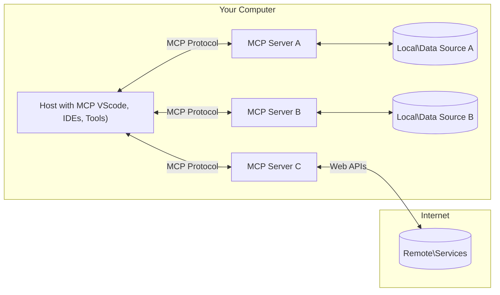

<!--
CO_OP_TRANSLATOR_METADATA:
{
  "original_hash": "355b12a5970c5c9e6db0bee970c751ba",
  "translation_date": "2025-07-13T15:58:54+00:00",
  "source_file": "01-CoreConcepts/README.md",
  "language_code": "pa"
}
-->
# 📖 MCP ਕੋਰ ਸੰਕਲਪ: AI ਇੰਟੀਗ੍ਰੇਸ਼ਨ ਲਈ ਮਾਡਲ ਕਾਂਟੈਕਸਟ ਪ੍ਰੋਟੋਕੋਲ ਵਿੱਚ ਮਾਹਰ ਬਣਨਾ

[Model Context Protocol (MCP)](https://github.com/modelcontextprotocol) ਇੱਕ ਸ਼ਕਤੀਸ਼ਾਲੀ, ਮਿਆਰੀ ਫਰੇਮਵਰਕ ਹੈ ਜੋ ਵੱਡੇ ਭਾਸ਼ਾ ਮਾਡਲਾਂ (LLMs) ਅਤੇ ਬਾਹਰੀ ਟੂਲਾਂ, ਐਪਲੀਕੇਸ਼ਨਾਂ ਅਤੇ ਡਾਟਾ ਸਰੋਤਾਂ ਵਿਚਕਾਰ ਸੰਚਾਰ ਨੂੰ ਸੁਧਾਰਦਾ ਹੈ। ਇਹ SEO-ਅਨੁਕੂਲ ਗਾਈਡ ਤੁਹਾਨੂੰ MCP ਦੇ ਮੁੱਖ ਸੰਕਲਪਾਂ ਨਾਲ ਜਾਣੂ ਕਰਵਾਏਗੀ, ਜਿਸ ਨਾਲ ਤੁਸੀਂ ਇਸ ਦੀ ਕਲਾਇੰਟ-ਸਰਵਰ ਆਰਕੀਟੈਕਚਰ, ਜਰੂਰੀ ਹਿੱਸਿਆਂ, ਸੰਚਾਰ ਮਕੈਨਿਕਸ ਅਤੇ ਲਾਗੂ ਕਰਨ ਦੀਆਂ ਵਧੀਆ ਪ੍ਰਥਾਵਾਂ ਨੂੰ ਸਮਝ ਸਕੋਗੇ।

## ਝਲਕ

ਇਸ ਪਾਠ ਵਿੱਚ ਮਾਡਲ ਕਾਂਟੈਕਸਟ ਪ੍ਰੋਟੋਕੋਲ (MCP) ਪਰਿਵਾਰ ਦੀ ਮੂਲ ਆਰਕੀਟੈਕਚਰ ਅਤੇ ਹਿੱਸਿਆਂ ਦੀ ਜਾਂਚ ਕੀਤੀ ਜਾਵੇਗੀ। ਤੁਸੀਂ ਕਲਾਇੰਟ-ਸਰਵਰ ਆਰਕੀਟੈਕਚਰ, ਮੁੱਖ ਹਿੱਸਿਆਂ ਅਤੇ ਸੰਚਾਰ ਮਕੈਨਿਕਸ ਬਾਰੇ ਸਿੱਖੋਗੇ ਜੋ MCP ਇੰਟਰੈਕਸ਼ਨਾਂ ਨੂੰ ਚਲਾਉਂਦੇ ਹਨ।

## 👩‍🎓 ਮੁੱਖ ਸਿੱਖਣ ਦੇ ਲਕੜੇ

ਇਸ ਪਾਠ ਦੇ ਅੰਤ ਤੱਕ, ਤੁਸੀਂ:

- MCP ਕਲਾਇੰਟ-ਸਰਵਰ ਆਰਕੀਟੈਕਚਰ ਨੂੰ ਸਮਝੋਗੇ।
- Hosts, Clients, ਅਤੇ Servers ਦੀਆਂ ਭੂਮਿਕਾਵਾਂ ਅਤੇ ਜ਼ਿੰਮੇਵਾਰੀਆਂ ਦੀ ਪਛਾਣ ਕਰੋਗੇ।
- ਉਹ ਮੁੱਖ ਵਿਸ਼ੇਸ਼ਤਾਵਾਂ ਵਿਸ਼ਲੇਸ਼ਣ ਕਰੋਗੇ ਜੋ MCP ਨੂੰ ਲਚਕੀਲਾ ਇੰਟੀਗ੍ਰੇਸ਼ਨ ਲੇਅਰ ਬਣਾਉਂਦੀਆਂ ਹਨ।
- MCP ਪਰਿਵਾਰ ਵਿੱਚ ਜਾਣਕਾਰੀ ਦੇ ਪ੍ਰਵਾਹ ਨੂੰ ਸਮਝੋਗੇ।
- .NET, ਜਾਵਾ, ਪਾਇਥਨ ਅਤੇ ਜਾਵਾਸਕ੍ਰਿਪਟ ਵਿੱਚ ਕੋਡ ਉਦਾਹਰਣਾਂ ਰਾਹੀਂ ਪ੍ਰਯੋਗਿਕ ਜਾਣਕਾਰੀਆਂ ਪ੍ਰਾਪਤ ਕਰੋਗੇ।

## 🔎 MCP ਆਰਕੀਟੈਕਚਰ: ਇੱਕ ਡੂੰਘੀ ਨਜ਼ਰ

MCP ਪਰਿਵਾਰ ਇੱਕ ਕਲਾਇੰਟ-ਸਰਵਰ ਮਾਡਲ 'ਤੇ ਬਣਿਆ ਹੈ। ਇਹ ਮੋਡੀਊਲਰ ਢਾਂਚਾ AI ਐਪਲੀਕੇਸ਼ਨਾਂ ਨੂੰ ਟੂਲਾਂ, ਡਾਟਾਬੇਸ, APIs ਅਤੇ ਸੰਦਰਭਿਕ ਸਰੋਤਾਂ ਨਾਲ ਪ੍ਰਭਾਵਸ਼ਾਲੀ ਤਰੀਕੇ ਨਾਲ ਇੰਟਰੈਕਟ ਕਰਨ ਦੀ ਆਗਿਆ ਦਿੰਦਾ ਹੈ। ਆਓ ਇਸ ਆਰਕੀਟੈਕਚਰ ਨੂੰ ਇਸਦੇ ਮੁੱਖ ਹਿੱਸਿਆਂ ਵਿੱਚ ਵੰਡਦੇ ਹਾਂ।

ਆਧਾਰ 'ਤੇ, MCP ਇੱਕ ਕਲਾਇੰਟ-ਸਰਵਰ ਆਰਕੀਟੈਕਚਰ ਨੂੰ ਫਾਲੋ ਕਰਦਾ ਹੈ ਜਿੱਥੇ ਇੱਕ ਹੋਸਟ ਐਪਲੀਕੇਸ਼ਨ ਕਈ ਸਰਵਰਾਂ ਨਾਲ ਜੁੜ ਸਕਦਾ ਹੈ:



- **MCP Hosts**: VSCode, Claude Desktop, IDEs ਜਾਂ AI ਟੂਲਾਂ ਵਰਗੇ ਪ੍ਰੋਗਰਾਮ ਜੋ MCP ਰਾਹੀਂ ਡਾਟਾ ਤੱਕ ਪਹੁੰਚਣਾ ਚਾਹੁੰਦੇ ਹਨ
- **MCP Clients**: ਪ੍ਰੋਟੋਕੋਲ ਕਲਾਇੰਟ ਜੋ ਸਰਵਰਾਂ ਨਾਲ 1:1 ਕਨੈਕਸ਼ਨ ਬਣਾਉਂਦੇ ਹਨ
- **MCP Servers**: ਹਲਕੇ-ਫੁਲਕੇ ਪ੍ਰੋਗਰਾਮ ਜੋ ਮਿਆਰੀਕ੍ਰਿਤ Model Context Protocol ਰਾਹੀਂ ਖਾਸ ਸਮਰੱਥਾਵਾਂ ਪ੍ਰਦਾਨ ਕਰਦੇ ਹਨ
- **ਲੋਕਲ ਡਾਟਾ ਸਰੋਤ**: ਤੁਹਾਡੇ ਕੰਪਿਊਟਰ ਦੀਆਂ ਫਾਈਲਾਂ, ਡਾਟਾਬੇਸ ਅਤੇ ਸੇਵਾਵਾਂ ਜਿਨ੍ਹਾਂ ਤੱਕ MCP ਸਰਵਰ ਸੁਰੱਖਿਅਤ ਤਰੀਕੇ ਨਾਲ ਪਹੁੰਚ ਸਕਦੇ ਹਨ
- **ਰਿਮੋਟ ਸੇਵਾਵਾਂ**: ਇੰਟਰਨੈੱਟ 'ਤੇ ਉਪਲਬਧ ਬਾਹਰੀ ਪ੍ਰਣਾਲੀਆਂ ਜਿਨ੍ਹਾਂ ਨਾਲ MCP ਸਰਵਰ APIs ਰਾਹੀਂ ਜੁੜ ਸਕਦੇ ਹਨ।

MCP ਪ੍ਰੋਟੋਕੋਲ ਇੱਕ ਵਿਕਸਤ ਹੋ ਰਿਹਾ ਮਿਆਰ ਹੈ, ਤੁਸੀਂ [protocol specification](https://modelcontextprotocol.io/specification/2025-06-18/) ਵਿੱਚ ਤਾਜ਼ਾ ਅੱਪਡੇਟ ਵੇਖ ਸਕਦੇ ਹੋ।

### 1. Hosts

Model Context Protocol (MCP) ਵਿੱਚ, Hosts ਇੱਕ ਅਹੰਕਾਰਪੂਰਨ ਭੂਮਿਕਾ ਨਿਭਾਉਂਦੇ ਹਨ ਕਿਉਂਕਿ ਇਹ ਮੁੱਖ ਇੰਟਰਫੇਸ ਹੁੰਦੇ ਹਨ ਜਿਨ੍ਹਾਂ ਰਾਹੀਂ ਯੂਜ਼ਰ ਪ੍ਰੋਟੋਕੋਲ ਨਾਲ ਇੰਟਰੈਕਟ ਕਰਦੇ ਹਨ। Hosts ਉਹ ਐਪਲੀਕੇਸ਼ਨ ਜਾਂ ਵਾਤਾਵਰਣ ਹਨ ਜੋ MCP ਸਰਵਰਾਂ ਨਾਲ ਕਨੈਕਸ਼ਨ ਸ਼ੁਰੂ ਕਰਦੇ ਹਨ ਤਾਂ ਜੋ ਡਾਟਾ, ਟੂਲਾਂ ਅਤੇ ਪ੍ਰਾਂਪਟ ਤੱਕ ਪਹੁੰਚ ਸਕਣ। Hosts ਦੇ ਉਦਾਹਰਣਾਂ ਵਿੱਚ Visual Studio Code ਵਰਗੇ ਇੰਟੀਗ੍ਰੇਟਡ ਡਿਵੈਲਪਮੈਂਟ ਇਨਵਾਇਰਨਮੈਂਟ (IDEs), Claude Desktop ਵਰਗੇ AI ਟੂਲ ਜਾਂ ਖਾਸ ਕੰਮਾਂ ਲਈ ਬਣਾਏ ਗਏ ਕਸਟਮ ਏਜੰਟ ਸ਼ਾਮਲ ਹਨ।

**Hosts** LLM ਐਪਲੀਕੇਸ਼ਨ ਹਨ ਜੋ ਕਨੈਕਸ਼ਨ ਸ਼ੁਰੂ ਕਰਦੇ ਹਨ। ਇਹ:

- AI ਮਾਡਲਾਂ ਨਾਲ ਇੰਟਰੈਕਟ ਕਰਕੇ ਜਵਾਬ ਤਿਆਰ ਕਰਦੇ ਹਨ।
- MCP ਸਰਵਰਾਂ ਨਾਲ ਕਨੈਕਸ਼ਨ ਸ਼ੁਰੂ ਕਰਦੇ ਹਨ।
- ਗੱਲਬਾਤ ਦੇ ਪ੍ਰਵਾਹ ਅਤੇ ਯੂਜ਼ਰ ਇੰਟਰਫੇਸ ਨੂੰ ਸੰਭਾਲਦੇ ਹਨ।
- ਪਰਮਿਸ਼ਨ ਅਤੇ ਸੁਰੱਖਿਆ ਸੀਮਾਵਾਂ ਨੂੰ ਨਿਯੰਤਰਿਤ ਕਰਦੇ ਹਨ।
- ਡਾਟਾ ਸਾਂਝਾ ਕਰਨ ਅਤੇ ਟੂਲ ਚਲਾਉਣ ਲਈ ਯੂਜ਼ਰ ਦੀ ਸਹਿਮਤੀ ਸੰਭਾਲਦੇ ਹਨ।

### 2. Clients

Clients ਉਹ ਜਰੂਰੀ ਹਿੱਸੇ ਹਨ ਜੋ Hosts ਅਤੇ MCP ਸਰਵਰਾਂ ਵਿਚਕਾਰ ਇੰਟਰੈਕਸ਼ਨ ਨੂੰ ਸਹੂਲਤ ਦਿੰਦੇ ਹਨ। Clients ਮੱਧਸਥ ਭੂਮਿਕਾ ਨਿਭਾਉਂਦੇ ਹਨ, Hosts ਨੂੰ MCP ਸਰਵਰਾਂ ਵੱਲੋਂ ਦਿੱਤੀਆਂ ਸਮਰੱਥਾਵਾਂ ਤੱਕ ਪਹੁੰਚ ਅਤੇ ਉਪਯੋਗ ਕਰਨ ਦੇ ਯੋਗ ਬਣਾਉਂਦੇ ਹਨ। ਇਹ MCP ਆਰਕੀਟੈਕਚਰ ਵਿੱਚ ਸੁਚਾਰੂ ਸੰਚਾਰ ਅਤੇ ਪ੍ਰਭਾਵਸ਼ਾਲੀ ਡਾਟਾ ਅਦਾਨ-ਪ੍ਰਦਾਨ ਨੂੰ ਯਕੀਨੀ ਬਣਾਉਂਦੇ ਹਨ।

**Clients** ਹੋਸਟ ਐਪਲੀਕੇਸ਼ਨ ਦੇ ਅੰਦਰ ਕਨੈਕਟਰ ਹੁੰਦੇ ਹਨ। ਇਹ:

- ਸਰਵਰਾਂ ਨੂੰ ਪ੍ਰਾਂਪਟ/ਹਦਾਇਤਾਂ ਨਾਲ ਬੇਨਤੀਆਂ ਭੇਜਦੇ ਹਨ।
- ਸਰਵਰਾਂ ਨਾਲ ਸਮਰੱਥਾਵਾਂ 'ਤੇ ਸਹਿਮਤੀ ਕਰਦੇ ਹਨ।
- ਮਾਡਲਾਂ ਵੱਲੋਂ ਟੂਲ ਚਲਾਉਣ ਦੀਆਂ ਬੇਨਤੀਆਂ ਸੰਭਾਲਦੇ ਹਨ।
- ਯੂਜ਼ਰਾਂ ਨੂੰ ਜਵਾਬ ਪ੍ਰਦਰਸ਼ਿਤ ਕਰਦੇ ਹਨ।

### 3. Servers

Servers MCP clients ਤੋਂ ਬੇਨਤੀਆਂ ਸੰਭਾਲਣ ਅਤੇ ਉਚਿਤ ਜਵਾਬ ਦੇਣ ਲਈ ਜ਼ਿੰਮੇਵਾਰ ਹੁੰਦੇ ਹਨ। ਇਹ ਡਾਟਾ ਪ੍ਰਾਪਤੀ, ਟੂਲ ਚਲਾਉਣ ਅਤੇ ਪ੍ਰਾਂਪਟ ਤਿਆਰ ਕਰਨ ਵਰਗੀਆਂ ਵੱਖ-ਵੱਖ ਕਾਰਵਾਈਆਂ ਨੂੰ ਸੰਭਾਲਦੇ ਹਨ। Servers ਇਹ ਯਕੀਨੀ ਬਣਾਉਂਦੇ ਹਨ ਕਿ clients ਅਤੇ Hosts ਵਿਚਕਾਰ ਸੰਚਾਰ ਪ੍ਰਭਾਵਸ਼ਾਲੀ ਅਤੇ ਭਰੋਸੇਯੋਗ ਹੈ, ਅਤੇ ਇੰਟਰੈਕਸ਼ਨ ਪ੍ਰਕਿਰਿਆ ਦੀ ਅਖੰਡਤਾ ਬਣਾਈ ਰੱਖਦੇ ਹਨ।

**Servers** ਉਹ ਸੇਵਾਵਾਂ ਹਨ ਜੋ ਸੰਦਰਭ ਅਤੇ ਸਮਰੱਥਾਵਾਂ ਪ੍ਰਦਾਨ ਕਰਦੀਆਂ ਹਨ। ਇਹ:

- ਉਪਲਬਧ ਵਿਸ਼ੇਸ਼ਤਾਵਾਂ (ਸਰੋਤ, ਪ੍ਰਾਂਪਟ, ਟੂਲ) ਨੂੰ ਰਜਿਸਟਰ ਕਰਦੇ ਹਨ
- ਕਲਾਇੰਟ ਵੱਲੋਂ ਟੂਲ ਕਾਲਾਂ ਨੂੰ ਪ੍ਰਾਪਤ ਅਤੇ ਚਲਾਉਂਦੇ ਹਨ
- ਮਾਡਲ ਜਵਾਬਾਂ ਨੂੰ ਬਿਹਤਰ ਬਣਾਉਣ ਲਈ ਸੰਦਰਭਿਕ ਜਾਣਕਾਰੀ ਦਿੰਦੇ ਹਨ
- ਨਤੀਜੇ ਕਲਾਇੰਟ ਨੂੰ ਵਾਪਸ ਭੇਜਦੇ ਹਨ
- ਜਰੂਰਤ ਪੈਣ 'ਤੇ ਇੰਟਰੈਕਸ਼ਨਾਂ ਦੌਰਾਨ ਸਥਿਤੀ ਨੂੰ ਬਰਕਰਾਰ ਰੱਖਦੇ ਹਨ

Servers ਕਿਸੇ ਵੀ ਵਿਅਕਤੀ ਵੱਲੋਂ ਵਿਕਸਤ ਕੀਤੇ ਜਾ ਸਕਦੇ ਹਨ ਤਾਂ ਜੋ ਮਾਡਲ ਸਮਰੱਥਾਵਾਂ ਨੂੰ ਵਿਸ਼ੇਸ਼ਤ ਫੰਕਸ਼ਨਲਿਟੀ ਨਾਲ ਵਧਾਇਆ ਜਾ ਸਕੇ।

### 4. Server Features

Model Context Protocol (MCP) ਵਿੱਚ Servers ਮੁੱਖ ਇਮਾਰਤੀ ਪੱਥਰ ਪ੍ਰਦਾਨ ਕਰਦੇ ਹਨ ਜੋ clients, hosts ਅਤੇ ਭਾਸ਼ਾ ਮਾਡਲਾਂ ਵਿਚਕਾਰ ਧਨਾਤਮਕ ਇੰਟਰੈਕਸ਼ਨਾਂ ਨੂੰ ਯੋਗ ਬਣਾਉਂਦੇ ਹਨ। ਇਹ ਵਿਸ਼ੇਸ਼ਤਾਵਾਂ MCP ਦੀ ਸਮਰੱਥਾ ਨੂੰ ਵਧਾਉਂਦੀਆਂ ਹਨ ਜਿਵੇਂ ਕਿ ਸੰਰਚਿਤ ਸੰਦਰਭ, ਟੂਲ ਅਤੇ ਪ੍ਰਾਂਪਟ ਪ੍ਰਦਾਨ ਕਰਕੇ।

MCP ਸਰਵਰ ਹੇਠ ਲਿਖੀਆਂ ਕਿਸੇ ਵੀ ਵਿਸ਼ੇਸ਼ਤਾਵਾਂ ਦੀ ਪੇਸ਼ਕਸ਼ ਕਰ ਸਕਦੇ ਹਨ:

#### 📑 Resources

Model Context Protocol (MCP) ਵਿੱਚ Resources ਵੱਖ-ਵੱਖ ਕਿਸਮ ਦੇ ਸੰਦਰਭ ਅਤੇ ਡਾਟਾ ਨੂੰ ਸ਼ਾਮਲ ਕਰਦੇ ਹਨ ਜੋ ਯੂਜ਼ਰ ਜਾਂ AI ਮਾਡਲਾਂ ਵੱਲੋਂ ਵਰਤੇ ਜਾ ਸਕਦੇ ਹਨ। ਇਹ ਵਿੱਚ ਸ਼ਾਮਲ ਹਨ:

- **ਸੰਦਰਭਿਕ ਡਾਟਾ**: ਜਾਣਕਾਰੀ ਅਤੇ ਸੰਦਰਭ ਜੋ ਯੂਜ਼ਰ ਜਾਂ AI ਮਾਡਲ ਫੈਸਲੇ ਕਰਨ ਅਤੇ ਕੰਮ ਕਰਨ ਲਈ ਵਰਤ ਸਕਦੇ ਹਨ।
- **ਨੋਲੇਜ ਬੇਸ ਅਤੇ ਦਸਤਾਵੇਜ਼ ਸੰਗ੍ਰਹਿ**: ਸੰਰਚਿਤ ਅਤੇ ਅਸੰਰਚਿਤ ਡਾਟਾ ਦੇ ਸੰਗ੍ਰਹਿ, ਜਿਵੇਂ ਲੇਖ, ਮੈਨੂਅਲ ਅਤੇ ਖੋਜ ਪੇਪਰ, ਜੋ ਕੀਮਤੀ ਜਾਣਕਾਰੀਆਂ ਪ੍ਰਦਾਨ ਕਰਦੇ ਹਨ।
- **ਲੋਕਲ ਫਾਈਲਾਂ ਅਤੇ ਡਾਟਾਬੇਸ**: ਡਿਵਾਈਸਾਂ 'ਤੇ ਜਾਂ ਡਾਟਾਬੇਸਾਂ ਵਿੱਚ ਸਟੋਰ ਕੀਤੇ ਡਾਟਾ, ਜੋ ਪ੍ਰੋਸੈਸਿੰਗ ਅਤੇ ਵਿਸ਼ਲੇਸ਼ਣ ਲਈ ਉਪਲਬਧ ਹਨ।
- **APIs ਅਤੇ ਵੈੱਬ ਸੇਵਾਵਾਂ**: ਬਾਹਰੀ ਇੰਟਰਫੇਸ ਅਤੇ ਸੇਵਾਵਾਂ ਜੋ ਵਾਧੂ ਡਾਟਾ ਅਤੇ ਕਾਰਜਸ਼ੀਲਤਾਵਾਂ ਪ੍ਰਦਾਨ ਕਰਦੀਆਂ ਹਨ, ਵੱਖ-ਵੱਖ ਆਨਲਾਈਨ ਸਰੋਤਾਂ ਅਤੇ ਟੂਲਾਂ ਨਾਲ ਇੰਟੀਗ੍ਰੇਸ਼ਨ ਯੋਗ ਬਣਾਉਂਦੀਆਂ ਹਨ।

ਇੱਕ ਸਰੋਤ ਦਾ ਉਦਾਹਰਣ ਡਾਟਾਬੇਸ ਸਕੀਮਾ ਜਾਂ ਫਾਈਲ ਹੋ ਸਕਦਾ ਹੈ ਜਿਸ ਤਰ੍ਹਾਂ ਪਹੁੰਚ ਕੀਤੀ ਜਾ ਸਕਦੀ ਹੈ:

```text
file://log.txt
database://schema
```

### 🤖 Prompts

Model Context Protocol (MCP) ਵਿੱਚ ਪ੍ਰਾਂਪਟ ਵੱਖ-ਵੱਖ ਪਹਿਲਾਂ ਤੋਂ ਤਿਆਰ ਕੀਤੇ ਗਏ ਟੈਮਪਲੇਟ ਅਤੇ ਇੰਟਰੈਕਸ਼ਨ ਪੈਟਰਨ ਸ਼ਾਮਲ ਹਨ ਜੋ ਯੂਜ਼ਰ ਦੇ ਕੰਮ ਦੇ ਪ੍ਰਵਾਹ ਨੂੰ ਸੁਗਮ ਬਣਾਉਂਦੇ ਹਨ ਅਤੇ ਸੰਚਾਰ ਨੂੰ ਬਿਹਤਰ ਕਰਦੇ ਹਨ। ਇਹ ਵਿੱਚ ਸ਼ਾਮਲ ਹਨ:

- **ਟੈਮਪਲੇਟ ਕੀਤੇ ਸੁਨੇਹੇ ਅਤੇ ਵਰਕਫਲੋਜ਼**: ਪਹਿਲਾਂ ਤੋਂ ਬਣਾਏ ਗਏ ਸੁਨੇਹੇ ਅਤੇ ਪ੍ਰਕਿਰਿਆਵਾਂ ਜੋ ਯੂਜ਼ਰਾਂ ਨੂੰ ਖਾਸ ਕੰਮਾਂ ਅਤੇ ਇੰਟਰੈਕਸ਼ਨਾਂ ਵਿੱਚ ਮਦਦ ਕਰਦੀਆਂ ਹਨ।
- **ਪਹਿਲਾਂ ਤੋਂ ਨਿਰਧਾਰਿਤ ਇੰਟਰੈਕਸ਼ਨ ਪੈਟਰਨ**: ਕਾਰਵਾਈਆਂ ਅਤੇ ਜਵਾਬਾਂ ਦੇ ਮਿਆਰੀਕ੍ਰਿਤ ਕ੍ਰਮ ਜੋ ਲਗਾਤਾਰ ਅਤੇ ਪ੍ਰਭਾਵਸ਼ਾਲੀ ਸੰਚਾਰ ਨੂੰ ਯਕੀਨੀ ਬਣਾਉਂਦੇ ਹਨ।
- **ਖਾਸ ਗੱਲਬਾਤ ਟੈਮਪਲੇਟ**: ਖਾਸ ਕਿਸਮ ਦੀਆਂ ਗੱਲਬਾਤਾਂ ਲਈ ਕਸਟਮਾਈਜ਼ ਕੀਤੇ ਟੈਮਪਲੇਟ, ਜੋ ਸੰਦਰਭਿਕ ਅਤੇ ਸਬੰਧਤ ਇੰਟਰੈਕਸ਼ਨਾਂ ਨੂੰ ਯਕੀਨੀ ਬਣਾਉਂਦੇ ਹਨ।

ਇੱਕ ਪ੍ਰਾਂਪਟ ਟੈਮਪਲੇਟ ਇਸ ਤਰ੍ਹਾਂ ਦਿਖਾਈ ਦੇ ਸਕਦਾ ਹੈ:

```markdown
Generate a product slogan based on the following {{product}} with the following {{keywords}}
```

#### ⛏️ Tools

Model Context Protocol (MCP) ਵਿੱਚ ਟੂਲ ਉਹ ਫੰਕਸ਼ਨ ਹਨ ਜੋ AI ਮਾਡਲ ਖਾਸ ਕੰਮ ਕਰਨ ਲਈ ਚਲਾ ਸਕਦਾ ਹੈ। ਇਹ ਟੂਲ AI ਮਾਡਲ ਦੀ ਸਮਰੱਥਾ ਨੂੰ ਵਧਾਉਂਦੇ ਹਨ ਅਤੇ ਸੰਰਚਿਤ ਅਤੇ ਭਰੋਸੇਯੋਗ ਕਾਰਜ ਪ੍ਰਦਾਨ ਕਰਦੇ ਹਨ। ਮੁੱਖ ਪੱਖ ਹਨ:

- **AI ਮਾਡਲ ਵੱਲੋਂ ਚਲਾਏ ਜਾਣ ਵਾਲੇ ਫੰਕਸ਼ਨ**: ਟੂਲ ਐਸੇ ਚਲਾਏ ਜਾ ਸਕਣ ਵਾਲੇ ਫੰਕਸ਼ਨ ਹਨ ਜੋ AI ਮਾਡਲ ਵੱਖ-ਵੱਖ ਕੰਮ ਕਰਨ ਲਈ ਕਾਲ ਕਰ ਸਕਦਾ ਹੈ।
- **ਵੱਖਰਾ ਨਾਮ ਅਤੇ ਵਰਣਨ**: ਹਰ ਟੂਲ ਦਾ ਇੱਕ ਵਿਲੱਖਣ ਨਾਮ ਅਤੇ ਵਿਸਥਾਰਪੂਰਵਕ ਵਰਣਨ ਹੁੰਦਾ ਹੈ ਜੋ ਇਸਦੇ ਉਦੇਸ਼ ਅਤੇ ਕਾਰਜਸ਼ੀਲਤਾ ਨੂੰ ਸਮਝਾਉਂਦਾ ਹੈ।
- **ਪੈਰਾਮੀਟਰ ਅਤੇ ਨਤੀਜੇ**: ਟੂਲ ਖਾਸ ਪੈਰਾਮੀਟਰ ਲੈਂਦੇ ਹਨ ਅਤੇ ਸੰਰਚਿਤ ਨਤੀਜੇ ਵਾਪਸ ਕਰਦੇ ਹਨ, ਜੋ ਲਗਾਤਾਰ ਅਤੇ ਅਨੁਮਾਨਯੋਗ ਨਤੀਜੇ ਯਕੀਨੀ ਬਣਾਉਂਦੇ ਹਨ।
- **ਵੱਖ-ਵੱਖ ਫੰਕਸ਼ਨ**: ਟੂਲ ਵੱਖ-ਵੱਖ ਕਾਰਜ ਕਰਦੇ ਹਨ ਜਿਵੇਂ ਵੈੱਬ ਖੋਜ, ਗਣਨਾ, ਅਤੇ ਡਾਟਾਬੇਸ ਕਵੈਰੀਜ਼।

ਇੱਕ ਟੂਲ ਦਾ ਉਦਾਹਰਣ ਇਸ ਤਰ੍ਹਾਂ ਹੋ ਸਕਦਾ ਹੈ:

```typescript
server.tool(
  "GetProducts",
  {
    pageSize: z.string().optional(),
    pageCount: z.string().optional()
  }, () => {
    // return results from API
  }
)
```

## Client Features

Model Context Protocol (MCP) ਵਿੱਚ, clients ਸਰਵਰਾਂ ਨੂੰ ਕਈ ਮੁੱਖ ਵਿਸ਼ੇਸ਼ਤਾਵਾਂ ਪ੍ਰਦਾਨ ਕਰਦੇ ਹਨ, ਜੋ ਪ੍ਰੋਟੋਕੋਲ ਦੇ ਕੁੱਲ ਕਾਰਜਕੁਸ਼ਲਤਾ ਅਤੇ ਇੰਟਰੈਕਸ਼ਨ ਨੂੰ ਵਧਾਉਂਦੀਆਂ ਹਨ। ਇੱਕ ਪ੍ਰਮੁੱਖ ਵਿਸ਼ੇਸ਼ਤਾ Sampling ਹੈ।

### 👉 Sampling

- **ਸਰਵਰ-ਸ਼ੁਰੂ ਕੀਤੇ ਏਜੈਂਟਿਕ ਵਿਹਾਰ**: Clients ਸਰਵਰਾਂ ਨੂੰ ਖੁਦਮੁਖਤਿਆਰ ਤਰੀਕੇ ਨਾਲ ਖਾਸ ਕਾਰਵਾਈਆਂ ਜਾਂ ਵਿਹਾਰ ਸ਼ੁਰੂ ਕਰਨ ਦੀ ਆਗਿਆ ਦਿੰਦੇ ਹਨ, ਜੋ ਸਿਸਟਮ ਦੀ ਗਤੀਸ਼ੀਲ ਸਮਰੱਥਾ ਨੂੰ ਵਧਾਉਂਦਾ ਹੈ।
- **Recursive LLM ਇੰਟਰੈਕਸ਼ਨ**: ਇਹ ਵਿਸ਼ੇਸ਼ਤਾ ਵੱਡੇ ਭਾਸ਼ਾ ਮਾਡਲਾਂ (LLMs) ਨਾਲ ਦੁਹਰਾਏ ਜਾਣ ਵਾਲੇ ਇੰਟਰੈਕਸ਼ਨਾਂ ਦੀ ਆਗਿਆ ਦਿੰਦੀ ਹੈ, ਜੋ ਕੰਮਾਂ ਦੀ ਜਟਿਲ ਅਤੇ ਦੁਹਰਾਈ ਪ੍ਰਕਿਰਿਆ ਨੂੰ ਯੋਗ ਬਣਾਉਂਦੀ ਹੈ।
- **ਵਾਧੂ ਮਾਡਲ ਪੂਰਨਤਾ ਦੀ ਮੰਗ**: ਸਰਵਰ ਮਾਡਲ ਤੋਂ ਵਾਧੂ ਪੂਰਨਤਾਵਾਂ ਦੀ ਮੰਗ ਕਰ ਸਕਦੇ ਹਨ, ਇਹ ਯਕੀਨੀ ਬਣਾਉਂਦਾ ਹੈ ਕਿ ਜਵਾਬ ਪੂਰੇ ਅਤੇ ਸੰਦਰਭਿਕ ਤੌਰ 'ਤੇ ਸਬੰਧਤ ਹਨ।

## MCP ਵਿੱਚ ਜਾਣਕਾਰੀ ਦਾ ਪ੍ਰਵਾਹ

Model Context Protocol (MCP) ਹੋਸਟਾਂ, clients, servers ਅਤੇ ਮਾਡਲਾਂ ਵਿਚਕਾਰ ਜਾਣਕਾਰੀ ਦੇ ਸੰਰਚਿਤ ਪ੍ਰਵਾਹ ਨੂੰ ਪਰਿਭਾਸ਼ਿਤ ਕਰਦਾ ਹੈ। ਇਸ ਪ੍ਰਵਾਹ ਨੂੰ ਸਮਝਣਾ ਇਹ ਸਪਸ਼ਟ ਕਰਦਾ ਹੈ ਕਿ ਯੂਜ਼ਰ ਦੀਆਂ ਬੇਨਤੀਆਂ ਕਿਵੇਂ ਪ੍ਰੋਸੈਸ ਹੁੰਦੀਆਂ ਹਨ ਅਤੇ ਕਿਵੇਂ ਬਾਹਰੀ ਟੂਲਾਂ ਅਤੇ ਡਾਟਾ ਸਰੋਤ ਮਾਡਲ ਜਵਾਬਾਂ ਵਿੱਚ ਸ਼ਾਮਲ ਕੀਤੇ ਜਾਂਦੇ ਹਨ।

- **Host ਕਨੈਕਸ਼ਨ ਸ਼ੁਰੂ ਕਰਦਾ ਹੈ**  
  ਹੋਸਟ ਐਪਲੀਕੇਸ਼ਨ (ਜਿਵੇਂ IDE ਜਾਂ ਚੈਟ ਇੰਟਰਫੇਸ) ਆਮ ਤੌਰ 'ਤੇ STDIO, WebSocket ਜਾਂ ਹੋਰ ਸਮਰਥਿਤ ਟਰਾਂਸਪੋਰਟ ਰਾਹੀਂ MCP ਸਰਵਰ ਨਾਲ ਕਨੈਕਸ਼ਨ ਸਥਾਪਿਤ ਕਰਦਾ ਹੈ।

- **ਸਮਰੱਥਾ ਸਹਿਮਤੀ**  
  ਕਲਾਇੰਟ (ਜੋ ਹੋਸਟ ਵਿੱਚ ਐਂਬੈਡ ਹੈ) ਅਤੇ ਸਰਵਰ ਆਪਣੇ ਸਮਰਥਿਤ ਵਿਸ਼ੇਸ਼ਤਾਵਾਂ, ਟੂਲਾਂ, ਸਰੋਤਾਂ ਅਤੇ ਪ੍ਰੋਟੋਕੋਲ ਵਰਜਨਾਂ ਬਾਰੇ ਜਾਣਕਾਰੀ ਦਾ ਅਦਾਨ-ਪ੍ਰਦਾਨ ਕਰਦੇ ਹਨ। ਇਹ ਯਕੀਨੀ ਬਣਾਉਂਦਾ ਹੈ ਕਿ ਦੋਹਾਂ ਪਾਸੇ ਸੈਸ਼ਨ ਲਈ ਉਪਲਬਧ ਸਮਰੱਥਾਵਾਂ ਨੂੰ ਸਮਝਦੇ ਹਨ।

- **ਯੂਜ਼ਰ ਬੇਨਤੀ**  
  ਯੂਜ਼ਰ ਹੋਸਟ ਨਾਲ ਇੰਟਰੈਕਟ ਕਰਦਾ ਹੈ (ਜਿਵੇਂ ਪ੍ਰਾਂਪਟ ਜਾਂ ਕਮਾਂਡ ਦਾਖਲ ਕਰਦਾ ਹੈ)। ਹੋਸਟ ਇਹ ਇਨਪੁਟ ਇਕੱਠਾ ਕਰਦਾ ਹੈ ਅਤੇ ਪ੍ਰੋਸੈਸਿੰਗ ਲਈ ਕਲਾਇੰਟ ਨੂੰ ਭੇਜਦਾ ਹੈ।

- **ਸਰੋਤ ਜਾਂ ਟੂਲ ਦੀ ਵਰਤੋਂ**  
  - ਕਲਾਇ
MCP ਵਿੱਚ ਸੁਰੱਖਿਆ ਅਤੇ ਅਧਿਕਾਰ ਪ੍ਰਬੰਧਨ ਲਈ ਕਈ ਅੰਦਰੂਨੀ ਧਾਰਣਾਵਾਂ ਅਤੇ ਤਰੀਕੇ ਸ਼ਾਮਲ ਹਨ ਜੋ ਪ੍ਰੋਟੋਕੋਲ ਭਰ ਵਿੱਚ ਲਾਗੂ ਹੁੰਦੇ ਹਨ:

1. **ਟੂਲ ਪਰਮਿਸ਼ਨ ਕੰਟਰੋਲ**:  
  ਕਲਾਇੰਟ ਇਹ ਨਿਰਧਾਰਤ ਕਰ ਸਕਦੇ ਹਨ ਕਿ ਮਾਡਲ ਸੈਸ਼ਨ ਦੌਰਾਨ ਕਿਹੜੇ ਟੂਲ ਵਰਤ ਸਕਦਾ ਹੈ। ਇਸ ਨਾਲ ਇਹ ਯਕੀਨੀ ਬਣਦਾ ਹੈ ਕਿ ਸਿਰਫ਼ ਖਾਸ ਤੌਰ 'ਤੇ ਮਨਜ਼ੂਰਸ਼ੁਦਾ ਟੂਲ ਹੀ ਉਪਲਬਧ ਹਨ, ਜਿਸ ਨਾਲ ਗਲਤ ਜਾਂ ਅਸੁਰੱਖਿਅਤ ਕਾਰਵਾਈਆਂ ਦਾ ਖਤਰਾ ਘਟਦਾ ਹੈ। ਪਰਮਿਸ਼ਨਾਂ ਨੂੰ ਯੂਜ਼ਰ ਦੀ ਪਸੰਦ, ਸੰਗਠਨ ਦੀ ਨੀਤੀ ਜਾਂ ਸੰਵਾਦ ਦੇ ਸੰਦਰਭ ਅਨੁਸਾਰ ਡਾਇਨਾਮਿਕ ਤੌਰ 'ਤੇ ਸੈੱਟ ਕੀਤਾ ਜਾ ਸਕਦਾ ਹੈ।

2. **ਪ੍ਰਮਾਣਿਕਤਾ**:  
  ਸਰਵਰ ਟੂਲਾਂ, ਸਰੋਤਾਂ ਜਾਂ ਸੰਵੇਦਨਸ਼ੀਲ ਕਾਰਵਾਈਆਂ ਤੱਕ ਪਹੁੰਚ ਦੇਣ ਤੋਂ ਪਹਿਲਾਂ ਪ੍ਰਮਾਣਿਕਤਾ ਦੀ ਮੰਗ ਕਰ ਸਕਦੇ ਹਨ। ਇਸ ਵਿੱਚ API ਕੀਜ਼, OAuth ਟੋਕਨ ਜਾਂ ਹੋਰ ਪ੍ਰਮਾਣਿਕਤਾ ਸਕੀਮਾਂ ਸ਼ਾਮਲ ਹੋ ਸਕਦੀਆਂ ਹਨ। ਠੀਕ ਪ੍ਰਮਾਣਿਕਤਾ ਇਹ ਯਕੀਨੀ ਬਣਾਉਂਦੀ ਹੈ ਕਿ ਸਿਰਫ਼ ਭਰੋਸੇਯੋਗ ਕਲਾਇੰਟ ਅਤੇ ਯੂਜ਼ਰ ਹੀ ਸਰਵਰ-ਸਾਈਡ ਸਮਰੱਥਾਵਾਂ ਨੂੰ ਕਾਲ ਕਰ ਸਕਦੇ ਹਨ।

3. **ਵੈਧਤਾ ਜਾਂਚ**:  
  ਸਾਰੇ ਟੂਲ ਕਾਲਾਂ ਲਈ ਪੈਰਾਮੀਟਰ ਵੈਧਤਾ ਲਾਗੂ ਕੀਤੀ ਜਾਂਦੀ ਹੈ। ਹਰ ਟੂਲ ਆਪਣੇ ਪੈਰਾਮੀਟਰਾਂ ਲਈ ਉਮੀਦ ਕੀਤੇ ਗਏ ਕਿਸਮਾਂ, ਫਾਰਮੈਟ ਅਤੇ ਸੀਮਾਵਾਂ ਨੂੰ ਪਰਿਭਾਸ਼ਿਤ ਕਰਦਾ ਹੈ, ਅਤੇ ਸਰਵਰ ਆਉਣ ਵਾਲੀਆਂ ਬੇਨਤੀਆਂ ਦੀ ਇਸ ਅਨੁਸਾਰ ਜਾਂਚ ਕਰਦਾ ਹੈ। ਇਸ ਨਾਲ ਗਲਤ ਜਾਂ ਮਾਲਿਸ਼ੀਅਸ ਇਨਪੁੱਟ ਟੂਲ ਇੰਪਲੀਮੈਂਟੇਸ਼ਨਾਂ ਤੱਕ ਨਹੀਂ ਪਹੁੰਚਦਾ ਅਤੇ ਕਾਰਵਾਈਆਂ ਦੀ ਸਹੀਅਤ ਬਣੀ ਰਹਿੰਦੀ ਹੈ।

4. **ਰੇਟ ਲਿਮਿਟਿੰਗ**:  
  ਦੁਰਵਰਤੋਂ ਨੂੰ ਰੋਕਣ ਅਤੇ ਸਰਵਰ ਸਰੋਤਾਂ ਦੀ ਨਿਆਂਸੰਗਤ ਵਰਤੋਂ ਯਕੀਨੀ ਬਣਾਉਣ ਲਈ, MCP ਸਰਵਰ ਟੂਲ ਕਾਲਾਂ ਅਤੇ ਸਰੋਤ ਪਹੁੰਚ ਲਈ ਰੇਟ ਲਿਮਿਟਿੰਗ ਲਾਗੂ ਕਰ ਸਕਦੇ ਹਨ। ਰੇਟ ਲਿਮਿਟ ਯੂਜ਼ਰ, ਸੈਸ਼ਨ ਜਾਂ ਗਲੋਬਲ ਤੌਰ 'ਤੇ ਲਗਾਈ ਜਾ ਸਕਦੀ ਹੈ, ਜੋ ਡਿਨਾਇਅਲ-ਆਫ-ਸਰਵਿਸ ਹਮਲਿਆਂ ਜਾਂ ਬੇਹੱਦ ਸਰੋਤ ਖਪਤ ਤੋਂ ਬਚਾਉਂਦੀ ਹੈ।

ਇਹਨਾਂ ਤਰੀਕਿਆਂ ਨੂੰ ਮਿਲਾ ਕੇ, MCP ਭਾਸ਼ਾ ਮਾਡਲਾਂ ਨੂੰ ਬਾਹਰੀ ਟੂਲਾਂ ਅਤੇ ਡਾਟਾ ਸਰੋਤਾਂ ਨਾਲ ਸੁਰੱਖਿਅਤ ਤਰੀਕੇ ਨਾਲ ਜੋੜਨ ਲਈ ਮਜ਼ਬੂਤ ਬੁਨਿਆਦ ਪ੍ਰਦਾਨ ਕਰਦਾ ਹੈ, ਜਦਕਿ ਯੂਜ਼ਰਾਂ ਅਤੇ ਡਿਵੈਲਪਰਾਂ ਨੂੰ ਪਹੁੰਚ ਅਤੇ ਵਰਤੋਂ 'ਤੇ ਬਰੀਕੀ ਨਾਲ ਕੰਟਰੋਲ ਦਿੰਦਾ ਹੈ।

## ਪ੍ਰੋਟੋਕੋਲ ਸੁਨੇਹੇ

MCP ਸੰਚਾਰ ਸਪਸ਼ਟ ਅਤੇ ਭਰੋਸੇਯੋਗ ਇੰਟਰੈਕਸ਼ਨ ਲਈ ਸੰਰਚਿਤ JSON ਸੁਨੇਹਿਆਂ ਦੀ ਵਰਤੋਂ ਕਰਦਾ ਹੈ ਜੋ ਕਲਾਇੰਟ, ਸਰਵਰ ਅਤੇ ਮਾਡਲਾਂ ਵਿਚਕਾਰ ਹੁੰਦੇ ਹਨ। ਮੁੱਖ ਸੁਨੇਹਾ ਕਿਸਮਾਂ ਵਿੱਚ ਸ਼ਾਮਲ ਹਨ:

- **ਕਲਾਇੰਟ ਬੇਨਤੀ**  
  ਕਲਾਇੰਟ ਵੱਲੋਂ ਸਰਵਰ ਨੂੰ ਭੇਜੀ ਜਾਂਦੀ ਹੈ, ਇਸ ਸੁਨੇਹੇ ਵਿੱਚ ਆਮ ਤੌਰ 'ਤੇ ਸ਼ਾਮਲ ਹੁੰਦਾ ਹੈ:  
  - ਯੂਜ਼ਰ ਦਾ ਪ੍ਰਾਂਪਟ ਜਾਂ ਕਮਾਂਡ  
  - ਸੰਦਰਭ ਲਈ ਗੱਲਬਾਤ ਦਾ ਇਤਿਹਾਸ  
  - ਟੂਲ ਸੰਰਚਨਾ ਅਤੇ ਪਰਮਿਸ਼ਨ  
  - ਕੋਈ ਹੋਰ ਮੈਟਾਡੇਟਾ ਜਾਂ ਸੈਸ਼ਨ ਜਾਣਕਾਰੀ

- **ਮਾਡਲ ਜਵਾਬ**  
  ਮਾਡਲ ਵੱਲੋਂ (ਕਲਾਇੰਟ ਰਾਹੀਂ) ਵਾਪਸ ਭੇਜਿਆ ਜਾਂਦਾ ਹੈ, ਇਸ ਸੁਨੇਹੇ ਵਿੱਚ ਸ਼ਾਮਲ ਹੁੰਦਾ ਹੈ:  
  - ਪ੍ਰਾਂਪਟ ਅਤੇ ਸੰਦਰਭ ਅਨੁਸਾਰ ਬਣਾਇਆ ਗਿਆ ਟੈਕਸਟ ਜਾਂ ਪੂਰਾ ਕੀਤਾ ਗਿਆ ਕੰਮ  
  - ਜੇ ਮਾਡਲ ਨੂੰ ਲੱਗੇ ਕਿ ਟੂਲ ਕਾਲ ਕਰਨੀ ਚਾਹੀਦੀ ਹੈ ਤਾਂ ਵਿਕਲਪਿਕ ਟੂਲ ਕਾਲ ਨਿਰਦੇਸ਼  
  - ਜਰੂਰਤ ਅਨੁਸਾਰ ਸਰੋਤਾਂ ਜਾਂ ਹੋਰ ਸੰਦਰਭ ਲਈ ਹਵਾਲੇ

- **ਟੂਲ ਬੇਨਤੀ**  
  ਜਦੋਂ ਟੂਲ ਚਲਾਉਣ ਦੀ ਲੋੜ ਹੋਵੇ ਤਾਂ ਕਲਾਇੰਟ ਵੱਲੋਂ ਸਰਵਰ ਨੂੰ ਭੇਜੀ ਜਾਂਦੀ ਹੈ। ਇਸ ਸੁਨੇਹੇ ਵਿੱਚ ਸ਼ਾਮਲ ਹੁੰਦਾ ਹੈ:  
  - ਕਾਲ ਕਰਨ ਵਾਲੇ ਟੂਲ ਦਾ ਨਾਮ  
  - ਟੂਲ ਵੱਲੋਂ ਮੰਗੇ ਗਏ ਪੈਰਾਮੀਟਰ (ਟੂਲ ਦੇ ਸਕੀਮਾ ਅਨੁਸਾਰ ਵੈਧ)  
  - ਬੇਨਤੀ ਨੂੰ ਟਰੈਕ ਕਰਨ ਲਈ ਸੰਦਰਭ ਜਾਣਕਾਰੀ ਜਾਂ ਪਹਚਾਣ

- **ਟੂਲ ਜਵਾਬ**  
  ਟੂਲ ਚਲਾਉਣ ਤੋਂ ਬਾਅਦ ਸਰਵਰ ਵੱਲੋਂ ਵਾਪਸ ਭੇਜਿਆ ਜਾਂਦਾ ਹੈ। ਇਸ ਸੁਨੇਹੇ ਵਿੱਚ ਸ਼ਾਮਲ ਹੁੰਦਾ ਹੈ:  
  - ਟੂਲ ਚਲਾਉਣ ਦੇ ਨਤੀਜੇ (ਸੰਰਚਿਤ ਡਾਟਾ ਜਾਂ ਸਮੱਗਰੀ)  
  - ਜੇ ਟੂਲ ਕਾਲ ਫੇਲ ਹੋਈ ਤਾਂ ਕੋਈ ਗਲਤੀ ਜਾਂ ਸਥਿਤੀ ਜਾਣਕਾਰੀ  
  - ਵਿਕਲਪਿਕ ਤੌਰ 'ਤੇ ਚਲਾਉਣ ਨਾਲ ਸੰਬੰਧਿਤ ਹੋਰ ਮੈਟਾਡੇਟਾ ਜਾਂ ਲੌਗ

ਇਹ ਸੰਰਚਿਤ ਸੁਨੇਹੇ ਯਕੀਨੀ ਬਣਾਉਂਦੇ ਹਨ ਕਿ MCP ਵਰਕਫਲੋ ਦਾ ਹਰ ਕਦਮ ਸਪਸ਼ਟ, ਟਰੇਸ ਕਰਨ ਯੋਗ ਅਤੇ ਵਧਾਇਆ ਜਾ ਸਕਣ ਵਾਲਾ ਹੈ, ਜੋ ਕਿ ਬਹੁ-ਚਰਣ ਗੱਲਬਾਤਾਂ, ਟੂਲ ਚੇਨਿੰਗ ਅਤੇ ਮਜ਼ਬੂਤ ਗਲਤੀ ਸੰਭਾਲ ਵਰਗੇ ਉੱਚ ਪੱਧਰੀ ਸਥਿਤੀਆਂ ਨੂੰ ਸਹਾਰਾ ਦਿੰਦਾ ਹੈ।

## ਮੁੱਖ ਗੱਲਾਂ

- MCP ਮਾਡਲਾਂ ਨੂੰ ਬਾਹਰੀ ਸਮਰੱਥਾਵਾਂ ਨਾਲ ਜੋੜਨ ਲਈ ਕਲਾਇੰਟ-ਸਰਵਰ ਆਰਕੀਟੈਕਚਰ ਵਰਤਦਾ ਹੈ  
- ਇਸ ਪਰਿਸਰ ਵਿੱਚ ਕਲਾਇੰਟ, ਹੋਸਟ, ਸਰਵਰ, ਟੂਲ ਅਤੇ ਡਾਟਾ ਸਰੋਤ ਸ਼ਾਮਲ ਹਨ  
- ਸੰਚਾਰ STDIO, SSE ਜਾਂ WebSockets ਰਾਹੀਂ ਹੋ ਸਕਦਾ ਹੈ  
- ਟੂਲ ਮਾਡਲਾਂ ਨੂੰ ਦਿੱਤੀ ਜਾਣ ਵਾਲੀ ਮੁੱਖ ਕਾਰਗੁਜ਼ਾਰੀ ਇਕਾਈਆਂ ਹਨ  
- ਸੰਰਚਿਤ ਸੰਚਾਰ ਪ੍ਰੋਟੋਕੋਲ ਸਥਿਰ ਅਤੇ ਲਗਾਤਾਰ ਇੰਟਰੈਕਸ਼ਨ ਯਕੀਨੀ ਬਣਾਉਂਦੇ ਹਨ

## ਅਭਿਆਸ

ਆਪਣੇ ਖੇਤਰ ਵਿੱਚ ਲਾਭਦਾਇਕ ਇੱਕ ਸਧਾਰਣ MCP ਟੂਲ ਡਿਜ਼ਾਈਨ ਕਰੋ। ਪਰਿਭਾਸ਼ਿਤ ਕਰੋ:  
1. ਟੂਲ ਦਾ ਨਾਮ ਕੀ ਹੋਵੇਗਾ  
2. ਇਹ ਕਿਹੜੇ ਪੈਰਾਮੀਟਰ ਸਵੀਕਾਰ ਕਰੇਗਾ  
3. ਇਹ ਕਿਹੜਾ ਨਤੀਜਾ ਵਾਪਸ ਕਰੇਗਾ  
4. ਮਾਡਲ ਇਸ ਟੂਲ ਨੂੰ ਵਰਤ ਕੇ ਯੂਜ਼ਰ ਦੀਆਂ ਸਮੱਸਿਆਵਾਂ ਕਿਵੇਂ ਹੱਲ ਕਰ ਸਕਦਾ ਹੈ

---

## ਅਗਲਾ ਕੀ ਹੈ

ਅਗਲਾ: [Chapter 2: Security](../02-Security/README.md)

**ਅਸਵੀਕਾਰੋਪਣ**:  
ਇਹ ਦਸਤਾਵੇਜ਼ AI ਅਨੁਵਾਦ ਸੇਵਾ [Co-op Translator](https://github.com/Azure/co-op-translator) ਦੀ ਵਰਤੋਂ ਕਰਕੇ ਅਨੁਵਾਦਿਤ ਕੀਤਾ ਗਿਆ ਹੈ। ਜਦੋਂ ਕਿ ਅਸੀਂ ਸਹੀਤਾ ਲਈ ਕੋਸ਼ਿਸ਼ ਕਰਦੇ ਹਾਂ, ਕਿਰਪਾ ਕਰਕੇ ਧਿਆਨ ਰੱਖੋ ਕਿ ਸਵੈਚਾਲਿਤ ਅਨੁਵਾਦਾਂ ਵਿੱਚ ਗਲਤੀਆਂ ਜਾਂ ਅਸਮਰਥਤਾਵਾਂ ਹੋ ਸਕਦੀਆਂ ਹਨ। ਮੂਲ ਦਸਤਾਵੇਜ਼ ਆਪਣੀ ਮੂਲ ਭਾਸ਼ਾ ਵਿੱਚ ਪ੍ਰਮਾਣਿਕ ਸਰੋਤ ਮੰਨਿਆ ਜਾਣਾ ਚਾਹੀਦਾ ਹੈ। ਮਹੱਤਵਪੂਰਨ ਜਾਣਕਾਰੀ ਲਈ, ਪੇਸ਼ੇਵਰ ਮਨੁੱਖੀ ਅਨੁਵਾਦ ਦੀ ਸਿਫਾਰਸ਼ ਕੀਤੀ ਜਾਂਦੀ ਹੈ। ਅਸੀਂ ਇਸ ਅਨੁਵਾਦ ਦੀ ਵਰਤੋਂ ਤੋਂ ਉਤਪੰਨ ਕਿਸੇ ਵੀ ਗਲਤਫਹਿਮੀ ਜਾਂ ਗਲਤ ਵਿਆਖਿਆ ਲਈ ਜ਼ਿੰਮੇਵਾਰ ਨਹੀਂ ਹਾਂ।