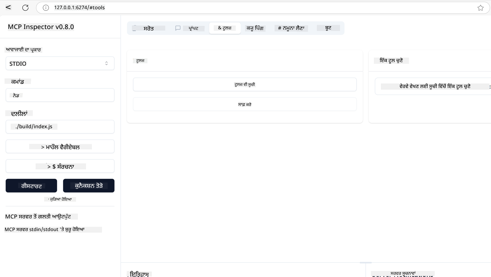
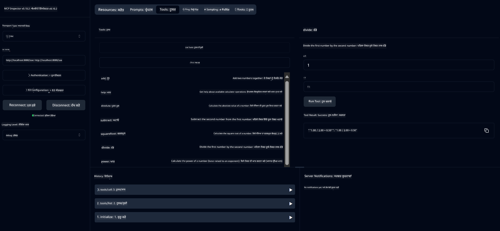
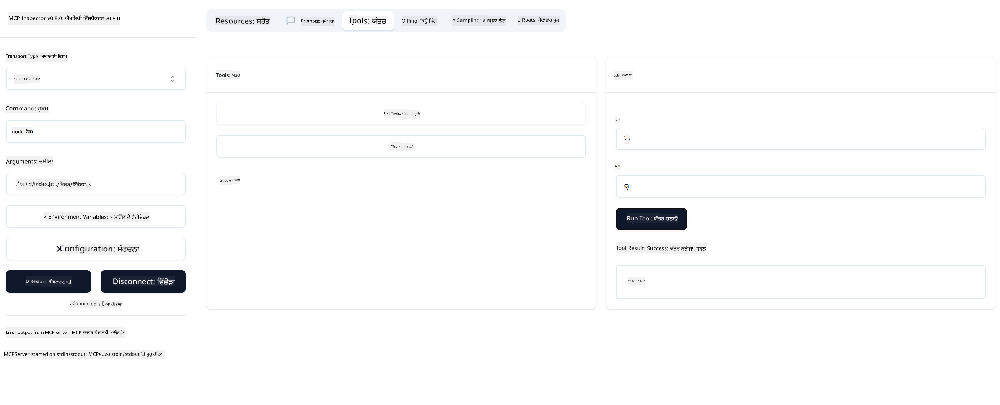

<!--
CO_OP_TRANSLATOR_METADATA:
{
  "original_hash": "ec11ee93f31fdadd94facd3e3d22f9e6",
  "translation_date": "2025-09-09T21:43:03+00:00",
  "source_file": "03-GettingStarted/01-first-server/README.md",
  "language_code": "pa"
}
-->
# MCP ਨਾਲ ਸ਼ੁਰੂਆਤ

Model Context Protocol (MCP) ਨਾਲ ਆਪਣੇ ਪਹਿਲੇ ਕਦਮਾਂ ਵਿੱਚ ਤੁਹਾਡਾ ਸਵਾਗਤ ਹੈ! ਚਾਹੇ ਤੁਸੀਂ MCP ਵਿੱਚ ਨਵੇਂ ਹੋ ਜਾਂ ਇਸਦੀ ਸਮਝ ਨੂੰ ਗਹਿਰਾਈ ਵਿੱਚ ਲੈ ਜਾਣਾ ਚਾਹੁੰਦੇ ਹੋ, ਇਹ ਗਾਈਡ ਤੁਹਾਨੂੰ ਜ਼ਰੂਰੀ ਸੈਟਅਪ ਅਤੇ ਵਿਕਾਸ ਪ੍ਰਕਿਰਿਆ ਵਿੱਚ ਰਾਹ ਦਿਖਾਏਗੀ। ਤੁਸੀਂ ਜਾਣੋਗੇ ਕਿ MCP ਕਿਵੇਂ AI ਮਾਡਲਾਂ ਅਤੇ ਐਪਲੀਕੇਸ਼ਨਾਂ ਦੇ ਵਿਚਕਾਰ ਬਿਨਾਂ ਰੁਕਾਵਟ ਇੰਟੀਗ੍ਰੇਸ਼ਨ ਨੂੰ ਯਕੀਨੀ ਬਣਾਉਂਦਾ ਹੈ ਅਤੇ MCP-ਚਲਿਤ ਹੱਲਾਂ ਬਣਾਉਣ ਅਤੇ ਟੈਸਟ ਕਰਨ ਲਈ ਆਪਣਾ ਵਾਤਾਵਰਣ ਕਿਵੇਂ ਤਿਆਰ ਕਰਨਾ ਹੈ।

> TLDR; ਜੇ ਤੁਸੀਂ AI ਐਪਸ ਬਣਾਉਂਦੇ ਹੋ, ਤਾਂ ਤੁਹਾਨੂੰ ਪਤਾ ਹੈ ਕਿ ਤੁਸੀਂ ਆਪਣੇ LLM (ਵੱਡੇ ਭਾਸ਼ਾ ਮਾਡਲ) ਵਿੱਚ ਟੂਲ ਅਤੇ ਹੋਰ ਸਰੋਤ ਸ਼ਾਮਲ ਕਰ ਸਕਦੇ ਹੋ, ਤਾਂ ਜੋ LLM ਹੋਰ ਜਾਣਕਾਰੀਵਾਨ ਬਣੇ। ਪਰ ਜੇ ਤੁਸੀਂ ਉਹ ਟੂਲ ਅਤੇ ਸਰੋਤ ਸਰਵਰ 'ਤੇ ਰੱਖਦੇ ਹੋ, ਤਾਂ ਐਪ ਅਤੇ ਸਰਵਰ ਦੀਆਂ ਸਮਰੱਥਾਵਾਂ ਕਿਸੇ ਵੀ ਕਲਾਇੰਟ ਦੁਆਰਾ LLM ਦੇ ਨਾਲ/ਬਿਨਾਂ ਵਰਤੀਆਂ ਜਾ ਸਕਦੀਆਂ ਹਨ।

## ਝਲਕ

ਇਹ ਪਾਠ MCP ਵਾਤਾਵਰਣ ਸੈਟਅਪ ਕਰਨ ਅਤੇ ਆਪਣੀ ਪਹਿਲੀ MCP ਐਪਲੀਕੇਸ਼ਨ ਬਣਾਉਣ ਲਈ ਵਿਹੰਗਮ ਦ੍ਰਿਸ਼ਟੀ ਪ੍ਰਦਾਨ ਕਰਦਾ ਹੈ। ਤੁਸੀਂ ਜ਼ਰੂਰੀ ਟੂਲ ਅਤੇ ਫਰੇਮਵਰਕ ਸੈਟਅਪ ਕਰਨ, ਬੁਨਿਆਦੀ MCP ਸਰਵਰ ਬਣਾਉਣ, ਹੋਸਟ ਐਪਲੀਕੇਸ਼ਨ ਬਣਾਉਣ ਅਤੇ ਆਪਣੀ ਇੰਪਲੀਮੈਂਟੇਸ਼ਨ ਦੀ ਜਾਂਚ ਕਰਨ ਦੇ ਬਾਰੇ ਸਿੱਖੋਗੇ।

Model Context Protocol (MCP) ਇੱਕ ਖੁੱਲਾ ਪ੍ਰੋਟੋਕੋਲ ਹੈ ਜੋ ਐਪਲੀਕੇਸ਼ਨਾਂ ਨੂੰ LLMs ਨੂੰ ਸੰਦਰਭ ਪ੍ਰਦਾਨ ਕਰਨ ਦੇ ਤਰੀਕੇ ਨੂੰ ਮਿਆਰੀ ਬਣਾਉਂਦਾ ਹੈ। MCP ਨੂੰ AI ਐਪਲੀਕੇਸ਼ਨਾਂ ਲਈ USB-C ਪੋਰਟ ਵਾਂਗ ਸੋਚੋ - ਇਹ AI ਮਾਡਲਾਂ ਨੂੰ ਵੱਖ-ਵੱਖ ਡਾਟਾ ਸਰੋਤਾਂ ਅਤੇ ਟੂਲਾਂ ਨਾਲ ਜੁੜਨ ਦਾ ਮਿਆਰੀ ਤਰੀਕਾ ਪ੍ਰਦਾਨ ਕਰਦਾ ਹੈ।

## ਸਿੱਖਣ ਦੇ ਉਦੇਸ਼

ਇਸ ਪਾਠ ਦੇ ਅੰਤ ਤੱਕ, ਤੁਸੀਂ ਇਹ ਕਰਨ ਦੇ ਯੋਗ ਹੋਵੋਗੇ:

- C#, Java, Python, TypeScript, ਅਤੇ Rust ਵਿੱਚ MCP ਲਈ ਵਿਕਾਸ ਵਾਤਾਵਰਣ ਸੈਟਅਪ ਕਰੋ
- ਵਿਲੱਖਣ ਵਿਸ਼ੇਸ਼ਤਾਵਾਂ (ਸਰੋਤ, ਪ੍ਰੋੰਪਟ, ਅਤੇ ਟੂਲ) ਦੇ ਨਾਲ ਬੁਨਿਆਦੀ MCP ਸਰਵਰ ਬਣਾਓ ਅਤੇ ਡਿਪਲੌਇ ਕਰੋ
- MCP ਸਰਵਰਾਂ ਨਾਲ ਜੁੜਨ ਵਾਲੇ ਹੋਸਟ ਐਪਲੀਕੇਸ਼ਨ ਬਣਾਓ
- MCP ਇੰਪਲੀਮੈਂਟੇਸ਼ਨ ਦੀ ਜਾਂਚ ਅਤੇ ਡਿਬੱਗ ਕਰੋ

## ਆਪਣਾ MCP ਵਾਤਾਵਰਣ ਸੈਟਅਪ ਕਰਨਾ

MCP 'ਤੇ ਕੰਮ ਕਰਨ ਤੋਂ ਪਹਿਲਾਂ, ਆਪਣਾ ਵਿਕਾਸ ਵਾਤਾਵਰਣ ਤਿਆਰ ਕਰਨਾ ਅਤੇ ਬੁਨਿਆਦੀ ਵਰਕਫਲੋ ਨੂੰ ਸਮਝਣਾ ਮਹੱਤਵਪੂਰਨ ਹੈ। ਇਹ ਸੈਕਸ਼ਨ ਤੁਹਾਨੂੰ MCP ਨਾਲ ਸਹੀ ਸ਼ੁਰੂਆਤ ਯਕੀਨੀ ਬਣਾਉਣ ਲਈ ਸ਼ੁਰੂਆਤੀ ਸੈਟਅਪ ਕਦਮਾਂ ਵਿੱਚ ਰਾਹ ਦਿਖਾਏਗਾ।

### ਪੂਰਵ ਸ਼ਰਤਾਂ

MCP ਵਿਕਾਸ ਵਿੱਚ ਡੁੱਬਣ ਤੋਂ ਪਹਿਲਾਂ, ਇਹ ਯਕੀਨੀ ਬਣਾਓ ਕਿ ਤੁਹਾਡੇ ਕੋਲ ਹੈ:

- **ਵਿਕਾਸ ਵਾਤਾਵਰਣ**: ਤੁਹਾਡੇ ਚੁਣੇ ਹੋਏ ਭਾਸ਼ਾ ਲਈ (C#, Java, Python, TypeScript, ਜਾਂ Rust)
- **IDE/ਸੰਪਾਦਕ**: Visual Studio, Visual Studio Code, IntelliJ, Eclipse, PyCharm, ਜਾਂ ਕੋਈ ਵੀ ਆਧੁਨਿਕ ਕੋਡ ਸੰਪਾਦਕ
- **ਪੈਕੇਜ ਮੈਨੇਜਰ**: NuGet, Maven/Gradle, pip, npm/yarn, ਜਾਂ Cargo
- **API ਕੁੰਜੀਆਂ**: ਕਿਸੇ ਵੀ AI ਸੇਵਾਵਾਂ ਲਈ ਜੋ ਤੁਸੀਂ ਆਪਣੇ ਹੋਸਟ ਐਪਲੀਕੇਸ਼ਨ ਵਿੱਚ ਵਰਤਣ ਦੀ ਯੋਜਨਾ ਬਣਾਉਂਦੇ ਹੋ

## ਬੁਨਿਆਦੀ MCP ਸਰਵਰ ਸਟ੍ਰਕਚਰ

ਇੱਕ MCP ਸਰਵਰ ਆਮ ਤੌਰ 'ਤੇ ਸ਼ਾਮਲ ਹੁੰਦਾ ਹੈ:

- **ਸਰਵਰ ਸੰਰਚਨਾ**: ਪੋਰਟ, ਪ੍ਰਮਾਣਿਕਤਾ, ਅਤੇ ਹੋਰ ਸੈਟਿੰਗਾਂ ਸੈਟਅਪ ਕਰੋ
- **ਸਰੋਤ**: LLMs ਨੂੰ ਉਪਲਬਧ ਡਾਟਾ ਅਤੇ ਸੰਦਰਭ
- **ਟੂਲ**: ਮਾਡਲਾਂ ਦੁਆਰਾ ਆਹਵਾਨ ਕੀਤੀ ਜਾਣ ਵਾਲੀ ਕਾਰਗੁਜ਼ਾਰੀ
- **ਪ੍ਰੋੰਪਟ**: ਟੈਕਸਟ ਬਣਾਉਣ ਜਾਂ ਸੰਰਚਿਤ ਕਰਨ ਲਈ ਟੈਂਪਲੇਟ

ਇਹ TypeScript ਵਿੱਚ ਇੱਕ ਸਰਲ ਉਦਾਹਰਨ ਹੈ:

```typescript
import { McpServer, ResourceTemplate } from "@modelcontextprotocol/sdk/server/mcp.js";
import { StdioServerTransport } from "@modelcontextprotocol/sdk/server/stdio.js";
import { z } from "zod";

// Create an MCP server
const server = new McpServer({
  name: "Demo",
  version: "1.0.0"
});

// Add an addition tool
server.tool("add",
  { a: z.number(), b: z.number() },
  async ({ a, b }) => ({
    content: [{ type: "text", text: String(a + b) }]
  })
);

// Add a dynamic greeting resource
server.resource(
  "file",
  // The 'list' parameter controls how the resource lists available files. Setting it to undefined disables listing for this resource.
  new ResourceTemplate("file://{path}", { list: undefined }),
  async (uri, { path }) => ({
    contents: [{
      uri: uri.href,
      text: `File, ${path}!`
    }]
  })
);

// Add a file resource that reads the file contents
server.resource(
  "file",
  new ResourceTemplate("file://{path}", { list: undefined }),
  async (uri, { path }) => {
    let text;
    try {
      text = await fs.readFile(path, "utf8");
    } catch (err) {
      text = `Error reading file: ${err.message}`;
    }
    return {
      contents: [{
        uri: uri.href,
        text
      }]
    };
  }
);

server.prompt(
  "review-code",
  { code: z.string() },
  ({ code }) => ({
    messages: [{
      role: "user",
      content: {
        type: "text",
        text: `Please review this code:\n\n${code}`
      }
    }]
  })
);

// Start receiving messages on stdin and sending messages on stdout
const transport = new StdioServerTransport();
await server.connect(transport);
```

ਉਪਰੋਕਤ ਕੋਡ ਵਿੱਚ:

- MCP TypeScript SDK ਤੋਂ ਜ਼ਰੂਰੀ ਕਲਾਸਾਂ ਨੂੰ ਇੰਪੋਰਟ ਕੀਤਾ।
- ਇੱਕ ਨਵਾਂ MCP ਸਰਵਰ ਇੰਸਟੈਂਸ ਬਣਾਇਆ ਅਤੇ ਸੰਰਚਿਤ ਕੀਤਾ।
- ਇੱਕ ਵਿਲੱਖਣ ਟੂਲ (`calculator`) ਨੂੰ ਹੈਂਡਲਰ ਫੰਕਸ਼ਨ ਨਾਲ ਰਜਿਸਟਰ ਕੀਤਾ।
- ਆਉਣ ਵਾਲੀਆਂ MCP ਬੇਨਤੀਆਂ ਲਈ ਸਰਵਰ ਨੂੰ ਸ਼ੁਰੂ ਕੀਤਾ।

## ਜਾਂਚ ਅਤੇ ਡਿਬੱਗਿੰਗ

ਆਪਣੇ MCP ਸਰਵਰ ਦੀ ਜਾਂਚ ਕਰਨ ਤੋਂ ਪਹਿਲਾਂ, ਉਪਲਬਧ ਟੂਲਾਂ ਅਤੇ ਡਿਬੱਗਿੰਗ ਲਈ ਸ੍ਰੇਸ਼ਠ ਅਭਿਆਸਾਂ ਨੂੰ ਸਮਝਣਾ ਮਹੱਤਵਪੂਰਨ ਹੈ। ਪ੍ਰਭਾਵਸ਼ਾਲੀ ਜਾਂਚ ਇਹ ਯਕੀਨੀ ਬਣਾਉਂਦੀ ਹੈ ਕਿ ਤੁਹਾਡਾ ਸਰਵਰ ਉਮੀਦਾਂ ਅਨੁਸਾਰ ਕੰਮ ਕਰਦਾ ਹੈ ਅਤੇ ਤੁਹਾਨੂੰ ਮੁੱਦਿਆਂ ਦੀ ਪਛਾਣ ਅਤੇ ਹੱਲ ਕਰਨ ਵਿੱਚ ਤੇਜ਼ੀ ਨਾਲ ਮਦਦ ਕਰਦਾ ਹੈ। ਹੇਠਾਂ ਦਿੱਤਾ ਸੈਕਸ਼ਨ ਤੁਹਾਡੇ MCP ਇੰਪਲੀਮੈਂਟੇਸ਼ਨ ਦੀ ਪ੍ਰਮਾਣਿਕਤਾ ਲਈ ਸਿਫਾਰਸ਼ੀ ਤਰੀਕੇ ਦਰਸਾਉਂਦਾ ਹੈ।

MCP ਤੁਹਾਨੂੰ ਆਪਣੇ ਸਰਵਰਾਂ ਦੀ ਜਾਂਚ ਅਤੇ ਡਿਬੱਗ ਕਰਨ ਵਿੱਚ ਮਦਦ ਕਰਨ ਲਈ ਟੂਲ ਪ੍ਰਦਾਨ ਕਰਦਾ ਹੈ:

- **Inspector tool**, ਇਹ ਗ੍ਰਾਫਿਕਲ ਇੰਟਰਫੇਸ ਤੁਹਾਨੂੰ ਆਪਣੇ ਸਰਵਰ ਨਾਲ ਜੁੜਨ ਅਤੇ ਆਪਣੇ ਟੂਲ, ਪ੍ਰੋੰਪਟ ਅਤੇ ਸਰੋਤਾਂ ਦੀ ਜਾਂਚ ਕਰਨ ਦੀ ਆਗਿਆ ਦਿੰਦਾ ਹੈ।
- **curl**, ਤੁਸੀਂ ਆਪਣੇ ਸਰਵਰ ਨਾਲ ਕਮਾਂਡ ਲਾਈਨ ਟੂਲ ਜਿਵੇਂ curl ਜਾਂ ਹੋਰ ਕਲਾਇੰਟਾਂ ਦੀ ਵਰਤੋਂ ਕਰਕੇ HTTP ਕਮਾਂਡ ਬਣਾਉਣ ਅਤੇ ਚਲਾਉਣ ਲਈ ਜੁੜ ਸਕਦੇ ਹੋ।

### MCP Inspector ਦੀ ਵਰਤੋਂ

[MCP Inspector](https://github.com/modelcontextprotocol/inspector) ਇੱਕ ਵਿਜ਼ੁਅਲ ਜਾਂਚ ਟੂਲ ਹੈ ਜੋ ਤੁਹਾਨੂੰ ਮਦਦ ਕਰਦਾ ਹੈ:

1. **ਸਰਵਰ ਸਮਰੱਥਾਵਾਂ ਦੀ ਖੋਜ**: ਉਪਲਬਧ ਸਰੋਤਾਂ, ਟੂਲਾਂ, ਅਤੇ ਪ੍ਰੋੰਪਟਾਂ ਨੂੰ ਆਪਣੇ ਆਪ ਪਛਾਣੋ
2. **ਟੂਲ ਐਗਜ਼ਿਕਿਊਸ਼ਨ ਦੀ ਜਾਂਚ ਕਰੋ**: ਵੱਖ-ਵੱਖ ਪੈਰਾਮੀਟਰਾਂ ਦੀ ਕੋਸ਼ਿਸ਼ ਕਰੋ ਅਤੇ ਰੀਅਲ-ਟਾਈਮ ਵਿੱਚ ਜਵਾਬ ਵੇਖੋ
3. **ਸਰਵਰ ਮੈਟਾਡੇਟਾ ਵੇਖੋ**: ਸਰਵਰ ਜਾਣਕਾਰੀ, ਸਕੀਮਾਂ, ਅਤੇ ਸੰਰਚਨਾਵਾਂ ਦੀ ਜਾਂਚ ਕਰੋ

```bash
# ex TypeScript, installing and running MCP Inspector
npx @modelcontextprotocol/inspector node build/index.js
```

ਜਦੋਂ ਤੁਸੀਂ ਉਪਰੋਕਤ ਕਮਾਂਡ ਚਲਾਉਂਦੇ ਹੋ, MCP Inspector ਤੁਹਾਡੇ ਬ੍ਰਾਊਜ਼ਰ ਵਿੱਚ ਇੱਕ ਸਥਾਨਕ ਵੈਬ ਇੰਟਰਫੇਸ ਸ਼ੁਰੂ ਕਰੇਗਾ। ਤੁਸੀਂ ਉਮੀਦ ਕਰ ਸਕਦੇ ਹੋ ਕਿ ਇੱਕ ਡੈਸ਼ਬੋਰਡ ਤੁਹਾਡੇ ਰਜਿਸਟਰ ਕੀਤੇ MCP ਸਰਵਰਾਂ, ਉਨ੍ਹਾਂ ਦੇ ਉਪਲਬਧ ਟੂਲਾਂ, ਸਰੋਤਾਂ, ਅਤੇ ਪ੍ਰੋੰਪਟਾਂ ਨੂੰ ਦਿਖਾ ਰਿਹਾ ਹੈ। ਇੰਟਰਫੇਸ ਤੁਹਾਨੂੰ ਇੰਟਰਐਕਟਿਵ ਤਰੀਕੇ ਨਾਲ ਟੂਲ ਐਗਜ਼ਿਕਿਊਸ਼ਨ ਦੀ ਜਾਂਚ ਕਰਨ, ਸਰਵਰ ਮੈਟਾਡੇਟਾ ਦੀ ਜਾਂਚ ਕਰਨ, ਅਤੇ ਰੀਅਲ-ਟਾਈਮ ਜਵਾਬ ਵੇਖਣ ਦੀ ਆਗਿਆ ਦਿੰਦਾ ਹੈ, ਜਿਸ ਨਾਲ ਤੁਹਾਡੇ MCP ਸਰਵਰ ਇੰਪਲੀਮੈਂਟੇਸ਼ਨ ਦੀ ਪ੍ਰਮਾਣਿਕਤਾ ਅਤੇ ਡਿਬੱਗ ਕਰਨਾ ਆਸਾਨ ਬਣ ਜਾਂਦਾ ਹੈ।

ਇਹ ਇੱਕ ਸਕ੍ਰੀਨਸ਼ਾਟ ਹੈ ਕਿ ਇਹ ਕਿਵੇਂ ਦਿਖ ਸਕਦਾ ਹੈ:



## ਆਮ ਸੈਟਅਪ ਮੁੱਦੇ ਅਤੇ ਹੱਲ

| ਮੁੱਦਾ | ਸੰਭਾਵਿਤ ਹੱਲ |
|-------|-------------------|
| ਕਨੈਕਸ਼ਨ ਰਿਫਿਊਜ਼ਡ | ਜਾਂਚ ਕਰੋ ਕਿ ਸਰਵਰ ਚਲ ਰਿਹਾ ਹੈ ਅਤੇ ਪੋਰਟ ਸਹੀ ਹੈ |
| ਟੂਲ ਐਗਜ਼ਿਕਿਊਸ਼ਨ ਐਰਰ | ਪੈਰਾਮੀਟਰ ਵੈਲੀਡੇਸ਼ਨ ਅਤੇ ਐਰਰ ਹੈਂਡਲਿੰਗ ਦੀ ਸਮੀਖਿਆ ਕਰੋ |
| ਪ੍ਰਮਾਣਿਕਤਾ ਫੇਲ | API ਕੁੰਜੀਆਂ ਅਤੇ ਅਨੁਮਤੀਆਂ ਦੀ ਪੁਸ਼ਟੀ ਕਰੋ |
| ਸਕੀਮਾ ਵੈਲੀਡੇਸ਼ਨ ਐਰਰ | ਯਕੀਨੀ ਬਣਾਓ ਕਿ ਪੈਰਾਮੀਟਰ ਪਰਿਭਾਸ਼ਿਤ ਸਕੀਮਾ ਨਾਲ ਮੇਲ ਖਾਂਦੇ ਹਨ |
| ਸਰਵਰ ਸ਼ੁਰੂ ਨਹੀਂ ਹੋ ਰਿਹਾ | ਪੋਰਟ ਕਨਫਲਿਕਟ ਜਾਂ ਗੁੰਮ ਹੋਈ ਡਿਪੈਂਡੈਂਸੀਜ਼ ਦੀ ਜਾਂਚ ਕਰੋ |
| CORS ਐਰਰ | ਕ੍ਰਾਸ-ਓਰਿਜਨ ਬੇਨਤੀਆਂ ਲਈ ਸਹੀ CORS ਹੈਡਰ ਸੰਰਚਿਤ ਕਰੋ |
| ਪ੍ਰਮਾਣਿਕਤਾ ਮੁੱਦੇ | ਟੋਕਨ ਦੀ ਮਿਆਦ ਅਤੇ ਅਨੁਮਤੀਆਂ ਦੀ ਪੁਸ਼ਟੀ ਕਰੋ |

## ਸਥਾਨਕ ਵਿਕਾਸ

ਸਥਾਨਕ ਵਿਕਾਸ ਅਤੇ ਜਾਂਚ ਲਈ, ਤੁਸੀਂ MCP ਸਰਵਰਾਂ ਨੂੰ ਸਿੱਧੇ ਆਪਣੇ ਮਸ਼ੀਨ 'ਤੇ ਚਲਾ ਸਕਦੇ ਹੋ:

1. **ਸਰਵਰ ਪ੍ਰਕਿਰਿਆ ਸ਼ੁਰੂ ਕਰੋ**: ਆਪਣੀ MCP ਸਰਵਰ ਐਪਲੀਕੇਸ਼ਨ ਚਲਾਓ
2. **ਨੈਟਵਰਕਿੰਗ ਸੰਰਚਿਤ ਕਰੋ**: ਯਕੀਨੀ ਬਣਾਓ ਕਿ ਸਰਵਰ ਉਮੀਦ ਕੀਤੇ ਪੋਰਟ 'ਤੇ ਪਹੁੰਚਯੋਗ ਹੈ
3. **ਕਲਾਇੰਟਸ ਨਾਲ ਜੁੜੋ**: ਸਥਾਨਕ ਕਨੈਕਸ਼ਨ URLs ਜਿਵੇਂ `http://localhost:3000` ਦੀ ਵਰਤੋਂ ਕਰੋ

```bash
# Example: Running a TypeScript MCP server locally
npm run start
# Server running at http://localhost:3000
```

## ਆਪਣਾ ਪਹਿਲਾ MCP ਸਰਵਰ ਬਣਾਉਣਾ

ਅਸੀਂ ਪਿਛਲੇ ਪਾਠ ਵਿੱਚ [ਮੁੱਖ ਧਾਰਨਾਵਾਂ](/01-CoreConcepts/README.md) ਨੂੰ ਕਵਰ ਕੀਤਾ ਹੈ, ਹੁਣ ਇਸ ਗਿਆਨ ਨੂੰ ਵਰਤਣ ਦਾ ਸਮਾਂ ਹੈ।

### ਸਰਵਰ ਕੀ ਕਰ ਸਕਦਾ ਹੈ

ਕੋਡ ਲਿਖਣ ਤੋਂ ਪਹਿਲਾਂ, ਆਓ ਆਪਣੇ ਆਪ ਨੂੰ ਯਾਦ ਦਿਵਾਈਏ ਕਿ ਸਰਵਰ ਕੀ ਕਰ ਸਕਦਾ ਹੈ:

ਇੱਕ MCP ਸਰਵਰ ਉਦਾਹਰਨ ਲਈ:

- ਸਥਾਨਕ ਫਾਈਲਾਂ ਅਤੇ ਡਾਟਾਬੇਸਾਂ ਤੱਕ ਪਹੁੰਚ ਕਰੋ
- ਦੂਰ-ਦੂਰ APIs ਨਾਲ ਜੁੜੋ
- ਗਣਨਾਵਾਂ ਕਰੋ
- ਹੋਰ ਟੂਲਾਂ ਅਤੇ ਸੇਵਾਵਾਂ ਨਾਲ ਇੰਟੀਗ੍ਰੇਟ ਕਰੋ
- ਇੰਟਰਐਕਸ਼ਨ ਲਈ ਯੂਜ਼ਰ ਇੰਟਰਫੇਸ ਪ੍ਰਦਾਨ ਕਰੋ

ਵਧੀਆ, ਹੁਣ ਜਦੋਂ ਸਾਨੂੰ ਪਤਾ ਹੈ ਕਿ ਅਸੀਂ ਇਸ ਲਈ ਕੀ ਕਰ ਸਕਦੇ ਹਾਂ, ਆਓ ਕੋਡਿੰਗ ਸ਼ੁਰੂ ਕਰੀਏ।

## ਅਭਿਆਸ: ਸਰਵਰ ਬਣਾਉਣਾ

ਸਰਵਰ ਬਣਾਉਣ ਲਈ, ਤੁਹਾਨੂੰ ਇਹ ਕਦਮਾਂ ਦੀ ਪਾਲਣਾ ਕਰਨੀ ਪਵੇਗੀ:

- MCP SDK ਇੰਸਟਾਲ ਕਰੋ।
- ਇੱਕ ਪ੍ਰੋਜੈਕਟ ਬਣਾਓ ਅਤੇ ਪ੍ਰੋਜੈਕਟ ਸਟ੍ਰਕਚਰ ਸੈਟਅਪ ਕਰੋ।
- ਸਰਵਰ ਕੋਡ ਲਿਖੋ।
- ਸਰਵਰ ਦੀ ਜਾਂਚ ਕਰੋ।

### -1- ਪ੍ਰੋਜੈਕਟ ਬਣਾਓ

#### TypeScript

```sh
# Create project directory and initialize npm project
mkdir calculator-server
cd calculator-server
npm init -y
```

#### Python

```sh
# Create project dir
mkdir calculator-server
cd calculator-server
# Open the folder in Visual Studio Code - Skip this if you are using a different IDE
code .
```

#### .NET

```sh
dotnet new console -n McpCalculatorServer
cd McpCalculatorServer
```

#### Java

Java ਲਈ, ਇੱਕ Spring Boot ਪ੍ਰੋਜੈਕਟ ਬਣਾਓ:

```bash
curl https://start.spring.io/starter.zip \
  -d dependencies=web \
  -d javaVersion=21 \
  -d type=maven-project \
  -d groupId=com.example \
  -d artifactId=calculator-server \
  -d name=McpServer \
  -d packageName=com.microsoft.mcp.sample.server \
  -o calculator-server.zip
```

Zip ਫਾਈਲ ਨੂੰ ਐਕਸਟ੍ਰੈਕਟ ਕਰੋ:

```bash
unzip calculator-server.zip -d calculator-server
cd calculator-server
# optional remove the unused test
rm -rf src/test/java
```

ਆਪਣੇ *pom.xml* ਫਾਈਲ ਵਿੱਚ ਹੇਠਾਂ ਦਿੱਤੀ ਪੂਰੀ ਸੰਰਚਨਾ ਸ਼ਾਮਲ ਕਰੋ:

```xml
<?xml version="1.0" encoding="UTF-8"?>
<project xmlns="http://maven.apache.org/POM/4.0.0"
    xmlns:xsi="http://www.w3.org/2001/XMLSchema-instance"
    xsi:schemaLocation="http://maven.apache.org/POM/4.0.0 http://maven.apache.org/xsd/maven-4.0.0.xsd">
    <modelVersion>4.0.0</modelVersion>
    
    <!-- Spring Boot parent for dependency management -->
    <parent>
        <groupId>org.springframework.boot</groupId>
        <artifactId>spring-boot-starter-parent</artifactId>
        <version>3.5.0</version>
        <relativePath />
    </parent>

    <!-- Project coordinates -->
    <groupId>com.example</groupId>
    <artifactId>calculator-server</artifactId>
    <version>0.0.1-SNAPSHOT</version>
    <name>Calculator Server</name>
    <description>Basic calculator MCP service for beginners</description>

    <!-- Properties -->
    <properties>
        <java.version>21</java.version>
        <maven.compiler.source>21</maven.compiler.source>
        <maven.compiler.target>21</maven.compiler.target>
    </properties>

    <!-- Spring AI BOM for version management -->
    <dependencyManagement>
        <dependencies>
            <dependency>
                <groupId>org.springframework.ai</groupId>
                <artifactId>spring-ai-bom</artifactId>
                <version>1.0.0-SNAPSHOT</version>
                <type>pom</type>
                <scope>import</scope>
            </dependency>
        </dependencies>
    </dependencyManagement>

    <!-- Dependencies -->
    <dependencies>
        <dependency>
            <groupId>org.springframework.ai</groupId>
            <artifactId>spring-ai-starter-mcp-server-webflux</artifactId>
        </dependency>
        <dependency>
            <groupId>org.springframework.boot</groupId>
            <artifactId>spring-boot-starter-actuator</artifactId>
        </dependency>
        <dependency>
         <groupId>org.springframework.boot</groupId>
         <artifactId>spring-boot-starter-test</artifactId>
         <scope>test</scope>
      </dependency>
    </dependencies>

    <!-- Build configuration -->
    <build>
        <plugins>
            <plugin>
                <groupId>org.springframework.boot</groupId>
                <artifactId>spring-boot-maven-plugin</artifactId>
            </plugin>
            <plugin>
                <groupId>org.apache.maven.plugins</groupId>
                <artifactId>maven-compiler-plugin</artifactId>
                <configuration>
                    <release>21</release>
                </configuration>
            </plugin>
        </plugins>
    </build>

    <!-- Repositories for Spring AI snapshots -->
    <repositories>
        <repository>
            <id>spring-milestones</id>
            <name>Spring Milestones</name>
            <url>https://repo.spring.io/milestone</url>
            <snapshots>
                <enabled>false</enabled>
            </snapshots>
        </repository>
        <repository>
            <id>spring-snapshots</id>
            <name>Spring Snapshots</name>
            <url>https://repo.spring.io/snapshot</url>
            <releases>
                <enabled>false</enabled>
            </releases>
        </repository>
    </repositories>
</project>
```

#### Rust

```sh
mkdir calculator-server
cd calculator-server
cargo init
```

### -2- Dependencies ਸ਼ਾਮਲ ਕਰੋ

ਹੁਣ ਜਦੋਂ ਤੁਸੀਂ ਆਪਣਾ ਪ੍ਰੋਜੈਕਟ ਬਣਾਇਆ ਹੈ, ਆਓ Dependencies ਸ਼ਾਮਲ ਕਰੀਏ:

#### TypeScript

```sh
# If not already installed, install TypeScript globally
npm install typescript -g

# Install the MCP SDK and Zod for schema validation
npm install @modelcontextprotocol/sdk zod
npm install -D @types/node typescript
```

#### Python

```sh
# Create a virtual env and install dependencies
python -m venv venv
venv\Scripts\activate
pip install "mcp[cli]"
```

#### Java

```bash
cd calculator-server
./mvnw clean install -DskipTests
```

#### Rust

```sh
cargo add rmcp --features server,transport-io
cargo add serde
cargo add tokio --features rt-multi-thread
```

### -3- ਪ੍ਰੋਜੈਕਟ ਫਾਈਲਾਂ ਬਣਾਓ

#### TypeScript

*package.json* ਫਾਈਲ ਖੋਲ੍ਹੋ ਅਤੇ ਇਸ ਵਿੱਚ ਹੇਠਾਂ ਦਿੱਤਾ ਸਮੱਗਰੀ ਸ਼ਾਮਲ ਕਰੋ:

```json
{
  "name": "calculator-server",
  "version": "1.0.0",
  "main": "index.js",
  "type": "module",
  "scripts": {
    "start": "tsc && node ./build/index.js",
    "build": "tsc && node ./build/index.js"
  },
  "keywords": [],
  "author": "",
  "license": "ISC",
  "description": "A simple calculator server using Model Context Protocol",
  "dependencies": {
    "@modelcontextprotocol/sdk": "^1.16.0",
    "zod": "^3.25.76"
  },
  "devDependencies": {
    "@types/node": "^24.0.14",
    "typescript": "^5.8.3"
  }
}
```

*tsconfig.json* ਬਣਾਓ:

```json
{
  "compilerOptions": {
    "target": "ES2022",
    "module": "Node16",
    "moduleResolution": "Node16",
    "outDir": "./build",
    "rootDir": "./src",
    "strict": true,
    "esModuleInterop": true,
    "skipLibCheck": true,
    "forceConsistentCasingInFileNames": true
  },
  "include": ["src/**/*"],
  "exclude": ["node_modules"]
}
```

ਆਪਣੇ ਸਰੋਤ ਕੋਡ ਲਈ ਇੱਕ ਡਾਇਰੈਕਟਰੀ ਬਣਾਓ:

```sh
mkdir src
touch src/index.ts
```

#### Python

*server.py* ਫਾਈਲ ਬਣਾਓ:

```sh
touch server.py
```

#### .NET

ਜਰੂਰੀ NuGet ਪੈਕੇਜ ਇੰਸਟਾਲ ਕਰੋ:

```sh
dotnet add package ModelContextProtocol --prerelease
dotnet add package Microsoft.Extensions.Hosting
```

#### Java

Java Spring Boot ਪ੍ਰੋਜੈਕਟਾਂ ਲਈ, ਪ੍ਰੋਜੈਕਟ ਸਟ੍ਰਕਚਰ ਆਪਣੇ ਆਪ ਬਣਾਇਆ ਜਾਂਦਾ ਹੈ।

#### Rust

Rust ਲਈ, *src/main.rs* ਫਾਈਲ ਡਿਫਾਲਟ ਤੌਰ 'ਤੇ ਬਣਾਈ ਜਾਂਦੀ ਹੈ ਜਦੋਂ ਤੁਸੀਂ `cargo init` ਚਲਾਉਂਦੇ ਹੋ। ਫਾਈਲ ਖੋਲ੍ਹੋ ਅਤੇ ਡਿਫਾਲਟ ਕੋਡ ਮਿਟਾਓ।

### -4- ਸਰਵਰ ਕੋਡ ਬਣਾਓ

#### TypeScript

*index.ts* ਫਾਈਲ ਬਣਾਓ ਅਤੇ ਹੇਠਾਂ ਦਿੱਤਾ ਕੋਡ ਸ਼ਾਮਲ ਕਰੋ:

```typescript
import { McpServer, ResourceTemplate } from "@modelcontextprotocol/sdk/server/mcp.js";
import { StdioServerTransport } from "@modelcontextprotocol/sdk/server/stdio.js";
import { z } from "zod";
 
// Create an MCP server
const server = new McpServer({
  name: "Calculator MCP Server",
  version: "1.0.0"
});
```

ਹੁਣ ਤੁਹਾਡੇ ਕੋਲ ਇੱਕ ਸਰਵਰ ਹੈ, ਪਰ ਇਹ ਬਹੁਤ ਕੁਝ ਨਹੀਂ ਕਰਦਾ। ਆਓ ਇਸ ਨੂੰ ਠੀਕ ਕਰੀਏ।

#### Python

```python
# server.py
from mcp.server.fastmcp import FastMCP

# Create an MCP server
mcp = FastMCP("Demo")
```

#### .NET

```csharp
using Microsoft.Extensions.DependencyInjection;
using Microsoft.Extensions.Hosting;
using Microsoft.Extensions.Logging;
using ModelContextProtocol.Server;
using System.ComponentModel;

var builder = Host.CreateApplicationBuilder(args);
builder.Logging.AddConsole(consoleLogOptions =>
{
    // Configure all logs to go to stderr
    consoleLogOptions.LogToStandardErrorThreshold = LogLevel.Trace;
});

builder.Services
    .AddMcpServer()
    .WithStdioServerTransport()
    .WithToolsFromAssembly();
await builder.Build().RunAsync();

// add features
```

#### Java

Java ਲਈ, ਮੁੱਖ ਸਰਵਰ ਕੰਪੋਨੈਂਟ ਬਣਾਓ। ਪਹਿਲਾਂ, ਮੁੱਖ ਐਪਲੀਕੇਸ਼ਨ ਕਲਾਸ ਨੂੰ ਸੋਧੋ:

*src/main/java/com/microsoft/mcp/sample/server/McpServerApplication.java*:

```java
package com.microsoft.mcp.sample.server;

import org.springframework.ai.tool.ToolCallbackProvider;
import org.springframework.ai.tool.method.MethodToolCallbackProvider;
import org.springframework.boot.SpringApplication;
import org.springframework.boot.autoconfigure.SpringBootApplication;
import org.springframework.context.annotation.Bean;
import com.microsoft.mcp.sample.server.service.CalculatorService;

@SpringBootApplication
public class McpServerApplication {

    public static void main(String[] args) {
        SpringApplication.run(McpServerApplication.class, args);
    }
    
    @Bean
    public ToolCallbackProvider calculatorTools(CalculatorService calculator) {
        return MethodToolCallbackProvider.builder().toolObjects(calculator).build();
    }
}
```

Calculator ਸੇਵਾ ਬਣਾਓ *src/main/java/com/microsoft/mcp/sample/server/service/CalculatorService.java*:

```java
package com.microsoft.mcp.sample.server.service;

import org.springframework.ai.tool.annotation.Tool;
import org.springframework.stereotype.Service;

/**
 * Service for basic calculator operations.
 * This service provides simple calculator functionality through MCP.
 */
@Service
public class CalculatorService {

    /**
     * Add two numbers
     * @param a The first number
     * @param b The second number
     * @return The sum of the two numbers
     */
    @Tool(description = "Add two numbers together")
    public String add(double a, double b) {
        double result = a + b;
        return formatResult(a, "+", b, result);
    }

    /**
     * Subtract one number from another
     * @param a The number to subtract from
     * @param b The number to subtract
     * @return The result of the subtraction
     */
    @Tool(description = "Subtract the second number from the first number")
    public String subtract(double a, double b) {
        double result = a - b;
        return formatResult(a, "-", b, result);
    }

    /**
     * Multiply two numbers
     * @param a The first number
     * @param b The second number
     * @return The product of the two numbers
     */
    @Tool(description = "Multiply two numbers together")
    public String multiply(double a, double b) {
        double result = a * b;
        return formatResult(a, "*", b, result);
    }

    /**
     * Divide one number by another
     * @param a The numerator
     * @param b The denominator
     * @return The result of the division
     */
    @Tool(description = "Divide the first number by the second number")
    public String divide(double a, double b) {
        if (b == 0) {
            return "Error: Cannot divide by zero";
        }
        double result = a / b;
        return formatResult(a, "/", b, result);
    }

    /**
     * Calculate the power of a number
     * @param base The base number
     * @param exponent The exponent
     * @return The result of raising the base to the exponent
     */
    @Tool(description = "Calculate the power of a number (base raised to an exponent)")
    public String power(double base, double exponent) {
        double result = Math.pow(base, exponent);
        return formatResult(base, "^", exponent, result);
    }

    /**
     * Calculate the square root of a number
     * @param number The number to find the square root of
     * @return The square root of the number
     */
    @Tool(description = "Calculate the square root of a number")
    public String squareRoot(double number) {
        if (number < 0) {
            return "Error: Cannot calculate square root of a negative number";
        }
        double result = Math.sqrt(number);
        return String.format("√%.2f = %.2f", number, result);
    }

    /**
     * Calculate the modulus (remainder) of division
     * @param a The dividend
     * @param b The divisor
     * @return The remainder of the division
     */
    @Tool(description = "Calculate the remainder when one number is divided by another")
    public String modulus(double a, double b) {
        if (b == 0) {
            return "Error: Cannot divide by zero";
        }
        double result = a % b;
        return formatResult(a, "%", b, result);
    }

    /**
     * Calculate the absolute value of a number
     * @param number The number to find the absolute value of
     * @return The absolute value of the number
     */
    @Tool(description = "Calculate the absolute value of a number")
    public String absolute(double number) {
        double result = Math.abs(number);
        return String.format("|%.2f| = %.2f", number, result);
    }

    /**
     * Get help about available calculator operations
     * @return Information about available operations
     */
    @Tool(description = "Get help about available calculator operations")
    public String help() {
        return "Basic Calculator MCP Service\n\n" +
               "Available operations:\n" +
               "1. add(a, b) - Adds two numbers\n" +
               "2. subtract(a, b) - Subtracts the second number from the first\n" +
               "3. multiply(a, b) - Multiplies two numbers\n" +
               "4. divide(a, b) - Divides the first number by the second\n" +
               "5. power(base, exponent) - Raises a number to a power\n" +
               "6. squareRoot(number) - Calculates the square root\n" + 
               "7. modulus(a, b) - Calculates the remainder of division\n" +
               "8. absolute(number) - Calculates the absolute value\n\n" +
               "Example usage: add(5, 3) will return 5 + 3 = 8";
    }

    /**
     * Format the result of a calculation
     */
    private String formatResult(double a, String operator, double b, double result) {
        return String.format("%.2f %s %.2f = %.2f", a, operator, b, result);
    }
}
```

**ਪ੍ਰੋਡਕਸ਼ਨ-ਤਿਆਰ ਸੇਵਾ ਲਈ ਵਿਕਲਪਿਕ ਕੰਪੋਨੈਂਟ:**

Startup configuration ਬਣਾਓ *src/main/java/com/microsoft/mcp/sample/server/config/StartupConfig.java*:

```java
package com.microsoft.mcp.sample.server.config;

import org.springframework.boot.CommandLineRunner;
import org.springframework.context.annotation.Bean;
import org.springframework.context.annotation.Configuration;

@Configuration
public class StartupConfig {
    
    @Bean
    public CommandLineRunner startupInfo() {
        return args -> {
            System.out.println("\n" + "=".repeat(60));
            System.out.println("Calculator MCP Server is starting...");
            System.out.println("SSE endpoint: http://localhost:8080/sse");
            System.out.println("Health check: http://localhost:8080/actuator/health");
            System.out.println("=".repeat(60) + "\n");
        };
    }
}
```

Health controller ਬਣਾਓ *src/main/java/com/microsoft/mcp/sample/server/controller/HealthController.java*:

```java
package com.microsoft.mcp.sample.server.controller;

import org.springframework.http.ResponseEntity;
import org.springframework.web.bind.annotation.GetMapping;
import org.springframework.web.bind.annotation.RestController;
import java.time.LocalDateTime;
import java.util.HashMap;
import java.util.Map;

@RestController
public class HealthController {
    
    @GetMapping("/health")
    public ResponseEntity<Map<String, Object>> healthCheck() {
        Map<String, Object> response = new HashMap<>();
        response.put("status", "UP");
        response.put("timestamp", LocalDateTime.now().toString());
        response.put("service", "Calculator MCP Server");
        return ResponseEntity.ok(response);
    }
}
```

Exception handler ਬਣਾਓ *src/main/java/com/microsoft/mcp/sample/server/exception/GlobalExceptionHandler.java*:

```java
package com.microsoft.mcp.sample.server.exception;

import org.springframework.http.HttpStatus;
import org.springframework.http.ResponseEntity;
import org.springframework.web.bind.annotation.ExceptionHandler;
import org.springframework.web.bind.annotation.RestControllerAdvice;

@RestControllerAdvice
public class GlobalExceptionHandler {

    @ExceptionHandler(IllegalArgumentException.class)
    public ResponseEntity<ErrorResponse> handleIllegalArgumentException(IllegalArgumentException ex) {
        ErrorResponse error = new ErrorResponse(
            "Invalid_Input", 
            "Invalid input parameter: " + ex.getMessage());
        return new ResponseEntity<>(error, HttpStatus.BAD_REQUEST);
    }

    public static class ErrorResponse {
        private String code;
        private String message;

        public ErrorResponse(String code, String message) {
            this.code = code;
            this.message = message;
        }

        // Getters
        public String getCode() { return code; }
        public String getMessage() { return message; }
    }
}
```

Custom banner ਬਣਾਓ *src/main/resources/banner.txt*:

```text
_____      _            _       _             
 / ____|    | |          | |     | |            
| |     __ _| | ___ _   _| | __ _| |_ ___  _ __ 
| |    / _` | |/ __| | | | |/ _` | __/ _ \| '__|
| |___| (_| | | (__| |_| | | (_| | || (_) | |   
 \_____\__,_|_|\___|\__,_|_|\__,_|\__\___/|_|   
                                                
Calculator MCP Server v1.0
Spring Boot MCP Application
```

#### Rust

*src/main.rs* ਫਾਈਲ ਦੇ ਉੱਪਰ ਹੇਠਾਂ ਦਿੱਤਾ ਕੋਡ ਸ਼ਾਮਲ ਕਰੋ:

```rust
use rmcp::{
    handler::server::{router::tool::ToolRouter, tool::Parameters},
    model::{ServerCapabilities, ServerInfo},
    schemars, tool, tool_handler, tool_router,
    transport::stdio,
    ServerHandler, ServiceExt,
};
use std::error::Error;
```

Calculator ਸਰਵਰ ਇੱਕ ਸਧਾਰਨ ਸਰਵਰ ਹੋਵੇਗਾ ਜੋ ਦੋ ਨੰਬਰਾਂ ਨੂੰ ਜੋੜ ਸਕਦਾ ਹੈ। ਆਓ Calculator ਬੇਨਤੀ ਨੂੰ ਦਰਸਾਉਣ ਲਈ ਇੱਕ struct ਬਣਾਈਏ।

```rust
#[derive(Debug, serde::Deserialize, schemars::JsonSchema)]
pub struct CalculatorRequest {
    pub a: f64,
    pub b: f64,
}
```

ਅਗਲੇ ਕਦਮ ਵਿੱਚ, Calculator ਸਰਵਰ ਨੂੰ ਦਰਸਾਉਣ ਲਈ ਇੱਕ struct ਬਣਾਓ। 

```rust
#[derive(Debug, Clone)]
pub struct Calculator {
    tool_router: ToolRouter<Self>,
}
```

ਹੁਣ, `Calculator` struct ਨੂੰ ਲਾਗੂ ਕਰੋ ਅਤੇ ਸਰਵਰ ਹੈਂਡਲਰ ਨੂੰ ਸਰਵਰ ਜਾਣਕਾਰੀ ਪ੍ਰਦਾਨ ਕਰਨ ਲਈ ਲਾਗੂ ਕਰੋ।

```rust
#[tool_router]
impl Calculator {
    pub fn new() -> Self {
        Self {
            tool_router: Self::tool_router(),
        }
    }
}

#[tool_handler]
impl ServerHandler for Calculator {
    fn get_info(&self) -> ServerInfo {
        ServerInfo {
            instructions: Some("A simple calculator tool".into()),
            capabilities: ServerCapabilities::builder().enable_tools().build(),
            ..Default::default()
        }
    }
}
```

ਅੰਤ ਵਿੱਚ, ਸਰਵਰ ਸ਼ੁਰੂ ਕਰਨ ਲਈ ਮੁੱਖ ਫੰਕਸ਼ਨ ਲਾਗੂ ਕਰੋ। 

```rust
#[tokio::main]
async fn main() -> Result<(), Box<dyn Error>> {
    let service = Calculator::new().serve(stdio()).await?;
    service.waiting().await?;
    Ok(())
}
```

### -5- ਟੂਲ ਅਤੇ ਸਰੋਤ ਸ਼ਾਮਲ ਕਰਨਾ

#### TypeScript

```typescript
server.tool(
  "add",
  { a: z.number(), b: z.number() },
  async ({ a, b }) => ({
    content: [{ type: "text", text: String(a + b) }]
  })
);

server.resource(
  "greeting",
  new ResourceTemplate("greeting://{name}", { list: undefined }),
  async (uri, { name }) => ({
    contents: [{
      uri: uri.href,
      text: `Hello, ${name}!`
    }]
  })
);
```

#### Python

```python
# Add an addition tool
@mcp.tool()
def add(a: int, b: int) -> int:
    """Add two numbers"""
    return a + b


# Add a dynamic greeting resource
@mcp.resource("greeting://{name}")
def get_greeting(name: str) -> str:
    """Get a personalized greeting"""
    return f"Hello, {name}!"
```

#### .NET

```csharp
[McpServerToolType]
public static class CalculatorTool
{
    [McpServerTool, Description("Adds two numbers")]
    public static string Add(int a, int b) => $"Sum {a + b}";
}
```

#### Java

ਪਿਛਲੇ ਕਦਮ ਵਿੱਚ ਟੂਲ ਪਹਿਲਾਂ ਹੀ ਬਣਾਏ ਗਏ ਹਨ।

#### Rust

`impl Calculator` ਬਲਾਕ ਵਿੱਚ ਇੱਕ ਨਵਾਂ ਟੂਲ ਸ਼ਾਮਲ ਕਰੋ:

```rust
#[tool(description = "Adds a and b")]
async fn add(
    &self,
    Parameters(CalculatorRequest { a, b }): Parameters<CalculatorRequest>,
) -> String {
    (a + b).to_string()
}
```

### -6- ਅੰਤਮ ਕੋਡ

#### TypeScript

```typescript
// Start receiving messages on stdin and sending messages on stdout
const transport = new StdioServerTransport();
await server.connect(transport);
```

ਪੂਰਾ ਕੋਡ:

```typescript
// index.ts
import { McpServer, ResourceTemplate } from "@modelcontextprotocol/sdk/server/mcp.js";
import { StdioServerTransport } from "@modelcontextprotocol/sdk/server/stdio.js";
import { z } from "zod";

// Create an MCP server
const server = new McpServer({
  name: "Calculator MCP Server",
  version: "1.0.0"
});

// Add an addition tool
server.tool(
  "add",
  { a: z.number(), b: z.number() },
  async ({ a, b }) => ({
    content: [{ type: "text", text: String(a + b) }]
  })
);

// Add a dynamic greeting resource
server.resource(
  "greeting",
  new ResourceTemplate("greeting://{name}", { list: undefined }),
  async (uri, { name }) => ({
    contents: [{
      uri: uri.href,
      text: `Hello, ${name}!`
    }]
  })
);

// Start receiving messages on stdin and sending messages on stdout
const transport = new StdioServerTransport();
server.connect(transport);
```

#### Python

```python
# server.py
from mcp.server.fastmcp import FastMCP

# Create an MCP server
mcp = FastMCP("Demo")


# Add an addition tool
@mcp.tool()
def add(a: int, b: int) -> int:
    """Add two numbers"""
    return a + b


# Add a dynamic greeting resource
@mcp.resource("greeting://{name}")
def get_greeting(name: str) -> str:
    """Get a personalized greeting"""
    return f"Hello, {name}!"

# Main execution block - this is required to run the server
if __name__ == "__main__":
    mcp.run()
```

#### .NET

Program.cs ਫਾਈਲ ਬਣਾਓ:

```csharp
using Microsoft.Extensions.DependencyInjection;
using Microsoft.Extensions.Hosting;
using Microsoft.Extensions.Logging;
using ModelContextProtocol.Server;
using System.ComponentModel;

var builder = Host.CreateApplicationBuilder(args);
builder.Logging.AddConsole(consoleLogOptions =>
{
    // Configure all logs to go to stderr
    consoleLogOptions.LogToStandardErrorThreshold = LogLevel.Trace;
});

builder.Services
    .AddMcpServer()
    .WithStdioServerTransport()
    .WithToolsFromAssembly();
await builder.Build().RunAsync();

[McpServerToolType]
public static class CalculatorTool
{
    [McpServerTool, Description("Adds two numbers")]
    public static string Add(int a, int b) => $"Sum {a + b}";
}
```

#### Java

ਤੁ


**ਤੁਸੀਂ ਹੁਣ ਸਰਵਰ ਨਾਲ ਜੁੜ ਗਏ ਹੋ**
**ਜਾਵਾ ਸਰਵਰ ਟੈਸਟਿੰਗ ਸੈਕਸ਼ਨ ਹੁਣ ਪੂਰਾ ਹੋ ਗਿਆ ਹੈ**

ਅਗਲਾ ਸੈਕਸ਼ਨ ਸਰਵਰ ਨਾਲ ਇੰਟਰਐਕਟ ਕਰਨ ਬਾਰੇ ਹੈ।

ਤੁਹਾਨੂੰ ਹੇਠਾਂ ਦਿੱਤਾ ਯੂਜ਼ਰ ਇੰਟਰਫੇਸ ਵੇਖਣਾ ਚਾਹੀਦਾ ਹੈ:


1. "ਸੰਪਰਕ ਕਰੋ" ਬਟਨ ਚੁਣ ਕੇ ਸਰਵਰ ਨਾਲ ਜੁੜੋ।  
   ਜਦੋਂ ਤੁਸੀਂ ਸਰਵਰ ਨਾਲ ਜੁੜਦੇ ਹੋ, ਤਾਂ ਤੁਹਾਨੂੰ ਹੇਠਾਂ ਦਿੱਤਾ ਦ੍ਰਿਸ਼ ਵੇਖਣਾ ਚਾਹੀਦਾ ਹੈ:

   

1. "ਟੂਲਸ" ਅਤੇ "listTools" ਚੁਣੋ, ਤੁਹਾਨੂੰ "Add" ਦਿਖਾਈ ਦੇਵੇਗਾ। "Add" ਚੁਣੋ ਅਤੇ ਪੈਰਾਮੀਟਰ ਮੁੱਲ ਭਰੋ।

   ਤੁਹਾਨੂੰ ਹੇਠਾਂ ਦਿੱਤਾ ਜਵਾਬ ਵੇਖਣਾ ਚਾਹੀਦਾ ਹੈ, ਜਿਵੇਂ ਕਿ "add" ਟੂਲ ਤੋਂ ਨਤੀਜਾ:

   

ਵਧਾਈਆਂ, ਤੁਸੀਂ ਆਪਣਾ ਪਹਿਲਾ ਸਰਵਰ ਬਣਾਉਣ ਅਤੇ ਚਲਾਉਣ ਵਿੱਚ ਸਫਲ ਹੋ ਗਏ ਹੋ!

#### ਰਸਟ

MCP ਇੰਸਪੈਕਟਰ CLI ਨਾਲ ਰਸਟ ਸਰਵਰ ਚਲਾਉਣ ਲਈ, ਹੇਠਾਂ ਦਿੱਤਾ ਕਮਾਂਡ ਵਰਤੋ:

```sh
npx @modelcontextprotocol/inspector cargo run --cli --method tools/call --tool-name add --tool-arg a=1 b=2
```

### ਅਧਿਕਾਰਤ SDKs

MCP ਕਈ ਭਾਸ਼ਾਵਾਂ ਲਈ ਅਧਿਕਾਰਤ SDKs ਪ੍ਰਦਾਨ ਕਰਦਾ ਹੈ:

- [C# SDK](https://github.com/modelcontextprotocol/csharp-sdk) - ਮਾਈਕਰੋਸਾਫਟ ਦੇ ਸਹਿਯੋਗ ਨਾਲ ਸੰਭਾਲਿਆ ਜਾਂਦਾ ਹੈ
- [Java SDK](https://github.com/modelcontextprotocol/java-sdk) - ਸਪ੍ਰਿੰਗ AI ਦੇ ਸਹਿਯੋਗ ਨਾਲ ਸੰਭਾਲਿਆ ਜਾਂਦਾ ਹੈ
- [TypeScript SDK](https://github.com/modelcontextprotocol/typescript-sdk) - ਅਧਿਕਾਰਤ TypeScript ਇੰਪਲੀਮੈਂਟੇਸ਼ਨ
- [Python SDK](https://github.com/modelcontextprotocol/python-sdk) - ਅਧਿਕਾਰਤ Python ਇੰਪਲੀਮੈਂਟੇਸ਼ਨ
- [Kotlin SDK](https://github.com/modelcontextprotocol/kotlin-sdk) - ਅਧਿਕਾਰਤ Kotlin ਇੰਪਲੀਮੈਂਟੇਸ਼ਨ
- [Swift SDK](https://github.com/modelcontextprotocol/swift-sdk) - ਲੂਪਵਰਕ AI ਦੇ ਸਹਿਯੋਗ ਨਾਲ ਸੰਭਾਲਿਆ ਜਾਂਦਾ ਹੈ
- [Rust SDK](https://github.com/modelcontextprotocol/rust-sdk) - ਅਧਿਕਾਰਤ Rust ਇੰਪਲੀਮੈਂਟੇਸ਼ਨ

## ਮੁੱਖ ਗੱਲਾਂ

- MCP ਵਿਕਾਸ ਵਾਤਾਵਰਣ ਸੈਟਅਪ ਕਰਨਾ ਭਾਸ਼ਾ-ਵਿਸ਼ੇਸ਼ SDKs ਨਾਲ ਸੌਖਾ ਹੈ
- MCP ਸਰਵਰ ਬਣਾਉਣ ਵਿੱਚ ਸਪਸ਼ਟ ਸਕੀਮਾਂ ਨਾਲ ਟੂਲ ਬਣਾਉਣਾ ਅਤੇ ਰਜਿਸਟਰ ਕਰਨਾ ਸ਼ਾਮਲ ਹੈ
- ਭਰੋਸੇਮੰਦ MCP ਇੰਪਲੀਮੈਂਟੇਸ਼ਨ ਲਈ ਟੈਸਟਿੰਗ ਅਤੇ ਡੀਬੱਗਿੰਗ ਜ਼ਰੂਰੀ ਹੈ

## ਨਮੂਨੇ

- [Java Calculator](../samples/java/calculator/README.md)
- [.Net Calculator](../../../../03-GettingStarted/samples/csharp)
- [JavaScript Calculator](../samples/javascript/README.md)
- [TypeScript Calculator](../samples/typescript/README.md)
- [Python Calculator](../../../../03-GettingStarted/samples/python)
- [Rust Calculator](../../../../03-GettingStarted/samples/rust)

## ਅਸਾਈਨਮੈਂਟ

ਆਪਣੀ ਪਸੰਦ ਦੇ ਟੂਲ ਨਾਲ ਇੱਕ ਸਧਾਰਨ MCP ਸਰਵਰ ਬਣਾਓ:

1. ਆਪਣੀ ਪਸੰਦ ਦੀ ਭਾਸ਼ਾ (.NET, Java, Python, TypeScript, ਜਾਂ Rust) ਵਿੱਚ ਟੂਲ ਨੂੰ ਇੰਪਲੀਮੈਂਟ ਕਰੋ।
2. ਇਨਪੁਟ ਪੈਰਾਮੀਟਰ ਅਤੇ ਰਿਟਰਨ ਮੁੱਲ ਪਰਿਭਾਸ਼ਿਤ ਕਰੋ।
3. ਇੰਸਪੈਕਟਰ ਟੂਲ ਚਲਾਓ ਤਾਂ ਜੋ ਸਰਵਰ ਸਹੀ ਤਰੀਕੇ ਨਾਲ ਕੰਮ ਕਰੇ।
4. ਵੱਖ-ਵੱਖ ਇਨਪੁਟ ਨਾਲ ਇੰਪਲੀਮੈਂਟੇਸ਼ਨ ਦੀ ਜਾਂਚ ਕਰੋ।

## ਹੱਲ

[ਹੱਲ](./solution/README.md)

## ਵਾਧੂ ਸਰੋਤ

- [Model Context Protocol ਦੀ ਵਰਤੋਂ ਕਰਕੇ Azure 'ਤੇ ਏਜੰਟ ਬਣਾਓ](https://learn.microsoft.com/azure/developer/ai/intro-agents-mcp)
- [Azure Container Apps ਨਾਲ ਰਿਮੋਟ MCP (Node.js/TypeScript/JavaScript)](https://learn.microsoft.com/samples/azure-samples/mcp-container-ts/mcp-container-ts/)
- [.NET OpenAI MCP Agent](https://learn.microsoft.com/samples/azure-samples/openai-mcp-agent-dotnet/openai-mcp-agent-dotnet/)

## ਅਗਲਾ ਕੀ ਹੈ

ਅਗਲਾ: [MCP ਕਲਾਇੰਟਸ ਨਾਲ ਸ਼ੁਰੂਆਤ](../02-client/README.md)

---

**ਅਸਵੀਕਰਤੀ**:  
ਇਹ ਦਸਤਾਵੇਜ਼ AI ਅਨੁਵਾਦ ਸੇਵਾ [Co-op Translator](https://github.com/Azure/co-op-translator) ਦੀ ਵਰਤੋਂ ਕਰਕੇ ਅਨੁਵਾਦ ਕੀਤਾ ਗਿਆ ਹੈ। ਜਦੋਂ ਕਿ ਅਸੀਂ ਸਹੀ ਹੋਣ ਦੀ ਕੋਸ਼ਿਸ਼ ਕਰਦੇ ਹਾਂ, ਕਿਰਪਾ ਕਰਕੇ ਧਿਆਨ ਦਿਓ ਕਿ ਸਵੈਚਾਲਿਤ ਅਨੁਵਾਦਾਂ ਵਿੱਚ ਗਲਤੀਆਂ ਜਾਂ ਅਸੁਚੱਜੇਪਣ ਹੋ ਸਕਦੇ ਹਨ। ਇਸ ਦੀ ਮੂਲ ਭਾਸ਼ਾ ਵਿੱਚ ਮੂਲ ਦਸਤਾਵੇਜ਼ ਨੂੰ ਅਧਿਕਾਰਤ ਸਰੋਤ ਮੰਨਿਆ ਜਾਣਾ ਚਾਹੀਦਾ ਹੈ। ਮਹੱਤਵਪੂਰਨ ਜਾਣਕਾਰੀ ਲਈ, ਪੇਸ਼ੇਵਰ ਮਨੁੱਖੀ ਅਨੁਵਾਦ ਦੀ ਸਿਫਾਰਸ਼ ਕੀਤੀ ਜਾਂਦੀ ਹੈ। ਇਸ ਅਨੁਵਾਦ ਦੀ ਵਰਤੋਂ ਤੋਂ ਪੈਦਾ ਹੋਣ ਵਾਲੇ ਕਿਸੇ ਵੀ ਗਲਤਫਹਿਮੀ ਜਾਂ ਗਲਤ ਵਿਆਖਿਆ ਲਈ ਅਸੀਂ ਜ਼ਿੰਮੇਵਾਰ ਨਹੀਂ ਹਾਂ।