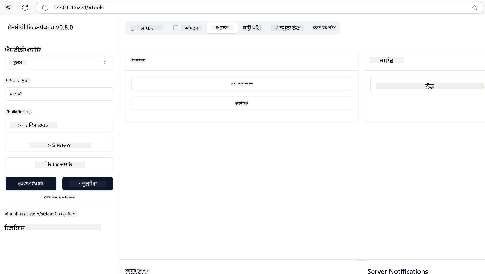
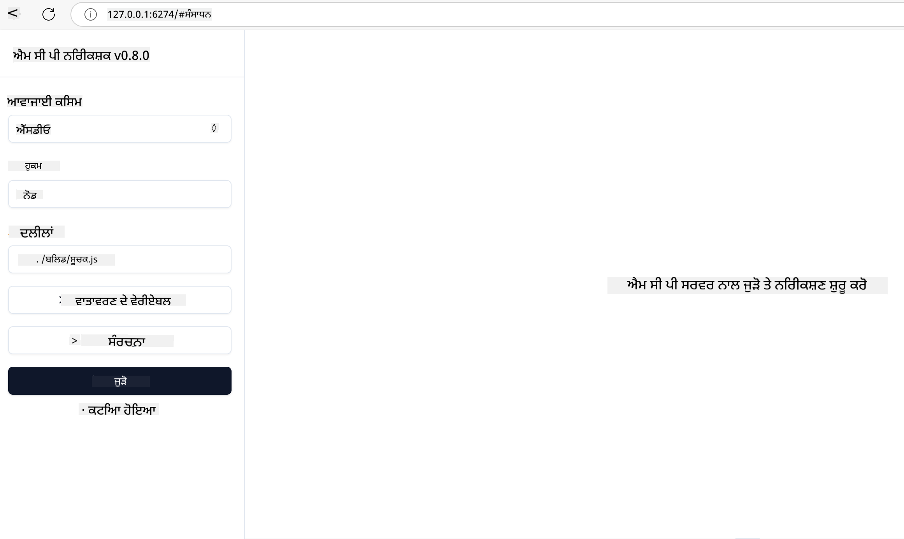
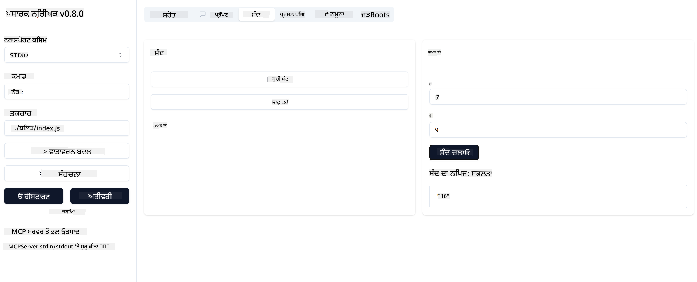

<!--
CO_OP_TRANSLATOR_METADATA:
{
  "original_hash": "5331ffd328a54b90f76706c52b673e27",
  "translation_date": "2025-05-17T08:31:05+00:00",
  "source_file": "03-GettingStarted/01-first-server/README.md",
  "language_code": "pa"
}
-->
# MCP ਨਾਲ ਸ਼ੁਰੂਆਤ ਕਰਨਾ

ਮਾਡਲ ਕੌਂਟੈਕਸਟ ਪ੍ਰੋਟੋਕੋਲ (MCP) ਨਾਲ ਤੁਹਾਡੇ ਪਹਿਲੇ ਕਦਮਾਂ ਵਿੱਚ ਤੁਹਾਡਾ ਸਵਾਗਤ ਹੈ! ਚਾਹੇ ਤੁਸੀਂ MCP ਵਿੱਚ ਨਵੇਂ ਹੋ ਜਾਂ ਇਸ ਦੀ ਸਮਝ ਨੂੰ ਗਹਿਰਾਈ ਨਾਲ ਜਾਣਨਾ ਚਾਹੁੰਦੇ ਹੋ, ਇਹ ਗਾਈਡ ਤੁਹਾਨੂੰ ਮੁੱਢਲੇ ਸੈਟਅੱਪ ਅਤੇ ਵਿਕਾਸ ਪ੍ਰਕਿਰਿਆ ਰਾਹੀਂ ਲੰਘੇਗੀ। ਤੁਸੀਂ ਜਾਣੋਗੇ ਕਿ ਕਿਵੇਂ MCP AI ਮਾਡਲਾਂ ਅਤੇ ਐਪਲੀਕੇਸ਼ਨਾਂ ਦੇ ਵਿਚਕਾਰ ਆਸਾਨ ਇੰਟਿਗ੍ਰੇਸ਼ਨ ਨੂੰ ਯਕੀਨੀ ਬਣਾਉਂਦਾ ਹੈ, ਅਤੇ ਸਿੱਖੋਗੇ ਕਿ ਕਿਵੇਂ ਆਪਣੇ ਵਾਤਾਵਰਣ ਨੂੰ MCP ਸੰਚਾਲਿਤ ਹੱਲਾਂ ਦੀ ਨਿਰਮਾਣ ਅਤੇ ਟੈਸਟਿੰਗ ਲਈ ਤਿਆਰ ਕਰਨਾ ਹੈ।

> TLDR; ਜੇ ਤੁਸੀਂ AI ਐਪਸ ਬਣਾਉਂਦੇ ਹੋ, ਤਾਂ ਤੁਸੀਂ ਜਾਣਦੇ ਹੋ ਕਿ ਤੁਸੀਂ ਆਪਣੇ LLM (ਵੱਡੇ ਭਾਸ਼ਾ ਮਾਡਲ) ਵਿੱਚ ਟੂਲ ਅਤੇ ਹੋਰ ਸਰੋਤ ਜੋੜ ਸਕਦੇ ਹੋ, ਤਾਂ ਜੋ LLM ਹੋਰ ਗਿਆਨਵਾਨ ਬਣ ਜਾਵੇ। ਹਾਲਾਂਕਿ ਜੇ ਤੁਸੀਂ ਉਹਨਾਂ ਟੂਲਾਂ ਅਤੇ ਸਰੋਤਾਂ ਨੂੰ ਸਰਵਰ 'ਤੇ ਰੱਖਦੇ ਹੋ, ਤਾਂ ਐਪ ਅਤੇ ਸਰਵਰ ਦੀਆਂ ਸਮਰੱਥਾਵਾਂ ਕਿਸੇ ਵੀ ਕਲਾਇੰਟ ਦੁਆਰਾ LLM ਦੇ ਨਾਲ ਜਾਂ ਬਿਨਾਂ ਵਰਤੀਆਂ ਜਾ ਸਕਦੀਆਂ ਹਨ।

## ਝਲਕ

ਇਹ ਪਾਠ MCP ਵਾਤਾਵਰਣ ਸੈਟਅੱਪ ਅਤੇ ਤੁਹਾਡੀਆਂ ਪਹਿਲੀਆਂ MCP ਐਪਲੀਕੇਸ਼ਨਾਂ ਨੂੰ ਬਣਾਉਣ ਬਾਰੇ ਵਿਹੰਗੀ ਦਰਿਸ਼ਟੀ ਪ੍ਰਦਾਨ ਕਰਦਾ ਹੈ। ਤੁਸੀਂ ਸਿੱਖੋਗੇ ਕਿ ਲੋੜੀਂਦੇ ਟੂਲ ਅਤੇ ਫਰੇਮਵਰਕਸ ਕਿਵੇਂ ਸੈਟਅੱਪ ਕਰਨੇ ਹਨ, ਮੁੱਢਲੇ MCP ਸਰਵਰ ਬਣਾਉਣੇ ਹਨ, ਹੋਸਟ ਐਪਲੀਕੇਸ਼ਨਾਂ ਬਣਾਉਣੀਆਂ ਹਨ, ਅਤੇ ਤੁਹਾਡੀਆਂ ਕਾਰਗੁਜ਼ਾਰੀਆਂ ਦਾ ਟੈਸਟ ਕਰਨਾ ਹੈ।

ਮਾਡਲ ਕੌਂਟੈਕਸਟ ਪ੍ਰੋਟੋਕੋਲ (MCP) ਇੱਕ ਖੁੱਲ੍ਹਾ ਪ੍ਰੋਟੋਕੋਲ ਹੈ ਜੋ ਇਹ ਮਿਆਰੀ ਬਣਾਉਂਦਾ ਹੈ ਕਿ ਐਪਲੀਕੇਸ਼ਨਾਂ LLMs ਨੂੰ ਕਿਵੇਂ ਸੰਦਰਭ ਪ੍ਰਦਾਨ ਕਰਦੀਆਂ ਹਨ। MCP ਨੂੰ AI ਐਪਲੀਕੇਸ਼ਨਾਂ ਲਈ USB-C ਪੋਰਟ ਵਾਂਗ ਸੋਚੋ - ਇਹ AI ਮਾਡਲਾਂ ਨੂੰ ਵੱਖ-ਵੱਖ ਡਾਟਾ ਸਰੋਤਾਂ ਅਤੇ ਟੂਲਾਂ ਨਾਲ ਜੁੜਨ ਦਾ ਇੱਕ ਮਿਆਰੀਕ੍ਰਿਤ ਤਰੀਕਾ ਪ੍ਰਦਾਨ ਕਰਦਾ ਹੈ।

## ਸਿੱਖਣ ਦੇ ਲਕਸ਼

ਇਸ ਪਾਠ ਦੇ ਅੰਤ ਤੱਕ, ਤੁਸੀਂ ਇਹ ਕਰਨ ਦੇ ਯੋਗ ਹੋਵੋਗੇ:

- C#, Java, Python, TypeScript, ਅਤੇ JavaScript ਵਿੱਚ MCP ਲਈ ਵਿਕਾਸ ਵਾਤਾਵਰਣ ਸੈਟਅੱਪ ਕਰੋ
- ਕਸਟਮ ਵਿਸ਼ੇਸ਼ਤਾਵਾਂ (ਸਰੋਤ, ਪ੍ਰੋਮਪਟ, ਅਤੇ ਟੂਲ) ਨਾਲ ਮੁੱਢਲੇ MCP ਸਰਵਰ ਬਣਾਓ ਅਤੇ ਤੈਅਨਾਤ ਕਰੋ
- ਉਹ ਹੋਸਟ ਐਪਲੀਕੇਸ਼ਨ ਬਣਾਓ ਜੋ MCP ਸਰਵਰਾਂ ਨਾਲ ਜੁੜਦੇ ਹਨ
- MCP ਕਾਰਗੁਜ਼ਾਰੀਆਂ ਦਾ ਟੈਸਟ ਅਤੇ ਡਿਬੱਗ ਕਰੋ

## ਆਪਣਾ MCP ਵਾਤਾਵਰਣ ਸੈਟਅੱਪ ਕਰਨਾ

MCP ਨਾਲ ਕੰਮ ਕਰਨ ਤੋਂ ਪਹਿਲਾਂ, ਆਪਣੇ ਵਿਕਾਸ ਵਾਤਾਵਰਣ ਨੂੰ ਤਿਆਰ ਕਰਨਾ ਅਤੇ ਮੁੱਢਲੇ ਵਰਕਫਲੋ ਨੂੰ ਸਮਝਣਾ ਮਹੱਤਵਪੂਰਨ ਹੈ। ਇਹ ਭਾਗ ਤੁਹਾਨੂੰ ਇੱਕ ਸੁਚਾਰੂ ਸ਼ੁਰੂਆਤ ਲਈ ਮੁੱਢਲੇ ਸੈਟਅੱਪ ਕਦਮਾਂ ਰਾਹੀਂ ਗਾਈਡ ਕਰੇਗਾ।

### ਪੂਰਵ ਸ਼ਰਤਾਂ

MCP ਵਿਕਾਸ ਵਿੱਚ ਡੁੱਬਣ ਤੋਂ ਪਹਿਲਾਂ, ਇਹ ਯਕੀਨੀ ਬਣਾਓ ਕਿ ਤੁਹਾਡੇ ਕੋਲ:

- **ਵਿਕਾਸ ਵਾਤਾਵਰਣ**: ਤੁਹਾਡੀ ਚੁਣੀ ਗਈ ਭਾਸ਼ਾ ਲਈ (C#, Java, Python, TypeScript, ਜਾਂ JavaScript)
- **IDE/ਸੰਪਾਦਕ**: ਵਿਜੁਅਲ ਸਟੂਡਿਓ, ਵਿਜੁਅਲ ਸਟੂਡਿਓ ਕੋਡ, ਇੰਟੈਲੀਜੇ, ਈਕਲਿਪਸ, ਪਾਈਚਾਰਮ, ਜਾਂ ਕੋਈ ਵੀ ਆਧੁਨਿਕ ਕੋਡ ਸੰਪਾਦਕ
- **ਪੈਕੇਜ ਮੈਨੇਜਰ**: NuGet, Maven/Gradle, pip, ਜਾਂ npm/yarn
- **API ਕੁੰਜੀਆਂ**: ਕਿਸੇ ਵੀ AI ਸੇਵਾਵਾਂ ਲਈ ਜੋ ਤੁਸੀਂ ਆਪਣੇ ਹੋਸਟ ਐਪਲੀਕੇਸ਼ਨਾਂ ਵਿੱਚ ਵਰਤਣ ਦੀ ਯੋਜਨਾ ਬਣਾਉਂਦੇ ਹੋ

## ਮੁੱਢਲਾ MCP ਸਰਵਰ ਸਾਂਚਾ

ਇੱਕ MCP ਸਰਵਰ ਆਮ ਤੌਰ 'ਤੇ ਸ਼ਾਮਲ ਹੁੰਦਾ ਹੈ:

- **ਸਰਵਰ ਸੰਰਚਨਾ**: ਪੋਰਟ, ਪ੍ਰਮਾਣਿਕਤਾ, ਅਤੇ ਹੋਰ ਸੈਟਿੰਗਾਂ ਸੈਟਅੱਪ ਕਰੋ
- **ਸਰੋਤ**: ਡਾਟਾ ਅਤੇ ਸੰਦਰਭ ਜੋ LLMs ਨੂੰ ਉਪਲਬਧ ਕਰਵਾਏ ਗਏ ਹਨ
- **ਟੂਲ**: ਕਾਰਗੁਜ਼ਾਰੀ ਜੋ ਮਾਡਲਾਂ ਦੁਆਰਾ ਲੈਣਯੋਗ ਹੁੰਦੀ ਹੈ
- **ਪ੍ਰੋਮਪਟ**: ਪਾਠ ਨੂੰ ਤਿਆਰ ਕਰਨ ਜਾਂ ਢਾਂਚਾ ਬਣਾਉਣ ਲਈ ਖਾਕੇ

ਇੱਥੇ TypeScript ਵਿੱਚ ਇੱਕ ਸਰਲ ਉਦਾਹਰਨ ਹੈ:

```typescript
import { Server, Tool, Resource } from "@modelcontextprotocol/typescript-server-sdk";

// Create a new MCP server
const server = new Server({
  port: 3000,
  name: "Example MCP Server",
  version: "1.0.0"
});

// Register a tool
server.registerTool({
  name: "calculator",
  description: "Performs basic calculations",
  parameters: {
    expression: {
      type: "string",
      description: "The math expression to evaluate"
    }
  },
  handler: async (params) => {
    const result = eval(params.expression);
    return { result };
  }
});

// Start the server
server.start();
```

ਉਪਰੋਕਤ ਕੋਡ ਵਿੱਚ ਅਸੀਂ:

- MCP TypeScript SDK ਤੋਂ ਲੋੜੀਂਦੇ ਕਲਾਸਾਂ ਨੂੰ ਆਯਾਤ ਕਰੋ।
- ਇੱਕ ਨਵਾਂ MCP ਸਰਵਰ ਇੰਸਟੈਂਸ ਬਣਾਓ ਅਤੇ ਸੰਰਚਿਤ ਕਰੋ।
- ਇੱਕ ਕਸਟਮ ਟੂਲ (`calculator`) ਨੂੰ ਹੈਂਡਲਰ ਫੰਕਸ਼ਨ ਨਾਲ ਰਜਿਸਟਰ ਕਰੋ।
- ਆਉਣ ਵਾਲੀਆਂ MCP ਬੇਨਤੀਆਂ ਲਈ ਸੁਣਨ ਲਈ ਸਰਵਰ ਸ਼ੁਰੂ ਕਰੋ।

## ਟੈਸਟਿੰਗ ਅਤੇ ਡਿਬੱਗਿੰਗ

ਤੁਹਾਡੇ MCP ਸਰਵਰ ਦੀ ਜਾਂਚ ਕਰਨ ਤੋਂ ਪਹਿਲਾਂ, ਉਪਲਬਧ ਟੂਲਾਂ ਅਤੇ ਡਿਬੱਗਿੰਗ ਲਈ ਸਭ ਤੋਂ ਵਧੀਆ ਅਭਿਆਸਾਂ ਨੂੰ ਸਮਝਣਾ ਮਹੱਤਵਪੂਰਨ ਹੈ। ਪ੍ਰਭਾਵਸ਼ਾਲੀ ਟੈਸਟਿੰਗ ਯਕੀਨੀ ਬਣਾਉਂਦੀ ਹੈ ਕਿ ਤੁਹਾਡਾ ਸਰਵਰ ਉਮੀਦ ਦੇ ਅਨੁਸਾਰ ਵਰਤਾਅ ਕਰਦਾ ਹੈ ਅਤੇ ਤੁਹਾਨੂੰ ਮੁੱਦਿਆਂ ਨੂੰ ਜਲਦੀ ਨਾਲ ਪਛਾਣਣ ਅਤੇ ਹੱਲ ਕਰਨ ਵਿੱਚ ਮਦਦ ਕਰਦਾ ਹੈ। ਹੇਠਾਂ ਦਿੱਤਾ ਭਾਗ ਤੁਹਾਡੀ MCP ਕਾਰਗੁਜ਼ਾਰੀ ਦੀ ਪੜਤਾਲ ਕਰਨ ਲਈ ਸਿਫਾਰਸ਼ੀ ਤਰੀਕੇ ਦਰਸਾਉਂਦਾ ਹੈ।

MCP ਤੁਹਾਨੂੰ ਆਪਣੇ ਸਰਵਰਾਂ ਦੀ ਜਾਂਚ ਅਤੇ ਡਿਬੱਗ ਕਰਨ ਵਿੱਚ ਮਦਦ ਕਰਨ ਲਈ ਟੂਲ ਪ੍ਰਦਾਨ ਕਰਦਾ ਹੈ:

- **ਇੰਸਪੈਕਟਰ ਟੂਲ**, ਇਹ ਗ੍ਰਾਫਿਕਲ ਇੰਟਰਫੇਸ ਤੁਹਾਨੂੰ ਆਪਣੇ ਸਰਵਰ ਨਾਲ ਜੁੜਨ ਅਤੇ ਆਪਣੇ ਟੂਲਾਂ, ਪ੍ਰੋਮਪਟਾਂ ਅਤੇ ਸਰੋਤਾਂ ਦੀ ਜਾਂਚ ਕਰਨ ਦੀ ਆਗਿਆ ਦਿੰਦਾ ਹੈ।
- **curl**, ਤੁਸੀਂ ਆਪਣੇ ਸਰਵਰ ਨਾਲ ਕਮਾਂਡ ਲਾਈਨ ਟੂਲ ਜਿਵੇਂ curl ਜਾਂ ਹੋਰ ਕਲਾਇੰਟਾਂ ਦੀ ਵਰਤੋਂ ਕਰਕੇ ਵੀ ਜੁੜ ਸਕਦੇ ਹੋ ਜੋ HTTP ਕਮਾਂਡ ਬਣਾਉਣ ਅਤੇ ਚਲਾਉਣ ਦੇ ਯੋਗ ਹਨ।

### MCP ਇੰਸਪੈਕਟਰ ਦੀ ਵਰਤੋਂ ਕਰਨਾ

[MCP ਇੰਸਪੈਕਟਰ](https://github.com/modelcontextprotocol/inspector) ਇੱਕ ਵਿਜ਼ੁਅਲ ਟੈਸਟਿੰਗ ਟੂਲ ਹੈ ਜੋ ਤੁਹਾਡੀ ਮਦਦ ਕਰਦਾ ਹੈ:

1. **ਸਰਵਰ ਦੀਆਂ ਸਮਰੱਥਾਵਾਂ ਦੀ ਖੋਜ ਕਰੋ**: ਉਪਲਬਧ ਸਰੋਤਾਂ, ਟੂਲਾਂ, ਅਤੇ ਪ੍ਰੋਮਪਟਾਂ ਦਾ ਸਵੈ-ਪਛਾਣ
2. **ਟੂਲ ਕਾਰਗੁਜ਼ਾਰੀ ਦੀ ਜਾਂਚ ਕਰੋ**: ਵੱਖ-ਵੱਖ ਪੈਰਾਮੀਟਰਾਂ ਦੀ ਕੋਸ਼ਿਸ਼ ਕਰੋ ਅਤੇ ਤੁਰੰਤ ਜਵਾਬ ਦੇਖੋ
3. **ਸਰਵਰ ਮੈਟਾਡੇਟਾ ਵੇਖੋ**: ਸਰਵਰ ਦੀ ਜਾਣਕਾਰੀ, ਸਕੀਮਾ, ਅਤੇ ਸੰਰਚਨਾਵਾਂ ਦੀ ਜਾਂਚ ਕਰੋ

```bash
# ex TypeScript, installing and running MCP Inspector
npx @modelcontextprotocol/inspector node build/index.js
```

ਜਦੋਂ ਤੁਸੀਂ ਉਪਰੋਕਤ ਕਮਾਂਡਾਂ ਚਲਾਉਂਦੇ ਹੋ, ਤਾਂ MCP ਇੰਸਪੈਕਟਰ ਤੁਹਾਡੇ ਬ੍ਰਾਊਜ਼ਰ ਵਿੱਚ ਇੱਕ ਸਥਾਨਕ ਵੈੱਬ ਇੰਟਰਫੇਸ ਸ਼ੁਰੂ ਕਰੇਗਾ। ਤੁਸੀਂ ਆਪਣੇ ਰਜਿਸਟਰ ਕੀਤੇ MCP ਸਰਵਰਾਂ, ਉਨ੍ਹਾਂ ਦੇ ਉਪਲਬਧ ਟੂਲਾਂ, ਸਰੋਤਾਂ, ਅਤੇ ਪ੍ਰੋਮਪਟਾਂ ਨੂੰ ਦਰਸਾਉਂਦੇ ਹੋਏ ਡੈਸ਼ਬੋਰਡ ਦੀ ਉਮੀਦ ਕਰ ਸਕਦੇ ਹੋ। ਇੰਟਰਫੇਸ ਤੁਹਾਨੂੰ ਟੂਲ ਕਾਰਗੁਜ਼ਾਰੀ ਦੀ ਇੰਟਰਐਕਟਿਵ ਜਾਂਚ ਕਰਨ, ਸਰਵਰ ਮੈਟਾਡੇਟਾ ਦੀ ਜਾਂਚ ਕਰਨ, ਅਤੇ ਤੁਰੰਤ ਜਵਾਬਾਂ ਦੇਖਣ ਦੀ ਆਗਿਆ ਦਿੰਦਾ ਹੈ, ਜੋ ਤੁਹਾਡੀਆਂ MCP ਸਰਵਰ ਕਾਰਗੁਜ਼ਾਰੀਆਂ ਦੀ ਵੈਧਤਾ ਦੀ ਜਾਂਚ ਕਰਨ ਅਤੇ ਡਿਬੱਗ ਕਰਨ ਨੂੰ ਆਸਾਨ ਬਣਾਉਂਦਾ ਹੈ।

ਇਹ ਉਹ ਸਕ੍ਰੀਨਸ਼ਾਟ ਹੈ ਜੋ ਇਹ ਦਿਖ ਸਕਦਾ ਹੈ:



## ਆਮ ਸੈਟਅੱਪ ਮੁੱਦੇ ਅਤੇ ਹੱਲ

| ਮੁੱਦਾ | ਸੰਭਾਵੀ ਹੱਲ |
|-------|-------------------|
| ਕਨੈਕਸ਼ਨ ਰਿਫਿਊਜ਼ਡ | ਜਾਂਚੋ ਕਿ ਸਰਵਰ ਚੱਲ ਰਿਹਾ ਹੈ ਅਤੇ ਪੋਰਟ ਸਹੀ ਹੈ |
| ਟੂਲ ਕਾਰਗੁਜ਼ਾਰੀ ਗਲਤੀਆਂ | ਪੈਰਾਮੀਟਰ ਵੈਧਤਾ ਅਤੇ ਗਲਤੀ ਸੰਭਾਲਣ ਦੀ ਸਮੀਖਿਆ ਕਰੋ |
| ਪ੍ਰਮਾਣਿਕਤਾ ਦੀਆਂ ਅਸਫਲਤਾਵਾਂ | API ਕੁੰਜੀਆਂ ਅਤੇ ਅਧਿਕਾਰਾਂ ਦੀ ਪੁਸ਼ਟੀ ਕਰੋ |
| ਸਕੀਮਾ ਵੈਧਤਾ ਦੀਆਂ ਗਲਤੀਆਂ | ਯਕੀਨੀ ਬਣਾਓ ਕਿ ਪੈਰਾਮੀਟਰ ਪਰਿਭਾਸ਼ਿਤ ਸਕੀਮਾ ਨਾਲ ਮੇਲ ਖਾਂਦੇ ਹਨ |
| ਸਰਵਰ ਸ਼ੁਰੂ ਨਹੀਂ ਹੋ ਰਿਹਾ | ਪੋਰਟ ਸੰਘਰਸ਼ ਜਾਂ ਗੁੰਮ ਸ਼ਰਤਾਂ ਦੀ ਜਾਂਚ ਕਰੋ |
| CORS ਗਲਤੀਆਂ | ਕ੍ਰਾਸ-ਮੂਲ ਬੇਨਤੀਆਂ ਲਈ ਸਹੀ CORS ਹੈਡਰ ਕਨਫਿਗਰ ਕਰੋ |
| ਪ੍ਰਮਾਣਿਕਤਾ ਮੁੱਦੇ | ਟੋਕਨ ਦੀ ਵੈਧਤਾ ਅਤੇ ਅਧਿਕਾਰਾਂ ਦੀ ਪੁਸ਼ਟੀ ਕਰੋ |

## ਸਥਾਨਕ ਵਿਕਾਸ

ਸਥਾਨਕ ਵਿਕਾਸ ਅਤੇ ਟੈਸਟਿੰਗ ਲਈ, ਤੁਸੀਂ ਆਪਣੇ ਕੰਪਿਊਟਰ 'ਤੇ ਸਿੱਧੇ MCP ਸਰਵਰ ਚਲਾ ਸਕਦੇ ਹੋ:

1. **ਸਰਵਰ ਪ੍ਰਕਿਰਿਆ ਸ਼ੁਰੂ ਕਰੋ**: ਆਪਣੀ MCP ਸਰਵਰ ਐਪਲੀਕੇਸ਼ਨ ਚਲਾਓ
2. **ਨੈਟਵਰਕਿੰਗ ਸੰਰਚਿਤ ਕਰੋ**: ਯਕੀਨੀ ਬਣਾਓ ਕਿ ਸਰਵਰ ਉਮੀਦਿਤ ਪੋਰਟ 'ਤੇ ਪਹੁੰਚਯੋਗ ਹੈ
3. **ਕਲਾਇੰਟਸ ਨੂੰ ਜੁੜੋ**: ਸਥਾਨਕ ਕਨੈਕਸ਼ਨ URLs ਵਰਤੋਂ ਜਿਵੇਂ ਕਿ `http://localhost:3000`

```bash
# Example: Running a TypeScript MCP server locally
npm run start
# Server running at http://localhost:3000
```

## ਆਪਣਾ ਪਹਿਲਾ MCP ਸਰਵਰ ਬਣਾਉਣਾ

ਅਸੀਂ ਪਿਛਲੇ ਪਾਠ ਵਿੱਚ [ਕੋਰ ਸੰਕਲਪਾਂ](/01-CoreConcepts/README.md) ਦਾ ਸਮੀਖਿਆ ਕੀਤੀ ਹੈ, ਹੁਣ ਸਮਾਂ ਹੈ ਕਿ ਉਸ ਗਿਆਨ ਨੂੰ ਕੰਮ ਵਿੱਚ ਲਿਆ ਜਾਵੇ।

### ਸਰਵਰ ਕੀ ਕਰ ਸਕਦਾ ਹੈ

ਕੋਡ ਲਿਖਣ ਤੋਂ ਪਹਿਲਾਂ, ਆਓ ਆਪਣੇ ਆਪ ਨੂੰ ਯਾਦ ਕਰਵਾਈਏ ਕਿ ਸਰਵਰ ਕੀ ਕਰ ਸਕਦਾ ਹੈ:

ਇੱਕ MCP ਸਰਵਰ ਉਦਾਹਰਣ ਲਈ ਕਰ ਸਕਦਾ ਹੈ:

- ਸਥਾਨਕ ਫਾਈਲਾਂ ਅਤੇ ਡਾਟਾਬੇਸਾਂ ਤੱਕ ਪਹੁੰਚ ਕਰੋ
- ਦੂਰ-ਦੂਰ ਦੀਆਂ APIs ਨਾਲ ਜੁੜੋ
- ਗਣਨਾਵਾਂ ਕਰੋ
- ਹੋਰ ਟੂਲਾਂ ਅਤੇ ਸੇਵਾਵਾਂ ਨਾਲ ਇਕੱਠ ਕਰਨਾ
- ਇੰਟਰਐਕਸ਼ਨ ਲਈ ਉਪਭੋਗਤਾ ਇੰਟਰਫੇਸ ਪ੍ਰਦਾਨ ਕਰੋ

ਵਧੀਆ, ਹੁਣ ਜਦੋਂ ਕਿ ਅਸੀਂ ਜਾਣਦੇ ਹਾਂ ਕਿ ਅਸੀਂ ਇਸ ਲਈ ਕੀ ਕਰ ਸਕਦੇ ਹਾਂ, ਆਓ ਕੋਡਿੰਗ ਸ਼ੁਰੂ ਕਰੀਏ।

## ਅਭਿਆਸ: ਇੱਕ ਸਰਵਰ ਬਣਾਉਣਾ

ਇੱਕ ਸਰਵਰ ਬਣਾਉਣ ਲਈ, ਤੁਹਾਨੂੰ ਇਹ ਕਦਮ ਅਨੁਸਰਣੇ ਚਾਹੀਦੇ ਹਨ:

- MCP SDK ਇੰਸਟਾਲ ਕਰੋ।
- ਇੱਕ ਪ੍ਰੋਜੈਕਟ ਬਣਾਓ ਅਤੇ ਪ੍ਰੋਜੈਕਟ ਸਾਂਚਾ ਸੈਟਅੱਪ ਕਰੋ।
- ਸਰਵਰ ਕੋਡ ਲਿਖੋ।
- ਸਰਵਰ ਦੀ ਜਾਂਚ ਕਰੋ।

### -1- SDK ਇੰਸਟਾਲ ਕਰੋ

ਇਹ ਤੁਹਾਡੇ ਚੁਣੇ ਹੋਏ ਰਨਟਾਈਮ ਦੇ ਅਨੁਸਾਰ ਕੁਝ ਵੱਖਰਾ ਹੁੰਦਾ ਹੈ, ਇਸ ਲਈ ਹੇਠਾਂ ਦਿੱਤੇ ਰਨਟਾਈਮ ਵਿੱਚੋਂ ਇੱਕ ਚੁਣੋ:

### -2- ਪ੍ਰੋਜੈਕਟ ਬਣਾਓ

ਹੁਣ ਜਦੋਂ ਕਿ ਤੁਹਾਡੇ ਕੋਲ ਤੁਹਾਡਾ SDK ਇੰਸਟਾਲ ਹੋ ਗਿਆ ਹੈ, ਅਗਲੇ ਪ੍ਰੋਜੈਕਟ ਬਣਾਉਣ ਲਈ ਚਲੋ:

### -3- ਪ੍ਰੋਜੈਕਟ ਫਾਈਲਾਂ ਬਣਾਓ

### -4- ਸਰਵਰ ਕੋਡ ਬਣਾਓ

### -5- ਇੱਕ ਟੂਲ ਅਤੇ ਸਰੋਤ ਸ਼ਾਮਲ ਕਰਨਾ

ਹੇਠਾਂ ਦਿੱਤਾ ਕੋਡ ਸ਼ਾਮਲ ਕਰਕੇ ਇੱਕ ਟੂਲ ਅਤੇ ਸਰੋਤ ਸ਼ਾਮਲ ਕਰੋ:

### -6 ਅੰਤਿਮ ਕੋਡ

ਆਓ ਆਖਰੀ ਕੋਡ ਸ਼ਾਮਲ ਕਰੀਏ ਜਿਸ ਦੀ ਸਾਨੂੰ ਲੋੜ ਹੈ ਤਾਂ ਜੋ ਸਰਵਰ ਸ਼ੁਰੂ ਹੋ ਸਕੇ:

### -7- ਸਰਵਰ ਦੀ ਜਾਂਚ ਕਰੋ

ਹੇਠਾਂ ਦਿੱਤੇ ਕਮਾਂਡ ਨਾਲ ਸਰਵਰ ਸ਼ੁਰੂ ਕਰੋ:

### -8- ਇੰਸਪੈਕਟਰ ਦੀ ਵਰਤੋਂ ਕਰਕੇ ਚਲਾਓ

ਇੰਸਪੈਕਟਰ ਇੱਕ ਵਧੀਆ ਟੂਲ ਹੈ ਜੋ ਤੁਹਾਡਾ ਸਰਵਰ ਸ਼ੁਰੂ ਕਰ ਸਕਦਾ ਹੈ ਅਤੇ ਤੁਹਾਨੂੰ ਇਸ ਨਾਲ ਸੰਪਰਕ ਕਰਨ ਦੀ ਆਗਿਆ ਦਿੰਦਾ ਹੈ ਤਾਂ ਜੋ ਤੁਸੀਂ ਇਸਦੀ ਜਾਂਚ ਕਰ ਸਕੋ ਕਿ ਇਹ ਕੰਮ ਕਰਦਾ ਹੈ। ਆਓ ਇਸਨੂੰ ਸ਼ੁਰੂ ਕਰੀਏ:

> [!NOTE]
> "ਕਮਾਂਡ" ਖੇਤਰ ਵਿੱਚ ਇਹ ਵੱਖਰਾ ਦਿਖ ਸਕਦਾ ਹੈ ਕਿਉਂਕਿ ਇਸ ਵਿੱਚ ਤੁਹਾਡੇ ਵਿਸ਼ੇਸ਼ ਰਨਟਾਈਮ ਨਾਲ ਸਰਵਰ ਚਲਾਉਣ ਲਈ ਕਮਾਂਡ ਸ਼ਾਮਲ ਹੈ।

ਤੁਹਾਨੂੰ ਹੇਠਾਂ ਦਿੱਤੇ ਯੂਜ਼ਰ ਇੰਟਰਫੇਸ ਨੂੰ ਦੇਖਣਾ ਚਾਹੀਦਾ ਹੈ:



1. ਕਨੈਕਟ ਬਟਨ ਨੂੰ ਚੁਣ ਕੇ ਸਰਵਰ ਨਾਲ ਜੁੜੋ 
  ਜਦੋਂ ਤੁਸੀਂ ਸਰਵਰ ਨਾਲ ਜੁੜਦੇ ਹੋ, ਤਾਂ ਤੁਹਾਨੂੰ ਹੁਣ ਹੇਠਾਂ ਦਿੱਤਾ ਦਿਖਣਾ ਚਾਹੀਦਾ ਹੈ:

  

1. "ਟੂਲ" ਅਤੇ "listTools" ਚੁਣੋ, ਤੁਹਾਨੂੰ "ਜੋੜੋ" ਦਿਖਾਈ ਦੇਣਾ ਚਾਹੀਦਾ ਹੈ, "ਜੋੜੋ" ਨੂੰ ਚੁਣੋ ਅਤੇ ਪੈਰਾਮੀਟਰ ਮੁੱਲ ਭਰੋ।

  ਤੁਹਾਨੂੰ ਹੇਠਾਂ ਦਿੱਤਾ ਜਵਾਬ, ਯਾਨੀ "ਜੋੜੋ" ਟੂਲ ਤੋਂ ਨਤੀਜਾ ਦੇਖਣਾ ਚਾਹੀਦਾ ਹੈ:

  

ਵਧਾਈਆਂ, ਤੁਸੀਂ ਆਪਣਾ ਪਹਿਲਾ ਸਰਵਰ ਬਣਾਉਣ ਅਤੇ ਚਲਾਉਣ ਵਿੱਚ ਸਫਲ ਹੋ ਗਏ ਹੋ!

### ਅਧਿਕਾਰਤ SDKs

MCP ਕਈ ਭਾਸ਼ਾਵਾਂ ਲਈ ਅਧਿਕਾਰਤ SDK ਪ੍ਰਦਾਨ ਕਰਦਾ ਹੈ:
- [C# SDK](https://github.com/modelcontextprotocol/csharp-sdk) - ਮਾਈਕਰੋਸਾਫਟ ਦੇ ਸਹਿਯੋਗ ਨਾਲ ਰੱਖਿਆ ਗਿਆ
- [Java SDK](https://github.com/modelcontextprotocol/java-sdk) - ਸਪ੍ਰਿੰਗ AI ਦੇ ਸਹਿਯੋਗ ਨਾਲ ਰੱਖਿਆ ਗਿਆ
- [TypeScript SDK](https://github.com/modelcontextprotocol/typescript-sdk) - ਅਧਿਕਾਰਤ TypeScript ਕਾਰਗੁਜ਼ਾਰੀ
- [Python SDK](https://github.com/modelcontextprotocol/python-sdk) - ਅਧਿਕਾਰਤ Python ਕਾਰਗੁਜ਼ਾਰੀ
- [Kotlin SDK](https://github.com/modelcontextprotocol/kotlin-sdk) - ਅਧਿਕਾਰਤ Kotlin ਕਾਰਗੁਜ਼ਾਰੀ
- [Swift SDK](https://github.com/modelcontextprotocol/swift-sdk) - ਲੂਪਵਰਕ AI ਦੇ ਸਹਿਯੋਗ ਨਾਲ ਰੱਖਿਆ ਗਿਆ
- [Rust SDK](https://github.com/modelcontextprotocol/rust-sdk) - ਅਧਿਕਾਰਤ Rust ਕਾਰਗੁਜ਼ਾਰੀ

## ਮੁੱਖ ਬਿੰਦੂ

- MCP ਵਿਕਾਸ ਵਾਤਾਵਰਣ ਸੈਟਅੱਪ ਭਾਸ਼ਾ-ਵਿਸ਼ੇਸ਼ SDKs ਨਾਲ ਸਿੱਧਾ ਹੈ
- MCP ਸਰਵਰ ਬਣਾਉਣਾ ਸਪਸ਼ਟ ਸਕੀਮਾਂ ਨਾਲ ਟੂਲ ਬਣਾਉਣ ਅਤੇ ਰਜਿਸਟਰ ਕਰਨ ਨੂੰ ਸ਼ਾਮਲ ਕਰਦਾ ਹੈ
- ਟੈਸਟਿੰਗ ਅਤੇ ਡਿਬੱਗਿੰਗ ਵਿਸ਼ਵਾਸਯੋਗ MCP ਕਾਰਗੁਜ਼ਾਰੀਆਂ

**ਅਸਵੀਕਰਤਾ**:  
ਇਹ ਦਸਤਾਵੇਜ਼ AI ਅਨੁਵਾਦ ਸੇਵਾ [Co-op Translator](https://github.com/Azure/co-op-translator) ਦੀ ਵਰਤੋਂ ਕਰਕੇ ਅਨੁਵਾਦ ਕੀਤਾ ਗਿਆ ਹੈ। ਹਾਲਾਂਕਿ ਅਸੀਂ ਸਹੀ ਹੋਣ ਦੀ ਕੋਸ਼ਿਸ਼ ਕਰਦੇ ਹਾਂ, ਕਿਰਪਾ ਕਰਕੇ ਸੂਚਿਤ ਰਹੋ ਕਿ ਸਵੈਚਾਲਿਤ ਅਨੁਵਾਦਾਂ ਵਿੱਚ ਗਲਤੀਆਂ ਜਾਂ ਅਸੁਣਤੀਆਂ ਹੋ ਸਕਦੀਆਂ ਹਨ। ਇਸ ਦੀ ਮੂਲ ਭਾਸ਼ਾ ਵਿੱਚ ਮੂਲ ਦਸਤਾਵੇਜ਼ ਨੂੰ ਅਧਿਕਾਰਕ ਸਰੋਤ ਮੰਨਿਆ ਜਾਣਾ ਚਾਹੀਦਾ ਹੈ। ਮਹੱਤਵਪੂਰਨ ਜਾਣਕਾਰੀ ਲਈ, ਪੇਸ਼ੇਵਰ ਮਨੁੱਖੀ ਅਨੁਵਾਦ ਦੀ ਸਿਫਾਰਸ਼ ਕੀਤੀ ਜਾਂਦੀ ਹੈ। ਇਸ ਅਨੁਵਾਦ ਦੀ ਵਰਤੋਂ ਤੋਂ ਉਪਜਣ ਵਾਲੇ ਕਿਸੇ ਵੀ ਗਲਤ ਫਹਿਮੀ ਜਾਂ ਗਲਤ ਵਿਆਖਿਆ ਲਈ ਅਸੀਂ ਜ਼ਿੰਮੇਵਾਰ ਨਹੀਂ ਹਾਂ।