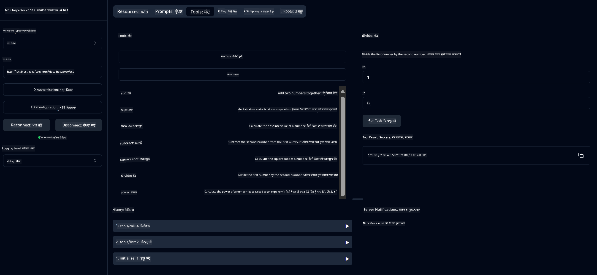

<!--
CO_OP_TRANSLATOR_METADATA:
{
  "original_hash": "ed9cab32cc67c12d8969b407aa47100a",
  "translation_date": "2025-07-13T17:53:41+00:00",
  "source_file": "03-GettingStarted/01-first-server/solution/java/README.md",
  "language_code": "pa"
}
-->
# ਬੇਸਿਕ ਕੈਲਕੁਲੇਟਰ MCP ਸਰਵਿਸ

ਇਹ ਸਰਵਿਸ ਮਾਡਲ ਕਾਂਟੈਕਸਟ ਪ੍ਰੋਟੋਕੋਲ (MCP) ਰਾਹੀਂ ਬੇਸਿਕ ਕੈਲਕੁਲੇਟਰ ਓਪਰੇਸ਼ਨਾਂ ਨੂੰ ਸਪ੍ਰਿੰਗ ਬੂਟ ਅਤੇ WebFlux ਟ੍ਰਾਂਸਪੋਰਟ ਦੀ ਵਰਤੋਂ ਨਾਲ ਪ੍ਰਦਾਨ ਕਰਦੀ ਹੈ। ਇਹ MCP ਇੰਪਲੀਮੈਂਟੇਸ਼ਨਾਂ ਬਾਰੇ ਸਿੱਖ ਰਹੇ ਸ਼ੁਰੂਆਤੀ ਲੋਕਾਂ ਲਈ ਇੱਕ ਸਧਾਰਣ ਉਦਾਹਰਨ ਵਜੋਂ ਤਿਆਰ ਕੀਤੀ ਗਈ ਹੈ।

ਹੋਰ ਜਾਣਕਾਰੀ ਲਈ, [MCP ਸਰਵਰ ਬੂਟ ਸਟਾਰਟਰ](https://docs.spring.io/spring-ai/reference/api/mcp/mcp-server-boot-starter-docs.html) ਰੈਫਰੈਂਸ ਡੌਕਯੂਮੈਂਟੇਸ਼ਨ ਵੇਖੋ।


## ਸਰਵਿਸ ਦੀ ਵਰਤੋਂ

ਸਰਵਿਸ MCP ਪ੍ਰੋਟੋਕੋਲ ਰਾਹੀਂ ਹੇਠ ਲਿਖੇ API ਐਂਡਪੌਇੰਟ ਪ੍ਰਦਾਨ ਕਰਦੀ ਹੈ:

- `add(a, b)`: ਦੋ ਨੰਬਰਾਂ ਨੂੰ ਜੋੜੋ
- `subtract(a, b)`: ਦੂਜੇ ਨੰਬਰ ਨੂੰ ਪਹਿਲੇ ਤੋਂ ਘਟਾਓ
- `multiply(a, b)`: ਦੋ ਨੰਬਰਾਂ ਨੂੰ ਗੁਣਾ ਕਰੋ
- `divide(a, b)`: ਪਹਿਲੇ ਨੰਬਰ ਨੂੰ ਦੂਜੇ ਨਾਲ ਵੰਡੋ (ਜ਼ੀਰੋ ਚੈੱਕ ਸਮੇਤ)
- `power(base, exponent)`: ਕਿਸੇ ਨੰਬਰ ਦੀ ਘਾਤ ਗਣਨਾ ਕਰੋ
- `squareRoot(number)`: ਵਰਗਮੂਲ ਕੱਢੋ (ਨਕਾਰਾਤਮਕ ਨੰਬਰ ਦੀ ਜਾਂਚ ਸਮੇਤ)
- `modulus(a, b)`: ਵੰਡਣ 'ਤੇ ਬਚਾ ਹੋਇਆ ਭਾਗ ਕੱਢੋ
- `absolute(number)`: ਮੁੱਲ ਦਾ ਪਰਮਾਣੂ ਮੁੱਲ ਕੱਢੋ

## ਡਿਪੈਂਡੈਂਸੀਜ਼

ਪ੍ਰੋਜੈਕਟ ਲਈ ਹੇਠ ਲਿਖੀਆਂ ਮੁੱਖ ਡਿਪੈਂਡੈਂਸੀਜ਼ ਦੀ ਲੋੜ ਹੈ:

```xml
<dependency>
    <groupId>org.springframework.ai</groupId>
    <artifactId>spring-ai-starter-mcp-server-webflux</artifactId>
</dependency>
```

## ਪ੍ਰੋਜੈਕਟ ਬਣਾਉਣਾ

Maven ਦੀ ਵਰਤੋਂ ਕਰਕੇ ਪ੍ਰੋਜੈਕਟ ਬਣਾਓ:
```bash
./mvnw clean install -DskipTests
```

## ਸਰਵਰ ਚਲਾਉਣਾ

### ਜਾਵਾ ਦੀ ਵਰਤੋਂ ਕਰਕੇ

```bash
java -jar target/calculator-server-0.0.1-SNAPSHOT.jar
```

### MCP ਇੰਸਪੈਕਟਰ ਦੀ ਵਰਤੋਂ ਕਰਕੇ

MCP ਇੰਸਪੈਕਟਰ MCP ਸਰਵਿਸਾਂ ਨਾਲ ਇੰਟਰਐਕਟ ਕਰਨ ਲਈ ਇੱਕ ਮਦਦਗਾਰ ਟੂਲ ਹੈ। ਇਸ ਕੈਲਕੁਲੇਟਰ ਸਰਵਿਸ ਨਾਲ ਇਸਦੀ ਵਰਤੋਂ ਕਰਨ ਲਈ:

1. **ਨਵੀਂ ਟਰਮੀਨਲ ਵਿੰਡੋ ਵਿੱਚ MCP ਇੰਸਪੈਕਟਰ ਇੰਸਟਾਲ ਅਤੇ ਚਲਾਓ**:
   ```bash
   npx @modelcontextprotocol/inspector
   ```

2. **ਐਪ ਵੱਲੋਂ ਦਿਖਾਏ ਗਏ URL 'ਤੇ ਕਲਿੱਕ ਕਰਕੇ ਵੈੱਬ UI ਤੱਕ ਪਹੁੰਚੋ** (ਆਮ ਤੌਰ 'ਤੇ http://localhost:6274)

3. **ਕਨੈਕਸ਼ਨ ਸੈੱਟ ਕਰੋ**:
   - ਟ੍ਰਾਂਸਪੋਰਟ ਕਿਸਮ "SSE" ਤੇ ਸੈੱਟ ਕਰੋ
   - URL ਨੂੰ ਆਪਣੇ ਚੱਲ ਰਹੇ ਸਰਵਰ ਦੇ SSE ਐਂਡਪੌਇੰਟ `http://localhost:8080/sse` ਤੇ ਸੈੱਟ ਕਰੋ
   - "Connect" 'ਤੇ ਕਲਿੱਕ ਕਰੋ

4. **ਟੂਲਜ਼ ਦੀ ਵਰਤੋਂ ਕਰੋ**:
   - ਉਪਲਬਧ ਕੈਲਕੁਲੇਟਰ ਓਪਰੇਸ਼ਨਾਂ ਨੂੰ ਵੇਖਣ ਲਈ "List Tools" 'ਤੇ ਕਲਿੱਕ ਕਰੋ
   - ਕਿਸੇ ਟੂਲ ਨੂੰ ਚੁਣੋ ਅਤੇ ਓਪਰੇਸ਼ਨ ਚਲਾਉਣ ਲਈ "Run Tool" 'ਤੇ ਕਲਿੱਕ ਕਰੋ



**ਅਸਵੀਕਾਰੋਪਣ**:  
ਇਹ ਦਸਤਾਵੇਜ਼ AI ਅਨੁਵਾਦ ਸੇਵਾ [Co-op Translator](https://github.com/Azure/co-op-translator) ਦੀ ਵਰਤੋਂ ਕਰਕੇ ਅਨੁਵਾਦਿਤ ਕੀਤਾ ਗਿਆ ਹੈ। ਜਦੋਂ ਕਿ ਅਸੀਂ ਸਹੀਤਾ ਲਈ ਕੋਸ਼ਿਸ਼ ਕਰਦੇ ਹਾਂ, ਕਿਰਪਾ ਕਰਕੇ ਧਿਆਨ ਰੱਖੋ ਕਿ ਸਵੈਚਾਲਿਤ ਅਨੁਵਾਦਾਂ ਵਿੱਚ ਗਲਤੀਆਂ ਜਾਂ ਅਸਮਰਥਤਾਵਾਂ ਹੋ ਸਕਦੀਆਂ ਹਨ। ਮੂਲ ਦਸਤਾਵੇਜ਼ ਆਪਣੀ ਮੂਲ ਭਾਸ਼ਾ ਵਿੱਚ ਪ੍ਰਮਾਣਿਕ ਸਰੋਤ ਮੰਨਿਆ ਜਾਣਾ ਚਾਹੀਦਾ ਹੈ। ਮਹੱਤਵਪੂਰਨ ਜਾਣਕਾਰੀ ਲਈ, ਪੇਸ਼ੇਵਰ ਮਨੁੱਖੀ ਅਨੁਵਾਦ ਦੀ ਸਿਫਾਰਸ਼ ਕੀਤੀ ਜਾਂਦੀ ਹੈ। ਅਸੀਂ ਇਸ ਅਨੁਵਾਦ ਦੀ ਵਰਤੋਂ ਤੋਂ ਉਤਪੰਨ ਕਿਸੇ ਵੀ ਗਲਤਫਹਿਮੀ ਜਾਂ ਗਲਤ ਵਿਆਖਿਆ ਲਈ ਜ਼ਿੰਮੇਵਾਰ ਨਹੀਂ ਹਾਂ।