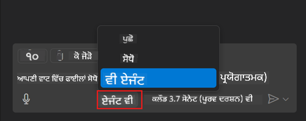
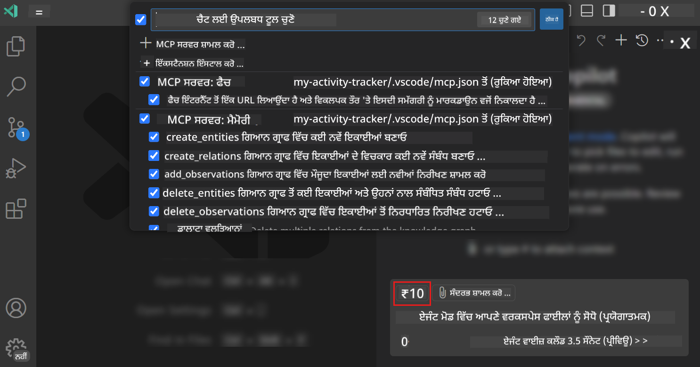
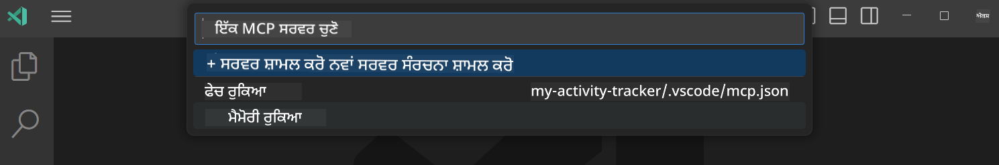
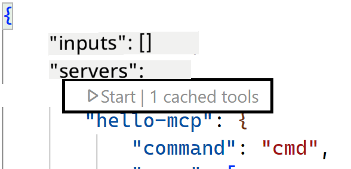
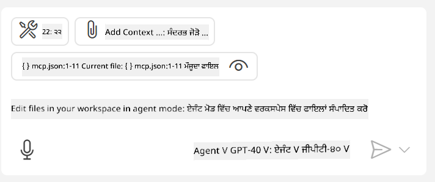
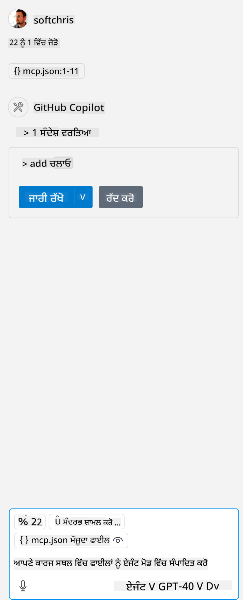

<!--
CO_OP_TRANSLATOR_METADATA:
{
  "original_hash": "d940b5e0af75e3a3a4d1c3179120d1d9",
  "translation_date": "2025-08-26T17:34:57+00:00",
  "source_file": "03-GettingStarted/04-vscode/README.md",
  "language_code": "pa"
}
-->
# ਗਿਟਹੱਬ ਕੋਪਾਇਲਟ ਏਜੰਟ ਮੋਡ ਤੋਂ ਸਰਵਰ ਦੀ ਵਰਤੋਂ

Visual Studio Code ਅਤੇ GitHub Copilot ਇੱਕ ਕਲਾਇੰਟ ਵਜੋਂ ਕੰਮ ਕਰ ਸਕਦੇ ਹਨ ਅਤੇ MCP Server ਦੀ ਵਰਤੋਂ ਕਰ ਸਕਦੇ ਹਨ। ਤੁਸੀਂ ਸੋਚ ਰਹੇ ਹੋਵੋਗੇ ਕਿ ਅਸੀਂ ਇਹ ਕਿਉਂ ਕਰਨਾ ਚਾਹੁੰਦੇ ਹਾਂ? ਖੈਰ, ਇਸਦਾ ਮਤਲਬ ਹੈ ਕਿ MCP Server ਦੇ ਜਿਹੜੇ ਵੀ ਫੀਚਰ ਹਨ, ਉਹ ਹੁਣ ਤੁਹਾਡੇ IDE ਵਿੱਚੋਂ ਵਰਤੇ ਜਾ ਸਕਦੇ ਹਨ। ਕਲਪਨਾ ਕਰੋ ਕਿ ਤੁਸੀਂ ਉਦਾਹਰਣ ਲਈ GitHub ਦਾ MCP Server ਸ਼ਾਮਲ ਕਰਦੇ ਹੋ, ਇਸ ਨਾਲ ਤੁਹਾਨੂੰ ਟਰਮੀਨਲ ਵਿੱਚ ਖਾਸ ਕਮਾਂਡਾਂ ਟਾਈਪ ਕਰਨ ਦੀ ਬਜਾਏ ਪ੍ਰੋਮਪਟਸ ਰਾਹੀਂ GitHub ਨੂੰ ਕੰਟਰੋਲ ਕਰਨ ਦੀ ਆਗਿਆ ਮਿਲੇਗੀ। ਜਾਂ ਕੁਝ ਵੀ ਜੋ ਤੁਹਾਡੇ ਡਿਵੈਲਪਰ ਅਨੁਭਵ ਨੂੰ ਸੁਧਾਰ ਸਕਦਾ ਹੈ, ਸਭ ਕੁਝ ਕੁਦਰਤੀ ਭਾਸ਼ਾ ਦੁਆਰਾ ਕੰਟਰੋਲ ਕੀਤਾ ਜਾ ਸਕਦਾ ਹੈ। ਹੁਣ ਤੁਸੀਂ ਇਸਦੇ ਫਾਇਦੇ ਨੂੰ ਸਮਝਣ ਲੱਗੇ ਹੋ, ਹੈ ਨਾ?

## ਝਲਕ

ਇਹ ਪਾਠ ਕਿਵੇਂ Visual Studio Code ਅਤੇ GitHub Copilot ਦੇ Agent ਮੋਡ ਨੂੰ ਤੁਹਾਡੇ MCP Server ਲਈ ਕਲਾਇੰਟ ਵਜੋਂ ਵਰਤਣਾ ਹੈ, ਇਸ ਬਾਰੇ ਹੈ।

## ਸਿੱਖਣ ਦੇ ਉਦੇਸ਼

ਇਸ ਪਾਠ ਦੇ ਅੰਤ ਤੱਕ, ਤੁਸੀਂ ਇਹ ਕਰਨ ਦੇ ਯੋਗ ਹੋਵੋਗੇ:

- Visual Studio Code ਰਾਹੀਂ MCP Server ਦੀ ਵਰਤੋਂ।
- GitHub Copilot ਰਾਹੀਂ ਟੂਲ ਵਰਗੀਆਂ ਸਮਰੱਥਾਵਾਂ ਚਲਾਉਣਾ।
- Visual Studio Code ਨੂੰ ਕਨਫਿਗਰ ਕਰਨਾ ਤਾਂ ਜੋ ਤੁਹਾਡੇ MCP Server ਨੂੰ ਲੱਭ ਸਕੇ ਅਤੇ ਪ੍ਰਬੰਧਿਤ ਕਰ ਸਕੇ।

## ਵਰਤੋਂ

ਤੁਸੀਂ ਆਪਣੇ MCP Server ਨੂੰ ਦੋ ਵੱਖ-ਵੱਖ ਤਰੀਕਿਆਂ ਨਾਲ ਕੰਟਰੋਲ ਕਰ ਸਕਦੇ ਹੋ:

- ਯੂਜ਼ਰ ਇੰਟਰਫੇਸ, ਤੁਸੀਂ ਇਸ ਨੂੰ ਕਿਵੇਂ ਕਰਨਾ ਹੈ ਇਸ ਅਧਿਆਇ ਵਿੱਚ ਅੱਗੇ ਦੇਖੋਗੇ।
- ਟਰਮੀਨਲ, ਟਰਮੀਨਲ ਤੋਂ `code` executable ਦੀ ਵਰਤੋਂ ਕਰਕੇ ਚੀਜ਼ਾਂ ਕੰਟਰੋਲ ਕਰਨਾ ਸੰਭਵ ਹੈ:

  ਆਪਣੇ ਯੂਜ਼ਰ ਪ੍ਰੋਫਾਈਲ ਵਿੱਚ MCP Server ਸ਼ਾਮਲ ਕਰਨ ਲਈ, --add-mcp ਕਮਾਂਡ ਲਾਈਨ ਵਿਕਲਪ ਦੀ ਵਰਤੋਂ ਕਰੋ ਅਤੇ JSON Server ਕਨਫਿਗਰੇਸ਼ਨ ਪ੍ਰਦਾਨ ਕਰੋ ਜਿਸਦਾ ਰੂਪ {\"name\":\"server-name\",\"command\":...} ਹੈ।

  ```
  code --add-mcp "{\"name\":\"my-server\",\"command\": \"uvx\",\"args\": [\"mcp-server-fetch\"]}"
  ```

### ਸਕ੍ਰੀਨਸ਼ਾਟਸ





ਚਲੋ, ਅਗਲੇ ਭਾਗਾਂ ਵਿੱਚ ਦ੍ਰਿਸ਼ਮਾਨ ਇੰਟਰਫੇਸ ਦੀ ਵਰਤੋਂ ਬਾਰੇ ਹੋਰ ਗੱਲ ਕਰਦੇ ਹਾਂ।

## ਪਹੁੰਚ

ਇਸ ਨੂੰ ਉੱਚ ਪੱਧਰ 'ਤੇ ਕਿਵੇਂ ਪਹੁੰਚਣਾ ਹੈ:

- ਇੱਕ ਫਾਈਲ ਕਨਫਿਗਰ ਕਰੋ ਤਾਂ ਜੋ ਤੁਹਾਡੇ MCP Server ਨੂੰ ਲੱਭ ਸਕੇ।
- ਸਰਵਰ ਨੂੰ ਸ਼ੁਰੂ ਕਰੋ/ਜੁੜੋ ਤਾਂ ਜੋ ਇਹ ਆਪਣੀਆਂ ਸਮਰੱਥਾਵਾਂ ਦੀ ਸੂਚੀ ਦੇ ਸਕੇ।
- GitHub Copilot Chat ਇੰਟਰਫੇਸ ਰਾਹੀਂ ਉਹ ਸਮਰੱਥਾਵਾਂ ਵਰਤੋ।

ਵਧੀਆ, ਹੁਣ ਜਦੋਂ ਅਸੀਂ ਫਲੋ ਨੂੰ ਸਮਝ ਲਿਆ ਹੈ, ਚਲੋ Visual Studio Code ਰਾਹੀਂ ਇੱਕ ਅਭਿਆਸ ਕਰਕੇ MCP Server ਦੀ ਵਰਤੋਂ ਕਰਨ ਦੀ ਕੋਸ਼ਿਸ਼ ਕਰਦੇ ਹਾਂ।

## ਅਭਿਆਸ: ਸਰਵਰ ਦੀ ਵਰਤੋਂ

ਇਸ ਅਭਿਆਸ ਵਿੱਚ, ਅਸੀਂ Visual Studio Code ਨੂੰ ਕਨਫਿਗਰ ਕਰਾਂਗੇ ਤਾਂ ਜੋ ਇਹ ਤੁਹਾਡੇ MCP Server ਨੂੰ ਲੱਭ ਸਕੇ ਅਤੇ GitHub Copilot Chat ਇੰਟਰਫੇਸ ਰਾਹੀਂ ਵਰਤਿਆ ਜਾ ਸਕੇ।

### -0- ਪਹਿਲਾ ਕਦਮ, MCP Server ਖੋਜ ਨੂੰ ਸਚੇਤ ਕਰੋ

ਤੁਹਾਨੂੰ MCP Servers ਦੀ ਖੋਜ ਨੂੰ ਸਚੇਤ ਕਰਨ ਦੀ ਲੋੜ ਹੋ ਸਕਦੀ ਹੈ।

1. Visual Studio Code ਵਿੱਚ `File -> Preferences -> Settings` ਤੇ ਜਾਓ।

1. "MCP" ਦੀ ਖੋਜ ਕਰੋ ਅਤੇ settings.json ਫਾਈਲ ਵਿੱਚ `chat.mcp.discovery.enabled` ਨੂੰ ਸਚੇਤ ਕਰੋ।

### -1- ਕਨਫਿਗਰੇਸ਼ਨ ਫਾਈਲ ਬਣਾਓ

ਆਪਣੇ ਪ੍ਰੋਜੈਕਟ ਰੂਟ ਵਿੱਚ ਇੱਕ ਕਨਫਿਗਰੇਸ਼ਨ ਫਾਈਲ ਬਣਾਉਣ ਨਾਲ ਸ਼ੁਰੂ ਕਰੋ, ਤੁਹਾਨੂੰ MCP.json ਨਾਮਕ ਫਾਈਲ ਦੀ ਲੋੜ ਹੋਵੇਗੀ ਅਤੇ ਇਸਨੂੰ .vscode ਨਾਮਕ ਫੋਲਡਰ ਵਿੱਚ ਰੱਖਣਾ ਹੋਵੇਗਾ। ਇਹ ਇਸ ਤਰ੍ਹਾਂ ਦਿਖਾਈ ਦੇਵੇਗਾ:

```text
.vscode
|-- mcp.json
```

ਅਗਲੇ, ਚਲੋ ਦੇਖਦੇ ਹਾਂ ਕਿ ਸਰਵਰ ਐਂਟਰੀ ਕਿਵੇਂ ਸ਼ਾਮਲ ਕਰਨੀ ਹੈ।

### -2- ਸਰਵਰ ਕਨਫਿਗਰ ਕਰੋ

*mcp.json* ਵਿੱਚ ਹੇਠਾਂ ਦਿੱਤਾ ਸਮੱਗਰੀ ਸ਼ਾਮਲ ਕਰੋ:

```json
{
    "inputs": [],
    "servers": {
       "hello-mcp": {
           "command": "node",
           "args": [
               "build/index.js"
           ]
       }
    }
}
```

ਇਹ ਇੱਕ ਸਧਾਰਨ ਉਦਾਹਰਣ ਹੈ ਕਿ Node.js ਵਿੱਚ ਲਿਖੇ ਸਰਵਰ ਨੂੰ ਕਿਵੇਂ ਸ਼ੁਰੂ ਕਰਨਾ ਹੈ, ਹੋਰ ਰੰਟਾਈਮ ਲਈ `command` ਅਤੇ `args` ਦੀ ਵਰਤੋਂ ਕਰਕੇ ਸਰਵਰ ਸ਼ੁਰੂ ਕਰਨ ਲਈ ਸਹੀ ਕਮਾਂਡ ਦਰਸਾਓ।

### -3- ਸਰਵਰ ਸ਼ੁਰੂ ਕਰੋ

ਹੁਣ ਜਦੋਂ ਤੁਸੀਂ ਇੱਕ ਐਂਟਰੀ ਸ਼ਾਮਲ ਕਰ ਲਈ ਹੈ, ਚਲੋ ਸਰਵਰ ਸ਼ੁਰੂ ਕਰਦੇ ਹਾਂ:

1. *mcp.json* ਵਿੱਚ ਆਪਣੀ ਐਂਟਰੀ ਲੱਭੋ ਅਤੇ ਯਕੀਨੀ ਬਣਾਓ ਕਿ "play" ਆਈਕਨ ਲੱਭੋ:

    

1. "play" ਆਈਕਨ 'ਤੇ ਕਲਿਕ ਕਰੋ, ਤੁਸੀਂ GitHub Copilot Chat ਵਿੱਚ ਟੂਲ ਆਈਕਨ ਦੇ ਉਪਲਬਧ ਟੂਲਾਂ ਦੀ ਗਿਣਤੀ ਵਿੱਚ ਵਾਧਾ ਦੇਖੋਗੇ। ਜੇ ਤੁਸੀਂ ਉਸ ਟੂਲ ਆਈਕਨ 'ਤੇ ਕਲਿਕ ਕਰਦੇ ਹੋ, ਤਾਂ ਤੁਸੀਂ ਰਜਿਸਟਰ ਕੀਤੇ ਟੂਲਾਂ ਦੀ ਸੂਚੀ ਦੇਖੋਗੇ। ਤੁਸੀਂ ਹਰ ਟੂਲ ਨੂੰ ਚੈੱਕ/ਅਨਚੈੱਕ ਕਰ ਸਕਦੇ ਹੋ ਜੇ ਤੁਸੀਂ ਚਾਹੁੰਦੇ ਹੋ ਕਿ GitHub Copilot ਉਨ੍ਹਾਂ ਨੂੰ ਸੰਦਰਭ ਵਜੋਂ ਵਰਤੇ:

  

1. ਟੂਲ ਚਲਾਉਣ ਲਈ, ਇੱਕ ਪ੍ਰੋਮਪਟ ਟਾਈਪ ਕਰੋ ਜੋ ਤੁਹਾਡੇ ਟੂਲਾਂ ਵਿੱਚੋਂ ਕਿਸੇ ਇੱਕ ਦੇ ਵੇਰਵੇ ਨਾਲ ਮੇਲ ਖਾਂਦਾ ਹੋਵੇ, ਉਦਾਹਰਣ ਲਈ ਇੱਕ ਪ੍ਰੋਮਪਟ ਇਸ ਤਰ੍ਹਾਂ "add 22 to 1":

  

  ਤੁਸੀਂ ਇੱਕ ਜਵਾਬ ਦੇਖੋਗੇ ਜੋ 23 ਦਿਖਾਉਂਦਾ ਹੈ।

## ਅਸਾਈਨਮੈਂਟ

ਆਪਣੀ *mcp.json* ਫਾਈਲ ਵਿੱਚ ਇੱਕ ਸਰਵਰ ਐਂਟਰੀ ਸ਼ਾਮਲ ਕਰਨ ਦੀ ਕੋਸ਼ਿਸ਼ ਕਰੋ ਅਤੇ ਯਕੀਨੀ ਬਣਾਓ ਕਿ ਤੁਸੀਂ ਸਰਵਰ ਨੂੰ ਸ਼ੁਰੂ/ਬੰਦ ਕਰ ਸਕਦੇ ਹੋ। ਯਕੀਨੀ ਬਣਾਓ ਕਿ ਤੁਸੀਂ GitHub Copilot Chat ਇੰਟਰਫੇਸ ਰਾਹੀਂ ਆਪਣੇ ਸਰਵਰ ਦੇ ਟੂਲਾਂ ਨਾਲ ਸੰਚਾਰ ਕਰ ਸਕਦੇ ਹੋ।

## ਹੱਲ

[Solution](./solution/README.md)

## ਮੁੱਖ ਸਿੱਖਣ

ਇਸ ਅਧਿਆਇ ਤੋਂ ਸਿੱਖਣ ਵਾਲੀਆਂ ਮੁੱਖ ਗੱਲਾਂ ਇਹ ਹਨ:

- Visual Studio Code ਇੱਕ ਸ਼ਾਨਦਾਰ ਕਲਾਇੰਟ ਹੈ ਜੋ ਤੁਹਾਨੂੰ ਕਈ MCP Servers ਅਤੇ ਉਨ੍ਹਾਂ ਦੇ ਟੂਲਾਂ ਦੀ ਵਰਤੋਂ ਕਰਨ ਦੀ ਆਗਿਆ ਦਿੰਦਾ ਹੈ।
- GitHub Copilot Chat ਇੰਟਰਫੇਸ ਉਹ ਹੈ ਜਿੱਥੇ ਤੁਸੀਂ ਸਰਵਰਾਂ ਨਾਲ ਸੰਚਾਰ ਕਰਦੇ ਹੋ।
- ਤੁਸੀਂ API keys ਵਰਗੇ ਇਨਪੁਟਸ ਲਈ ਯੂਜ਼ਰ ਨੂੰ ਪ੍ਰੋਮਪਟ ਕਰ ਸਕਦੇ ਹੋ ਜੋ MCP Server ਨੂੰ *mcp.json* ਫਾਈਲ ਵਿੱਚ ਸਰਵਰ ਐਂਟਰੀ ਕਨਫਿਗਰ ਕਰਦੇ ਸਮੇਂ ਪਾਸ ਕੀਤੇ ਜਾ ਸਕਦੇ ਹਨ।

## ਨਮੂਨੇ

- [Java Calculator](../samples/java/calculator/README.md)
- [.Net Calculator](../../../../03-GettingStarted/samples/csharp)
- [JavaScript Calculator](../samples/javascript/README.md)
- [TypeScript Calculator](../samples/typescript/README.md)
- [Python Calculator](../../../../03-GettingStarted/samples/python)

## ਵਾਧੂ ਸਰੋਤ

- [Visual Studio docs](https://code.visualstudio.com/docs/copilot/chat/mcp-servers)

## ਅਗਲਾ ਕੀ ਹੈ

- ਅਗਲਾ: [Creating a stdio Server](../05-stdio-server/README.md)

---

**ਅਸਵੀਕਰਤੀ**:  
ਇਹ ਦਸਤਾਵੇਜ਼ AI ਅਨੁਵਾਦ ਸੇਵਾ [Co-op Translator](https://github.com/Azure/co-op-translator) ਦੀ ਵਰਤੋਂ ਕਰਕੇ ਅਨੁਵਾਦ ਕੀਤਾ ਗਿਆ ਹੈ। ਜਦੋਂ ਕਿ ਅਸੀਂ ਸਹੀ ਹੋਣ ਦੀ ਕੋਸ਼ਿਸ਼ ਕਰਦੇ ਹਾਂ, ਕਿਰਪਾ ਕਰਕੇ ਧਿਆਨ ਦਿਓ ਕਿ ਸਵੈਚਾਲਿਤ ਅਨੁਵਾਦਾਂ ਵਿੱਚ ਗਲਤੀਆਂ ਜਾਂ ਅਸੁਚਤਤਾਵਾਂ ਹੋ ਸਕਦੀਆਂ ਹਨ। ਇਸ ਦੀ ਮੂਲ ਭਾਸ਼ਾ ਵਿੱਚ ਮੌਜੂਦ ਮੂਲ ਦਸਤਾਵੇਜ਼ ਨੂੰ ਅਧਿਕਾਰਤ ਸਰੋਤ ਮੰਨਿਆ ਜਾਣਾ ਚਾਹੀਦਾ ਹੈ। ਮਹੱਤਵਪੂਰਨ ਜਾਣਕਾਰੀ ਲਈ, ਪੇਸ਼ੇਵਰ ਮਨੁੱਖੀ ਅਨੁਵਾਦ ਦੀ ਸਿਫਾਰਸ਼ ਕੀਤੀ ਜਾਂਦੀ ਹੈ। ਇਸ ਅਨੁਵਾਦ ਦੀ ਵਰਤੋਂ ਤੋਂ ਪੈਦਾ ਹੋਣ ਵਾਲੇ ਕਿਸੇ ਵੀ ਗਲਤਫਹਿਮੀ ਜਾਂ ਗਲਤ ਵਿਆਖਿਆ ਲਈ ਅਸੀਂ ਜ਼ਿੰਮੇਵਾਰ ਨਹੀਂ ਹਾਂ।