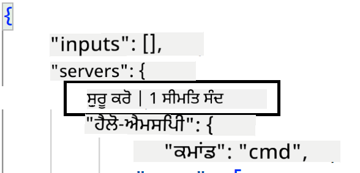
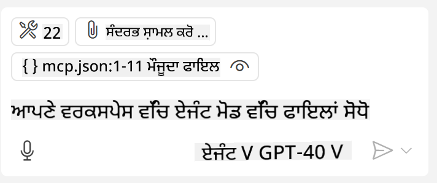
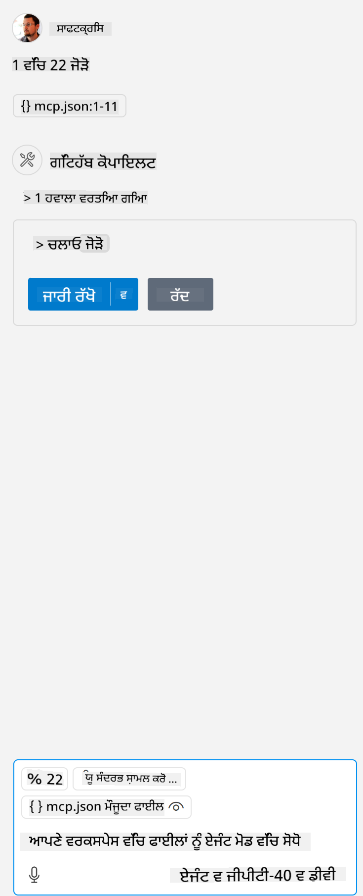

<!--
CO_OP_TRANSLATOR_METADATA:
{
  "original_hash": "c37fabfbc0dcbc9a4afb6d17e7d3be9f",
  "translation_date": "2025-05-17T11:05:51+00:00",
  "source_file": "03-GettingStarted/04-vscode/README.md",
  "language_code": "pa"
}
-->
ਆਓ ਅਗਲੇ ਭਾਗਾਂ ਵਿੱਚ ਵਿਜ਼ੂਅਲ ਇੰਟਰਫੇਸ ਦੀ ਵਰਤੋਂ ਬਾਰੇ ਹੋਰ ਗੱਲ ਕਰੀਏ।

## ਪਹੁੰਚ

ਇਹ ਹੈ ਕਿ ਸਾਨੂੰ ਇਸ ਨੂੰ ਉੱਚ-ਸਤਰ ਤੇ ਕਿਵੇਂ ਪਹੁੰਚਣਾ ਹੈ:

- ਇੱਕ ਫਾਈਲ ਸੰਰਚਿਤ ਕਰੋ ਜੇਹੜਾ ਸਾਡੇ MCP ਸਰਵਰ ਨੂੰ ਲੱਭ ਸਕੇ।
- ਕਹੇ ਸਰਵਰ ਨੂੰ ਸ਼ੁਰੂ/ਜੁੜੋ ਤਾਂ ਕਿ ਇਸ ਦੀਆਂ ਸਮਰੱਥਾਵਾਂ ਦੀ ਸੂਚੀ ਪ੍ਰਾਪਤ ਹੋ ਸਕੇ।
- GitHub Copilot ਦੇ ਚੈਟ ਇੰਟਰਫੇਸ ਦੇ ਜ਼ਰੀਏ ਉਨ੍ਹਾਂ ਸਮਰੱਥਾਵਾਂ ਦੀ ਵਰਤੋਂ ਕਰੋ।

ਵਧੀਆ, ਹੁਣ ਜਦੋਂ ਕਿ ਸਾਨੂੰ ਪ੍ਰਵਾਹ ਦੀ ਸਮਝ ਹੈ, ਆਓ Visual Studio Code ਦੇ ਜ਼ਰੀਏ ਇੱਕ MCP Server ਦੀ ਵਰਤੋਂ ਕਰਨ ਦੀ ਕੋਸ਼ਿਸ਼ ਕਰੀਏ।

## ਅਭਿਆਸ: ਸਰਵਰ ਦੀ ਵਰਤੋਂ

ਇਸ ਅਭਿਆਸ ਵਿੱਚ, ਅਸੀਂ Visual Studio Code ਨੂੰ ਕਨਫਿਗਰ ਕਰਾਂਗੇ ਤਾਂ ਕਿ ਤੁਹਾਡਾ MCP ਸਰਵਰ GitHub Copilot ਦੇ ਚੈਟ ਇੰਟਰਫੇਸ ਤੋਂ ਵਰਤਿਆ ਜਾ ਸਕੇ।

### -0- ਪੂਰਵ ਕਦਮ, MCP Server ਖੋਜ ਨੂੰ ਸਥਾਪਿਤ ਕਰੋ

ਤੁਹਾਨੂੰ MCP Servers ਦੀ ਖੋਜ ਨੂੰ ਸਥਾਪਿਤ ਕਰਨ ਦੀ ਲੋੜ ਹੋ ਸਕਦੀ ਹੈ।

1. `File -> Preferences -> Settings` in Visual Studio Code.

1. Search for "MCP" and enable `chat.mcp.discovery.enabled` ਵਿੱਚ settings.json ਫਾਈਲ ਵਿੱਚ ਜਾਓ।

### -1- ਕਨਫਿਗ ਫਾਈਲ ਬਣਾਓ

ਪਹਿਲਾਂ ਆਪਣੇ ਪ੍ਰੋਜੈਕਟ ਰੂਟ ਵਿੱਚ ਇੱਕ ਕਨਫਿਗ ਫਾਈਲ ਬਣਾਉਣ ਨਾਲ ਸ਼ੁਰੂ ਕਰੋ, ਤੁਹਾਨੂੰ MCP.json ਨਾਮਕ ਫਾਈਲ ਦੀ ਲੋੜ ਹੋਵੇਗੀ ਅਤੇ ਇਸ ਨੂੰ .vscode ਨਾਮਕ ਫੋਲਡਰ ਵਿੱਚ ਰੱਖਣਾ ਹੋਵੇਗਾ। ਇਹ ਇਸ ਤਰ੍ਹਾਂ ਦੇਖਾਈ ਦੇਵੇਗਾ:

```text
.vscode
|-- mcp.json
```

ਅਗਲੇ, ਆਓ ਦੇਖੀਏ ਕਿ ਅਸੀਂ ਕਿਵੇਂ ਸਰਵਰ ਐਂਟਰੀ ਜੋੜ ਸਕਦੇ ਹਾਂ।

### -2- ਇੱਕ ਸਰਵਰ ਸੰਰਚਿਤ ਕਰੋ

*mcp.json* ਵਿੱਚ ਹੇਠਾਂ ਦਿੱਤਾ ਸਮੱਗਰੀ ਜੋੜੋ:

```json
{
    "inputs": [],
    "servers": {
       "hello-mcp": {
           "command": "cmd",
           "args": [
               "/c", "node", "<absolute path>\\build\\index.js"
           ]
       }
    }
}
```

ਇਹ ਇੱਕ ਸਧਾਰਨ ਉਦਾਹਰਨ ਹੈ ਕਿ Node.js ਵਿੱਚ ਲਿਖੇ ਸਰਵਰ ਨੂੰ ਕਿਵੇਂ ਸ਼ੁਰੂ ਕਰਨਾ ਹੈ, ਹੋਰ ਰੰਟਾਈਮ ਲਈ ਸਰਵਰ ਨੂੰ ਸ਼ੁਰੂ ਕਰਨ ਲਈ ਸਹੀ ਕਮਾਂਡ ਦੀ ਨਿਸ਼ਾਨੀ ਦਿਖਾਓ `command` and `args` ਦੀ ਵਰਤੋਂ ਕਰਕੇ।

### -3- ਸਰਵਰ ਸ਼ੁਰੂ ਕਰੋ

ਹੁਣ ਜਦੋਂ ਤੁਸੀਂ ਇੱਕ ਐਂਟਰੀ ਜੋੜੀ ਹੈ, ਆਓ ਸਰਵਰ ਸ਼ੁਰੂ ਕਰੀਏ:

1. *mcp.json* ਵਿੱਚ ਆਪਣੀ ਐਂਟਰੀ ਲੱਭੋ ਅਤੇ "ਖੇਡੋ" ਆਈਕਨ ਨੂੰ ਲੱਭਣ ਲਈ ਯਕੀਨੀ ਬਣਾਓ:

    

1. "ਖੇਡੋ" ਆਈਕਨ ਤੇ ਕਲਿੱਕ ਕਰੋ, ਤੁਹਾਨੂੰ GitHub Copilot ਚੈਟ ਵਿੱਚ ਉਪਲਬਧ ਟੂਲਸ ਦੀ ਗਿਣਤੀ ਵਧਦੀ ਹੋਈ ਦੇਖਣੀ ਚਾਹੀਦੀ ਹੈ। ਜੇ ਤੁਸੀਂ ਕਹੇ ਟੂਲਸ ਆਈਕਨ ਤੇ ਕਲਿੱਕ ਕਰੋ, ਤੁਹਾਨੂੰ ਰਜਿਸਟਰ ਕੀਤੇ ਟੂਲਸ ਦੀ ਸੂਚੀ ਦੇਖਣੀ ਚਾਹੀਦੀ ਹੈ। ਤੁਸੀਂ ਜਾਂਚ/ਅਨਜਾਂਚ ਕਰ ਸਕਦੇ ਹੋ ਕਿ ਤੁਸੀਂ ਚਾਹੁੰਦੇ ਹੋ ਕਿ GitHub Copilot ਉਨ੍ਹਾਂ ਨੂੰ ਸੰਦਰਭ ਵਜੋਂ ਵਰਤੇ:

  

1. ਇੱਕ ਟੂਲ ਚਲਾਉਣ ਲਈ, ਇੱਕ ਪ੍ਰਾਪਟ ਦੇਣ ਲਈ ਇੱਕ ਪ੍ਰਾਪਟ ਟਾਈਪ ਕਰੋ ਜੋ ਤੁਹਾਡੇ ਟੂਲਸ ਦੇ ਵੇਰਵੇ ਨਾਲ ਮਿਲਦਾ ਹੋਵੇ, ਉਦਾਹਰਨ ਵਜੋਂ ਇੱਕ ਪ੍ਰਾਪਟ ਇਸ ਤਰ੍ਹਾਂ "22 ਨੂੰ 1 ਵਿੱਚ ਜੋੜੋ":

  

  ਤੁਹਾਨੂੰ ਇੱਕ ਜਵਾਬ ਦੇਖਣਾ ਚਾਹੀਦਾ ਹੈ ਜੋ 23 ਦੱਸਦਾ ਹੈ।

## ਅਸਾਈਨਮੈਂਟ

ਆਪਣੇ *mcp.json* ਫਾਈਲ ਵਿੱਚ ਇੱਕ ਸਰਵਰ ਐਂਟਰੀ ਜੋੜਨ ਦੀ ਕੋਸ਼ਿਸ਼ ਕਰੋ ਅਤੇ ਯਕੀਨੀ ਬਣਾਓ ਕਿ ਤੁਸੀਂ ਸਰਵਰ ਨੂੰ ਸ਼ੁਰੂ/ਰੋਕ ਸਕਦੇ ਹੋ। ਯਕੀਨੀ ਬਣਾਓ ਕਿ ਤੁਸੀਂ GitHub Copilot ਦੇ ਚੈਟ ਇੰਟਰਫੇਸ ਦੇ ਜ਼ਰੀਏ ਆਪਣੇ ਸਰਵਰ ਦੇ ਟੂਲਸ ਨਾਲ ਸੰਚਾਰ ਕਰ ਸਕਦੇ ਹੋ।

## ਹੱਲ

[ਹੱਲ](./solution/README.md)

## ਮੁੱਖ ਨਿਸ਼ਕਰਸ਼

ਇਸ ਅਧਿਆਇ ਤੋਂ ਮੁੱਖ ਨਿਸ਼ਕਰਸ਼ ਹੇਠਾਂ ਦਿੱਤੇ ਹਨ:

- Visual Studio Code ਇੱਕ ਵਧੀਆ ਕਲਾਇੰਟ ਹੈ ਜੋ ਤੁਹਾਨੂੰ ਕਈ MCP Servers ਅਤੇ ਉਨ੍ਹਾਂ ਦੇ ਟੂਲਸ ਦੀ ਵਰਤੋਂ ਕਰਨ ਦੀ ਆਗਿਆ ਦਿੰਦਾ ਹੈ।
- GitHub Copilot ਦਾ ਚੈਟ ਇੰਟਰਫੇਸ ਹੈ ਕਿ ਤੁਸੀਂ ਸਰਵਰਸ ਨਾਲ ਕਿਵੇਂ ਵਿਆਹ ਕਰਦੇ ਹੋ।
- ਤੁਸੀਂ ਉਪਭੋਗਤਾ ਤੋਂ API ਕੁੰਜੀਆਂ ਜਿਵੇਂ ਇਨਪੁਟਸ ਦੀ ਮੰਗ ਕਰ ਸਕਦੇ ਹੋ ਜੋ *mcp.json* ਫਾਈਲ ਵਿੱਚ ਸਰਵਰ ਐਂਟਰੀ ਨੂੰ ਸੰਰਚਿਤ ਕਰਦੇ ਸਮੇਂ MCP Server ਨੂੰ ਪਾਸ ਕੀਤੇ ਜਾ ਸਕਦੇ ਹਨ।

## ਨਮੂਨੇ

- [Java ਕੈਲਕੂਲੇਟਰ](../samples/java/calculator/README.md)
- [.Net ਕੈਲਕੂਲੇਟਰ](../../../../03-GettingStarted/samples/csharp)
- [JavaScript ਕੈਲਕੂਲੇਟਰ](../samples/javascript/README.md)
- [TypeScript ਕੈਲਕੂਲੇਟਰ](../samples/typescript/README.md)
- [Python ਕੈਲਕੂਲੇਟਰ](../../../../03-GettingStarted/samples/python) 

## ਵਾਧੂ ਸਰੋਤ

- [Visual Studio ਦਸਤਾਵੇਜ਼](https://code.visualstudio.com/docs/copilot/chat/mcp-servers)

## ਅਗਲਾ ਕੀ ਹੈ

- ਅਗਲਾ: [SSE Server ਬਣਾਉਣਾ](/03-GettingStarted/05-sse-server/README.md)

**ਅਸਵੀਕਤੀ**:  
ਇਹ ਦਸਤਾਵੇਜ਼ AI ਅਨੁਵਾਦ ਸੇਵਾ [Co-op Translator](https://github.com/Azure/co-op-translator) ਦੀ ਵਰਤੋਂ ਕਰਕੇ ਅਨੁਵਾਦਿਤ ਕੀਤਾ ਗਿਆ ਹੈ। ਜਦੋਂ ਕਿ ਅਸੀਂ ਸਹੀ ਹੋਣ ਦੀ ਕੋਸ਼ਿਸ਼ ਕਰਦੇ ਹਾਂ, ਕਿਰਪਾ ਕਰਕੇ ਧਿਆਨ ਦਿਓ ਕਿ ਸਵੈਚਾਲਿਤ ਅਨੁਵਾਦਾਂ ਵਿੱਚ ਗਲਤੀਆਂ ਜਾਂ ਅਸੁੱਧੀਆਂ ਹੋ ਸਕਦੀਆਂ ਹਨ। ਮੂਲ ਦਸਤਾਵੇਜ਼ ਨੂੰ ਇਸਦੀ ਮੂਲ ਭਾਸ਼ਾ ਵਿੱਚ ਅਧਿਕਾਰਤ ਸਰੋਤ ਮੰਨਿਆ ਜਾਣਾ ਚਾਹੀਦਾ ਹੈ। ਮਹੱਤਵਪੂਰਨ ਜਾਣਕਾਰੀ ਲਈ, ਪੇਸ਼ੇਵਰ ਮਨੁੱਖੀ ਅਨੁਵਾਦ ਦੀ ਸਿਫਾਰਸ਼ ਕੀਤੀ ਜਾਂਦੀ ਹੈ। ਅਸੀਂ ਇਸ ਅਨੁਵਾਦ ਦੀ ਵਰਤੋਂ ਤੋਂ ਉਪਜਣ ਵਾਲੀ ਕਿਸੇ ਵੀ ਗਲਤ ਫਹਿਮੀ ਜਾਂ ਗਲਤ ਵਿਆਖਿਆ ਲਈ ਜ਼ਿੰਮੇਵਾਰ ਨਹੀਂ ਹਾਂ।