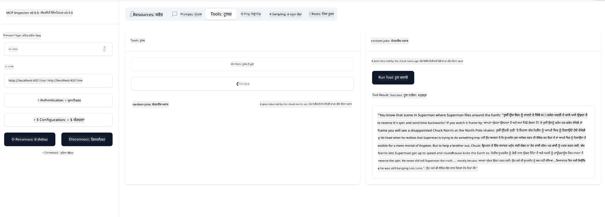

<!--
CO_OP_TRANSLATOR_METADATA:
{
  "original_hash": "64645691bf0985f1760b948123edf269",
  "translation_date": "2025-06-13T10:47:25+00:00",
  "source_file": "03-GettingStarted/05-sse-server/README.md",
  "language_code": "pa"
}
-->
ਹੁਣ ਜਦੋਂ ਕਿ ਅਸੀਂ SSE ਬਾਰੇ ਕੁਝ ਹੋਰ ਜਾਣਕਾਰੀ ਪ੍ਰਾਪਤ ਕਰ ਲਈ ਹੈ, ਆਓ ਅਗਲੇ ਕਦਮ ਵਜੋਂ ਇੱਕ SSE ਸਰਵਰ ਬਣਾਈਏ।

## ਅਭਿਆਸ: ਇੱਕ SSE ਸਰਵਰ ਬਣਾਉਣਾ

ਸਾਡੇ ਸਰਵਰ ਨੂੰ ਬਣਾਉਣ ਲਈ, ਸਾਨੂੰ ਦੋ ਗੱਲਾਂ ਦਾ ਧਿਆਨ ਰੱਖਣਾ ਪਵੇਗਾ:

- ਸਾਨੂੰ ਇੱਕ ਵੈੱਬ ਸਰਵਰ ਦੀ ਲੋੜ ਹੈ ਜੋ ਕਨੈਕਸ਼ਨ ਅਤੇ ਮੈਸੇਜ ਲਈ ਐਂਡਪੌਇੰਟ ਖੋਲ੍ਹੇ।
- ਸਾਡੇ ਸਰਵਰ ਨੂੰ ਉਸੇ ਤਰ੍ਹਾਂ ਬਣਾਉਣਾ ਹੈ ਜਿਵੇਂ ਅਸੀਂ stdio ਵਰਤਦੇ ਸਮੇਂ ਟੂਲ, ਰਿਸੋਰਸ ਅਤੇ ਪ੍ਰਾਂਪਟ ਨਾਲ ਕਰਦੇ ਸੀ।

### -1- ਸਰਵਰ ਇੰਸਟੈਂਸ ਬਣਾਉਣਾ

ਸਰਵਰ ਬਣਾਉਣ ਲਈ, ਅਸੀਂ stdio ਨਾਲ ਵਰਤੇ ਗਏ ਹੀ ਟਾਈਪ ਵਰਤਦੇ ਹਾਂ। ਪਰ ਟ੍ਰਾਂਸਪੋਰਟ ਲਈ ਸਾਨੂੰ SSE ਚੁਣਨਾ ਪਵੇਗਾ।


ਅਗਲੇ ਕਦਮ ਵਜੋਂ ਲੋੜੀਂਦੇ ਰੂਟ ਜੋੜੀਏ।

### -2- ਰੂਟ ਜੋੜਨਾ

ਆਓ ਹੁਣ ਰੂਟ ਜੋੜੀਏ ਜੋ ਕਨੈਕਸ਼ਨ ਅਤੇ ਆਉਣ ਵਾਲੇ ਮੈਸੇਜ ਨੂੰ ਹੈਂਡਲ ਕਰਦੇ ਹਨ:


ਹੁਣ ਸਰਵਰ ਦੀਆਂ ਖੂਬੀਆਂ ਜੋੜੀਏ।

### -3- ਸਰਵਰ ਦੀਆਂ ਖੂਬੀਆਂ ਜੋੜਨਾ

ਹੁਣ ਜਦੋਂ ਕਿ ਸਾਰੇ SSE-ਵਿਸ਼ੇਸ਼ ਤੱਤ ਪਰਿਭਾਸ਼ਿਤ ਹੋ ਗਏ ਹਨ, ਆਓ ਸਰਵਰ ਦੀਆਂ ਖੂਬੀਆਂ ਜਿਵੇਂ ਕਿ ਟੂਲ, ਪ੍ਰਾਂਪਟ ਅਤੇ ਰਿਸੋਰਸ ਜੋੜੀਏ।


ਤੁਹਾਡਾ ਪੂਰਾ ਕੋਡ ਇਸ ਤਰ੍ਹਾਂ ਦਿਖਾਈ ਦੇਣਾ ਚਾਹੀਦਾ ਹੈ:


ਵਧੀਆ, ਸਾਡੇ ਕੋਲ ਇੱਕ SSE ਵਰਤਦਾ ਸਰਵਰ ਹੈ, ਆਓ ਇਸਨੂੰ ਚਲਾਕੀ ਨਾਲ ਟੈਸਟ ਕਰੀਏ।

## ਅਭਿਆਸ: Inspector ਨਾਲ SSE ਸਰਵਰ ਡੀਬੱਗ ਕਰਨਾ

Inspector ਇੱਕ ਵਧੀਆ ਟੂਲ ਹੈ ਜਿਸਨੂੰ ਅਸੀਂ ਪਿਛਲੇ ਪਾਠ ਵਿੱਚ ਵੇਖਿਆ ਸੀ [Creating your first server](/03-GettingStarted/01-first-server/README.md)। ਆਓ ਦੇਖੀਏ ਕਿ ਕੀ ਅਸੀਂ ਇੱਥੇ ਵੀ Inspector ਵਰਤ ਸਕਦੇ ਹਾਂ:

### -1- Inspector ਚਲਾਉਣਾ

Inspector ਚਲਾਉਣ ਲਈ, ਤੁਹਾਡੇ ਕੋਲ ਪਹਿਲਾਂ ਇੱਕ SSE ਸਰਵਰ ਚੱਲ ਰਿਹਾ ਹੋਣਾ ਚਾਹੀਦਾ ਹੈ, ਇਸ ਲਈ ਆਓ ਪਹਿਲਾਂ ਉਹ ਕਰੀਏ:

1. ਸਰਵਰ ਚਲਾਓ


1. Inspector ਚਲਾਓ

    > ![NOTE]
    > ਇਸਨੂੰ ਉਸ ਟਰਮੀਨਲ ਵਿੰਡੋ ਤੋਂ ਵੱਖਰੇ ਟਰਮੀਨਲ ਵਿੱਚ ਚਲਾਓ ਜਿੱਥੇ ਸਰਵਰ ਚੱਲ ਰਿਹਾ ਹੈ। ਇਸਦੇ ਨਾਲ-ਨਾਲ, ਹੇਠਾਂ ਦਿੱਤਾ ਕਮਾਂਡ ਆਪਣੇ ਸਰਵਰ ਦੇ URL ਅਨੁਸਾਰ ਬਦਲੋ।

    ```sh
    npx @modelcontextprotocol/inspector --cli http://localhost:8000/sse --method tools/list
    ```

    Inspector ਚਲਾਉਣਾ ਸਾਰੇ ਰਨਟਾਈਮ ਵਿੱਚ ਇੱਕੋ ਜਿਹਾ ਹੈ। ਧਿਆਨ ਦਿਓ ਕਿ ਅਸੀਂ ਸਰਵਰ ਨੂੰ ਸਟਾਰਟ ਕਰਨ ਲਈ ਕਮਾਂਡ ਜਾਂ ਪਾਥ ਦੇਣ ਦੀ ਬਜਾਏ, ਸਰਵਰ ਦੇ ਚੱਲ ਰਹੇ URL ਨੂੰ ਦੇ ਰਹੇ ਹਾਂ ਅਤੇ `/sse` ਰੂਟ ਨੂੰ ਵੀ ਦਰਸਾ ਰਹੇ ਹਾਂ।

### -2- ਟੂਲ ਨੂੰ ਟਰਾਈ ਕਰਨਾ

SSE ਨੂੰ ਡ੍ਰੌਪਡਾਊਨ ਵਿੱਚੋਂ ਚੁਣੋ ਅਤੇ ਉਸ URL ਨੂੰ ਭਰੋ ਜਿੱਥੇ ਤੁਹਾਡਾ ਸਰਵਰ ਚੱਲ ਰਿਹਾ ਹੈ, ਉਦਾਹਰਨ ਵਜੋਂ http:localhost:4321/sse। ਹੁਣ "Connect" ਬਟਨ 'ਤੇ ਕਲਿੱਕ ਕਰੋ। ਪਹਿਲਾਂ ਵਾਂਗ, ਟੂਲਾਂ ਦੀ ਲਿਸਟ ਕਰੋ, ਕੋਈ ਟੂਲ ਚੁਣੋ ਅਤੇ ਇਨਪੁੱਟ ਵੈਲਿਊਜ਼ ਦਿਓ। ਤੁਹਾਨੂੰ ਹੇਠਾਂ ਦਿੱਤਾ ਨਤੀਜਾ ਵੇਖਣ ਨੂੰ ਮਿਲੇਗਾ:



ਵਧੀਆ, ਤੁਸੀਂ Inspector ਨਾਲ ਕੰਮ ਕਰ ਸਕਦੇ ਹੋ, ਆਓ ਦੇਖੀਏ ਕਿ ਅਸੀਂ Visual Studio Code ਨਾਲ ਕਿਵੇਂ ਕੰਮ ਕਰ ਸਕਦੇ ਹਾਂ।

## ਅਸਾਈਨਮੈਂਟ

ਆਪਣੇ ਸਰਵਰ ਨੂੰ ਹੋਰ ਖੂਬੀਆਂ ਨਾਲ ਬਣਾਉਣ ਦੀ ਕੋਸ਼ਿਸ਼ ਕਰੋ। ਉਦਾਹਰਨ ਵਜੋਂ [ਇਸ ਪੰਨੇ](https://api.chucknorris.io/) ਨੂੰ ਵੇਖੋ ਤਾਂ ਜੋ ਤੁਸੀਂ ਕੋਈ ਐਸਾ ਟੂਲ ਜੋੜ ਸਕੋ ਜੋ API ਨੂੰ ਕਾਲ ਕਰਦਾ ਹੋਵੇ, ਤੁਹਾਨੂੰ ਫੈਸਲਾ ਕਰਨਾ ਹੈ ਕਿ ਸਰਵਰ ਕਿਵੇਂ ਬਣਨਾ ਚਾਹੀਦਾ ਹੈ। ਮਜ਼ੇ ਕਰੋ :)

## ਹੱਲ

[Solution](./solution/README.md) ਇੱਥੇ ਇੱਕ ਸੰਭਵ ਹੱਲ ਹੈ ਜਿਸ ਵਿੱਚ ਕੰਮ ਕਰਨ ਵਾਲਾ ਕੋਡ ਦਿੱਤਾ ਗਿਆ ਹੈ।

## ਮੁੱਖ ਗੱਲਾਂ

ਇਸ ਅਧਿਆਇ ਤੋਂ ਸਿੱਖਣ ਵਾਲੀਆਂ ਮੁੱਖ ਗੱਲਾਂ ਹਨ:

- SSE stdio ਦੇ ਨਾਲ ਦੂਜਾ ਸਮਰਥਿਤ ਟ੍ਰਾਂਸਪੋਰਟ ਹੈ।
- SSE ਨੂੰ ਸਮਰਥਨ ਦੇਣ ਲਈ, ਤੁਹਾਨੂੰ ਆਉਣ ਵਾਲੀਆਂ ਕਨੈਕਸ਼ਨਾਂ ਅਤੇ ਮੈਸੇਜਾਂ ਨੂੰ ਵੈੱਬ ਫਰੇਮਵਰਕ ਦੀ ਵਰਤੋਂ ਕਰਕੇ ਮੈਨੇਜ ਕਰਨਾ ਪੈਂਦਾ ਹੈ।
- ਤੁਸੀਂ Inspector ਅਤੇ Visual Studio Code ਦੋਹਾਂ ਨੂੰ SSE ਸਰਵਰ ਨੂੰ ਵਰਤਣ ਲਈ ਵਰਤ ਸਕਦੇ ਹੋ, ਬਿਲਕੁਲ stdio ਸਰਵਰਾਂ ਵਾਂਗ। ਧਿਆਨ ਦਿਓ ਕਿ stdio ਅਤੇ SSE ਵਿੱਚ ਕੁਝ ਫਰਕ ਹੈ। SSE ਲਈ, ਤੁਹਾਨੂੰ ਸਰਵਰ ਨੂੰ ਅਲੱਗ ਤੌਰ 'ਤੇ ਸਟਾਰਟ ਕਰਨਾ ਪੈਂਦਾ ਹੈ ਅਤੇ ਫਿਰ Inspector ਟੂਲ ਚਲਾਉਣਾ ਪੈਂਦਾ ਹੈ। Inspector ਟੂਲ ਵਿੱਚ ਵੀ ਕੁਝ ਫਰਕ ਹਨ, ਜਿਵੇਂ ਕਿ ਤੁਹਾਨੂੰ URL ਦਰਸਾਉਣਾ ਪੈਂਦਾ ਹੈ।

## ਨਮੂਨੇ

- [Java Calculator](../samples/java/calculator/README.md)
- [.Net Calculator](../../../../03-GettingStarted/samples/csharp)
- [JavaScript Calculator](../samples/javascript/README.md)
- [TypeScript Calculator](../samples/typescript/README.md)
- [Python Calculator](../../../../03-GettingStarted/samples/python) 

## ਵਾਧੂ ਸਰੋਤ

- [SSE](https://developer.mozilla.org/en-US/docs/Web/API/Server-sent_events)

## ਅਗਲਾ ਕੀ ਹੈ

- ਅਗਲਾ: [HTTP Streaming with MCP (Streamable HTTP)](/03-GettingStarted/06-http-streaming/README.md)

**ਅਸਵੀਕਾਰੋਥਾ**:  
ਇਹ ਦਸਤਾਵੇਜ਼ AI ਅਨੁਵਾਦ ਸੇਵਾ [Co-op Translator](https://github.com/Azure/co-op-translator) ਦੀ ਵਰਤੋਂ ਕਰਕੇ ਅਨੁਵਾਦਿਤ ਕੀਤਾ ਗਿਆ ਹੈ। ਜਦੋਂ ਕਿ ਅਸੀਂ ਸਹੀਅਤਾ ਲਈ ਕੋਸ਼ਿਸ਼ ਕਰਦੇ ਹਾਂ, ਕਿਰਪਾ ਕਰਕੇ ਧਿਆਨ ਰੱਖੋ ਕਿ ਸਵੈਚਾਲਿਤ ਅਨੁਵਾਦਾਂ ਵਿੱਚ ਗਲਤੀਆਂ ਜਾਂ ਅਸਹੀਤੀਆਂ ਹੋ ਸਕਦੀਆਂ ਹਨ। ਮੂਲ ਦਸਤਾਵੇਜ਼ ਆਪਣੇ ਮੂਲ ਭਾਸ਼ਾ ਵਿੱਚ ਪ੍ਰਮਾਣਿਕ ਸਰੋਤ ਵਜੋਂ ਮੰਨਿਆ ਜਾਣਾ ਚਾਹੀਦਾ ਹੈ। ਮਹੱਤਵਪੂਰਨ ਜਾਣਕਾਰੀ ਲਈ, ਪੇਸ਼ੇਵਰ ਮਨੁੱਖੀ ਅਨੁਵਾਦ ਦੀ ਸਿਫਾਰਸ਼ ਕੀਤੀ ਜਾਂਦੀ ਹੈ। ਅਸੀਂ ਇਸ ਅਨੁਵਾਦ ਦੀ ਵਰਤੋਂ ਤੋਂ ਉਤਪੰਨ ਕਿਸੇ ਵੀ ਗਲਤਫਹਿਮੀ ਜਾਂ ਗਲਤ ਵਿਆਖਿਆ ਲਈ ਜ਼ਿੰਮੇਵਾਰ ਨਹੀਂ ਹਾਂ।