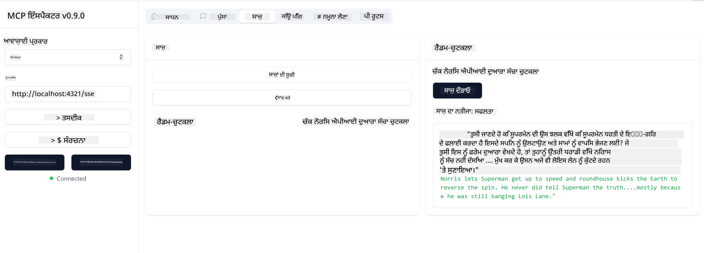

<!--
CO_OP_TRANSLATOR_METADATA:
{
  "original_hash": "0a8086dc4bf89448f83e7936db972c42",
  "translation_date": "2025-05-17T11:32:24+00:00",
  "source_file": "03-GettingStarted/05-sse-server/README.md",
  "language_code": "pa"
}
-->
# SSE ਸਰਵਰ

SSE (ਸਰਵਰ ਸੈਂਟ ਇਵੈਂਟਸ) ਸਰਵਰ-ਤੋਂ-ਕਲਾਇੰਟ ਸਟ੍ਰੀਮਿੰਗ ਲਈ ਇੱਕ ਮਿਆਰ ਹੈ, ਜੋ ਸਰਵਰਾਂ ਨੂੰ HTTP ਰਾਹੀਂ ਕਲਾਇੰਟਾਂ ਨੂੰ ਰੀਅਲ-ਟਾਈਮ ਅਪਡੇਟ ਭੇਜਣ ਦੀ ਆਗਿਆ ਦਿੰਦਾ ਹੈ। ਇਹ ਖਾਸ ਤੌਰ 'ਤੇ ਉਹਨਾਂ ਐਪਲੀਕੇਸ਼ਨਾਂ ਲਈ ਲਾਭਕਾਰੀ ਹੈ ਜਿਨ੍ਹਾਂ ਨੂੰ ਲਾਈਵ ਅਪਡੇਟ ਦੀ ਲੋੜ ਹੈ, ਜਿਵੇਂ ਕਿ ਚੈਟ ਐਪਲੀਕੇਸ਼ਨ, ਨੋਟੀਫਿਕੇਸ਼ਨ, ਜਾਂ ਰੀਅਲ-ਟਾਈਮ ਡਾਟਾ ਫੀਡ। ਇਸ ਤੋਂ ਇਲਾਵਾ, ਤੁਹਾਡਾ ਸਰਵਰ ਕਈ ਕਲਾਇੰਟਾਂ ਦੁਆਰਾ ਇੱਕੇ ਸਮੇਂ 'ਤੇ ਵਰਤਿਆ ਜਾ ਸਕਦਾ ਹੈ ਕਿਉਂਕਿ ਇਹ ਇੱਕ ਸਰਵਰ 'ਤੇ ਰਹਿੰਦਾ ਹੈ ਜੋ ਉਦਾਹਰਣ ਵਜੋਂ ਕਿਤੇ ਵੀ ਕਲਾਊਡ ਵਿੱਚ ਚਲਾਇਆ ਜਾ ਸਕਦਾ ਹੈ।

## ਝਲਕ

ਇਹ ਪਾਠ SSE ਸਰਵਰ ਬਣਾਉਣ ਅਤੇ ਖਪਤ ਕਰਨ ਦੇ ਢੰਗ ਨੂੰ ਕਵਰ ਕਰਦਾ ਹੈ।

## ਸਿੱਖਣ ਦੇ ਲਕਸ਼

ਇਸ ਪਾਠ ਦੇ ਅੰਤ ਤੱਕ, ਤੁਸੀਂ ਇਹ ਕਰਨ ਦੇ ਯੋਗ ਹੋਵੋਗੇ:

- ਇੱਕ SSE ਸਰਵਰ ਬਣਾਉਣਾ।
- ਇੰਸਪੈਕਟਰ ਦੀ ਵਰਤੋਂ ਕਰਦੇ ਹੋਏ ਇੱਕ SSE ਸਰਵਰ ਨੂੰ ਡਿਬਗ ਕਰਨਾ।
- Visual Studio Code ਦੀ ਵਰਤੋਂ ਕਰਦੇ ਹੋਏ ਇੱਕ SSE ਸਰਵਰ ਨੂੰ ਖਪਤ ਕਰਨਾ।

## SSE, ਇਹ ਕਿਵੇਂ ਕੰਮ ਕਰਦਾ ਹੈ

SSE ਦੋ ਸਮਰਥਿਤ ਟ੍ਰਾਂਸਪੋਰਟ ਕਿਸਮਾਂ ਵਿੱਚੋਂ ਇੱਕ ਹੈ। ਤੁਸੀਂ ਪਹਿਲਾਂ ਦੇ ਪਾਠਾਂ ਵਿੱਚ ਪਹਿਲੀ stdio ਨੂੰ ਵਰਤਦੇ ਹੋਏ ਦੇਖ ਚੁੱਕੇ ਹੋ। ਫਰਕ ਇਹ ਹੈ:

- SSE ਨੂੰ ਤੁਹਾਡੇ ਤੋਂ ਦੋ ਚੀਜ਼ਾਂ ਸੰਭਾਲਣ ਦੀ ਲੋੜ ਹੈ ਕਨੈਕਸ਼ਨ ਅਤੇ ਸੁਨੇਹੇ।
- ਕਿਉਂਕਿ ਇਹ ਇੱਕ ਸਰਵਰ ਹੈ ਜੋ ਕਿਤੇ ਵੀ ਰਹਿ ਸਕਦਾ ਹੈ, ਤੁਹਾਨੂੰ ਇਹ ਜਰੂਰੀ ਹੈ ਕਿ ਤੁਸੀਂ ਇੰਸਪੈਕਟਰ ਅਤੇ Visual Studio ਵਰਗੇ ਸੰਦਾਂ ਨਾਲ ਕੰਮ ਕਰਨ ਦਾ ਢੰਗ ਦਰਸਾਉਣ। ਇਸ ਦਾ ਮਤਲਬ ਹੈ ਕਿ ਤੁਸੀਂ ਸਰਵਰ ਨੂੰ ਕਿਵੇਂ ਸ਼ੁਰੂ ਕਰਨਾ ਹੈ, ਇਹ ਦਰਸਾਉਣ ਦੀ ਬਜਾਏ ਤੁਸੀਂ ਉਸ ਐਂਡਪੋਇੰਟ ਨੂੰ ਦਰਸਾਉਂਦੇ ਹੋ ਜਿੱਥੇ ਇਹ ਕਨੈਕਸ਼ਨ ਸਥਾਪਿਤ ਕਰ ਸਕਦਾ ਹੈ। ਹੇਠਾਂ ਦਿੱਤੇ ਉਦਾਹਰਣ ਕੋਡ ਨੂੰ ਵੇਖੋ:
ਤੁਸੀਂ ਅਕਤੂਬਰ 2023 ਤੱਕ ਡਾਟਾ 'ਤੇ ਪ੍ਰਸ਼ਿਕਸ਼ਿਤ ਹੋ।

ਹੁਣ ਜਦੋਂ ਕਿ ਅਸੀਂ SSE ਬਾਰੇ ਕੁਝ ਹੋਰ ਜਾਣ ਲਿਆ ਹੈ, ਚਲੋ ਅਗਲੇ ਪੜਾਅ ਵਿੱਚ SSE ਸਰਵਰ ਬਣਾਈਏ।

## ਅਭਿਆਸ: ਇੱਕ SSE ਸਰਵਰ ਬਣਾਉਣਾ

ਸਾਡਾ ਸਰਵਰ ਬਣਾਉਣ ਲਈ, ਸਾਨੂੰ ਦੋ ਚੀਜ਼ਾਂ ਨੂੰ ਯਾਦ ਰੱਖਣ ਦੀ ਲੋੜ ਹੈ:

- ਸਾਨੂੰ ਕਨੈਕਸ਼ਨ ਅਤੇ ਸੁਨੇਹਿਆਂ ਲਈ ਐਂਡਪੋਇੰਟ ਉਘਾੜਨ ਲਈ ਇੱਕ ਵੈੱਬ ਸਰਵਰ ਦੀ ਵਰਤੋਂ ਕਰਨ ਦੀ ਲੋੜ ਹੈ।
- ਸਾਡੇ ਸਰਵਰ ਨੂੰ ਉਸੇ ਤਰ੍ਹਾਂ ਬਣਾਓ ਜਿਵੇਂ ਅਸੀਂ ਸਧਾਰਨ ਤੌਰ 'ਤੇ ਸੰਦਾਂ, ਸਰੋਤਾਂ ਅਤੇ ਪ੍ਰੰਪਟਾਂ ਦੇ ਨਾਲ stdio ਦੀ ਵਰਤੋਂ ਕਰਦੇ ਸਮੇਂ ਕਰਦੇ ਸੀ।

### -1- ਇੱਕ ਸਰਵਰ ਇੰਸਟੈਂਸ ਬਣਾਓ

ਸਾਡੇ ਸਰਵਰ ਨੂੰ ਬਣਾਉਣ ਲਈ, ਅਸੀਂ stdio ਦੇ ਨਾਲ ਉਹੀ ਕਿਸਮਾਂ ਦੀ ਵਰਤੋਂ ਕਰਦੇ ਹਾਂ। ਹਾਲਾਂਕਿ, ਟ੍ਰਾਂਸਪੋਰਟ ਲਈ, ਸਾਨੂੰ SSE ਚੁਣਨਾ ਪਵੇਗਾ।

ਚਲੋ ਅਗਲੇ ਪੜਾਅ ਵਿੱਚ ਲੋੜੀਂਦੇ ਰਸਤੇ ਜੋੜੀਏ।

### -2- ਰਸਤੇ ਜੋੜੋ

ਚਲੋ ਅਗਲੇ ਪੜਾਅ ਵਿੱਚ ਰਸਤੇ ਜੋੜੀਏ ਜੋ ਕਨੈਕਸ਼ਨ ਅਤੇ ਆਉਣ ਵਾਲੇ ਸੁਨੇਹਿਆਂ ਨੂੰ ਸੰਭਾਲਦੇ ਹਨ:

### -3- ਸਰਵਰ ਸਮਰੱਥਾਵਾਂ ਜੋੜਨਾ

ਹੁਣ ਜਦੋਂ ਕਿ ਅਸੀਂ ਹਰ ਚੀਜ਼ SSE ਖਾਸ ਤੌਰ 'ਤੇ ਪਰਿਭਾਸ਼ਿਤ ਕਰ ਲਈ ਹੈ, ਚਲੋ ਸਰਵਰ ਸਮਰੱਥਾਵਾਂ ਜੋੜੀਏ ਜਿਵੇਂ ਕਿ ਸੰਦ, ਪ੍ਰੰਪਟ ਅਤੇ ਸਰੋਤ।

ਤੁਹਾਡਾ ਪੂਰਾ ਕੋਡ ਇਸ ਤਰ੍ਹਾਂ ਦੇਖਣਾ ਚਾਹੀਦਾ ਹੈ:

ਵਧੀਆ, ਅਸੀਂ SSE ਵਰਤਦੇ ਹੋਏ ਇੱਕ ਸਰਵਰ ਹੈ, ਚਲੋ ਅਗਲੇ ਪੜਾਅ ਵਿੱਚ ਇਸ ਨੂੰ ਅਜ਼ਮਾਈਏ।

## ਅਭਿਆਸ: ਇੰਸਪੈਕਟਰ ਨਾਲ ਇੱਕ SSE ਸਰਵਰ ਨੂੰ ਡਿਬਗ ਕਰਨਾ

ਇੰਸਪੈਕਟਰ ਇੱਕ ਵਧੀਆ ਸੰਦ ਹੈ ਜਿਸ ਨੂੰ ਅਸੀਂ ਪਿਛਲੇ ਪਾਠ ਵਿੱਚ ਦੇਖਿਆ ਸੀ [ਤੁਹਾਡਾ ਪਹਿਲਾ ਸਰਵਰ ਬਣਾਉਣਾ](/03-GettingStarted/01-first-server/README.md)। ਆਓ ਵੇਖੀਏ ਕਿ ਅਸੀਂ ਇੱਥੇ ਵੀ ਇੰਸਪੈਕਟਰ ਦੀ ਵਰਤੋਂ ਕਰ ਸਕਦੇ ਹਾਂ ਕਿ ਨਹੀਂ:

### -1- ਇੰਸਪੈਕਟਰ ਚਲਾਉਣਾ

ਇੰਸਪੈਕਟਰ ਚਲਾਉਣ ਲਈ, ਤੁਹਾਡੇ ਕੋਲ ਪਹਿਲਾਂ ਇੱਕ SSE ਸਰਵਰ ਚੱਲ ਰਿਹਾ ਹੋਣਾ ਚਾਹੀਦਾ ਹੈ, ਇਸ ਲਈ ਚਲੋ ਅਗਲੇ ਪੜਾਅ ਵਿੱਚ ਇਹ ਕਰੋ:

1. ਸਰਵਰ ਚਲਾਓ

1. ਇੰਸਪੈਕਟਰ ਚਲਾਓ

    > ![NOTE]
    > ਇਹ ਸਰਵਰ ਚੱਲ ਰਹੇ ਟਰਮੀਨਲ ਵਿੰਡੋ ਤੋਂ ਵੱਖਰੀ ਵਿੰਡੋ ਵਿੱਚ ਚਲਾਓ। ਇਹ ਵੀ ਨੋਟ ਕਰੋ, ਤੁਹਾਨੂੰ ਹੇਠਾਂ ਦਿੱਤੇ ਕਮਾਂਡ ਨੂੰ ਉਸ URL ਦੇ ਅਨੁਕੂਲ ਢੰਗ ਨਾਲ ਸੈੱਟ ਕਰਨ ਦੀ ਲੋੜ ਹੈ ਜਿੱਥੇ ਤੁਹਾਡਾ ਸਰਵਰ ਚੱਲ ਰਿਹਾ ਹੈ।

    ```sh
    npx @modelcontextprotocol/inspector --cli http://localhost:8000/sse --method tools/list
    ```

    ਇੰਸਪੈਕਟਰ ਚਲਾਉਣਾ ਸਾਰੇ ਰਨਟਾਈਮ ਵਿੱਚ ਇੱਕੋ ਜਿਹਾ ਦਿਖਾਈ ਦਿੰਦਾ ਹੈ। ਨੋਟ ਕਰੋ ਕਿ ਅਸੀਂ ਆਪਣੇ ਸਰਵਰ ਦੇ ਰਸਤੇ ਨੂੰ ਪਾਸ ਕਰਨ ਅਤੇ ਸਰਵਰ ਨੂੰ ਸ਼ੁਰੂ ਕਰਨ ਲਈ ਕਮਾਂਡ ਦੇਣ ਦੀ ਬਜਾਏ ਅਸੀਂ ਉਸ URL ਨੂੰ ਪਾਸ ਕਰਦੇ ਹਾਂ ਜਿੱਥੇ ਸਰਵਰ ਚੱਲ ਰਿਹਾ ਹੈ ਅਤੇ ਅਸੀਂ `/sse` ਰਸਤੇ ਨੂੰ ਵੀ ਨਿਰਧਾਰਤ ਕਰਦੇ ਹਾਂ।

### -2- ਸੰਦ ਦੀ ਕੋਸ਼ਿਸ਼ ਕਰਨਾ

ਸਰਵਰ ਨੂੰ ਕਨੈਕਟ ਕਰੋ, ਡ੍ਰਾਪਡਾਊਨ ਵਿੱਚੋਂ SSE ਚੁਣੋ ਅਤੇ ਉਸ URL ਖੇਤਰ ਨੂੰ ਭਰੋ ਜਿੱਥੇ ਤੁਹਾਡਾ ਸਰਵਰ ਚੱਲ ਰਿਹਾ ਹੈ, ਉਦਾਹਰਣ ਲਈ http:localhost:4321/sse। ਹੁਣ "ਕਨੈਕਟ" ਬਟਨ 'ਤੇ ਕਲਿਕ ਕਰੋ। ਪਹਿਲਾਂ ਵਾਂਗ, ਸੰਦਾਂ ਦੀ ਸੂਚੀ ਚੁਣੋ, ਇੱਕ ਸੰਦ ਚੁਣੋ ਅਤੇ ਇੰਪੁਟ ਮੁੱਲ ਪ੍ਰਦਾਨ ਕਰੋ। ਤੁਹਾਨੂੰ ਹੇਠਾਂ ਦਿੱਤੇ ਵਰਗਾ ਨਤੀਜਾ ਵੇਖਣਾ ਚਾਹੀਦਾ ਹੈ:



ਵਧੀਆ, ਤੁਸੀਂ ਇੰਸਪੈਕਟਰ ਨਾਲ ਕੰਮ ਕਰਨ ਦੇ ਯੋਗ ਹੋ, ਚਲੋ ਵੇਖੀਏ ਕਿ ਅਸੀਂ Visual Studio Code ਨਾਲ ਕਿਵੇਂ ਕੰਮ ਕਰ ਸਕਦੇ ਹਾਂ।

## ਅਸਾਈਨਮੈਂਟ

ਆਪਣੇ ਸਰਵਰ ਨੂੰ ਹੋਰ ਸਮਰੱਥਾਵਾਂ ਨਾਲ ਬਣਾਉਣ ਦੀ ਕੋਸ਼ਿਸ਼ ਕਰੋ। [ਇਹ ਪੰਨਾ](https://api.chucknorris.io/) ਵੇਖੋ ਉਦਾਹਰਣ ਲਈ ਇੱਕ ਸੰਦ ਜੋੜਨ ਲਈ ਜੋ ਇੱਕ API ਨੂੰ ਕਾਲ ਕਰਦਾ ਹੈ, ਤੁਸੀਂ ਫੈਸਲਾ ਕਰੋ ਕਿ ਸਰਵਰ ਕਿਵੇਂ ਦਿਖਣਾ ਚਾਹੀਦਾ ਹੈ। ਮਜ਼ੇ ਕਰੋ :)

## ਹੱਲ

[ਹੱਲ](./solution/README.md) ਇੱਥੇ ਇੱਕ ਸੰਭਾਵੀ ਹੱਲ ਹੈ ਜਿਸ ਵਿੱਚ ਕੰਮ ਕਰਦਾ ਕੋਡ ਹੈ।

## ਮੁੱਖ ਸਿੱਖਣ

ਇਸ ਅਧਿਆਇ ਤੋਂ ਸਿੱਖਣ ਵਾਲੀਆਂ ਗੱਲਾਂ ਇਹ ਹਨ:

- SSE stdio ਦੇ ਨਾਲ ਦੂਜਾ ਸਮਰਥਿਤ ਟ੍ਰਾਂਸਪੋਰਟ ਹੈ।
- SSE ਨੂੰ ਸਮਰਥਨ ਦੇਣ ਲਈ, ਤੁਹਾਨੂੰ ਇੱਕ ਵੈੱਬ ਫਰੇਮਵਰਕ ਦੀ ਵਰਤੋਂ ਕਰਦੇ ਹੋਏ ਆਉਣ ਵਾਲੀਆਂ ਕਨੈਕਸ਼ਨਾਂ ਅਤੇ ਸੁਨੇਹਿਆਂ ਦਾ ਪ੍ਰਬੰਧਨ ਕਰਨ ਦੀ ਲੋੜ ਹੈ।
- ਤੁਸੀਂ ਇੰਸਪੈਕਟਰ ਅਤੇ Visual Studio Code ਦੋਵਾਂ ਦੀ ਵਰਤੋਂ ਕਰਕੇ SSE ਸਰਵਰ ਦੀ ਖਪਤ ਕਰ ਸਕਦੇ ਹੋ, ਬਿਲਕੁਲ stdio ਸਰਵਰਾਂ ਵਾਂਗ। ਨੋਟ ਕਰੋ ਕਿ ਇਹ stdio ਅਤੇ SSE ਵਿੱਚ ਥੋੜ੍ਹਾ ਫਰਕ ਹੈ। SSE ਲਈ, ਤੁਹਾਨੂੰ ਸਰਵਰ ਨੂੰ ਵੱਖਰੇ ਤੌਰ 'ਤੇ ਸ਼ੁਰੂ ਕਰਨ ਦੀ ਲੋੜ ਹੈ ਅਤੇ ਫਿਰ ਆਪਣਾ ਇੰਸਪੈਕਟਰ ਸੰਦ ਚਲਾਓ। ਇੰਸਪੈਕਟਰ ਸੰਦ ਲਈ, ਕੁਝ ਫਰਕ ਵੀ ਹੈ ਕਿ ਤੁਹਾਨੂੰ URL ਨਿਰਧਾਰਤ ਕਰਨ ਦੀ ਲੋੜ ਹੈ।

## ਨਮੂਨੇ

- [ਜਾਵਾ ਕੈਲਕੁਲੇਟਰ](../samples/java/calculator/README.md)
- [.Net ਕੈਲਕੁਲੇਟਰ](../../../../03-GettingStarted/samples/csharp)
- [ਜਾਵਾਸਕ੍ਰਿਪਟ ਕੈਲਕੁਲੇਟਰ](../samples/javascript/README.md)
- [ਟਾਈਪਸਕ੍ਰਿਪਟ ਕੈਲਕੁਲੇਟਰ](../samples/typescript/README.md)
- [ਪਾਈਥਨ ਕੈਲਕੁਲੇਟਰ](../../../../03-GettingStarted/samples/python)

## ਵਾਧੂ ਸਰੋਤ

- [SSE](https://developer.mozilla.org/en-US/docs/Web/API/Server-sent_events)

## ਅਗਲਾ ਕੀ ਹੈ

- ਅਗਲਾ: [VSCode ਲਈ AI ਟੂਲਕਿਟ ਨਾਲ ਸ਼ੁਰੂਆਤ ਕਰਨਾ](/03-GettingStarted/06-aitk/README.md)

**ਛੁਟਕਾਰਾ**:  
ਇਹ ਦਸਤਾਵੇਜ਼ AI ਅਨੁਵਾਦ ਸੇਵਾ [Co-op Translator](https://github.com/Azure/co-op-translator) ਦੀ ਵਰਤੋਂ ਕਰਕੇ ਅਨੁਵਾਦ ਕੀਤਾ ਗਿਆ ਹੈ। ਹਾਲਾਂਕਿ ਅਸੀਂ ਸਹੀਅਤ ਲਈ ਕੋਸ਼ਿਸ਼ ਕਰਦੇ ਹਾਂ, ਕਿਰਪਾ ਕਰਕੇ ਧਿਆਨ ਵਿੱਚ ਰੱਖੋ ਕਿ ਸਵੈਚਾਲਿਤ ਅਨੁਵਾਦਾਂ ਵਿੱਚ ਗਲਤੀਆਂ ਜਾਂ ਅਸੁਚਿਤਤਾਵਾਂ ਹੋ ਸਕਦੀਆਂ ਹਨ। ਇਸ ਦੀ ਮੂਲ ਭਾਸ਼ਾ ਵਿੱਚ ਮੂਲ ਦਸਤਾਵੇਜ਼ ਨੂੰ ਅਧਿਕਾਰਕ ਸਰੋਤ ਮੰਨਿਆ ਜਾਣਾ ਚਾਹੀਦਾ ਹੈ। ਸੰਵੇਦਨਸ਼ੀਲ ਜਾਣਕਾਰੀ ਲਈ, ਪੇਸ਼ੇਵਰ ਮਨੁੱਖੀ ਅਨੁਵਾਦ ਦੀ ਸਿਫਾਰਸ਼ ਕੀਤੀ ਜਾਂਦੀ ਹੈ। ਇਸ ਅਨੁਵਾਦ ਦੀ ਵਰਤੋਂ ਤੋਂ ਪੈਦਾ ਹੋਣ ਵਾਲੇ ਕਿਸੇ ਵੀ ਗਲਤ ਫਹਿਮੀ ਜਾਂ ਗਲਤ ਵਿਆਖਿਆ ਲਈ ਅਸੀਂ ਜ਼ਿੰਮੇਵਾਰ ਨਹੀਂ ਹਾਂ।