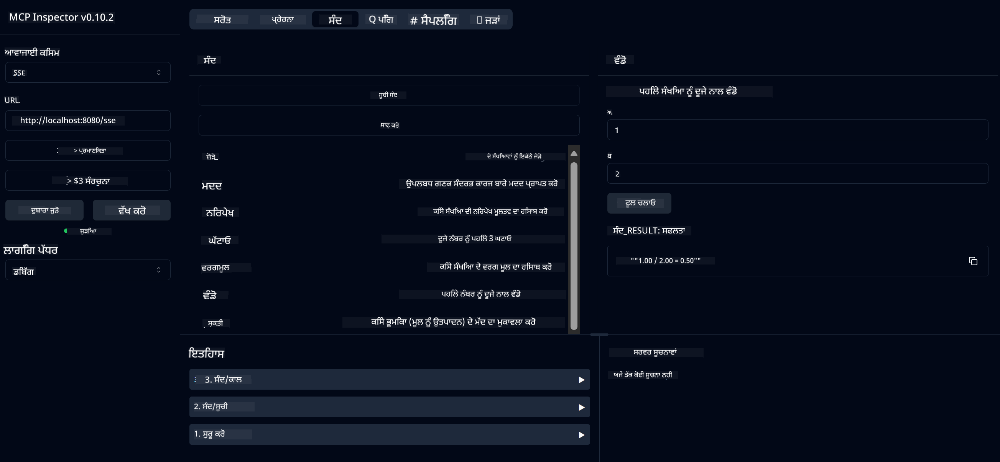

<!--
CO_OP_TRANSLATOR_METADATA:
{
  "original_hash": "13231e9951b68efd9df8c56bd5cdb27e",
  "translation_date": "2025-05-17T13:09:11+00:00",
  "source_file": "03-GettingStarted/samples/java/calculator/README.md",
  "language_code": "pa"
}
-->
# ਬੇਸਿਕ ਕੈਲਕੂਲੇਟਰ MCP ਸੇਵਾ

ਇਹ ਸੇਵਾ ਮਾਡਲ ਕੰਟੈਕਸਟ ਪ੍ਰੋਟੋਕੋਲ (MCP) ਰਾਹੀਂ ਬੇਸਿਕ ਕੈਲਕੂਲੇਟਰ ਕਾਰਜਾਂ ਪ੍ਰਦਾਨ ਕਰਦੀ ਹੈ, ਜੋ ਕਿ Spring Boot ਨਾਲ WebFlux ਟ੍ਰਾਂਸਪੋਰਟ ਦੀ ਵਰਤੋਂ ਕਰਦੀ ਹੈ। ਇਹ ਨਵੀਂ ਸਿਖਾਈ ਜਾ ਰਹੀ MCP ਲਾਗੂ ਕਰਨ ਦੀ ਸਮਝ ਲਈ ਸਧਾਰਨ ਉਦਾਹਰਣ ਵਜੋਂ ਤਿਆਰ ਕੀਤਾ ਗਿਆ ਹੈ।

ਹੋਰ ਜਾਣਕਾਰੀ ਲਈ, [MCP Server Boot Starter](https://docs.spring.io/spring-ai/reference/api/mcp/mcp-server-boot-starter-docs.html) ਸੰਬੰਧਿਤ ਦਸਤਾਵੇਜ਼ ਦੇਖੋ।

## ਝਲਕ

ਸੇਵਾ ਇਹ ਦਰਸਾਉਂਦੀ ਹੈ:
- SSE (ਸਰਵਰ-ਭੇਜੇ ਗਟਨਾ) ਲਈ ਸਹਾਇਤਾ
- Spring AI ਦੀ `@Tool` ਐਨੋਟੇਸ਼ਨ ਦੀ ਵਰਤੋਂ ਕਰਕੇ ਸਵੈਚਾਲਕ ਸਾਧਨ ਰਜਿਸਟਰੇਸ਼ਨ
- ਬੇਸਿਕ ਕੈਲਕੂਲੇਟਰ ਫੰਕਸ਼ਨ:
  - ਜੋੜ, ਘਟਾਓ, ਗੁਣਾ, ਵੰਡ
  - ਪਾਵਰ ਗਣਨਾ ਅਤੇ ਵਰਗਮੂਲ
  - ਮੋਡਯੂਲਸ (ਬਾਕੀ) ਅਤੇ ਪਰਮAbsoluteਮੂਲ
  - ਕਾਰਜ ਵੇਰਵੇ ਲਈ ਸਹਾਇਕ ਫੰਕਸ਼ਨ

## ਵਿਸ਼ੇਸ਼ਤਾਵਾਂ

ਇਹ ਕੈਲਕੂਲੇਟਰ ਸੇਵਾ ਹੇਠਾਂ ਦਿੱਤੀਆਂ ਯੋਗਤਾਵਾਂ ਪ੍ਰਦਾਨ ਕਰਦੀ ਹੈ:

1. **ਮੁੱਢਲੇ ਅੰਕਗਣਿਤ ਕਾਰਜ**:
   - ਦੋ ਨੰਬਰਾਂ ਦਾ ਜੋੜ
   - ਇੱਕ ਨੰਬਰ ਨੂੰ ਦੂਜੇ ਤੋਂ ਘਟਾਉਣਾ
   - ਦੋ ਨੰਬਰਾਂ ਦਾ ਗੁਣਾ
   - ਇੱਕ ਨੰਬਰ ਨੂੰ ਦੂਜੇ ਨਾਲ ਵੰਡਣਾ (ਜ਼ੀਰੋ ਵੰਡ ਚੈੱਕ ਨਾਲ)

2. **ਅਗਰਗਾਮੀ ਕਾਰਜ**:
   - ਪਾਵਰ ਗਣਨਾ (ਬੇਸ ਨੂੰ ਉਚਾਰਨ ਤੇ ਚੁੱਕਣਾ)
   - ਵਰਗਮੂਲ ਗਣਨਾ (ਨਕਾਰਾਤਮਕ ਨੰਬਰ ਚੈੱਕ ਨਾਲ)
   - ਮੋਡਯੂਲਸ (ਬਾਕੀ) ਗਣਨਾ
   - ਪਰਮAbsoluteਮੂਲ ਗਣਨਾ

3. **ਸਹਾਇਕ ਸਿਸਟਮ**:
   - ਸਾਰੇ ਉਪਲਬਧ ਕਾਰਜਾਂ ਦੀ ਵਿਆਖਿਆ ਕਰਨ ਵਾਲੀ ਅੰਦਰੂਨੀ ਸਹਾਇਕ ਫੰਕਸ਼ਨ

## ਸੇਵਾ ਦੀ ਵਰਤੋਂ ਕਰਨਾ

ਸੇਵਾ MCP ਪ੍ਰੋਟੋਕੋਲ ਰਾਹੀਂ ਹੇਠਾਂ ਦਿੱਤੇ API ਅੰਤ ਬਿੰਦੂ ਉਘਾੜਦੀ ਹੈ:

- `add(a, b)`: ਦੋ ਨੰਬਰਾਂ ਨੂੰ ਇਕੱਠੇ ਜੋੜੋ
- `subtract(a, b)`: ਦੂਜੇ ਨੰਬਰ ਨੂੰ ਪਹਿਲੇ ਤੋਂ ਘਟਾਓ
- `multiply(a, b)`: ਦੋ ਨੰਬਰਾਂ ਨੂੰ ਗੁਣਾ ਕਰੋ
- `divide(a, b)`: ਪਹਿਲੇ ਨੰਬਰ ਨੂੰ ਦੂਜੇ ਨਾਲ ਵੰਡੋ (ਜ਼ੀਰੋ ਚੈੱਕ ਨਾਲ)
- `power(base, exponent)`: ਨੰਬਰ ਦੀ ਪਾਵਰ ਗਣਨਾ ਕਰੋ
- `squareRoot(number)`: ਵਰਗਮੂਲ ਗਣਨਾ ਕਰੋ (ਨਕਾਰਾਤਮਕ ਨੰਬਰ ਚੈੱਕ ਨਾਲ)
- `modulus(a, b)`: ਵੰਡਨ ਵੇਲੇ ਬਾਕੀ ਦੀ ਗਣਨਾ ਕਰੋ
- `absolute(number)`: ਪਰਮAbsoluteਮੂਲ ਦੀ ਗਣਨਾ ਕਰੋ
- `help()`: ਉਪਲਬਧ ਕਾਰਜਾਂ ਬਾਰੇ ਜਾਣਕਾਰੀ ਪ੍ਰਾਪਤ ਕਰੋ

## ਟੈਸਟ ਕਲਾਇੰਟ

`com.microsoft.mcp.sample.client` ਪੈਕੇਜ ਵਿੱਚ ਇੱਕ ਸਧਾਰਨ ਟੈਸਟ ਕਲਾਇੰਟ ਸ਼ਾਮਲ ਹੈ। `SampleCalculatorClient` ਕਲਾਸ ਕੈਲਕੂਲੇਟਰ ਸੇਵਾ ਦੇ ਉਪਲਬਧ ਕਾਰਜਾਂ ਨੂੰ ਦਰਸਾਉਂਦੀ ਹੈ।

## LangChain4j ਕਲਾਇੰਟ ਦੀ ਵਰਤੋਂ ਕਰਨਾ

ਪਰਜੈਕਟ ਵਿੱਚ `com.microsoft.mcp.sample.client.LangChain4jClient` ਵਿੱਚ ਇੱਕ LangChain4j ਉਦਾਹਰਣ ਕਲਾਇੰਟ ਸ਼ਾਮਲ ਹੈ ਜੋ ਦਰਸਾਉਂਦਾ ਹੈ ਕਿ ਕਿਵੇਂ LangChain4j ਅਤੇ GitHub ਮਾਡਲਾਂ ਨਾਲ ਕੈਲਕੂਲੇਟਰ ਸੇਵਾ ਨੂੰ ਜੋੜਨਾ ਹੈ:

### ਪੂਰਵ ਸ਼ਰਤਾਂ

1. **GitHub Token ਸੈਟਅਪ**:
   
   GitHub ਦੇ AI ਮਾਡਲਾਂ (ਜਿਵੇਂ phi-4) ਦੀ ਵਰਤੋਂ ਕਰਨ ਲਈ, ਤੁਹਾਨੂੰ GitHub ਵਿਅਕਤੀਗਤ ਪਹੁੰਚ ਟੋਕਨ ਦੀ ਜ਼ਰੂਰਤ ਹੈ:

   a. ਆਪਣੇ GitHub ਖਾਤੇ ਸੈਟਿੰਗਸ 'ਤੇ ਜਾਓ: https://github.com/settings/tokens
   
   b. "Generate new token" → "Generate new token (classic)" 'ਤੇ ਕਲਿਕ ਕਰੋ
   
   c. ਆਪਣੇ ਟੋਕਨ ਨੂੰ ਇੱਕ ਵਿਆਖਿਆਤਮਕ ਨਾਮ ਦਿਓ
   
   d. ਹੇਠਾਂ ਦਿੱਤੇ ਸਕੋਪ ਚੁਣੋ:
      - `repo` (ਪ੍ਰਾਈਵੇਟ ਰਿਪੋਜ਼ਿਟਰੀਜ਼ ਦਾ ਪੂਰਾ ਕੰਟਰੋਲ)
      - `read:org` (ਸੰਗਠਨ ਅਤੇ ਟੀਮ ਮੈਂਬਰਸ਼ਿਪ ਪੜ੍ਹੋ, ਸੰਗਠਨ ਪ੍ਰਾਜੈਕਟ ਪੜ੍ਹੋ)
      - `gist` (ਗਿਸਟ ਬਣਾਓ)
      - `user:email` (ਯੂਜ਼ਰ ਈਮੇਲ ਪਤੇ (ਕੇਵਲ-ਪੜ੍ਹੋ) ਤੱਕ ਪਹੁੰਚ)

   e. "Generate token" 'ਤੇ ਕਲਿਕ ਕਰੋ ਅਤੇ ਆਪਣੇ ਨਵੇਂ ਟੋਕਨ ਨੂੰ ਕਾਪੀ ਕਰੋ
   
   f. ਇਸਨੂੰ ਵਾਤਾਵਰਣ ਚਰ 'ਤੇ ਸੈਟ ਕਰੋ:
      
      Windows 'ਤੇ:
      ```
      set GITHUB_TOKEN=your-github-token
      ```
      
      macOS/Linux 'ਤੇ:
      ```bash
      export GITHUB_TOKEN=your-github-token
      ```

   g. ਸਥਾਈ ਸੈਟਅਪ ਲਈ, ਆਪਣੇ ਵਾਤਾਵਰਣ ਚਰਾਂ ਵਿੱਚ ਸਿਸਟਮ ਸੈਟਿੰਗਸ ਰਾਹੀਂ ਸ਼ਾਮਲ ਕਰੋ

2. ਆਪਣੇ ਪਰਜੈਕਟ ਵਿੱਚ LangChain4j GitHub ਨਿਰਭਰਤਾ ਸ਼ਾਮਲ ਕਰੋ (ਜੋ ਪਹਿਲਾਂ ਹੀ pom.xml ਵਿੱਚ ਸ਼ਾਮਲ ਹੈ):
   ```xml
   <dependency>
       <groupId>dev.langchain4j</groupId>
       <artifactId>langchain4j-github</artifactId>
       <version>${langchain4j.version}</version>
   </dependency>
   ```

3. ਯਕੀਨੀ ਬਣਾਓ ਕਿ ਕੈਲਕੂਲੇਟਰ ਸਰਵਰ `localhost:8080` 'ਤੇ ਚੱਲ ਰਿਹਾ ਹੈ

### LangChain4j ਕਲਾਇੰਟ ਚਲਾਉਣਾ

ਇਹ ਉਦਾਹਰਣ ਦਰਸਾਉਂਦੀ ਹੈ:
- SSE ਟ੍ਰਾਂਸਪੋਰਟ ਰਾਹੀਂ ਕੈਲਕੂਲੇਟਰ MCP ਸਰਵਰ ਨਾਲ ਕਨੈਕਟ ਹੋਣਾ
- LangChain4j ਦੀ ਵਰਤੋਂ ਕਰਕੇ ਇੱਕ ਚੈਟ ਬੋਟ ਬਣਾਉਣਾ ਜੋ ਕਿ ਕੈਲਕੂਲੇਟਰ ਕਾਰਜਾਂ ਦੀ ਵਰਤੋਂ ਕਰਦਾ ਹੈ
- GitHub AI ਮਾਡਲਾਂ ਨਾਲ ਇਕਠੇ ਹੋਣਾ (ਹੁਣ phi-4 ਮਾਡਲ ਦੀ ਵਰਤੋਂ ਕਰ ਰਿਹਾ ਹੈ)

ਕਲਾਇੰਟ ਹੇਠਾਂ ਦਿੱਤੇ ਨਮੂਨਾ ਪੁੱਛਗਿੱਛਾਂ ਨੂੰ ਭੇਜਦਾ ਹੈ ਜੋ ਕਾਰਜਸ਼ੀਲਤਾ ਨੂੰ ਦਰਸਾਉਂਦਾ ਹੈ:
1. ਦੋ ਨੰਬਰਾਂ ਦਾ ਜੋੜ ਗਣਨਾ ਕਰਨਾ
2. ਇੱਕ ਨੰਬਰ ਦਾ ਵਰਗਮੂਲ ਲੱਭਣਾ
3. ਉਪਲਬਧ ਕੈਲਕੂਲੇਟਰ ਕਾਰਜਾਂ ਬਾਰੇ ਸਹਾਇਕ ਜਾਣਕਾਰੀ ਪ੍ਰਾਪਤ ਕਰਨਾ

ਉਦਾਹਰਣ ਚਲਾਓ ਅਤੇ ਕਨਸੋਲ ਆਉਟਪੁੱਟ ਦੀ ਜਾਂਚ ਕਰੋ ਕਿ AI ਮਾਡਲ ਕਿਵੇਂ ਕੈਲਕੂਲੇਟਰ ਸਾਧਨਾਂ ਦੀ ਵਰਤੋਂ ਕਰਕੇ ਪੁੱਛਗਿੱਛਾਂ ਦਾ ਜਵਾਬ ਦਿੰਦਾ ਹੈ।

### GitHub ਮਾਡਲ ਕਨਫਿਗਰੇਸ਼ਨ

LangChain4j ਕਲਾਇੰਟ GitHub ਦੇ phi-4 ਮਾਡਲ ਦੀ ਵਰਤੋਂ ਕਰਨ ਲਈ ਹੇਠਾਂ ਦਿੱਤੇ ਸੈਟਿੰਗਸ ਨਾਲ ਕਨਫਿਗਰ ਕੀਤਾ ਗਿਆ ਹੈ:

```java
ChatLanguageModel model = GitHubChatModel.builder()
    .apiKey(System.getenv("GITHUB_TOKEN"))
    .timeout(Duration.ofSeconds(60))
    .modelName("phi-4")
    .logRequests(true)
    .logResponses(true)
    .build();
```

ਵੱਖ-ਵੱਖ GitHub ਮਾਡਲਾਂ ਦੀ ਵਰਤੋਂ ਕਰਨ ਲਈ, ਸਿਰਫ `modelName` ਪੈਰਾਮੀਟਰ ਨੂੰ ਕਿਸੇ ਹੋਰ ਸਮਰਥਿਤ ਮਾਡਲ 'ਤੇ ਬਦਲੋ (ਜਿਵੇਂ "claude-3-haiku-20240307", "llama-3-70b-8192", ਆਦਿ)।

## ਨਿਰਭਰਤਾਵਾਂ

ਪਰਜੈਕਟ ਹੇਠਾਂ ਦਿੱਤੀਆਂ ਮੁੱਖ ਨਿਰਭਰਤਾਵਾਂ ਦੀ ਲੋੜ ਹੈ:

```xml
<!-- For MCP Server -->
<dependency>
    <groupId>org.springframework.ai</groupId>
    <artifactId>spring-ai-starter-mcp-server-webflux</artifactId>
</dependency>

<!-- For LangChain4j integration -->
<dependency>
    <groupId>dev.langchain4j</groupId>
    <artifactId>langchain4j-mcp</artifactId>
    <version>${langchain4j.version}</version>
</dependency>

<!-- For GitHub models support -->
<dependency>
    <groupId>dev.langchain4j</groupId>
    <artifactId>langchain4j-github</artifactId>
    <version>${langchain4j.version}</version>
</dependency>
```

## ਪਰਜੈਕਟ ਬਣਾਉਣਾ

ਪਰਜੈਕਟ ਨੂੰ Maven ਦੀ ਵਰਤੋਂ ਕਰਕੇ ਬਣਾਓ:
```bash
./mvnw clean install -DskipTests
```

## ਸਰਵਰ ਚਲਾਉਣਾ

### ਜਾਵਾ ਦੀ ਵਰਤੋਂ ਕਰਕੇ

```bash
java -jar target/calculator-server-0.0.1-SNAPSHOT.jar
```

### MCP Inspector ਦੀ ਵਰਤੋਂ ਕਰਨਾ

MCP Inspector MCP ਸੇਵਾਵਾਂ ਨਾਲ ਇੰਟਰਐਕਟ ਕਰਨ ਲਈ ਇੱਕ ਮਦਦਗਾਰ ਸਾਧਨ ਹੈ। ਇਸ ਕੈਲਕੂਲੇਟਰ ਸੇਵਾ ਨਾਲ ਇਸਦੀ ਵਰਤੋਂ ਕਰਨ ਲਈ:

1. **ਨਵੇਂ ਟਰਮੀਨਲ ਵਿੰਡੋ ਵਿੱਚ MCP Inspector ਨੂੰ ਇੰਸਟਾਲ ਅਤੇ ਚਲਾਓ**:
   ```bash
   npx @modelcontextprotocol/inspector
   ```

2. **ਵੈਬ UI ਨੂੰ ਐਕਸੈਸ ਕਰੋ** ਐਪ ਦੁਆਰਾ ਦਿਖਾਈ ਗਈ URL 'ਤੇ ਕਲਿਕ ਕਰਕੇ (ਆਮ ਤੌਰ 'ਤੇ http://localhost:6274)

3. **ਕਨੈਕਸ਼ਨ ਨੂੰ ਕਨਫਿਗਰ ਕਰੋ**:
   - ਟ੍ਰਾਂਸਪੋਰਟ ਪ੍ਰਕਾਰ ਨੂੰ "SSE" 'ਤੇ ਸੈਟ ਕਰੋ
   - URL ਨੂੰ ਆਪਣੇ ਚੱਲ ਰਹੇ ਸਰਵਰ ਦੇ SSE ਅੰਤ ਬਿੰਦੂ 'ਤੇ ਸੈਟ ਕਰੋ: `http://localhost:8080/sse`
   - "Connect" 'ਤੇ ਕਲਿਕ ਕਰੋ

4. **ਸਾਧਨਾਂ ਦੀ ਵਰਤੋਂ ਕਰੋ**:
   - ਉਪਲਬਧ ਕੈਲਕੂਲੇਟਰ ਕਾਰਜਾਂ ਨੂੰ ਵੇਖਣ ਲਈ "List Tools" 'ਤੇ ਕਲਿਕ ਕਰੋ
   - ਇੱਕ ਸਾਧਨ ਚੁਣੋ ਅਤੇ ਕਾਰਜ ਨੂੰ ਚਲਾਉਣ ਲਈ "Run Tool" 'ਤੇ ਕਲਿਕ ਕਰੋ



### Docker ਦੀ ਵਰਤੋਂ ਕਰਕੇ

ਪਰਜੈਕਟ ਵਿੱਚ ਕੰਟੇਨਰਾਈਜ਼ਡ ਨਸਲ ਲਈ Dockerfile ਸ਼ਾਮਲ ਹੈ:

1. **Docker ਚਿੱਤਰ ਬਣਾਓ**:
   ```bash
   docker build -t calculator-mcp-service .
   ```

2. **Docker ਕੰਟੇਨਰ ਚਲਾਓ**:
   ```bash
   docker run -p 8080:8080 calculator-mcp-service
   ```

ਇਹ ਕਰੇਗਾ:
- Maven 3.9.9 ਅਤੇ Eclipse Temurin 24 JDK ਨਾਲ ਇੱਕ ਬਹੁ-ਸਟੇਜ Docker ਚਿੱਤਰ ਬਣਾਓ
- ਇੱਕ ਅਨੁਕੂਲਿਤ ਕੰਟੇਨਰ ਚਿੱਤਰ ਬਣਾਓ
- ਸੇਵਾ ਨੂੰ ਪੋਰਟ 8080 'ਤੇ ਉਘਾੜੋ
- ਕੰਟੇਨਰ ਦੇ ਅੰਦਰ MCP ਕੈਲਕੂਲੇਟਰ ਸੇਵਾ ਸ਼ੁਰੂ ਕਰੋ

ਜਦੋਂ ਕੰਟੇਨਰ ਚੱਲ ਰਿਹਾ ਹੋਵੇ, ਤੁਸੀਂ `http://localhost:8080` 'ਤੇ ਸੇਵਾ ਤੱਕ ਪਹੁੰਚ ਸਕਦੇ ਹੋ।

## ਮੁਸ਼ਕਲਾਂ ਦਾ ਹੱਲ

### GitHub ਟੋਕਨ ਨਾਲ ਆਮ ਮੁਸ਼ਕਲਾਂ

1. **ਟੋਕਨ ਅਨੁਮਤੀ ਮੁਸ਼ਕਲਾਂ**: ਜੇ ਤੁਸੀਂ 403 ਫੋਰਬਿਡਨ ਐਰਰ ਪ੍ਰਾਪਤ ਕਰਦੇ ਹੋ, ਯਕੀਨੀ ਬਣਾਓ ਕਿ ਤੁਹਾਡੇ ਟੋਕਨ ਵਿੱਚ ਪੂਰਵ ਸ਼ਰਤਾਂ ਵਿੱਚ ਦਰਸਾਏ ਅਨੁਮਤੀਆਂ ਹਨ।

2. **ਟੋਕਨ ਨਹੀਂ ਮਿਲਿਆ**: ਜੇ ਤੁਸੀਂ "No API key found" ਐਰਰ ਪ੍ਰਾਪਤ ਕਰਦੇ ਹੋ, ਯਕੀਨੀ ਬਣਾਓ ਕਿ GITHUB_TOKEN ਵਾਤਾਵਰਣ ਚਰ ਠੀਕ ਤਰ੍ਹਾਂ ਸੈਟ ਹੈ।

3. **ਰੇਟ ਲਿਮਿਟਿੰਗ**: GitHub API ਵਿੱਚ ਦਰਾਂ ਦੀ ਸੀਮਾ ਹੈ। ਜੇ ਤੁਸੀਂ ਰੇਟ ਲਿਮਿਟ ਐਰਰ (ਸਥਿਤੀ ਕੋਡ 429) ਦਾ ਸਾਹਮਣਾ ਕਰਦੇ ਹੋ, ਕੁਝ ਮਿੰਟਾਂ ਦੀ ਉਡੀਕ ਕਰੋ ਅਤੇ ਦੁਬਾਰਾ ਕੋਸ਼ਿਸ਼ ਕਰੋ।

4. **ਟੋਕਨ ਮਿਆਦ**: GitHub ਟੋਕਨ ਮਿਆਦ ਪੂਰੀ ਕਰ ਸਕਦੇ ਹਨ। ਜੇ ਤੁਸੀਂ ਕੁਝ ਸਮੇਂ ਬਾਅਦ ਪ੍ਰਮਾਣਿਕਤਾ ਐਰਰ ਪ੍ਰਾਪਤ ਕਰਦੇ ਹੋ, ਇੱਕ ਨਵਾਂ ਟੋਕਨ ਬਣਾਓ ਅਤੇ ਆਪਣੇ ਵਾਤਾਵਰਣ ਚਰ ਨੂੰ ਅਪਡੇਟ ਕਰੋ।

ਜੇ ਤੁਹਾਨੂੰ ਹੋਰ ਮਦਦ ਦੀ ਜ਼ਰੂਰਤ ਹੈ, ਤਾਂ [LangChain4j ਦਸਤਾਵੇਜ਼](https://github.com/langchain4j/langchain4j) ਜਾਂ [GitHub API ਦਸਤਾਵੇਜ਼](https://docs.github.com/en/rest) ਦੀ ਜਾਂਚ ਕਰੋ।

**ਅਸਵੀਕਰਤੀ**:  
ਇਹ ਦਸਤਾਵੇਜ਼ AI ਅਨੁਵਾਦ ਸੇਵਾ [Co-op Translator](https://github.com/Azure/co-op-translator) ਦੀ ਵਰਤੋਂ ਕਰਕੇ ਅਨੁਵਾਦ ਕੀਤਾ ਗਿਆ ਹੈ। ਜਦੋਂ ਕਿ ਅਸੀਂ ਸ਼ੁੱਧਤਾ ਲਈ ਯਤਨਸ਼ੀਲ ਹਾਂ, ਕਿਰਪਾ ਕਰਕੇ ਧਿਆਨ ਦਿਓ ਕਿ ਸਵੈਚਾਲਿਤ ਅਨੁਵਾਦਾਂ ਵਿੱਚ ਗਲਤੀਆਂ ਜਾਂ ਅਸੁਣੀਕਤਾਵਾਂ ਹੋ ਸਕਦੀਆਂ ਹਨ। ਇਸਦੀ ਮੂਲ ਭਾਸ਼ਾ ਵਿੱਚ ਮੂਲ ਦਸਤਾਵੇਜ਼ ਨੂੰ ਅਧਿਕਾਰਤ ਸਰੋਤ ਮੰਨਿਆ ਜਾਣਾ ਚਾਹੀਦਾ ਹੈ। ਮਹੱਤਵਪੂਰਨ ਜਾਣਕਾਰੀ ਲਈ, ਪੇਸ਼ੇਵਰ ਮਨੁੱਖੀ ਅਨੁਵਾਦ ਦੀ ਸਿਫਾਰਸ਼ ਕੀਤੀ ਜਾਂਦੀ ਹੈ। ਇਸ ਅਨੁਵਾਦ ਦੀ ਵਰਤੋਂ ਤੋਂ ਉਤਪੰਨ ਹੋਣ ਵਾਲੀ ਕਿਸੇ ਵੀ ਗਲਤ ਫਹਿਮੀ ਜਾਂ ਗਲਤ ਵਿਆਖਿਆ ਲਈ ਅਸੀਂ ਜ਼ਿੰਮੇਵਾਰ ਨਹੀਂ ਹਾਂ।