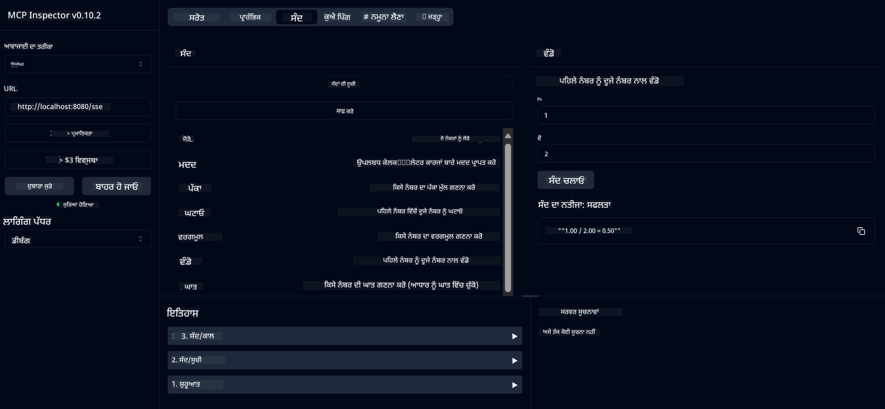

<!--
CO_OP_TRANSLATOR_METADATA:
{
  "original_hash": "13231e9951b68efd9df8c56bd5cdb27e",
  "translation_date": "2025-07-13T22:25:04+00:00",
  "source_file": "03-GettingStarted/samples/java/calculator/README.md",
  "language_code": "pa"
}
-->
# Basic Calculator MCP Service

ਇਹ ਸੇਵਾ Model Context Protocol (MCP) ਰਾਹੀਂ ਬੁਨਿਆਦੀ ਕੈਲਕੁਲੇਟਰ ਕਾਰਜ ਪ੍ਰਦਾਨ ਕਰਦੀ ਹੈ, ਜੋ Spring Boot ਅਤੇ WebFlux ਟ੍ਰਾਂਸਪੋਰਟ ਦੀ ਵਰਤੋਂ ਕਰਦੀ ਹੈ। ਇਹ MCP ਇੰਪਲੀਮੈਂਟੇਸ਼ਨਾਂ ਬਾਰੇ ਸਿੱਖ ਰਹੇ ਸ਼ੁਰੂਆਤੀ ਵਿਦਿਆਰਥੀਆਂ ਲਈ ਇੱਕ ਸਧਾਰਣ ਉਦਾਹਰਨ ਵਜੋਂ ਤਿਆਰ ਕੀਤੀ ਗਈ ਹੈ।

ਵਧੇਰੇ ਜਾਣਕਾਰੀ ਲਈ, [MCP Server Boot Starter](https://docs.spring.io/spring-ai/reference/api/mcp/mcp-server-boot-starter-docs.html) ਸੰਦਰਭ ਦਸਤਾਵੇਜ਼ ਵੇਖੋ।

## ਝਲਕ

ਸੇਵਾ ਇਹ ਗੱਲਾਂ ਦਰਸਾਉਂਦੀ ਹੈ:
- SSE (Server-Sent Events) ਲਈ ਸਹਿਯੋਗ
- Spring AI ਦੇ `@Tool` ਐਨੋਟੇਸ਼ਨ ਰਾਹੀਂ ਆਟੋਮੈਟਿਕ ਟੂਲ ਰਜਿਸਟ੍ਰੇਸ਼ਨ
- ਬੁਨਿਆਦੀ ਕੈਲਕੁਲੇਟਰ ਫੰਕਸ਼ਨ:
  - ਜੋੜ, ਘਟਾਅ, ਗੁਣਾ, ਭਾਗ
  - ਘਾਤ ਅਤੇ ਵਰਗਮੂਲ
  - ਮੋਡਿਊਲਸ (ਬਾਕੀ) ਅਤੇ ਐਬਸੋਲਿਊਟ ਵੈਲਯੂ
  - ਕਾਰਜਾਂ ਦੀ ਵਿਆਖਿਆ ਲਈ ਮਦਦ ਫੰਕਸ਼ਨ

## ਵਿਸ਼ੇਸ਼ਤਾਵਾਂ

ਇਹ ਕੈਲਕੁਲੇਟਰ ਸੇਵਾ ਹੇਠ ਲਿਖੀਆਂ ਸਮਰੱਥਾਵਾਂ ਦਿੰਦੀ ਹੈ:

1. **ਮੂਲ ਅੰਕਗਣਿਤੀ ਕਾਰਜ**:
   - ਦੋ ਨੰਬਰਾਂ ਦਾ ਜੋੜ
   - ਇੱਕ ਨੰਬਰ ਵਿੱਚੋਂ ਦੂਜੇ ਦਾ ਘਟਾਅ
   - ਦੋ ਨੰਬਰਾਂ ਦਾ ਗੁਣਾ
   - ਇੱਕ ਨੰਬਰ ਨੂੰ ਦੂਜੇ ਨਾਲ ਭਾਗ (ਜ਼ੀਰੋ ਭਾਗ ਦੀ ਜਾਂਚ ਸਮੇਤ)

2. **ਉੱਨਤ ਕਾਰਜ**:
   - ਘਾਤ ਦੀ ਗਣਨਾ (ਬੇਸ ਨੂੰ ਐਕਸਪੋਨੈਂਟ 'ਤੇ ਚੜ੍ਹਾਉਣਾ)
   - ਵਰਗਮੂਲ ਦੀ ਗਣਨਾ (ਨਕਾਰਾਤਮਕ ਨੰਬਰ ਦੀ ਜਾਂਚ ਸਮੇਤ)
   - ਮੋਡਿਊਲਸ (ਬਾਕੀ) ਦੀ ਗਣਨਾ
   - ਐਬਸੋਲਿਊਟ ਵੈਲਯੂ ਦੀ ਗਣਨਾ

3. **ਮਦਦ ਪ੍ਰਣਾਲੀ**:
   - ਸਾਰੇ ਉਪਲਬਧ ਕਾਰਜਾਂ ਦੀ ਵਿਆਖਿਆ ਕਰਨ ਵਾਲਾ ਬਿਲਟ-ਇਨ ਮਦਦ ਫੰਕਸ਼ਨ

## ਸੇਵਾ ਦੀ ਵਰਤੋਂ

ਸੇਵਾ MCP ਪ੍ਰੋਟੋਕੋਲ ਰਾਹੀਂ ਹੇਠ ਲਿਖੇ API ਐਂਡਪੌਇੰਟ ਪ੍ਰਦਾਨ ਕਰਦੀ ਹੈ:

- `add(a, b)`: ਦੋ ਨੰਬਰ ਜੋੜੋ
- `subtract(a, b)`: ਪਹਿਲੇ ਨੰਬਰ ਵਿੱਚੋਂ ਦੂਜਾ ਘਟਾਓ
- `multiply(a, b)`: ਦੋ ਨੰਬਰ ਗੁਣਾ ਕਰੋ
- `divide(a, b)`: ਪਹਿਲੇ ਨੰਬਰ ਨੂੰ ਦੂਜੇ ਨਾਲ ਭਾਗ ਕਰੋ (ਜ਼ੀਰੋ ਜਾਂਚ ਸਮੇਤ)
- `power(base, exponent)`: ਨੰਬਰ ਦਾ ਘਾਤ ਕੱਢੋ
- `squareRoot(number)`: ਵਰਗਮੂਲ ਕੱਢੋ (ਨਕਾਰਾਤਮਕ ਨੰਬਰ ਦੀ ਜਾਂਚ ਸਮੇਤ)
- `modulus(a, b)`: ਭਾਗ ਦੇ ਬਾਕੀ ਦੀ ਗਣਨਾ ਕਰੋ
- `absolute(number)`: ਐਬਸੋਲਿਊਟ ਵੈਲਯੂ ਕੱਢੋ
- `help()`: ਉਪਲਬਧ ਕਾਰਜਾਂ ਬਾਰੇ ਜਾਣਕਾਰੀ ਪ੍ਰਾਪਤ ਕਰੋ

## ਟੈਸਟ ਕਲਾਇੰਟ

`com.microsoft.mcp.sample.client` ਪੈਕੇਜ ਵਿੱਚ ਇੱਕ ਸਧਾਰਣ ਟੈਸਟ ਕਲਾਇੰਟ ਸ਼ਾਮਲ ਹੈ। `SampleCalculatorClient` ਕਲਾਸ ਕੈਲਕੁਲੇਟਰ ਸੇਵਾ ਦੇ ਉਪਲਬਧ ਕਾਰਜਾਂ ਨੂੰ ਦਰਸਾਉਂਦੀ ਹੈ।

## LangChain4j ਕਲਾਇੰਟ ਦੀ ਵਰਤੋਂ

ਪ੍ਰੋਜੈਕਟ ਵਿੱਚ `com.microsoft.mcp.sample.client.LangChain4jClient` ਵਿੱਚ ਇੱਕ LangChain4j ਉਦਾਹਰਨ ਕਲਾਇੰਟ ਸ਼ਾਮਲ ਹੈ ਜੋ ਕੈਲਕੁਲੇਟਰ ਸੇਵਾ ਨੂੰ LangChain4j ਅਤੇ GitHub ਮਾਡਲਾਂ ਨਾਲ ਜੋੜਨ ਦਾ ਤਰੀਕਾ ਦਿਖਾਉਂਦਾ ਹੈ:

### ਜ਼ਰੂਰੀ ਸ਼ਰਤਾਂ

1. **GitHub ਟੋਕਨ ਸੈਟਅੱਪ**:
   
   GitHub ਦੇ AI ਮਾਡਲਾਂ (ਜਿਵੇਂ phi-4) ਦੀ ਵਰਤੋਂ ਲਈ ਤੁਹਾਨੂੰ GitHub ਦਾ ਪर्सਨਲ ਐਕਸੈਸ ਟੋਕਨ ਚਾਹੀਦਾ ਹੈ:

   a. ਆਪਣੇ GitHub ਖਾਤੇ ਦੀ ਸੈਟਿੰਗਜ਼ ਤੇ ਜਾਓ: https://github.com/settings/tokens
   
   b. "Generate new token" → "Generate new token (classic)" 'ਤੇ ਕਲਿੱਕ ਕਰੋ
   
   c. ਆਪਣੇ ਟੋਕਨ ਨੂੰ ਕੋਈ ਵਰਨਨਾਤਮਕ ਨਾਮ ਦਿਓ
   
   d. ਹੇਠ ਲਿਖੀਆਂ ਸਕੋਪ ਚੁਣੋ:
      - `repo` (ਪ੍ਰਾਈਵੇਟ ਰਿਪੋਜ਼ਿਟਰੀਜ਼ ਦਾ ਪੂਰਾ ਕੰਟਰੋਲ)
      - `read:org` (ਸੰਗਠਨ ਅਤੇ ਟੀਮ ਮੈਂਬਰਸ਼ਿਪ ਪੜ੍ਹੋ, ਸੰਗਠਨ ਪ੍ਰੋਜੈਕਟ ਪੜ੍ਹੋ)
      - `gist` (ਗਿਸਟ ਬਣਾਓ)
      - `user:email` (ਯੂਜ਼ਰ ਦੇ ਈਮੇਲ ਪਤੇ ਪੜ੍ਹੋ (ਕੇਵਲ ਪੜ੍ਹਨ ਲਈ))
   
   e. "Generate token" 'ਤੇ ਕਲਿੱਕ ਕਰੋ ਅਤੇ ਨਵਾਂ ਟੋਕਨ ਕਾਪੀ ਕਰੋ
   
   f. ਇਸਨੂੰ ਵਾਤਾਵਰਣ ਚਰ (environment variable) ਵਜੋਂ ਸੈਟ ਕਰੋ:
      
      Windows 'ਤੇ:
      ```
      set GITHUB_TOKEN=your-github-token
      ```
      
      macOS/Linux 'ਤੇ:
      ```bash
      export GITHUB_TOKEN=your-github-token
      ```

   g. ਲੰਬੇ ਸਮੇਂ ਲਈ ਸੈਟਅੱਪ ਲਈ, ਇਸਨੂੰ ਸਿਸਟਮ ਸੈਟਿੰਗਜ਼ ਰਾਹੀਂ ਵਾਤਾਵਰਣ ਚਰ ਵਿੱਚ ਸ਼ਾਮਲ ਕਰੋ

2. ਆਪਣੇ ਪ੍ਰੋਜੈਕਟ ਵਿੱਚ LangChain4j GitHub ਡਿਪੈਂਡੈਂਸੀ ਸ਼ਾਮਲ ਕਰੋ (pom.xml ਵਿੱਚ ਪਹਿਲਾਂ ਹੀ ਹੈ):
   ```xml
   <dependency>
       <groupId>dev.langchain4j</groupId>
       <artifactId>langchain4j-github</artifactId>
       <version>${langchain4j.version}</version>
   </dependency>
   ```

3. ਯਕੀਨੀ ਬਣਾਓ ਕਿ ਕੈਲਕੁਲੇਟਰ ਸਰਵਰ `localhost:8080` 'ਤੇ ਚੱਲ ਰਿਹਾ ਹੈ

### LangChain4j ਕਲਾਇੰਟ ਚਲਾਉਣਾ

ਇਹ ਉਦਾਹਰਨ ਦਰਸਾਉਂਦੀ ਹੈ:
- ਕੈਲਕੁਲੇਟਰ MCP ਸਰਵਰ ਨਾਲ SSE ਟ੍ਰਾਂਸਪੋਰਟ ਰਾਹੀਂ ਕਨੈਕਟ ਕਰਨਾ
- LangChain4j ਦੀ ਵਰਤੋਂ ਕਰਕੇ ਇੱਕ ਚੈਟ ਬੋਟ ਬਣਾਉਣਾ ਜੋ ਕੈਲਕੁਲੇਟਰ ਕਾਰਜਾਂ ਨੂੰ ਵਰਤਦਾ ਹੈ
- GitHub AI ਮਾਡਲਾਂ ਨਾਲ ਇੰਟੀਗ੍ਰੇਸ਼ਨ (ਹੁਣ phi-4 ਮਾਡਲ ਵਰਤ ਰਿਹਾ ਹੈ)

ਕਲਾਇੰਟ ਹੇਠ ਲਿਖੀਆਂ ਨਮੂਨਾ ਪੁੱਛਗਿੱਛਾਂ ਭੇਜਦਾ ਹੈ ਤਾਂ ਜੋ ਕਾਰਗੁਜ਼ਾਰੀ ਦਿਖਾਈ ਜਾ ਸਕੇ:
1. ਦੋ ਨੰਬਰਾਂ ਦਾ ਜੋੜ ਕੱਢਣਾ
2. ਇੱਕ ਨੰਬਰ ਦਾ ਵਰਗਮੂਲ ਲੱਭਣਾ
3. ਉਪਲਬਧ ਕੈਲਕੁਲੇਟਰ ਕਾਰਜਾਂ ਬਾਰੇ ਮਦਦ ਜਾਣਕਾਰੀ ਪ੍ਰਾਪਤ ਕਰਨਾ

ਉਦਾਹਰਨ ਚਲਾਓ ਅਤੇ ਕੰਸੋਲ ਆਉਟਪੁੱਟ ਵੇਖੋ ਕਿ AI ਮਾਡਲ ਕਿਵੇਂ ਕੈਲਕੁਲੇਟਰ ਟੂਲਾਂ ਦੀ ਵਰਤੋਂ ਕਰਕੇ ਪੁੱਛਗਿੱਛਾਂ ਦਾ ਜਵਾਬ ਦਿੰਦਾ ਹੈ।

### GitHub ਮਾਡਲ ਸੰਰਚਨਾ

LangChain4j ਕਲਾਇੰਟ GitHub ਦੇ phi-4 ਮਾਡਲ ਨਾਲ ਹੇਠ ਲਿਖੀਆਂ ਸੈਟਿੰਗਾਂ ਨਾਲ ਸੰਰਚਿਤ ਹੈ:

```java
ChatLanguageModel model = GitHubChatModel.builder()
    .apiKey(System.getenv("GITHUB_TOKEN"))
    .timeout(Duration.ofSeconds(60))
    .modelName("phi-4")
    .logRequests(true)
    .logResponses(true)
    .build();
```

ਵੱਖ-ਵੱਖ GitHub ਮਾਡਲਾਂ ਦੀ ਵਰਤੋਂ ਲਈ, ਸਿਰਫ਼ `modelName` ਪੈਰਾਮੀਟਰ ਨੂੰ ਕਿਸੇ ਹੋਰ ਸਮਰਥਿਤ ਮਾਡਲ (ਜਿਵੇਂ "claude-3-haiku-20240307", "llama-3-70b-8192" ਆਦਿ) ਨਾਲ ਬਦਲੋ।

## ਡਿਪੈਂਡੈਂਸੀਜ਼

ਪ੍ਰੋਜੈਕਟ ਲਈ ਹੇਠ ਲਿਖੀਆਂ ਮੁੱਖ ਡਿਪੈਂਡੈਂਸੀਜ਼ ਦੀ ਲੋੜ ਹੈ:

```xml
<!-- For MCP Server -->
<dependency>
    <groupId>org.springframework.ai</groupId>
    <artifactId>spring-ai-starter-mcp-server-webflux</artifactId>
</dependency>

<!-- For LangChain4j integration -->
<dependency>
    <groupId>dev.langchain4j</groupId>
    <artifactId>langchain4j-mcp</artifactId>
    <version>${langchain4j.version}</version>
</dependency>

<!-- For GitHub models support -->
<dependency>
    <groupId>dev.langchain4j</groupId>
    <artifactId>langchain4j-github</artifactId>
    <version>${langchain4j.version}</version>
</dependency>
```

## ਪ੍ਰੋਜੈਕਟ ਬਣਾਉਣਾ

Maven ਦੀ ਵਰਤੋਂ ਕਰਕੇ ਪ੍ਰੋਜੈਕਟ ਬਣਾਓ:
```bash
./mvnw clean install -DskipTests
```

## ਸਰਵਰ ਚਲਾਉਣਾ

### ਜਾਵਾ ਦੀ ਵਰਤੋਂ ਕਰਕੇ

```bash
java -jar target/calculator-server-0.0.1-SNAPSHOT.jar
```

### MCP Inspector ਦੀ ਵਰਤੋਂ ਕਰਕੇ

MCP Inspector MCP ਸੇਵਾਵਾਂ ਨਾਲ ਇੰਟਰੈਕਟ ਕਰਨ ਲਈ ਇੱਕ ਮਦਦਗਾਰ ਟੂਲ ਹੈ। ਇਸ ਕੈਲਕੁਲੇਟਰ ਸੇਵਾ ਨਾਲ ਇਸਦੀ ਵਰਤੋਂ ਕਰਨ ਲਈ:

1. **MCP Inspector ਇੰਸਟਾਲ ਅਤੇ ਚਲਾਓ** ਇੱਕ ਨਵੇਂ ਟਰਮੀਨਲ ਵਿੰਡੋ ਵਿੱਚ:
   ```bash
   npx @modelcontextprotocol/inspector
   ```

2. **ਵੈੱਬ UI ਤੱਕ ਪਹੁੰਚ ਕਰੋ** ਐਪ ਦੁਆਰਾ ਦਿਖਾਏ ਗਏ URL 'ਤੇ ਕਲਿੱਕ ਕਰਕੇ (ਆਮ ਤੌਰ 'ਤੇ http://localhost:6274)

3. **ਕਨੈਕਸ਼ਨ ਸੰਰਚਿਤ ਕਰੋ**:
   - ਟ੍ਰਾਂਸਪੋਰਟ ਕਿਸਮ "SSE" ਸੈੱਟ ਕਰੋ
   - URL ਨੂੰ ਆਪਣੇ ਚੱਲ ਰਹੇ ਸਰਵਰ ਦੇ SSE ਐਂਡਪੌਇੰਟ `http://localhost:8080/sse` 'ਤੇ ਸੈੱਟ ਕਰੋ
   - "Connect" 'ਤੇ ਕਲਿੱਕ ਕਰੋ

4. **ਟੂਲਾਂ ਦੀ ਵਰਤੋਂ ਕਰੋ**:
   - "List Tools" 'ਤੇ ਕਲਿੱਕ ਕਰਕੇ ਉਪਲਬਧ ਕੈਲਕੁਲੇਟਰ ਕਾਰਜ ਵੇਖੋ
   - ਕਿਸੇ ਟੂਲ ਨੂੰ ਚੁਣੋ ਅਤੇ "Run Tool" 'ਤੇ ਕਲਿੱਕ ਕਰਕੇ ਕਾਰਜ ਚਲਾਓ



### Docker ਦੀ ਵਰਤੋਂ ਕਰਕੇ

ਪ੍ਰੋਜੈਕਟ ਵਿੱਚ ਕੰਟੇਨਰਾਈਜ਼ਡ ਡਿਪਲੋਇਮੈਂਟ ਲਈ Dockerfile ਸ਼ਾਮਲ ਹੈ:

1. **Docker ਇਮੇਜ ਬਣਾਓ**:
   ```bash
   docker build -t calculator-mcp-service .
   ```

2. **Docker ਕੰਟੇਨਰ ਚਲਾਓ**:
   ```bash
   docker run -p 8080:8080 calculator-mcp-service
   ```

ਇਸ ਨਾਲ:
- Maven 3.9.9 ਅਤੇ Eclipse Temurin 24 JDK ਨਾਲ ਮਲਟੀ-ਸਟੇਜ Docker ਇਮੇਜ ਬਣੇਗਾ
- ਇੱਕ ਅਪਟੀਮਾਈਜ਼ਡ ਕੰਟੇਨਰ ਇਮੇਜ ਤਿਆਰ ਹੋਵੇਗਾ
- ਸੇਵਾ ਪੋਰਟ 8080 'ਤੇ ਐਕਸਪੋਜ਼ ਹੋਵੇਗੀ
- ਕੰਟੇਨਰ ਦੇ ਅੰਦਰ MCP ਕੈਲਕੁਲੇਟਰ ਸੇਵਾ ਸ਼ੁਰੂ ਹੋਵੇਗੀ

ਜਦੋਂ ਕੰਟੇਨਰ ਚੱਲ ਰਿਹਾ ਹੋਵੇ, ਤੁਸੀਂ ਸੇਵਾ ਨੂੰ `http://localhost:8080` 'ਤੇ ਐਕਸੈੱਸ ਕਰ ਸਕਦੇ ਹੋ।

## ਸਮੱਸਿਆ ਨਿਵਾਰਣ

### GitHub ਟੋਕਨ ਨਾਲ ਆਮ ਸਮੱਸਿਆਵਾਂ

1. **ਟੋਕਨ ਅਧਿਕਾਰ ਸਮੱਸਿਆਵਾਂ**: ਜੇ ਤੁਹਾਨੂੰ 403 Forbidden ਐਰਰ ਮਿਲਦਾ ਹੈ, ਤਾਂ ਯਕੀਨੀ ਬਣਾਓ ਕਿ ਤੁਹਾਡੇ ਟੋਕਨ ਕੋਲ ਜ਼ਰੂਰੀ ਅਧਿਕਾਰ ਹਨ ਜਿਵੇਂ ਕਿ ਜ਼ਰੂਰੀ ਸ਼ਰਤਾਂ ਵਿੱਚ ਦਿੱਤਾ ਗਿਆ ਹੈ।

2. **ਟੋਕਨ ਨਾ ਮਿਲਣਾ**: ਜੇ "No API key found" ਐਰਰ ਆਉਂਦਾ ਹੈ, ਤਾਂ ਯਕੀਨੀ ਬਣਾਓ ਕਿ GITHUB_TOKEN ਵਾਤਾਵਰਣ ਚਰ ਠੀਕ ਤਰ੍ਹਾਂ ਸੈਟ ਹੈ।

3. **ਰੇਟ ਲਿਮਿਟਿੰਗ**: GitHub API 'ਤੇ ਰੇਟ ਲਿਮਿਟ ਹੁੰਦੀ ਹੈ। ਜੇ ਤੁਸੀਂ 429 ਸਥਿਤੀ ਕੋਡ ਵਾਲਾ ਰੇਟ ਲਿਮਿਟ ਐਰਰ ਮਿਲਦਾ ਹੈ, ਤਾਂ ਕੁਝ ਮਿੰਟਾਂ ਲਈ ਇੰਤਜ਼ਾਰ ਕਰੋ ਅਤੇ ਫਿਰ ਕੋਸ਼ਿਸ਼ ਕਰੋ।

4. **ਟੋਕਨ ਮਿਆਦ ਖਤਮ ਹੋਣਾ**: GitHub ਟੋਕਨ ਮਿਆਦ ਖਤਮ ਹੋ ਸਕਦੇ ਹਨ। ਜੇ ਕੁਝ ਸਮੇਂ ਬਾਅਦ ਪ੍ਰਮਾਣਿਕਤਾ ਸੰਬੰਧੀ ਗਲਤੀਆਂ ਆਉਂਦੀਆਂ ਹਨ, ਤਾਂ ਨਵਾਂ ਟੋਕਨ ਬਣਾਓ ਅਤੇ ਵਾਤਾਵਰਣ ਚਰ ਅਪਡੇਟ ਕਰੋ।

ਜੇ ਤੁਹਾਨੂੰ ਹੋਰ ਮਦਦ ਦੀ ਲੋੜ ਹੋਵੇ, ਤਾਂ [LangChain4j ਦਸਤਾਵੇਜ਼](https://github.com/langchain4j/langchain4j) ਜਾਂ [GitHub API ਦਸਤਾਵੇਜ਼](https://docs.github.com/en/rest) ਵੇਖੋ।

**ਅਸਵੀਕਾਰੋਪਣ**:  
ਇਹ ਦਸਤਾਵੇਜ਼ AI ਅਨੁਵਾਦ ਸੇਵਾ [Co-op Translator](https://github.com/Azure/co-op-translator) ਦੀ ਵਰਤੋਂ ਕਰਕੇ ਅਨੁਵਾਦਿਤ ਕੀਤਾ ਗਿਆ ਹੈ। ਜਦੋਂ ਕਿ ਅਸੀਂ ਸਹੀਅਤ ਲਈ ਕੋਸ਼ਿਸ਼ ਕਰਦੇ ਹਾਂ, ਕਿਰਪਾ ਕਰਕੇ ਧਿਆਨ ਰੱਖੋ ਕਿ ਸਵੈਚਾਲਿਤ ਅਨੁਵਾਦਾਂ ਵਿੱਚ ਗਲਤੀਆਂ ਜਾਂ ਅਸਮਰਥਤਾਵਾਂ ਹੋ ਸਕਦੀਆਂ ਹਨ। ਮੂਲ ਦਸਤਾਵੇਜ਼ ਆਪਣੀ ਮੂਲ ਭਾਸ਼ਾ ਵਿੱਚ ਪ੍ਰਮਾਣਿਕ ਸਰੋਤ ਮੰਨਿਆ ਜਾਣਾ ਚਾਹੀਦਾ ਹੈ। ਮਹੱਤਵਪੂਰਨ ਜਾਣਕਾਰੀ ਲਈ, ਪੇਸ਼ੇਵਰ ਮਨੁੱਖੀ ਅਨੁਵਾਦ ਦੀ ਸਿਫਾਰਸ਼ ਕੀਤੀ ਜਾਂਦੀ ਹੈ। ਅਸੀਂ ਇਸ ਅਨੁਵਾਦ ਦੀ ਵਰਤੋਂ ਤੋਂ ਉਤਪੰਨ ਕਿਸੇ ਵੀ ਗਲਤਫਹਿਮੀ ਜਾਂ ਗਲਤ ਵਿਆਖਿਆ ਲਈ ਜ਼ਿੰਮੇਵਾਰ ਨਹੀਂ ਹਾਂ।