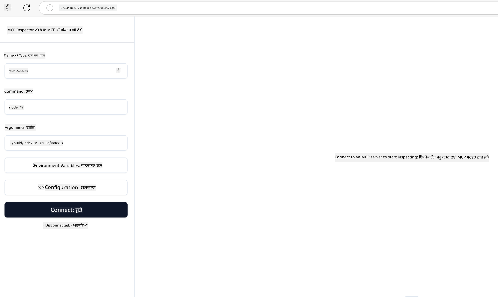

<!--
CO_OP_TRANSLATOR_METADATA:
{
  "original_hash": "83efa75a69bc831277263a6f1ae53669",
  "translation_date": "2025-08-18T16:33:14+00:00",
  "source_file": "04-PracticalImplementation/README.md",
  "language_code": "pa"
}
-->
# ਪ੍ਰਾਇਮਿਕ ਅਮਲ

[](https://youtu.be/vCN9-mKBDfQ)

_(ਉਪਰ ਦਿੱਤੀ ਤਸਵੀਰ 'ਤੇ ਕਲਿਕ ਕਰਕੇ ਇਸ ਪਾਠ ਦਾ ਵੀਡੀਓ ਵੇਖੋ)_

ਪ੍ਰਾਇਮਿਕ ਅਮਲ ਉਹ ਜਗ੍ਹਾ ਹੈ ਜਿੱਥੇ ਮਾਡਲ ਕਾਂਟੈਕਸਟ ਪ੍ਰੋਟੋਕੋਲ (MCP) ਦੀ ਤਾਕਤ ਹਕੀਕਤ ਬਣਦੀ ਹੈ। ਜਦੋਂ ਕਿ MCP ਦੇ ਸਿਧਾਂਤ ਅਤੇ ਆਰਕੀਟੈਕਚਰ ਨੂੰ ਸਮਝਣਾ ਮਹੱਤਵਪੂਰਨ ਹੈ, ਅਸਲੀ ਮੁੱਲ ਤਦ ਉੱਭਰਦਾ ਹੈ ਜਦੋਂ ਤੁਸੀਂ ਇਹ ਧਾਰਨਾਵਾਂ ਨੂੰ ਅਸਲੀ ਸਮੱਸਿਆਵਾਂ ਦਾ ਹੱਲ ਕਰਨ ਲਈ ਬਣਾਉਣ, ਟੈਸਟ ਕਰਨ ਅਤੇ ਡਿਪਲੌਇ ਕਰਨ ਵਿੱਚ ਲਾਗੂ ਕਰਦੇ ਹੋ। ਇਹ ਅਧਿਆਇ ਧਾਰਨਾਤਮਕ ਗਿਆਨ ਅਤੇ ਹੱਥ-ਵਰਤੋਂ ਵਿਕਾਸ ਦੇ ਵਿਚਕਾਰ ਪੂਲ ਬਣਾਉਂਦਾ ਹੈ, ਤੁਹਾਨੂੰ MCP-ਅਧਾਰਿਤ ਐਪਲੀਕੇਸ਼ਨ ਨੂੰ ਜੀਵੰਤ ਬਣਾਉਣ ਦੀ ਪ੍ਰਕਿਰਿਆ ਵਿੱਚ ਮਦਦ ਕਰਦਾ ਹੈ।

ਚਾਹੇ ਤੁਸੀਂ ਸਮਰਥ ਸਹਾਇਕ ਵਿਕਸਿਤ ਕਰ ਰਹੇ ਹੋ, ਕਾਰੋਬਾਰੀ ਵਰਕਫਲੋਜ਼ ਵਿੱਚ AI ਨੂੰ ਸ਼ਾਮਲ ਕਰ ਰਹੇ ਹੋ, ਜਾਂ ਡਾਟਾ ਪ੍ਰੋਸੈਸਿੰਗ ਲਈ ਕਸਟਮ ਟੂਲ ਬਣਾਉਣ ਦੀ ਯੋਜਨਾ ਬਣਾ ਰਹੇ ਹੋ, MCP ਇੱਕ ਲਚਕਦਾਰ ਅਧਾਰ ਪ੍ਰਦਾਨ ਕਰਦਾ ਹੈ। ਇਸ ਦੀ ਭਾਸ਼ਾ-ਅਗਨੋਸਟਿਕ ਡਿਜ਼ਾਈਨ ਅਤੇ ਪ੍ਰਸਿੱਧ ਪ੍ਰੋਗਰਾਮਿੰਗ ਭਾਸ਼ਾਵਾਂ ਲਈ ਅਧਿਕਾਰਤ SDKs ਇਸਨੂੰ ਵੱਖ-ਵੱਖ ਡਿਵੈਲਪਰਾਂ ਲਈ ਪਹੁੰਚਯੋਗ ਬਣਾਉਂਦੇ ਹਨ। ਇਹ SDKs ਦੀ ਵਰਤੋਂ ਕਰਕੇ, ਤੁਸੀਂ ਤੇਜ਼ੀ ਨਾਲ ਪ੍ਰੋਟੋਟਾਈਪ, ਦੁਹਰਾਉ ਅਤੇ ਆਪਣੇ ਹੱਲਾਂ ਨੂੰ ਵੱਖ-ਵੱਖ ਪਲੇਟਫਾਰਮਾਂ ਅਤੇ ਵਾਤਾਵਰਣਾਂ ਵਿੱਚ ਸਕੇਲ ਕਰ ਸਕਦੇ ਹੋ।

ਅਗਲੇ ਭਾਗਾਂ ਵਿੱਚ, ਤੁਸੀਂ ਪ੍ਰਾਇਮਿਕ ਉਦਾਹਰਨਾਂ, ਨਮੂਨਾ ਕੋਡ, ਅਤੇ ਡਿਪਲੌਇਮੈਂਟ ਰਣਨੀਤੀਆਂ ਪਾਵੋਗੇ ਜੋ C#, Java with Spring, TypeScript, JavaScript, ਅਤੇ Python ਵਿੱਚ MCP ਨੂੰ ਲਾਗੂ ਕਰਨ ਦਾ ਪ੍ਰਦਰਸ਼ਨ ਕਰਦੇ ਹਨ। ਤੁਸੀਂ ਇਹ ਵੀ ਸਿੱਖੋਗੇ ਕਿ ਆਪਣੇ MCP ਸਰਵਰਾਂ ਨੂੰ ਡਿਬੱਗ ਅਤੇ ਟੈਸਟ ਕਿਵੇਂ ਕਰਨਾ ਹੈ, APIs ਦਾ ਪ੍ਰਬੰਧਨ ਕਿਵੇਂ ਕਰਨਾ ਹੈ, ਅਤੇ Azure ਦੀ ਵਰਤੋਂ ਕਰਕੇ ਹੱਲਾਂ ਨੂੰ ਕਲਾਉਡ ਵਿੱਚ ਕਿਵੇਂ ਡਿਪਲੌਇ ਕਰਨਾ ਹੈ। ਇਹ ਹੱਥ-ਵਰਤੋਂ ਸਰੋਤ ਤੁਹਾਡੇ ਸਿੱਖਣ ਨੂੰ ਤੇਜ਼ ਕਰਨ ਅਤੇ ਮਜ਼ਬੂਤ, ਉਤਪਾਦਨ-ਤਿਆਰ MCP ਐਪਲੀਕੇਸ਼ਨ ਨੂੰ ਆਤਮਵਿਸ਼ਵਾਸ ਨਾਲ ਬਣਾਉਣ ਵਿੱਚ ਮਦਦ ਕਰਨ ਲਈ ਡਿਜ਼ਾਈਨ ਕੀਤੇ ਗਏ ਹਨ।

## ਝਲਕ

ਇਹ ਪਾਠ ਕਈ ਪ੍ਰੋਗਰਾਮਿੰਗ ਭਾਸ਼ਾਵਾਂ ਵਿੱਚ MCP ਲਾਗੂ ਕਰਨ ਦੇ ਪ੍ਰਾਇਮਿਕ ਪਹਲੂਆਂ 'ਤੇ ਧਿਆਨ ਕੇਂਦਰਿਤ ਕਰਦਾ ਹੈ। ਅਸੀਂ C#, Java with Spring, TypeScript, JavaScript, ਅਤੇ Python ਵਿੱਚ MCP SDKs ਦੀ ਵਰਤੋਂ ਕਰਕੇ ਮਜ਼ਬੂਤ ​​ਐਪਲੀਕੇਸ਼ਨ ਬਣਾਉਣ, MCP ਸਰਵਰਾਂ ਨੂੰ ਡਿਬੱਗ ਅਤੇ ਟੈਸਟ ਕਰਨ, ਅਤੇ ਦੁਹਰਾਉਣਯੋਗ ਸਰੋਤ, ਪ੍ਰੋੰਪਟਸ, ਅਤੇ ਟੂਲ ਬਣਾਉਣ ਦੇ ਤਰੀਕੇ ਦੀ ਪੜਚੋਲ ਕਰਾਂਗੇ।

## ਸਿੱਖਣ ਦੇ ਉਦੇਸ਼

ਇਸ ਪਾਠ ਦੇ ਅੰਤ ਤੱਕ, ਤੁਸੀਂ ਇਹ ਕਰਨ ਦੇ ਯੋਗ ਹੋਵੋਗੇ:

- ਵੱਖ-ਵੱਖ ਪ੍ਰੋਗਰਾਮਿੰਗ ਭਾਸ਼ਾਵਾਂ ਵਿੱਚ ਅਧਿਕਾਰਤ SDKs ਦੀ ਵਰਤੋਂ ਕਰਕੇ MCP ਹੱਲ ਲਾਗੂ ਕਰੋ
- MCP ਸਰਵਰਾਂ ਨੂੰ ਵਿਧੀਵਤ ਤੌਰ 'ਤੇ ਡਿਬੱਗ ਅਤੇ ਟੈਸਟ ਕਰੋ
- ਸਰਵਰ ਫੀਚਰ (ਸਰੋਤ, ਪ੍ਰੋੰਪਟਸ, ਅਤੇ ਟੂਲ) ਬਣਾਓ ਅਤੇ ਵਰਤੋ
- ਜਟਿਲ ਕੰਮਾਂ ਲਈ ਪ੍ਰਭਾਵਸ਼ਾਲੀ MCP ਵਰਕਫਲੋਜ਼ ਡਿਜ਼ਾਈਨ ਕਰੋ
- ਪ੍ਰਦਰਸ਼ਨ ਅਤੇ ਭਰੋਸੇਯੋਗਤਾ ਲਈ MCP ਲਾਗੂ ਕਰਨ ਨੂੰ ਅਨੁਕੂਲ ਬਣਾਓ

## ਅਧਿਕਾਰਤ SDK ਸਰੋਤ

ਮਾਡਲ ਕਾਂਟੈਕਸਟ ਪ੍ਰੋਟੋਕੋਲ ਕਈ ਭਾਸ਼ਾਵਾਂ ਲਈ ਅਧਿਕਾਰਤ SDKs ਪ੍ਰਦਾਨ ਕਰਦਾ ਹੈ:

- [C# SDK](https://github.com/modelcontextprotocol/csharp-sdk)
- [Java with Spring SDK](https://github.com/modelcontextprotocol/java-sdk) **ਨੋਟ:** [Project Reactor](https://projectreactor.io) 'ਤੇ ਨਿਰਭਰਤਾ ਦੀ ਲੋੜ ਹੈ। ([ਚਰਚਾ ਮਾਮਲਾ 246](https://github.com/orgs/modelcontextprotocol/discussions/246) ਵੇਖੋ।)
- [TypeScript SDK](https://github.com/modelcontextprotocol/typescript-sdk)
- [Python SDK](https://github.com/modelcontextprotocol/python-sdk)
- [Kotlin SDK](https://github.com/modelcontextprotocol/kotlin-sdk)

## MCP SDKs ਨਾਲ ਕੰਮ ਕਰਨਾ

ਇਹ ਭਾਗ ਕਈ ਪ੍ਰੋਗਰਾਮਿੰਗ ਭਾਸ਼ਾਵਾਂ ਵਿੱਚ MCP ਨੂੰ ਲਾਗੂ ਕਰਨ ਦੇ ਪ੍ਰਾਇਮਿਕ ਉਦਾਹਰਨਾਂ ਪ੍ਰਦਾਨ ਕਰਦਾ ਹੈ। ਤੁਸੀਂ `samples` ਡਾਇਰੈਕਟਰੀ ਵਿੱਚ ਭਾਸ਼ਾ ਅਨੁਸਾਰ ਵਿਵਸਥਿਤ ਨਮੂਨਾ ਕੋਡ ਪਾ ਸਕਦੇ ਹੋ।

### ਉਪਲਬਧ ਨਮੂਨੇ

ਰਿਪੋਜ਼ਟਰੀ ਵਿੱਚ ਹੇਠਾਂ ਦਿੱਤੀਆਂ ਭਾਸ਼ਾਵਾਂ ਵਿੱਚ [ਨਮੂਨਾ ਲਾਗੂ ਕਰਨ](../../../04-PracticalImplementation/samples) ਸ਼ਾਮਲ ਹਨ:

- [C#](./samples/csharp/README.md)
- [Java with Spring](./samples/java/containerapp/README.md)
- [TypeScript](./samples/typescript/README.md)
- [JavaScript](./samples/javascript/README.md)
- [Python](./samples/python/README.md)

ਹਰ ਨਮੂਨਾ ਉਸ ਵਿਸ਼ੇਸ਼ ਭਾਸ਼ਾ ਅਤੇ ਪਰੀਵਾਰ ਲਈ ਮੁੱਖ MCP ਧਾਰਨਾਵਾਂ ਅਤੇ ਲਾਗੂ ਕਰਨ ਦੇ ਪੈਟਰਨ ਦਾ ਪ੍ਰਦਰਸ਼ਨ ਕਰਦਾ ਹੈ।

## ਮੁੱਖ ਸਰਵਰ ਫੀਚਰ

MCP ਸਰਵਰ ਹੇਠਾਂ ਦਿੱਤੀਆਂ ਫੀਚਰਾਂ ਦੇ ਕਿਸੇ ਵੀ ਸੰਯੋਜਨ ਨੂੰ ਲਾਗੂ ਕਰ ਸਕਦੇ ਹਨ:

### ਸਰੋਤ

ਸਰੋਤ ਉਪਭੋਗਤਾ ਜਾਂ AI ਮਾਡਲ ਲਈ ਸੰਦਰਭ ਅਤੇ ਡਾਟਾ ਪ੍ਰਦਾਨ ਕਰਦੇ ਹਨ:

- ਦਸਤਾਵੇਜ਼ ਰਿਪੋਜ਼ਟਰੀ
- ਗਿਆਨ ਅਧਾਰ
- ਸੰਰਚਿਤ ਡਾਟਾ ਸਰੋਤ
- ਫਾਈਲ ਸਿਸਟਮ

### ਪ੍ਰੋੰਪਟਸ

ਪ੍ਰੋੰਪਟਸ ਉਪਭੋਗਤਾਵਾਂ ਲਈ ਟੈਂਪਲੇਟ ਕੀਤੇ ਸੁਨੇਹੇ ਅਤੇ ਵਰਕਫਲੋਜ਼ ਹਨ:

- ਪਹਿਲਾਂ ਤੋਂ ਪਰਿਭਾਸ਼ਿਤ ਗੱਲਬਾਤ ਟੈਂਪਲੇਟ
- ਨਿਰਦੇਸ਼ਿਤ ਅੰਤਰਕਿਰਿਆ ਪੈਟਰਨ
- ਵਿਸ਼ੇਸ਼ ਡਾਇਲਾਗ ਸਟ੍ਰਕਚਰ

### ਟੂਲ

ਟੂਲ AI ਮਾਡਲ ਲਈ ਕਾਰਜ ਕਰਨ ਦੇ ਫੰਕਸ਼ਨ ਹਨ:

- ਡਾਟਾ ਪ੍ਰੋਸੈਸਿੰਗ ਯੂਟਿਲਿਟੀਜ਼
- ਬਾਹਰੀ API ਇੰਟੀਗ੍ਰੇਸ਼ਨ
- ਗਣਨਾਤਮਕ ਸਮਰੱਥਾਵਾਂ
- ਖੋਜ ਕਰਨ ਦੀ ਸਮਰੱਥਾ

## ਨਮੂਨਾ ਲਾਗੂ ਕਰਨ: C# ਲਾਗੂ ਕਰਨ

ਅਧਿਕਾਰਤ C# SDK ਰਿਪੋਜ਼ਟਰੀ ਵਿੱਚ ਕਈ ਨਮੂਨਾ ਲਾਗੂ ਕਰਨ ਸ਼ਾਮਲ ਹਨ ਜੋ MCP ਦੇ ਵੱਖ-ਵੱਖ ਪਹਲੂਆਂ ਨੂੰ ਦਰਸਾਉਂਦੇ ਹਨ:

- **ਮੁੱਢਲਾ MCP ਕਲਾਇੰਟ**: ਸਧਾਰਨ ਉਦਾਹਰਨ ਜੋ ਦਿਖਾਉਂਦਾ ਹੈ ਕਿ MCP ਕਲਾਇੰਟ ਕਿਵੇਂ ਬਣਾਉਣਾ ਹੈ ਅਤੇ ਟੂਲ ਕਿਵੇਂ ਕਾਲ ਕਰਨੇ ਹਨ
- **ਮੁੱਢਲਾ MCP ਸਰਵਰ**: ਬੁਨਿਆਦੀ ਟੂਲ ਰਜਿਸਟ੍ਰੇਸ਼ਨ ਨਾਲ ਘੱਟੋ-ਘੱਟ ਸਰਵਰ ਲਾਗੂ ਕਰਨ
- **ਉੱਨਤ MCP ਸਰਵਰ**: ਪੂਰੀ-ਫੀਚਰ ਵਾਲਾ ਸਰਵਰ ਜਿਸ ਵਿੱਚ ਟੂਲ ਰਜਿਸਟ੍ਰੇਸ਼ਨ, ਪ੍ਰਮਾਣਿਕਤਾ, ਅਤੇ ਗਲਤੀ ਸੰਭਾਲ ਹੈ
- **ASP.NET ਇੰਟੀਗ੍ਰੇਸ਼ਨ**: ASP.NET Core ਨਾਲ ਇੰਟੀਗ੍ਰੇਸ਼ਨ ਦਿਖਾਉਣ ਵਾਲੇ ਉਦਾਹਰਨ
- **ਟੂਲ ਲਾਗੂ ਕਰਨ ਦੇ ਪੈਟਰਨ**: ਵੱਖ-ਵੱਖ ਜਟਿਲਤਾ ਪੱਧਰਾਂ ਨਾਲ ਟੂਲ ਲਾਗੂ ਕਰਨ ਦੇ ਪੈਟਰਨ

C# MCP SDK ਪ੍ਰੀਵਿਊ ਵਿੱਚ ਹੈ ਅਤੇ APIs ਬਦਲ ਸਕਦੇ ਹਨ। ਜਿਵੇਂ SDK ਵਿਕਸਿਤ ਹੁੰਦਾ ਹੈ, ਅਸੀਂ ਇਸ ਬਲੌਗ ਨੂੰ ਲਗਾਤਾਰ ਅਪਡੇਟ ਕਰਾਂਗੇ।

### ਮੁੱਖ ਫੀਚਰ

- [C# MCP Nuget ModelContextProtocol](https://www.nuget.org/packages/ModelContextProtocol)
- ਆਪਣਾ [ਪਹਿਲਾ MCP ਸਰਵਰ](https://devblogs.microsoft.com/dotnet/build-a-model-context-protocol-mcp-server-in-csharp/) ਬਣਾਉਣਾ।

ਪੂਰੀ C# ਲਾਗੂ ਕਰਨ ਦੇ ਨਮੂਨੇ ਲਈ, [ਅਧਿਕਾਰਤ C# SDK ਨਮੂਨਾ ਰਿਪੋਜ਼ਟਰੀ](https://github.com/modelcontextprotocol/csharp-sdk) 'ਤੇ ਜਾਓ।

## ਨਮੂਨਾ ਲਾਗੂ ਕਰਨ: Java with Spring ਲਾਗੂ ਕਰਨ

Java with Spring SDK ਉੱਨਤ MCP ਲਾਗੂ ਕਰਨ ਦੇ ਵਿਕਲਪ ਪ੍ਰਦਾਨ ਕਰਦਾ ਹੈ ਜਿਸ ਵਿੱਚ ਐਂਟਰਪ੍ਰਾਈਜ਼-ਗ੍ਰੇਡ ਫੀਚਰ ਹਨ।

### ਮੁੱਖ ਫੀਚਰ

- Spring Framework ਇੰਟੀਗ੍ਰੇਸ਼ਨ
- ਮਜ਼ਬੂਤ ​​ਟਾਈਪ ਸੇਫਟੀ
- Reactive ਪ੍ਰੋਗਰਾਮਿੰਗ ਸਹਾਇਤਾ
- ਵਿਸਤ੍ਰਿਤ ਗਲਤੀ ਸੰਭਾਲ

Java with Spring ਲਾਗੂ ਕਰਨ ਦੇ ਪੂਰੇ ਨਮੂਨੇ ਲਈ, `samples/java/containerapp/README.md` ਵਿੱਚ [Java with Spring ਨਮੂਨਾ](samples/java/containerapp/README.md) ਵੇਖੋ।

## ਨਮੂਨਾ ਲਾਗੂ ਕਰਨ: JavaScript ਲਾਗੂ ਕਰਨ

JavaScript SDK MCP ਲਾਗੂ ਕਰਨ ਲਈ ਹਲਕਾ ਅਤੇ ਲਚਕਦਾਰ ਦ੍ਰਿਸ਼ਟੀਕੋਣ ਪ੍ਰਦਾਨ ਕਰਦਾ ਹੈ।

### ਮੁੱਖ ਫੀਚਰ

- Node.js ਅਤੇ ਬ੍ਰਾਊਜ਼ਰ ਸਹਾਇਤਾ
- Promise-ਅਧਾਰਿਤ API
- Express ਅਤੇ ਹੋਰ ਫਰੇਮਵਰਕਸ ਨਾਲ ਆਸਾਨ ਇੰਟੀਗ੍ਰੇਸ਼ਨ
- Streaming ਲਈ WebSocket ਸਹਾਇਤਾ

JavaScript ਲਾਗੂ ਕਰਨ ਦੇ ਪੂਰੇ ਨਮੂਨੇ ਲਈ, `samples/javascript/README.md` ਵਿੱਚ [JavaScript ਨਮੂਨਾ](samples/javascript/README.md) ਵੇਖੋ।

## ਨਮੂਨਾ ਲਾਗੂ ਕਰਨ: Python ਲਾਗੂ ਕਰਨ

Python SDK MCP ਲਾਗੂ ਕਰਨ ਲਈ ਇੱਕ Pythonic ਦ੍ਰਿਸ਼ਟੀਕੋਣ ਪ੍ਰਦਾਨ ਕਰਦਾ ਹੈ ਜਿਸ ਵਿੱਚ ਸ਼ਾਨਦਾਰ ML ਫਰੇਮਵਰਕ ਇੰਟੀਗ੍ਰੇਸ਼ਨ ਹਨ।

### ਮੁੱਖ ਫੀਚਰ

- asyncio ਨਾਲ Async/await ਸਹਾਇਤਾ
- FastAPI ਇੰਟੀਗ੍ਰੇਸ਼ਨ
- ਸਧਾਰਨ ਟੂਲ ਰਜਿਸਟ੍ਰੇਸ਼ਨ
- ਪ੍ਰਸਿੱਧ ML ਲਾਇਬ੍ਰੇਰੀਜ਼ ਨਾਲ ਮੂਲ ਇੰਟੀਗ੍ਰੇਸ਼ਨ

Python ਲਾਗੂ ਕਰਨ ਦੇ ਪੂਰੇ ਨਮੂਨੇ ਲਈ, `samples/python/README.md` ਵਿੱਚ [Python ਨਮੂਨਾ](samples/python/README.md) ਵੇਖੋ।

## API ਪ੍ਰਬੰਧਨ

Azure API Management MCP ਸਰਵਰਾਂ ਨੂੰ ਸੁਰੱਖਿਅਤ ਕਰਨ ਲਈ ਇੱਕ ਸ਼ਾਨਦਾਰ ਹੱਲ ਹੈ। ਵਿਚਾਰ ਇਹ ਹੈ ਕਿ ਆਪਣੇ MCP ਸਰਵਰ ਦੇ ਸਾਹਮਣੇ ਇੱਕ Azure API Management ਇੰਸਟੈਂਸ ਰੱਖੋ ਅਤੇ ਇਸਨੂੰ ਉਹ ਫੀਚਰ ਸੰਭਾਲਣ ਦਿਓ ਜੋ ਤੁਸੀਂ ਸੰਭਾਵਤ ਤੌਰ 'ਤੇ ਚਾਹੁੰਦੇ ਹੋ ਜਿਵੇਂ:

- ਰੇਟ ਲਿਮਿਟਿੰਗ
- ਟੋਕਨ ਪ੍ਰਬੰਧਨ
- ਮਾਨੀਟਰਿੰਗ
- ਲੋਡ ਬੈਲੈਂਸਿੰਗ
- ਸੁਰੱਖਿਆ

### Azure ਨਮੂਨਾ

ਇਹ ਹੈ ਇੱਕ Azure ਨਮੂਨਾ ਜੋ ਸਹੀ ਤੌਰ 'ਤੇ ਇਹ ਕਰ ਰਿਹਾ ਹੈ, ਜਿਵੇਂ [MCP ਸਰਵਰ ਬਣਾਉਣਾ ਅਤੇ ਇਸਨੂੰ Azure API Management ਨਾਲ ਸੁਰੱਖਿਅਤ ਕਰਨਾ](https://github.com/Azure-Samples/remote-mcp-apim-functions-python)।

ਹੇਠਾਂ ਦਿੱਤੀ ਤਸਵੀਰ ਵਿੱਚ ਅਧਿਕਾਰ ਪ੍ਰਵਾਹ ਦਿਖਾਇਆ ਗਿਆ ਹੈ:


ਉਪਰੋਕਤ ਤਸਵੀਰ ਵਿੱਚ, ਹੇਠਾਂ ਦਿੱਤਾ ਗਿਆ ਹੁੰਦਾ ਹੈ:

- Microsoft Entra ਦੀ ਵਰਤੋਂ ਕਰਕੇ ਪ੍ਰਮਾਣਿਕਤਾ/ਅਧਿਕਾਰ ਹੁੰਦਾ ਹੈ।
- Azure API Management ਇੱਕ ਗੇਟਵੇ ਵਜੋਂ ਕੰਮ ਕਰਦਾ ਹੈ ਅਤੇ ਟ੍ਰੈਫਿਕ ਨੂੰ ਨਿਰਦੇਸ਼ਿਤ ਅਤੇ ਪ੍ਰਬੰਧਿਤ ਕਰਨ ਲਈ ਨੀਤੀਆਂ ਦੀ ਵਰਤੋਂ ਕਰਦਾ ਹੈ।
- Azure Monitor ਸਾਰੇ ਬੇਨਤੀ ਲੌਗ ਕਰਦਾ ਹੈ ਅਗਲੇ ਵਿਸ਼ਲੇਸ਼ਣ ਲਈ।

#### ਅਧਿਕਾਰ ਪ੍ਰਵਾਹ

ਚਲੋ ਅਧਿਕਾਰ ਪ੍ਰਵਾਹ ਨੂੰ ਹੋਰ ਵਿਸਤ੍ਰਿਤ ਤੌਰ 'ਤੇ ਵੇਖੀਏ:


#### MCP ਅਧਿਕਾਰ ਵਿਸ਼ੇਸ਼ਤਾ

[MCP ਅਧਿਕਾਰ ਵਿਸ਼ੇਸ਼ਤਾ](https://modelcontextprotocol.io/specification/2025-03-26/basic/authorization#2-10-third-party-authorization-flow) ਬਾਰੇ ਹੋਰ ਜਾਣੋ।

## Azure 'ਤੇ ਰਿਮੋਟ MCP ਸਰਵਰ ਡਿਪਲੌਇ ਕਰੋ

ਚਲੋ ਉਹ ਨਮੂਨਾ ਡਿਪਲੌਇ ਕਰਨ ਦੀ ਕੋਸ਼ਿਸ਼ ਕਰੀਏ ਜੋ ਅਸੀਂ ਪਹਿਲਾਂ ਜ਼ਿਕਰ ਕੀਤਾ ਸੀ:

1. ਰਿਪੋ ਕਲੋਨ ਕਰੋ

    ```bash
    git clone https://github.com/Azure-Samples/remote-mcp-apim-functions-python.git
    cd remote-mcp-apim-functions-python
    ```

1. `Microsoft.App` ਸਰੋਤ ਪ੍ਰਦਾਤਾ ਨੂੰ ਰਜਿਸਟਰ ਕਰੋ।

   - ਜੇ ਤੁਸੀਂ Azure CLI ਦੀ ਵਰਤੋਂ ਕਰ ਰਹੇ ਹੋ, ਤਾਂ `az provider register --namespace Microsoft.App --wait` ਚਲਾਓ।
   - ਜੇ ਤੁਸੀਂ Azure PowerShell ਦੀ ਵਰਤੋਂ ਕਰ ਰਹੇ ਹੋ, ਤਾਂ `Register-AzResourceProvider -ProviderNamespace Microsoft.App` ਚਲਾਓ। ਫਿਰ ਕੁਝ ਸਮੇਂ ਬਾਅਦ `(Get-AzResourceProvider -ProviderNamespace Microsoft.App).RegistrationState` ਚਲਾਓ ਤਾਂ ਜੋ ਰਜਿਸਟ੍ਰੇਸ਼ਨ ਪੂਰੀ ਹੋਣ ਦੀ ਜਾਂਚ ਕੀਤੀ ਜਾ ਸਕੇ।

1. ਇਹ [azd](https://aka.ms/azd) ਕਮਾਂਡ ਚਲਾਓ ਤਾਂ ਜੋ api management ਸੇਵਾ, ਫੰਕਸ਼ਨ ਐਪ (ਕੋਡ ਸਮੇਤ) ਅਤੇ ਸਾਰੇ ਹੋਰ ਲੋੜੀਂਦੇ Azure ਸਰੋਤ ਪ੍ਰਦਾਨ ਕੀਤੇ ਜਾ ਸਕਣ

    ```shell
    azd up
    ```

    ਇਹ ਕਮਾਂਡ ਸਾਰੇ ਕਲਾਉਡ ਸਰੋਤਾਂ ਨੂੰ Azure 'ਤੇ ਡਿਪਲੌਇ ਕਰ ਦੇਵੇਗੀ।

### ਆਪਣੇ ਸਰਵਰ ਨੂੰ MCP ਇੰਸਪੈਕਟਰ ਨਾਲ ਟੈਸਟ ਕਰਨਾ

1. **ਨਵੀਂ ਟਰਮੀਨਲ ਵਿੰਡੋ** ਵਿੱਚ, MCP ਇੰਸਪੈਕਟਰ ਇੰਸਟਾਲ ਅਤੇ ਚਲਾਓ

    ```shell
    npx @modelcontextprotocol/inspector
    ```

    ਤੁਹਾਨੂੰ ਹੇਠਾਂ ਦਿੱਤੇ ਜਿਵੇਂ ਇੱਕ ਇੰਟਰਫੇਸ ਦਿਖਾਈ ਦੇਣਾ ਚਾਹੀਦਾ ਹੈ:

    

1. URL ਨੂੰ **CTRL ਕਲਿਕ** ਕਰਕੇ MCP ਇੰਸਪੈਕਟਰ ਵੈਬ ਐਪ ਨੂੰ ਲੋਡ ਕਰੋ (ਜਿਵੇਂ [http://127.0.0.1:6274/#resources](http://127.0.0.1:6274/#resources))
1. ਟ੍ਰਾਂਸਪੋਰਟ ਕਿਸਮ ਨੂੰ `SSE` 'ਤੇ ਸੈਟ ਕਰੋ।
1. URL ਨੂੰ ਆਪਣੇ ਚੱਲ ਰਹੇ API Management SSE ਐਂਡਪੌਇੰਟ 'ਤੇ ਸੈਟ ਕਰੋ ਜੋ `azd up` ਤੋਂ ਬਾਅਦ ਦਿਖਾਈ ਦਿੰਦਾ ਹੈ ਅਤੇ **ਜੁੜੋ**:

    ```shell
    https://<apim-servicename-from-azd-output>.azure-api.net/mcp/sse
    ```

1. **ਟੂਲ ਸੂਚੀਬੱਧ ਕਰੋ**। ਕਿਸੇ ਟੂਲ 'ਤੇ ਕਲਿਕ ਕਰੋ ਅਤੇ **ਟੂਲ ਚਲਾਓ**।

ਜੇ ਸਾਰੇ ਕਦਮ ਸਹੀ ਤੌਰ 'ਤੇ ਕੰਮ ਕਰਦੇ ਹਨ, ਤਾਂ ਤੁਸੀਂ ਹੁਣ MCP ਸਰਵਰ ਨਾਲ ਜੁੜੇ ਹੋ ਅਤੇ ਤੁਸੀਂ ਟੂਲ ਨੂੰ ਕਾਲ ਕਰਨ ਦੇ ਯੋਗ ਹੋ ਗਏ ਹੋ।

## Azure ਲਈ MCP ਸਰਵਰ

[Remote-mcp-functions](https://github.com/Azure-Samples/remote-mcp-functions-dotnet):

**ਅਸਵੀਕਾਰਨਾ**:  
ਇਹ ਦਸਤਾਵੇਜ਼ AI ਅਨੁਵਾਦ ਸੇਵਾ [Co-op Translator](https://github.com/Azure/co-op-translator) ਦੀ ਵਰਤੋਂ ਕਰਕੇ ਅਨੁਵਾਦ ਕੀਤਾ ਗਿਆ ਹੈ। ਜਦੋਂ ਕਿ ਅਸੀਂ ਸਹੀ ਹੋਣ ਦੀ ਕੋਸ਼ਿਸ਼ ਕਰਦੇ ਹਾਂ, ਕਿਰਪਾ ਕਰਕੇ ਧਿਆਨ ਦਿਓ ਕਿ ਸਵੈਚਾਲਿਤ ਅਨੁਵਾਦਾਂ ਵਿੱਚ ਗਲਤੀਆਂ ਜਾਂ ਅਸੁੱਤੀਆਂ ਹੋ ਸਕਦੀਆਂ ਹਨ। ਮੂਲ ਦਸਤਾਵੇਜ਼ ਨੂੰ ਇਸਦੀ ਮੂਲ ਭਾਸ਼ਾ ਵਿੱਚ ਅਧਿਕਾਰਤ ਸਰੋਤ ਮੰਨਿਆ ਜਾਣਾ ਚਾਹੀਦਾ ਹੈ। ਮਹੱਤਵਪੂਰਨ ਜਾਣਕਾਰੀ ਲਈ, ਪੇਸ਼ੇਵਰ ਮਨੁੱਖੀ ਅਨੁਵਾਦ ਦੀ ਸਿਫਾਰਸ਼ ਕੀਤੀ ਜਾਂਦੀ ਹੈ। ਇਸ ਅਨੁਵਾਦ ਦੀ ਵਰਤੋਂ ਤੋਂ ਪੈਦਾ ਹੋਣ ਵਾਲੇ ਕਿਸੇ ਵੀ ਗਲਤਫਹਿਮੀ ਜਾਂ ਗਲਤ ਵਿਆਖਿਆ ਲਈ ਅਸੀਂ ਜ਼ਿੰਮੇਵਾਰ ਨਹੀਂ ਹਾਂ।