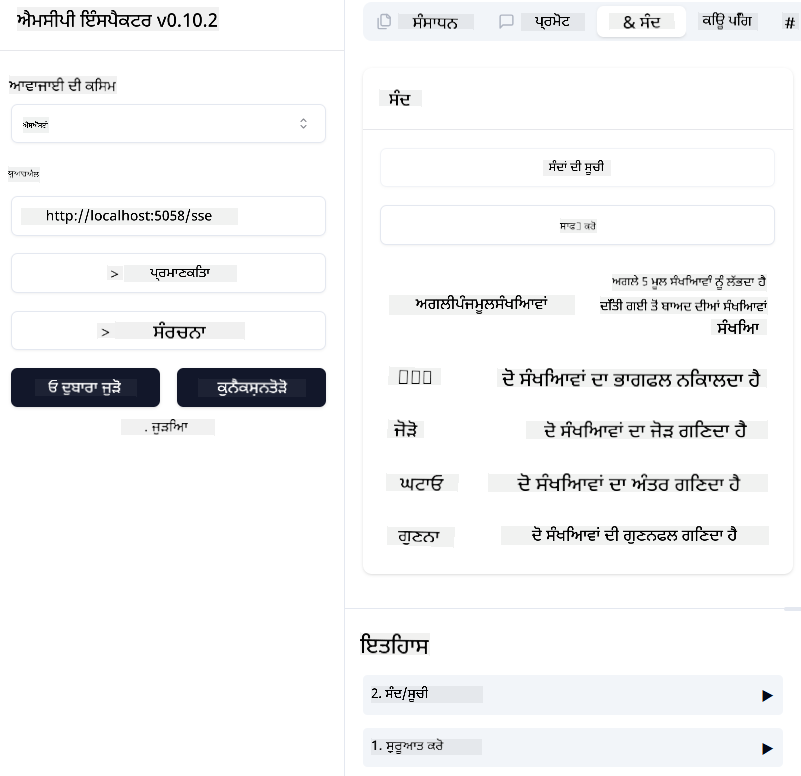

<!--
CO_OP_TRANSLATOR_METADATA:
{
  "original_hash": "5020a3e1a1c7f30c00f9e37f1fa208e3",
  "translation_date": "2025-05-17T14:07:27+00:00",
  "source_file": "04-PracticalImplementation/samples/csharp/README.md",
  "language_code": "pa"
}
-->
ਪਿਛਲੇ ਉਦਾਹਰਣ ਵਿੱਚ ਦਿਖਾਇਆ ਗਿਆ ਹੈ ਕਿ ਕਿਸ ਤਰ੍ਹਾਂ ਇੱਕ ਸਥਾਨਕ .NET ਪ੍ਰਾਜੈਕਟ ਨੂੰ `sdio` ਕਿਸਮ ਨਾਲ ਵਰਤਣਾ ਹੈ। ਅਤੇ ਕਿਸ ਤਰ੍ਹਾਂ ਸਰਵਰ ਨੂੰ ਸਥਾਨਕ ਤੌਰ 'ਤੇ ਕੰਟੇਨਰ ਵਿੱਚ ਚਲਾਉਣਾ ਹੈ। ਬਹੁਤ ਸਾਰੀਆਂ ਸਥਿਤੀਆਂ ਵਿੱਚ ਇਹ ਇੱਕ ਵਧੀਆ ਹੱਲ ਹੈ। ਹਾਲਾਂਕਿ, ਇਹ ਲਾਭਦਾਇਕ ਹੋ ਸਕਦਾ ਹੈ ਕਿ ਸਰਵਰ ਨੂੰ ਦੂਰਵਰਤੀ ਤੌਰ 'ਤੇ ਚਲਾਇਆ ਜਾਵੇ, ਜਿਵੇਂ ਕਿ ਕਲਾਉਡ ਵਾਤਾਵਰਣ ਵਿੱਚ। ਇੱਥੇ `http` ਕਿਸਮ ਦੀ ਵਰਤੋਂ ਹੁੰਦੀ ਹੈ।

`04-PracticalImplementation` ਫੋਲਡਰ ਵਿੱਚ ਹੱਲ ਨੂੰ ਦੇਖਦੇ ਹੋਏ, ਇਹ ਪਿਛਲੇ ਵਾਲੇ ਨਾਲੋਂ ਕਾਫ਼ੀ ਜਟਿਲ ਲੱਗ ਸਕਦਾ ਹੈ। ਪਰ ਅਸਲ ਵਿੱਚ, ਇਹ ਨਹੀਂ ਹੈ। ਜੇ ਤੁਸੀਂ ਪ੍ਰਾਜੈਕਟ `src/mcpserver/mcpserver.csproj` ਨੂੰ ਧਿਆਨ ਨਾਲ ਦੇਖੋ, ਤਾਂ ਤੁਹਾਨੂੰ ਪਤਾ ਲੱਗੇਗਾ ਕਿ ਇਹ ਮੁੱਖ ਤੌਰ 'ਤੇ ਪਿਛਲੇ ਉਦਾਹਰਣ ਵਾਲਾ ਹੀ ਕੋਡ ਹੈ। ਫਰਕ ਸਿਰਫ ਇਹ ਹੈ ਕਿ ਅਸੀਂ HTTP ਬੇਨਤੀ ਨੂੰ ਸੰਭਾਲਣ ਲਈ ਇੱਕ ਵੱਖਰੀ ਲਾਇਬ੍ਰੇਰੀ `ModelContextProtocol.AspNetCore` ਦੀ ਵਰਤੋਂ ਕਰ ਰਹੇ ਹਾਂ। ਅਤੇ ਅਸੀਂ ਢੰਗ ਬਦਲਦੇ ਹਾਂ `IsPrime` ਇਸਨੂੰ ਨਿੱਜੀ ਬਣਾਉਣ ਲਈ, ਸਿਰਫ ਇਹ ਦਿਖਾਉਣ ਲਈ ਕਿ ਤੁਸੀਂ ਆਪਣੇ ਕੋਡ ਵਿੱਚ ਨਿੱਜੀ ਢੰਗ ਰੱਖ ਸਕਦੇ ਹੋ। ਬਾਕੀ ਕੋਡ ਪਹਿਲਾਂ ਵਾਂਗ ਹੀ ਹੈ।

ਹੋਰ ਪ੍ਰਾਜੈਕਟ [.NET Aspire](https://learn.microsoft.com/dotnet/aspire/get-started/aspire-overview) ਤੋਂ ਹਨ। ਹੱਲ ਵਿੱਚ .NET Aspire ਨੂੰ ਰੱਖਣਾ ਵਿਕਾਸਕ ਦੇ ਤਜਰਬੇ ਨੂੰ ਵਿਕਾਸ ਅਤੇ ਟੈਸਟਿੰਗ ਦੇ ਦੌਰਾਨ ਸੁਧਾਰੇਗਾ ਅਤੇ ਦ੍ਰਿਸ਼ਮਾਨਤਾ ਵਿੱਚ ਮਦਦ ਕਰੇਗਾ। ਸਰਵਰ ਚਲਾਉਣ ਲਈ ਇਹ ਲਾਜ਼ਮੀ ਨਹੀਂ ਹੈ, ਪਰ ਇਹ ਹੱਲ ਵਿੱਚ ਰੱਖਣਾ ਇੱਕ ਵਧੀਆ ਅਭਿਆਸ ਹੈ।

## ਸਰਵਰ ਨੂੰ ਸਥਾਨਕ ਤੌਰ 'ਤੇ ਚਲਾਉਣਾ ਸ਼ੁਰੂ ਕਰੋ

1. VS Code ਤੋਂ (C# DevKit ਐਕਸਟੈਂਸ਼ਨ ਨਾਲ), ਹੱਲ `04-PracticalImplementation\samples\csharp\src\Calculator-chap4.sln` ਖੋਲ੍ਹੋ।
2. ਸਰਵਰ ਨੂੰ ਚਲਾਉਣ ਲਈ `F5` ਦਬਾਓ। ਇਸਨੂੰ .NET Aspire ਡੈਸ਼ਬੋਰਡ ਨਾਲ ਵੈਬ ਬ੍ਰਾਊਜ਼ਰ ਸ਼ੁਰੂ ਕਰਨਾ ਚਾਹੀਦਾ ਹੈ।

ਜਾਂ

1. ਇੱਕ ਟਰਮੀਨਲ ਤੋਂ, ਫੋਲਡਰ `04-PracticalImplementation\samples\csharp\src` ਵਿੱਚ ਜਾਓ
2. ਸਰਵਰ ਨੂੰ ਚਲਾਉਣ ਲਈ ਹੇਠਾਂ ਦਿੱਤੇ ਕਮਾਂਡ ਨੂੰ ਚਲਾਓ:
   ```bash
    dotnet run --project .\AppHost
   ```

3. ਡੈਸ਼ਬੋਰਡ ਤੋਂ, `http` URL ਨੂੰ ਨੋਟ ਕਰੋ। ਇਹ ਕੁਝ ਇਸ ਤਰ੍ਹਾਂ ਦਾ ਹੋਣਾ ਚਾਹੀਦਾ ਹੈ `http://localhost:5058/`.

## Test `SSE` ModelContext Protocol Inspector ਨਾਲ

ਜੇ ਤੁਹਾਡੇ ਕੋਲ Node.js 22.7.5 ਅਤੇ ਉੱਚਾ ਹੈ, ਤਾਂ ਤੁਸੀਂ ਆਪਣੇ ਸਰਵਰ ਨੂੰ ਟੈਸਟ ਕਰਨ ਲਈ ModelContext Protocol Inspector ਦੀ ਵਰਤੋਂ ਕਰ ਸਕਦੇ ਹੋ।

ਸਰਵਰ ਨੂੰ ਚਲਾਉਣਾ ਸ਼ੁਰੂ ਕਰੋ ਅਤੇ ਟਰਮੀਨਲ ਵਿੱਚ ਹੇਠਾਂ ਦਿੱਤੇ ਕਮਾਂਡ ਨੂੰ ਚਲਾਓ:

```bash
npx @modelcontextprotocol/inspector@latest
```



- `SSE` as the Transport type. SSE stand for Server-Sent Events. 
- In the Url field, enter the URL of the server noted earlier,and append `/sse` ਚੁਣੋ। ਇਹ `http` ਹੋਣਾ ਚਾਹੀਦਾ ਹੈ (ਨਹੀਂ `https`) something like `http://localhost:5058/sse`.
- select the Connect button.

A nice thing about the Inspector is that it provide a nice visibility on what is happening.

- Try listing the availables tools
- Try some of them, it should works just like before.


## Test `SSE` with Github Copilot Chat in VS Code

To use the `SSE` transport with Github Copilot Chat, change the configuration of the `mcp-calc` ਪਹਿਲਾਂ ਬਣਾਇਆ ਸਰਵਰ ਇਸ ਤਰ੍ਹਾਂ ਦੇਖਣ ਲਈ:

```json
"mcp-calc": {
    "type": "sse",
    "url": "http://localhost:5058/sse"
}
```

ਕੁਝ ਟੈਸਟ ਕਰੋ:
- 6780 ਤੋਂ ਬਾਅਦ 3 ਪ੍ਰਾਈਮ ਨੰਬਰਾਂ ਦੀ ਬੇਨਤੀ ਕਰੋ। ਨੋਟ ਕਰੋ ਕਿ Copilot ਨਵੇਂ ਸੰਦ `NextFivePrimeNumbers` ਦੀ ਵਰਤੋਂ ਕਰੇਗਾ ਅਤੇ ਸਿਰਫ ਪਹਿਲੇ 3 ਪ੍ਰਾਈਮ ਨੰਬਰ ਵਾਪਸ ਕਰੇਗਾ।
- 111 ਤੋਂ ਬਾਅਦ 7 ਪ੍ਰਾਈਮ ਨੰਬਰਾਂ ਦੀ ਬੇਨਤੀ ਕਰੋ, ਦੇਖਣ ਲਈ ਕਿ ਕੀ ਹੁੰਦਾ ਹੈ।

# ਸਰਵਰ ਨੂੰ Azure 'ਤੇ ਡਿਪਲੋਈ ਕਰੋ

ਆਓ ਸਰਵਰ ਨੂੰ Azure 'ਤੇ ਡਿਪਲੋਈ ਕਰੀਏ ਤਾਂ ਕਿ ਵਧੇਰੇ ਲੋਕ ਇਸਨੂੰ ਵਰਤ ਸਕਣ।

ਟਰਮੀਨਲ ਤੋਂ, ਫੋਲਡਰ `04-PracticalImplementation\samples\csharp\src` ਵਿੱਚ ਜਾਓ ਅਤੇ ਹੇਠਾਂ ਦਿੱਤਾ ਕਮਾਂਡ ਚਲਾਓ:

```bash
azd init
```

ਇਹ ਕੁਝ ਫਾਈਲਾਂ ਸਥਾਨਕ ਤੌਰ 'ਤੇ ਬਣਾਉਣਗਾ ਜਿਹੜੀਆਂ Azure ਸਰੋਤਾਂ ਦੀ ਸੰਰਚਨਾ ਨੂੰ ਸੇਵ ਕਰਨਗੀਆਂ, ਅਤੇ ਤੁਹਾਡਾ ਇੰਫਰਾਸਟਰਕਚਰ ਐਜ਼ ਕੋਡ (IaC)।

ਫਿਰ, ਸਰਵਰ ਨੂੰ Azure 'ਤੇ ਡਿਪਲੋਈ ਕਰਨ ਲਈ ਹੇਠਾਂ ਦਿੱਤਾ ਕਮਾਂਡ ਚਲਾਓ:

```bash
azd up
```

ਜਦੋਂ ਡਿਪਲੋਈਮੈਂਟ ਖਤਮ ਹੋ ਜਾਵੇ, ਤਾਂ ਤੁਹਾਨੂੰ ਇਸ ਤਰ੍ਹਾਂ ਦਾ ਸੁਨੇਹਾ ਵੇਖਣਾ ਚਾਹੀਦਾ ਹੈ:


Aspire ਡੈਸ਼ਬੋਰਡ ਵਿੱਚ ਜਾਓ ਅਤੇ `HTTP` URL ਨੂੰ ਨੋਟ ਕਰੋ ਤਾਂ ਕਿ ਇਸਨੂੰ MCP Inspector ਅਤੇ Github Copilot Chat ਵਿੱਚ ਵਰਤਿਆ ਜਾ ਸਕੇ।

## ਅਗਲਾ ਕੀ?

ਅਸੀਂ ਵੱਖ-ਵੱਖ ਟਰਾਂਸਪੋਰਟ ਕਿਸਮਾਂ, ਅਤੇ ਟੈਸਟਿੰਗ ਸੰਦਾਂ ਦੀ ਕੋਸ਼ਿਸ਼ ਕਰਦੇ ਹਾਂ ਅਤੇ ਅਸੀਂ ਆਪਣਾ MCP ਸਰਵਰ Azure 'ਤੇ ਡਿਪਲੋਈ ਕਰਦੇ ਹਾਂ। ਪਰ ਕੀ ਹੋਵੇ ਜੇ ਸਾਡੇ ਸਰਵਰ ਨੂੰ ਨਿੱਜੀ ਸਰੋਤਾਂ ਤੱਕ ਪਹੁੰਚ ਦੀ ਲੋੜ ਹੋਵੇ? ਉਦਾਹਰਣ ਲਈ, ਇੱਕ ਡਾਟਾਬੇਸ ਜਾਂ ਨਿੱਜੀ API? ਅਗਲੇ ਅਧਿਆਇ ਵਿੱਚ, ਅਸੀਂ ਦੇਖਾਂਗੇ ਕਿ ਕਿਵੇਂ ਅਸੀਂ ਆਪਣੇ ਸਰਵਰ ਦੀ ਸੁਰੱਖਿਆ ਨੂੰ ਸੁਧਾਰ ਸਕਦੇ ਹਾਂ।

**ਅਸਵੀਕਰਤਾ**:  
ਇਹ ਦਸਤਾਵੇਜ਼ AI ਅਨੁਵਾਦ ਸੇਵਾ [Co-op Translator](https://github.com/Azure/co-op-translator) ਦੀ ਵਰਤੋਂ ਕਰਕੇ ਅਨੁਵਾਦ ਕੀਤਾ ਗਿਆ ਹੈ। ਜਦੋਂ ਕਿ ਅਸੀਂ ਸਹੀ ਹੋਣ ਦਾ ਯਤਨ ਕਰਦੇ ਹਾਂ, ਕਿਰਪਾ ਕਰਕੇ ਸੂਚਿਤ ਰਹੋ ਕਿ ਸਵੈਚਾਲਿਤ ਅਨੁਵਾਦਾਂ ਵਿੱਚ ਗਲਤੀਆਂ ਜਾਂ ਅਸੁੱਤੀ ਦੇ ਦੋਸ਼ ਹੋ ਸਕਦੇ ਹਨ। ਮੂਲ ਦਸਤਾਵੇਜ਼ ਨੂੰ ਇਸਦੀ ਮੂਲ ਭਾਸ਼ਾ ਵਿੱਚ ਅਧਿਕਾਰਤ ਸਰੋਤ ਸਮਝਿਆ ਜਾਣਾ ਚਾਹੀਦਾ ਹੈ। ਮਹੱਤਵਪੂਰਨ ਜਾਣਕਾਰੀ ਲਈ, ਪੇਸ਼ੇਵਰ ਮਨੁੱਖੀ ਅਨੁਵਾਦ ਦੀ ਸਿਫਾਰਸ਼ ਕੀਤੀ ਜਾਂਦੀ ਹੈ। ਇਸ ਅਨੁਵਾਦ ਦੀ ਵਰਤੋਂ ਤੋਂ ਉਪਜਣ ਵਾਲੇ ਕਿਸੇ ਵੀ ਗਲਤਫਹਿਮੀ ਜਾਂ ਗਲਤ ਵਿਆਖਿਆ ਲਈ ਅਸੀਂ ਜ਼ਿੰਮੇਵਾਰ ਨਹੀਂ ਹਾਂ।