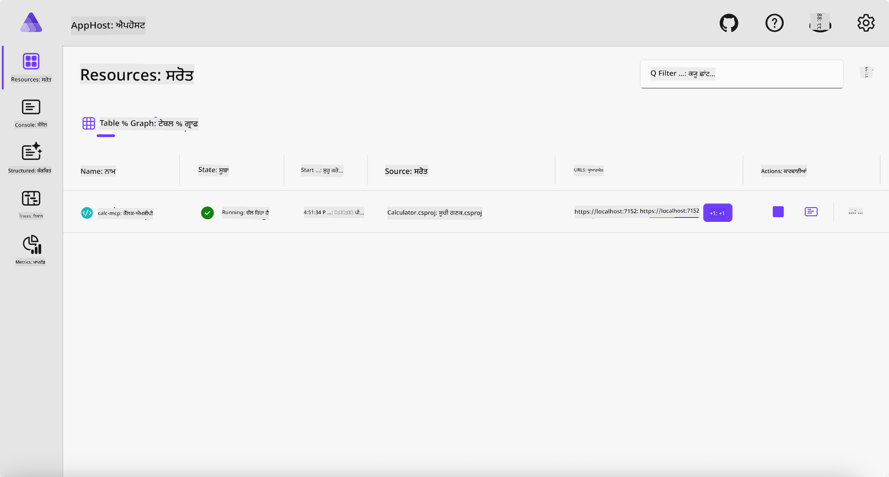
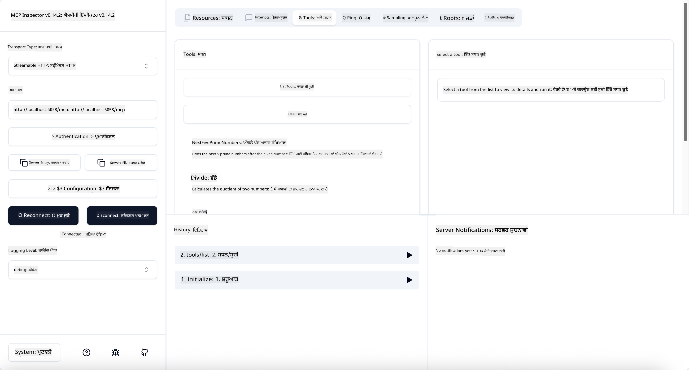
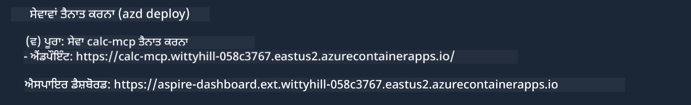

<!--
CO_OP_TRANSLATOR_METADATA:
{
  "original_hash": "0bc7bd48f55f1565f1d95ccb2c16f728",
  "translation_date": "2025-07-13T23:05:57+00:00",
  "source_file": "04-PracticalImplementation/samples/csharp/README.md",
  "language_code": "pa"
}
-->
# ਨਮੂਨਾ

ਪਿਛਲੇ ਉਦਾਹਰਨ ਵਿੱਚ ਦਿਖਾਇਆ ਗਿਆ ਹੈ ਕਿ ਕਿਵੇਂ ਇੱਕ ਲੋਕਲ .NET ਪ੍ਰੋਜੈਕਟ ਨੂੰ `stdio` ਕਿਸਮ ਨਾਲ ਵਰਤਣਾ ਹੈ। ਅਤੇ ਕਿਵੇਂ ਸਰਵਰ ਨੂੰ ਲੋਕਲ ਕੰਟੇਨਰ ਵਿੱਚ ਚਲਾਇਆ ਜਾ ਸਕਦਾ ਹੈ। ਇਹ ਕਈ ਸਥਿਤੀਆਂ ਵਿੱਚ ਇੱਕ ਵਧੀਆ ਹੱਲ ਹੈ। ਪਰ, ਕਈ ਵਾਰ ਸਰਵਰ ਨੂੰ ਦੂਰ-ਦਰਾਜ਼, ਜਿਵੇਂ ਕਿ ਕਲਾਉਡ ਵਾਤਾਵਰਣ ਵਿੱਚ ਚਲਾਉਣਾ ਲਾਭਦਾਇਕ ਹੋ ਸਕਦਾ ਹੈ। ਇੱਥੇ `http` ਕਿਸਮ ਕੰਮ ਆਉਂਦੀ ਹੈ।

`04-PracticalImplementation` ਫੋਲਡਰ ਵਿੱਚ ਹੱਲ ਨੂੰ ਵੇਖਦੇ ਹੋਏ, ਇਹ ਪਹਿਲਾਂ ਵਾਲੇ ਨਾਲੋਂ ਕਾਫੀ ਜ਼ਿਆਦਾ ਜਟਿਲ ਲੱਗ ਸਕਦਾ ਹੈ। ਪਰ ਅਸਲ ਵਿੱਚ, ਇਹ ਨਹੀਂ ਹੈ। ਜੇ ਤੁਸੀਂ ਪ੍ਰੋਜੈਕਟ `src/Calculator` ਨੂੰ ਧਿਆਨ ਨਾਲ ਵੇਖੋਗੇ, ਤਾਂ ਤੁਹਾਨੂੰ ਪਤਾ ਲੱਗੇਗਾ ਕਿ ਇਹ ਜ਼ਿਆਦਾਤਰ ਪਹਿਲਾਂ ਵਾਲੇ ਕੋਡ ਵਰਗਾ ਹੀ ਹੈ। ਸਿਰਫ ਫਰਕ ਇਹ ਹੈ ਕਿ ਅਸੀਂ HTTP ਬੇਨਤੀਆਂ ਨੂੰ ਸੰਭਾਲਣ ਲਈ ਇੱਕ ਵੱਖਰੀ ਲਾਇਬ੍ਰੇਰੀ `ModelContextProtocol.AspNetCore` ਵਰਤ ਰਹੇ ਹਾਂ। ਅਤੇ ਅਸੀਂ `IsPrime` ਮੈਥਡ ਨੂੰ ਪ੍ਰਾਈਵੇਟ ਬਣਾਉਂਦੇ ਹਾਂ, ਸਿਰਫ ਇਹ ਦਿਖਾਉਣ ਲਈ ਕਿ ਤੁਹਾਡੇ ਕੋਡ ਵਿੱਚ ਪ੍ਰਾਈਵੇਟ ਮੈਥਡ ਹੋ ਸਕਦੇ ਹਨ। ਬਾਕੀ ਸਾਰਾ ਕੋਡ ਪਹਿਲਾਂ ਵਰਗਾ ਹੀ ਹੈ।

ਹੋਰ ਪ੍ਰੋਜੈਕਟ [.NET Aspire](https://learn.microsoft.com/dotnet/aspire/get-started/aspire-overview) ਤੋਂ ਹਨ। ਹੱਲ ਵਿੱਚ .NET Aspire ਹੋਣ ਨਾਲ ਡਿਵੈਲਪਰ ਦੇ ਵਿਕਾਸ ਅਤੇ ਟੈਸਟਿੰਗ ਦੇ ਤਜਰਬੇ ਵਿੱਚ ਸੁਧਾਰ ਆਉਂਦਾ ਹੈ ਅਤੇ ਨਿਗਰਾਨੀ ਵਿੱਚ ਮਦਦ ਮਿਲਦੀ ਹੈ। ਸਰਵਰ ਚਲਾਉਣ ਲਈ ਇਹ ਜ਼ਰੂਰੀ ਨਹੀਂ ਹੈ, ਪਰ ਇਹ ਤੁਹਾਡੇ ਹੱਲ ਵਿੱਚ ਹੋਣਾ ਇੱਕ ਵਧੀਆ ਅਭਿਆਸ ਹੈ।

## ਸਰਵਰ ਨੂੰ ਲੋਕਲ ਚਲਾਉਣਾ

1. VS Code (C# DevKit ਐਕਸਟੈਂਸ਼ਨ ਨਾਲ) ਵਿੱਚ `04-PracticalImplementation/samples/csharp` ਡਾਇਰੈਕਟਰੀ ਵਿੱਚ ਜਾਓ।
1. ਸਰਵਰ ਸ਼ੁਰੂ ਕਰਨ ਲਈ ਹੇਠਾਂ ਦਿੱਤਾ ਕਮਾਂਡ ਚਲਾਓ:

   ```bash
    dotnet watch run --project ./src/AppHost
   ```

1. ਜਦੋਂ ਕੋਈ ਵੈੱਬ ਬ੍ਰਾਊਜ਼ਰ .NET Aspire ਡੈਸ਼ਬੋਰਡ ਖੋਲ੍ਹਦਾ ਹੈ, ਤਾਂ `http` URL ਨੂੰ ਨੋਟ ਕਰੋ। ਇਹ ਕੁਝ ਇਸ ਤਰ੍ਹਾਂ ਹੋਣਾ ਚਾਹੀਦਾ ਹੈ: `http://localhost:5058/`।

   

## MCP ਇੰਸਪੈਕਟਰ ਨਾਲ Streamable HTTP ਦੀ ਜਾਂਚ ਕਰੋ

ਜੇ ਤੁਹਾਡੇ ਕੋਲ Node.js 22.7.5 ਜਾਂ ਇਸ ਤੋਂ ਉੱਚਾ ਵਰਜਨ ਹੈ, ਤਾਂ ਤੁਸੀਂ MCP ਇੰਸਪੈਕਟਰ ਦੀ ਵਰਤੋਂ ਕਰਕੇ ਆਪਣੇ ਸਰਵਰ ਦੀ ਜਾਂਚ ਕਰ ਸਕਦੇ ਹੋ।

ਸਰਵਰ ਸ਼ੁਰੂ ਕਰੋ ਅਤੇ ਟਰਮੀਨਲ ਵਿੱਚ ਹੇਠਾਂ ਦਿੱਤਾ ਕਮਾਂਡ ਚਲਾਓ:

```bash
npx @modelcontextprotocol/inspector http://localhost:5058
```



- ਟਰਾਂਸਪੋਰਟ ਕਿਸਮ ਵਜੋਂ `Streamable HTTP` ਚੁਣੋ।
- Url ਫੀਲਡ ਵਿੱਚ ਪਹਿਲਾਂ ਨੋਟ ਕੀਤਾ ਸਰਵਰ ਦਾ URL ਦਾਖਲ ਕਰੋ ਅਤੇ `/mcp` ਜੋੜੋ। ਇਹ `http` (ਨਾ ਕਿ `https`) ਹੋਣਾ ਚਾਹੀਦਾ ਹੈ, ਕੁਝ ਇਸ ਤਰ੍ਹਾਂ: `http://localhost:5058/mcp`।
- Connect ਬਟਨ 'ਤੇ ਕਲਿੱਕ ਕਰੋ।

ਇੰਸਪੈਕਟਰ ਦੀ ਇੱਕ ਵਧੀਆ ਗੱਲ ਇਹ ਹੈ ਕਿ ਇਹ ਜੋ ਕੁਝ ਹੋ ਰਿਹਾ ਹੈ ਉਸ ਦੀ ਵਧੀਆ ਦਿੱਖ ਦਿੰਦਾ ਹੈ।

- ਉਪਲਬਧ ਟੂਲਾਂ ਦੀ ਸੂਚੀ ਬਣਾਉਣ ਦੀ ਕੋਸ਼ਿਸ਼ ਕਰੋ
- ਕੁਝ ਟੂਲਾਂ ਦੀ ਜਾਂਚ ਕਰੋ, ਇਹ ਪਹਿਲਾਂ ਵਾਂਗ ਹੀ ਕੰਮ ਕਰਨਗੇ।

## VS Code ਵਿੱਚ GitHub Copilot Chat ਨਾਲ MCP ਸਰਵਰ ਦੀ ਜਾਂਚ ਕਰੋ

GitHub Copilot Chat ਨਾਲ Streamable HTTP ਟਰਾਂਸਪੋਰਟ ਵਰਤਣ ਲਈ, ਪਹਿਲਾਂ ਬਣਾਏ ਗਏ `calc-mcp` ਸਰਵਰ ਦੀ ਸੰਰਚਨਾ ਨੂੰ ਇਸ ਤਰ੍ਹਾਂ ਬਦਲੋ:

```jsonc
// .vscode/mcp.json
{
  "servers": {
    "calc-mcp": {
      "type": "http",
      "url": "http://localhost:5058/mcp"
    }
  }
}
```

ਕੁਝ ਟੈਸਟ ਕਰੋ:

- "3 prime numbers after 6780" ਪੁੱਛੋ। ਦੇਖੋ ਕਿ Copilot ਨਵੇਂ ਟੂਲ `NextFivePrimeNumbers` ਦੀ ਵਰਤੋਂ ਕਰਦਾ ਹੈ ਅਤੇ ਸਿਰਫ ਪਹਿਲੇ 3 ਪ੍ਰਾਈਮ ਨੰਬਰ ਵਾਪਸ ਕਰਦਾ ਹੈ।
- "7 prime numbers after 111" ਪੁੱਛੋ, ਦੇਖੋ ਕੀ ਹੁੰਦਾ ਹੈ।
- "John ਕੋਲ 24 ਲੌਲੀਜ਼ ਹਨ ਅਤੇ ਉਹ ਆਪਣੇ 3 ਬੱਚਿਆਂ ਵਿੱਚ ਇਹ ਸਾਰੀਆਂ ਵੰਡਣਾ ਚਾਹੁੰਦਾ ਹੈ। ਹਰ ਬੱਚੇ ਕੋਲ ਕਿੰਨੀਆਂ ਲੌਲੀਜ਼ ਹੋਣਗੀਆਂ?" ਪੁੱਛੋ, ਦੇਖੋ ਕੀ ਹੁੰਦਾ ਹੈ।

## ਸਰਵਰ ਨੂੰ Azure 'ਤੇ ਡਿਪਲੋਇ ਕਰੋ

ਆਓ ਸਰਵਰ ਨੂੰ Azure 'ਤੇ ਡਿਪਲੋਇ ਕਰੀਏ ਤਾਂ ਜੋ ਹੋਰ ਲੋਕ ਇਸਦਾ ਇਸਤੇਮਾਲ ਕਰ ਸਕਣ।

ਟਰਮੀਨਲ ਤੋਂ `04-PracticalImplementation/samples/csharp` ਫੋਲਡਰ ਵਿੱਚ ਜਾਓ ਅਤੇ ਹੇਠਾਂ ਦਿੱਤਾ ਕਮਾਂਡ ਚਲਾਓ:

```bash
azd up
```

ਜਦੋਂ ਡਿਪਲੋਇਮੈਂਟ ਮੁਕੰਮਲ ਹੋ ਜਾਵੇ, ਤਾਂ ਤੁਹਾਨੂੰ ਕੁਝ ਇਸ ਤਰ੍ਹਾਂ ਦਾ ਸੁਨੇਹਾ ਵੇਖਾਈ ਦੇਵੇਗਾ:



URL ਲੈ ਕੇ ਇਸਨੂੰ MCP ਇੰਸਪੈਕਟਰ ਅਤੇ GitHub Copilot Chat ਵਿੱਚ ਵਰਤੋ।

```jsonc
// .vscode/mcp.json
{
  "servers": {
    "calc-mcp": {
      "type": "http",
      "url": "https://calc-mcp.gentleriver-3977fbcf.australiaeast.azurecontainerapps.io/mcp"
    }
  }
}
```

## ਅਗਲਾ ਕੀ ਹੈ?

ਅਸੀਂ ਵੱਖ-ਵੱਖ ਟਰਾਂਸਪੋਰਟ ਕਿਸਮਾਂ ਅਤੇ ਟੈਸਟਿੰਗ ਟੂਲਾਂ ਦੀ ਕੋਸ਼ਿਸ਼ ਕਰਦੇ ਹਾਂ। ਅਸੀਂ ਤੁਹਾਡੇ MCP ਸਰਵਰ ਨੂੰ Azure 'ਤੇ ਡਿਪਲੋਇ ਵੀ ਕਰਦੇ ਹਾਂ। ਪਰ ਜੇ ਸਾਡਾ ਸਰਵਰ ਪ੍ਰਾਈਵੇਟ ਸਰੋਤਾਂ ਤੱਕ ਪਹੁੰਚਣਾ ਚਾਹੁੰਦਾ ਹੈ? ਉਦਾਹਰਨ ਵਜੋਂ, ਕੋਈ ਡੇਟਾਬੇਸ ਜਾਂ ਪ੍ਰਾਈਵੇਟ API? ਅਗਲੇ ਅਧਿਆਇ ਵਿੱਚ, ਅਸੀਂ ਵੇਖਾਂਗੇ ਕਿ ਅਸੀਂ ਆਪਣੇ ਸਰਵਰ ਦੀ ਸੁਰੱਖਿਆ ਕਿਵੇਂ ਸੁਧਾਰ ਸਕਦੇ ਹਾਂ।

**ਅਸਵੀਕਾਰੋਪਣ**:  
ਇਹ ਦਸਤਾਵੇਜ਼ AI ਅਨੁਵਾਦ ਸੇਵਾ [Co-op Translator](https://github.com/Azure/co-op-translator) ਦੀ ਵਰਤੋਂ ਕਰਕੇ ਅਨੁਵਾਦਿਤ ਕੀਤਾ ਗਿਆ ਹੈ। ਜਦੋਂ ਕਿ ਅਸੀਂ ਸਹੀਤਾ ਲਈ ਕੋਸ਼ਿਸ਼ ਕਰਦੇ ਹਾਂ, ਕਿਰਪਾ ਕਰਕੇ ਧਿਆਨ ਰੱਖੋ ਕਿ ਸਵੈਚਾਲਿਤ ਅਨੁਵਾਦਾਂ ਵਿੱਚ ਗਲਤੀਆਂ ਜਾਂ ਅਸਮਰਥਤਾਵਾਂ ਹੋ ਸਕਦੀਆਂ ਹਨ। ਮੂਲ ਦਸਤਾਵੇਜ਼ ਆਪਣੀ ਮੂਲ ਭਾਸ਼ਾ ਵਿੱਚ ਪ੍ਰਮਾਣਿਕ ਸਰੋਤ ਮੰਨਿਆ ਜਾਣਾ ਚਾਹੀਦਾ ਹੈ। ਮਹੱਤਵਪੂਰਨ ਜਾਣਕਾਰੀ ਲਈ, ਪੇਸ਼ੇਵਰ ਮਨੁੱਖੀ ਅਨੁਵਾਦ ਦੀ ਸਿਫਾਰਸ਼ ਕੀਤੀ ਜਾਂਦੀ ਹੈ। ਅਸੀਂ ਇਸ ਅਨੁਵਾਦ ਦੀ ਵਰਤੋਂ ਤੋਂ ਉਤਪੰਨ ਕਿਸੇ ਵੀ ਗਲਤਫਹਿਮੀ ਜਾਂ ਗਲਤ ਵਿਆਖਿਆ ਲਈ ਜ਼ਿੰਮੇਵਾਰ ਨਹੀਂ ਹਾਂ।