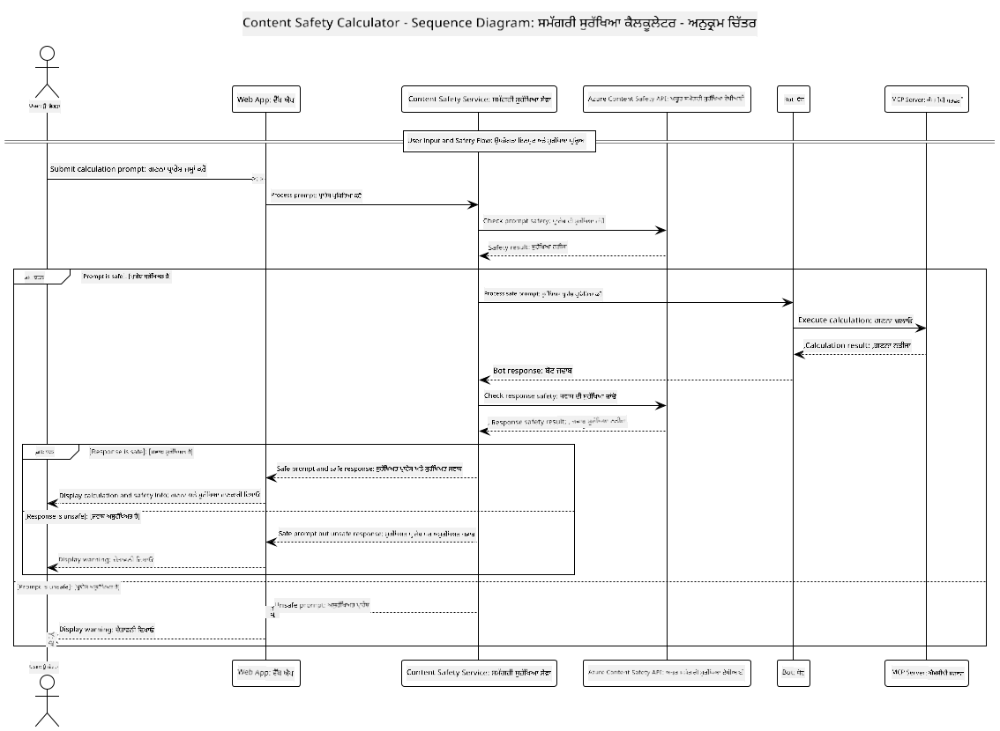

<!--
CO_OP_TRANSLATOR_METADATA:
{
  "original_hash": "e5ea5e7582f70008ea9bec3b3820f20a",
  "translation_date": "2025-07-13T23:14:54+00:00",
  "source_file": "04-PracticalImplementation/samples/java/containerapp/README.md",
  "language_code": "pa"
}
-->
## ਸਿਸਟਮ ਆਰਕੀਟੈਕਚਰ

ਇਹ ਪ੍ਰੋਜੈਕਟ ਇੱਕ ਵੈੱਬ ਐਪਲੀਕੇਸ਼ਨ ਨੂੰ ਦਰਸਾਉਂਦਾ ਹੈ ਜੋ ਯੂਜ਼ਰ ਦੇ ਪ੍ਰਾਂਪਟ ਨੂੰ ਕੈਲਕੂਲੇਟਰ ਸਰਵਿਸ ਨੂੰ ਭੇਜਣ ਤੋਂ ਪਹਿਲਾਂ ਸਮੱਗਰੀ ਸੁਰੱਖਿਆ ਜਾਂਚ ਕਰਦਾ ਹੈ, ਜੋ Model Context Protocol (MCP) ਰਾਹੀਂ ਕੰਮ ਕਰਦਾ ਹੈ।



### ਇਹ ਕਿਵੇਂ ਕੰਮ ਕਰਦਾ ਹੈ

1. **ਯੂਜ਼ਰ ਇਨਪੁੱਟ**: ਯੂਜ਼ਰ ਵੈੱਬ ਇੰਟਰਫੇਸ ਵਿੱਚ ਗਣਨਾ ਦਾ ਪ੍ਰਾਂਪਟ ਦਾਖਲ ਕਰਦਾ ਹੈ  
2. **ਸਮੱਗਰੀ ਸੁਰੱਖਿਆ ਸਕ੍ਰੀਨਿੰਗ (ਇਨਪੁੱਟ)**: ਪ੍ਰਾਂਪਟ ਨੂੰ Azure Content Safety API ਦੁਆਰਾ ਵਿਸ਼ਲੇਸ਼ਣ ਕੀਤਾ ਜਾਂਦਾ ਹੈ  
3. **ਸੁਰੱਖਿਆ ਫੈਸਲਾ (ਇਨਪੁੱਟ)**:  
   - ਜੇ ਸਮੱਗਰੀ ਸੁਰੱਖਿਅਤ ਹੈ (ਸ severity < 2 ਸਾਰੇ ਸ਼੍ਰੇਣੀਆਂ ਵਿੱਚ), ਤਾਂ ਇਹ ਕੈਲਕੂਲੇਟਰ ਵੱਲ ਅੱਗੇ ਵਧਦੀ ਹੈ  
   - ਜੇ ਸਮੱਗਰੀ ਸੰਭਾਵਿਤ ਤੌਰ 'ਤੇ ਨੁਕਸਾਨਦਾਇਕ ਹੈ, ਤਾਂ ਪ੍ਰਕਿਰਿਆ ਰੁਕ ਜਾਂਦੀ ਹੈ ਅਤੇ ਚੇਤਾਵਨੀ ਵਾਪਸ ਕੀਤੀ ਜਾਂਦੀ ਹੈ  
4. **ਕੈਲਕੂਲੇਟਰ ਇੰਟੀਗ੍ਰੇਸ਼ਨ**: ਸੁਰੱਖਿਅਤ ਸਮੱਗਰੀ ਨੂੰ LangChain4j ਦੁਆਰਾ ਪ੍ਰਕਿਰਿਆ ਕੀਤਾ ਜਾਂਦਾ ਹੈ, ਜੋ MCP ਕੈਲਕੂਲੇਟਰ ਸਰਵਰ ਨਾਲ ਸੰਚਾਰ ਕਰਦਾ ਹੈ  
5. **ਸਮੱਗਰੀ ਸੁਰੱਖਿਆ ਸਕ੍ਰੀਨਿੰਗ (ਆਉਟਪੁੱਟ)**: ਬੋਟ ਦੇ ਜਵਾਬ ਨੂੰ Azure Content Safety API ਦੁਆਰਾ ਵਿਸ਼ਲੇਸ਼ਣ ਕੀਤਾ ਜਾਂਦਾ ਹੈ  
6. **ਸੁਰੱਖਿਆ ਫੈਸਲਾ (ਆਉਟਪੁੱਟ)**:  
   - ਜੇ ਬੋਟ ਦਾ ਜਵਾਬ ਸੁਰੱਖਿਅਤ ਹੈ, ਤਾਂ ਇਹ ਯੂਜ਼ਰ ਨੂੰ ਦਿਖਾਇਆ ਜਾਂਦਾ ਹੈ  
   - ਜੇ ਬੋਟ ਦਾ ਜਵਾਬ ਸੰਭਾਵਿਤ ਤੌਰ 'ਤੇ ਨੁਕਸਾਨਦਾਇਕ ਹੈ, ਤਾਂ ਇਸ ਨੂੰ ਚੇਤਾਵਨੀ ਨਾਲ ਬਦਲ ਦਿੱਤਾ ਜਾਂਦਾ ਹੈ  
7. **ਜਵਾਬ**: ਨਤੀਜੇ (ਜੇ ਸੁਰੱਖਿਅਤ ਹੋਣ) ਯੂਜ਼ਰ ਨੂੰ ਦੋਹਾਂ ਸੁਰੱਖਿਆ ਵਿਸ਼ਲੇਸ਼ਣਾਂ ਦੇ ਨਾਲ ਦਿਖਾਏ ਜਾਂਦੇ ਹਨ  

## Model Context Protocol (MCP) ਨਾਲ ਕੈਲਕੂਲੇਟਰ ਸਰਵਿਸਜ਼ ਦੀ ਵਰਤੋਂ

ਇਹ ਪ੍ਰੋਜੈਕਟ ਦਰਸਾਉਂਦਾ ਹੈ ਕਿ ਕਿਵੇਂ Model Context Protocol (MCP) ਦੀ ਵਰਤੋਂ ਕਰਕੇ LangChain4j ਤੋਂ ਕੈਲਕੂਲੇਟਰ MCP ਸਰਵਿਸਜ਼ ਨੂੰ ਕਾਲ ਕੀਤਾ ਜਾ ਸਕਦਾ ਹੈ। ਇਸ ਵਿੱਚ ਇੱਕ ਲੋਕਲ MCP ਸਰਵਰ ਜੋ ਪੋਰਟ 8080 'ਤੇ ਚੱਲ ਰਿਹਾ ਹੈ, ਕੈਲਕੂਲੇਟਰ ਓਪਰੇਸ਼ਨਾਂ ਲਈ ਵਰਤਿਆ ਜਾਂਦਾ ਹੈ।

### Azure Content Safety ਸਰਵਿਸ ਸੈਟਅੱਪ ਕਰਨਾ

ਸਮੱਗਰੀ ਸੁਰੱਖਿਆ ਫੀਚਰਾਂ ਦੀ ਵਰਤੋਂ ਕਰਨ ਤੋਂ ਪਹਿਲਾਂ, ਤੁਹਾਨੂੰ Azure Content Safety ਸਰਵਿਸ ਰਿਸੋਰਸ ਬਣਾਉਣਾ ਪਵੇਗਾ:

1. [Azure Portal](https://portal.azure.com) ਵਿੱਚ ਸਾਈਨ ਇਨ ਕਰੋ  
2. "Create a resource" 'ਤੇ ਕਲਿੱਕ ਕਰੋ ਅਤੇ "Content Safety" ਖੋਜੋ  
3. "Content Safety" ਚੁਣੋ ਅਤੇ "Create" 'ਤੇ ਕਲਿੱਕ ਕਰੋ  
4. ਆਪਣੇ ਰਿਸੋਰਸ ਲਈ ਇੱਕ ਵਿਲੱਖਣ ਨਾਮ ਦਿਓ  
5. ਆਪਣੀ ਸਬਸਕ੍ਰਿਪਸ਼ਨ ਅਤੇ ਰਿਸੋਰਸ ਗਰੁੱਪ ਚੁਣੋ (ਜਾਂ ਨਵਾਂ ਬਣਾਓ)  
6. ਇੱਕ ਸਮਰਥਿਤ ਖੇਤਰ ਚੁਣੋ ([Region availability](https://azure.microsoft.com/en-us/global-infrastructure/services/?products=cognitive-services) ਵੇਖੋ)  
7. ਇੱਕ ਉਚਿਤ ਪ੍ਰਾਈਸਿੰਗ ਟੀਅਰ ਚੁਣੋ  
8. "Create" 'ਤੇ ਕਲਿੱਕ ਕਰਕੇ ਰਿਸੋਰਸ ਤਿਆਰ ਕਰੋ  
9. ਤਿਆਰੀ ਪੂਰੀ ਹੋਣ 'ਤੇ "Go to resource" 'ਤੇ ਕਲਿੱਕ ਕਰੋ  
10. ਖੱਬੇ ਪੈਨ ਵਿੱਚ "Resource Management" ਹੇਠਾਂ "Keys and Endpoint" ਚੁਣੋ  
11. ਅਗਲੇ ਕਦਮ ਲਈ ਕਿਸੇ ਵੀ ਇੱਕ ਕੀ ਅਤੇ ਐਂਡਪੌਇੰਟ URL ਨੂੰ ਕਾਪੀ ਕਰੋ  

### Environment Variables ਦੀ ਸੰਰਚਨਾ

GitHub ਮਾਡਲਾਂ ਦੀ ਪ੍ਰਮਾਣਿਕਤਾ ਲਈ `GITHUB_TOKEN` environment variable ਸੈੱਟ ਕਰੋ:  
```sh
export GITHUB_TOKEN=<your_github_token>
```

ਸਮੱਗਰੀ ਸੁਰੱਖਿਆ ਫੀਚਰਾਂ ਲਈ, ਇਹ ਸੈੱਟ ਕਰੋ:  
```sh
export CONTENT_SAFETY_ENDPOINT=<your_content_safety_endpoint>
export CONTENT_SAFETY_KEY=<your_content_safety_key>
```

ਇਹ environment variables ਐਪਲੀਕੇਸ਼ਨ ਦੁਆਰਾ Azure Content Safety ਸਰਵਿਸ ਨਾਲ ਪ੍ਰਮਾਣਿਕਤਾ ਲਈ ਵਰਤੇ ਜਾਂਦੇ ਹਨ। ਜੇ ਇਹ variables ਸੈੱਟ ਨਹੀਂ ਕੀਤੇ ਜਾਂਦੇ, ਤਾਂ ਐਪਲੀਕੇਸ਼ਨ ਡੈਮੋ ਲਈ placeholder ਮੁੱਲ ਵਰਤੇਗਾ, ਪਰ ਸਮੱਗਰੀ ਸੁਰੱਖਿਆ ਫੀਚਰ ਠੀਕ ਤਰ੍ਹਾਂ ਕੰਮ ਨਹੀਂ ਕਰਨਗੇ।

### ਕੈਲਕੂਲੇਟਰ MCP ਸਰਵਰ ਸ਼ੁਰੂ ਕਰਨਾ

ਕਲਾਇੰਟ ਚਲਾਉਣ ਤੋਂ ਪਹਿਲਾਂ, ਤੁਹਾਨੂੰ localhost:8080 'ਤੇ SSE ਮੋਡ ਵਿੱਚ ਕੈਲਕੂਲੇਟਰ MCP ਸਰਵਰ ਸ਼ੁਰੂ ਕਰਨਾ ਪਵੇਗਾ।

## ਪ੍ਰੋਜੈਕਟ ਦਾ ਵੇਰਵਾ

ਇਹ ਪ੍ਰੋਜੈਕਟ LangChain4j ਨਾਲ Model Context Protocol (MCP) ਦੇ ਇੰਟੀਗ੍ਰੇਸ਼ਨ ਨੂੰ ਦਰਸਾਉਂਦਾ ਹੈ ਤਾਂ ਜੋ ਕੈਲਕੂਲੇਟਰ ਸਰਵਿਸਜ਼ ਨੂੰ ਕਾਲ ਕੀਤਾ ਜਾ ਸਕੇ। ਮੁੱਖ ਫੀਚਰ ਹਨ:

- MCP ਦੀ ਵਰਤੋਂ ਕਰਕੇ ਬੁਨਿਆਦੀ ਗਣਿਤੀ ਓਪਰੇਸ਼ਨਾਂ ਲਈ ਕੈਲਕੂਲੇਟਰ ਸਰਵਿਸ ਨਾਲ ਜੁੜਨਾ  
- ਯੂਜ਼ਰ ਪ੍ਰਾਂਪਟ ਅਤੇ ਬੋਟ ਜਵਾਬ ਦੋਹਾਂ 'ਤੇ ਦੋਹਰੀ ਸੁਰੱਖਿਆ ਜਾਂਚ  
- GitHub ਦੇ gpt-4.1-nano ਮਾਡਲ ਨਾਲ LangChain4j ਰਾਹੀਂ ਇੰਟੀਗ੍ਰੇਸ਼ਨ  
- MCP ਟ੍ਰਾਂਸਪੋਰਟ ਲਈ Server-Sent Events (SSE) ਦੀ ਵਰਤੋਂ  

## ਸਮੱਗਰੀ ਸੁਰੱਖਿਆ ਇੰਟੀਗ੍ਰੇਸ਼ਨ

ਪ੍ਰੋਜੈਕਟ ਵਿੱਚ ਵਿਸ਼ਤ੍ਰਿਤ ਸਮੱਗਰੀ ਸੁਰੱਖਿਆ ਫੀਚਰ ਸ਼ਾਮਲ ਹਨ, ਜੋ ਯਕੀਨੀ ਬਣਾਉਂਦੇ ਹਨ ਕਿ ਯੂਜ਼ਰ ਇਨਪੁੱਟ ਅਤੇ ਸਿਸਟਮ ਜਵਾਬ ਦੋਹਾਂ ਨੁਕਸਾਨਦਾਇਕ ਸਮੱਗਰੀ ਤੋਂ ਮੁਕਤ ਹਨ:

1. **ਇਨਪੁੱਟ ਸਕ੍ਰੀਨਿੰਗ**: ਸਾਰੇ ਯੂਜ਼ਰ ਪ੍ਰਾਂਪਟ ਨੂੰ ਨਫਰਤ ਭਾਸ਼ਾ, ਹਿੰਸਾ, ਸਵੈ-ਹਾਨੀ ਅਤੇ ਯੌਨ ਸਮੱਗਰੀ ਵਰਗੀਆਂ ਨੁਕਸਾਨਦਾਇਕ ਸ਼੍ਰੇਣੀਆਂ ਲਈ ਜਾਂਚਿਆ ਜਾਂਦਾ ਹੈ।  
2. **ਆਉਟਪੁੱਟ ਸਕ੍ਰੀਨਿੰਗ**: ਸੰਭਾਵਿਤ ਤੌਰ 'ਤੇ ਅਨਸੈਂਸਰਡ ਮਾਡਲਾਂ ਦੀ ਵਰਤੋਂ ਹੋਣ ਦੇ ਬਾਵਜੂਦ, ਸਾਰੇ ਬਣਾਏ ਗਏ ਜਵਾਬ ਸਮੱਗਰੀ ਸੁਰੱਖਿਆ ਫਿਲਟਰਾਂ ਰਾਹੀਂ ਜਾਂਚੇ ਜਾਂਦੇ ਹਨ, ਫਿਰ ਹੀ ਯੂਜ਼ਰ ਨੂੰ ਦਿਖਾਏ ਜਾਂਦੇ ਹਨ।  

ਇਹ ਦੋਹਰੀ ਪਰਤ ਦਾ ਤਰੀਕਾ ਇਹ ਯਕੀਨੀ ਬਣਾਉਂਦਾ ਹੈ ਕਿ ਸਿਸਟਮ ਸੁਰੱਖਿਅਤ ਰਹੇ, ਭਾਵੇਂ ਕਿਸੇ ਵੀ AI ਮਾਡਲ ਦੀ ਵਰਤੋਂ ਕੀਤੀ ਜਾ ਰਹੀ ਹੋਵੇ, ਅਤੇ ਯੂਜ਼ਰਾਂ ਨੂੰ ਨੁਕਸਾਨਦਾਇਕ ਇਨਪੁੱਟ ਅਤੇ ਸੰਭਾਵਿਤ ਸਮੱਸਿਆ ਵਾਲੇ AI-ਜਨਰੇਟ ਕੀਤੇ ਜਵਾਬਾਂ ਤੋਂ ਬਚਾਉਂਦਾ ਹੈ।

## ਵੈੱਬ ਕਲਾਇੰਟ

ਐਪਲੀਕੇਸ਼ਨ ਵਿੱਚ ਇੱਕ ਯੂਜ਼ਰ-ਮਿੱਤਰ ਵੈੱਬ ਇੰਟਰਫੇਸ ਸ਼ਾਮਲ ਹੈ ਜੋ ਯੂਜ਼ਰਾਂ ਨੂੰ Content Safety Calculator ਸਿਸਟਮ ਨਾਲ ਇੰਟਰੈਕਟ ਕਰਨ ਦੀ ਆਸਾਨੀ ਦਿੰਦਾ ਹੈ:

### ਵੈੱਬ ਇੰਟਰਫੇਸ ਫੀਚਰ

- ਗਣਨਾ ਦੇ ਪ੍ਰਾਂਪਟ ਦਾਖਲ ਕਰਨ ਲਈ ਸਧਾਰਣ ਅਤੇ ਸਮਝਣ ਵਿੱਚ ਆਸਾਨ ਫਾਰਮ  
- ਦੋਹਰੀ ਸਮੱਗਰੀ ਸੁਰੱਖਿਆ ਵੈਰੀਫਿਕੇਸ਼ਨ (ਇਨਪੁੱਟ ਅਤੇ ਆਉਟਪੁੱਟ)  
- ਪ੍ਰਾਂਪਟ ਅਤੇ ਜਵਾਬ ਦੀ ਸੁਰੱਖਿਆ ਬਾਰੇ ਤੁਰੰਤ ਫੀਡਬੈਕ  
- ਆਸਾਨ ਸਮਝ ਲਈ ਰੰਗ-ਕੋਡ ਕੀਤੇ ਸੁਰੱਖਿਆ ਸੰਕੇਤਕ  
- ਵੱਖ-ਵੱਖ ਡਿਵਾਈਸਾਂ 'ਤੇ ਚੰਗੀ ਤਰ੍ਹਾਂ ਕੰਮ ਕਰਨ ਵਾਲਾ ਸਾਫ਼ ਅਤੇ ਜਵਾਬਦੇਹ ਡਿਜ਼ਾਈਨ  
- ਯੂਜ਼ਰਾਂ ਨੂੰ ਮਦਦ ਕਰਨ ਲਈ ਸੁਰੱਖਿਅਤ ਉਦਾਹਰਨ ਪ੍ਰਾਂਪਟ  

### ਵੈੱਬ ਕਲਾਇੰਟ ਦੀ ਵਰਤੋਂ

1. ਐਪਲੀਕੇਸ਼ਨ ਸ਼ੁਰੂ ਕਰੋ:  
   ```sh
   mvn spring-boot:run
   ```

2. ਆਪਣੇ ਬ੍ਰਾਊਜ਼ਰ ਵਿੱਚ ਜਾ ਕੇ `http://localhost:8087` ਖੋਲ੍ਹੋ  

3. ਦਿੱਤੇ ਗਏ ਟੈਕਸਟ ਖੇਤਰ ਵਿੱਚ ਗਣਨਾ ਦਾ ਪ੍ਰਾਂਪਟ ਦਾਖਲ ਕਰੋ (ਜਿਵੇਂ, "Calculate the sum of 24.5 and 17.3")  

4. "Submit" 'ਤੇ ਕਲਿੱਕ ਕਰਕੇ ਆਪਣੀ ਬੇਨਤੀ ਪ੍ਰਕਿਰਿਆਵਤ ਕਰੋ  

5. ਨਤੀਜੇ ਵੇਖੋ, ਜਿਸ ਵਿੱਚ ਸ਼ਾਮਲ ਹੋਵੇਗਾ:  
   - ਤੁਹਾਡੇ ਪ੍ਰਾਂਪਟ ਦੀ ਸਮੱਗਰੀ ਸੁਰੱਖਿਆ ਵਿਸ਼ਲੇਸ਼ਣ  
   - ਗਣਨਾ ਦਾ ਨਤੀਜਾ (ਜੇ ਪ੍ਰਾਂਪਟ ਸੁਰੱਖਿਅਤ ਸੀ)  
   - ਬੋਟ ਦੇ ਜਵਾਬ ਦੀ ਸਮੱਗਰੀ ਸੁਰੱਖਿਆ ਵਿਸ਼ਲੇਸ਼ਣ  
   - ਜੇ ਇਨਪੁੱਟ ਜਾਂ ਆਉਟਪੁੱਟ ਵਿੱਚ ਕੋਈ ਚੇਤਾਵਨੀ ਹੋਵੇ ਤਾਂ ਉਹ ਵੀ  

ਵੈੱਬ ਕਲਾਇੰਟ ਆਪਣੇ ਆਪ ਦੋਹਰੀ ਸਮੱਗਰੀ ਸੁਰੱਖਿਆ ਜਾਂਚ ਪ੍ਰਕਿਰਿਆਵਾਂ ਨੂੰ ਸੰਭਾਲਦਾ ਹੈ, ਇਹ ਯਕੀਨੀ ਬਣਾਉਂਦਾ ਹੈ ਕਿ ਸਾਰੇ ਇੰਟਰੈਕਸ਼ਨ ਸੁਰੱਖਿਅਤ ਅਤੇ ਉਚਿਤ ਹਨ, ਭਾਵੇਂ ਕਿਸੇ ਵੀ AI ਮਾਡਲ ਦੀ ਵਰਤੋਂ ਕੀਤੀ ਜਾ ਰਹੀ ਹੋਵੇ।

**ਅਸਵੀਕਾਰੋਪੱਤਰ**:  
ਇਹ ਦਸਤਾਵੇਜ਼ AI ਅਨੁਵਾਦ ਸੇਵਾ [Co-op Translator](https://github.com/Azure/co-op-translator) ਦੀ ਵਰਤੋਂ ਕਰਕੇ ਅਨੁਵਾਦਿਤ ਕੀਤਾ ਗਿਆ ਹੈ। ਜਦੋਂ ਕਿ ਅਸੀਂ ਸਹੀਤਾ ਲਈ ਕੋਸ਼ਿਸ਼ ਕਰਦੇ ਹਾਂ, ਕਿਰਪਾ ਕਰਕੇ ਧਿਆਨ ਰੱਖੋ ਕਿ ਸਵੈਚਾਲਿਤ ਅਨੁਵਾਦਾਂ ਵਿੱਚ ਗਲਤੀਆਂ ਜਾਂ ਅਸਮਰਥਤਾਵਾਂ ਹੋ ਸਕਦੀਆਂ ਹਨ। ਮੂਲ ਦਸਤਾਵੇਜ਼ ਆਪਣੀ ਮੂਲ ਭਾਸ਼ਾ ਵਿੱਚ ਪ੍ਰਮਾਣਿਕ ਸਰੋਤ ਮੰਨਿਆ ਜਾਣਾ ਚਾਹੀਦਾ ਹੈ। ਮਹੱਤਵਪੂਰਨ ਜਾਣਕਾਰੀ ਲਈ, ਪੇਸ਼ੇਵਰ ਮਨੁੱਖੀ ਅਨੁਵਾਦ ਦੀ ਸਿਫਾਰਸ਼ ਕੀਤੀ ਜਾਂਦੀ ਹੈ। ਇਸ ਅਨੁਵਾਦ ਦੀ ਵਰਤੋਂ ਤੋਂ ਉਤਪੰਨ ਕਿਸੇ ਵੀ ਗਲਤਫਹਿਮੀ ਜਾਂ ਗਲਤ ਵਿਆਖਿਆ ਲਈ ਅਸੀਂ ਜ਼ਿੰਮੇਵਾਰ ਨਹੀਂ ਹਾਂ।