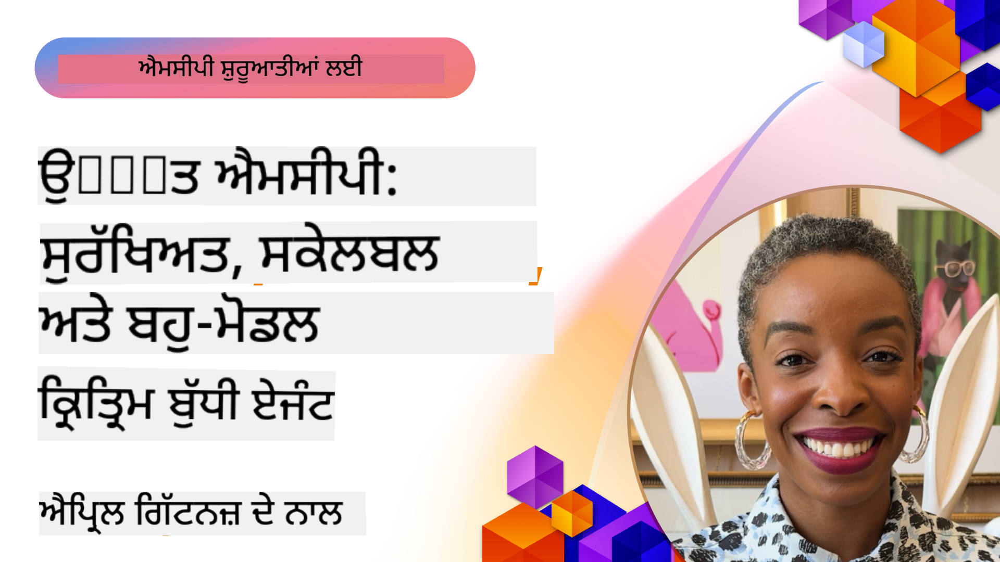

<!--
CO_OP_TRANSLATOR_METADATA:
{
  "original_hash": "d204bc94ea6027d06a703b21b711ca57",
  "translation_date": "2025-08-18T16:36:00+00:00",
  "source_file": "05-AdvancedTopics/README.md",
  "language_code": "pa"
}
-->
# ਐਡਵਾਂਸਡ ਟਾਪਿਕਸ MCP ਵਿੱਚ

_(ਉਪਰ ਦਿੱਤੀ ਤਸਵੀਰ 'ਤੇ ਕਲਿੱਕ ਕਰਕੇ ਇਸ ਪਾਠ ਦਾ ਵੀਡੀਓ ਵੇਖੋ)_

ਇਹ ਅਧਿਆਇ ਮਾਡਲ ਕਾਂਟੈਕਸਟ ਪ੍ਰੋਟੋਕੋਲ (MCP) ਦੇ ਐਡਵਾਂਸਡ ਟਾਪਿਕਸ ਨੂੰ ਕਵਰ ਕਰਦਾ ਹੈ, ਜਿਸ ਵਿੱਚ ਮਲਟੀ-ਮੋਡਲ ਇੰਟੀਗ੍ਰੇਸ਼ਨ, ਸਕੇਲਬਿਲਟੀ, ਸੁਰੱਖਿਆ ਦੇ ਸਰਵੋਤਮ ਅਭਿਆਸ ਅਤੇ ਐਨਟਰਪ੍ਰਾਈਜ਼ ਇੰਟੀਗ੍ਰੇਸ਼ਨ ਸ਼ਾਮਲ ਹਨ। ਇਹ ਵਿਸ਼ੇ ਆਧੁਨਿਕ AI ਸਿਸਟਮਾਂ ਦੀਆਂ ਮੰਗਾਂ ਨੂੰ ਪੂਰਾ ਕਰਨ ਵਾਲੇ ਮਜ਼ਬੂਤ ਅਤੇ ਪ੍ਰੋਡਕਸ਼ਨ-ਤਿਆਰ MCP ਐਪਲੀਕੇਸ਼ਨ ਬਣਾਉਣ ਲਈ ਬਹੁਤ ਮਹੱਤਵਪੂਰਨ ਹਨ।

## ਝਲਕ

ਇਸ ਪਾਠ ਵਿੱਚ ਮਾਡਲ ਕਾਂਟੈਕਸਟ ਪ੍ਰੋਟੋਕੋਲ ਦੇ ਐਡਵਾਂਸਡ ਕਾਂਸੈਪਟਸ ਦੀ ਖੋਜ ਕੀਤੀ ਗਈ ਹੈ, ਜਿਸ ਵਿੱਚ ਮਲਟੀ-ਮੋਡਲ ਇੰਟੀਗ੍ਰੇਸ਼ਨ, ਸਕੇਲਬਿਲਟੀ, ਸੁਰੱਖਿਆ ਦੇ ਸਰਵੋਤਮ ਅਭਿਆਸ ਅਤੇ ਐਨਟਰਪ੍ਰਾਈਜ਼ ਇੰਟੀਗ੍ਰੇਸ਼ਨ 'ਤੇ ਧਿਆਨ ਦਿੱਤਾ ਗਿਆ ਹੈ। ਇਹ ਵਿਸ਼ੇ ਪ੍ਰੋਡਕਸ਼ਨ-ਗਰੇਡ MCP ਐਪਲੀਕੇਸ਼ਨ ਬਣਾਉਣ ਲਈ ਜ਼ਰੂਰੀ ਹਨ ਜੋ ਐਨਟਰਪ੍ਰਾਈਜ਼ ਵਾਤਾਵਰਣਾਂ ਵਿੱਚ ਜਟਿਲ ਜ਼ਰੂਰਤਾਂ ਨੂੰ ਸੰਭਾਲ ਸਕਦੇ ਹਨ।

## ਸਿੱਖਣ ਦੇ ਉਦੇਸ਼

ਇਸ ਪਾਠ ਦੇ ਅੰਤ ਤੱਕ, ਤੁਸੀਂ ਇਹ ਕਰਨ ਦੇ ਯੋਗ ਹੋਵੋਗੇ:

- MCP ਫਰੇਮਵਰਕਸ ਵਿੱਚ ਮਲਟੀ-ਮੋਡਲ ਸਮਰਥਾ ਲਾਗੂ ਕਰੋ
- ਉੱਚ-ਮੰਗ ਵਾਲੇ ਸਥਿਤੀਆਂ ਲਈ ਸਕੇਲਬਲ MCP ਆਰਕੀਟੈਕਚਰ ਡਿਜ਼ਾਈਨ ਕਰੋ
- MCP ਦੀਆਂ ਸੁਰੱਖਿਆ ਨੀਤੀਆਂ ਦੇ ਅਨੁਕੂਲ ਸੁਰੱਖਿਆ ਦੇ ਸਰਵੋਤਮ ਅਭਿਆਸ ਲਾਗੂ ਕਰੋ
- MCP ਨੂੰ ਐਨਟਰਪ੍ਰਾਈਜ਼ AI ਸਿਸਟਮਾਂ ਅਤੇ ਫਰੇਮਵਰਕਸ ਨਾਲ ਇੰਟੀਗ੍ਰੇਟ ਕਰੋ
- ਪ੍ਰੋਡਕਸ਼ਨ ਵਾਤਾਵਰਣਾਂ ਵਿੱਚ ਪ੍ਰਦਰਸ਼ਨ ਅਤੇ ਭਰੋਸੇਮੰਦਤਾ ਨੂੰ ਅਪਟਮਾਈਜ਼ ਕਰੋ

## ਪਾਠ ਅਤੇ ਨਮੂਨਾ ਪ੍ਰੋਜੈਕਟ

| ਲਿੰਕ | ਸਿਰਲੇਖ | ਵੇਰਵਾ |
|------|-------|-------------|
| [5.1 Azure ਨਾਲ ਇੰਟੀਗ੍ਰੇਸ਼ਨ](./mcp-integration/README.md) | Azure ਨਾਲ ਇੰਟੀਗ੍ਰੇਟ ਕਰੋ | ਸਿੱਖੋ ਕਿ ਆਪਣਾ MCP ਸਰਵਰ Azure 'ਤੇ ਕਿਵੇਂ ਇੰਟੀਗ੍ਰੇਟ ਕਰਨਾ ਹੈ |
| [5.2 ਮਲਟੀ ਮੋਡਲ ਨਮੂਨਾ](./mcp-multi-modality/README.md) | MCP ਮਲਟੀ ਮੋਡਲ ਨਮੂਨੇ | ਆਡੀਓ, ਚਿੱਤਰ ਅਤੇ ਮਲਟੀ ਮੋਡਲ ਰਿਸਪਾਂਸ ਲਈ ਨਮੂਨੇ |
| [5.3 MCP OAuth2 ਨਮੂਨਾ](../../../05-AdvancedTopics/mcp-oauth2-demo) | MCP OAuth2 ਡੈਮੋ | ਮਿਨੀਮਲ ਸਪ੍ਰਿੰਗ ਬੂਟ ਐਪ ਜੋ OAuth2 ਨਾਲ MCP ਦਿਖਾਉਂਦਾ ਹੈ, ਦੋਵੇਂ ਅਥਾਰਾਈਜ਼ੇਸ਼ਨ ਅਤੇ ਰਿਸੋਰਸ ਸਰਵਰ ਵਜੋਂ। ਸੁਰੱਖਿਅਤ ਟੋਕਨ ਜਾਰੀ ਕਰਨ, ਸੁਰੱਖਿਅਤ ਐਂਡਪੌਇੰਟਸ, Azure ਕੰਟੇਨਰ ਐਪਸ ਡਿਪਲੌਇਮੈਂਟ ਅਤੇ API ਮੈਨੇਜਮੈਂਟ ਇੰਟੀਗ੍ਰੇਸ਼ਨ ਦਿਖਾਉਂਦਾ ਹੈ। |
| [5.4 ਰੂਟ ਕਾਂਟੈਕਸਟ](./mcp-root-contexts/README.md) | ਰੂਟ ਕਾਂਟੈਕਸਟ | ਰੂਟ ਕਾਂਟੈਕਸਟ ਬਾਰੇ ਹੋਰ ਜਾਣੋ ਅਤੇ ਉਨ੍ਹਾਂ ਨੂੰ ਕਿਵੇਂ ਲਾਗੂ ਕਰਨਾ ਹੈ |
| [5.5 ਰੂਟਿੰਗ](./mcp-routing/README.md) | ਰੂਟਿੰਗ | ਵੱਖ-ਵੱਖ ਕਿਸਮਾਂ ਦੀ ਰੂਟਿੰਗ ਸਿੱਖੋ |
| [5.6 ਸੈਂਪਲਿੰਗ](./mcp-sampling/README.md) | ਸੈਂਪਲਿੰਗ | ਸੈਂਪਲਿੰਗ ਨਾਲ ਕੰਮ ਕਰਨ ਦਾ ਤਰੀਕਾ ਸਿੱਖੋ |
| [5.7 ਸਕੇਲਿੰਗ](./mcp-scaling/README.md) | ਸਕੇਲਿੰਗ | ਸਕੇਲਿੰਗ ਬਾਰੇ ਸਿੱਖੋ |
| [5.8 ਸੁਰੱਖਿਆ](./mcp-security/README.md) | ਸੁਰੱਖਿਆ | ਆਪਣੇ MCP ਸਰਵਰ ਨੂੰ ਸੁਰੱਖਿਅਤ ਕਰੋ |
| [5.9 ਵੈੱਬ ਖੋਜ ਨਮੂਨਾ](./web-search-mcp/README.md) | ਵੈੱਬ ਖੋਜ MCP | Python MCP ਸਰਵਰ ਅਤੇ ਕਲਾਇੰਟ ਜੋ SerpAPI ਨਾਲ ਇੰਟੀਗ੍ਰੇਟ ਕਰਦੇ ਹਨ ਰੀਅਲ-ਟਾਈਮ ਵੈੱਬ, ਨਿਊਜ਼, ਪ੍ਰੋਡਕਟ ਖੋਜ ਅਤੇ Q&A ਲਈ। ਮਲਟੀ-ਟੂਲ ਆਰਕਸਟ੍ਰੇਸ਼ਨ, ਬਾਹਰੀ API ਇੰਟੀਗ੍ਰੇਸ਼ਨ ਅਤੇ ਮਜ਼ਬੂਤ ਐਰਰ ਹੈਂਡਲਿੰਗ ਦਿਖਾਉਂਦਾ ਹੈ। |
| [5.10 ਰੀਅਲਟਾਈਮ ਸਟ੍ਰੀਮਿੰਗ](./mcp-realtimestreaming/README.md) | ਸਟ੍ਰੀਮਿੰਗ | ਰੀਅਲ-ਟਾਈਮ ਡਾਟਾ ਸਟ੍ਰੀਮਿੰਗ ਅੱਜ ਦੇ ਡਾਟਾ-ਡ੍ਰਿਵਨ ਸੰਸਾਰ ਵਿੱਚ ਬਹੁਤ ਜ਼ਰੂਰੀ ਹੋ ਗਈ ਹੈ, ਜਿੱਥੇ ਕਾਰੋਬਾਰ ਅਤੇ ਐਪਲੀਕੇਸ਼ਨ ਤੁਰੰਤ ਜਾਣਕਾਰੀ ਦੀ ਪਹੁੰਚ ਦੀ ਲੋੜ ਰੱਖਦੇ ਹਨ। |
| [5.11 ਰੀਅਲਟਾਈਮ ਵੈੱਬ ਖੋਜ](./mcp-realtimesearch/README.md) | ਵੈੱਬ ਖੋਜ | ਰੀਅਲ-ਟਾਈਮ ਵੈੱਬ ਖੋਜ ਕਿਵੇਂ MCP ਰੀਅਲ-ਟਾਈਮ ਵੈੱਬ ਖੋਜ ਨੂੰ ਬਦਲਦਾ ਹੈ, AI ਮਾਡਲ, ਖੋਜ ਇੰਜਨਾਂ ਅਤੇ ਐਪਲੀਕੇਸ਼ਨਾਂ ਵਿੱਚ ਸਟੈਂਡਰਡ ਕਾਂਟੈਕਸਟ ਮੈਨੇਜਮੈਂਟ ਪ੍ਰਦਾਨ ਕਰਦਾ ਹੈ। |
| [5.12 Entra ID ਪ੍ਰਮਾਣਿਕਤਾ MCP ਸਰਵਰਾਂ ਲਈ](./mcp-security-entra/README.md) | Entra ID ਪ੍ਰਮਾਣਿਕਤਾ | Microsoft Entra ID ਇੱਕ ਮਜ਼ਬੂਤ ਕਲਾਉਡ-ਅਧਾਰਿਤ ਪਛਾਣ ਅਤੇ ਪਹੁੰਚ ਪ੍ਰਬੰਧਨ ਹੱਲ ਪ੍ਰਦਾਨ ਕਰਦਾ ਹੈ, ਇਹ ਯਕੀਨੀ ਬਣਾਉਂਦਾ ਹੈ ਕਿ ਸਿਰਫ ਅਧਿਕ੍ਰਿਤ ਉਪਭੋਗਤਾ ਅਤੇ ਐਪਲੀਕੇਸ਼ਨ ਤੁਹਾਡੇ MCP ਸਰਵਰ ਨਾਲ ਸੰਚਾਰ ਕਰ ਸਕਦੇ ਹਨ। |
| [5.13 Azure AI Foundry ਏਜੰਟ ਇੰਟੀਗ੍ਰੇਸ਼ਨ](./mcp-foundry-agent-integration/README.md) | Azure AI Foundry ਇੰਟੀਗ੍ਰੇਸ਼ਨ | ਮਾਡਲ ਕਾਂਟੈਕਸਟ ਪ੍ਰੋਟੋਕੋਲ ਸਰਵਰਾਂ ਨੂੰ Azure AI Foundry ਏਜੰਟਸ ਨਾਲ ਇੰਟੀਗ੍ਰੇਟ ਕਰਨ ਦਾ ਤਰੀਕਾ ਸਿੱਖੋ, ਮਜ਼ਬੂਤ ਟੂਲ ਆਰਕਸਟ੍ਰੇਸ਼ਨ ਅਤੇ ਐਨਟਰਪ੍ਰਾਈਜ਼ AI ਸਮਰਥਾ ਨੂੰ ਸਟੈਂਡਰਡ ਬਾਹਰੀ ਡਾਟਾ ਸਰੋਤ ਕਨੈਕਸ਼ਨ ਨਾਲ ਯੋਗ ਬਣਾਉਣਾ। |
| [5.14 ਕਾਂਟੈਕਸਟ ਇੰਜੀਨੀਅਰਿੰਗ](./mcp-contextengineering/README.md) | ਕਾਂਟੈਕਸਟ ਇੰਜੀਨੀਅਰਿੰਗ | MCP ਸਰਵਰਾਂ ਲਈ ਕਾਂਟੈਕਸਟ ਇੰਜੀਨੀਅਰਿੰਗ ਤਕਨੀਕਾਂ ਦਾ ਭਵਿੱਖ ਦਾ ਮੌਕਾ, ਜਿਸ ਵਿੱਚ ਕਾਂਟੈਕਸਟ ਅਪਟਮਾਈਜ਼ੇਸ਼ਨ, ਡਾਇਨਾਮਿਕ ਕਾਂਟੈਕਸਟ ਮੈਨੇਜਮੈਂਟ ਅਤੇ MCP ਫਰੇਮਵਰਕਸ ਵਿੱਚ ਪ੍ਰਭਾਵਸ਼ਾਲੀ ਪ੍ਰੋਮਪਟ ਇੰਜੀਨੀਅਰਿੰਗ ਲਈ ਰਣਨੀਤੀਆਂ ਸ਼ਾਮਲ ਹਨ। |

## ਵਾਧੂ ਸੰਦਰਭ

MCP ਦੇ ਐਡਵਾਂਸਡ ਟਾਪਿਕਸ 'ਤੇ ਸਭ ਤੋਂ ਅਪ-ਟੂ-ਡੇਟ ਜਾਣਕਾਰੀ ਲਈ, ਹਵਾਲਾ ਦਿਓ:
- [MCP ਡਾਕੂਮੈਂਟੇਸ਼ਨ](https://modelcontextprotocol.io/)
- [MCP ਵਿਸ਼ੇਸ਼ਤਾ](https://spec.modelcontextprotocol.io/)
- [GitHub ਰਿਪੋਜ਼ਟਰੀ](https://github.com/modelcontextprotocol)

## ਮੁੱਖ ਗੱਲਾਂ

- ਮਲਟੀ-ਮੋਡਲ MCP ਲਾਗੂ ਕਰਨ ਨਾਲ AI ਸਮਰਥਾ ਨੂੰ ਟੈਕਸਟ ਪ੍ਰੋਸੈਸਿੰਗ ਤੋਂ ਪਰੇ ਵਧਾਇਆ ਜਾਂਦਾ ਹੈ
- ਐਨਟਰਪ੍ਰਾਈਜ਼ ਡਿਪਲੌਇਮੈਂਟ ਲਈ ਸਕੇਲਬਿਲਟੀ ਬਹੁਤ ਜ਼ਰੂਰੀ ਹੈ ਅਤੇ ਇਸਨੂੰ ਹੌਰਿਜ਼ਾਂਟਲ ਅਤੇ ਵਰਟੀਕਲ ਸਕੇਲਿੰਗ ਰਾਹੀਂ ਸੰਬੋਧਿਤ ਕੀਤਾ ਜਾ ਸਕਦਾ ਹੈ
- ਵਿਸਥਾਰਤ ਸੁਰੱਖਿਆ ਉਪਾਅ ਡਾਟਾ ਦੀ ਰੱਖਿਆ ਕਰਦੇ ਹਨ ਅਤੇ ਸਹੀ ਪਹੁੰਚ ਨਿਯੰਤਰਣ ਯਕੀਨੀ ਬਣਾਉਂਦੇ ਹਨ
- Azure OpenAI ਅਤੇ Microsoft AI Foundry ਵਰਗੇ ਪਲੇਟਫਾਰਮਾਂ ਨਾਲ ਐਨਟਰਪ੍ਰਾਈਜ਼ ਇੰਟੀਗ੍ਰੇਸ਼ਨ MCP ਸਮਰਥਾ ਨੂੰ ਵਧਾਉਂਦਾ ਹੈ
- ਐਡਵਾਂਸਡ MCP ਲਾਗੂ ਕਰਨ ਤੋਂ ਅਪਟਮਾਈਜ਼ਡ ਆਰਕੀਟੈਕਚਰ ਅਤੇ ਸਾਵਧਾਨੀ ਨਾਲ ਸਰੋਤ ਪ੍ਰਬੰਧਨ ਦਾ ਲਾਭ ਹੁੰਦਾ ਹੈ

## ਅਭਿਆਸ

ਕਿਸੇ ਵਿਸ਼ੇਸ਼ ਉਪਯੋਗਤਾ ਲਈ ਐਨਟਰਪ੍ਰਾਈਜ਼-ਗਰੇਡ MCP ਲਾਗੂ ਕਰਨ ਦੀ ਯੋਜਨਾ ਬਣਾਓ:

1. ਆਪਣੇ ਉਪਯੋਗਤਾ ਲਈ ਮਲਟੀ-ਮੋਡਲ ਜ਼ਰੂਰਤਾਂ ਦੀ ਪਛਾਣ ਕਰੋ
2. ਸੰਵੇਦਨਸ਼ੀਲ ਡਾਟਾ ਦੀ ਰੱਖਿਆ ਲਈ ਲੋੜੀਂਦੇ ਸੁਰੱਖਿਆ ਨਿਯੰਤਰਣਾਂ ਦੀ ਰੂਪਰੇਖਾ ਬਣਾਓ
3. ਇੱਕ ਸਕੇਲਬਲ ਆਰਕੀਟੈਕਚਰ ਡਿਜ਼ਾਈਨ ਕਰੋ ਜੋ ਵੱਖ-ਵੱਖ ਲੋਡ ਨੂੰ ਸੰਭਾਲ ਸਕੇ
4. ਐਨਟਰਪ੍ਰਾਈਜ਼ AI ਸਿਸਟਮਾਂ ਨਾਲ ਇੰਟੀਗ੍ਰੇਸ਼ਨ ਪਾਇੰਟਸ ਦੀ ਯੋਜਨਾ ਬਣਾਓ
5. ਸੰਭਾਵਿਤ ਪ੍ਰਦਰਸ਼ਨ ਰੁਕਾਵਟਾਂ ਅਤੇ ਉਨ੍ਹਾਂ ਦੇ ਨਿਵਾਰਨ ਰਣਨੀਤੀਆਂ ਦਾ ਦਸਤਾਵੇਜ਼ ਬਣਾਓ

## ਵਾਧੂ ਸਰੋਤ

- [Azure OpenAI ਡਾਕੂਮੈਂਟੇਸ਼ਨ](https://learn.microsoft.com/en-us/azure/ai-services/openai/)
- [Microsoft AI Foundry ਡਾਕੂਮੈਂਟੇਸ਼ਨ](https://learn.microsoft.com/en-us/ai-services/)

---

## ਅਗਲਾ ਕੀ ਹੈ

- [5.1 MCP ਇੰਟੀਗ੍ਰੇਸ਼ਨ](./mcp-integration/README.md)

**ਅਸਵੀਕਰਤੀ**:  
ਇਹ ਦਸਤਾਵੇਜ਼ AI ਅਨੁਵਾਦ ਸੇਵਾ [Co-op Translator](https://github.com/Azure/co-op-translator) ਦੀ ਵਰਤੋਂ ਕਰਕੇ ਅਨੁਵਾਦ ਕੀਤਾ ਗਿਆ ਹੈ। ਜਦੋਂ ਕਿ ਅਸੀਂ ਸਹੀਅਤ ਲਈ ਯਤਨਸ਼ੀਲ ਹਾਂ, ਕਿਰਪਾ ਕਰਕੇ ਧਿਆਨ ਦਿਓ ਕਿ ਸਵੈਚਾਲਿਤ ਅਨੁਵਾਦਾਂ ਵਿੱਚ ਗਲਤੀਆਂ ਜਾਂ ਅਸੁਚੀਤਤਾਵਾਂ ਹੋ ਸਕਦੀਆਂ ਹਨ। ਮੂਲ ਦਸਤਾਵੇਜ਼ ਨੂੰ ਇਸਦੀ ਮੂਲ ਭਾਸ਼ਾ ਵਿੱਚ ਅਧਿਕਾਰਤ ਸਰੋਤ ਮੰਨਿਆ ਜਾਣਾ ਚਾਹੀਦਾ ਹੈ। ਮਹੱਤਵਪੂਰਨ ਜਾਣਕਾਰੀ ਲਈ, ਪੇਸ਼ੇਵਰ ਮਨੁੱਖੀ ਅਨੁਵਾਦ ਦੀ ਸਿਫਾਰਸ਼ ਕੀਤੀ ਜਾਂਦੀ ਹੈ। ਇਸ ਅਨੁਵਾਦ ਦੀ ਵਰਤੋਂ ਤੋਂ ਪੈਦਾ ਹੋਣ ਵਾਲੇ ਕਿਸੇ ਵੀ ਗਲਤਫਹਿਮੀ ਜਾਂ ਗਲਤ ਵਿਆਖਿਆ ਲਈ ਅਸੀਂ ਜ਼ਿੰਮੇਵਾਰ ਨਹੀਂ ਹਾਂ।