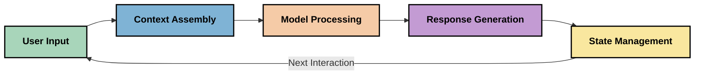
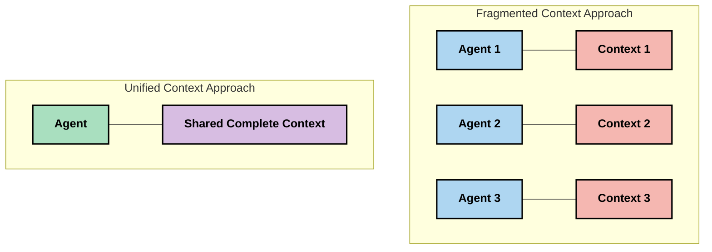

<!--
CO_OP_TRANSLATOR_METADATA:
{
  "original_hash": "fd169ca3071b81b5ee282e194bc823df",
  "translation_date": "2025-09-15T20:14:35+00:00",
  "source_file": "05-AdvancedTopics/mcp-contextengineering/README.md",
  "language_code": "pa"
}
-->
# ਸੰਦਰਭ ਇੰਜੀਨੀਅਰਿੰਗ: MCP ਪਰਿਸਰ ਵਿੱਚ ਇੱਕ ਉਭਰਦਾ ਹੋਇਆ ਅਵਧਾਰਨਾ

## ਝਲਕ

ਸੰਦਰਭ ਇੰਜੀਨੀਅਰਿੰਗ AI ਖੇਤਰ ਵਿੱਚ ਇੱਕ ਉਭਰਦਾ ਹੋਇਆ ਅਵਧਾਰਨਾ ਹੈ ਜੋ ਗਾਹਕਾਂ ਅਤੇ AI ਸੇਵਾਵਾਂ ਦੇ ਵਿਚਕਾਰ ਸੰਚਾਰ ਦੌਰਾਨ ਜਾਣਕਾਰੀ ਨੂੰ ਕਿਵੇਂ ਢਾਂਚੇਬੱਧ, ਪੇਸ਼ ਕੀਤਾ ਜਾਂਦਾ ਹੈ ਅਤੇ ਸੰਭਾਲਿਆ ਜਾਂਦਾ ਹੈ, ਇਸ ਦੀ ਪੜਤਾਲ ਕਰਦਾ ਹੈ। ਜਿਵੇਂ ਕਿ ਮਾਡਲ ਸੰਦਰਭ ਪ੍ਰੋਟੋਕੋਲ (MCP) ਪਰਿਸਰ ਵਿਕਸਿਤ ਹੁੰਦਾ ਹੈ, ਸੰਦਰਭ ਨੂੰ ਪ੍ਰਭਾਵਸ਼ਾਲੀ ਢੰਗ ਨਾਲ ਪ੍ਰਬੰਧਿਤ ਕਰਨ ਦੀ ਸਮਝ ਬਹੁਤ ਮਹੱਤਵਪੂਰਨ ਬਣ ਜਾਂਦੀ ਹੈ। ਇਹ ਮੋਡਿਊਲ ਸੰਦਰਭ ਇੰਜੀਨੀਅਰਿੰਗ ਦੀ ਅਵਧਾਰਨਾ ਨੂੰ ਪੇਸ਼ ਕਰਦਾ ਹੈ ਅਤੇ MCP ਦੇ ਕਾਰਜਾਂ ਵਿੱਚ ਇਸ ਦੇ ਸੰਭਾਵਿਤ ਐਪਲੀਕੇਸ਼ਨਾਂ ਦੀ ਪੜਤਾਲ ਕਰਦਾ ਹੈ।

## ਸਿੱਖਣ ਦੇ ਉਦੇਸ਼

ਇਸ ਮੋਡਿਊਲ ਦੇ ਅੰਤ ਤੱਕ, ਤੁਸੀਂ ਸਮਰੱਥ ਹੋਵੋਗੇ:

- ਸੰਦਰਭ ਇੰਜੀਨੀਅਰਿੰਗ ਦੀ ਉਭਰਦੀ ਅਵਧਾਰਨਾ ਅਤੇ MCP ਐਪਲੀਕੇਸ਼ਨਾਂ ਵਿੱਚ ਇਸ ਦੀ ਸੰਭਾਵਿਤ ਭੂਮਿਕਾ ਨੂੰ ਸਮਝਣਾ
- ਸੰਦਰਭ ਪ੍ਰਬੰਧਨ ਵਿੱਚ ਮੁੱਖ ਚੁਣੌਤੀਆਂ ਦੀ ਪਛਾਣ ਕਰਨਾ ਜੋ MCP ਪ੍ਰੋਟੋਕੋਲ ਡਿਜ਼ਾਈਨ ਹੱਲ ਕਰਦਾ ਹੈ
- ਬਿਹਤਰ ਸੰਦਰਭ ਸੰਭਾਲਣ ਰਾਹੀਂ ਮਾਡਲ ਪ੍ਰਦਰਸ਼ਨ ਵਿੱਚ ਸੁਧਾਰ ਲਈ ਤਕਨੀਕਾਂ ਦੀ ਪੜਤਾਲ ਕਰਨਾ
- ਸੰਦਰਭ ਦੀ ਪ੍ਰਭਾਵਸ਼ਾਲੀਤਾ ਨੂੰ ਮਾਪਣ ਅਤੇ ਮੁਲਾਂਕਣ ਕਰਨ ਦੇ ਤਰੀਕੇ ਵਿਚਾਰਨਾ
- MCP ਫਰੇਮਵਰਕ ਰਾਹੀਂ AI ਅਨੁਭਵਾਂ ਵਿੱਚ ਸੁਧਾਰ ਕਰਨ ਲਈ ਇਹ ਉਭਰਦੇ ਅਵਧਾਰਨਾਵਾਂ ਲਾਗੂ ਕਰਨਾ

## ਸੰਦਰਭ ਇੰਜੀਨੀਅਰਿੰਗ ਦਾ ਪਰਿਚਯ

ਸੰਦਰਭ ਇੰਜੀਨੀਅਰਿੰਗ ਇੱਕ ਉਭਰਦੀ ਅਵਧਾਰਨਾ ਹੈ ਜੋ ਉਪਭੋਗਤਾਵਾਂ, ਐਪਲੀਕੇਸ਼ਨਾਂ ਅਤੇ AI ਮਾਡਲਾਂ ਦੇ ਵਿਚਕਾਰ ਜਾਣਕਾਰੀ ਦੇ ਪ੍ਰਵਾਹ ਦੇ ਜ਼ਮੀਨੀ ਡਿਜ਼ਾਈਨ ਅਤੇ ਪ੍ਰਬੰਧਨ 'ਤੇ ਕੇਂਦ੍ਰਿਤ ਹੈ। ਸਥਾਪਿਤ ਖੇਤਰਾਂ ਜਿਵੇਂ ਕਿ ਪ੍ਰੋਮਪਟ ਇੰਜੀਨੀਅਰਿੰਗ ਦੇ ਵਿਰੁੱਧ, ਸੰਦਰਭ ਇੰਜੀਨੀਅਰਿੰਗ ਨੂੰ ਅਜੇ ਵੀ ਵਿਸ਼ੇਸ਼ਗਿਆਨ ਪਰਿਭਾਸ਼ਿਤ ਕਰ ਰਹੇ ਹਨ ਜਿਵੇਂ ਕਿ ਉਹ AI ਮਾਡਲਾਂ ਨੂੰ ਸਹੀ ਸਮੇਂ 'ਤੇ ਸਹੀ ਜਾਣਕਾਰੀ ਪ੍ਰਦਾਨ ਕਰਨ ਦੀ ਵਿਲੱਖਣ ਚੁਣੌਤੀ ਨੂੰ ਹੱਲ ਕਰਨ ਲਈ ਕੰਮ ਕਰਦੇ ਹਨ।

ਜਿਵੇਂ ਕਿ ਵੱਡੇ ਭਾਸ਼ਾ ਮਾਡਲ (LLMs) ਵਿਕਸਿਤ ਹੋਏ ਹਨ, ਸੰਦਰਭ ਦੀ ਮਹੱਤਤਾ ਸਪਸ਼ਟ ਹੋ ਗਈ ਹੈ। ਸੰਦਰਭ ਦੀ ਗੁਣਵੱਤਾ, ਸਬੰਧਤਾ, ਅਤੇ ਢਾਂਚਾ ਜੋ ਅਸੀਂ ਪ੍ਰਦਾਨ ਕਰਦੇ ਹਾਂ, ਮਾਡਲ ਦੇ ਨਤੀਜਿਆਂ 'ਤੇ ਸਿੱਧੇ ਤੌਰ 'ਤੇ ਪ੍ਰਭਾਵ ਪਾਉਂਦਾ ਹੈ। ਸੰਦਰਭ ਇੰਜੀਨੀਅਰਿੰਗ ਇਸ ਸੰਬੰਧ ਦੀ ਪੜਤਾਲ ਕਰਦਾ ਹੈ ਅਤੇ ਪ੍ਰਭਾਵਸ਼ਾਲੀ ਸੰਦਰਭ ਪ੍ਰਬੰਧਨ ਲਈ ਸਿਧਾਂਤ ਵਿਕਸਿਤ ਕਰਨ ਦੀ ਕੋਸ਼ਿਸ਼ ਕਰਦਾ ਹੈ।

> "2025 ਵਿੱਚ, ਮਾਡਲ ਬਹੁਤ ਹੀ ਬੁੱਧੀਮਾਨ ਹਨ। ਪਰ ਸਭ ਤੋਂ ਸਿਆਣਾ ਮਨੁੱਖ ਵੀ ਬਿਨਾਂ ਸੰਦਰਭ ਦੇ ਆਪਣਾ ਕੰਮ ਪ੍ਰਭਾਵਸ਼ਾਲੀ ਢੰਗ ਨਾਲ ਨਹੀਂ ਕਰ ਸਕਦਾ ਕਿ ਉਹ ਕੀ ਕਰਨ ਲਈ ਕਿਹਾ ਜਾ ਰਿਹਾ ਹੈ... 'ਸੰਦਰਭ ਇੰਜੀਨੀਅਰਿੰਗ' ਪ੍ਰੋਮਪਟ ਇੰਜੀਨੀਅਰਿੰਗ ਦਾ ਅਗਲਾ ਪੱਧਰ ਹੈ। ਇਹ ਇੱਕ ਗਤੀਸ਼ੀਲ ਸਿਸਟਮ ਵਿੱਚ ਇਸ ਨੂੰ ਸਵੈਚਾਲਿਤ ਢੰਗ ਨਾਲ ਕਰਨ ਬਾਰੇ ਹੈ।" — ਵਾਲਡਨ ਯਾਨ, ਕੌਗਨੀਸ਼ਨ AI

ਸੰਦਰਭ ਇੰਜੀਨੀਅਰਿੰਗ ਵਿੱਚ ਸ਼ਾਮਲ ਹੋ ਸਕਦਾ ਹੈ:

1. **ਸੰਦਰਭ ਚੋਣ**: ਨਿਰਧਾਰਤ ਕਰਨਾ ਕਿ ਕਿਸ ਕੰਮ ਲਈ ਕਿਹੜੀ ਜਾਣਕਾਰੀ ਸਬੰਧਿਤ ਹੈ
2. **ਸੰਦਰਭ ਢਾਂਚਾ**: ਮਾਡਲ ਦੀ ਸਮਝ ਨੂੰ ਵਧਾਉਣ ਲਈ ਜਾਣਕਾਰੀ ਨੂੰ ਸੰਗਠਿਤ ਕਰਨਾ
3. **ਸੰਦਰਭ ਪੇਸ਼ਕਸ਼**: ਮਾਡਲਾਂ ਨੂੰ ਜਾਣਕਾਰੀ ਕਿਵੇਂ ਅਤੇ ਕਦੋਂ ਭੇਜੀ ਜਾਂਦੀ ਹੈ, ਇਸ ਨੂੰ ਅਨੁਕੂਲਿਤ ਕਰਨਾ
4. **ਸੰਦਰਭ ਰੱਖ-ਰਖਾਵ**: ਸਮੇਂ ਦੇ ਨਾਲ ਸੰਦਰਭ ਦੀ ਸਥਿਤੀ ਅਤੇ ਵਿਕਾਸ ਦਾ ਪ੍ਰਬੰਧਨ ਕਰਨਾ
5. **ਸੰਦਰਭ ਮੁਲਾਂਕਣ**: ਸੰਦਰਭ ਦੀ ਪ੍ਰਭਾਵਸ਼ਾਲੀਤਾ ਨੂੰ ਮਾਪਣਾ ਅਤੇ ਸੁਧਾਰ ਕਰਨਾ

ਇਹ ਧਿਆਨ ਦੇ ਖੇਤਰ ਵਿਸ਼ੇਸ਼ ਤੌਰ 'ਤੇ MCP ਪਰਿਸਰ ਲਈ ਸਬੰਧਿਤ ਹਨ, ਜੋ LLMs ਨੂੰ ਸੰਦਰਭ ਪ੍ਰਦਾਨ ਕਰਨ ਲਈ ਇੱਕ ਮਿਆਰੀਕ੍ਰਿਤ ਤਰੀਕਾ ਪ੍ਰਦਾਨ ਕਰਦਾ ਹੈ।

## ਸੰਦਰਭ ਯਾਤਰਾ ਦਾ ਦ੍ਰਿਸ਼ਟੀਕੋਣ

ਸੰਦਰਭ ਇੰਜੀਨੀਅਰਿੰਗ ਨੂੰ ਦ੍ਰਿਸ਼ਟੀਕੋਣ ਦੇ ਤੌਰ 'ਤੇ ਵੇਖਣ ਦਾ ਇੱਕ ਤਰੀਕਾ ਇਹ ਹੈ ਕਿ ਜਾਣਕਾਰੀ MCP ਸਿਸਟਮ ਦੇ ਮਾਧਿਅਮ ਨਾਲ ਕਿਵੇਂ ਯਾਤਰਾ ਕਰਦੀ ਹੈ:

### ਸੰਦਰਭ ਯਾਤਰਾ ਦੇ ਮੁੱਖ ਪੜਾਅ:

1. **ਉਪਭੋਗਤਾ ਇਨਪੁਟ**: ਉਪਭੋਗਤਾ ਤੋਂ ਕੱਚੀ ਜਾਣਕਾਰੀ (ਪਾਠ, ਚਿੱਤਰ, ਦਸਤਾਵੇਜ਼)
2. **ਸੰਦਰਭ ਸੰਯੋਜਨ**: ਉਪਭੋਗਤਾ ਇਨਪੁਟ ਨੂੰ ਸਿਸਟਮ ਸੰਦਰਭ, ਗੱਲਬਾਤ ਦੇ ਇਤਿਹਾਸ, ਅਤੇ ਹੋਰ ਪ੍ਰਾਪਤ ਕੀਤੀ ਜਾਣਕਾਰੀ ਨਾਲ ਜੋੜਨਾ
3. **ਮਾਡਲ ਪ੍ਰਕਿਰਿਆ**: AI ਮਾਡਲ ਸੰਯੋਜਿਤ ਸੰਦਰਭ ਨੂੰ ਪ੍ਰਕਿਰਿਆ ਕਰਦਾ ਹੈ
4. **ਜਵਾਬ ਉਤਪੱਤੀ**: ਮਾਡਲ ਪ੍ਰਦਾਨ ਕੀਤੇ ਸੰਦਰਭ ਦੇ ਆਧਾਰ 'ਤੇ ਨਤੀਜੇ ਪੈਦਾ ਕਰਦਾ ਹੈ
5. **ਸਥਿਤੀ ਪ੍ਰਬੰਧਨ**: ਸਿਸਟਮ ਸੰਚਾਰ ਦੇ ਆਧਾਰ 'ਤੇ ਆਪਣੀ ਅੰਦਰੂਨੀ ਸਥਿਤੀ ਨੂੰ ਅਪਡੇਟ ਕਰਦਾ ਹੈ

ਇਹ ਦ੍ਰਿਸ਼ਟੀਕੋਣ AI ਸਿਸਟਮਾਂ ਵਿੱਚ ਸੰਦਰਭ ਦੀ ਗਤੀਸ਼ੀਲ ਪ੍ਰਕਿਰਤੀ ਨੂੰ ਰੋਸ਼ਨ ਕਰਦਾ ਹੈ ਅਤੇ ਇਹ ਸਵਾਲ ਉਠਾਉਂਦਾ ਹੈ ਕਿ ਹਰ ਪੜਾਅ 'ਤੇ ਜਾਣਕਾਰੀ ਨੂੰ ਕਿਵੇਂ ਸਭ ਤੋਂ ਵਧੀਆ ਢੰਗ ਨਾਲ ਪ੍ਰਬੰਧਿਤ ਕੀਤਾ ਜਾ ਸਕਦਾ ਹੈ।

## ਸੰਦਰਭ ਇੰਜੀਨੀਅਰਿੰਗ ਵਿੱਚ ਉਭਰਦੇ ਸਿਧਾਂਤ

ਜਿਵੇਂ ਕਿ ਸੰਦਰਭ ਇੰਜੀਨੀਅਰਿੰਗ ਦਾ ਖੇਤਰ ਰੂਪ ਲੈ ਰਿਹਾ ਹੈ, ਕੁਝ ਸ਼ੁਰੂਆਤੀ ਸਿਧਾਂਤ ਵਿਸ਼ੇਸ਼ਗਿਆਨਾਂ ਤੋਂ ਉਭਰ ਰਹੇ ਹਨ। ਇਹ ਸਿਧਾਂਤ MCP ਕਾਰਜਾਂ ਦੀ ਚੋਣ ਨੂੰ ਜਾਣਕਾਰੀ ਦੇਣ ਵਿੱਚ ਮਦਦ ਕਰ ਸਕਦੇ ਹਨ:

### ਸਿਧਾਂਤ 1: ਸੰਦਰਭ ਨੂੰ ਪੂਰੀ ਤਰ੍ਹਾਂ ਸਾਂਝਾ ਕਰੋ

ਸੰਦਰਭ ਨੂੰ ਸਿਸਟਮ ਦੇ ਸਾਰੇ ਹਿੱਸਿਆਂ ਵਿੱਚ ਪੂਰੀ ਤਰ੍ਹਾਂ ਸਾਂਝਾ ਕੀਤਾ ਜਾਣਾ ਚਾਹੀਦਾ ਹੈ, ਨਾ ਕਿ ਕਈ ਏਜੰਟਾਂ ਜਾਂ ਪ੍ਰਕਿਰਿਆਵਾਂ ਵਿੱਚ ਖੰਡਿਤ। ਜਦੋਂ ਸੰਦਰਭ ਵੰਡਿਆ ਜਾਂਦਾ ਹੈ, ਸਿਸਟਮ ਦੇ ਇੱਕ ਹਿੱਸੇ ਵਿੱਚ ਕੀਤੇ ਗਏ ਫੈਸਲੇ ਹੋਰ ਜਗ੍ਹਾ ਕੀਤੇ ਗਏ ਫੈਸਲਿਆਂ ਨਾਲ ਟਕਰਾਅ ਕਰ ਸਕਦੇ ਹਨ।

MCP ਕਾਰਜਾਂ ਵਿੱਚ, ਇਹ ਸਿਸਟਮਾਂ ਨੂੰ ਡਿਜ਼ਾਈਨ ਕਰਨ ਦਾ ਸੁਝਾਅ ਦਿੰਦਾ ਹੈ ਜਿੱਥੇ ਸੰਦਰਭ ਪੂਰੇ ਪਾਈਪਲਾਈਨ ਵਿੱਚ ਬਿਨਾਂ ਰੁਕਾਵਟ ਦੇ ਵਹਿੰਦਾ ਹੈ, ਨਾ ਕਿ ਖੰਡਿਤ ਹੋਣ ਦੇ।

### ਸਿਧਾਂਤ 2: ਮਾਨੋ ਕਿ ਕਾਰਵਾਈਆਂ ਅੰਤਰਨਿਹਿਤ ਫੈਸਲੇ ਲੈ ਕੇ ਆਉਂਦੀਆਂ ਹਨ

ਮਾਡਲ ਦੁਆਰਾ ਕੀਤੀ ਹਰ ਕਾਰਵਾਈ ਸੰਦਰਭ ਨੂੰ ਕਿਵੇਂ ਸਮਝਣਾ ਹੈ, ਇਸ ਬਾਰੇ ਅੰਤਰਨਿਹਿਤ ਫੈਸਲੇ ਲੈ ਕੇ ਆਉਂਦੀ ਹੈ। ਜਦੋਂ ਕਈ ਹਿੱਸੇ ਵੱਖ-ਵੱਖ ਸੰਦਰਭਾਂ 'ਤੇ ਕਾਰਵਾਈ ਕਰਦੇ ਹਨ, ਇਹ ਅੰਤਰਨਿਹਿਤ ਫੈਸਲੇ ਟਕਰਾਅ ਕਰ ਸਕਦੇ ਹਨ, ਜਿਸ ਨਾਲ ਅਸੰਗਤ ਨਤੀਜੇ ਨਿਕਲ ਸਕਦੇ ਹਨ।

ਇਸ ਸਿਧਾਂਤ ਦਾ MCP ਕਾਰਜਾਂ ਲਈ ਮਹੱਤਵਪੂਰਨ ਅਰਥ ਹੈ:
- ਖੰਡਿਤ ਸੰਦਰਭ ਨਾਲ ਸਮਾਂਤਰੀ ਕਾਰਜਨਵਾਈ ਦੇ ਉਲਟ ਜਟਿਲ ਕੰਮਾਂ ਦੀ ਰੇਖੀ ਪ੍ਰਕਿਰਿਆ ਨੂੰ ਤਰਜੀਹ ਦਿਓ
- ਯਕੀਨੀ ਬਣਾਓ ਕਿ ਸਾਰੇ ਫੈਸਲੇ ਦੇ ਬਿੰਦੂ ਇੱਕੋ ਸੰਦਰਭ ਜਾਣਕਾਰੀ ਤੱਕ ਪਹੁੰਚ ਰੱਖਦੇ ਹਨ
- ਸਿਸਟਮਾਂ ਨੂੰ ਡਿਜ਼ਾਈਨ ਕਰੋ ਜਿੱਥੇ ਬਾਅਦ ਦੇ ਪੜਾਅ ਪਹਿਲੇ ਫੈਸਲਿਆਂ ਦੇ ਪੂਰੇ ਸੰਦਰਭ ਨੂੰ ਵੇਖ ਸਕਦੇ ਹਨ

### ਸਿਧਾਂਤ 3: ਸੰਦਰਭ ਦੀ ਗਹਿਰਾਈ ਅਤੇ ਵਿੰਡੋ ਸੀਮਾਵਾਂ ਦੇ ਵਿਚਕਾਰ ਸੰਤੁਲਨ ਬਣਾਓ

ਜਿਵੇਂ ਗੱਲਬਾਤਾਂ ਅਤੇ ਪ੍ਰਕਿਰਿਆਵਾਂ ਲੰਬੀਆਂ ਹੁੰਦੀਆਂ ਹਨ, ਸੰਦਰਭ ਵਿੰਡੋ ਆਖਿਰਕਾਰ ਭਰ ਜਾਂਦੇ ਹਨ। ਪ੍ਰਭਾਵਸ਼ਾਲੀ ਸੰਦਰਭ ਇੰਜੀਨੀਅਰਿੰਗ ਇਸ ਤਣਾਅ ਦੀ ਪੜਤਾਲ ਕਰਦੀ ਹੈ ਜੋ ਵਿਸਤ੍ਰਿਤ ਸੰਦਰਭ ਅਤੇ ਤਕਨੀਕੀ ਸੀਮਾਵਾਂ ਦੇ ਵਿਚਕਾਰ ਹੈ।

ਪ੍ਰਸਤਾਵਿਤ ਤਰੀਕੇ ਜੋ ਪੜਤਾਲ ਕੀਤੇ ਜਾ ਰਹੇ ਹਨ:
- ਸੰਦਰਭ ਸੰਕੋਚਨ ਜੋ ਟੋਕਨ ਦੀ ਵਰਤੋਂ ਨੂੰ ਘਟਾਉਂਦੇ ਹੋਏ ਜ਼ਰੂਰੀ ਜਾਣਕਾਰੀ ਨੂੰ ਬਰਕਰਾਰ ਰੱਖਦਾ ਹੈ
- ਮੌਜੂਦਾ ਜ਼ਰੂਰਤਾਂ ਦੇ ਨਾਲ ਸਬੰਧਿਤ ਸੰਦਰਭ ਦਾ ਪ੍ਰਗਤੀਸ਼ੀਲ ਲੋਡਿੰਗ
- ਪਿਛਲੇ ਸੰਚਾਰਾਂ ਦੀ ਸੰਖੇਪਕਰਣ ਜਦੋਂ ਕਿ ਮੁੱਖ ਫੈਸਲੇ ਅਤੇ ਤਥਾਂ ਨੂੰ ਸੁਰੱਖਿਅਤ ਕਰਨਾ

## ਸੰਦਰਭ ਚੁਣੌਤੀਆਂ ਅਤੇ MCP ਪ੍ਰੋਟੋਕੋਲ ਡਿਜ਼ਾਈਨ

ਮਾਡਲ ਸੰਦਰਭ ਪ੍ਰੋਟੋਕੋਲ (MCP) ਨੂੰ ਸੰਦਰਭ ਪ੍ਰਬੰਧਨ ਦੀ ਵਿਲੱਖਣ ਚੁਣੌਤੀਆਂ ਦੀ ਜਾਣਕਾਰੀ ਨਾਲ ਡਿਜ਼ਾਈਨ ਕੀਤਾ ਗਿਆ ਸੀ। ਇਹ ਚੁਣੌਤੀਆਂ ਨੂੰ ਸਮਝਣਾ MCP ਪ੍ਰੋਟੋਕੋਲ ਡਿਜ਼ਾਈਨ ਦੇ ਮੁੱਖ ਪਹਲੂਆਂ ਨੂੰ ਸਮਝਾਉਣ ਵਿੱਚ ਮਦਦ ਕਰਦਾ ਹੈ:

### ਚੁਣੌਤੀ 1: ਸੰਦਰਭ ਵਿੰਡੋ ਸੀਮਾਵਾਂ
ਅਧਿਕਤਮ AI ਮਾਡਲਾਂ ਦੀਆਂ ਨਿਰਧਾਰਤ ਸੰਦਰਭ ਵਿੰਡੋ ਸਾਈਜ਼ਾਂ ਹੁੰਦੀਆਂ ਹਨ, ਜੋ ਇੱਕ ਵਾਰ ਵਿੱਚ ਕਿੰਨੀ ਜਾਣਕਾਰੀ ਪ੍ਰਕਿਰਿਆ ਕੀਤੀ ਜਾ ਸਕਦੀ ਹੈ, ਇਸ ਨੂੰ ਸੀਮਿਤ ਕਰਦੀਆਂ ਹਨ।

**MCP ਡਿਜ਼ਾਈਨ ਜਵਾਬ:**
- ਪ੍ਰੋਟੋਕੋਲ ਢਾਂਚੇਬੱਧ, ਸਰੋਤ-ਅਧਾਰਿਤ ਸੰਦਰਭ ਦਾ ਸਮਰਥਨ ਕਰਦਾ ਹੈ ਜੋ ਕੁਸ਼ਲਤਾਪੂਰਵਕ ਸੰਦਰਭਿਤ ਕੀਤਾ ਜਾ ਸਕਦਾ ਹੈ
- ਸਰੋਤਾਂ ਨੂੰ ਪੇਜਿੰਗ ਅਤੇ ਪ੍ਰਗਤੀਸ਼ੀਲ ਲੋਡਿੰਗ ਲਈ ਸਮਰਥਨ ਪ੍ਰਦਾਨ ਕੀਤਾ ਜਾਂਦਾ ਹੈ

### ਚੁਣੌਤੀ 2: ਸਬੰਧਿਤਤਾ ਨਿਰਧਾਰਨ
ਇਹ ਨਿਰਧਾਰਨ ਕਰਨਾ ਕਿ ਸੰਦਰਭ ਵਿੱਚ ਸ਼ਾਮਲ ਕਰਨ ਲਈ ਕਿਹੜੀ ਜਾਣਕਾਰੀ ਸਭ ਤੋਂ ਸਬੰਧਿਤ ਹੈ, ਮੁਸ਼ਕਲ ਹੈ।

**MCP ਡਿਜ਼ਾਈਨ ਜਵਾਬ:**
- ਲਚਕਦਾਰ ਟੂਲਿੰਗ ਜ਼ਰੂਰਤ ਦੇ ਆਧਾਰ 'ਤੇ ਜਾਣਕਾਰੀ ਦੀ ਗਤੀਸ਼ੀਲ ਪ੍ਰਾਪਤੀ ਦੀ ਆਗਿਆ ਦਿੰਦਾ ਹੈ
- ਢਾਂਚੇਬੱਧ ਪ੍ਰੋਮਪਟ ਸੰਦਰਭ ਸੰਗਠਨ ਵਿੱਚ ਸਥਿਰਤਾ ਯਕੀਨੀ ਬਣਾਉਂਦੇ ਹਨ

### ਚੁਣੌਤੀ 3: ਸੰਦਰਭ ਸਥਿਰਤਾ
ਸੰਚਾਰਾਂ ਦੇ ਆਧਾਰ 'ਤੇ ਸਥਿਤੀ ਦਾ ਪ੍ਰਬੰਧਨ ਕਰਨ ਲਈ ਸੰਦਰਭ ਦੀ ਸਾਵਧਾਨੀ ਨਾਲ ਟ੍ਰੈਕਿੰਗ ਦੀ ਲੋੜ ਹੁੰਦੀ ਹੈ।

**MCP ਡਿਜ਼ਾਈਨ ਜਵਾਬ:**
- ਮਿਆਰੀਕ੍ਰਿਤ ਸੈਸ਼ਨ ਪ੍ਰਬੰਧਨ
- ਸੰਦਰਭ ਵਿਕਾਸ ਲਈ ਸਪਸ਼ਟ ਤੌਰ 'ਤੇ ਪਰਿਭਾਸ਼ਿਤ ਸੰਚਾਰ ਪੈਟਰਨ

### ਚੁਣੌਤੀ 4: ਮਲਟੀ-ਮੋਡਲ ਸੰਦਰਭ
ਵੱਖ-ਵੱਖ ਕਿਸਮਾਂ ਦੇ ਡਾਟਾ (ਪਾਠ, ਚਿੱਤਰ, ਢਾਂਚੇਬੱਧ ਡਾਟਾ) ਨੂੰ ਵੱਖ-ਵੱਖ ਸੰਭਾਲਣ ਦੀ ਲੋੜ ਹੁੰਦੀ ਹੈ।

**MCP ਡਿਜ਼ਾਈਨ ਜਵਾਬ:**
- ਪ੍ਰੋਟੋਕੋਲ ਡਿਜ਼ਾਈਨ ਵੱਖ-ਵੱਖ ਸਮੱਗਰੀ ਕਿਸਮਾਂ ਨੂੰ ਸਮਰਥਨ ਕਰਦਾ ਹੈ
- ਮਲਟੀ-ਮੋਡਲ ਜਾਣਕਾਰੀ ਦੀ ਮਿਆਰੀਕ੍ਰਿਤ ਪ੍ਰਸਤੁਤੀ

### ਚੁਣੌਤੀ 5: ਸੁਰੱਖਿਆ ਅਤੇ ਗੋਪਨੀਯਤਾ
ਸੰਦਰਭ ਅਕਸਰ ਸੰਵੇਦਨਸ਼ੀਲ ਜਾਣਕਾਰੀ ਸ਼ਾਮਲ ਕਰਦਾ ਹੈ ਜਿਸਨੂੰ ਸੁਰੱਖਿਅਤ ਕੀਤਾ ਜਾਣਾ ਚਾਹੀਦਾ ਹੈ।

**MCP ਡਿਜ਼ਾਈਨ ਜਵਾਬ:**
- ਗਾਹਕ ਅਤੇ ਸਰਵਰ ਦੀਆਂ ਜ਼ਿੰਮੇਵਾਰੀਆਂ ਦੇ ਵਿਚਕਾਰ ਸਪਸ਼ਟ ਸੀਮਾਵਾਂ
- ਡਾਟਾ ਉਘਾੜ ਨੂੰ ਘਟਾਉਣ ਲਈ ਸਥਾਨਕ ਪ੍ਰਕਿਰਿਆ ਵਿਕਲਪ

ਇਹ ਚੁਣੌਤੀਆਂ ਨੂੰ ਸਮਝਣਾ ਅਤੇ MCP ਕਿਵੇਂ ਹੱਲ ਕਰਦਾ ਹੈ, ਉੱਚ-ਸਤਰੀ ਸੰਦਰਭ ਇੰਜੀਨੀਅਰਿੰਗ ਤਕਨੀਕਾਂ ਦੀ ਪੜਤਾਲ ਕਰਨ ਲਈ ਇੱਕ ਮਜ਼ਬੂਤ ਬੁਨਿਆਦ ਪ੍ਰਦਾਨ ਕਰਦਾ ਹੈ।
- [ਮਾਡਲ ਕਾਂਟੈਕਸਟ ਪ੍ਰੋਟੋਕੋਲ ਵੈਬਸਾਈਟ](https://modelcontextprotocol.io/)
- [ਮਾਡਲ ਕਾਂਟੈਕਸਟ ਪ੍ਰੋਟੋਕੋਲ ਵਿਸ਼ੇਸ਼ਤਾ](https://github.com/modelcontextprotocol/modelcontextprotocol)
- [MCP ਦਸਤਾਵੇਜ਼](https://modelcontextprotocol.io/docs)
- [MCP C# SDK](https://github.com/modelcontextprotocol/csharp-sdk)
- [MCP Python SDK](https://github.com/modelcontextprotocol/python-sdk)
- [MCP TypeScript SDK](https://github.com/modelcontextprotocol/typescript-sdk)
- [MCP ਇੰਸਪੈਕਟਰ](https://github.com/modelcontextprotocol/inspector) - MCP ਸਰਵਰਾਂ ਲਈ ਵਿਜ਼ੁਅਲ ਟੈਸਟਿੰਗ ਟੂਲ

### ਕਾਂਟੈਕਸਟ ਇੰਜੀਨੀਅਰਿੰਗ ਲੇਖ
- [ਮਲਟੀ-ਏਜੰਟਸ ਨਾ ਬਣਾਓ: ਕਾਂਟੈਕਸਟ ਇੰਜੀਨੀਅਰਿੰਗ ਦੇ ਸਿਧਾਂਤ](https://cognition.ai/blog/dont-build-multi-agents) - ਵਾਲਡਨ ਯਾਨ ਦੇ ਕਾਂਟੈਕਸਟ ਇੰਜੀਨੀਅਰਿੰਗ ਸਿਧਾਂਤਾਂ 'ਤੇ ਵਿਚਾਰ
- [ਏਜੰਟਸ ਬਣਾਉਣ ਲਈ ਇੱਕ ਪ੍ਰੈਕਟਿਕਲ ਗਾਈਡ](https://cdn.openai.com/business-guides-and-resources/a-practical-guide-to-building-agents.pdf) - OpenAI ਦੀ ਪ੍ਰਭਾਵਸ਼ਾਲੀ ਏਜੰਟ ਡਿਜ਼ਾਈਨ 'ਤੇ ਗਾਈਡ
- [ਪ੍ਰਭਾਵਸ਼ਾਲੀ ਏਜੰਟਸ ਬਣਾਉਣਾ](https://www.anthropic.com/engineering/building-effective-agents) - Anthropic ਦਾ ਏਜੰਟ ਵਿਕਾਸ ਲਈ ਦ੍ਰਿਸ਼ਟਿਕੋਣ

### ਸੰਬੰਧਿਤ ਖੋਜ
- [ਵੱਡੇ ਭਾਸ਼ਾ ਮਾਡਲਾਂ ਲਈ ਡਾਇਨਾਮਿਕ ਰਿਟਰੀਵਲ ਆਗਮਨ](https://arxiv.org/abs/2310.01487) - ਡਾਇਨਾਮਿਕ ਰਿਟਰੀਵਲ ਪਹੁੰਚਾਂ 'ਤੇ ਖੋਜ
- [ਵਿਚਕਾਰ ਖੋ ਜਾਉਣਾ: ਭਾਸ਼ਾ ਮਾਡਲ ਲੰਬੇ ਕਾਂਟੈਕਸਟਾਂ ਨੂੰ ਕਿਵੇਂ ਵਰਤਦੇ ਹਨ](https://arxiv.org/abs/2307.03172) - ਕਾਂਟੈਕਸਟ ਪ੍ਰੋਸੈਸਿੰਗ ਪੈਟਰਨਾਂ 'ਤੇ ਮਹੱਤਵਪੂਰਨ ਖੋਜ
- [CLIP ਲੈਟੈਂਟਸ ਨਾਲ ਹਾਇਰਾਰਕੀਕਲ ਟੈਕਸਟ-ਕੰਡੀਸ਼ਨਡ ਇਮੇਜ ਜਨਰੇਸ਼ਨ](https://arxiv.org/abs/2204.06125) - DALL-E 2 ਪੇਪਰ ਕਾਂਟੈਕਸਟ ਸਟ੍ਰਕਚਰਿੰਗ 'ਤੇ ਵਿਚਾਰਾਂ ਨਾਲ
- [ਵੱਡੇ ਭਾਸ਼ਾ ਮਾਡਲ ਆਰਕੀਟੈਕਚਰਜ਼ ਵਿੱਚ ਕਾਂਟੈਕਸਟ ਦੀ ਭੂਮਿਕਾ ਦੀ ਪੜਤਾਲ](https://aclanthology.org/2023.findings-emnlp.124/) - ਕਾਂਟੈਕਸਟ ਹੈਂਡਲਿੰਗ 'ਤੇ ਹਾਲੀਆ ਖੋਜ
- [ਮਲਟੀ-ਏਜੰਟ ਸਹਿਯੋਗ: ਇੱਕ ਸਰਵੇ](https://arxiv.org/abs/2304.03442) - ਮਲਟੀ-ਏਜੰਟ ਸਿਸਟਮਾਂ ਅਤੇ ਉਨ੍ਹਾਂ ਦੇ ਚੁਣੌਤੀਆਂ 'ਤੇ ਖੋਜ

### ਵਾਧੂ ਸਰੋਤ
- [ਕਾਂਟੈਕਸਟ ਵਿੰਡੋ ਅਪਟਿਮਾਈਜ਼ੇਸ਼ਨ ਤਕਨੀਕਾਂ](https://learn.microsoft.com/en-us/azure/ai-services/openai/concepts/context-window)
- [ਐਡਵਾਂਸਡ RAG ਤਕਨੀਕਾਂ](https://www.microsoft.com/en-us/research/blog/retrieval-augmented-generation-rag-and-frontier-models/)
- [ਸੈਮੈਂਟਿਕ ਕਰਨਲ ਦਸਤਾਵੇਜ਼](https://github.com/microsoft/semantic-kernel)
- [ਕਾਂਟੈਕਸਟ ਮੈਨੇਜਮੈਂਟ ਲਈ AI ਟੂਲਕਿਟ](https://github.com/microsoft/aitoolkit)

## ਅਗਲਾ ਕੀ ਹੈ 

- [5.15 MCP ਕਸਟਮ ਟ੍ਰਾਂਸਪੋਰਟ](../mcp-transport/README.md)

---

**ਅਸਵੀਕਾਰਨਾ**:  
ਇਹ ਦਸਤਾਵੇਜ਼ AI ਅਨੁਵਾਦ ਸੇਵਾ [Co-op Translator](https://github.com/Azure/co-op-translator) ਦੀ ਵਰਤੋਂ ਕਰਕੇ ਅਨੁਵਾਦ ਕੀਤਾ ਗਿਆ ਹੈ। ਜਦੋਂ ਕਿ ਅਸੀਂ ਸਹੀਤਾ ਲਈ ਯਤਨਸ਼ੀਲ ਹਾਂ, ਕਿਰਪਾ ਕਰਕੇ ਧਿਆਨ ਦਿਓ ਕਿ ਸਵੈਚਾਲਿਤ ਅਨੁਵਾਦਾਂ ਵਿੱਚ ਗਲਤੀਆਂ ਜਾਂ ਅਸੁੱਤੀਆਂ ਹੋ ਸਕਦੀਆਂ ਹਨ। ਮੂਲ ਦਸਤਾਵੇਜ਼ ਨੂੰ ਇਸਦੀ ਮੂਲ ਭਾਸ਼ਾ ਵਿੱਚ ਅਧਿਕਾਰਤ ਸਰੋਤ ਮੰਨਿਆ ਜਾਣਾ ਚਾਹੀਦਾ ਹੈ। ਮਹੱਤਵਪੂਰਨ ਜਾਣਕਾਰੀ ਲਈ, ਪੇਸ਼ੇਵਰ ਮਨੁੱਖੀ ਅਨੁਵਾਦ ਦੀ ਸਿਫਾਰਸ਼ ਕੀਤੀ ਜਾਂਦੀ ਹੈ। ਇਸ ਅਨੁਵਾਦ ਦੀ ਵਰਤੋਂ ਤੋਂ ਪੈਦਾ ਹੋਣ ਵਾਲੇ ਕਿਸੇ ਵੀ ਗਲਤਫਹਿਮੀ ਜਾਂ ਗਲਤ ਵਿਆਖਿਆ ਲਈ ਅਸੀਂ ਜ਼ਿੰਮੇਵਾਰ ਨਹੀਂ ਹਾਂ।